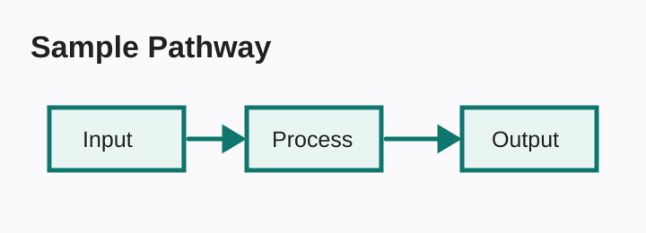
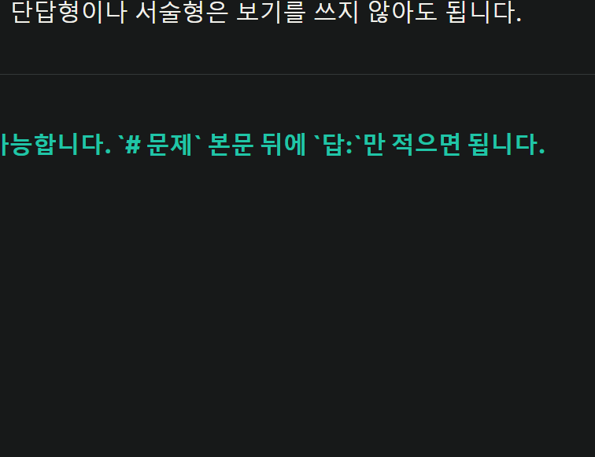
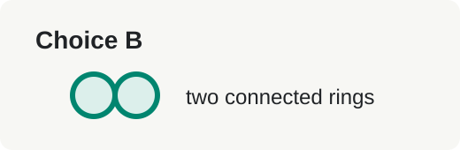
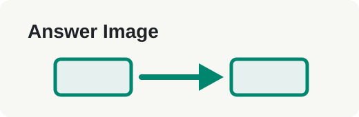

# 문제

텍스트 문제는 어떻게 작성하나요?

각 문제는 `# 문제` 구분선으로 시작하고, 실제 문제 텍스트는 바로 아래에 씁니다.
보기는 필요할 때만 `- 보기` 형태로 적습니다.

- # 문제
- ## 문제
- ### Answer

답: `# 문제`
출처: 샘플 문서

# 문제

이미지는 어떻게 넣나요?

이미지는 에디터에 붙여넣거나 드래그하면 자동으로 `assets/...` 링크로 들어갑니다.

위 그림에서 가운데 단계 이름은 무엇인가요?

- adsfadsf
sadfsadfads
adsf
- 다음보기~~
- 뿡뿡이

답: **Process**
출처: 샘플 이미지

# 문제

보기가 없는 문제도 가능한가요?

단답형이나 서술형은 보기를 쓰지 않아도 됩니다.

답: **가능합니다**. `# 문제` 아래 본문을 쓰고 `답:`만 적으면 됩니다.
출처: 샘플 문서

# 문제

암기 완료 처리는 언제 누르면 좋나요?

정답을 보기 전이라도 이미 외운 문항이면 바로 누를 수 있어야 합니다.

답: 언제든지 누를 수 있고, 나중에 해당 문항에서 복구할 수 있습니다.
출처: 샘플 문서

# 문제

보기와 답에 이미지가 있으면 어떻게 쓰나요?

아래처럼 `- 보기`로 시작한 뒤 여러 줄 설명이나 이미지를 이어서 쓰면 한 보기로 묶입니다.
정답을 열 때마다 보기 묶음 단위로 셔플됩니다.

- 보기 A
  이 보기에는 한 줄 설명이 더 있습니다.
  

- 보기 B
  이 보기는 이미지까지 포함된 다른 선택지입니다.
  

답: **보기 B**
출처: 샘플 문서

