# 문제
원핵생물 단백질 발현할 때 안정성과 거리가 먼 것은? (기출)

- 꼬리표(Tag)
- 샤페론
- 저온
- IPTG

답: ==IPTG==

[배경설명]
==원핵생물==은 세균 같은 단순한 세포이고, 재조합 단백질 발현은 세포 안에서 원하는 단백질을 만들게 하는 과정이다.
**단백질 안정성**은 단백질이 제대로 접히고, 잘 분해되지 않고, 기능을 유지하는지와 관련된다.
==꼬리표(Tag)==는 정제를 쉽게 하거나 일부 경우 용해도에 도움을 줄 수 있고, ==샤페론==은 단백질 접힘을 도와준다.
==저온==은 단백질이 천천히 만들어져 잘못 접히는 일을 줄일 수 있다.
==IPTG==는 발현을 켜는 ==유도물질==이다.
스위치를 켜는 역할이지 단백질 자체를 안정화하는 전략은 아니므로 안정성과 가장 거리가 멀다.

[보기해설]
O 꼬리표(Tag)
O 샤페론
O 저온
X ==IPTG== -> IPTG는 발현을 켜는 ==유도물질==이다. ==단백질 안정성== 자체를 높이는 전략은 아니다.

출처: G:\내 드라이브\여형준님\21 6-1\바이오공정개론\기말고사 정리자료\바이오공정개론 기말고사 2025.docx [객관식] 1번 + G:\내 드라이브\여형준님\21 6-1\바이오공정개론\기말고사 정리자료\바이오공정개론 기말고사 수업자료.pdf p.7
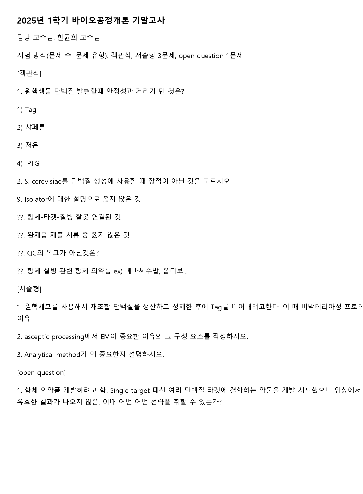
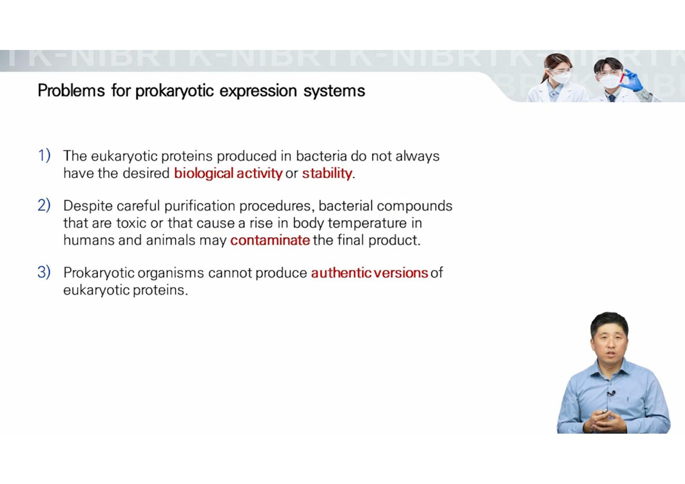

# 문제
효모(S. cerevisiae)를 단백질 생성에 사용할 때 장점이 아닌 것을 고르시오. (기출)

- 생화학, 유전학, 세포생물학 정보가 많이 알려져 모델 생물로 널리 쓰인다
- 비교적 단순한 배지에서 높은 세포 밀도까지 빠르게 자랄 수 있다
- 강한 발현 촉진 부위(promoter)와 2 μm 플라스미드(plasmid)를 발현 벡터 시스템에 활용할 수 있다
- 별도 유전공학적 개량(engineering) 없이 사람형 N-당쇄화(N-glycosylation)을 그대로 완성한다

답: 별도 ==유전공학적 개량(engineering)== 없이 사람형 ==N-당쇄화(N-glycosylation)==을 그대로 완성한다

[배경설명]
**효모(S. cerevisiae)**는 빵이나 맥주에 쓰이는 **효모**로, 세균보다 사람 세포에 조금 더 가까운 **진핵생물**이다.
그래서 세균보다 복잡한 단백질을 만들기 좋고, 연구가 많이 되어 있으며, 빨리 자란다.
강한 **발현 촉진 부위(promoter)**와 **플라스미드(plasmid)** 시스템을 활용할 수 있다는 점도 장점이다.
하지만 **당쇄**, 즉 **당쇄화(glycosylation)**은 사람 세포와 완전히 같지 않다.
사람형 **N-당쇄화(N-glycosylation)**을 그대로 만들려면 보통 별도 **유전공학적 개량(engineering)**이 필요하다.
따라서 "별도 **유전공학적 개량(engineering)** 없이 사람형 **당쇄**를 그대로 완성한다"는 설명은 장점이 아니라 틀린 설명이다.

[보기해설]
O 생화학, 유전학, 세포생물학 정보가 많이 알려져 모델 생물로 널리 쓰인다
O 비교적 단순한 배지에서 높은 세포 밀도까지 빠르게 자랄 수 있다
O 강한 발현 촉진 부위(promoter)와 2 μm 플라스미드(plasmid)를 발현 벡터 시스템에 활용할 수 있다
X 별도 유전공학적 개량(engineering) 없이 사람형 N-당쇄화(N-glycosylation)을 그대로 완성한다 -> 효모 당쇄는 사람형과 다를 수 있어 ==사람형 당쇄화 개량(humanized glycosylation engineering)==이 필요할 수 있다.

출처: G:\내 드라이브\여형준님\21 6-1\바이오공정개론\기말고사 정리자료\바이오공정개론 기말고사 2025.docx [객관식] 2번 + G:\내 드라이브\여형준님\21 6-1\바이오공정개론\기말고사 정리자료\바이오공정개론 기말고사 수업자료.pdf p.29, p.46

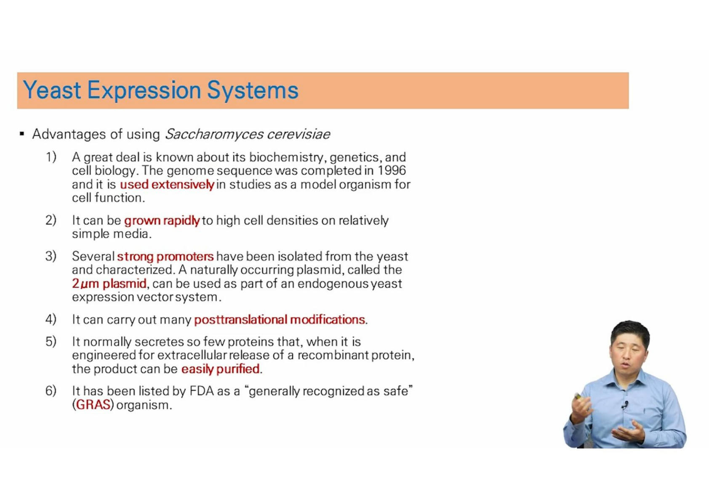
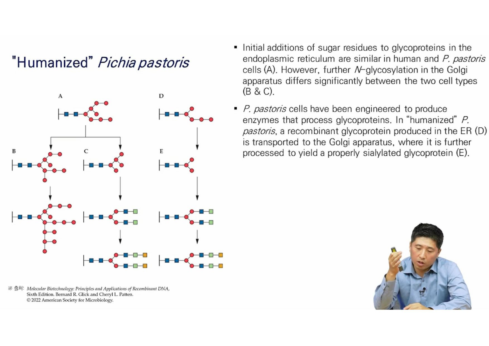

# 문제
아이솔레이터(Isolator)에 대한 설명으로 옳지 않은 것은? (기출)

- 에어락(Airlock)과 장갑(glove)을 이용해 작업자와 작업 챔버를 물리적으로 분리한다
- 헤파 여과(HEPA filtration)와 세척 가능한 표면으로 오염 관리에 유리하다
- 필요에 따라 음압 모드(negative pressure mode)를 적용할 수 있다
- 작업 중 문(door)을 열어 작업자가 핵심 무균구역(critical zone)에 직접 손을 넣는 방식이 기본이다

답: 작업 중 ==문(door)==를 열어 작업자가 ==핵심 무균구역(critical zone)==에 직접 손을 넣는 방식이 기본이다

[배경설명]
**아이솔레이터(Isolator)**는 말 그대로 제품이 있는 중요한 작업 공간을 바깥과 격리하는 장치이다.
**작업자**는 문을 열고 손을 직접 넣는 것이 아니라,
==장갑(glove)==, ==에어락(airlock)==, 헤파 필터 공기(HEPA-filtered air) 같은 장치를 통해 오염을 막으며 작업한다.
핵심 무균구역(Critical zone)은 제품이 노출되는 가장 중요한 무균 구역이다.
그래서 작업 중 문을 열고 직접 손을 넣는 방식은 아이솔레이터(isolator)의 기본 개념과 반대이다.
음압 모드(Negative pressure mode)는 독성 물질이나 생물학적 위험 물질이 밖으로 새지 않게 할 때 쓰일 수 있다.

[보기해설]
O 에어락(Airlock)과 장갑(glove)을 이용해 작업자와 작업 챔버를 물리적으로 분리한다
O 헤파 여과(HEPA filtration)와 세척 가능한 표면으로 오염 관리에 유리하다
O 필요에 따라 음압 모드(negative pressure mode)를 적용할 수 있다
X 작업 중 문(door)을 열어 작업자가 핵심 무균구역(critical zone)에 직접 손을 넣는 방식이 기본이다 -> 아이솔레이터(isolator)는 문(door) open 직접 작업이 아니라 ==장갑(glove)==와 ==에어락(airlock)==으로 격리 작업을 한다.

출처: G:\내 드라이브\여형준님\21 6-1\바이오공정개론\기말고사 정리자료\바이오공정개론 기말고사 2025.docx [객관식] 아이솔레이터(Isolator) 문항 + G:\내 드라이브\여형준님\21 6-1\바이오공정개론\기말고사 정리자료\바이오공정개론 기말고사 수업자료.pdf p.538, p.541

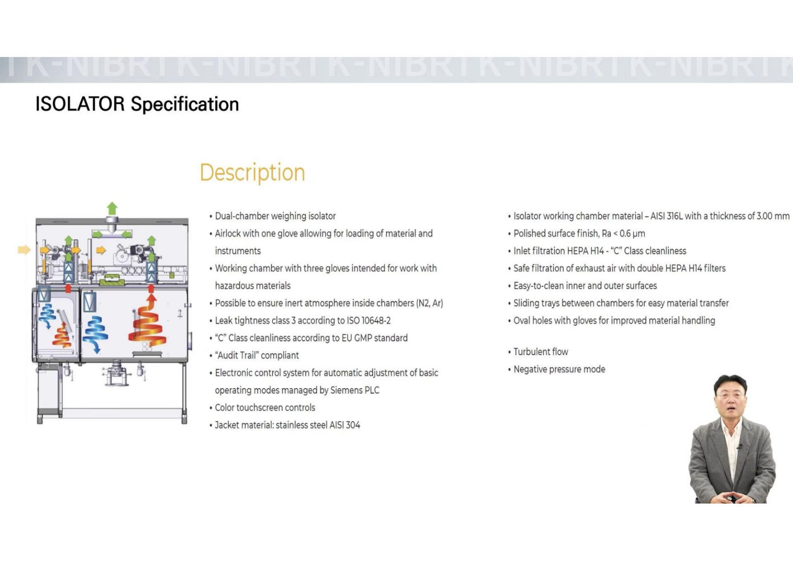
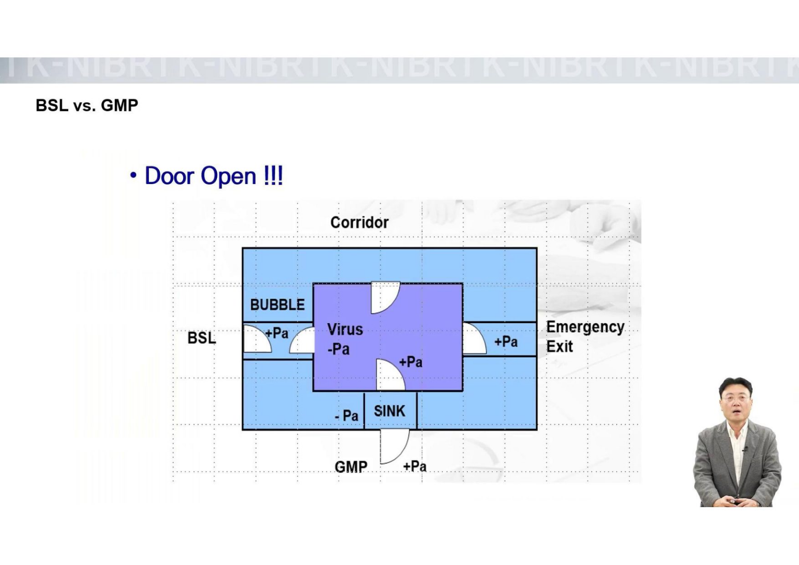

# 문제
항체의약품-표적-질병 연결로 잘못된 것은? (기출)

- 베바시주맙(Bevacizumab, Avastin)은 혈관내피성장인자(VEGF)를 막아 종양의 혈관 생성을 억제하는 항체의약품이다
- 옵디보(Opdivo, nivolumab)는 PD-1을 막아 T 세포의 항암 면역 반응을 다시 살리는 면역관문억제제이다
- 허셉틴(Herceptin, trastuzumab)은 HER2 양성 유방암 등에서 HER2를 표적으로 한다
- 베바시주맙(Bevacizumab)은 PD-1을 막아 T 세포 항암 면역을 직접 재활성화하는 약물이다

답: ==베바시주맙(Bevacizumab)은 PD-1을 막아 T 세포 항암 면역을 직접 재활성화하는 약물이다==

[배경설명]
이 문제는 항체의약품 이름, 표적, 질병 또는 작용전략을 짝짓는 문제이다.
**베바시주맙(Bevacizumab, Avastin)**은 **VEGF**를 막는다. VEGF는 종양이 새 혈관을 만들도록 돕는 신호라서, 베바시주맙은 **혈관생성 억제** 쪽으로 이해하면 된다.
**옵디보(Opdivo, nivolumab)**는 **PD-1**을 막는 면역관문억제제이다. T 세포가 암세포를 다시 공격하도록 도와주는 쪽이다.
**허셉틴(Herceptin, trastuzumab)**은 **HER2**를 표적으로 하는 항체의약품이다.
따라서 베바시주맙을 PD-1 면역관문억제제로 설명한 보기가 잘못된 연결이다. PD-1 쪽은 옵디보나 키트루다 계열로 잡으면 된다.

암기표:
- 베바시주맙(Bevacizumab, Avastin): VEGF 억제 -> 종양 혈관생성 억제
- 옵디보(Opdivo, nivolumab): PD-1 억제 -> T 세포 항암 면역 재활성화
- 키트루다(Keytruda, pembrolizumab): PD-1 억제 -> T 세포 항암 면역 재활성화
- 허셉틴(Herceptin, trastuzumab): HER2 표적 -> HER2 양성 유방암 등
- 휴미라(Humira, adalimumab): TNF-α 억제 -> 류마티스 관절염 같은 자가면역질환

[보기해설]
O 베바시주맙(Bevacizumab, Avastin)은 혈관내피성장인자(VEGF)를 막아 종양의 혈관 생성을 억제하는 항체의약품이다
O 옵디보(Opdivo, nivolumab)는 PD-1을 막아 T 세포의 항암 면역 반응을 다시 살리는 면역관문억제제이다
O 허셉틴(Herceptin, trastuzumab)은 HER2 양성 유방암 등에서 HER2를 표적으로 한다
X 베바시주맙(Bevacizumab)은 PD-1을 막아 T 세포 항암 면역을 직접 재활성화하는 약물이다 -> 베바시주맙은 VEGF 억제, 옵디보는 PD-1 억제이다.

출처: G:\내 드라이브\여형준님\21 6-1\바이오공정개론\기말고사 정리자료\바이오공정개론 기말고사 2025.docx [객관식] 항체-타겟-질병 문항 + 항체 질병 관련 항체 의약품 예시 문항 + G:\내 드라이브\여형준님\21 6-1\바이오공정개론\기말고사 정리자료\바이오공정개론 기말고사 수업자료.pdf p.271, p.275

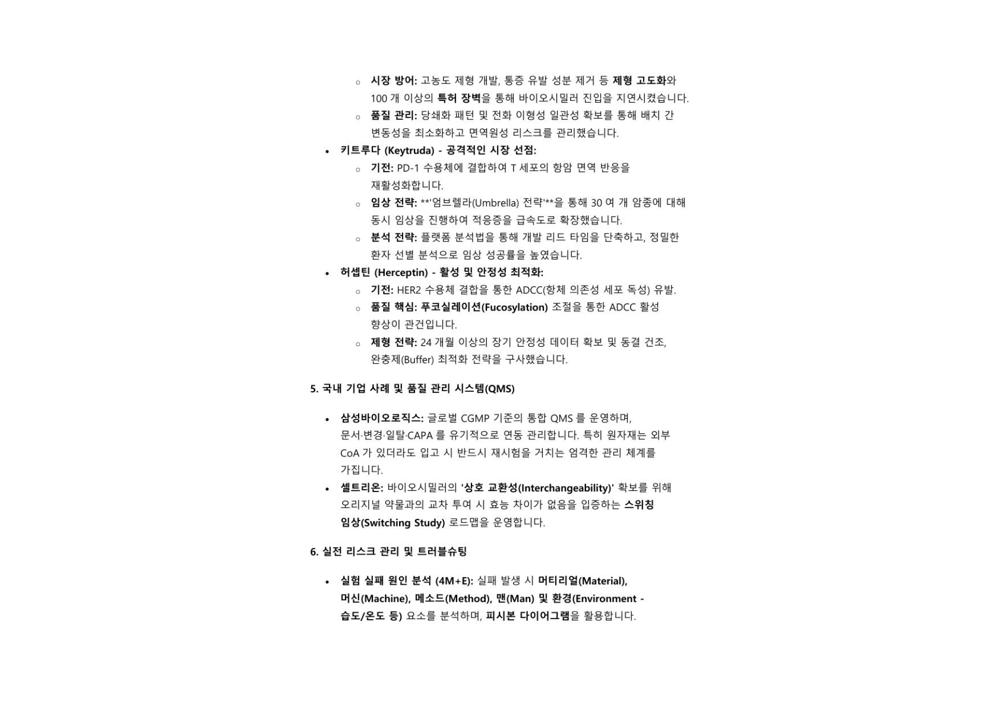
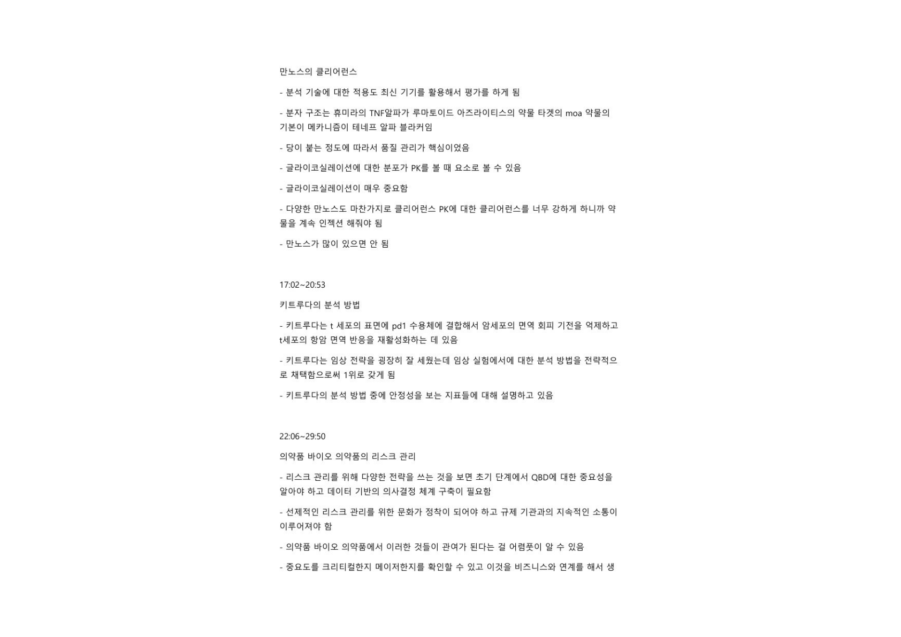
# 문제
완제품 제출 또는 배치 방출 관련 GMP 문서 설명으로 옳지 않은 것은? (기출)

- 시험기록서, 제조지시 및 기록서, 포장지시 및 기록서는 품질기록서(Quality Record)에 속한다
- 제품표준서는 동일한 수준의 제조와 품질관리를 위해 제조 및 품질관리 내용을 표준화한 문서이다
- QA는 제조, 포장, 출하, 시판 후 불만사항까지 제품 전주기를 관리한다
- 비통제문서만 있으면 시험기록서와 제조기록서를 대체해 완제품 방출 근거로 충분하다

답: ==비통제문서==만 있으면 ==시험기록서==와 ==제조기록서==를 대체해 ==완제품 방출== 근거로 충분하다

[배경설명]
**GMP**는 의약품을 항상 같은 품질로 만들기 위한 규칙이다.
그래서 "기억"이나 "대충 적은 문서"가 아니라 **통제된 공식 문서**와 기록이 필요하다.
**시험기록서**, **제조기록서**, **포장기록서**, **제품표준서** 같은 문서는 배치가 제대로 만들어졌는지 판단하는 근거가 된다.
**비통제문서**는 최신본인지, 승인된 내용인지, 누가 바꿨는지 추적하기 어렵다. 그래서 완제품 방출 근거를 대체할 수 없다.
이 문항은 문서 이름을 모두 외우기보다 "**GMP**에서는 공식 기록이 제품 방출의 근거"라는 원리를 잡으면 된다.

[보기해설]
O 시험기록서, 제조지시 및 기록서, 포장지시 및 기록서는 품질기록서(Quality Record)에 속한다
O 제품표준서는 동일한 수준의 제조와 품질관리를 위해 제조 및 품질관리 내용을 표준화한 문서이다
O QA는 제조, 포장, 출하, 시판 후 불만사항까지 제품 전주기를 관리한다
X 비통제문서만 있으면 시험기록서와 제조기록서를 대체해 완제품 방출 근거로 충분하다 -> 완제품 방출은 통제된 GMP 문서와 공식 기록을 근거로 해야 한다.

출처: G:\내 드라이브\여형준님\21 6-1\바이오공정개론\기말고사 정리자료\바이오공정개론 기말고사 2025.docx [객관식] 완제품 제출 서류 문항 + G:\내 드라이브\여형준님\21 6-1\바이오공정개론\기말고사 정리자료\바이오공정개론 기말고사 수업자료.pdf p.301, p.312, p.320

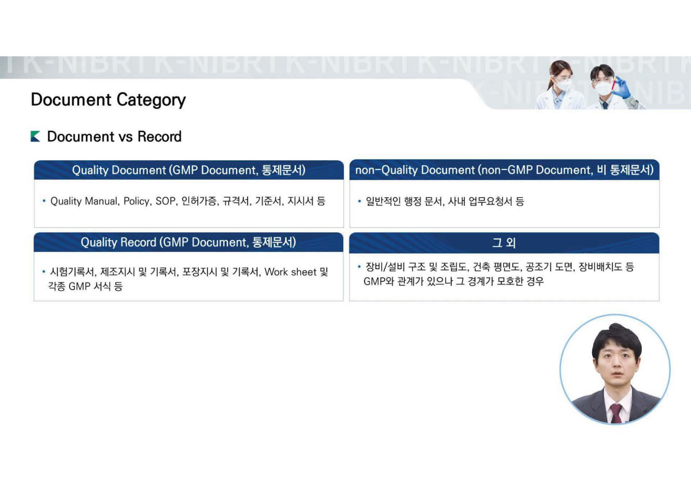
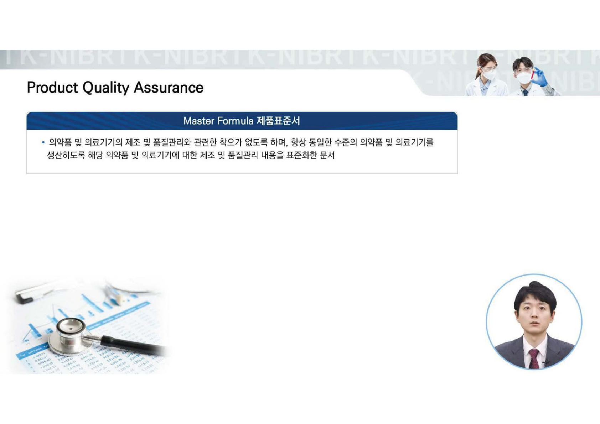
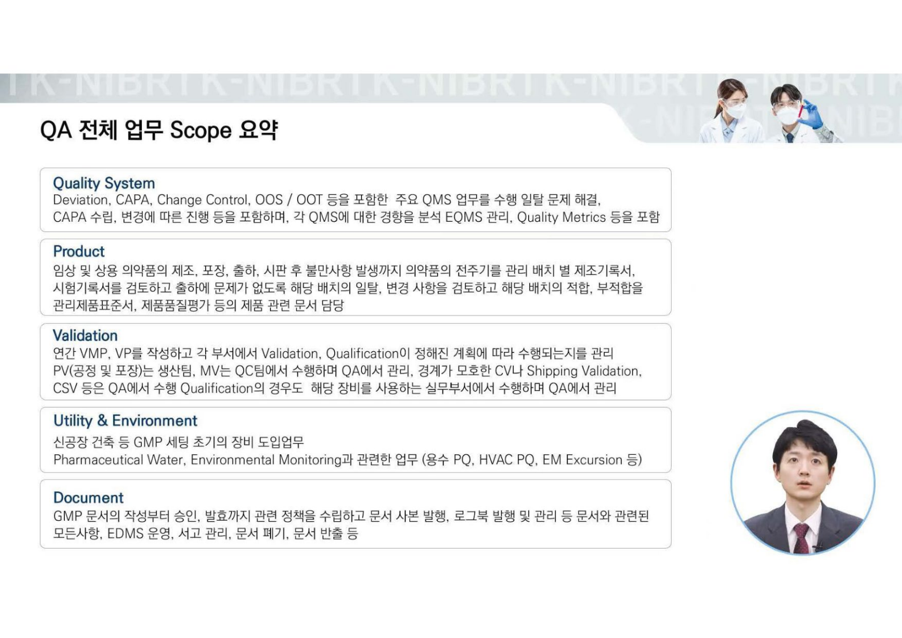

# 문제
QC의 목표가 아닌 것은? (기출)

- 품질(Quality)
- 안전성(Safety)
- 유효성(Efficacy)
- 여러 분야 협업(Multidisciplinary)

답: ==여러 분야 협업(Multidisciplinary)==

[배경설명]
**QC**는 품질관리(Quality Control)이다.
**바이오의약품**에서 **QC**의 핵심 목표는 제품이 품질, 안전성, 유효성을 만족하는지 확인하는 것이다.
품질(Quality)는 제품이 기준에 맞는지 보는 것이다.
안전성(Safety)는 환자에게 위험한 오염이나 불순물이 없는지 보는 것이다.
유효성(Efficacy)는 약효와 연결되는 특성이 유지되는지를 뜻한다.
같은 슬라이드의 분석 시험(analytical testing) 중요성은 이 목표를 실제 시험으로 확인하는 용도이다.
반드시 같이 볼 항목은 다음이다.
==공정 중 시험(process testing)==,
==출하 전 품질 시험(lot release testing)==,
==사용기간 설정을 위한 안정성 시험(stability test)==,
**환자 안전성**이다.
==여러 분야 협업(Multidisciplinary)==는 여러 분야가 함께 관여한다는 뜻이지 **QC**의 직접 목표가 아니다.

[보기해설]
O 품질(Quality)
O 안전성(Safety)
O 유효성(Efficacy)
X 여러 분야 협업(Multidisciplinary) -> 여러 분야 협업(Multidisciplinary)는 여러 분야가 함께 관여한다는 뜻이지 QC의 직접 목표가 아니다.

출처: G:\내 드라이브\여형준님\21 6-1\바이오공정개론\기말고사 정리자료\바이오공정개론 기말고사 2025.docx [객관식] QC 목표 문항 + G:\내 드라이브\여형준님\21 6-1\바이오공정개론\기말고사 정리자료\바이오공정개론 기말고사 수업자료.pdf p.266

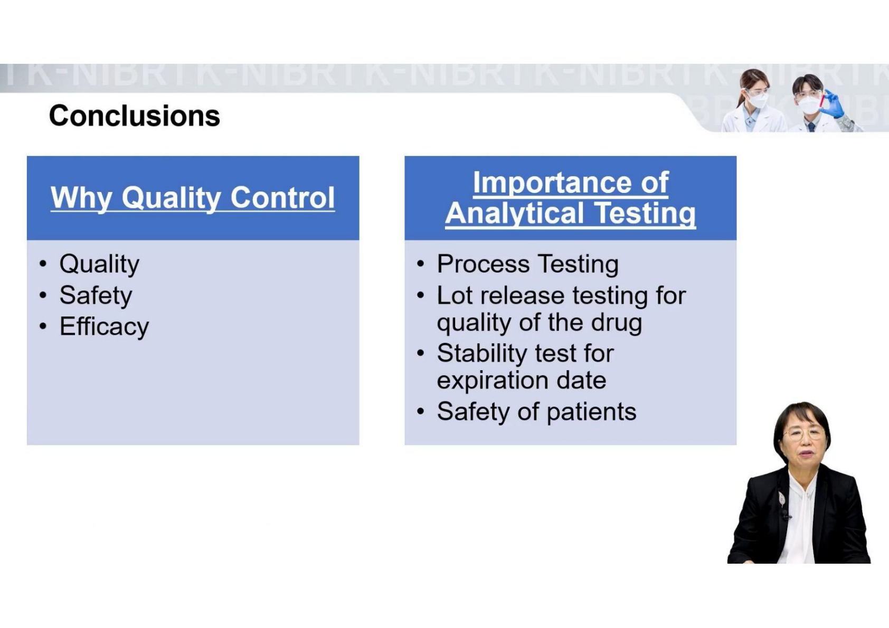

# 문제
원핵세포를 사용해서 재조합 단백질을 생산하고 정제한 후 꼬리표(Tag)를 떼어내려고 한다. 이때 비박테리아성 단백질분해효소(protease)를 쓰는 이유를 쓰시오. (기출)

답: **세균 유래 오염**을 줄이기 위해서이다.
최종 산물에 세균 유래 물질(bacterial compound)나 원치 않는 **세균성 단백질분해효소(bacterial protease)**가 남는 것을 막는다.

[배경설명]
**꼬리표(Tag)**는 단백질을 정제하기 쉽게 붙여 둔 꼬리표이고, **단백질분해효소(protease)**는 그 꼬리표를 잘라내는 가위 같은 효소이다.
시험 답안에서는 "왜 굳이 **비박테리아성 단백질분해효소(protease)**를 쓰는가"를 써야 하므로 **오염 관리**가 핵심이다.
세균 유래 물질이 남으면 최종 의약품의 **안전성(safety)** 문제가 될 수 있다.
그래서 세균 유래 물질(bacterial compound)와 원치 않는 ==세균성 단백질분해효소(bacterial protease)== 오염을 줄이기 위해,
**비박테리아성 단백질분해효소(protease)**를 쓴다고 정리하면 된다.
암기: **비박테리아성 단백질분해효소(protease)** = 세균 유래 오염을 줄여 순도와 안전성을 지키는 선택.

출처: G:\내 드라이브\여형준님\21 6-1\바이오공정개론\기말고사 정리자료\바이오공정개론 기말고사 2025.docx [서술형] 1번 + G:\내 드라이브\여형준님\21 6-1\바이오공정개론\기말고사 정리자료\바이오공정개론 기말고사 수업자료.pdf p.7

# 문제
무균공정(Aseptic processing)에서 환경 모니터링(EM)이 중요한 이유와 구성 요소를 작성하시오. (기출)

답:
이유: 무균공정에서는 제품을 마지막에 강하게 멸균하기 어렵기 때문에, 제조 환경의 오염 여부를 계속 확인해야 한다. 기준 이상 미생물이 나오면 어떤 균인지 확인하고, 어디서 들어왔는지 찾아 조치해야 한다.
따라서 EM, 즉 **환경 모니터링(Environmental Monitoring)** 이 중요하다.
구성 요소(자료 기준):
**부유입자 모니터링**: 공기 중 떠다니는 먼지/입자 확인
**부유균 모니터링**: 공기 중 떠다니는 살아 있는 미생물 확인
**낙하균 모니터링**: 공기 중에서 떨어져 내려앉는 미생물 확인
**표면균 모니터링**: 작업대나 장비 표면에 묻은 미생물 확인
추가로 자료 표에서는 **작업자/장갑/가운 샘플링**도 함께 다룬다.

[배경설명]
==무균공정(Aseptic processing)==은 제품을 마지막에 세게 멸균하기 어려운 상황에서 쓰인다.
제조 중 오염이 들어오지 않게 관리하는 방식이다.
EM은 ==환경 모니터링(Environmental Monitoring)==, 즉 작업 **환경**을 계속 감시하는 것이다.
무균공정에서는 눈에 보이지 않는 작은 먼지나 미생물이 제품을 오염시킬 수 있다.
그래서 EM은 "이미 오염된 제품을 나중에 고치는 것"이 아니라, 오염 가능성을 **제조 중에 계속 찾아내는 안전망**이다.
==부유입자==는 공기 중 떠다니는 먼지/입자이고,
==부유균==은 공기 중 떠다니는 살아 있는 미생물이다.
==낙하균==은 공기 중에 있다가 바닥이나 배지 위로 떨어지는 미생물이고,
==표면균==은 작업대나 장비 표면에 묻은 미생물이다.
자료 표에는 작업자 샘플링, 특히 장갑/가운 검사도 나오므로, 여유가 있으면 같이 적으면 좋다.
암기: EM = **부유입자, 부유균, 낙하균, 표면균**을 보는 ==제조환경 오염 감시==.

출처: G:\내 드라이브\여형준님\21 6-1\바이오공정개론\기말고사 정리자료\바이오공정개론 기말고사 2025.docx [서술형] 2번 + G:\내 드라이브\여형준님\21 6-1\바이오공정개론\기말고사 정리자료\바이오공정개론 기말고사 수업자료.pdf p.334, p.336, p.514

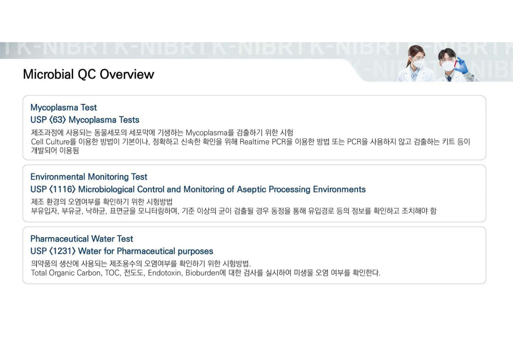
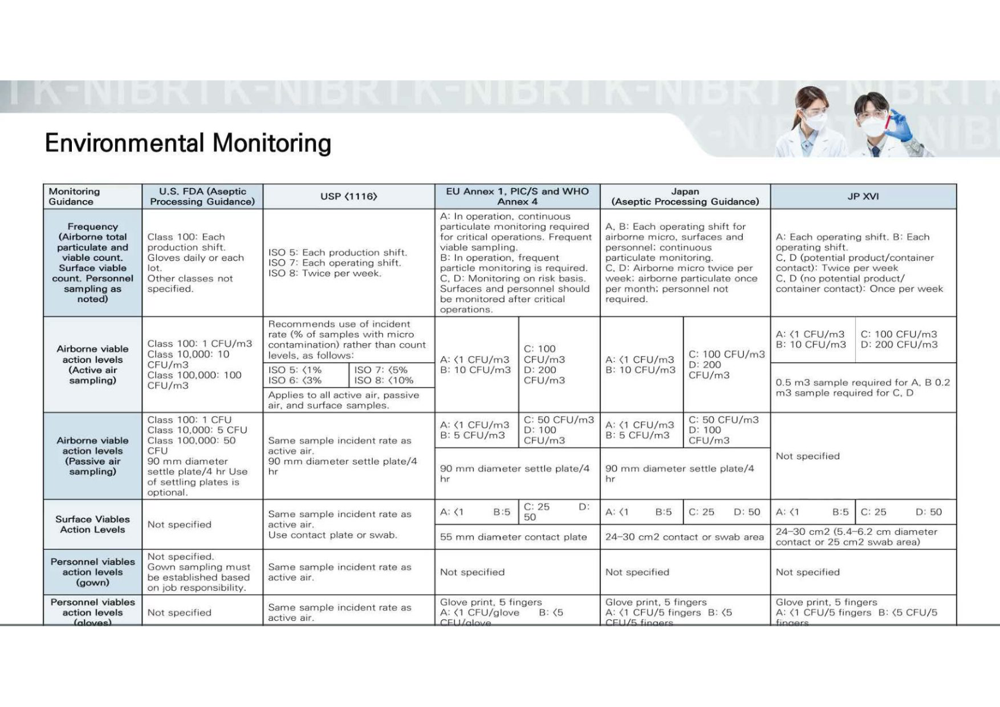
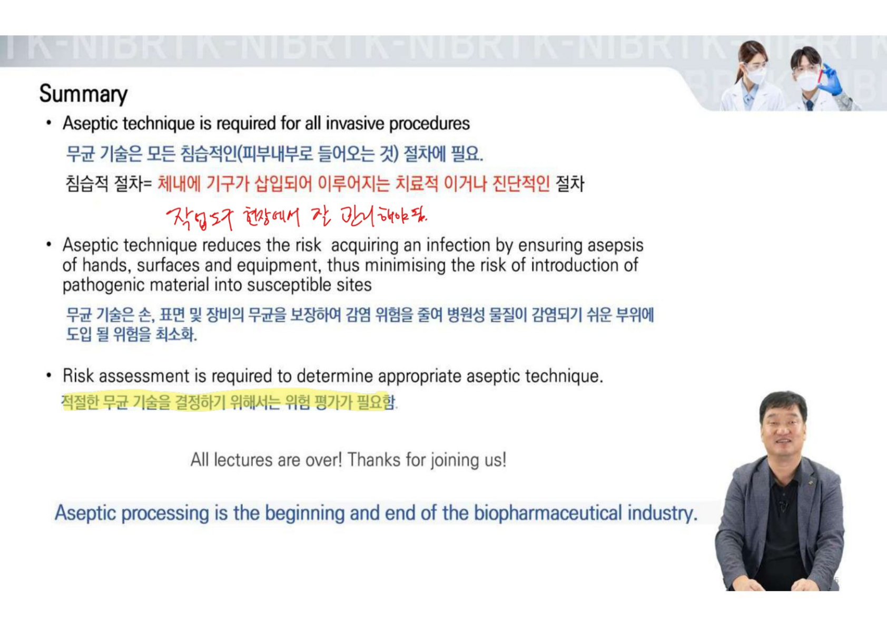

# 문제
분석법(Analytical method)이 왜 중요한지 설명하시오. (기출)

답: 제품의 **품질(quality), 안전성(safety), 유효성(efficacy)**를 객관적으로 확인하기 위해 필요하다
공정 중 시험, 출하 전 시험(lot release), 안정성 시험(stability test), 환자 안전성(patient safety)의 판단 근거가 되기 때문이다
시험법 자체가 검증되어야 결과를 믿을 수 있기 때문이다

[배경설명]
**분석법(Analytical method)**는 쉽게 말해 "제품을 검사하는 시험법"이다.
**바이오의약품**은 모양이 복잡하고 작은 변화도 약효나 안전성에 영향을 줄 수 있어서, 그냥 눈으로 보고 괜찮다고 할 수 없다.
**공정 중간**, **완제품 출하**, **보관 중 안정성** 평가에서 분석법으로 제품이 기준에 맞는지 확인한다.
분석법 자체도 믿을 수 있어야 하므로, 원하는 물질만 잘 보는지 확인해야 한다.
정확한지, 반복하면 비슷한 값이 나오는지 같은 밸리데이션(validation)도 필요하다.
암기: **분석법(Analytical method)** = ==품질(quality), 안전성(safety), 유효성(efficacy)==를 숫자와 시험으로 확인하는 도구.

출처: G:\내 드라이브\여형준님\21 6-1\바이오공정개론\기말고사 정리자료\바이오공정개론 기말고사 2025.docx [서술형] 3번 + G:\내 드라이브\여형준님\21 6-1\바이오공정개론\기말고사 정리자료\바이오공정개론 기말고사 수업자료.pdf p.266, p.267, p.340, p.341

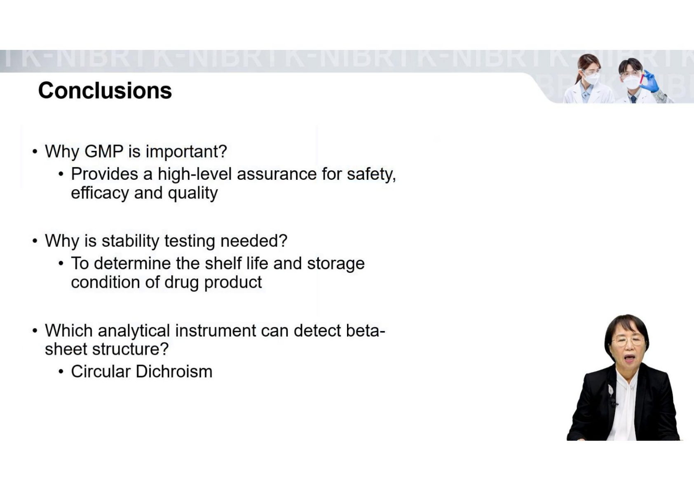
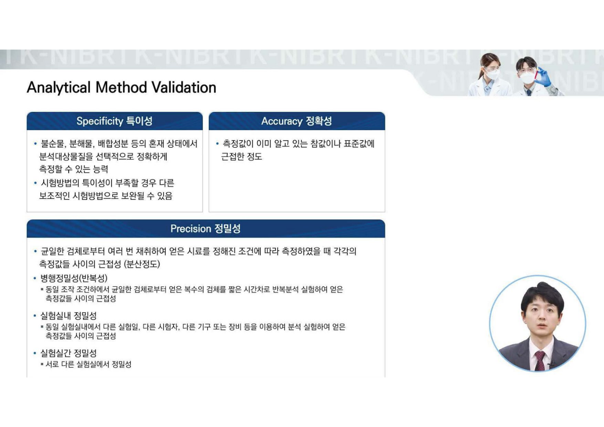
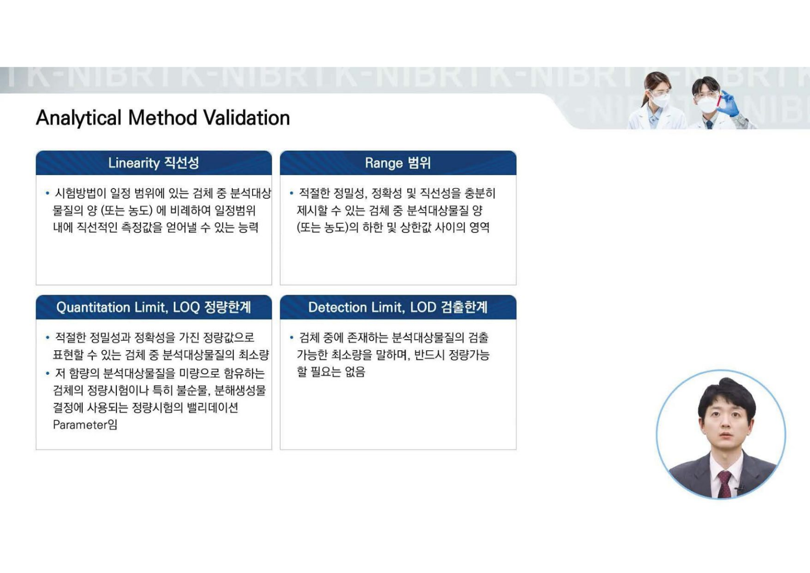

# 문제
항체 의약품 개발에서 단일 표적(single target) 대신 여러 단백질 표적(target)에 결합하는 약물을 개발했으나 임상에서 유효한 결과가 나오지 않았다. 이때 취할 수 있는 전략을 쓰시오. (기출)

답: **표적(target) 조합이 질병 기전과 맞는지 재검토**한다.
**생체표지자(biomarker)** 또는 정밀 환자 선별 분석으로 반응할 환자군을 다시 정한다.
실패 원인을 **물질, 장비, 방법, 사람, 환경(5M)** 관점에서 분석한다.
결과에 따라 표적 조합을 줄이거나 바꾸고, 필요하면 **단일 표적 전략, 병용요법, 다른 항체 전략**으로 재설계한다.

[배경설명]
단일 표적(single target)은 한 표적만 노리는 전략이고, 다중 표적(multi-target)은 여러 표적을 동시에 노리는 전략이다.
하지만 표적이 많다고 무조건 효과가 좋아지는 것은 아니다.
임상에서 실패했다면 먼저 "이 표적 조합이 실제 질병을 움직이는 핵심인가?"를 다시 봐야 한다.
또 모든 환자가 같은 표적을 가진 것은 아니므로, **생체표지자(biomarker)**나 정밀 분석으로 반응할 환자군을 다시 골라야 한다.
자료에서는 실패 원인 분석을 할 때 물질(Material), 장비(Machine), 방법(Method), 사람(Man), 환경(Environment)을 보라고 설명한다.
그래서 답안은 표적 조합 재검토, 환자군 재선별, 실패 원인 분석, 전략 재설계 순서로 쓰면 된다.
암기: ==표적 조합 재검토== → ==환자군 재선별== → ==5M 실패 원인 분석== → 표적/병용 전략 재설계.

출처: G:\내 드라이브\여형준님\21 6-1\바이오공정개론\기말고사 정리자료\바이오공정개론 기말고사 2025.docx [open question] 1번 + G:\내 드라이브\여형준님\21 6-1\바이오공정개론\기말고사 정리자료\바이오공정개론 기말고사 수업자료.pdf p.271, p.272

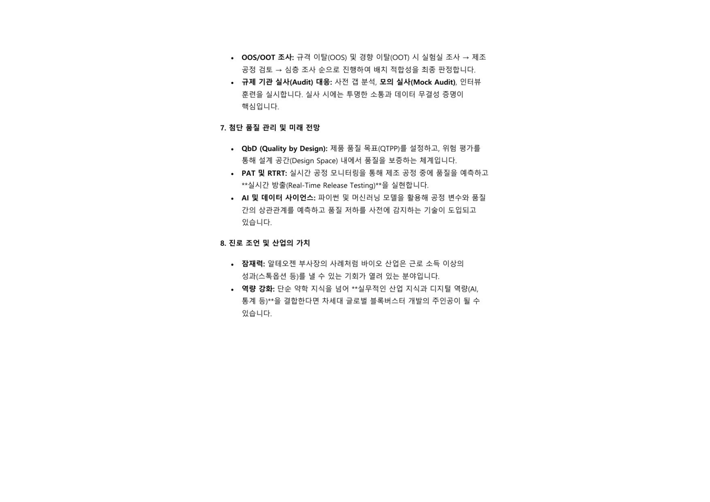

# 문제
바이오의약품 QC에서 핵심품질특성(CQA)과 영향 설명으로 옳은 것을 모두 고르시오.

- 당쇄화(Glycosylation)는 몸 밖 제거 속도(clearance)와 반감기(half-life)에 영향을 줄 수 있다
- 응집(Aggregation)은 안정성 문제와 면역반응 위험(immunogenicity risk)으로 이어질 수 있다
- 전하 변이체(Charge variants)는 PK 변화와 연결될 수 있다
- 숙주세포단백질(HCP)/DNA 잔류 확인은 안전성(safety) 확보와 관련된다
- 핵심품질특성(CQA)은 제품 색깔만 의미하므로 유효성(efficacy)이나 안전성(safety)과는 관련이 없다

답: 당쇄화(Glycosylation)는 ==몸 밖 제거 속도(clearance)==와 반감기(half-life)에 영향을 줄 수 있다
응집(Aggregation)은 안정성 문제와 ==면역반응 위험(immunogenicity risk)==로 이어질 수 있다
전하 변이체(Charge variants)는 ==PK== 변화와 연결될 수 있다
숙주세포단백질(HCP)/DNA 잔류 확인은 안전성(safety) 확보와 관련된다

[배경설명]
==핵심품질특성(CQA)==는 **중요 품질 특성(Critical Quality Attribute)**, 즉 제품의 품질을 좌우하는 중요한 특성이다.
**당쇄화(Glycosylation)**은 단백질에 붙은 당 구조이고, 몸에서 얼마나 빨리 제거되는지나 반감기에 영향을 줄 수 있다.
**응집(Aggregation)**은 단백질끼리 뭉치는 현상이라 안정성을 떨어뜨리고 면역반응 위험을 높일 수 있다.
전하 변이체(Charge variants)는 같은 단백질이라도 전하가 달라진 형태이고, ==PK==나 활성에 영향을 줄 수 있다.
**숙주세포단백질(HCP)**는 생산세포에서 나온 단백질 불순물, DNA 잔류물은 생산세포에서 온 불순물이므로 **안전성(safety)**와 연결된다.

[보기해설]
O 당쇄화(Glycosylation)는 몸 밖 제거 속도(clearance)와 반감기(half-life)에 영향을 줄 수 있다
O 응집(Aggregation)은 안정성 문제와 면역반응 위험(immunogenicity risk)으로 이어질 수 있다
O 전하 변이체(Charge variants)는 PK 변화와 연결될 수 있다
O 숙주세포단백질(HCP)/DNA 잔류 확인은 안전성(safety) 확보와 관련된다
X ==핵심품질특성(CQA)==는 제품 색깔만 의미하므로 유효성(efficacy)이나 안전성(safety)과는 관련이 없다 -> ==핵심품질특성(CQA)==는 품질·안전성·유효성에 영향을 주는 중요한 품질 특성이다.

출처: G:\내 드라이브\여형준님\21 6-1\바이오공정개론\기말고사 정리자료\바이오공정개론 기말고사 수업자료.pdf p.269, p.275
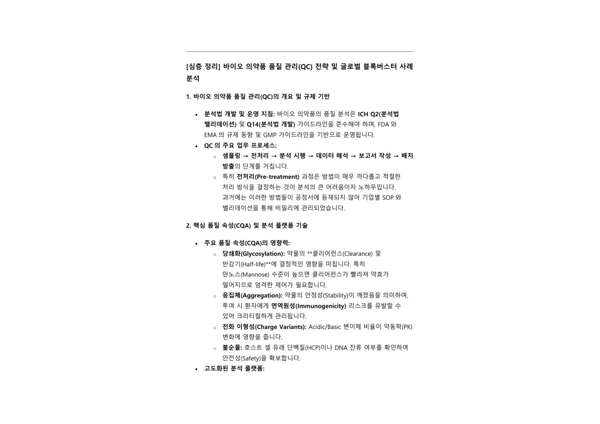

# 문제
분석 플랫폼과 용도의 연결로 옳은 것을 모두 고르시오.

- 크기배제크로마토그래피(SEC)는 단일체(monomer), 이량체(dimer), 응집체(aggregate)를 크기별로 분리한다
- 역상 펩타이드 지도분석(RP peptide mapping)은 효소로 단백질을 자른 뒤 펩타이드(peptide) 조각을 분리·동정한다
- 질량분석(MS/MS)은 전체 단백질(intact) 분석이나 펩타이드 서열(peptide sequence) 분석으로 번역후변형(PTM) 위치 정보를 얻는 데 쓸 수 있다
- 효소면역분석법(ELISA)은 항원-항체 반응을 이용해 PK 분석이나 역가 측정에 쓸 수 있다
- 다속성 분석법(MAM)은 여러 품질 속성을 한 번의 분석에서 동시에 정량화하는 전략이다
- 크기배제크로마토그래피(SEC)는 효소면역분석법(ELISA)와 동일하게 항원-항체 결합만을 이용하는 시험이다

답: ==크기배제크로마토그래피(SEC)==는 ==단일체(monomer)==, ==이량체(dimer)==, ==응집체(aggregate)==를 크기별로 분리한다
역상 펩타이드 지도분석(RP peptide mapping)은 효소로 단백질을 자른 뒤 펩타이드(peptide) 조각을 분리·동정한다
질량분석(MS/MS)은 전체 단백질(intact) 분석이나 펩타이드 서열(peptide sequence) 분석으로 번역후변형(PTM) 위치 정보를 얻는 데 쓸 수 있다
효소면역분석법(ELISA)은 항원-항체 반응을 이용해 ==PK== 분석이나 역가 측정에 쓸 수 있다
다속성 분석법(MAM)은 여러 품질 속성을 한 번의 분석에서 동시에 정량화하는 전략이다

[배경설명]
분석 플랫폼은 제품을 보는 도구이다. 도구마다 보는 대상이 다르다.
**크기배제크로마토그래피(SEC)**는 **Size Exclusion Chromatography**라서 크기 차이로 단백질을 나눈다.
그래서 **단일체**, **이량체**, **응집체(aggregate)** 확인에 좋다.
**펩타이드 지도분석(Peptide mapping)**은 단백질을 작은 **펩타이드(peptide) 조각**으로 잘라 지도처럼 확인하는 방식이다.
질량분석(MS/MS)은 질량분석이라 펩타이드 서열(peptide sequence)이나 번역후변형(PTM) 위치를 더 자세히 볼 수 있다.
효소면역분석법(ELISA)은 항원-항체 결합을 이용한다.
다속성 분석법(MAM)은 여러 품질 속성을 한 번에 추적하는 접근이다.
**크기배제크로마토그래피(SEC)**가 효소면역분석법(ELISA)와 같은 원리라는 보기는 틀리다.

[보기해설]
O 크기배제크로마토그래피(SEC)는 단일체(monomer), 이량체(dimer), 응집체(aggregate)를 크기별로 분리한다
O 역상 펩타이드 지도분석(RP peptide mapping)은 효소로 단백질을 자른 뒤 펩타이드(peptide) 조각을 분리·동정한다
O 질량분석(MS/MS)은 전체 단백질(intact) 분석이나 펩타이드 서열(peptide sequence) 분석으로 번역후변형(PTM) 위치 정보를 얻는 데 쓸 수 있다
O 효소면역분석법(ELISA)은 항원-항체 반응을 이용해 PK 분석이나 역가 측정에 쓸 수 있다
O 다속성 분석법(MAM)은 여러 품질 속성을 한 번의 분석에서 동시에 정량화하는 전략이다
X 크기배제크로마토그래피(SEC)는 효소면역분석법(ELISA)와 동일하게 항원-항체 결합만을 이용하는 시험이다 -> 크기배제크로마토그래피(SEC)는 크기별 분리이고, 항원-항체 결합 원리는 효소면역분석법(ELISA) 쪽이다.

출처: G:\내 드라이브\여형준님\21 6-1\바이오공정개론\기말고사 정리자료\바이오공정개론 기말고사 수업자료.pdf p.270
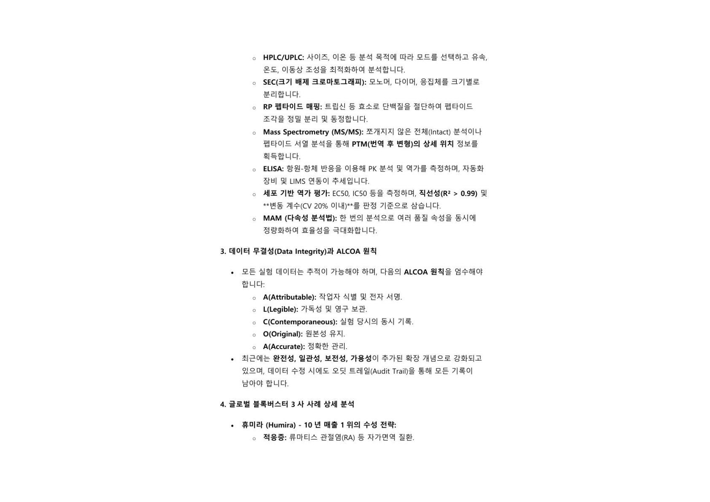

# 문제
데이터 무결성(Data Integrity) 설명으로 옳은 것을 모두 고르시오.

- ALCOA는 작성자 추적 가능(Attributable), 읽을 수 있음(Legible), 즉시 기록(Contemporaneous), 원본성(Original), 정확성(Accurate)를 의미한다
- CCEA는 완전성(Complete), 일관성(Consistent), 보존성(Enduring), 가용성(Available)을 의미한다
- 감사 추적 기록(Audit trail)은 데이터 수정 이력을 남기는 데 중요하다
- 데이터 무결성(Data Integrity)에서는 원본성과 작성자 추적성이 중요하다
- 최종 숫자만 맞으면 누가 언제 데이터를 만들고 고쳤는지는 중요하지 않다

답: ALCOA는 작성자 추적 가능(Attributable), 읽을 수 있음(Legible), 즉시 기록(Contemporaneous), ==원본성(Original)==, 정확성(Accurate)를 의미한다
CCEA는 완전성(Complete), 일관성(Consistent), 보존성(Enduring), 가용성(Available)을 의미한다
감사 추적 기록(Audit trail)은 데이터 수정 이력을 남기는 데 중요하다
데이터 무결성(Data Integrity)에서는 원본성과 작성자 추적성이 중요하다

[배경설명]
**데이터 무결성(Data Integrity)**는 시험 데이터와 제조 기록을 믿을 수 있게 만드는 원칙이다.
**작성자 추적 가능(Attributable)**은 누가 했는지 알 수 있다는 뜻이고, 읽을 수 있음(Legible)은 읽을 수 있어야 한다는 뜻이다.
**즉시 기록(Contemporaneous)**는 바로 그때 기록했다는 뜻이다.
==원본성(Original)==은 원본성이 있어야 한다는 뜻이며, **정확성(Accurate)**는 정확해야 한다는 뜻이다.
감사 추적 기록(Audit trail)은 데이터를 누가 언제 만들고 수정했는지 남기는 기록이다.
의약품 품질 판단은 기록을 근거로 하므로, 최종 숫자만 맞고 과정 추적이 안 되면 안 된다.

[보기해설]
O ALCOA는 작성자 추적 가능(Attributable), 읽을 수 있음(Legible), 즉시 기록(Contemporaneous), 원본성(Original), 정확성(Accurate)를 의미한다
O CCEA는 완전성(Complete), 일관성(Consistent), 보존성(Enduring), 가용성(Available)을 의미한다
O 감사 추적 기록(Audit trail)은 데이터 수정 이력을 남기는 데 중요하다
O 데이터 무결성(Data Integrity)에서는 원본성과 작성자 추적성이 중요하다
X 최종 숫자만 맞으면 누가 언제 데이터를 만들고 고쳤는지는 중요하지 않다 -> GMP 데이터는 최종값뿐 아니라 생성·수정 이력까지 추적 가능해야 한다.

출처: G:\내 드라이브\여형준님\21 6-1\바이오공정개론\기말고사 정리자료\바이오공정개론 기말고사 수업자료.pdf p.299, p.300
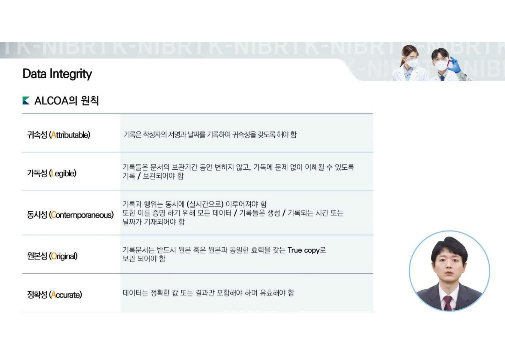
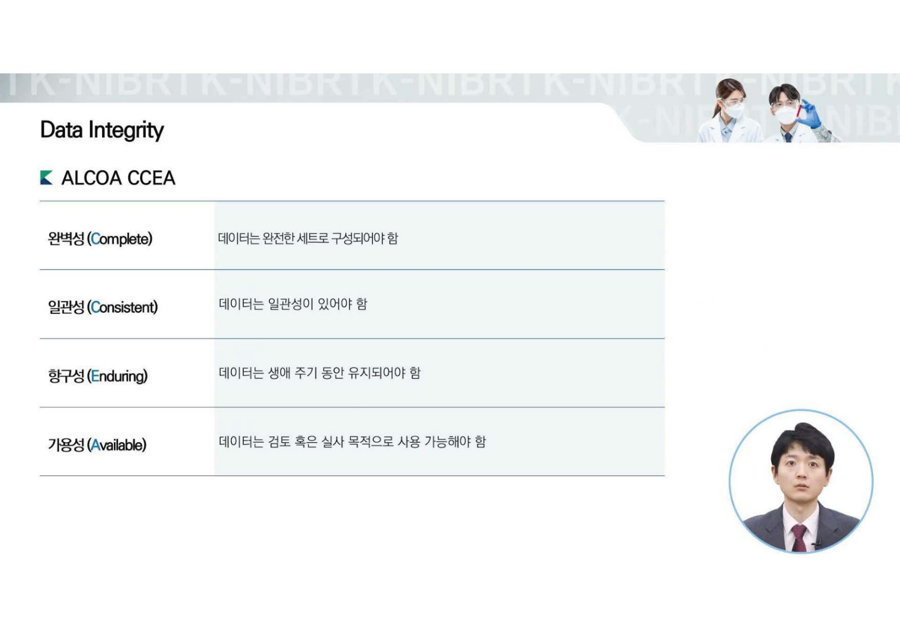

# 문제
GMP의 4W1H와 6Ps for 2Ps 설명으로 옳은 것을 모두 고르시오.

- Who는 personnel과 연결된다
- Where는 GMP 시설(GMP facility)와 연결된다
- How는 시험계획서(protocol)과 표준작업절차서(SOP)와 연결된다
- 6Ps는 사람, 시설, 공정, 제품, 절차, 문서(people, premises, processes, products, procedures, paperwork)를 관리해 환자(patient)와 제품(product)를 보호하는 개념이다
- GMP 문서화는 숙련자가 작업할 때는 생략해도 된다

답: ==Who==는 ==personnel==과 연결된다
Where는 GMP 시설(GMP facility)와 연결된다
How는 시험계획서(protocol)과 표준작업절차서(SOP)와 연결된다
6Ps는 사람, 시설, 공정, 제품, 절차, 문서(people, premises, processes, products, procedures, paperwork) 관리이다
목적은 환자(patient)와 제품(product) 보호이다

[배경설명]
**GMP**는 좋은 의약품을 우연히 한 번 만드는 것이 아니라, 매번 같은 품질로 만들기 위한 체계이다.
**4W1H**는 누가, 무엇을, 언제, 어디서, 어떻게 했는지 관리하는 틀이다.
**6Ps**는 사람, 시설, 공정, 제품, 절차, 문서를 뜻하고, 결국 **환자**와 **제품**를 보호하려는 목적이다.
숙련자가 작업해도 문서화는 생략할 수 없다. **GMP**에서는 "했다"보다 "기록으로 증명된다"가 중요하다.

[보기해설]
O Who는 personnel과 연결된다
O Where는 GMP 시설(GMP facility)와 연결된다
O How는 시험계획서(protocol)과 표준작업절차서(SOP)와 연결된다
O 6Ps는 사람, 시설, 공정, 제품, 절차, 문서(people, premises, processes, products, procedures, paperwork)를 관리해 환자(patient)와 제품(product)를 보호하는 개념이다
X GMP 문서화는 숙련자가 작업할 때는 생략해도 된다 -> 숙련자라도 GMP에서는 작업을 기록으로 증명해야 한다.

출처: G:\내 드라이브\여형준님\21 6-1\바이오공정개론\기말고사 정리자료\바이오공정개론 기말고사 수업자료.pdf p.296, p.297
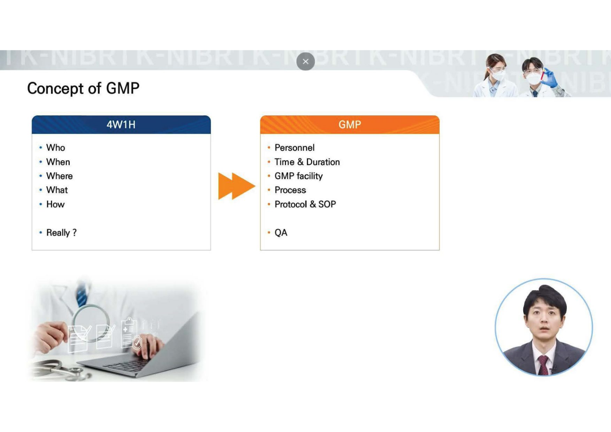
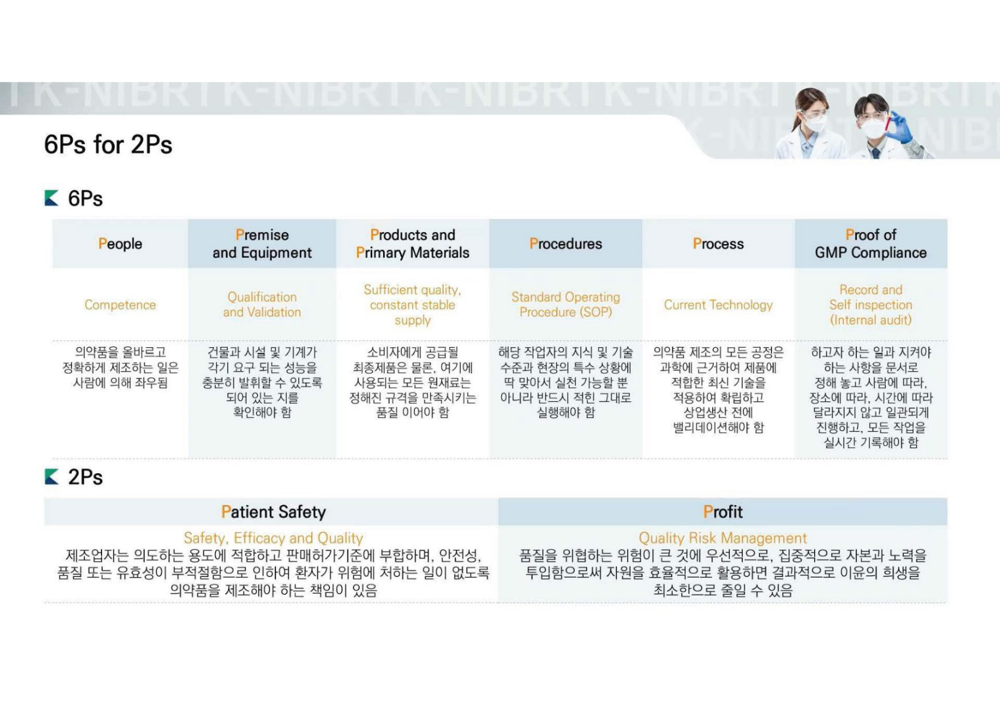

# 문제
밸리데이션(Validation)과 적격성평가(Qualification) 설명으로 옳은 것을 모두 고르시오.

- 밸리데이션(Validation)은 공정, 방법, 설비 또는 시스템이 기준에 맞는 결과를 일관되게 내는지 검증하고 문서화하는 것이다
- 적격성평가(Qualification)은 설비나 시스템이 목적에 맞게 설치·운전·성능을 낼 수 있음을 확인하는 활동이다
- 둘 다 계획, 수행, 결과 기록과 문서화가 중요하다
- 밸리데이션(Validation)의 핵심은 한 번만 성공하면 이후 결과가 달라도 괜찮다는 뜻이다

답: ==밸리데이션(Validation)==은 공정, 방법, 설비 또는 시스템이 기준에 맞는 결과를 ==일관되게== 내는지 검증하고 ==문서화==하는 것이다
적격성평가(Qualification)은 설비나 시스템이 목적에 맞게 설치·운전·성능을 낼 수 있음을 확인하는 활동이다
둘 다 계획, 수행, 결과 기록과 문서화가 중요하다

[배경설명]
**밸리데이션(Validation)**은 "이 공정이나 시험법이 계속 믿을 만한 결과를 내는가"를 확인하는 개념이다.
**적격성평가(Qualification)**은 특히 **장비**나 시설, 시스템이 의도한 용도에 맞게 설치되고 작동하고 성능을 내는지 확인하는 쪽이다.
둘 다 **GMP**에서 말로 끝나면 안 되고, 승인된 계획과 결과 기록이 있어야 한다.
한 번 성공했으니 이후 결과가 달라도 된다는 설명은 밸리데이션(validation)의 "일관성"과 반대이다.

[보기해설]
O 밸리데이션(Validation)은 공정, 방법, 설비 또는 시스템이 기준에 맞는 결과를 일관되게 내는지 검증하고 문서화하는 것이다
O 적격성평가(Qualification)은 설비나 시스템이 목적에 맞게 설치·운전·성능을 낼 수 있음을 확인하는 활동이다
O 둘 다 계획, 수행, 결과 기록과 문서화가 중요하다
X 밸리데이션(Validation)의 핵심은 한 번만 성공하면 이후 결과가 달라도 괜찮다는 뜻이다 -> 밸리데이션(validation)은 반복해서 기준에 맞는 결과를 일관되게 내는지 확인하는 것이다.

출처: G:\내 드라이브\여형준님\21 6-1\바이오공정개론\기말고사 정리자료\바이오공정개론 기말고사 수업자료.pdf p.302
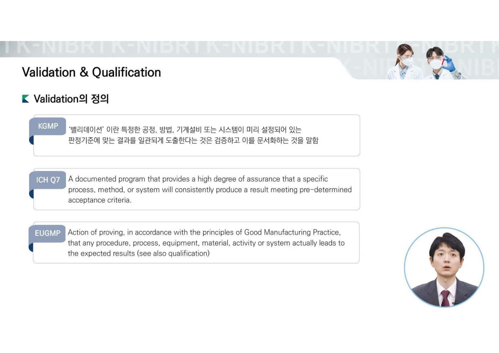

# 문제
일탈(Deviation)과 시정예방조치(CAPA) 설명으로 옳은 것을 모두 고르시오.

- 일탈(Deviation)은 승인된 지시서나 정해진 기준(established standard)에서 벗어난 상태이다
- 시정예방조치(CAPA)는 시정조치(corrective action)과 예방조치(preventive action)을 세우고 효과를 확인하는 체계이다
- 중요한 품질 문제는 원인, 조치, 효과 확인까지 문서화되어야 한다
- 시정예방조치(CAPA)는 문제가 재발해도 원인 분석 없이 문서만 닫는 절차이다

답: ==일탈(Deviation)==은 승인된 지시서나 ==정해진 기준(established standard)==에서 벗어난 상태이다
시정예방조치(CAPA)는 ==시정조치(corrective action)==과 ==예방조치(preventive action)==을 세우고 효과를 확인하는 체계이다
중요한 품질 문제는 원인, 조치, 효과 확인까지 문서화되어야 한다

[배경설명]
==일탈(Deviation)==은 정해진 절차나 기준에서 벗어난 일이다.
예를 들어 표준작업절차서(SOP)와 다르게 작업했거나 기준 밖 결과가 나온 경우이다.
**시정예방조치(CAPA)**는 문제를 그냥 덮는 문서가 아니다.
이미 생긴 문제를 고치는 ==시정조치(corrective action)==과,
다시 생기지 않게 막는 ==예방조치(preventive action)==을 포함한다.
중요한 것은 원인 분석, 조치, 효과 확인이다. 효과 확인이 없으면 같은 문제가 반복될 수 있다.
그래서 **시정예방조치(CAPA)**를 원인 분석 없이 문서만 닫는 절차라고 보는 것은 틀리다.

[보기해설]
O 일탈(Deviation)은 승인된 지시서나 정해진 기준(established standard)에서 벗어난 상태이다
O 시정예방조치(CAPA)는 시정조치(corrective action)과 예방조치(preventive action)을 세우고 효과를 확인하는 체계이다
O 중요한 품질 문제는 원인, 조치, 효과 확인까지 문서화되어야 한다
X 시정예방조치(CAPA)는 문제가 재발해도 원인 분석 없이 문서만 닫는 절차이다 -> 시정예방조치(CAPA)는 원인 분석, 시정·예방 조치, 효과 확인까지 포함한다.

출처: G:\내 드라이브\여형준님\21 6-1\바이오공정개론\기말고사 정리자료\바이오공정개론 기말고사 수업자료.pdf p.307, p.309, p.310
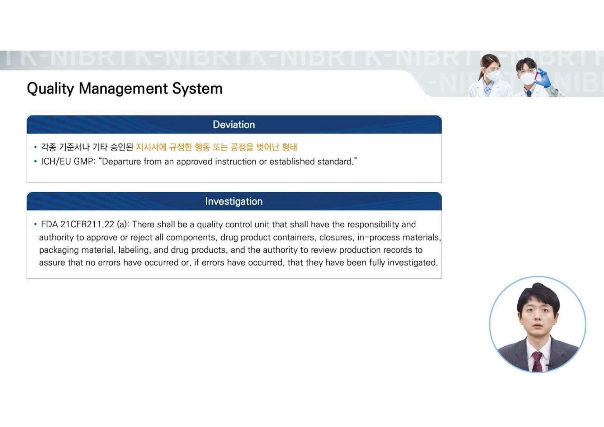
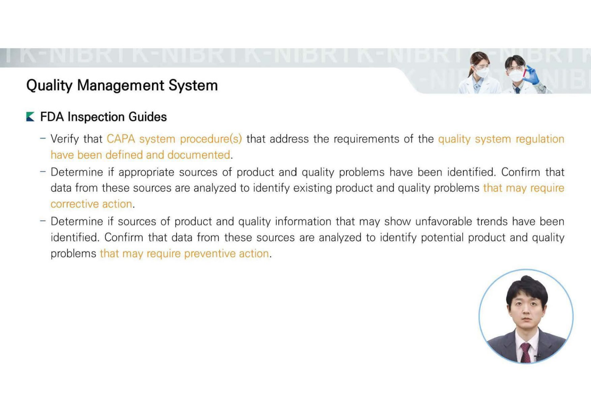
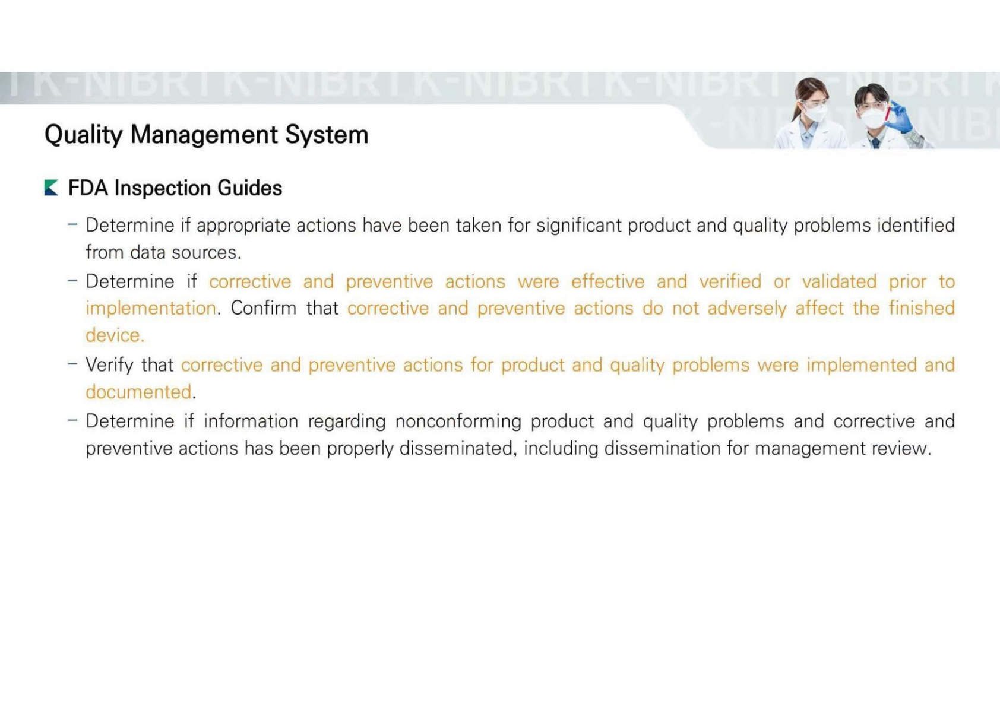

# 문제
QA 전체 업무 업무 범위의 연결로 옳은 것을 모두 고르시오.

- 품질 시스템(Quality System)은 일탈(deviation), 시정예방조치(CAPA), 변경관리(change control), 기준일탈/경향일탈(OOS/OOT) 등을 포함한다
- 제품 QA(Product)는 제조, 포장, 출하, 시판 후 불만사항까지 제품 전주기를 관리한다
- 교육훈련(Training & Education)은 교육 정책, 연간 교육계획, LMS 운영과 연결된다
- 규정준수(Compliance)는 GMP 준수와 데이터 무결성(Data Integrity) 점검과 연결된다
- QA는 실험실에서 샘플 시험만 하는 부서이므로 기록, 출하, 불만, 교육과는 관련이 없다

답: 품질 시스템(Quality System)은 일탈(deviation), 시정예방조치(CAPA), ==변경관리(change control)==, ==기준일탈/경향일탈(OOS/OOT)== 등을 포함한다
제품 QA(Product)는 제조, 포장, 출하, 시판 후 불만사항까지 제품 전주기를 관리한다
교육훈련(Training & Education)은 교육 정책, 연간 교육계획, LMS 운영과 연결된다
규정준수(Compliance)는 GMP 준수와 데이터 무결성(Data Integrity) 점검과 연결된다

[배경설명]
**QA**는 품질보증(Quality Assurance)이다.
**QC**처럼 시험만 하는 좁은 역할이 아니라 제품 전주기 품질 체계를 보는 역할이다.
**품질 시스템(Quality System)**은 **일탈(deviation)**, **시정예방조치(CAPA)**, ==변경관리(change control)==, ==기준일탈/경향일탈(OOS/OOT)==처럼,
문제가 생겼을 때 품질 체계 안에서 관리하는 영역이다.
제품 QA(Product QA)는 제조, 포장, 출하, 시판 후 불만사항까지 제품 흐름을 본다.
교육훈련과 규정준수(Compliance)도 **QA**와 연결된다.
사람이 절차를 모르거나 규정을 지키지 않으면 품질이 무너질 수 있기 때문이다.

[보기해설]
O 품질 시스템(Quality System)은 일탈(deviation), 시정예방조치(CAPA), 변경관리(change control), 기준일탈/경향일탈(OOS/OOT) 등을 포함한다
O 제품 QA(Product)는 제조, 포장, 출하, 시판 후 불만사항까지 제품 전주기를 관리한다
O 교육훈련(Training & Education)은 교육 정책, 연간 교육계획, LMS 운영과 연결된다
O 규정준수(Compliance)는 GMP 준수와 데이터 무결성(Data Integrity) 점검과 연결된다
X QA는 실험실에서 샘플 시험만 하는 부서이므로 기록, 출하, 불만, 교육과는 관련이 없다 -> QA는 제품 전주기와 품질 시스템 전체를 보는 역할이다.

출처: G:\내 드라이브\여형준님\21 6-1\바이오공정개론\기말고사 정리자료\바이오공정개론 기말고사 수업자료.pdf p.320, p.321

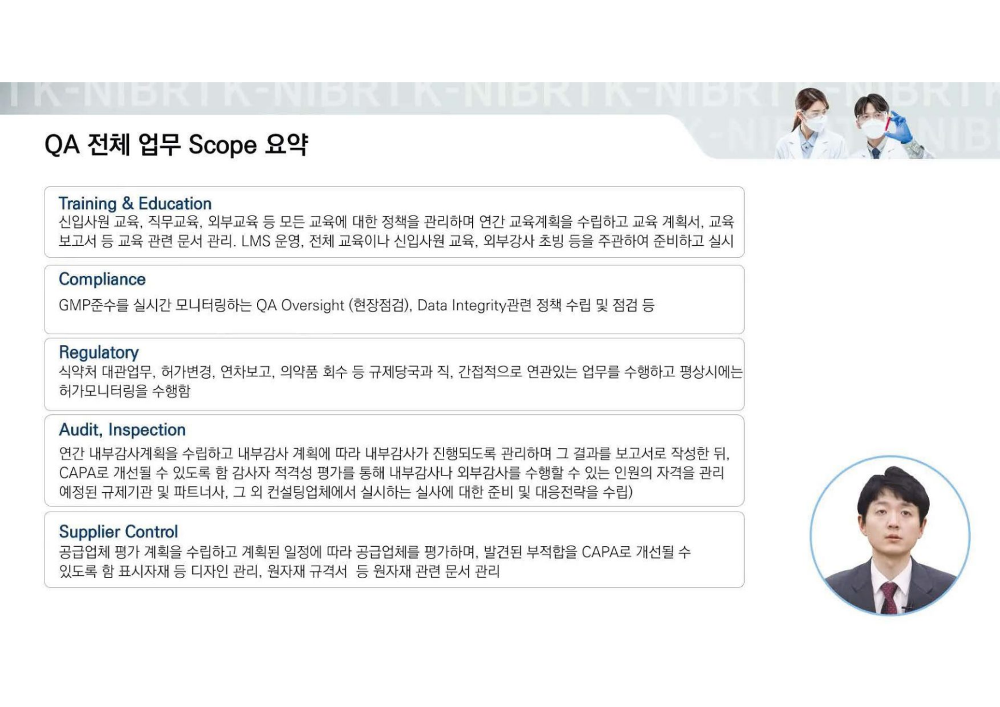

# 문제
세포치료제 QC 항목과 목적의 연결로 옳은 것을 모두 고르시오.

- 성상시험(Appearance test)는 외형, 색, 형상, 용기 상태 등 외형 적합성을 확인한다
- 바이러스시험(Virus test)는 원료, 시약, 작업자 등에서 유입될 수 있는 바이러스 오염 가능성을 확인한다
- 세포수/생존율시험(Cell test)는 총세포수와 세포생존율을 확인한다
- 확인시험(Identification test)는 주성분 세포가 맞는지 확인한다
- 성상시험(Appearance test)는 세포의 유전자 서열을 직접 확인하는 시험이다

답: ==성상시험(Appearance test)==는 외형, 색, 형상, 용기 상태 등 외형 적합성을 확인한다
바이러스시험(Virus test)는 원료, 시약, 작업자 등에서 유입될 수 있는 바이러스 오염 가능성을 확인한다
세포수/생존율시험(Cell test)는 총세포수와 세포생존율을 확인한다
확인시험(Identification test)는 주성분 세포가 맞는지 확인한다

[배경설명]
**세포치료제**는 살아 있는 세포가 제품이기 때문에 일반 단백질 의약품보다 **QC** 항목이 직관적으로 중요하다.
==성상시험(Appearance test)==는 눈으로 보이는 외형, 색, 용기 상태를 확인하는 기본 검사이다.
바이러스시험(Virus test)는 바이러스 오염이 있는지 보는 안전성 검사이다.
세포수/생존율시험(Cell test)는 세포 수와 살아 있는 비율을 보는 검사이다.
확인시험(Identification test)는 이 세포가 의도한 주성분 세포가 맞는지 확인한다.
유전자 서열 직접 확인은 appearance test의 목적이 아니다.

[보기해설]
O 성상시험(Appearance test)는 외형, 색, 형상, 용기 상태 등 외형 적합성을 확인한다
O 바이러스시험(Virus test)는 원료, 시약, 작업자 등에서 유입될 수 있는 바이러스 오염 가능성을 확인한다
O 세포수/생존율시험(Cell test)는 총세포수와 세포생존율을 확인한다
O 확인시험(Identification test)는 주성분 세포가 맞는지 확인한다
X ==성상시험(Appearance test)==는 세포의 유전자 서열을 직접 확인하는 시험이다 -> appearance test는 외형 확인이고, 세포 확인은 identification test 쪽이다.

출처: G:\내 드라이브\여형준님\21 6-1\바이오공정개론\기말고사 정리자료\바이오공정개론 기말고사 수업자료.pdf p.330, p.331
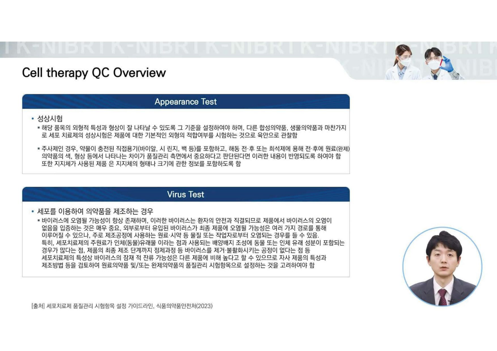
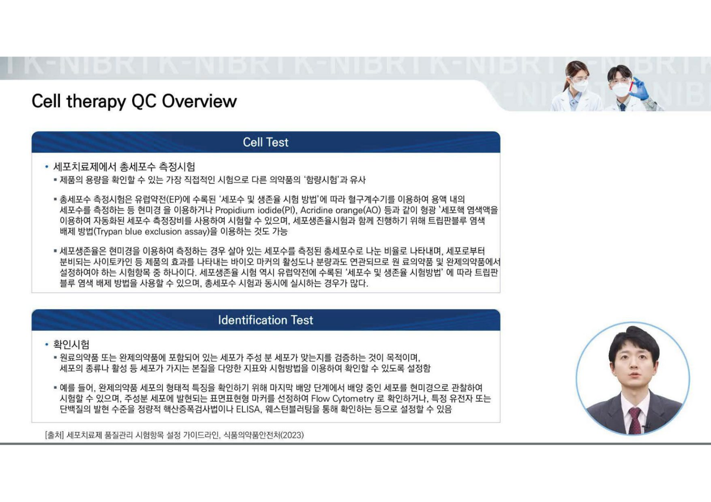

# 문제
세포치료제 QC에서 purity test와 potency test 설명으로 옳은 것을 모두 고르시오.

- 순도시험(Purity test)는 목적 외 세포나 제조공정 관련 불순물 혼입 여부를 확인한다
- 순도시험(Purity test)는 제품 관련 불순물 생성 여부도 볼 수 있다
- 역가시험(Potency test)는 제품 효능을 대변하는 생물학적 활성을 정량적으로 확인한다
- Potency 지표는 치료기전에 맞게 선정해야 한다
- 역가시험(Potency test)는 제품 효과와 상관없는 색깔만 확인하는 시험이다

답: ==순도시험(Purity test)==는 목적 외 세포나 제조공정 관련 ==불순물 혼입 여부==를 확인한다
순도시험(Purity test)는 제품 관련 불순물 생성 여부도 볼 수 있다
역가시험(Potency test)는 제품 효능을 대변하는 생물학적 활성을 정량적으로 확인한다
Potency 지표는 치료기전에 맞게 선정해야 한다

[배경설명]
**Purity**는 순도이다. 원하는 세포가 아닌 다른 세포나 제조 과정에서 생긴 불순물이 섞였는지를 본다.
**Potency**는 **역가** 또는 효능을 대표하는 힘이다. **세포치료제**가 실제 **치료기전**과 연결되는 **생물학적 활성**을 갖는지 확인한다.
예를 들어 면역세포 치료제라면 세포가 표적을 공격하는 기능이 potency와 연결될 수 있다.
따라서 potency는 제품 효과와 무관한 색깔만 보는 시험이 아니다. **치료기전**에 맞는 지표를 골라야 한다.

[보기해설]
O 순도시험(Purity test)는 목적 외 세포나 제조공정 관련 불순물 혼입 여부를 확인한다
O 순도시험(Purity test)는 제품 관련 불순물 생성 여부도 볼 수 있다
O 역가시험(Potency test)는 제품 효능을 대변하는 생물학적 활성을 정량적으로 확인한다
O Potency 지표는 치료기전에 맞게 선정해야 한다
X 역가시험(Potency test)는 제품 효과와 상관없는 색깔만 확인하는 시험이다 -> potency는 제품 효과를 대표하는 생물학적 활성을 보는 시험이다.

출처: G:\내 드라이브\여형준님\21 6-1\바이오공정개론\기말고사 정리자료\바이오공정개론 기말고사 수업자료.pdf p.332
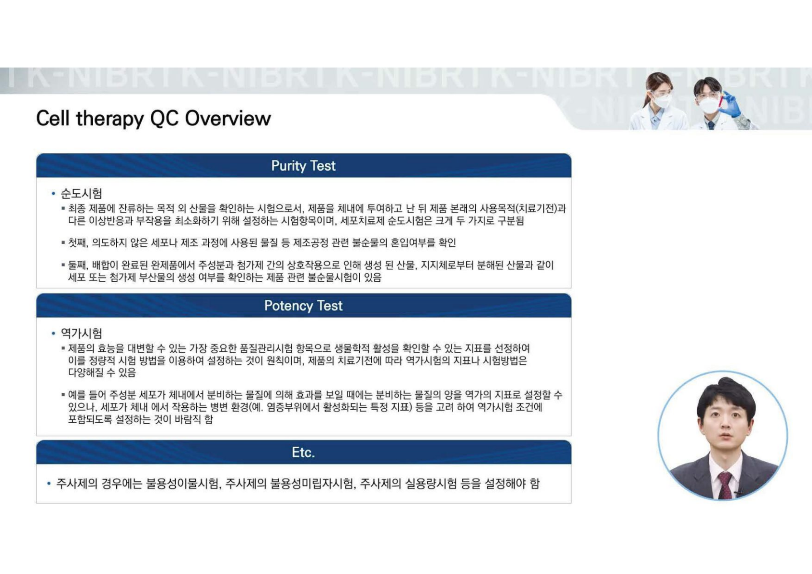

# 문제
Microbial QC 시험과 목적의 연결로 옳은 것을 모두 고르시오.

- 미생물 수 시험(Microbial enumeration) 또는 미생물부하 시험(bioburden test)는 원료, 제조용수, 공정중간물질 등의 미생물 오염 여부를 확인한다
- 무균시험(Sterility test)는 밀봉된 drug product의 무균성을 확인한다
- 엔도톡신시험(Endotoxin test)는 발열성 물질(pyrogen) 여부와 그람음성균(Gram-negative bacteria) 유래 지질다당체(LPS) endotoxin을 확인한다
- Microbial QC는 감염, 발열반응, 환자 안전 문제를 줄이기 위한 시험과 연결된다
- 무균시험(Sterility test)는 제품의 항체 타겟 결합력을 측정하는 시험이다

답: 미생물 수 시험(Microbial enumeration) 또는 미생물부하 시험(bioburden test)는 원료, 제조용수, 공정중간물질 등의 ==미생물 오염== 여부를 확인한다
무균시험(Sterility test)는 밀봉된 drug product의 무균성을 확인한다
엔도톡신시험(Endotoxin test)는 발열성 물질(pyrogen) 여부와 그람음성균(Gram-negative bacteria) 유래 지질다당체(LPS) endotoxin을 확인한다

[배경설명]
**Microbial QC**는 ==미생물 오염==을 관리하는 **QC**이다.
**미생물부하(Bioburden)**은 **최종 멸균** 전이나 공정 중에 미생물이 얼마나 있는지 보는 개념이다.
**무균시험(Sterility test)**는 완제품이 무균인지 보는 시험이다.
**엔도톡신시험(Endotoxin test)**는 그람음성균에서 나온 **지질다당체(LPS)** 같은 발열성 독소를 보는 시험이다.
항체 표적 결합력은 약효나 결합시험(binding assay) 쪽 개념이지 무균시험의 목적이 아니다.

[보기해설]
O 미생물 수 시험(Microbial enumeration) 또는 미생물부하 시험(bioburden test)는 원료, 제조용수, 공정중간물질 등의 미생물 오염 여부를 확인한다
O 무균시험(Sterility test)는 밀봉된 drug product의 무균성을 확인한다
O 엔도톡신시험(Endotoxin test)는 발열성 물질(pyrogen) 여부와 그람음성균(Gram-negative bacteria) 유래 지질다당체(LPS) endotoxin을 확인한다
O Microbial QC는 감염, 발열반응, 환자 안전 문제를 줄이기 위한 시험과 연결된다
X 무균시험(Sterility test)는 제품의 항체 타겟 결합력을 측정하는 시험이다 -> 무균시험은 무균성 확인이고, 표적 결합력은 결합시험이나 역가시험 쪽이다.

출처: G:\내 드라이브\여형준님\21 6-1\바이오공정개론\기말고사 정리자료\바이오공정개론 기말고사 수업자료.pdf p.333
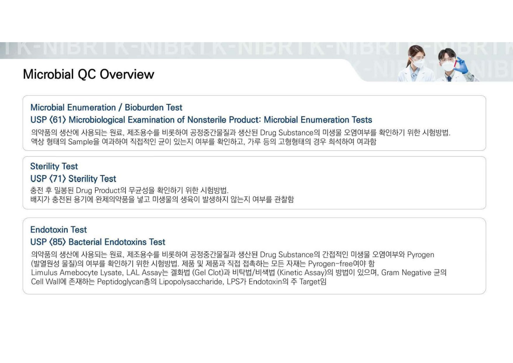

# 문제
안정성 시험 설명으로 옳은 것을 모두 고르시오.

- 안정성 시험은 저장방법과 사용기간을 설정하기 위해 시간 변화에 따른 품질 안정성을 평가한다
- 허가받은 의약품은 최초 3 batch에 대해 장기보존 안정성 시험 계획을 세워 실시한다
- 장기보존시험은 통상 3 batch 이상 수행한다
- 장기보존시험의 대표 시험주기는 0, 3, 6, 9, 12, 18, 24, 36개월이다
- 안정성 시험은 제조 직후 한 번만 하고 이후에는 볼 필요가 없다

답: ==안정성 시험==은 저장방법과 사용기간을 설정하기 위해 시간 변화에 따른 품질 안정성을 평가한다
허가받은 의약품은 최초 3 batch에 대해 장기보존 ==안정성 시험== 계획을 세워 실시한다
장기보존시험은 통상 3 batch 이상 수행한다
장기보존시험의 대표 시험주기는 0, 3, 6, 9, 12, 18, 24, 36개월이다

[배경설명]
==안정성 시험==은 제품이 시간이 지나도 기준을 유지하는지 보는 시험이다.
이 시험 결과로 보관 조건과 사용기간, 즉 사용기간(shelf life)를 정한다.
**바이오의약품**은 온도, 시간, 보관 조건에 따라 변성, 분해, 응집(aggregation) 같은 문제가 생길 수 있다.
그래서 제조 직후 한 번만 보는 것이 아니라 정해진 시점마다 반복해서 확인한다.

[보기해설]
O 안정성 시험은 저장방법과 사용기간을 설정하기 위해 시간 변화에 따른 품질 안정성을 평가한다
O 허가받은 의약품은 최초 3 batch에 대해 장기보존 안정성 시험 계획을 세워 실시한다
O 장기보존시험은 통상 3 batch 이상 수행한다
O 장기보존시험의 대표 시험주기는 0, 3, 6, 9, 12, 18, 24, 36개월이다
X ==안정성 시험==은 제조 직후 한 번만 하고 이후에는 볼 필요가 없다 -> ==안정성 시험==은 시간 변화에 따른 품질 변화를 반복 확인하는 시험이다.

출처: G:\내 드라이브\여형준님\21 6-1\바이오공정개론\기말고사 정리자료\바이오공정개론 기말고사 수업자료.pdf p.337, p.338
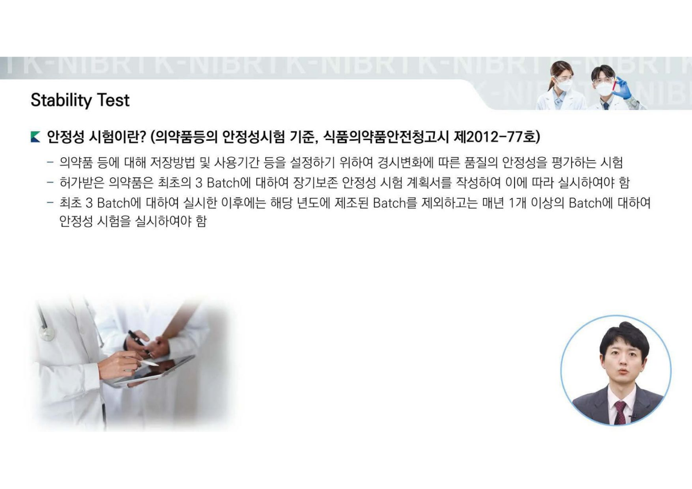
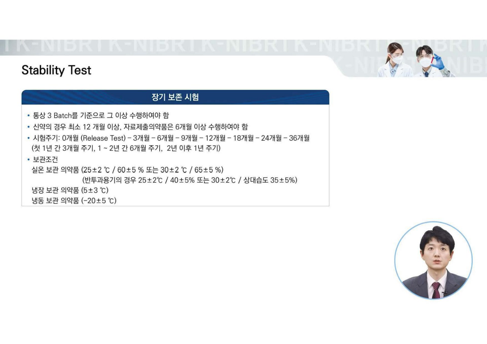

# 문제
분석법 밸리데이션(Analytical method validation) 항목과 의미의 연결로 옳은 것을 모두 고르시오.

- 특이성(Specificity)은 혼재 성분이 있어도 분석대상물질을 선택적으로 정확하게 측정하는 능력이다
- 정확성(Accuracy)은 측정값이 참값이나 표준값에 가까운 정도이다
- 정밀성(Precision)은 반복 측정값들 사이의 근접성이다
- 직선성(Linearity)은 농도에 비례한 직선적 측정값을 얻는 능력이다
- 검출한계(LOD)는 검출 가능한 최소량이고, 정량한계(LOQ)는 정량 가능한 최소량이다
- 검출한계(LOD)는 반드시 정량 가능한 최소량만을 의미한다

답: 특이성(Specificity)은 혼재 성분이 있어도 분석대상물질을 ==선택적으로 정확하게== 측정하는 능력이다
정확성(Accuracy)은 측정값이 참값이나 표준값에 가까운 정도이다
정밀성(Precision)은 반복 측정값들 사이의 근접성이다
직선성(Linearity)은 농도에 비례한 직선적 측정값을 얻는 능력이다
검출한계(LOD)는 검출 가능한 최소량이고, 정량한계(LOQ)는 정량 가능한 최소량이다

[배경설명]
**시험법 밸리데이션(validation)**은 이 시험법을 믿어도 되는지 확인하는 절차이다.
**특이성(Specificity)**는 섞여 있는 성분 중 원하는 물질만 잘 보는 능력이다.
**정확성(Accuracy)**는 참값에 가까운지, **정밀성(Precision)**은 반복 측정값끼리 비슷한지를 본다.
**직선성(Linearity)**는 농도 증가에 따라 결과가 비례하는지를 본다.
**검출한계(LOD)**는 검출한계(limit of detection)라 **검출 가능한 최소량**이다.
**정량한계(LOQ)**는 정량한계(limit of quantitation)라 숫자로 **정량 가능한 최소량**이다.
따라서 **검출한계(LOD)**를 정량 가능한 최소량이라고만 설명하면 **정량한계(LOQ)**와 헷갈린 것이다.

[보기해설]
O 특이성(Specificity)은 혼재 성분이 있어도 분석대상물질을 선택적으로 정확하게 측정하는 능력이다
O 정확성(Accuracy)은 측정값이 참값이나 표준값에 가까운 정도이다
O 정밀성(Precision)은 반복 측정값들 사이의 근접성이다
O 직선성(Linearity)은 농도에 비례한 직선적 측정값을 얻는 능력이다
O 검출한계(LOD)는 검출 가능한 최소량이고, 정량한계(LOQ)는 정량 가능한 최소량이다
X 검출한계(LOD)는 반드시 정량 가능한 최소량만을 의미한다 -> 정량 가능한 최소량은 정량한계(LOQ)이고, 검출한계(LOD)는 검출 가능한 최소량이다.

출처: G:\내 드라이브\여형준님\21 6-1\바이오공정개론\기말고사 정리자료\바이오공정개론 기말고사 수업자료.pdf p.340, p.341

# 문제
자가유래 세포(autologous cell)과 동종유래 세포(allogeneic cell) 비교로 옳은 것을 모두 고르시오.

- 자가유래 세포(autologous cell)는 환자 자신의 세포에서 오므로 면역거부(immune rejection) 위험이 낮다
- 자가유래 세포(autologous cell)는 매 투여분(dose)마다 새 생산공정이 필요해 대량생산이 쉽지 않을 수 있다
- 동종유래 세포(allogeneic cell)는 공여자(donor)에서 오므로 한 번의 공여(donation)로 여러 치료제를 만들 수 있다
- 동종유래 세포(allogeneic cell)는 환자 세포와 달라 면역반응(immune response) 위험이 더 클 수 있다
- 동종유래 세포(allogeneic cell)는 항상 환자 자신의 세포에서만 얻는다

답: ==자가유래 세포(autologous cell)==은 ==환자 자신의 세포==에서 오므로 ==면역거부(immune rejection)== 위험이 낮다
자가유래 세포(autologous cell)는 매 투여분(dose)마다 새 생산공정이 필요해 대량생산이 쉽지 않을 수 있다
동종유래 세포(allogeneic cell)는 공여자(donor)에서 오므로 한 번의 공여(donation)로 여러 치료제를 만들 수 있다
동종유래 세포(allogeneic cell)는 환자 세포와 달라 면역반응(immune response) 위험이 더 클 수 있다

[배경설명]
**자가유래(Autologous)**는 **환자 본인의 세포**를 쓰는 방식이다.
자기 세포라 **면역거부** 위험은 낮지만, 환자마다 따로 제조해야 해서 **대량생산**이 어렵다.
**동종유래(Allogeneic)**은 **공여자(donor)**, 즉 **다른 사람의 세포**를 쓰는 방식이다.
한 **공여자(donor)**에서 여러 투여분(dose)을 만들 수 있어 **대량생산(scale-up)**에는 유리할 수 있다.
대신 환자 입장에서는 남의 세포이므로 면역반응(immune response) 위험이 더 커질 수 있다.
**동종유래(Allogeneic)**을 환자 자신의 세포라고 설명한 보기는 자가유래(autologous)와 헷갈린 것이다.

[보기해설]
O 자가유래 세포(autologous cell)는 환자 자신의 세포에서 오므로 면역거부(immune rejection) 위험이 낮다
O 자가유래 세포(autologous cell)는 매 투여분(dose)마다 새 생산공정이 필요해 대량생산이 쉽지 않을 수 있다
O 동종유래 세포(allogeneic cell)는 공여자(donor)에서 오므로 한 번의 공여(donation)로 여러 치료제를 만들 수 있다
O 동종유래 세포(allogeneic cell)는 환자 세포와 달라 면역반응(immune response) 위험이 더 클 수 있다
X 동종유래 세포(allogeneic cell)는 항상 환자 자신의 세포에서만 얻는다 -> 환자 자신의 세포는 자가유래(autologous)이고, 동종유래(allogeneic)은 공여자(donor) 세포이다.

출처: G:\내 드라이브\여형준님\21 6-1\바이오공정개론\기말고사 정리자료\바이오공정개론 기말고사 수업자료.pdf p.357
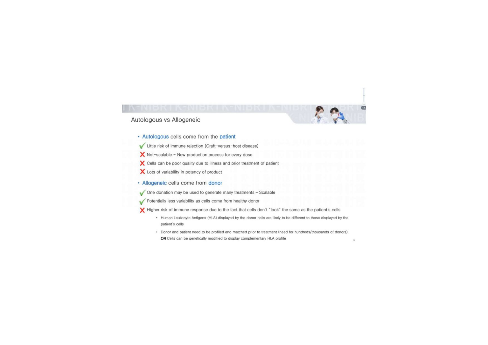

# 문제
CAR-T 제조 공정 흐름으로 가장 적절한 것은?

- 환자 혈액 채취와 해동(thawing) → PBMC/T 세포 분리(PBMC/T cell isolation) → T 세포 활성화(T cell activation) → CAR 유전자 전달(CAR delivery) → T 세포 증식(T cell expansion) → 회수/제형화/포장(harvest/formulation/packaging) → 냉동보존(cryopreservation)
- 환자 혈액 채취와 해동(thawing) → T 세포 활성화(T cell activation) → PBMC/T 세포 분리(PBMC/T cell isolation) → CAR 유전자 전달(CAR delivery) → T 세포 증식(T cell expansion) → 회수/제형화/포장(harvest/formulation/packaging) → 냉동보존(cryopreservation)
- 환자 혈액 채취와 해동(thawing) → PBMC/T 세포 분리(PBMC/T cell isolation) → CAR 유전자 전달(CAR delivery) → T 세포 활성화(T cell activation) → T 세포 증식(T cell expansion) → 회수/제형화/포장(harvest/formulation/packaging) → 냉동보존(cryopreservation)
- 환자 혈액 채취와 해동(thawing) → PBMC/T 세포 분리(PBMC/T cell isolation) → T 세포 활성화(T cell activation) → T 세포 증식(T cell expansion) → CAR 유전자 전달(CAR delivery) → 회수/제형화/포장(harvest/formulation/packaging) → 냉동보존(cryopreservation)
- 환자 혈액 채취와 해동(thawing) → PBMC/T 세포 분리(PBMC/T cell isolation) → T 세포 활성화(T cell activation) → CAR 유전자 전달(CAR delivery) → 회수/제형화/포장(harvest/formulation/packaging) → T 세포 증식(T cell expansion) → 냉동보존(cryopreservation)

답: 환자 혈액 채취와 해동(thawing) → ==PBMC/T 세포 분리(PBMC/T cell isolation)== → T 세포 활성화(T cell activation)
→ CAR 유전자 전달(CAR delivery) → ==T 세포 증식(T cell expansion)==
→ ==회수/제형화/포장(harvest/formulation/packaging)== → 냉동보존(cryopreservation)

[배경설명]
**CAR-T**는 환자의 ==T 세포==를 밖으로 꺼내서 암세포를 더 잘 알아보도록 유전적으로 바꾼 뒤 다시 쓰는 치료제이다.
먼저 환자 혈액에서 **PBMC**나 **T 세포(T cell)**을 분리하고, **T 세포(T cell)**을 활성화한다.
그다음 CAR 유전자를 전달(delivery)해서 세포가 암 표적을 인식하게 만들고, 충분한 수로 **증식(expansion)**한다.
마지막으로 회수, 제형화, 포장, 냉동보관을 거친다.
이 문항은 단계 이름보다,
==분리 → 활성화 → CAR 유전자 전달(CAR delivery) → 증식 → 제형화/포장 → 냉동보관== 순서를 구분하는 것이 핵심이다.

출처: G:\내 드라이브\여형준님\21 6-1\바이오공정개론\기말고사 정리자료\바이오공정개론 기말고사 수업자료.pdf p.363
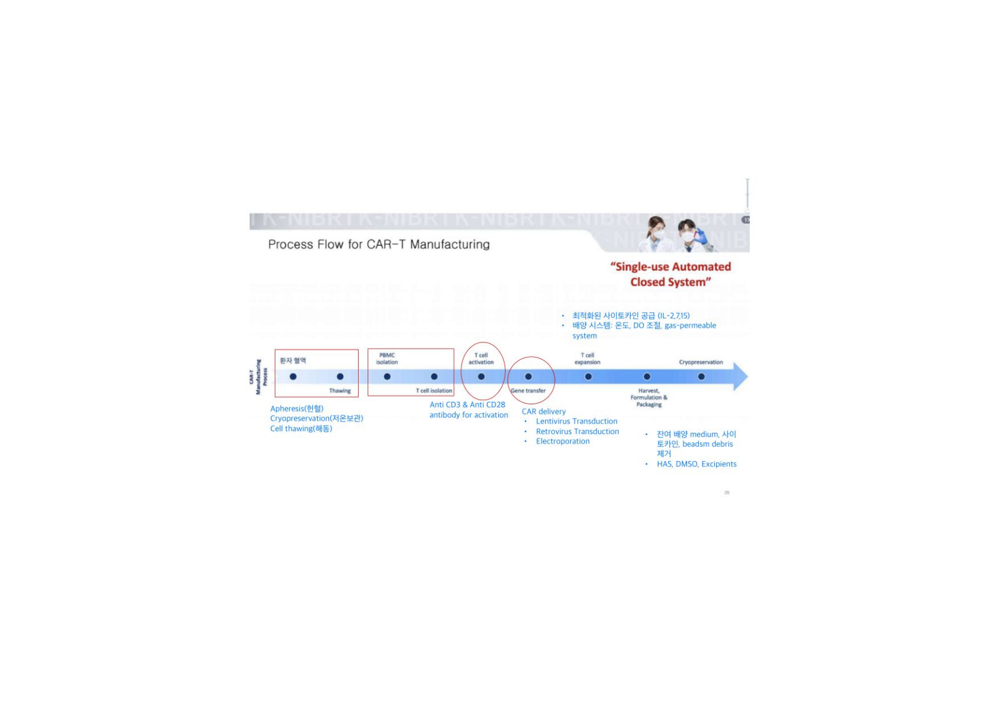

# 문제
무균공정(Aseptic processing) 설명으로 옳은 것을 모두 고르시오.

- 최종 멸균이 불가능하거나 멸균 후 제품 품질이 손상될 수 있을 때 필요할 수 있다
- 공정 중 미생물 오염을 막기 위해 원료, 장비, 환경, 작업자, 공정 흐름을 함께 관리해야 한다
- 자료에서는 무균공정(aseptic processing)을 바이오의약품 산업의 처음과 끝(beginning and end)라고 강조한다
- EM, 청정구역 관리, 작업자 관리, 장비 멸균 같은 요소가 함께 중요하다
- 무균공정에서는 오염관리를 하지 않아도 최종 시험만 통과하면 충분하다

답: ==최종 멸균==이 불가능하거나 멸균 후 제품 품질이 손상될 수 있을 때 필요할 수 있다
공정 중 ==미생물 오염==을 막기 위해 원료, 장비, 환경, 작업자, 공정 흐름을 함께 관리해야 한다
자료에서는 무균공정(aseptic processing)을 바이오의약품 산업의 처음과 끝(beginning and end)라고 강조한다
==EM, 청정구역 관리, 작업자 관리, 장비 멸균== 같은 요소가 함께 중요하다

[배경설명]
==무균공정(Aseptic processing)==은 제품을 마지막에 한 번 세게 멸균해서 해결하는 방식이 아니다.
**바이오의약품**은 열이나 강한 처리에 약할 수 있어 **최종 멸균**이 어렵거나 품질이 손상될 수 있다.
그래서 처음부터 끝까지 오염이 들어오지 않게 **원료**, **장비**, **환경**, **작업자**, **동선**을 관리한다.
최종 시험만 통과하면 충분하다는 생각은 위험하다.
==미생물 오염==은 균일하게 퍼져 있지 않을 수 있어 시험에서 안 잡힐 수도 있기 때문이다.

[보기해설]
O 최종 멸균이 불가능하거나 멸균 후 제품 품질이 손상될 수 있을 때 필요할 수 있다
O 공정 중 미생물 오염을 막기 위해 원료, 장비, 환경, 작업자, 공정 흐름을 함께 관리해야 한다
O 자료에서는 무균공정(aseptic processing)을 바이오의약품 산업의 처음과 끝(beginning and end)라고 강조한다
O EM, 청정구역 관리, 작업자 관리, 장비 멸균 같은 요소가 함께 중요하다
X 무균공정에서는 오염관리를 하지 않아도 최종 시험만 통과하면 충분하다 -> 무균공정은 최종시험보다 공정 전체의 오염 예방이 핵심이다.

출처: G:\내 드라이브\여형준님\21 6-1\바이오공정개론\기말고사 정리자료\바이오공정개론 기말고사 수업자료.pdf p.407, p.408, p.514
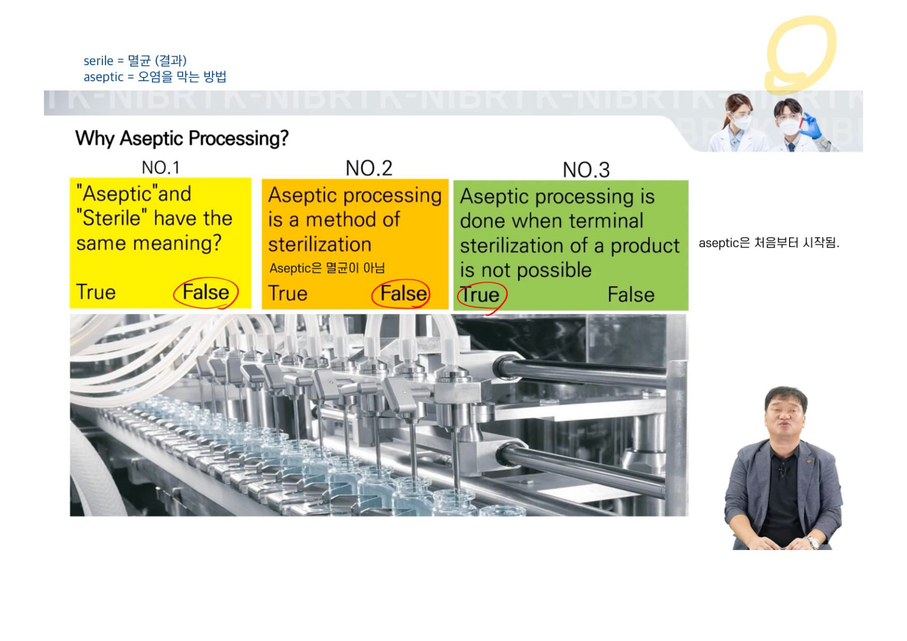
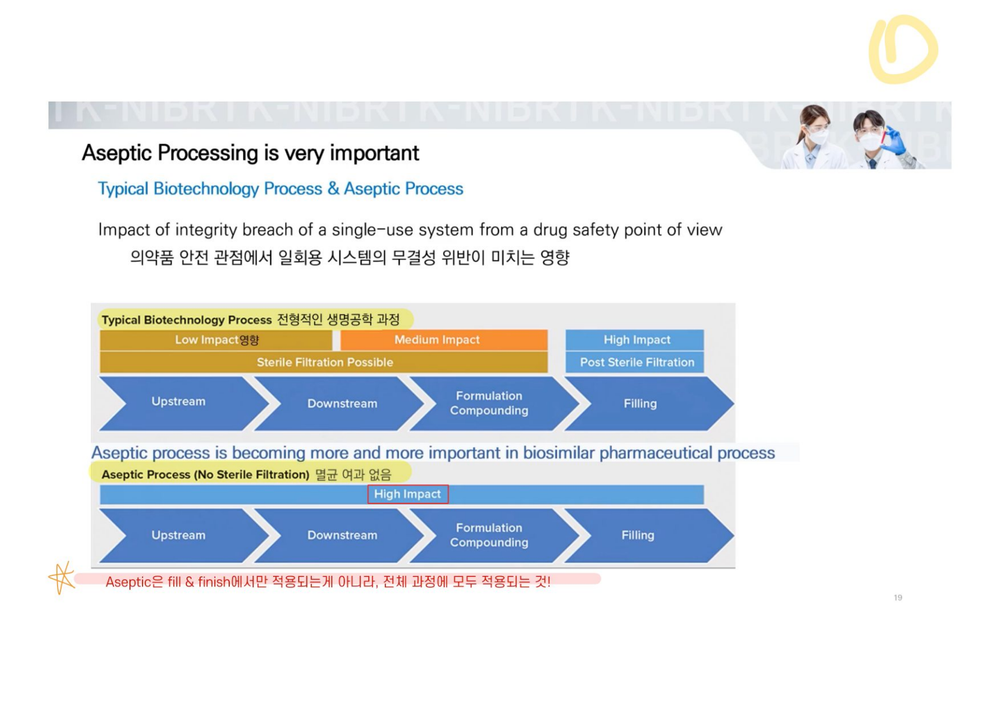

# 문제
제한접근 차단시스템(RABS)와 아이솔레이터(Isolator) 비교 설명으로 옳은 것을 모두 고르시오.

- 제한접근 차단시스템(RABS)는 물리적 차단막(physical barrier)와 동적 공기흐름(dynamic airflow)를 조합해 작업자(operator)와 핵심 무균구역(critical aseptic core) 사이를 분리한다
- 제한접근 차단시스템(RABS)는 아이솔레이터(isolator)에 가까운 제품 보호를 제공할 수 있다
- 제한접근 차단시스템(RABS)는 독성 제품(product)이나 살아있는 바이러스 제품(live viral product)에 대한 작업자(operator)/환경 차단(environment containment) 수단이 제한적일 수 있다
- 아이솔레이터(Isolator)는 장갑(glove), 에어락(airlock), 헤파 여과(HEPA filtration), 밀폐 구조로 더 강한 격리성을 제공한다
- 제한접근 차단시스템(RABS)는 모든 독성 제품에서 작업자 보호(operator containment)를 완전히 보장한다

답: 제한접근 차단시스템(RABS)는 ==물리적 차단막(physical barrier)==와 동적 공기흐름(dynamic airflow)를 조합한다
작업자(operator)와 ==핵심 무균구역(critical aseptic core)== 사이를 분리한다
제한접근 차단시스템(RABS)는 아이솔레이터(isolator)에 가까운 제품 보호를 제공할 수 있다
제한접근 차단시스템(RABS)는 독성 제품(product)이나 살아있는 바이러스 제품(live viral product)에 대한 작업자(operator)/환경 차단(environment containment) 수단이 제한적일 수 있다
아이솔레이터(Isolator)는 ==장갑(glove)==, ==에어락(airlock)==, 헤파 여과(HEPA filtration), 밀폐 구조로 더 강한 격리성을 제공한다

[배경설명]
**제한접근 차단시스템(RABS)**는 Restricted Access Barrier System이다.
**작업자**가 중요한 무균 구역에 직접 접근하지 못하게 **차단막(barrier)**와 **공기흐름(airflow)**로 막는 장치이다.
**아이솔레이터(Isolator)**는 **제한접근 차단시스템(RABS)**보다 더 강하게 격리된 구조로 이해하면 된다.
**장갑(glove)**, ==에어락(airlock)==, **헤파 여과(HEPA filtration)**, 밀폐 구조가 핵심이다.
**제한접근 차단시스템(RABS)**는 제품을 오염에서 보호하는 데 강하지만,
독성 제품이나 살아있는 바이러스 제품(live viral product)처럼 **작업자**와 **환경**을 보호해야 하는 상황에서는 한계가 있을 수 있다.
따라서 **제한접근 차단시스템(RABS)**가 모든 독성 제품에서 작업자 보호(operator containment)를 완전히 보장한다는 보기는 과장된 설명이다.

[보기해설]
O 제한접근 차단시스템(RABS)는 물리적 차단막(physical barrier)와 동적 공기흐름(dynamic airflow)를 조합해 작업자(operator)와 핵심 무균구역(critical aseptic core) 사이를 분리한다
O 제한접근 차단시스템(RABS)는 아이솔레이터(isolator)에 가까운 제품 보호를 제공할 수 있다
O 제한접근 차단시스템(RABS)는 독성 제품(product)이나 살아있는 바이러스 제품(live viral product)에 대한 작업자(operator)/환경 차단(environment containment) 수단이 제한적일 수 있다
O 아이솔레이터(Isolator)는 장갑(glove), 에어락(airlock), 헤파 여과(HEPA filtration), 밀폐 구조로 더 강한 격리성을 제공한다
X 제한접근 차단시스템(RABS)는 모든 독성 제품에서 작업자 보호(operator containment)를 완전히 보장한다 -> 제한접근 차단시스템(RABS)는 제품 보호에는 강하지만 모든 독성 제품의 작업자 보호를 완전히 보장한다고 볼 수 없다.

출처: G:\내 드라이브\여형준님\21 6-1\바이오공정개론\기말고사 정리자료\바이오공정개론 기말고사 수업자료.pdf p.536, p.538
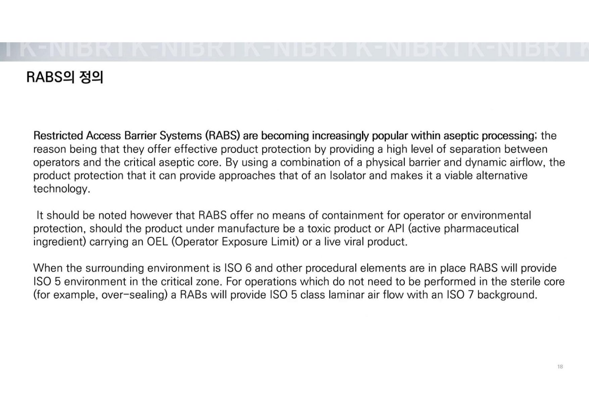

# 문제
환경 모니터링(Environmental Monitoring) 표의 ISO 등급과 GMP 등급(grade) 연결로 옳은 것을 모두 고르시오.

- ISO 5는 GMP Grade A 또는 GMP Grade B 비작업 상태(at rest)와 연결된다
- ISO 7은 GMP Grade B 작업 중(in operation) 또는 GMP Grade C 비작업 상태(at rest)와 연결된다
- ISO 8은 GMP Grade C 작업 중(in operation) 또는 GMP Grade D 비작업 상태(at rest)와 연결된다
- ISO 등급 숫자가 낮을수록 더 깨끗한 영역이다
- ISO 8이 ISO 5보다 더 중요하고 엄격한(critical) 무균 영역이다

답: ==ISO 5==는 ==GMP Grade A== 또는 ==GMP Grade B 비작업 상태(at rest)==와 연결된다
ISO 7은 GMP Grade B 작업 중(in operation) 또는 GMP Grade C 비작업 상태(at rest)와 연결된다
ISO 8은 GMP Grade C 작업 중(in operation) 또는 GMP Grade D 비작업 상태(at rest)와 연결된다
ISO 등급 숫자가 낮을수록 더 깨끗한 영역이다

[배경설명]
==환경 모니터링(Environmental Monitoring)==에서 **ISO** 숫자는 공기 중 입자 수와 관련된 ==청정도== 등급이다.
숫자가 낮을수록 더 깨끗하고 더 중요하고 엄격한(critical) 구역이다. 그래서 **ISO** 5가 **ISO** 8보다 훨씬 더 엄격하다.
**GMP Grade A**는 가장 중요한 무균 작업 영역이다.
GMP Grade가 내려갈수록 덜 중요하고 엄격한(critical) 영역으로 이해하면 된다.
표 문제는 숫자를 전부 외우기보다 "**ISO** 숫자 낮음 = 더 깨끗함 = 더 중요하고 엄격함(critical)"이라는 방향을 먼저 잡아야 한다.

[보기해설]
O ISO 5는 GMP Grade A 또는 GMP Grade B 비작업 상태(at rest)와 연결된다
O ISO 7은 GMP Grade B 작업 중(in operation) 또는 GMP Grade C 비작업 상태(at rest)와 연결된다
O ISO 8은 GMP Grade C 작업 중(in operation) 또는 GMP Grade D 비작업 상태(at rest)와 연결된다
O ISO 등급 숫자가 낮을수록 더 깨끗한 영역이다
X ISO 8이 ISO 5보다 더 중요하고 엄격한(critical) 무균 영역이다 -> ISO 5가 ISO 8보다 더 깨끗하고 중요하고 엄격한(critical) 영역이다.

출처: G:\내 드라이브\여형준님\21 6-1\바이오공정개론\기말고사 정리자료\바이오공정개론 기말고사 수업자료.pdf p.335
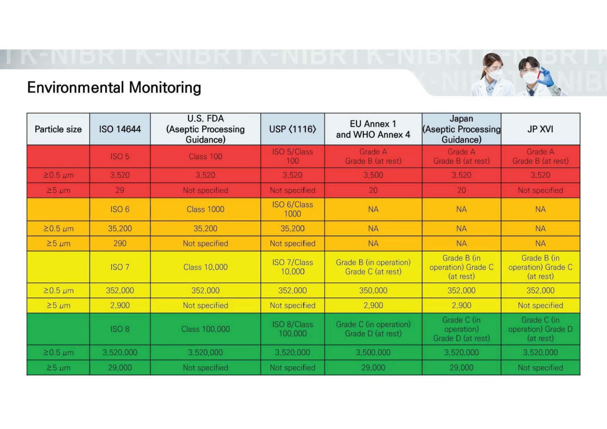
