# 문제

바이오의약품을 정의하시오.

답:
사람이나 다른 생물체에서 유래된 ==세포==, ==단백질==, ==유전자== 등을 원료로 제조한 의약품
재생의학을 가능하게 하는 의약품 분야

[해설]
바이오의약품 정의는 **무엇으로 만들었는가**를 먼저 보는 정의이다.
여기서 핵심은 약효가 생물학적 물질에서 나온다는 점이다.
그래서 답에는 ==생물체 유래==와 ==세포·단백질·유전자==가 반드시 들어가야 한다.
재생의학 가능성은 세포나 유전자 수준에서 손상된 기능을 보완할 수 있다는 의미로 연결하면 된다.

출처: 바이오의약품학 기말고사 범위 요약자료.pdf p.2, p.11
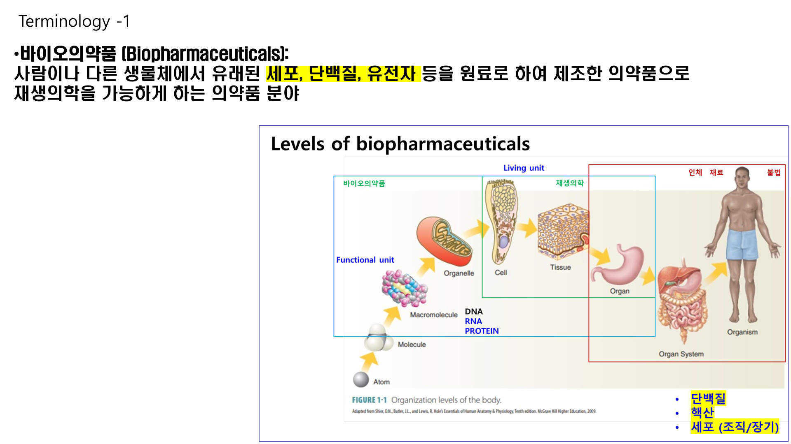
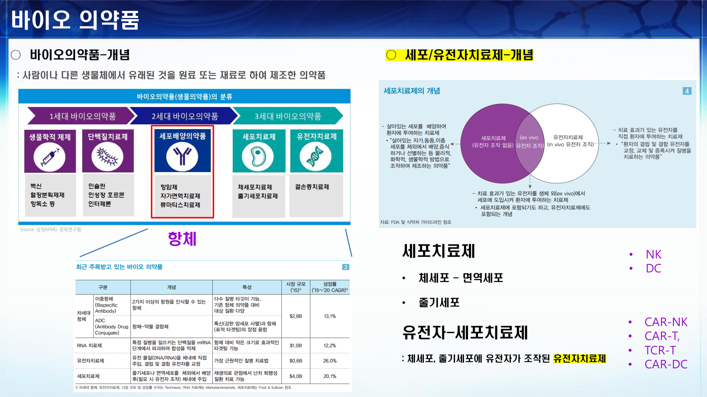

# 문제

첨단바이오의약품의 큰 축을 in vivo 유전자치료제와 ex vivo 유전자치료제로 나누면 각각 어떤 전달체나 세포 기반 전략과 연결되는가?

답:
### In vivo 유전자치료제
· 몸 안에서 전달체가 표적 조직이나 세포에 도달해야 한다.
· 비바이러스 기반: ==LNP==
· 바이러스 기반: ==AAV==

### Ex vivo 유전자치료제
· 환자 세포를 분리한 뒤 체외에서 조작하고 다시 투여한다.
· 세포 기반 예: ==CAR-NK==

### 치료 소재 개발
· ==유전자가위==
· ==플라스미드==
· ==리보핵산==
· ==안티센스 올리고==

[해설]
이 문항은 첨단바이오의약품을 이름별로 외우라는 문제가 아니라 **몸 안에서 하느냐, 몸 밖에서 세포를 조작하느냐**를 구분하라는 문제이다.
==In vivo==는 환자 몸 안으로 전달체를 넣어 표적 조직이나 세포에서 작동하게 하는 방식이다.
그래서 LNP와 AAV처럼 유전물질을 운반하는 전달체가 같이 등장한다.
==Ex vivo==는 세포를 몸 밖으로 꺼내 조작한 뒤 다시 넣는 방식이라 CAR-NK 같은 세포 기반 치료와 연결된다.
치료 소재 개발 항목은 실제 치료를 만들기 위한 도구 묶음으로, 투여방식 구분과 따로 정리해야 헷갈리지 않는다.

출처: 바이오의약품학 기말고사 범위 요약자료.pdf p.3
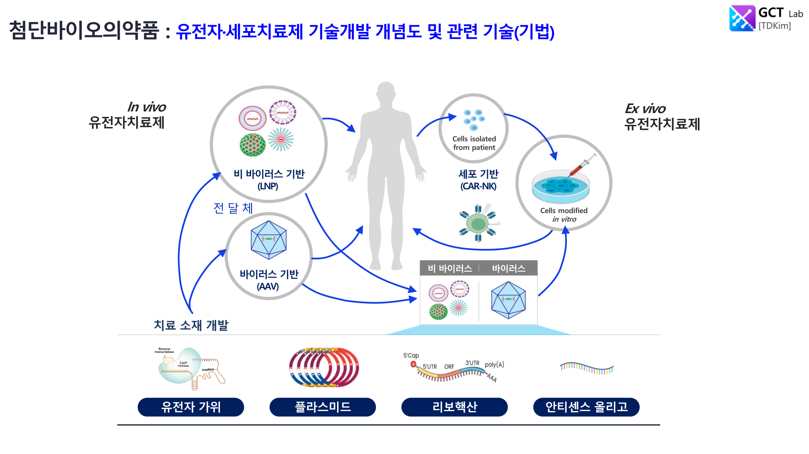

# 문제

핵산 기술은 어떤 흐름과 치료 형태로 정리되는가?

답:
### 큰 흐름
· ==DNA → mRNA → Protein → Cellular responses==

### 필요한 기술
· ==서열 디자인==
· ==PCR==
· ==cloning==
· ==전달==
· ==기능분석==

### 치료 형태
· ==DNA therapy==
· ==mRNA therapy==
· ==ASO/siRNA therapy==

[해설]
핵산 기술은 ==유전정보가 단백질과 세포 반응으로 이어지는 흐름==을 이용한다.
DNA, mRNA, ASO/siRNA는 모두 핵산을 쓰지만 작동 위치가 다르다.
DNA therapy는 유전자 수준, mRNA therapy는 단백질을 만들기 전 단계, ASO/siRNA는 RNA 발현 조절 단계와 연결된다.
서열 디자인, PCR, cloning, 전달, 기능분석은 치료 후보를 만들고 실제 세포에서 작동하는지 확인하는 과정이다.
따라서 시험에서는 핵산 종류만 나열하지 말고 **흐름과 기술 단계**를 같이 쓰는 것이 안정적이다.

출처: 바이오의약품학 기말고사 범위 요약자료.pdf p.4
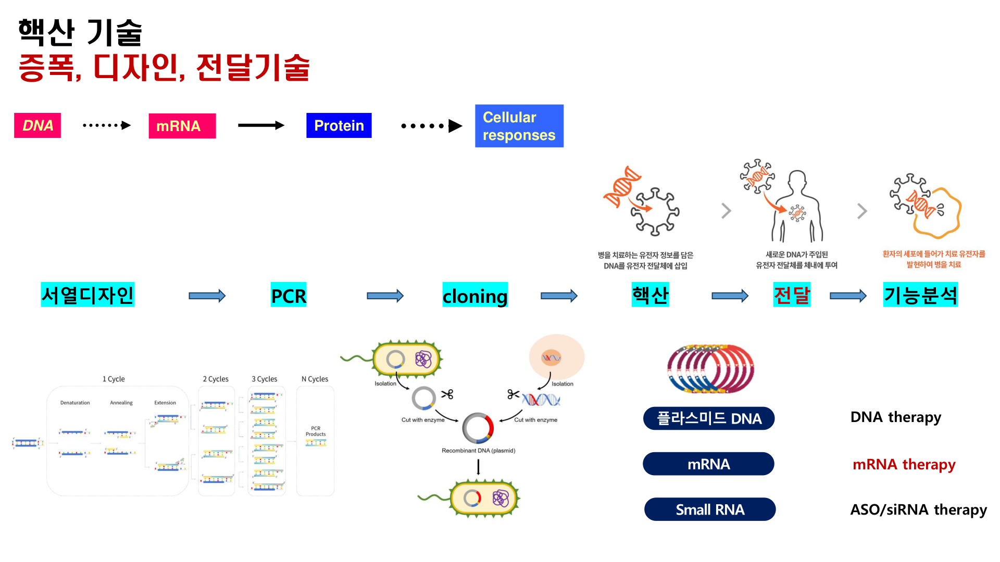

# 문제

세포치료제와 유전자세포치료제의 차이를 설명하시오.

답:
### 세포치료제
· 세포를 배양해 치료제로 사용한다.
· 예: ==MSC 치료제==, ==면역세포치료제==

### 유전자세포치료제
· 세포치료제에 ==유전자전달==이 추가된 형태이다.
· 예: ==CAR-T==, ==CAR-NK==, ==CAR-MΦ==

[해설]
세포치료제와 유전자세포치료제의 차이는 치료제로 쓰는 세포에 ==유전자 조작이 들어갔는가==이다.
세포치료제는 세포 자체의 기능을 치료에 이용한다.
유전자세포치료제는 그 세포에 새로운 유전자를 넣어 표적 인식이나 살상 기능을 추가한다.
CAR-T, CAR-NK, CAR-MΦ가 유전자세포치료제로 묶이는 이유는 면역세포에 CAR 유전자를 넣어 기능을 바꿨기 때문이다.
답을 쓸 때는 예시보다 먼저 **유전자전달 추가 여부**를 기준으로 제시해야 한다.

출처: 바이오의약품학 기말고사 범위 요약자료.pdf p.5, p.6, p.11
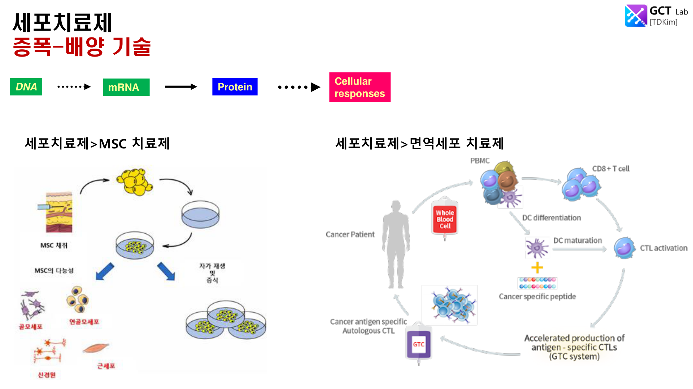
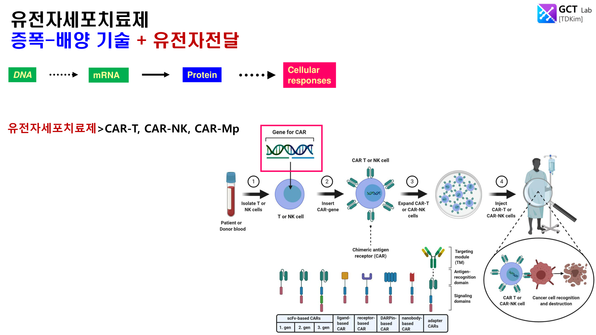

# 문제

세포/유전자치료제의 개념에서 세포치료제, 유전자치료제, 유전자-세포치료제는 어떻게 구분되는가?

답:
### 세포치료제
· 살아있는 세포를 배양해 환자에게 투여한다.
· 예: 체세포, 면역세포, 줄기세포

### 유전자치료제
· 치료 효과가 있는 유전자를 환자에게 전달한다.
· 유전자 보충, 발현 조절, 교정과 연결된다.

### 유전자-세포치료제
· 체세포나 줄기세포에 ==유전자가 조작==된 치료제이다.
· 예: ==CAR-NK==, ==CAR-T==, ==TCR-T==, ==CAR-DC==

[해설]
세포/유전자치료제 분류는 치료 효과의 중심이 어디에 있는지로 나뉜다.
==세포치료제==는 살아있는 세포가 치료제의 본체이다.
==유전자치료제==는 유전자를 전달하거나 조절해서 치료 효과를 낸다.
==유전자-세포치료제==는 세포를 쓰되 그 세포가 유전적으로 조작되어 있다는 점이 핵심이다.
따라서 CAR-NK나 CAR-T는 단순 면역세포 투여가 아니라 유전자 조작 세포 투여로 이해해야 한다.

출처: 바이오의약품학 기말고사 범위 요약자료.pdf p.11

# 문제

바이오의약품은 분자량에 따라 인체 내 소거 방식이 어떻게 달라지는가?

답:
### 소분자 펩타이드 및 저분자 단백질
· 약 ==30~50 kDa 미만==
· 주요 경로: ==신장 배설==
· 특징: 반감기가 매우 짧다.

### 중분자 단백질
· 약 ==50~100 kDa==
· 주요 경로: 사구체 여과 제한 및 단백 분해

### 고분자 단백질 및 항체
· 약 ==100~150 kDa 이상==
· 주요 경로: ==endocytosis== 후 lysosome 분해
· IgG 항체는 ==FcRn recycling== 때문에 반감기가 길 수 있다.

### 공통 경로
· 수용체에 결합해 세포 안으로 들어가 제거되는 ==RMD==가 있다.

[해설]
분자량별 소거는 몸이 단백질 약물을 어떻게 치우는지에 대한 문제이다.
작은 단백질은 신장 여과를 통과하기 쉬워 ==신장 배설==이 중요하고 반감기가 짧다.
분자량이 커질수록 신장으로 빠져나가기 어려워지고, 세포 안으로 들어간 뒤 lysosome에서 분해되는 경로가 중요해진다.
항체처럼 큰 단백질은 FcRn recycling 때문에 다시 혈중으로 돌아올 수 있어 반감기가 길어진다.
RMD는 표적 수용체에 결합한 뒤 세포 안으로 들어가 제거되는 경로로, 분자량과 별개로 작동할 수 있는 소거 방식이다.

출처: 바이오의약품학 기말고사 범위 요약자료.pdf p.8
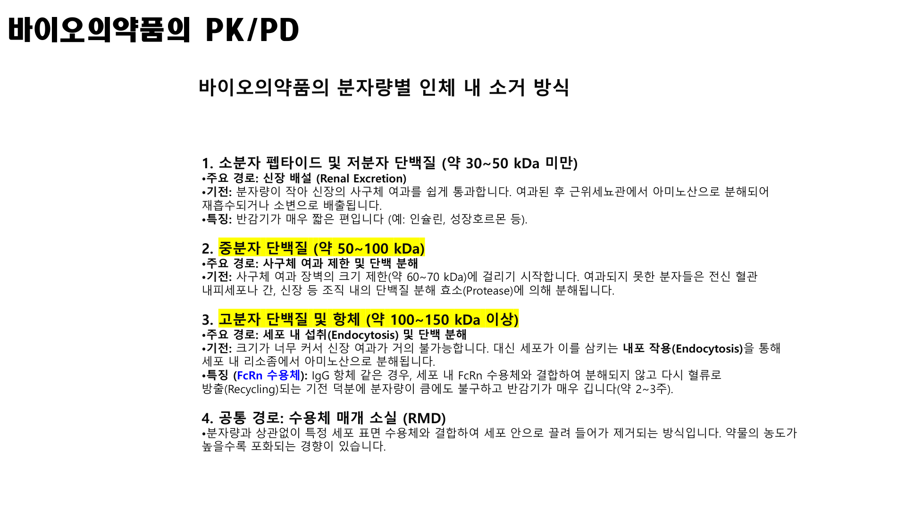

# 문제

ex vivo CAR-T 치료제와 in vivo CAR-T 치료제는 작용기전, 전달체, 투여방식이 어떻게 정리되는가?

답:
### 공통점
· 둘 다 CAR 유전자를 추가해 표적 인식 기능을 부여한다.
· 전달체는 바이러스 또는 비바이러스 전략과 연결된다.

### Ex vivo CAR-T
· 환자 세포를 몸 밖으로 꺼낸다.
· 체외에서 CAR 유전자를 전달하고 조작한다.
· 조작된 세포를 다시 투여한다.

### In vivo CAR-T
· 몸 안에서 직접 CAR 유전자를 전달한다.
· 환자별 체외 세포 제조 과정을 줄이는 방향이다.

[해설]
Ex vivo와 in vivo CAR-T는 둘 다 CAR 유전자를 이용하지만, ==CAR 기능을 어디서 만들게 하느냐==가 다르다.
Ex vivo는 환자 세포를 꺼내 체외에서 CAR를 넣고 증식·검사한 뒤 다시 투여한다.
In vivo는 환자 몸 안에서 직접 CAR 유전자를 전달해 세포가 CAR 기능을 갖게 하려는 전략이다.
그래서 ex vivo는 제조 과정이 길고 개인 맞춤형 공정이 중요하며, in vivo는 전달체와 표적 전달이 더 핵심 문제가 된다.
문제에서 작용기전, 전달체, 투여방식이 같이 나오면 이 차이를 한 흐름으로 묶어 써야 한다.

출처: 바이오의약품학 기말고사 범위 요약자료.pdf p.12
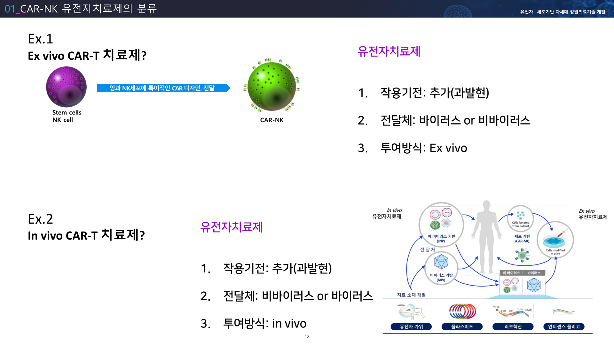

# 문제

CAR 구조에서 targeting과 signaling은 각각 어떤 부분이 담당하는가?

답:
### Targeting
· 세포 밖 도메인이 담당한다.
· 핵심 구조: ==scFv==
· 암세포 표적 항원을 인식한다.

### Signaling
· 세포 안 도메인이 담당한다.
· 핵심 구조: ==CD3ζ==
· 표적 인식 뒤 면역세포 활성화 신호를 전달한다.

[해설]
CAR는 세포 밖에서 표적을 인식하고, 세포 안에서 활성화 신호를 내는 구조이다.
==scFv==는 암세포 표면 항원을 잡는 부분이므로 targeting을 결정한다.
==CD3ζ==는 항원을 잡은 뒤 T cell activation 같은 내부 신호를 전달한다.
즉 CAR 치료제의 기본 논리는 **무엇을 볼 것인가**와 **본 뒤 세포를 어떻게 켤 것인가**로 나뉜다.
이 구분을 잡으면 targeting/signaling 문제를 구조 이름과 연결해서 쓸 수 있다.

출처: 바이오의약품학 기말고사 범위 요약자료.pdf p.13, p.14
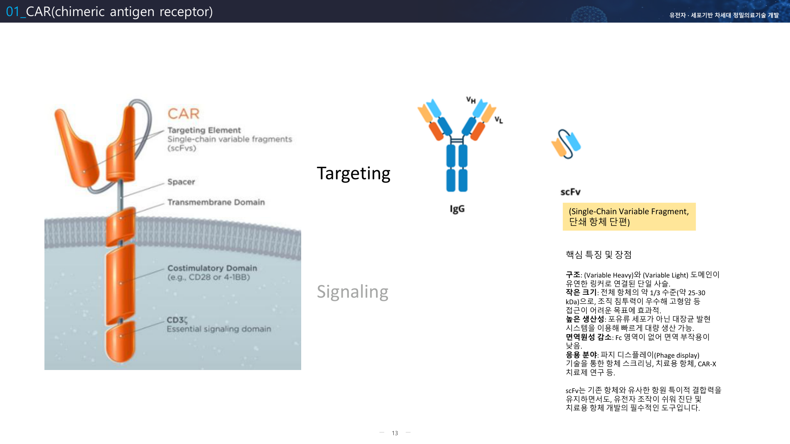
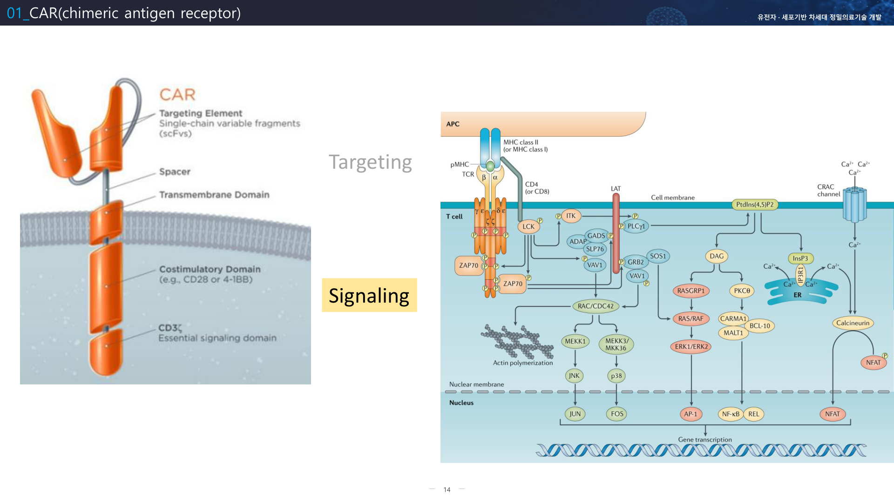

# 문제

scFv는 CAR-X 치료제에서 왜 중요한가?

답:
==scFv==는 CAR의 표적 인식부이다.
기존 항체와 유사한 ==항원 특이적 결합력==을 유지한다.
약 ==25~30 kDa==로 작아 조직 침투에 유리하다.
==Fc 영역이 없어== 면역원성과 부작용이 낮다.
유전자 조작이 쉬워 ==CAR-X 치료제 연구==에 필수적이다.

[해설]
scFv는 항체 전체가 아니라 항원 결합에 필요한 작은 조각이다.
이 조각이 CAR의 바깥쪽에 붙어 있어서 CAR가 어떤 암 항원을 인식할지 정한다.
크기가 작으면 조직 안으로 접근하는 데 유리하고, Fc 영역이 없으면 Fc에 의한 불필요한 면역반응 부담이 줄어든다.
따라서 scFv의 의미는 단순한 부품명이 아니라 ==표적성, 침투성, 안전성==을 함께 좌우하는 CAR 핵심 도메인이다.
시험에서는 scFv를 “CAR의 항원 인식부”라고 먼저 정의한 뒤 장점을 붙이면 된다.

출처: 바이오의약품학 기말고사 범위 요약자료.pdf p.13

# 문제

CAR-NK 생성 원리는 어떤 흐름으로 이해해야 하는가?

답:
CAR gene을 ==design==한다.
CAR gene을 NK cell에 ==deliver==한다.
NK cell에 CAR가 발현되어 ==CAR-NK==가 된다.
CAR-NK가 종양을 인식해 ==apoptosis==를 유도한다.

[해설]
CAR-NK는 NK cell에 CAR 유전자를 넣어 만든 세포치료 전략이다.
NK cell은 원래 종양세포를 죽일 수 있는 면역세포이지만, CAR를 붙이면 특정 항원을 더 정확히 겨냥하도록 설계할 수 있다.
그래서 순서는 CAR gene 설계, NK cell로 전달, CAR-NK 형성, 종양 인식, apoptosis 유도 순서가 된다.
여기서 apoptosis는 CAR-NK가 종양세포를 죽이는 최종 결과로 이해하면 된다.
답을 쓸 때는 “NK cell을 쓴다”에서 끝내지 말고 **CAR 유전자가 NK cell에 기능을 부여한다**는 점을 넣어야 한다.

출처: 바이오의약품학 기말고사 범위 요약자료.pdf p.15
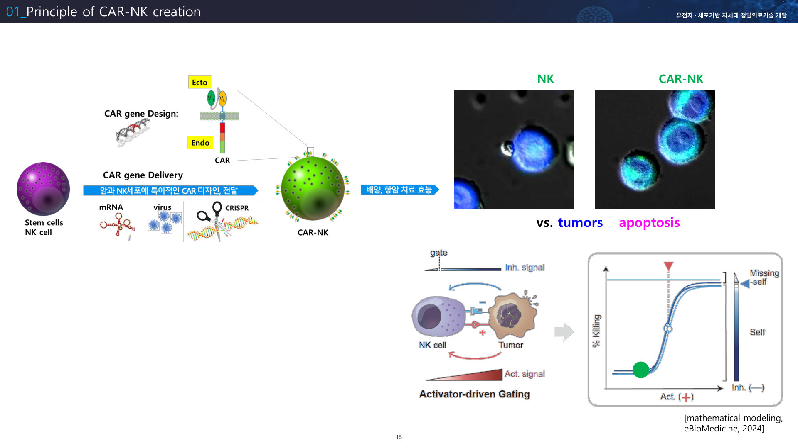

# 문제

NK cell-to-tumors 구도에서 NK cell 쪽 이슈 3가지와 tumor 쪽 이슈 3가지는 무엇인가?

답:
### NK cell 쪽
· ==Activity==: basics와 CAR platform으로 활성 문제를 다룬다.
· ==Exhaustion==: de novo cytokine으로 생존력과 활성 저하 문제를 보완한다.
· ==Safety==: dual CAR로 2개 이상의 항원 인식을 이용한다.

### Tumor 쪽
· ==Physicals==: ECM, CAF, 3D TME mimics
· ==Chemicals==: cytokines, glycosylation
· ==Social==: MEMS로 killing이 잘 일어나는 조건을 연구한다.

[해설]
이 표는 CAR-NK 연구에서 해결해야 할 문제를 두 층으로 나눈 것이다.
첫 층은 ==치료세포 자체 문제==로, NK cell이 충분히 활성화되는지, 지치지 않는지, 안전하게 작동하는지를 본다.
Activity는 세포 활성, Exhaustion은 기능 저하, Safety는 정상세포 공격 위험과 연결된다.
둘째 층은 ==종양 환경 문제==로, 종양 조직의 물리적 장벽, 화학적 신호, 세포 간 상호작용이 치료세포의 작동을 방해할 수 있다.
따라서 이 문항은 용어 나열보다 NK cell 쪽 문제와 tumor 쪽 문제를 나누어 연결하는 것이 중요하다.

출처: 바이오의약품학 기말고사 범위 요약자료.pdf p.16
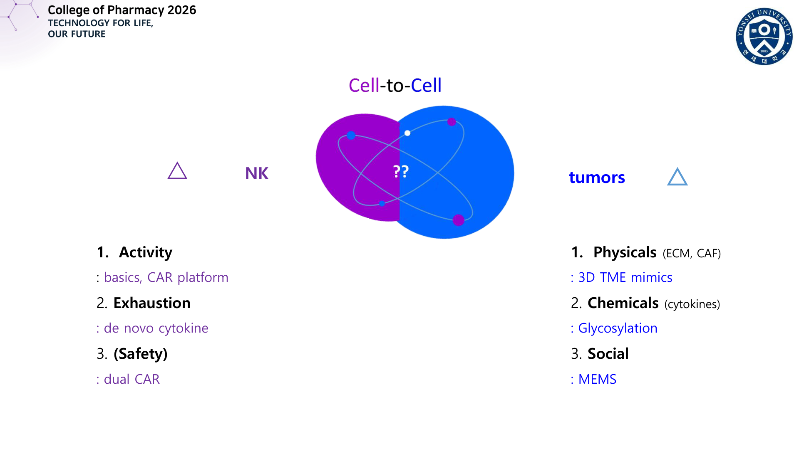

# 문제

암 치료제용 면역세포 표에서 CAR-T, CAR-NK, CAR-MΦ는 각각 어떤 강점과 연결되는가?

답:
### CAR-T
· 강점: ==Expansion==, ==Killing==, ==Memory==
· 의미: 증식, 살상, 기억 반응이 강하다.

### CAR-NK
· 강점: ==Killing==, ==Allo==
· 의미: 살상 능력이 좋고 동종유래 제품화 가능성과 연결된다.
· NK cell의 nature는 ==Safety==와 연결되어 표시된다.

### CAR-MΦ
· 강점: ==Infiltration==, ==Immunity==
· 의미: 종양 조직 침투와 면역 조절 쪽 장점이 강조된다.

[해설]
이 비교는 어떤 플랫폼 하나가 항상 우월하다는 뜻이 아니다.
CAR-T는 T cell의 증식과 기억 반응이 강해 ==Expansion==과 ==Memory==가 강조된다.
CAR-NK는 비교적 안전성과 동종유래 활용 가능성이 강조되어 ==Allo==와 safety 쪽 의미가 붙는다.
CAR-MΦ는 macrophage 특성상 종양 조직 안으로 들어가는 능력과 면역조절 기능이 중요해 ==Infiltration==과 ==Immunity==가 강조된다.
시험에서는 세 플랫폼을 “강점이 다른 면역세포 플랫폼”으로 보고 각각의 강점 키워드를 대응시키면 된다.

출처: 바이오의약품학 기말고사 범위 요약자료.pdf p.17
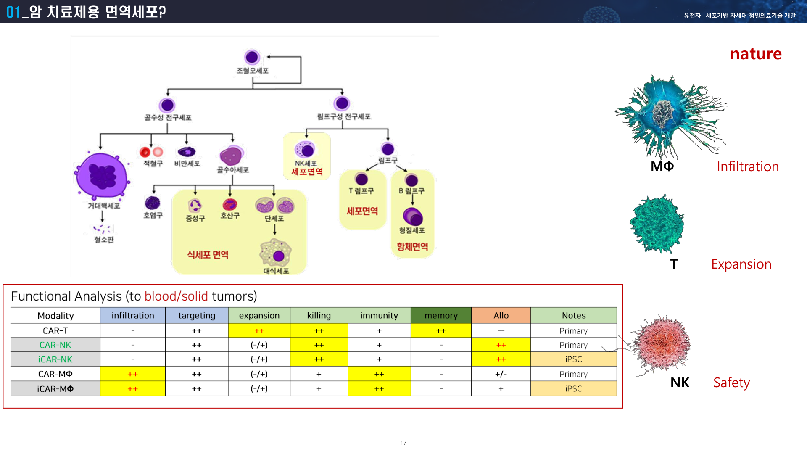

# 문제

CAR 구조 진화와 기능 확장은 1세대, 2·3세대, logic-gated CAR, cytokine armoring으로 어떻게 정리되는가?

답:
### 1세대
· 단일 항원 인식 CAR
· 기본 ==CD3ζ== 신호 전달
· 의미: 기본적인 ==T-cell activation==

### 2세대·3세대
· 2세대: ==co-stimulatory domain== 1개 추가
· 3세대: ==co-stimulatory domain== 2개 추가
· 의미: ==생존력==과 ==증식 능력== 향상

### Logic-gated CAR
· ==AND/OR/NOT== 논리 회로로 항원을 인식한다.
· 의미: 정밀 타겟팅으로 독성과 부작용 감소

### Cytokine armoring
· CAR-X 세포 기능과 미세환경 개선을 위해 ==cytokine==을 도입한다.
· 의미: 면역 미세환경 개선과 효능 증대

[해설]
CAR 구조 진화는 CAR가 점점 복잡해졌다는 뜻이 아니라 ==부족한 기능을 단계적으로 보강했다==는 뜻이다.
1세대 CAR는 항원을 인식하고 CD3ζ로 기본 활성화 신호를 내는 수준이다.
2세대와 3세대는 co-stimulatory domain을 추가해 CAR 세포가 더 잘 살아남고 증식하도록 만든다.
Logic-gated CAR는 항원 하나만 보고 켜지는 문제를 줄이기 위해 AND, OR, NOT 조건으로 더 정밀하게 판단한다.
Cytokine armoring은 CAR-X 세포가 cytokine을 분비해 세포 기능과 종양미세환경을 함께 개선하려는 확장이다.
즉 이 흐름은 **활성화 → 생존·증식 보강 → 정밀제어 → 미세환경 개선**으로 이해하면 된다.

출처: 바이오의약품학 기말고사 범위 요약자료.pdf p.18
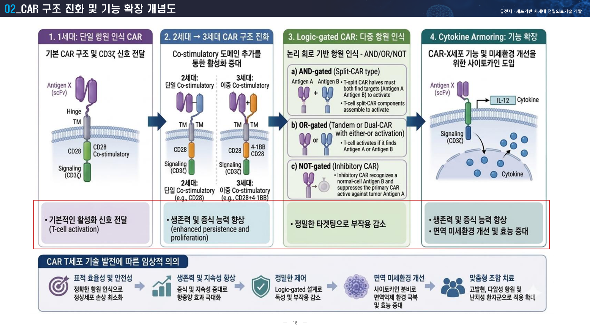

# 문제

다중항원 타겟팅 CAR가 필요한 이유는 무엇인가?

답:
고형암은 ==이질성==이 크다. (heterogeneity)
한 종양 안에서도 암세포가 같은 항원을 모두 발현하지 않는다.
단일 항원만 표적하면 그 항원이 없거나 낮은 세포가 살아남을 수 있다.
따라서 여러 항원을 함께 보거나 논리회로를 적용하는 CAR 설계가 필요하다.

[해설]
고형암에서 heterogeneity가 크다는 말은 암세포들이 모두 같은 표적 항원을 가진 것이 아니라는 뜻이다.
CAR가 항원 하나만 겨냥하면 그 항원이 없는 암세포는 치료를 피해 살아남을 수 있다.
이 현상이 항원 소실 또는 항원 음성 세포의 선택으로 이어지면 단일항원 CAR의 효과가 떨어진다.
그래서 다중항원 타겟팅은 항원을 여러 개 확인해 암세포를 놓칠 가능성을 줄이려는 전략이다.
시험에서는 heterogeneity를 먼저 정의하고, 그 결과로 단일 표적 치료가 왜 불안정한지 설명하면 된다.

출처: 바이오의약품학 기말고사 범위 요약자료.pdf p.19, p.20
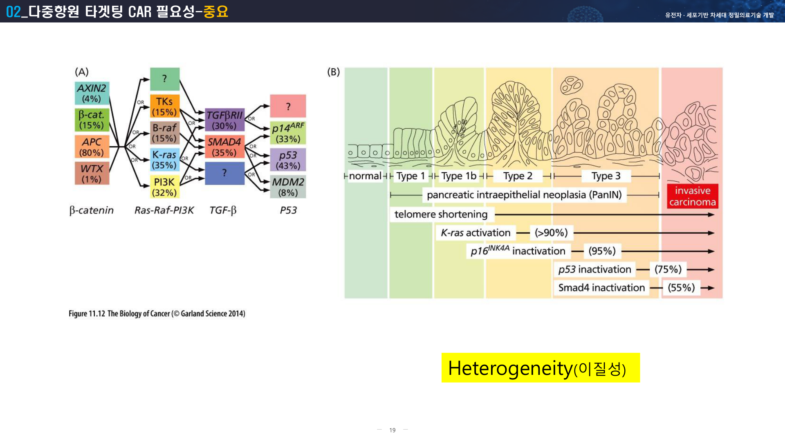
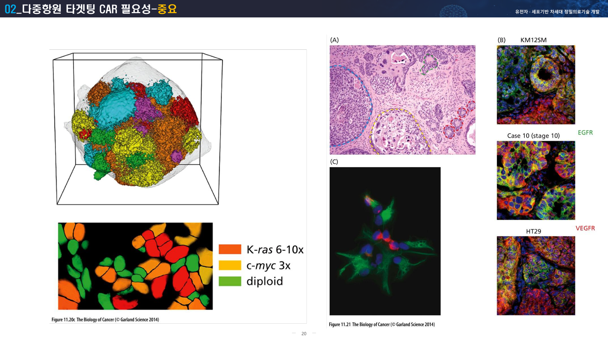

# 문제

다중항원 타겟팅 CAR에서 Dual CAR, Tandem CAR, Logic-gated CAR, Syn-gated CAR를 구분하시오.

답:
### Dual CAR
· 한 세포에 ==두 개의 독립된 CAR==가 공존한다.
· 두 항원을 각각 인식한다.
· 특징: 중복 활성화 신호와 항원 소실 내성

### Tandem CAR
· ==단일 CAR== 안에 두 항원 결합부가 병렬로 연결된다.
· 특징: 한 CAR 분자에서 다중 항원 인식

### Logic-gated CAR
· ==AND/OR/NOT== 논리로 항원 조합을 판단한다.
· 특징: 정밀 타겟팅, 안전성 증가, 높은 특이성

### Syn-gated CAR
· 하나의 항원 인식이 다른 CAR의 발현을 유도한다.
· 특징: AND-like gate, T cell 활성화 시점 조절

[해설]
Dual, Tandem, Logic, Syn-gated CAR는 모두 다중항원 문제를 해결하려는 설계이지만 구조가 다르다.
==Dual CAR==는 한 세포 안에 서로 독립된 CAR 두 개가 들어간 형태이다.
==Tandem CAR==는 하나의 CAR 안에 항원 결합부 두 개를 이어 붙인 형태이다.
==Logic-gated CAR==는 항원 조합을 AND, OR, NOT 조건으로 판단해 켜지거나 꺼진다.
==Syn-gated CAR==는 첫 항원 인식이 다음 CAR 발현을 유도하는 순차적 회로이다.
따라서 외울 때는 “두 CAR”, “한 CAR 두 결합부”, “논리 조건”, “순차 유도”로 구분하면 된다.

출처: 바이오의약품학 기말고사 범위 요약자료.pdf p.21
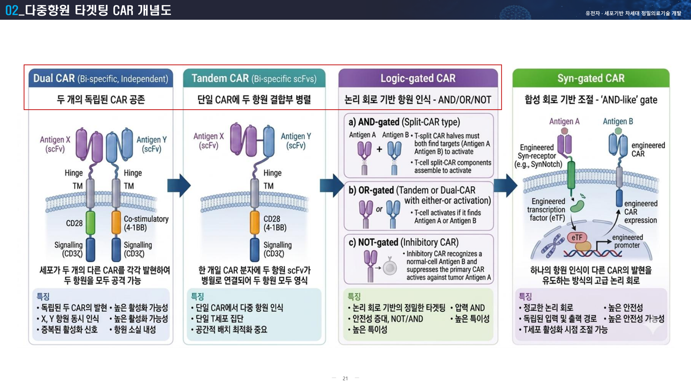

# 문제

종양미세환경(TME) 극복기술이 필요한 이유는 무엇인가?

답:
종양 안의 ==산소==와 ==영양소== 조건이 치료세포 기능을 제한한다.
암세포 주변에는 면역세포, 기질세포, 혈관, extracellular matrix가 함께 존재한다.
이 환경은 CAR 세포의 침투, 활성, 생존, 살상 기능을 방해할 수 있다.

[해설]
TME는 암세포만 있는 공간이 아니라 암세포 주변의 면역세포, 기질세포, 혈관, extracellular matrix가 함께 있는 환경이다.
이 환경은 산소와 영양소가 부족하거나, 세포가 들어가기 어려운 물리적 장벽을 만들 수 있다.
CAR 세포가 항원을 인식하더라도 종양 안으로 충분히 들어가지 못하거나 오래 살아남지 못하면 치료 효과가 줄어든다.
그래서 고형암 CAR 치료에서는 표적 항원 인식뿐 아니라 ==침투, 생존, 활성 유지==가 모두 문제된다.
TME 극복기술은 이 주변 환경 때문에 생기는 실패 원인을 줄이려는 기술로 이해하면 된다.

출처: 바이오의약품학 기말고사 범위 요약자료.pdf p.22, p.23
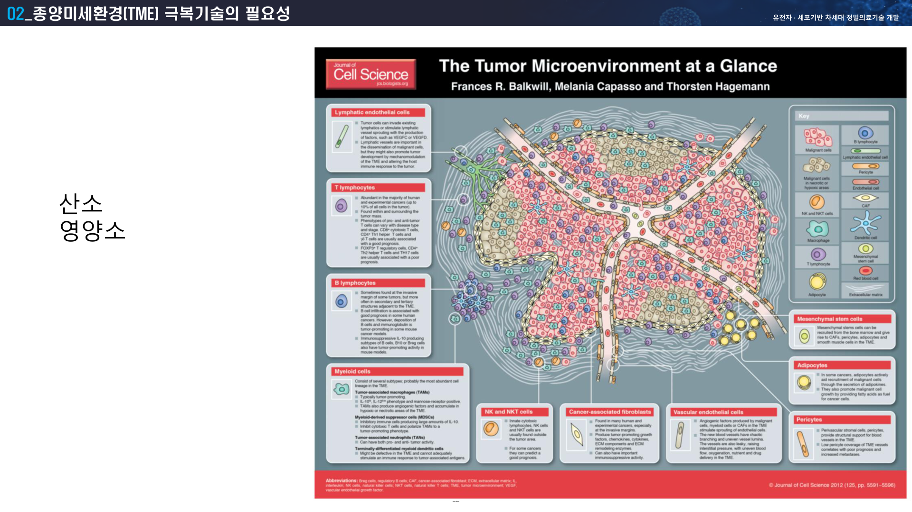
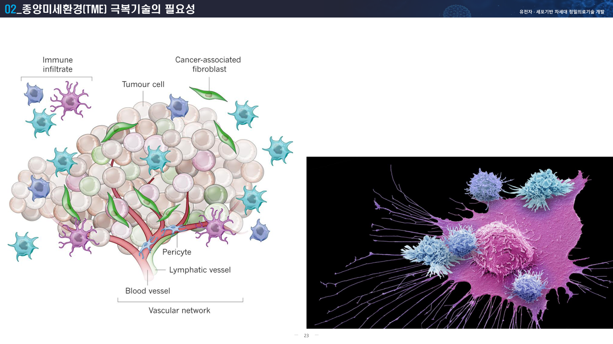

# 문제

종양미세환경 감응형 CAR의 네 가지 전략은 각각 무엇을 이용하는가?

답:
### Hypoxia-responsive CAR
· 종양의 ==저산소== 조건을 이용한다.
· 정상 산소에서는 HIF가 분해되어 CAR가 낮고, 저산소에서는 HIF가 안정화되어 CAR가 높아진다.

### Protease-activated CAR
· TME 고유 ==protease==를 이용한다.
· 정상 조직에서는 iCAR가 intact 상태라 활성이 낮고, TME에서는 protease가 iCAR를 절단해 CAR가 활성화된다.

### iCAR-based logic gating
· 정상 조직의 억제 신호가 우세하면 CAR 활성을 막는다.
· 종양 조직에서는 활성화 신호가 우세해 선택적으로 CAR가 작동한다.

### Cytokine remodeling CAR
· 활성화된 CAR-X가 ==cytokine==을 분비한다.
· cytokine secretion과 cell recruitment로 TME를 치료에 유리하게 바꾼다.

[해설]
TME 감응형 CAR는 종양 주변 환경의 특징을 작동 조건으로 이용한다.
Hypoxia-responsive CAR는 종양의 저산소 조건에서 CAR 발현이나 활성이 높아지도록 설계한다.
Protease-activated CAR는 종양미세환경에 많은 protease가 있어야 CAR가 활성화되도록 만든다.
iCAR-based logic gating은 정상 조직에서 억제 신호가 우세하면 CAR 작동을 막아 안전성을 높이려는 방식이다.
Cytokine remodeling CAR는 CAR-X 세포가 cytokine을 분비해 주변 면역환경을 치료에 유리하게 바꾸려는 전략이다.
공통점은 항원만 보는 것이 아니라 ==종양 환경에서만 더 잘 작동하게 만드는 조건부 설계==라는 점이다.

출처: 바이오의약품학 기말고사 범위 요약자료.pdf p.24
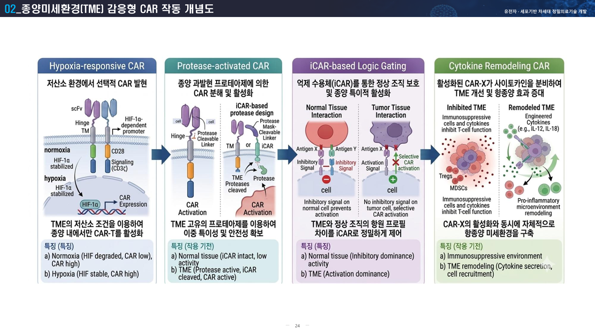

# 문제

in vivo CAR-X 유전자치료제가 미래형 게임 체인저로 제시되는 이유는 무엇인가?

답:
기존 CAR-T는 생산 공정 기간이 길다.
맞춤형 치료라 비용이 높고 환자 접근성이 낮다.
in vivo CAR-T는 ==즉각 투여==와 치료비 부담 완화를 목표로 한다.
다양한 암종과 난치성 면역질환에 적용 가능한 ==off-the-shelf== 차세대 drug modality로 제시된다.

[해설]
기존 CAR-T가 강력해도 환자별 세포 제조가 필요하면 시간과 비용이 커진다.
Ex vivo 방식은 세포 채취, 유전자 조작, 배양, 품질 확인, 재투여 과정을 거쳐야 해서 즉시 투여가 어렵다.
In vivo CAR-X는 몸 안에서 직접 CAR 기능을 만들게 해 이런 제조 부담을 줄이려는 방향이다.
그래서 자료에서 ==즉각 투여==, ==치료비 부담 완화==, ==off-the-shelf==가 같이 강조된다.
이 문항의 핵심은 치료 효과 자체보다 **제조·접근성 문제를 해결하려는 차세대 플랫폼**이라는 점이다.

출처: 바이오의약품학 기말고사 범위 요약자료.pdf p.25, p.26
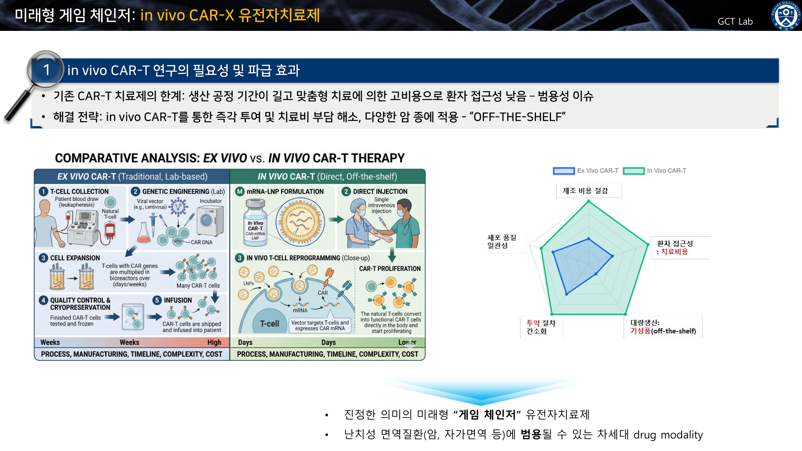
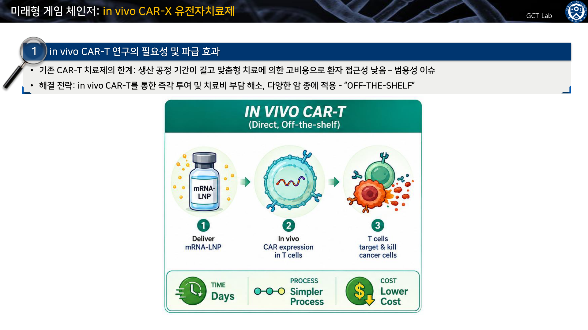

# 문제

in vivo treatment of biopharmaceuticals에서 공통된 문제점은 무엇이며, 바이러스와 비바이러스 전략은 어떻게 다른가?

답:
### 공통 문제
· 바이오의약품을 생체 내 특정 조직과 기관으로 보내는 ==targeting==이 핵심 이슈이다.
· targeting 실패는 효과 저하와 안전성 문제로 이어진다.

### 바이러스 전략
· 조직·세포 특이적 선호도를 활용할 수 있다.
· 하지만 원하는 수준의 targeting 효율과 안전성이 항상 충분한 것은 아니다.

### 비바이러스 전략
· 세포 특이적 친화물질을 붙인 ==LNP== 전달체를 개발한다.
· 세포 특이적 ==항체== 기반 targeting도 활용할 수 있다.

[해설]
In vivo 치료는 치료 물질을 몸 안에 넣기 때문에 원하는 조직과 세포까지 정확히 보내는 것이 가장 큰 문제이다.
표적 전달이 부족하면 치료 효과가 약해지고, 엉뚱한 조직에 전달되면 안전성 문제가 생긴다.
바이러스 전달체는 특정 조직이나 세포에 잘 들어가는 성질을 이용할 수 있지만, 효율과 안전성을 항상 원하는 대로 조절하기 어렵다.
비바이러스 전략에서는 LNP에 세포 특이적 친화물질을 붙이거나 항체를 이용해 표적성을 높이려 한다.
따라서 이 문제는 전달체 이름보다 ==targeting과 safety==를 먼저 쓰는 것이 중요하다.

출처: 바이오의약품학 기말고사 범위 요약자료.pdf p.27
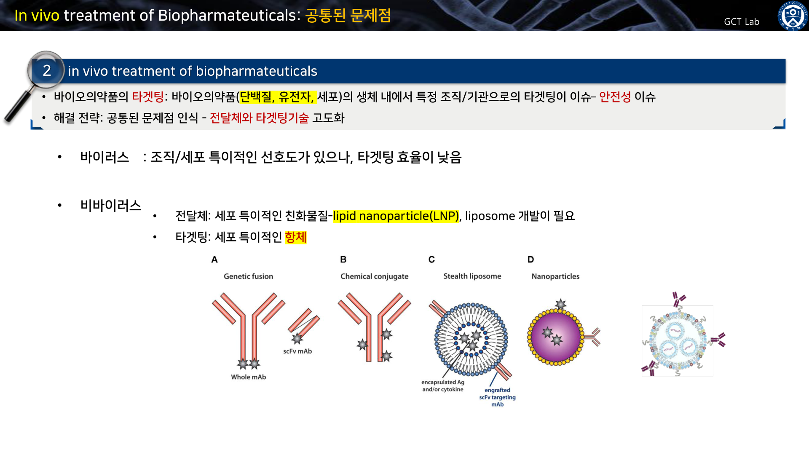

# 문제

백신의 정의와 구성 요소를 쓰시오.

답:
백신: 사람이나 동물이 특정 질병에 대한 ==면역력==을 미리 갖추도록 돕는 의약품
구성 요소: ==항원 + 면역반응 + 기억 + 예방==

[해설]
백신은 항원을 한 번 보여주고 끝나는 약이 아니라 면역계가 나중에 같은 위험을 다시 만났을 때 빠르게 반응하도록 준비시키는 약이다.
==항원==은 면역계가 알아볼 대상이고, ==면역반응==은 그 항원에 대해 실제로 방어 작용이 켜지는 과정이다.
==기억==은 같은 항원이 다시 들어왔을 때 더 빠르고 강하게 반응하게 하는 요소이다.
감염병 백신에서는 이 흐름의 최종 목적이 ==예방==이다.
정의형 문제에서는 “면역력”이라는 말만 쓰지 말고 항원, 면역반응, 기억, 예방을 연결해 써야 한다.

출처: 바이오의약품학 기말고사 범위 요약자료.pdf p.28
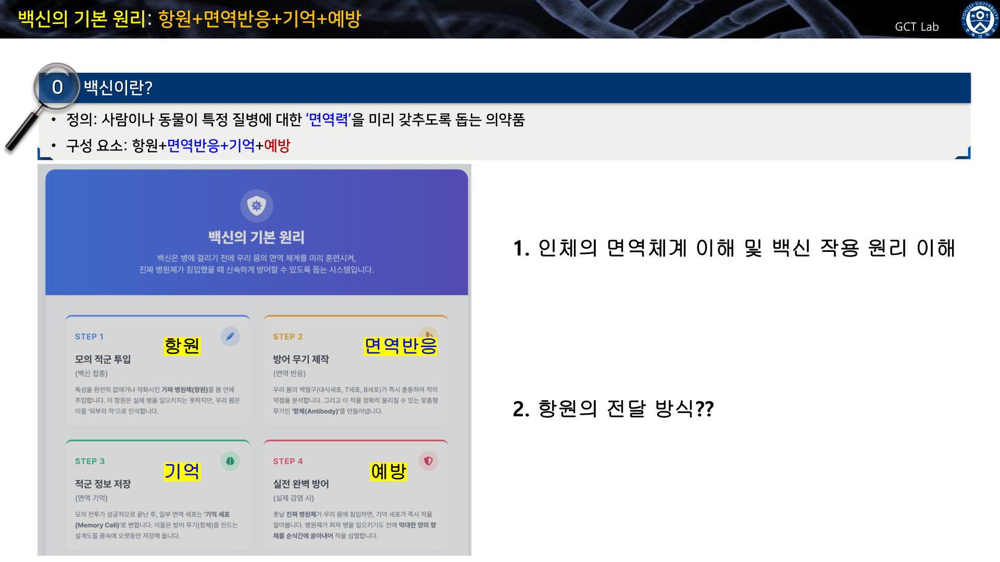

# 문제

병원체는 무엇이며, 백신에서 non-self와 self 구분은 왜 중요한가?

답:
병원체는 ==감염병 질환을 일으키는 인자==이다.
백신에서 non-self/self 구분이 중요한 이유는 면역계가 ==공격해야 할 외부 항원(non-self)==과 ==공격하면 안 되는 자기 성분(self)==을 구분해야 하기 때문이다.
백신 항원은 병원체 유래 non-self로 인식되어야 면역반응과 기억을 만들 수 있다.

[해설]
병원체는 감염병을 일으키는 원인 물질이므로 백신 항원의 출발점이 된다.
면역계는 기본적으로 공격해야 할 외부 물질인 ==non-self==와 공격하면 안 되는 자기 성분인 ==self==를 구분해야 한다.
백신 항원은 병원체 유래 non-self처럼 인식되어야 면역반응과 기억이 만들어진다.
반대로 self를 공격하는 방향으로 면역반응이 생기면 정상 조직 손상 문제가 생길 수 있다.
그래서 백신에서 non-self/self 구분은 항원을 제대로 인식하고 안전하게 면역반응을 만드는 기본 원리이다.

출처: 바이오의약품학 기말고사 범위 요약자료.pdf p.29
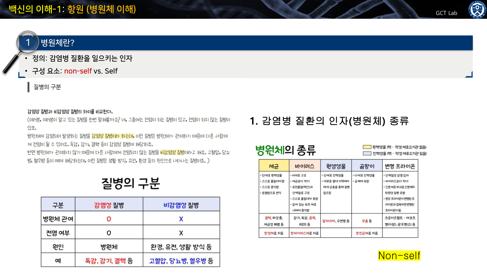

# 문제

백신에서 선천성 면역과 후천성 면역은 어떻게 구분되는가?

답:
### 선천성 면역
· 대식세포 중심
· ==non-self==에 대한 빠른 면역반응
· 기억 형성이 핵심은 아니다.

### 후천성 면역
· ==B cell==, ==T cell== 중심
· non-self 또는 self에 대한 ==항원 특이적== 반응
· ==기억== 형성과 연결된다.

[해설]
선천성 면역은 먼저 반응하는 기본 방어체계로, 대식세포처럼 빠르게 non-self를 처리하는 세포가 중심이다.
하지만 선천성 면역은 특정 항원을 오래 기억해 다음에 더 정밀하게 반응하는 기능이 핵심은 아니다.
후천성 면역은 B cell과 T cell이 중심이 되어 특정 항원을 구분하고 기억을 남긴다.
백신 효과가 오래 가려면 단순한 즉시 방어가 아니라 후천성 면역의 ==항원 특이성==과 ==기억 형성==이 필요하다.
따라서 백신 문항에서 후천성 면역이 계속 강조되는 이유는 기억과 직접 연결되기 때문이다.

출처: 바이오의약품학 기말고사 범위 요약자료.pdf p.30
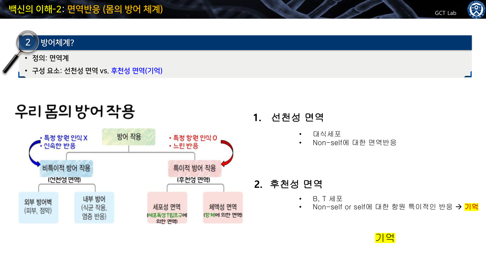

# 문제

항원 전달은 무엇이며, 항원 형태와 전달 방식은 어떻게 구분되는가?

답:
항원 전달: ==면역체계를 활성화시키는 방법==
구성 요소: ==항원 형태 + 전달체 형태==

### 항원 형태
· 생백신: 살아있는 바이러스 껍질 사용
· 사백신: 열이나 화학물질로 사멸하여 사용
· 아단위 백신: 특정 항원 단백질 정제
· 항원 유전자: ==DNA==, ==mRNA== 형태

### 전달 방식
· 생백신, 사백신, 아단위 백신은 주사로 직접 투여한다.
· 항원 유전자는 ==바이러스== 또는 ==비바이러스== 전달체가 필요하다.

[해설]
항원 전달은 면역계가 볼 수 있는 형태로 항원을 몸 안에 제시하는 방법이다.
여기서 먼저 나눌 것은 ==무엇을 항원으로 넣는가==와 ==그 항원을 어떻게 전달하는가==이다.
생백신, 사백신, 아단위 백신은 병원체나 단백질 항원 자체를 직접 제시하는 쪽에 가깝다.
DNA나 mRNA 백신은 항원 단백질 자체가 아니라 항원을 만들 유전정보를 넣는다.
그래서 유전자 형태 항원은 세포 안으로 들어가야 하므로 바이러스 또는 비바이러스 전달체 개념이 따라온다.
답안에서는 항원 형태와 전달체 형태를 섞지 말고 두 축으로 나누어 쓰면 된다.

출처: 바이오의약품학 기말고사 범위 요약자료.pdf p.31, p.32
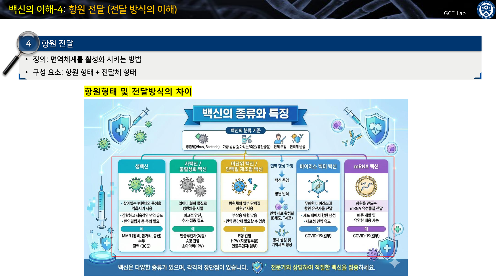
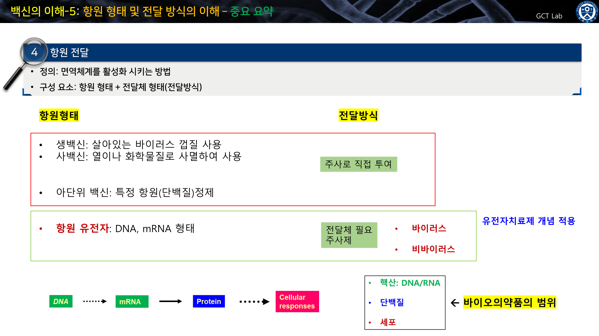

# 문제

mRNA vaccine은 항원+면역반응+기억 흐름을 어떻게 구현하는가?

답:
mRNA vaccine은 전달된 ==mRNA==가 세포 안에서 항원 단백질을 발현하게 한다.
발현된 항원이 면역세포에 제시된다.
항원 제시 후 면역반응이 활성화된다.
활성화된 면역반응은 암세포 공격과 ==기억== 형성으로 이어져야 한다.

[해설]
mRNA vaccine은 항원 단백질을 직접 주입하는 방식이 아니라 항원 단백질을 만들 수 있는 mRNA를 전달하는 방식이다.
세포 안으로 들어간 mRNA가 번역되어 항원 단백질을 만들고, 그 항원이 면역계에 제시된다.
항원이 제시되면 면역세포가 활성화되고, 그 반응이 기억으로 이어져야 백신 효과가 완성된다.
암백신에서는 이 흐름이 암세포를 공격하는 면역반응으로 이어져야 치료 의미가 생긴다.
따라서 답은 ==mRNA 전달 → 항원 발현 → 항원 제시 → 면역반응 → 기억== 순서로 쓰면 이해하기 쉽다.

출처: 바이오의약품학 기말고사 범위 요약자료.pdf p.33, p.34
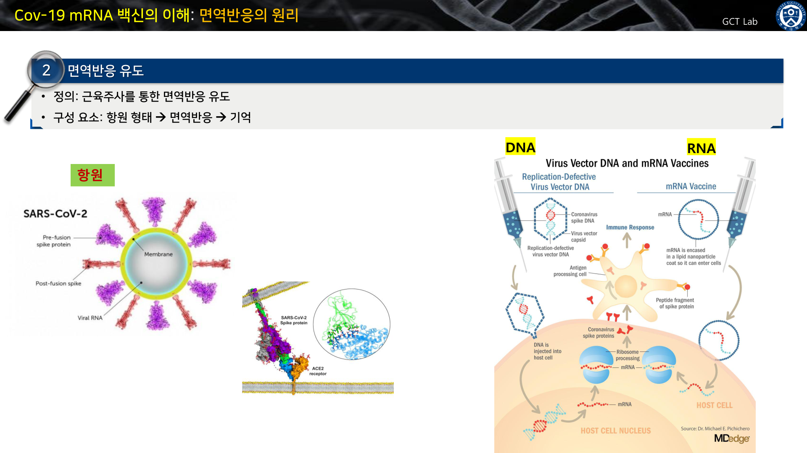
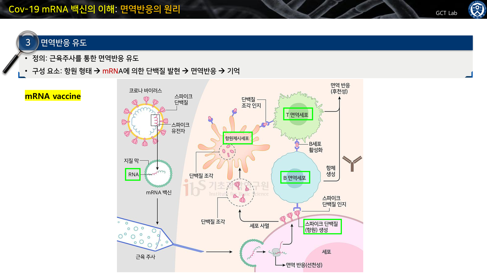

# 문제

COVID-19 mRNA vaccine의 면역반응 우수성은 어떻게 정리되는가?

답:
COVID-19 mRNA vaccine은 ==우수한 효능==을 보였다.
LNP-mRNA 전달을 통해 항원 단백질 발현과 면역반응을 효과적으로 유도했다.
자료에서는 기존 백신 개발 방식과 비교해 mRNA platform의 경쟁력이 강조된다.

[해설]
COVID-19 mRNA vaccine이 중요하게 다뤄지는 이유는 mRNA platform이 실제 대규모 감염병 대응에서 성과를 보였기 때문이다.
LNP-mRNA 전달은 mRNA가 세포 안에서 항원 단백질을 만들게 하고, 이 항원이 면역반응을 유도한다.
기존 방식에 비해 항원 서열을 바탕으로 빠르게 설계하고 생산으로 연결할 수 있다는 점이 강조된다.
효능이 우수했다는 말은 단순히 결과가 좋았다는 뜻이 아니라 mRNA platform이 백신 개발 방식으로 검증되었다는 의미이다.
시험에서는 제품명보다 ==platform의 빠른 설계·생산 가능성==과 ==면역반응 유도 능력==을 같이 써야 한다.

출처: 바이오의약품학 기말고사 범위 요약자료.pdf p.35
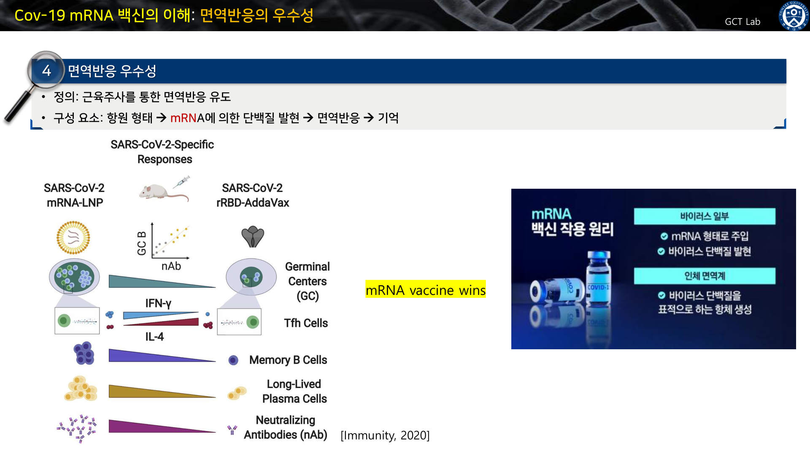

# 문제

COVID-19 mRNA vaccine이 감염백신의 새로운 기준으로 제시되는 이유는 무엇인가?

답:
COVID-19 mRNA vaccine은 ==백신의 새 역사==로 정리된다.
이유는 **공정**과 **효능**이 탁월했고, ==100/200일 project==처럼 다음 pandemic 대응 속도 기준과 연결되기 때문이다.
따라서 mRNA platform은 감염병 백신 개발의 속도와 확장성 기준을 바꾼 기술로 이해해야 한다.

[해설]
COVID-19 mRNA vaccine을 “백신의 새 역사”라고 정리하는 이유는 백신 개발의 속도와 공정 기준을 바꿨기 때문이다.
mRNA platform은 항원 서열만 정해지면 설계와 생산으로 빠르게 넘어갈 수 있다.
자료의 100/200일 project는 다음 pandemic에서 더 빠른 백신 대응을 목표로 한다는 의미로 연결된다.
즉 COVID-19 사례는 mRNA 백신이 특정 감염병 하나에만 쓰인 것이 아니라, 향후 감염병 대응 platform으로 인정받은 사례이다.
답에는 ==공정==, ==효능==, ==다음 pandemic 대응 속도==를 같이 연결하는 것이 좋다.

출처: 바이오의약품학 기말고사 범위 요약자료.pdf p.36, p.37
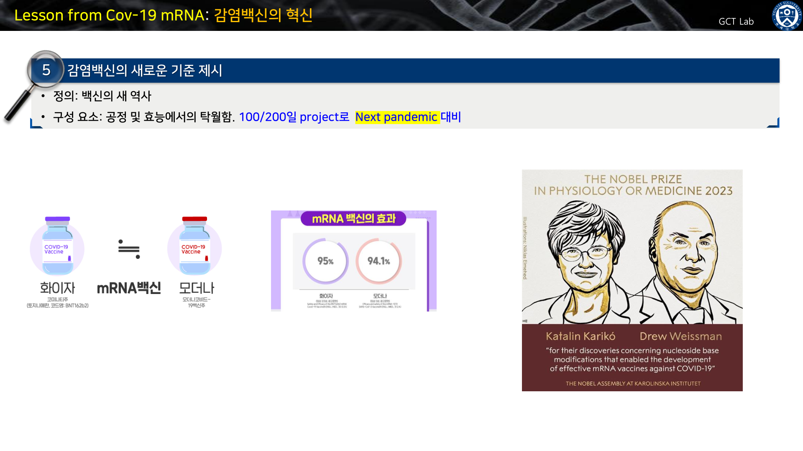
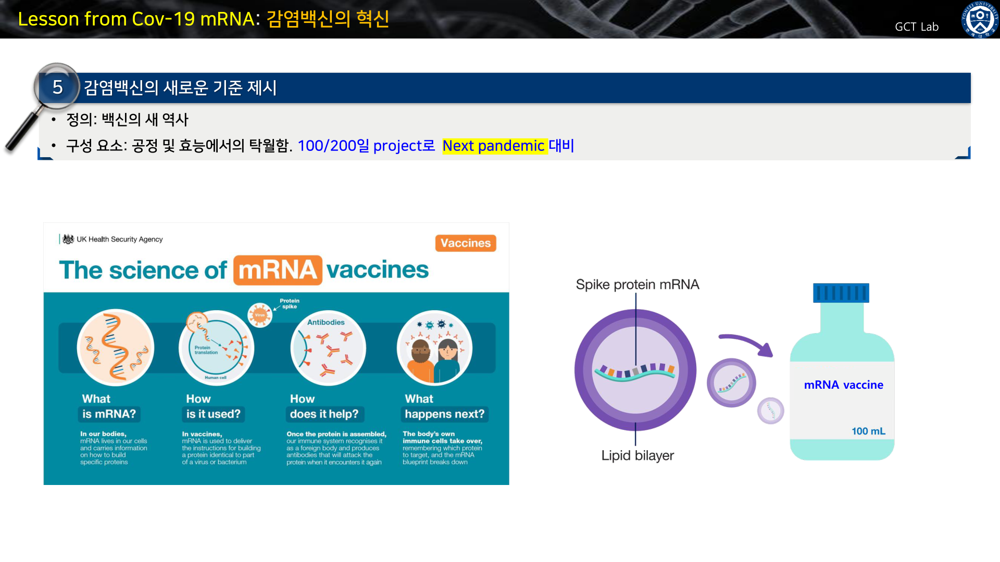

# 문제

감염 백신과 암 백신은 정의와 구성 요소가 어떻게 다른가?

답:
### 감염병 백신
· 목적: ==예방==
· 항원은 병원체 유래 non-self로 이해한다.
· 감염 전에 면역 기억을 만들어 질병을 막는 것이 핵심이다.

### 암백신
· 목적: ==치료==
· 항원은 암세포 특이 또는 암세포 관련 항원이다.
· 이미 생긴 암을 면역반응으로 공격하게 만드는 것이 핵심이다.

[해설]
감염병 백신과 암백신은 모두 항원, 면역반응, 기억을 이용하지만 목적이 다르다.
감염병 백신은 병원체를 만나기 전에 면역기억을 만들어 ==예방==하려는 전략이다.
암백신은 이미 존재하는 암세포를 면역계가 더 잘 알아보고 공격하게 만들어 ==치료==하려는 전략이다.
그래서 감염병 백신의 항원은 병원체 유래 non-self와 연결되고, 암백신의 항원은 암세포 특이 또는 암세포 관련 항원과 연결된다.
두 백신을 비교할 때는 구성 요소보다 최종 목적의 차이를 먼저 잡아야 한다.

출처: 바이오의약품학 기말고사 범위 요약자료.pdf p.38
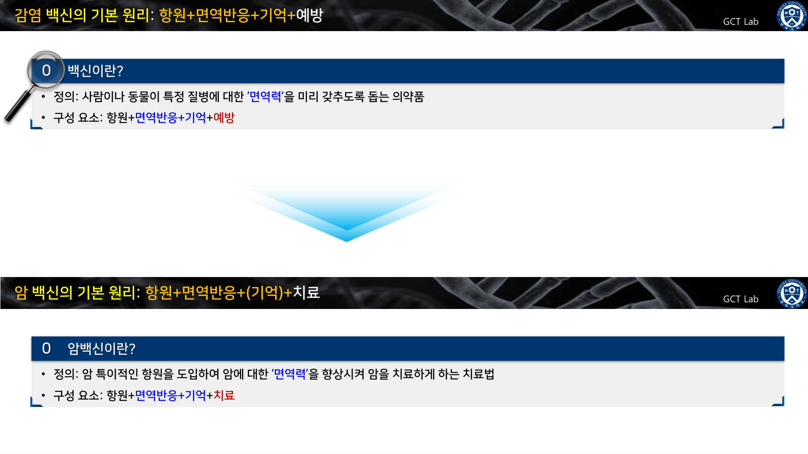

# 문제

암백신을 정의하고 구성 요소를 쓰시오.

답:
암백신: 암에 대한 ==면역력==을 향상시켜 암을 치료하게 하는 치료법
구성 요소: ==항원 + 면역반응 + 기억 + 치료==

[해설]
암백신은 암세포에 대한 면역반응을 만들거나 강화해 치료 효과를 얻으려는 방법이다.
여기서 항원은 면역계가 암세포를 알아보게 하는 표식 역할을 한다.
면역반응은 그 항원을 본 면역세포가 활성화되는 과정이고, 기억은 이후에도 같은 암 항원에 반응할 수 있게 하는 요소이다.
감염병 백신과 구조가 비슷해 보이지만 최종 목적은 예방이 아니라 ==치료==이다.
정의형으로 나오면 “암에 대한 면역력 향상”과 “항원+면역반응+기억+치료”를 같이 쓰는 것이 안전하다.

출처: 바이오의약품학 기말고사 범위 요약자료.pdf p.39, p.40
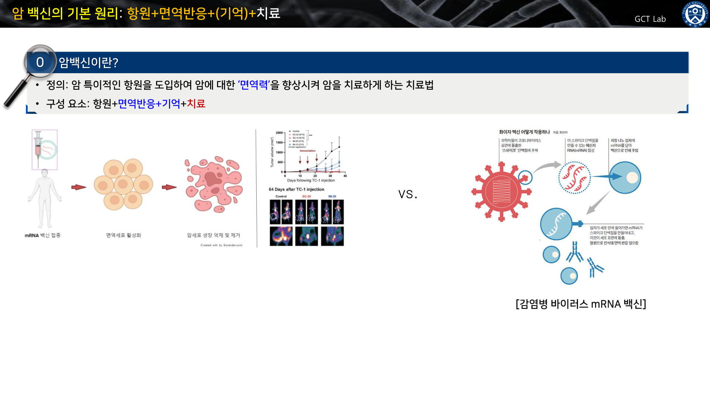
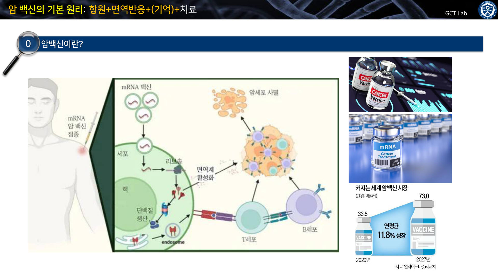

# 문제

암백신의 일반적인 절차를 순서대로 쓰시오.

답:
신생항원 발굴
mRNA 구조체 설계
LNP-mRNA 복합체 또는 바이러스 전달
항원 특이적 면역반응 유도
암세포 공격과 치료 반응 확인

[해설]
암백신 절차는 항원을 찾는 단계와 실제 면역반응을 만드는 단계로 나누어 이해하면 쉽다.
먼저 암세포에 특이적인 neo-antigen을 찾는다.
그 다음 그 항원을 만들 수 있도록 mRNA 구조체를 설계하고, LNP-mRNA 또는 바이러스 전달체로 세포에 전달한다.
전달된 정보가 항원 발현과 항원 제시로 이어져야 면역세포가 활성화된다.
최종적으로 암세포 공격과 치료 반응이 나타나야 암백신으로서 의미가 있다.
따라서 절차형 문제에서는 ==항원 발굴 → 설계 → 전달 → 면역반응 → 치료반응== 순서를 유지해야 한다.

출처: 바이오의약품학 기말고사 범위 요약자료.pdf p.41
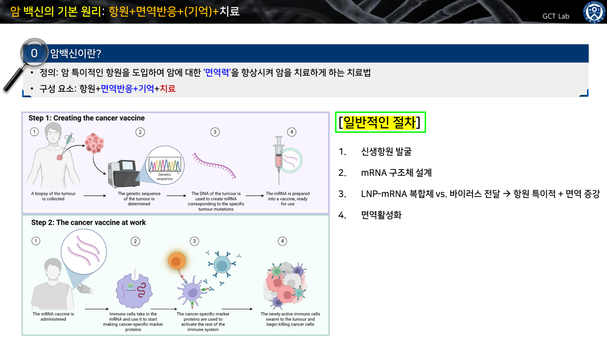

# 문제

암백신에서 neo-antigen은 무엇이며 왜 디자인이 중요한가?

답:
==Neo-antigen==은 종양세포 돌연변이에서 생긴 새로운 항원이다.
정상세포에는 없거나 적고 암세포에 특이적으로 나타난다.
그래서 면역계가 암세포를 구분해 공격할 표적으로 사용할 수 있다.

[해설]
Neo-antigen은 암세포 돌연변이 때문에 새로 생긴 항원이다.
정상세포에는 없거나 적고 암세포에 특이적으로 나타나기 때문에 면역계가 암세포를 구분하는 표적으로 쓰기 좋다.
암백신에서 항원이 너무 정상세포와 비슷하면 면역계가 암만 선택적으로 공격하기 어렵다.
그래서 neo-antigen은 암세포 특이성을 높이고 정상조직 공격 위험을 줄이는 방향과 연결된다.
시험에서는 neo-antigen을 “돌연변이 유래 암 특이 항원”으로 정의한 뒤 암백신 표적이라는 의미를 붙이면 된다.

출처: 바이오의약품학 기말고사 범위 요약자료.pdf p.42
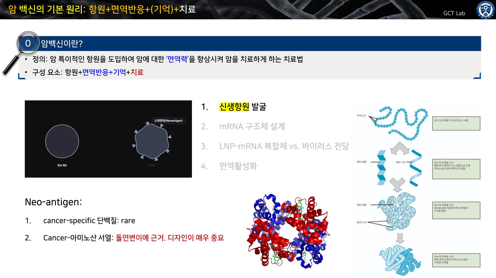

# 문제

암백신에서 mRNA 구조체 설계는 어떤 의미인가?

답:
mRNA 구조체는 ==항원 단백질 발현==을 위해 설계된다.
항원 서열뿐 아니라 안정성, 번역 효율, 면역반응 유도 가능성을 고려해야 한다.
결국 목표는 세포 안에서 원하는 항원이 충분히 발현되어 면역계에 제시되도록 하는 것이다.

[해설]
mRNA 구조체 설계는 항원 정보를 mRNA에 적어 넣는 데서 끝나지 않는다.
세포 안에서 mRNA가 충분히 안정적으로 존재하고, 항원 단백질로 잘 번역되어야 면역반응이 생긴다.
항원 단백질 발현이 약하면 항원 제시도 약해지고, 결국 암세포를 공격할 면역반응도 약해진다.
따라서 mRNA 구조체 설계는 ==항원 발현량==과 ==면역반응 유도 가능성==을 좌우하는 단계이다.
이 문제는 mRNA를 단순 전달물질이 아니라 백신 효과를 결정하는 설계도처럼 이해하면 된다.

출처: 바이오의약품학 기말고사 범위 요약자료.pdf p.43
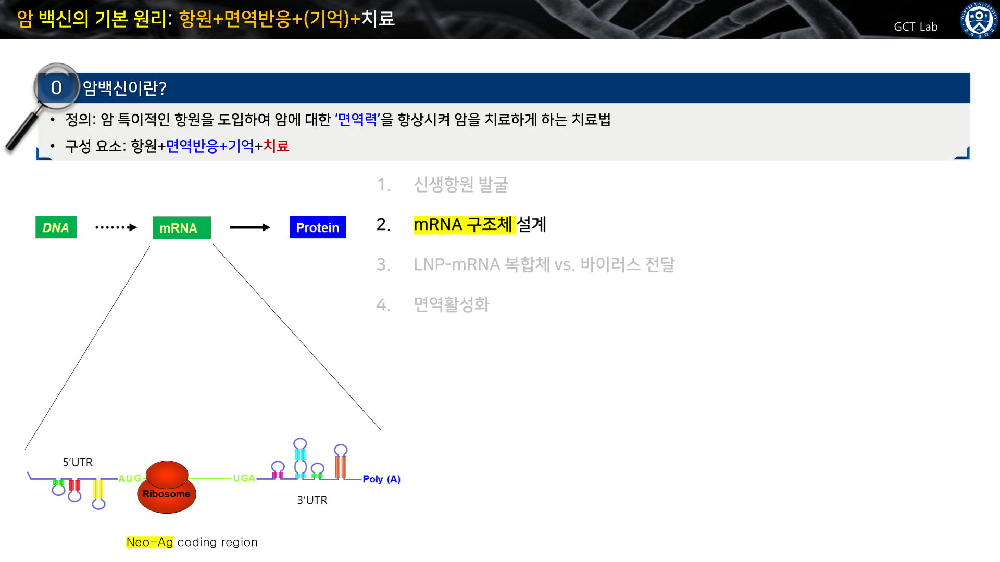

# 문제

암백신에서 LNP-mRNA 복합체 또는 바이러스 전달 단계는 왜 필요한가?

답:
### LNP-mRNA
· mRNA를 보호하고 세포 안으로 전달한다.
· 비바이러스 전달체 전략이다.
· 반복 투여와 제조 확장성 측면에서 장점이 있다.

### Viral delivery
· 바이러스를 전달체로 사용한다.
· 세포 감염 능력을 이용해 유전정보를 넣는다.

[해설]
mRNA나 유전정보는 그냥 주입한다고 원하는 세포에 안정적으로 전달되는 것이 아니다.
LNP-mRNA는 mRNA를 세포 안으로 보내기 위한 비바이러스 전달 전략이다.
Viral delivery는 바이러스의 세포 진입 능력을 이용해 유전정보를 전달하는 전략이다.
두 방식 모두 목적은 항원 정보를 세포 안으로 넣어 항원 발현과 면역반응으로 이어지게 하는 것이다.
따라서 비교할 때는 “LNP는 비바이러스, viral delivery는 바이러스 전달체”라는 차이와 함께 **왜 전달체가 필요한지**를 써야 한다.

출처: 바이오의약품학 기말고사 범위 요약자료.pdf p.44
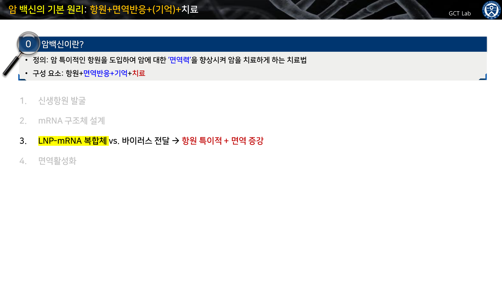

# 문제

암백신의 면역활성화 및 치료 반응은 어떤 흐름으로 이해해야 하는가?

답:
전달된 mRNA가 항원 단백질을 발현한다.
항원이 제시되어 면역세포가 활성화된다.
활성화된 면역반응이 암세포를 공격한다.
최종 목표는 ==면역반응과 치료 반응의 연결==이다.

[해설]
암백신의 면역활성화 흐름은 항원 정보를 넣는 단계와 실제 치료 반응이 나오는 단계를 연결하는 문제이다.
전달된 mRNA가 항원 단백질을 만들고, 그 항원이 면역계에 제시된다.
항원을 본 면역세포가 활성화되어 암세포를 공격해야 치료 반응이 된다.
즉 mRNA 전달은 출발점이고, 최종 목표는 ==면역반응과 치료 반응의 연결==이다.
답을 쓸 때는 “mRNA를 넣는다”에서 끝내지 말고 항원 제시와 암세포 공격까지 이어 써야 한다.

출처: 바이오의약품학 기말고사 범위 요약자료.pdf p.45
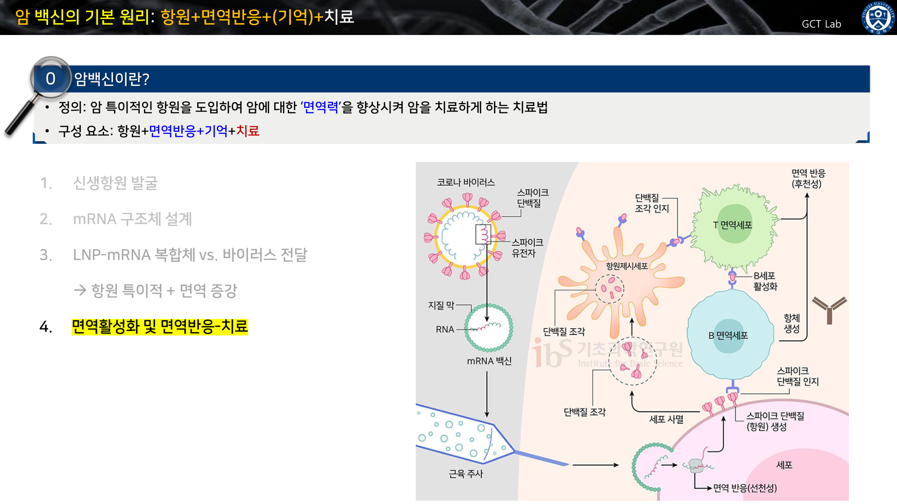

# 문제

감염병 백신, 암백신, 면역관문억제제는 치료 목적과 형태가 어떻게 구분되는가?

답:
### 감염병 백신
· 목적: ==예방==
· 구성: 항원 + 면역반응 + 기억 + 예방

### 암백신
· 목적: ==치료==
· 구성: 항원 + 면역반응 + 기억 + 치료

### 면역관문억제제
· 형태: ==면역관문 억제 항체==
· 목적: 기존 항암 면역반응의 억제 신호를 차단한다.

[해설]
세 치료 전략은 모두 면역계를 이용하지만 작동 방식이 다르다.
감염병 백신은 항원을 통해 면역기억을 만들어 미래 감염을 ==예방==한다.
암백신은 암 항원을 제시해 암세포를 공격하는 면역반응을 ==치료==로 연결한다.
면역관문억제제는 새 항원을 넣는 것이 아니라 이미 존재하는 항암 면역반응의 억제 신호를 차단한다.
따라서 감염병 백신과 암백신은 항원 제시 중심, 면역관문억제제는 억제 신호 차단 중심으로 구분하면 된다.

출처: 바이오의약품학 기말고사 범위 요약자료.pdf p.46
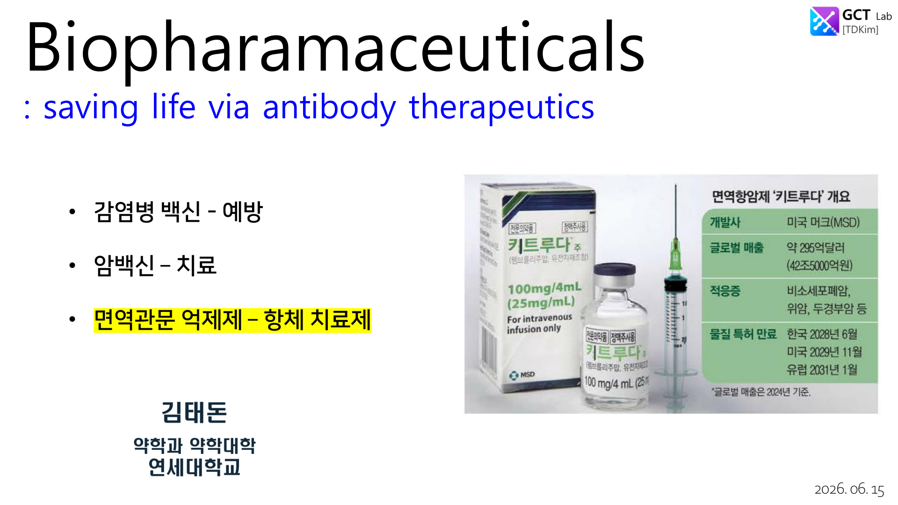

# 문제

암백신과 면역관문억제제의 정의와 구성 요소를 각각 쓰시오.

답:
### 암백신
· 정의: 암에 대한 ==면역력==을 향상시켜 암을 치료하게 하는 치료법
· 구성 요소: 항원 + 면역반응 + 기억 + 치료
· 핵심: 암 항원을 제시해 새로운 항암 면역반응을 유도한다.

### 면역관문억제제
· 정의: 면역관문 단백질 신호를 차단하는 ==항체 치료제==
· 구성 요소: 면역관문 억제 항체
· 핵심: 이미 생긴 항암 면역반응의 억제 신호를 막는다.

[해설]
암백신과 면역관문억제제는 모두 면역항암치료이지만 출발점이 다르다.
암백신은 암 항원을 제시해 면역반응을 새로 만들거나 강화하는 전략이다.
면역관문억제제는 PD-1, PD-L1, CTLA-4 같은 억제 신호를 막아 기존 T cell 반응이 눌리지 않게 하는 항체 치료제이다.
그래서 암백신의 구성요소는 항원, 면역반응, 기억, 치료이고 면역관문억제제의 구성요소는 면역관문 억제 항체로 정리된다.
시험에서는 두 치료를 모두 “면역을 이용한다”로 묶은 뒤, ==항원 제시==와 ==억제 신호 차단==의 차이를 분명히 써야 한다.

출처: 바이오의약품학 기말고사 범위 요약자료.pdf p.47
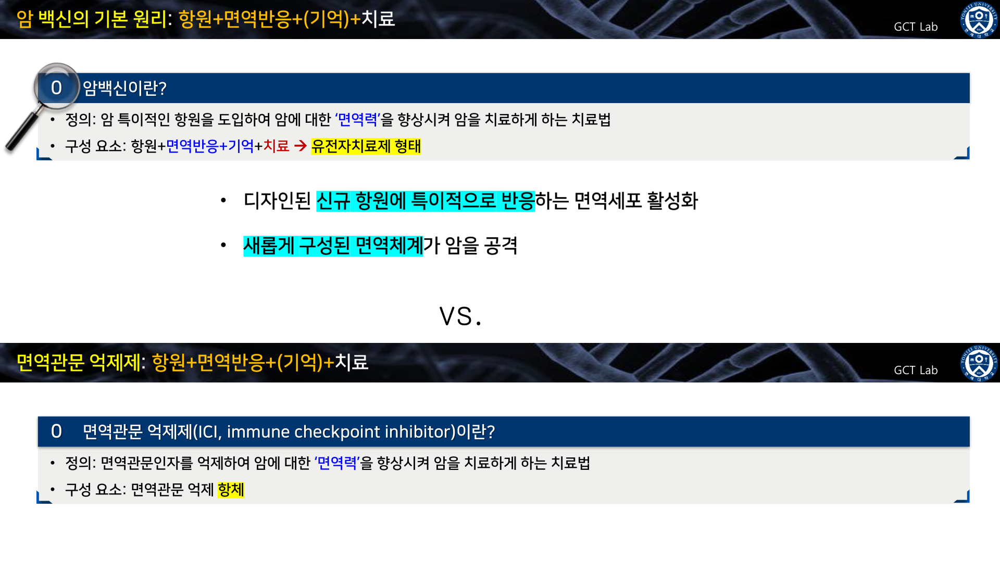

# 문제

암백신과 면역관문억제제의 유사점과 차이점은 무엇인가?

답:
### 유사점
· 둘 다 ==면역항암치료==이다.
· 면역세포가 암세포를 공격하도록 돕는다.

### 차이점
· 암백신은 암 항원을 이용해 ==새로운 면역반응==을 유도한다.
· 면역관문억제제는 이미 존재하는 면역반응의 ==억제 신호==를 차단한다.

[해설]
둘 다 면역세포가 암세포를 공격하도록 돕는 치료라는 점에서는 같다.
하지만 암백신은 암 항원을 이용해 면역계가 암을 더 잘 알아보게 만드는 방향이다.
면역관문억제제는 암이 이용하는 면역 억제 축을 차단해 이미 존재하는 항암 면역반응이 더 잘 작동하게 한다.
따라서 암백신은 ==새로운 면역반응 유도==, 면역관문억제제는 ==기존 면역반응의 억제 해제==로 비교하면 된다.
이 차이를 쓰면 두 치료의 유사점과 차이점을 한 문항 안에서 동시에 설명할 수 있다.

출처: 바이오의약품학 기말고사 범위 요약자료.pdf p.48, p.54
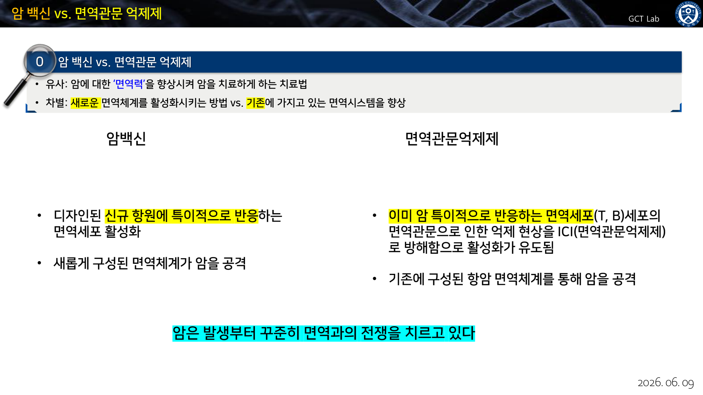
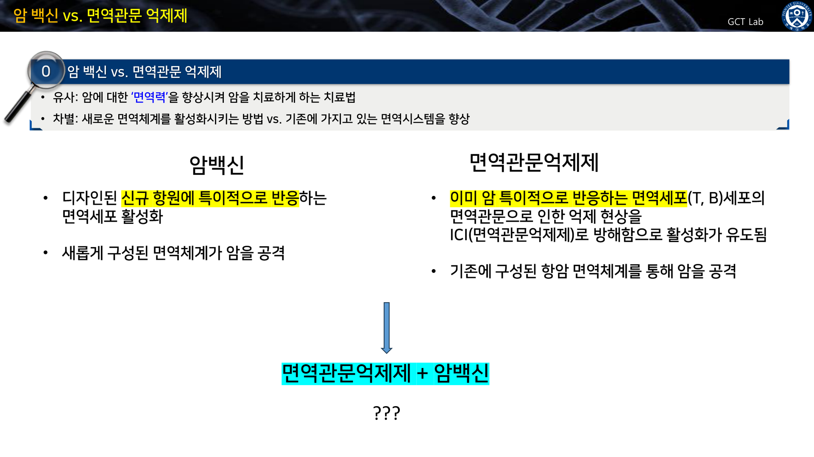

# 문제

항암제 치료제 세대는 1세대, 2세대, 3세대로 어떻게 구분되는가?

답:
### 1세대 항암제
· ==화학항암제==
· 빠르게 분열하는 세포를 공격한다.

### 2세대 항암제
· ==표적항암제==
· 암세포의 특정 표적 분자를 겨냥한다.

### 3세대 항암제
· ==면역항암제==
· 면역세포가 암세포를 공격하도록 돕는다.

[해설]
항암제 세대 구분은 암을 어떻게 공격하느냐의 변화이다.
1세대 화학항암제는 빠르게 분열하는 세포를 넓게 공격하므로 정상세포 손상 위험도 함께 생긴다.
2세대 표적항암제는 암세포의 특정 분자 표적을 겨냥해 선택성을 높이려는 전략이다.
3세대 면역항암제는 약이 암세포를 직접 공격하기보다 면역계가 암세포를 공격하도록 돕는 방향이다.
따라서 세대가 올라갈수록 “세포분열 전체 공격 → 분자 표적 공격 → 면역반응 조절”로 관점이 바뀐다고 이해하면 된다.

출처: 바이오의약품학 기말고사 범위 요약자료.pdf p.49
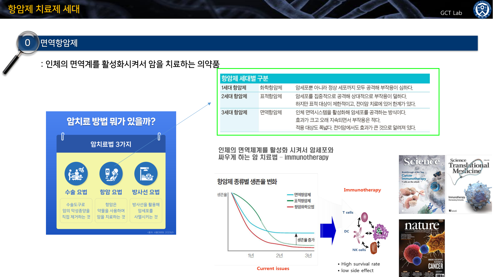

# 문제

면역관문은 무엇이며 어떤 구성 요소로 신호가 전달되는가?

답:
면역관문은 ==면역반응을 억제하여 면역 항상성을 유지==하는 조절 장치이다.
구성은 ==리간드 + 수용체== 신호전달로 이해한다.
대표 축은 ==PD-1/PD-L1==과 ==CTLA-4/B7==이다.

[해설]
면역관문은 면역반응이 과도하게 켜지지 않도록 조절하는 억제 신호 체계이다.
정상적으로는 면역 항상성을 유지하고 자기 조직 손상을 막는 역할을 한다.
이 신호는 보통 세포 표면의 ==리간드==와 ==수용체==가 결합하면서 전달된다.
암세포는 이 억제 신호를 이용해 T cell 공격을 피할 수 있다.
면역관문억제제는 이 억제 신호 결합을 막아 항암 면역반응이 다시 작동하도록 돕는 항체 치료제이다.

출처: 바이오의약품학 기말고사 범위 요약자료.pdf p.50, p.51, p.53
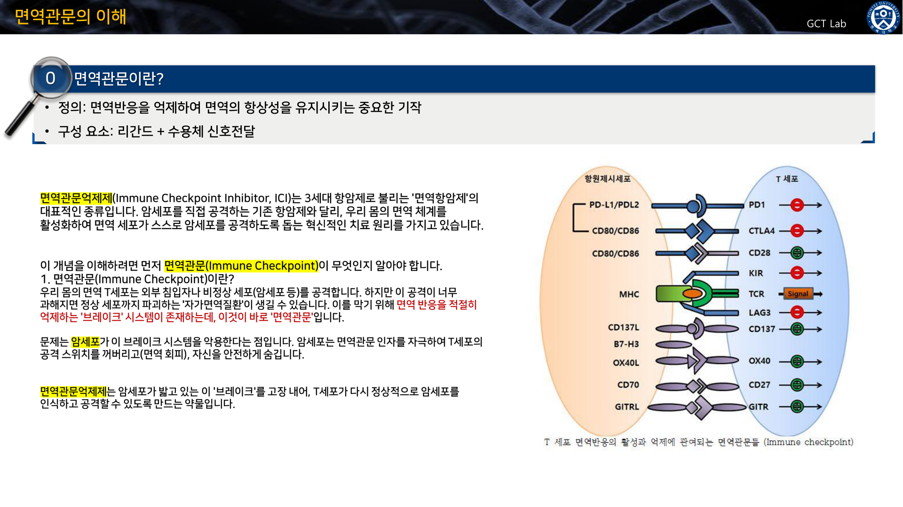
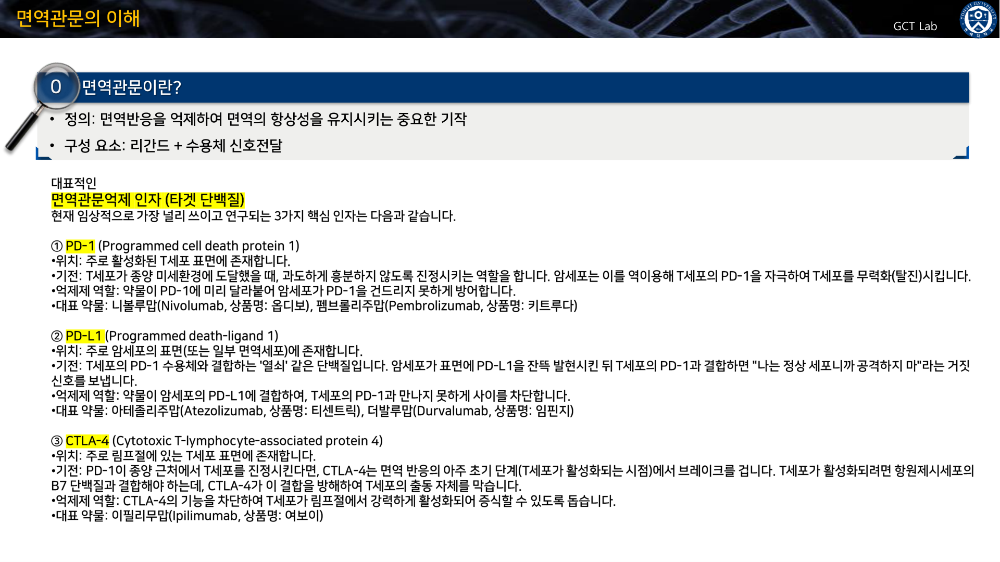
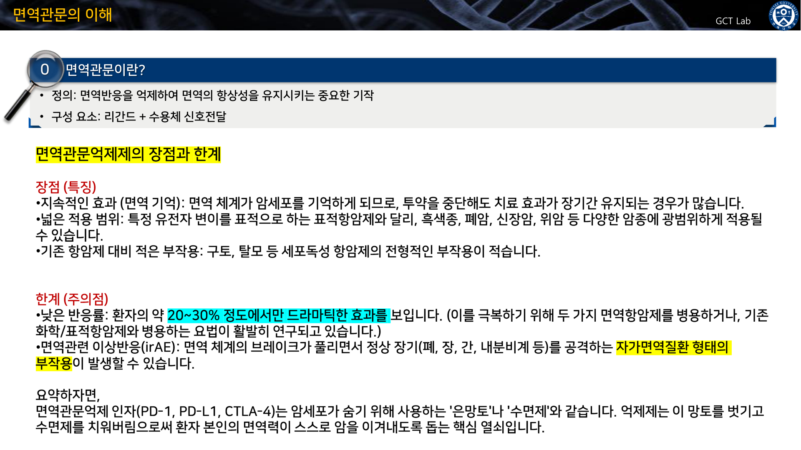

# 문제

대표적인 면역관문억제 인자인 PD-1, PD-L1, CTLA-4를 위치, 기전, 대표 약물로 구분하시오.

답:
### PD-1
· 주로 활성화된 T cell 표면에 있는 수용체이다.
· 종양미세환경에서 T cell 활성을 낮추는 축과 연결된다.
· 대표 약물: ==Nivolumab==, ==Pembrolizumab==

### PD-L1
· 주로 암세포 또는 일부 면역세포 표면에 있는 ligand이다.
· PD-1에 결합해 T cell에 억제 신호를 보낸다.
· 대표 약물: ==Atezolizumab==, ==Durvalumab==

### CTLA-4
· 주로 림프절 T cell 활성화 초기 단계의 억제 수용체이다.
· B7 결합을 방해해 T cell activation을 억제한다.
· 대표 약물: ==Ipilimumab==

[해설]
PD-1, PD-L1, CTLA-4는 모두 면역 억제 신호와 관련되지만 위치와 역할이 다르다.
==PD-1==은 주로 T cell 쪽 수용체로, PD-L1과 결합하면 T cell 활성이 낮아진다.
==PD-L1==은 주로 암세포나 일부 면역세포 쪽 ligand로, T cell의 PD-1에 결합해 억제 신호를 보낸다.
==CTLA-4==는 T cell 활성화 초기 단계에서 B7 결합을 방해해 T cell activation을 낮추는 수용체이다.
따라서 PD-1/PD-L1은 종양미세환경에서의 T cell 억제, CTLA-4는 초기 T cell 활성화 조절로 나누어 이해하면 된다.
약물명은 표적과 같이 연결해 외우면 혼동이 줄어든다.

출처: 바이오의약품학 기말고사 범위 요약자료.pdf p.51, p.52

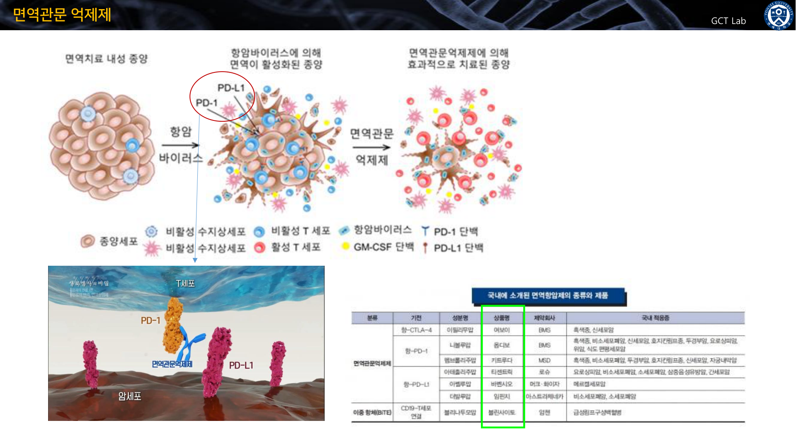

# 문제

면역관문억제제의 장점과 한계는 무엇인가?

답:
### 장점
· 기존 화학항암제와 달리 면역반응을 이용한다.
· 일부 환자에서 지속적인 반응이 가능하다.
· 암종에 따라 강한 임상적 효과를 보일 수 있다.

### 한계
· 모든 환자에게 효과가 나타나는 것은 아니다.
· 반응률 차이가 크다.
· 면역 관련 부작용이 생길 수 있다.
· 병용요법과 biomarker 선별이 중요하다.

[해설]
면역관문억제제의 장점은 면역계를 이용해 암을 공격하게 만들기 때문에 일부 환자에서 오래 지속되는 반응이 가능하다는 점이다.
하지만 이 약은 암세포를 직접 독성으로 죽이는 약이 아니라 억제 신호를 차단하는 약이다.
그래서 환자 안에 작동 가능한 항암 면역반응이 없거나 종양 환경이 면역반응을 강하게 막고 있으면 효과가 제한될 수 있다.
면역 억제를 풀면 정상조직을 향한 면역반응도 강해질 수 있어 면역 관련 부작용이 생길 수 있다.
따라서 반응률 차이, biomarker 선별, 병용요법 필요성이 한계로 같이 정리된다.

출처: 바이오의약품학 기말고사 범위 요약자료.pdf p.53

# 문제

특정 바이오의약품을 정리할 때 어떤 기본 골격으로 서술해야 하는가?

답:
### 기본 골격
· ==이름==
· ==개요==: 일반적인 Summary, TPP
· ==작용기전==
· ==임상개발 과정 및 허가==
· ==임상적 결과==: 시판 이후 결과와 미충족 과제
· ==개선점==: 개인의 생각을 덧붙일 수 있음

[해설]
이 문항의 목적은 특정 약물 이름 하나를 암기하는 것이 아니라 바이오의약품을 분석하는 서술 틀을 잡는 것이다.
==이름==은 어떤 제품을 말하는지 정하는 출발점이다.
==개요와 TPP==는 그 약이 어떤 질환, 환자군, 치료 목표를 겨냥하는지 정리하는 부분이다.
==작용기전==은 왜 효과가 나는지를 설명하는 부분이고, 임상개발 과정과 허가는 실제 약으로 인정받기까지의 근거를 보여준다.
==임상적 결과와 미충족 과제==는 시판 후에도 남는 한계를 보는 항목이며, 개선점은 그 한계를 어떻게 보완할지 제시하는 부분이다.
시험에서 특정 바이오의약품 예시가 나오면 이 순서대로 쓰면 답안 구조가 무너지지 않는다.

출처: 바이오의약품학 기말고사 범위 요약자료.pdf p.55
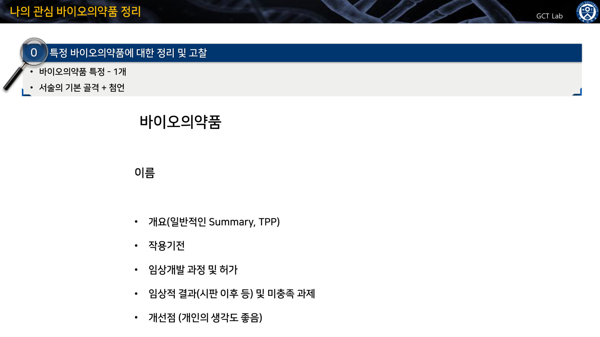
