# 문제

유전자치료제는 작용기전, 전달체, 투여방식이라는 세 기준으로 분류한다. 각 기준에서 무엇을 묻는 것인지 설명하시오.

답:
작용기전: 유전자를 **어떻게 조작해서** 치료효과를 내는가
전달체: 유전자를 표적 세포까지 **무엇에 실어** 보낼 것인가
투여방식: 몸 안에서 바로 할 것인가, 세포를 꺼내 조작한 뒤 다시 넣을 것인가

[해설]
유전자치료제를 분류할 때는 한 가지 기준만 보는 것이 아니라, 치료가 작동하는 방식과 ==전달 방식==과 투여 방식을 나누어 본다.
==작용기전==은 유전자를 보충하는지, 발현을 억제하는지, 유전체를 편집하는지처럼 치료효과가 생기는 원리를 묻는다.
==전달체==는 ==AAV==, ==Lentivirus==, ==LNP==처럼 유전물질을 세포까지 운반하는 수단을 묻는다.
==투여방식==은 환자 몸 안에 직접 넣는 ==in vivo==인지, 세포를 몸 밖에서 조작한 뒤 다시 넣는 ==ex vivo==인지를 묻는다.
출처: 바이오의약품학 기말고사 수업자료.pdf p.123, p.124, p.125, p.165
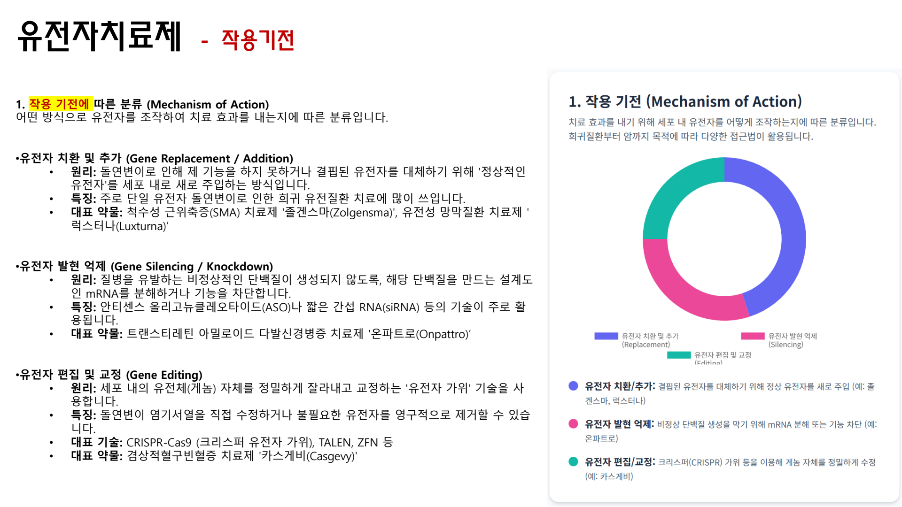
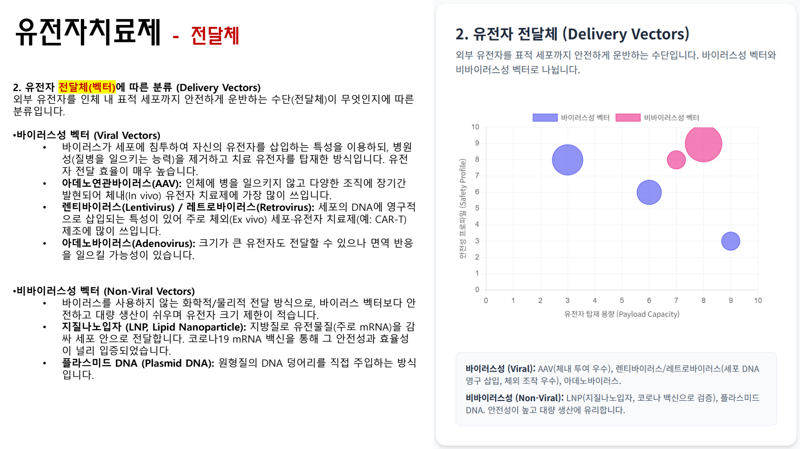
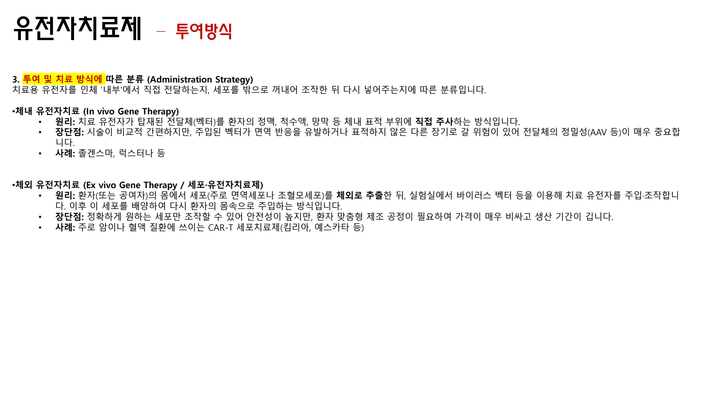
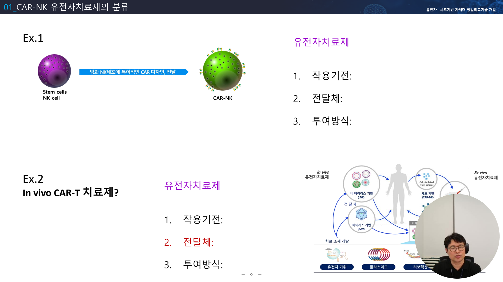

# 문제

Zolgensma, Luxturna, Onpattro, Casgevy를 작용기전 관점에서 나누면 어떻게 정리되는가?

답:
**Zolgensma**, **Luxturna**: 유전자 치환 및 추가
**Onpattro**: 유전자 발현 억제
**Casgevy**: 유전자 편집 및 교정

[해설]
==Zolgensma==와 ==Luxturna==는 부족하거나 결함이 있는 유전자 기능을 정상 유전자 제공으로 보충하는 치료제로 정리된다.
==Onpattro==는 병을 일으키는 단백질이 만들어지지 않도록 유전자 발현을 억제하는 쪽에 해당한다.
==Casgevy==는 유전체의 특정 부분을 편집하거나 교정하는 치료제로 분류된다.
이 문제는 약물명을 외우는 것보다, 각 약물이 **유전자 추가**, **발현 억제**, **유전자 편집** 중 어디에 속하는지 연결하는 것이 중요하다.
출처: 바이오의약품학 기말고사 수업자료.pdf p.123

# 문제

AAV, Lentivirus/Retrovirus, LNP는 각각 어떤 전달 상황에 적합한가?

답:
**AAV**: 체내에서 장기간 유전자 발현이 필요한 in vivo 유전자치료
**Lentivirus/Retrovirus**: 세포 DNA에 삽입되어 ex vivo 세포·유전자치료제 제조에 사용
**LNP**: mRNA 같은 핵산을 지방질로 감싸 세포 안으로 전달

[해설]
==AAV==는 adeno-associated virus 기반 ==전달체==로, 체내에서 비교적 장기간 유전자 발현이 필요한 ==in vivo== 유전자치료에 자주 연결된다.
==Lentivirus==와 ==Retrovirus==는 유전자가 세포 DNA에 삽입될 수 있어, 환자 세포를 밖에서 조작하는 ==ex vivo== 세포·유전자치료제 제조와 연결된다.
==LNP==는 ==lipid nanoparticle==로, mRNA 같은 핵산을 지방질 입자로 감싸 세포 안으로 전달하는 비바이러스 ==전달체==이다.
따라서 ==AAV==는 체내 장기 발현, ==Lentivirus==와 ==Retrovirus==는 ==ex vivo== 세포 조작, ==LNP==는 mRNA 전달로 구분하면 된다.
출처: 바이오의약품학 기말고사 수업자료.pdf p.124

# 문제

In vivo 유전자치료와 Ex vivo 유전자치료를 제조 난이도와 안전성 관점에서 비교하시오.

답:
**In vivo**: 치료 유전자를 체내 표적 부위에 직접 주사하므로 간편하지만, 전달체가 다른 장기로 갈 위험이 있다.
**Ex vivo**: 세포를 체외에서 조작한 뒤 다시 넣으므로 원하는 세포만 조작하기 쉽지만, 맞춤형 제조가 비싸고 오래 걸린다.

[해설]
==In vivo== 유전자치료는 치료 유전자를 환자 몸 안에 직접 투여해 목표 조직에서 작동하게 하는 방식이다.
이 방식은 세포를 밖에서 따로 제조하지 않아 간편하지만, ==전달체==가 원하는 조직이 아닌 다른 장기로 갈 수 있어 ==안전성== 문제가 생긴다.
==Ex vivo== 유전자치료는 환자나 공여자의 세포를 몸 밖으로 꺼내 유전자를 조작한 뒤 다시 투여하는 방식이다.
==Ex vivo==는 원하는 세포만 골라 조작할 수 있어 통제가 쉽지만, 맞춤형 제조가 필요해 시간과 비용이 커진다.
출처: 바이오의약품학 기말고사 수업자료.pdf p.125

# 문제

CAR 면역치료제는 면역세포의 어떤 능력을 어떤 방향으로 바꾸는 기술인가?

답:
면역세포에 종양 항원을 인지하는 **인공 수용체**를 도입한다.
면역세포의 세포독성 기능을 특정 암 표적에 대해 **재지향**한다.

[해설]
==CAR==는 chimeric antigen receptor, 즉 키메릭 ==항원== 수용체이다.
면역세포가 원래 가지고 있던 살상 능력을 암세포 ==표적 항원== 쪽으로 돌려주는 인공 수용체라고 이해하면 된다.
여기서 재지향은 면역세포가 아무 대상이나 공격하는 것이 아니라, ==CAR==가 인식하는 특정 종양 ==항원==을 가진 세포를 공격하도록 방향을 바꾼다는 뜻이다.
따라서 ==CAR== 면역치료제의 핵심은 **면역세포**, **종양 항원 인식**, **세포독성 기능 재지향**이다.
출처: 바이오의약품학 기말고사 수업자료.pdf p.81
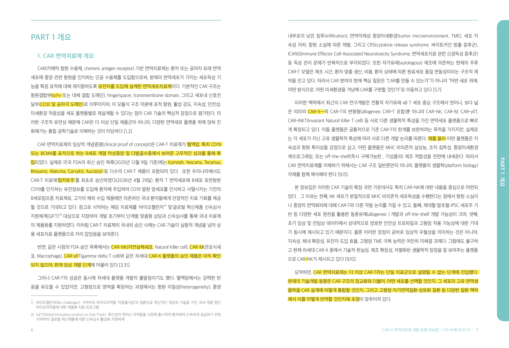

# 문제

CAR 구조가 항원결합부, hinge/spacer, transmembrane domain, 세포내 신호전달부로 나뉜다는 사실이 왜 중요한가?

답:
각 부분을 바꾸면 표적 항원, 활성 강도, 지속성, 안전성을 따로 조절할 수 있다.
그래서 CAR는 단순 수용체가 아니라 **모듈식 세포공학 플랫폼**이다.

[해설]
==CAR==는 하나의 고정된 구조가 아니라 여러 기능 부품으로 나뉜 수용체이다.
==항원==결합부는 어떤 표적을 볼지 결정하고, hinge와 transmembrane domain은 수용체의 위치와 구조 안정성에 관여한다.
세포내 신호전달부는 표적을 만난 뒤 세포가 얼마나 강하게 활성화되고 얼마나 오래 지속될지를 결정한다.
따라서 ==CAR== 구조가 모듈식이라는 말은 표적성, 활성 강도, ==지속성==, ==안전성==을 설계자가 따로 조절할 수 있다는 뜻이다.
출처: 바이오의약품학 기말고사 수업자료.pdf p.81

# 문제

scFv는 CAR에서 어떤 역할을 하며, 왜 CAR-X 치료제 연구에 자주 쓰이는가?

답:
scFv는 Variable Heavy와 Variable Light가 링커로 연결된 **단일 사슬 항체 단편**이다.
CAR의 항원 인식 부위로 작동한다.
항체의 특이성을 유지하면서도 작고 유전자 조작이 쉽다.

[해설]
==scFv==는 ==single-chain variable fragment==의 약자로, 항체의 ==항원== 결합 부위 중 ==heavy chain variable region==과 ==light chain variable region==을 링커로 연결한 작은 항체 조각이다.
항체 전체를 쓰지 않아도 ==항원==이 무엇인지 알아보는 특이성은 유지할 수 있다.
==CAR==에서는 ==scFv==가 세포 바깥쪽 ==항원== 인식 부위가 되어, ==CAR== 세포가 어떤 암 표적을 볼지 결정한다.
그래서 ==scFv==의 종류와 친화도는 ==CAR== 치료제의 표적성, 효능, ==안전성==에 직접 영향을 준다.
출처: 바이오의약품학 기말고사 수업자료.pdf p.129, p.223
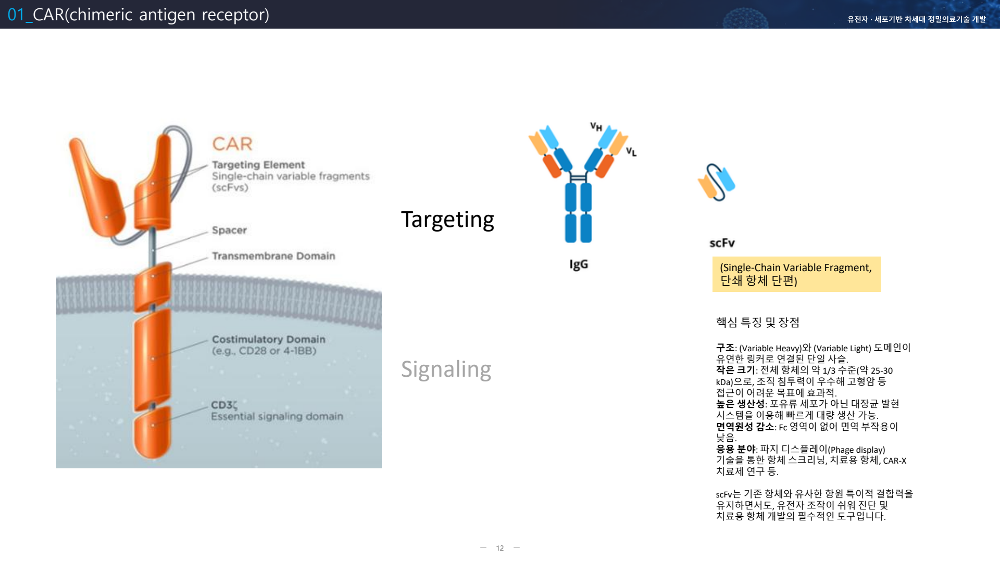
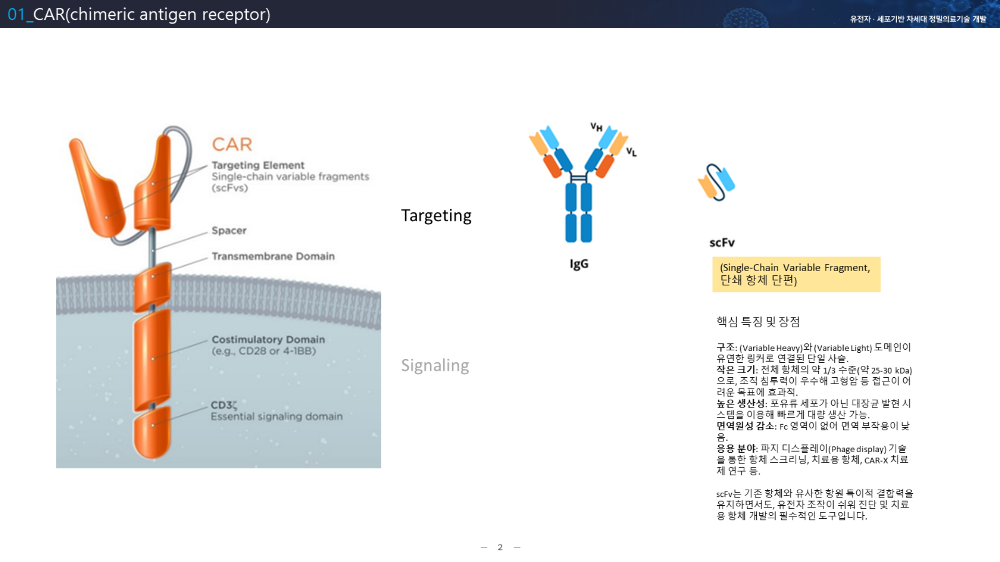

# 문제

1세대에서 4세대로 갈수록 CAR 구조는 단순한 공격 수용체에서 무엇으로 발전하는가?

답:
1세대: CD3ζ 단일 신호로 기본 공격만 가능
2세대: CD28 또는 4-1BB가 추가되어 활성과 지속성 개선
3세대: 공자극 도메인을 여러 개 결합
4세대: cytokine을 분비하는 armored CAR로 종양미세환경까지 조절

[해설]
1세대 ==CAR==는 ==CD3zeta== 신호만 있어 표적을 보면 기본적인 ==T cell== 활성화는 가능하지만 증식과 ==지속성==이 약했다.
2세대 ==CAR==는 ==CD28==이나 ==4-1BB== 같은 ==공자극 도메인==을 추가해 세포 활성과 ==지속성==을 보강했고, 현재 상용 ==CAR-T==의 핵심 구조가 되었다.
3세대 ==CAR==는 ==공자극 도메인==을 여러 개 넣어 신호를 강화하려 했지만, 신호가 세다고 항상 더 좋은 결과가 나는 것은 아니었다.
4세대 ==CAR==는 ==cytokine== 분비 같은 기능을 넣어 단순 살상 세포를 넘어 ==TME==까지 조절하는 armored ==CAR== 개념으로 확장된다.
출처: 바이오의약품학 기말고사 수업자료.pdf p.84, p.85
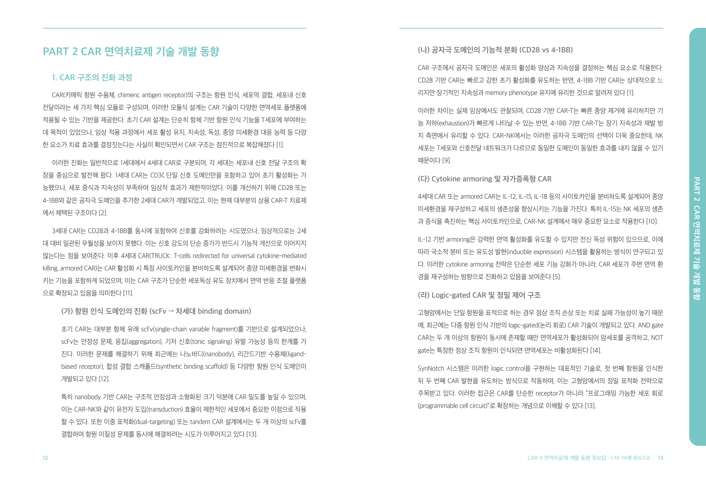
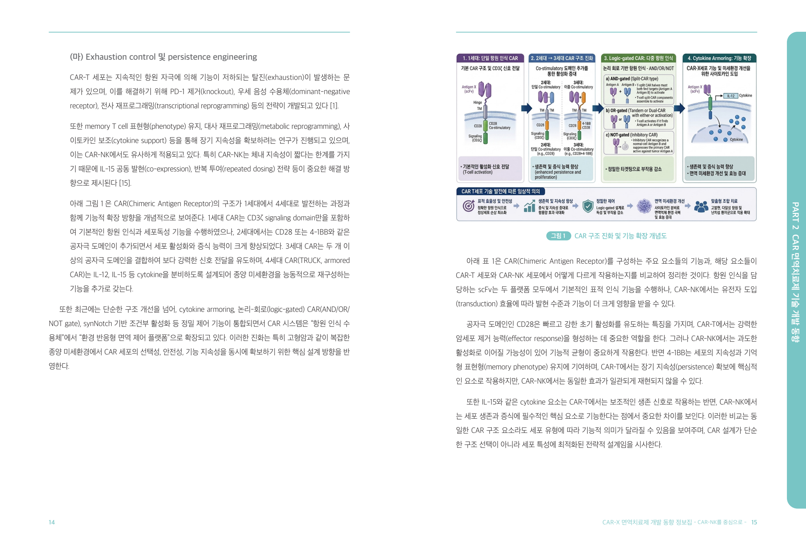

# 문제

CD28, 4-1BB, IL-15는 CAR 설계에서 각각 어떤 의미로 이해해야 하는가?

답:
**CD28**: 빠르고 강한 초기 활성화
**4-1BB**: 장기 지속성과 memory phenotype 유지에 유리
**IL-15**: CAR-NK에서 생존과 증식에 매우 중요한 cytokine

[해설]
==CD28==과 ==4-1BB==는 ==CAR== 내부 신호전달부에 들어가는 **공자극 도메인**이다.
==공자극 도메인==은 ==CAR==가 ==항원==을 만났을 때 면역세포가 얼마나 빠르게 활성화되고 얼마나 오래 기능을 유지할지를 결정한다.
==CD28==은 빠르고 강한 초기 활성화를 유도하는 반면, ==4-1BB==는 상대적으로 장기 ==지속성==과 ==memory phenotype== 유지에 유리하다.
==IL-15==는 도메인이 아니라 ==cytokine==이며, ==CAR-NK==에서 ==NK cell==의 생존과 증식을 돕는 핵심 신호로 이해해야 한다.
출처: 바이오의약품학 기말고사 수업자료.pdf p.84, p.85, p.86

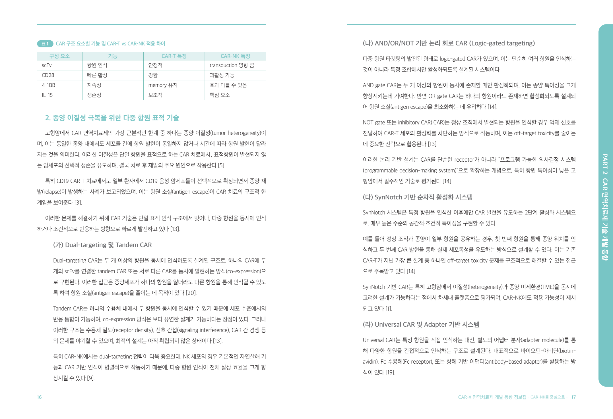

# 문제

CAR-T는 혈액암에서 성공했는데 왜 고형암에서는 그대로 잘 안 되는가?

답:
**항원 이질성**과 antigen escape가 생긴다.
종양 안으로 **침투**하기 어렵다.
**TME**가 면역세포 기능을 억제한다.
세포 지속성이 떨어지고 CRS, ICANS 같은 독성 관리도 필요하다.

[해설]
==CAR-T==는 ==T cell==에 ==CAR==를 넣은 치료제로, ==혈액암==에서는 표적 암세포와 접촉하기 쉽고 CD19 같은 표적도 비교적 명확해 성공했다.
==고형암==은 암 덩어리 안으로 면역세포가 들어가야 하며, ==ECM==과 stromal barrier 때문에 침투가 어렵다.
또한 ==고형암==은 모든 암세포가 같은 ==항원==을 가지지 않아 ==antigen heterogeneity==와 ==antigen escape==가 생긴다.
여기에 ==TME==가 면역세포 기능을 억제하므로, ==CAR-T==가 ==혈액암==에서 성공한 논리를 ==고형암==에 그대로 적용하기 어렵다.
출처: 바이오의약품학 기말고사 수업자료.pdf p.81, p.82, p.100

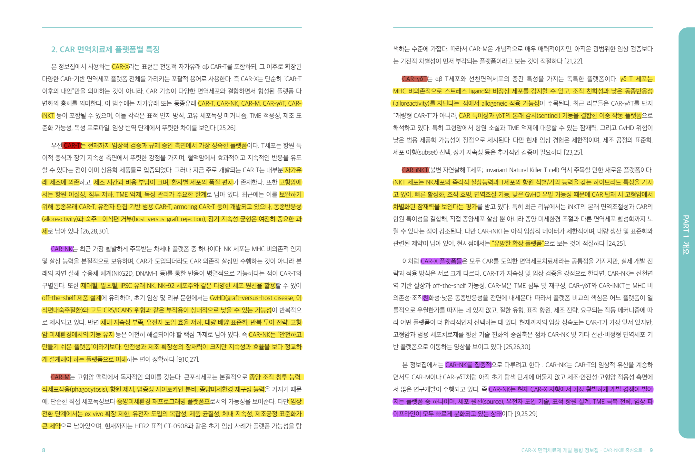
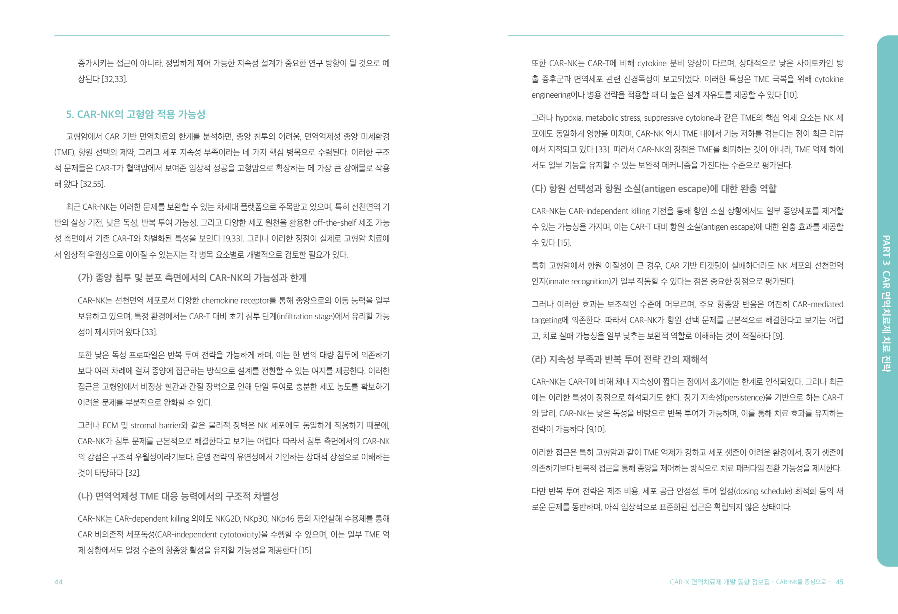

# 문제

CAR-T와 CAR-NK를 치료제로 비교할 때, CAR-NK가 더 유리해 보이는 지점과 아직 해결해야 할 지점을 같이 쓰시오.

답:
유리한 점: MHC 비의존적 살상, multiple activation mechanism, off-the-shelf 가능성, 상대적으로 낮은 독성
한계: 체내 지속성 부족, 유전자 도입 효율, 대량 배양 표준화, 반복 투여 전략 필요

[해설]
==CAR-T==는 임상 검증과 장기 ==지속성==에서 강하지만, 자가유래 맞춤 제조가 많아 시간과 비용 부담이 크다.
==CAR-NK==는 ==NK cell==의 본래 특징 때문에 MHC 비의존적 살상과 ==CAR-independent killing== 가능성을 가진다.
또한 동종유래 ==off-the-shelf== 제품으로 만들 가능성이 있고, CRS나 ICANS 같은 독성 위험이 상대적으로 낮게 제시된다.
하지만 ==CAR-NK==는 체내 ==지속성==이 짧고, 유전자 도입 효율과 대량 배양 표준화가 아직 해결 과제로 남아 있다.
출처: 바이오의약품학 기말고사 수업자료.pdf p.82, p.230, p.251

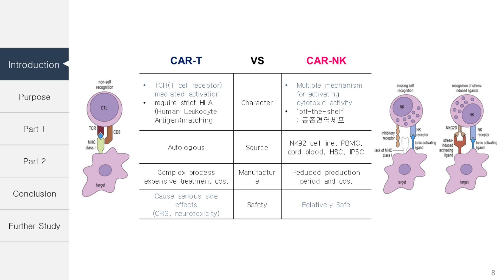

# 문제

T cell, NK cell, macrophage를 암 치료제용 면역세포로 볼 때 각각의 대표 강점은 무엇인가?

답:
T cell: **Expansion**
NK cell: **Safety**
Macrophage: **Infiltration**

[해설]
==T cell==은 ==항원== 특이적으로 활성화된 뒤 크게 증식하고 오래 지속될 수 있어 expansion이 강점이다.
==NK cell==은 선천면역세포로 빠르게 살상할 수 있고, ==CAR-NK==에서는 상대적으로 ==안전성==과 낮은 독성이 장점으로 제시된다.
Macrophage는 조직 안으로 들어가고 ==TME==를 재구성하는 능력이 있어 infiltration이 강점이다.
이 비교는 어떤 세포가 더 좋다는 문제가 아니라, 각 면역세포 플랫폼이 서로 다른 생물학적 장점을 가진다는 점을 묻는 것이다.
출처: 바이오의약품학 기말고사 수업자료.pdf p.49, p.74
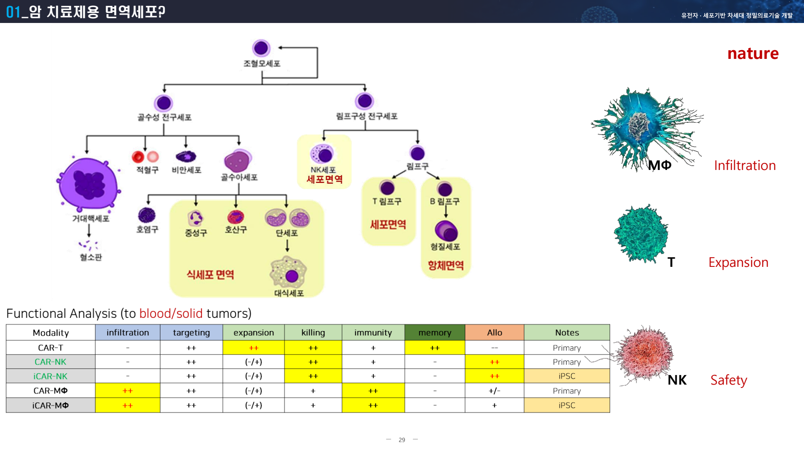

# 문제

NK cell의 missing-self 인식은 CAR-NK가 CAR-T와 다르게 작동할 수 있는 이유와 어떻게 연결되는가?

답:
NK cell은 inhibitory signal과 activating signal의 균형으로 target killing을 결정한다.
MHC가 부족한 missing-self 세포나 stress ligand를 가진 세포를 인식할 수 있다.
그래서 CAR 외에도 선천면역 수용체 기반의 살상 가능성이 있다.

[해설]
Missing-self 인식은 ==NK cell==이 정상세포의 MHC class I 신호가 부족한 세포를 비정상으로 판단할 수 있는 능력이다.
==NK cell==은 억제 신호와 활성화 신호의 균형으로 살상 여부를 결정하며, stress ==ligand==도 함께 감지할 수 있다.
==CAR-NK==는 ==CAR==가 보는 특정 ==항원==뿐 아니라 ==NK cell==의 본래 선천면역 수용체 체계도 함께 활용할 수 있다.
그래서 ==표적 항원==이 일부 사라지는 ==antigen escape== 상황에서도 ==CAR-T==와 다른 방식의 보완 가능성이 생긴다.
출처: 바이오의약품학 기말고사 수업자료.pdf p.52, p.89, p.100
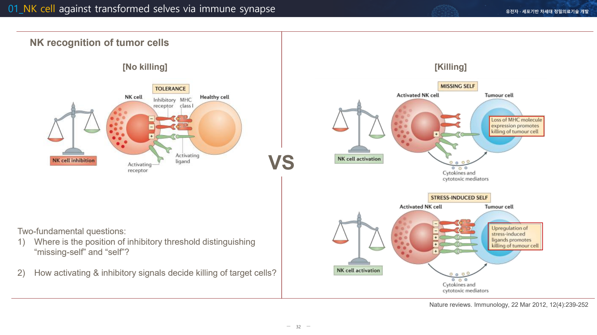
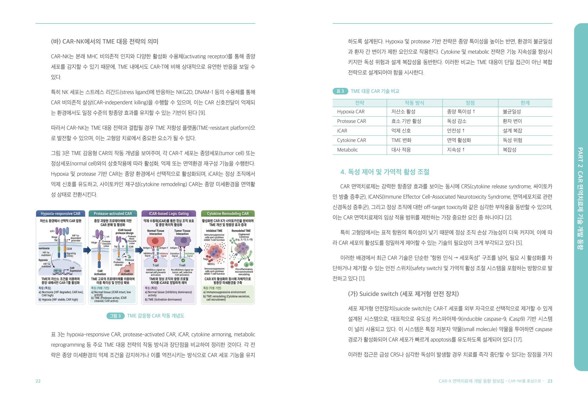

# 문제

CD5는 왜 T-cell malignancy의 표적으로 좋아 보이지만, 동시에 위험한 표적인가?

답:
CD5는 T-ALL과 lymphoma의 약 **80%**에서 나타나는 malignant T cell 표면 marker이다.
HSC와 NK cell에는 발현되지 않아 표적으로 매력적이다.
하지만 정상 T cell과 일부 mature B cell에도 발현되어 부작용 위험이 있다.

[해설]
==CD5==는 ==T cell== 표면에 있는 marker이고, ==T-ALL==과 lymphoma 같은 T-cell malignancy에서 높은 빈도로 나타난다.
자료에서는 ==T-ALL==과 lymphoma의 약 80%에서 ==CD5==가 나타나며, ==HSC==와 ==NK cell==에는 발현되지 않는다는 점이 표적 장점으로 제시된다.
하지만 ==CD5==는 정상 ==T cell==과 일부 mature B cell에도 나타나므로, ==CD5==를 무조건 강하게 공격하면 정상 면역세포도 손상될 수 있다.
따라서 ==CD5==는 좋은 표적 후보이면서 동시에 선택성과 ==안전성== 조절이 반드시 필요한 위험 표적이다.
출처: 바이오의약품학 기말고사 수업자료.pdf p.234
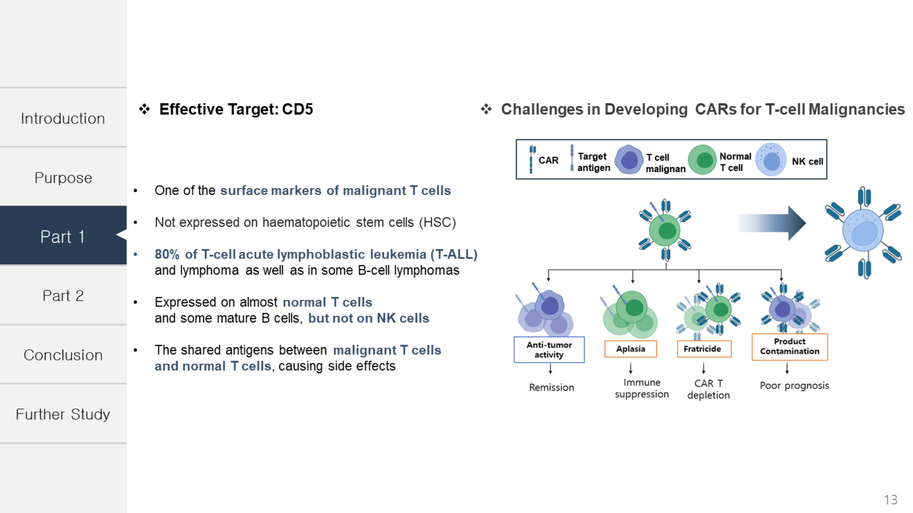

# 문제

T-cell malignancy에서 CAR를 만들 때 T cell aplasia, fratricide, product contamination 문제가 생기는 이유와 CAR-NK가 왜 대안이 되는지 설명하시오.

답:
표적 항원이 정상 T cell에도 있으면 **T cell aplasia**가 생길 수 있다.
CAR-T끼리 서로 같은 표적을 보고 공격하면 **fratricide**가 생긴다.
환자 T cell에 암세포가 섞이면 **product contamination** 위험이 있다.
CAR-NK는 non-T CAR cell 전략이라 이 세 문제를 피하는 대안으로 제시된다.

[해설]
==T cell aplasia==는 정상 ==T cell==까지 제거되어 ==T cell==이 부족해지는 부작용을 말한다.
Fratricide는 ==CAR-T== 세포끼리 같은 ==T cell== ==표적 항원==을 인식해 서로 공격하는 현상이다.
Product contamination은 환자 ==T cell==을 원료로 제품을 만들 때 암성 ==T cell==이 함께 섞일 수 있는 문제이다.
==CAR-NK==는 ==T cell==이 아닌 ==NK cell==을 치료 플랫폼으로 쓰므로, ==T cell== 표적 치료에서 생기는 이 세 문제를 피하는 대안으로 제시된다.
출처: 바이오의약품학 기말고사 수업자료.pdf p.235
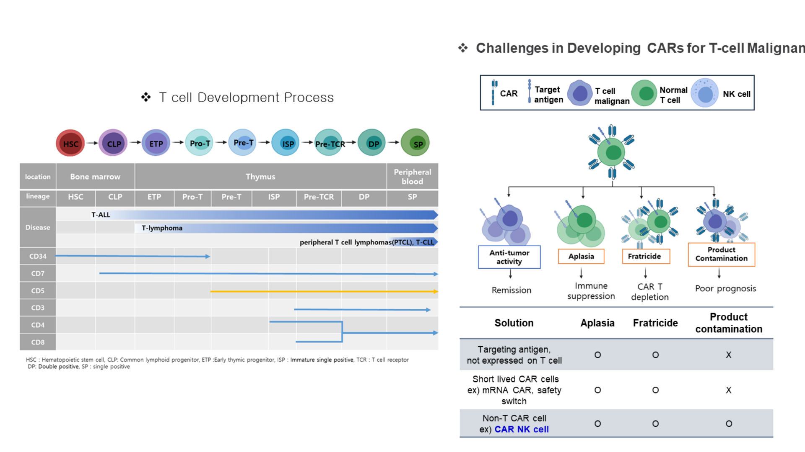

# 문제

CD5 CAR-NK에서 scFv affinity와 CAR expression level을 무조건 높이면 안 되는 이유는 무엇인가?

답:
High scFv affinity와 high CAR level은 cytotoxicity를 높인다.
하지만 너무 강하면 정상 CD5+ T cell에도 반응할 수 있다.
따라서 **fine-tuning**으로 악성 T cell은 제거하고 정상 T cell 독성은 줄여야 한다.

[해설]
==scFv affinity==는 ==scFv==가 ==표적 항원==에 얼마나 강하게 결합하는지를 뜻한다.
==CAR expression level==은 한 세포 표면에 ==CAR==가 얼마나 많이 발현되는지를 뜻한다.
둘 다 높아지면 ==CAR== 신호가 강해져 cytotoxicity가 올라갈 수 있지만, 정상 ==CD5==+ ==T cell==까지 공격할 위험도 커진다.
그래서 ==CD5== ==CAR-NK==의 핵심은 무조건 강한 신호가 아니라, 악성 ==T cell==과 정상 ==T cell==을 구분할 수 있을 정도로 신호를 fine-tuning하는 것이다.
출처: 바이오의약품학 기말고사 수업자료.pdf p.236, p.238, p.239, p.242, p.280
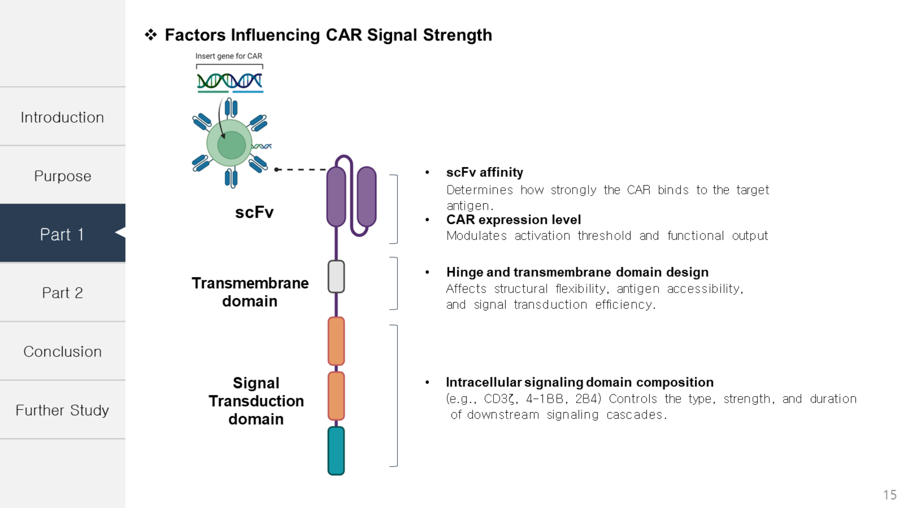
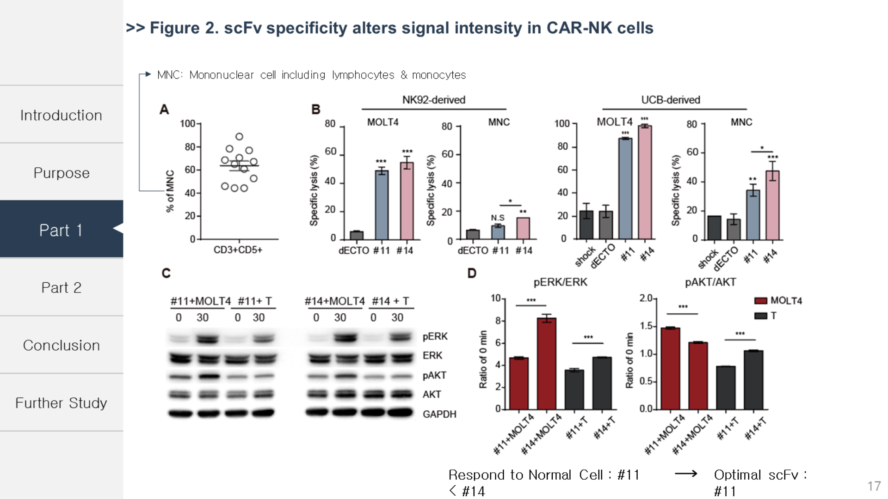
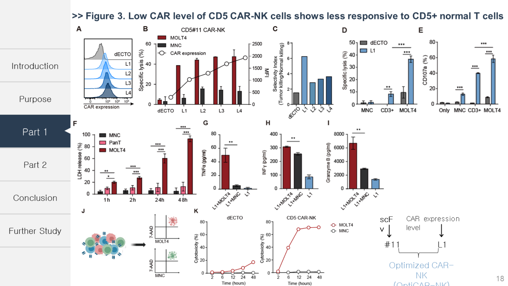

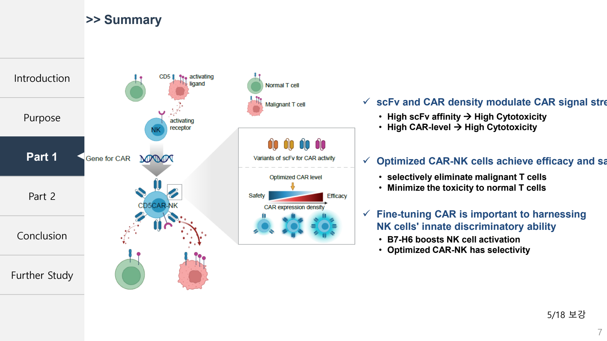

# 문제

CD5 CAR-NK 발표에서 최적화된 CAR-NK가 달성해야 하는 efficacy와 safety는 무엇인가?

답:
악성 T cell을 **선택적으로 제거**한다.
정상 T cell에 대한 독성을 **최소화**한다.
scFv와 CAR density를 조절해 CAR signal strength를 fine-tuning한다.

[해설]
Efficacy는 치료제가 암세포를 얼마나 잘 제거하는지를 뜻하고, ==safety==는 정상세포 손상과 독성을 얼마나 줄이는지를 뜻한다.
==CD5== ==CAR-NK==에서는 악성 ==T cell==을 선택적으로 죽이는 것이 ==efficacy==이다.
정상 ==T cell==에 대한 반응을 줄여 독성을 최소화하는 것이 ==safety==이다.
자료의 결론은 ==scFv==와 ==CAR== density 조절을 통해 ==CAR== signal strength를 맞추면 효능과 ==안전성==을 동시에 노릴 수 있다는 것이다.
출처: 바이오의약품학 기말고사 수업자료.pdf p.242, p.254, p.280

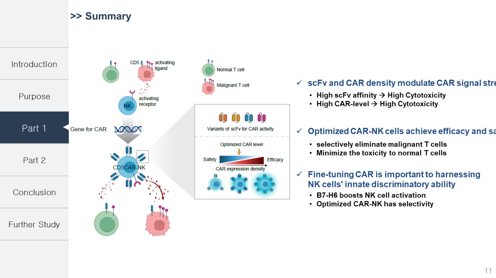

# 문제

고형암에서 antigen heterogeneity와 antigen escape가 왜 CAR 치료 실패로 이어지는가?

답:
종양 안의 모든 세포가 같은 항원을 가지고 있지 않다.
단일 항원 CAR가 한 표적만 공격하면, 그 항원이 없는 암세포가 살아남는다.
살아남은 세포가 다시 자라면 재발이 된다.

[해설]
Antigen heterogeneity는 한 종양 안의 암세포들이 모두 같은 ==항원==을 발현하지 않는 상태를 말한다.
Antigen escape는 치료가 ==표적 항원==을 가진 세포를 죽인 뒤, 그 ==항원==이 없거나 줄어든 암세포가 살아남아 재발하는 현상이다.
단일 ==항원==만 보는 ==CAR==는 그 ==항원==이 없는 암세포를 놓치기 쉽다.
그래서 ==고형암==에서는 표적을 하나만 정하는 전략보다 여러 ==항원==을 조합하거나 논리회로를 쓰는 전략이 중요해진다.
출처: 바이오의약품학 기말고사 수업자료.pdf p.86

# 문제

Dual CAR, Tandem CAR, AND/OR/NOT gate, SynNotch는 각각 antigen escape 또는 off-target toxicity를 어떻게 줄이려는 전략인가?

답:
Dual/Tandem CAR: 두 항원을 보게 해서 antigen escape를 줄임
AND gate: 두 항원이 함께 있을 때만 켜져 정상조직 공격을 줄임
OR gate: 하나의 항원만 있어도 켜져 항원 소실에 대응
NOT gate/iCAR: 정상 조직 항원을 만나면 억제
SynNotch: 첫 항원 인식 후 두 번째 CAR 발현으로 조건부 활성화

[해설]
==Dual CAR==와 ==Tandem CAR==는 한 세포가 두 표적을 보게 만들어, 한 ==항원==이 사라져도 암세포를 놓치지 않도록 하는 전략이다.
==AND gate==는 두 ==항원==이 모두 있을 때만 강하게 켜지도록 설계해 정상조직 공격을 줄이려는 전략이다.
==OR gate==는 둘 중 하나만 있어도 공격하게 만들어 ==antigen escape==를 줄이는 전략이다.
==NOT gate==와 iCAR는 정상조직 ==항원==을 만나면 억제 신호를 넣어 ==off-target toxicity==를 줄이는 전략이다.
==SynNotch==는 첫 ==항원==을 인식한 뒤 두 번째 ==CAR== 발현을 유도하는 조건부 활성화 시스템이다.
출처: 바이오의약품학 기말고사 수업자료.pdf p.86, p.87

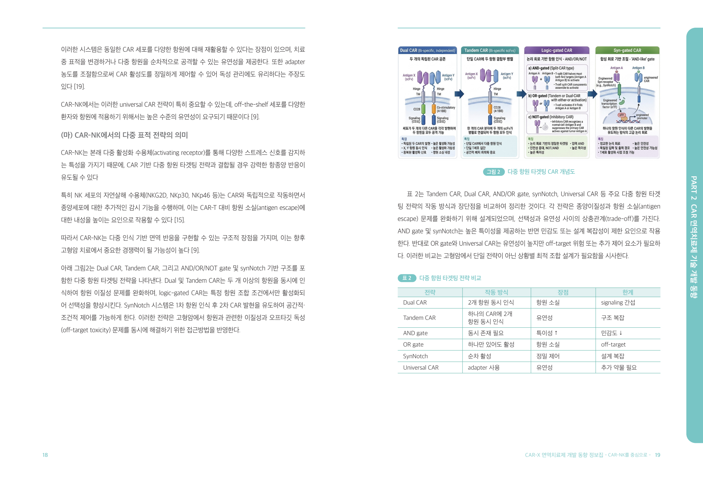

# 문제

CAR safety control에서 suicide switch, ON/OFF CAR, adapter CAR, iCAR는 안전성을 어떤 방식으로 확보하는가?

답:
Suicide switch: CAR 세포를 제거해 즉각적 안전 확보
ON/OFF CAR: 외부 약물로 CAR 활성을 켜고 끔
Adapter CAR: 항체나 adapter로 표적과 활성도를 조절
iCAR: 억제 신호로 정상 조직에서 과도한 활성을 차단

[해설]
==CAR== ==safety== control은 ==CAR== 세포가 과하게 활성화되거나 정상조직을 공격할 때 피해를 줄이기 위한 제어 장치이다.
Suicide switch는 독성이 생기면 ==CAR== 세포 자체를 제거해 빠르게 ==안전성==을 확보하는 방식이다.
==ON/OFF CAR==는 외부 약물로 ==CAR== 활성 상태를 켜거나 끄는 방식이다.
Adapter ==CAR==는 ==CAR==가 직접 암세포를 보는 것이 아니라 adapter를 통해 표적과 활성도를 조절하는 방식이다.
iCAR는 억제 신호를 이용해 정상조직에서 ==CAR== 활성을 낮추는 방식이다.
출처: 바이오의약품학 기말고사 수업자료.pdf p.90, p.91
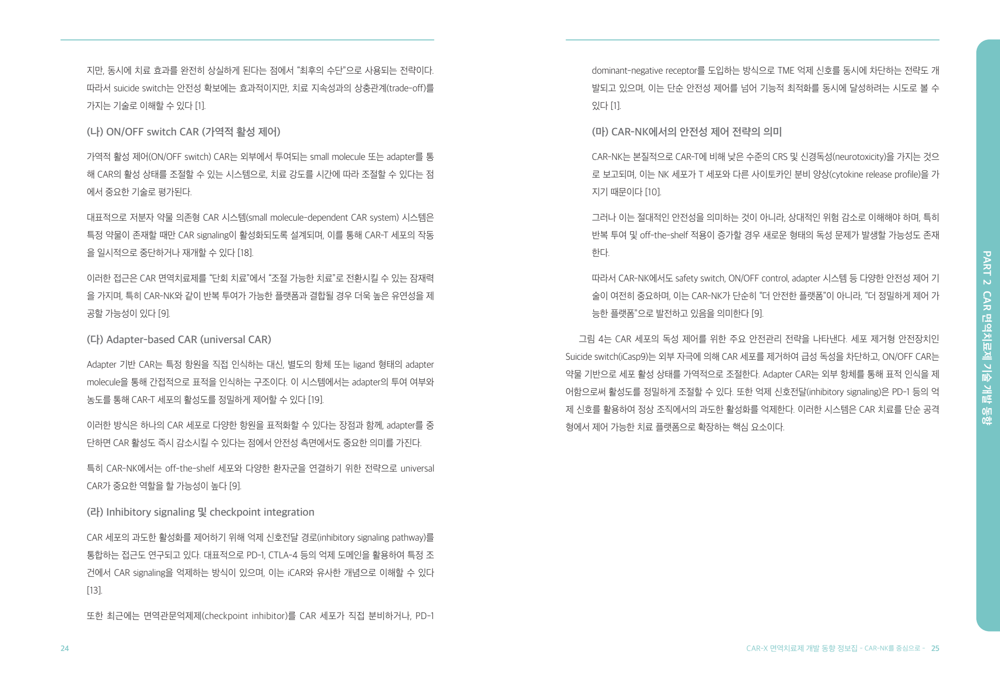
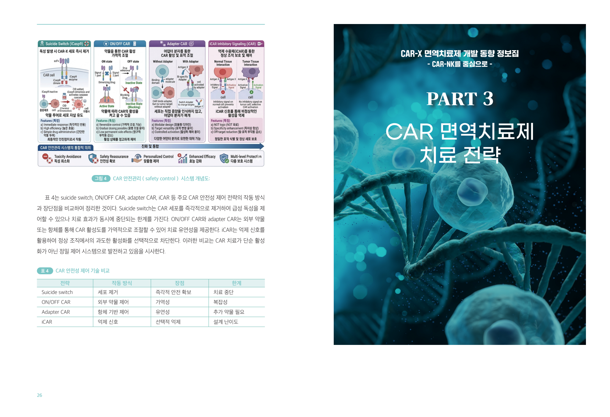

# 문제

TME는 CAR-T와 CAR-NK의 기능을 어떤 방식으로 억제하는가?

답:
TGF-beta, IL-10, PD-L1 같은 면역억제 신호를 제공한다.
저산소, 낮은 pH, 영양 결핍, lactate 같은 대사 스트레스를 만든다.
그 결과 CAR 세포의 활성화, 증식, 지속성, 세포독성 기능이 저하된다.

[해설]
==TME==는 ==tumor microenvironment==, 즉 암세포 주변의 면역세포, 기질세포, 혈관, 대사 조건, 사이토카인이 모인 환경이다.
==고형암==의 ==TME==는 ==TGF-beta==, ==IL-10==, ==PD-L1== 같은 ==면역억제 신호==를 통해 ==CAR-T==와 ==CAR-NK==의 활성화를 낮춘다.
또한 저산소, 낮은 pH, 영양 결핍, lactate 축적 같은 대사 스트레스가 면역세포 기능을 떨어뜨린다.
따라서 ==TME==는 단순한 배경이 아니라 ==CAR== 세포의 침투, 증식, ==지속성==, 세포독성을 동시에 억제하는 핵심 장애물이다.
출처: 바이오의약품학 기말고사 수업자료.pdf p.88, p.97
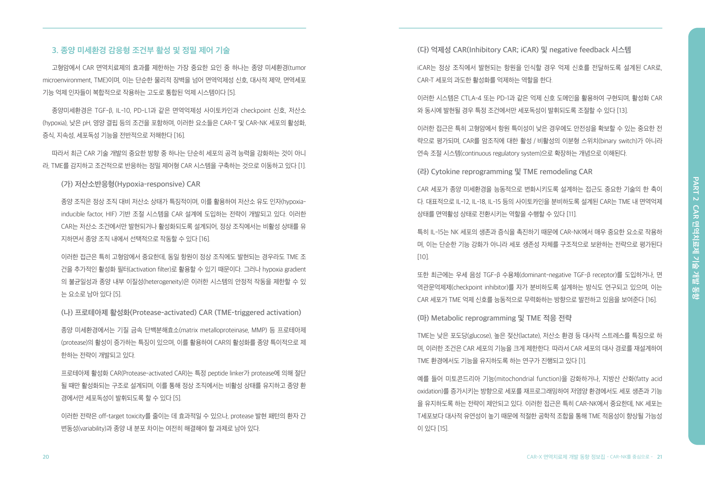
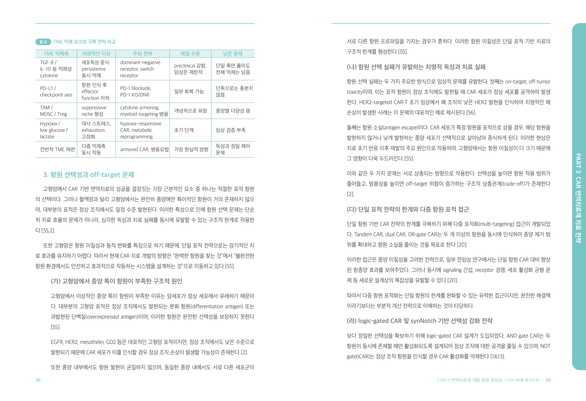

# 문제

TGF-beta 하나만 막으면 TME 문제가 해결되지 않는 이유는 무엇인가?

답:
고형암에서는 TGF-beta뿐 아니라 IL-10, PD-L1, 대사 스트레스, 억제성 골수계 세포가 동시에 작동한다.
단일 축만 차단해도 전체 억제 환경은 남는다.
억제를 강하게 풀수록 cytokine release나 off-target toxicity 위험이 커질 수 있다.

[해설]
==TGF-beta==는 ==TME==에서 면역세포 기능을 억제하는 대표적인 ==cytokine== 중 하나이다.
하지만 ==고형암== ==TME==는 ==TGF-beta== 하나로만 작동하지 않고, ==IL-10==, ==PD-L1==, 대사 스트레스, 억제성 골수계 세포 같은 여러 억제 축이 동시에 작동한다.
그래서 ==TGF-beta==만 막아도 다른 억제 신호가 남아 ==CAR== 세포 기능을 계속 낮출 수 있다.
반대로 억제를 너무 강하게 풀면 ==cytokine== release나 ==off-target toxicity==가 커질 수 있으므로, 단일 차단보다 균형 잡힌 설계가 필요하다.
출처: 바이오의약품학 기말고사 수업자료.pdf p.95, p.97
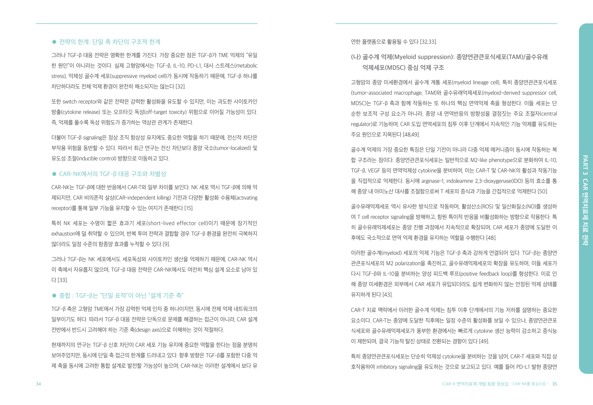

# 문제

CAR 세포의 persistence를 무조건 길게 만드는 것이 답이 아닌 이유를 설명하시오.

답:
지속성이 부족하면 장기 효과가 약해지고 재발 위험이 커진다.
하지만 지속성이 너무 강하면 만성 독성이나 정상 조직 공격 위험이 커진다.
따라서 필요한 기간 동안 적절하게 유지되는 **정밀한 지속성 설계**가 중요하다.

[해설]
Persistence는 투여된 ==CAR== 세포가 체내에서 얼마나 오래 살아남아 기능을 유지하는지를 뜻한다.
==지속성==이 너무 짧으면 암세포를 충분히 제거하기 전에 ==CAR== 세포가 사라져 재발 위험이 커진다.
하지만 ==지속성==이 너무 길고 강하면 정상조직 공격, 만성 독성, 과도한 ==면역반응== 위험이 커질 수 있다.
따라서 목표는 무조건 오래 남기는 것이 아니라, 필요한 기간 동안 효과를 내고 조절 가능한 ==지속성==을 설계하는 것이다.
출처: 바이오의약품학 기말고사 수업자료.pdf p.99, p.100
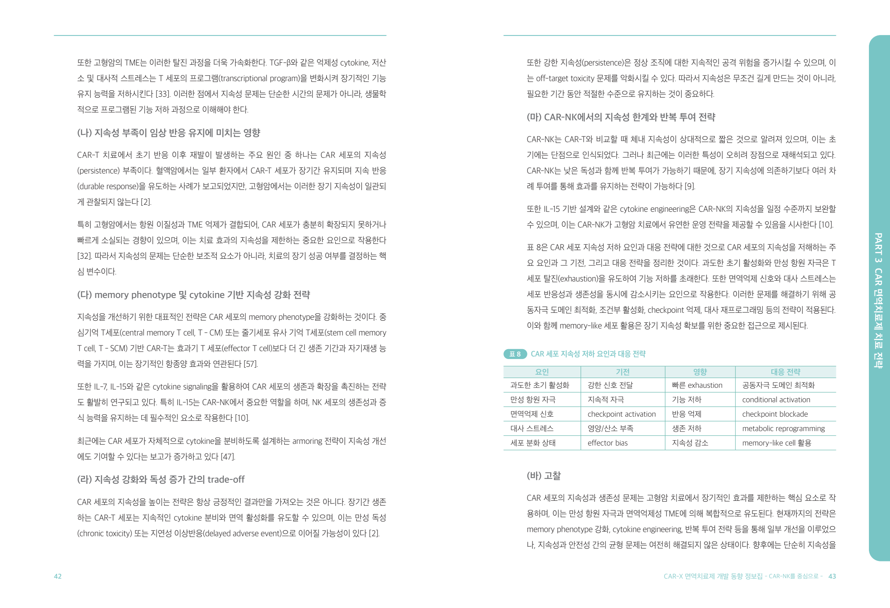

# 문제

CAR-NK의 짧은 persistence는 왜 단점이면서도 반복 투여 전략의 근거가 될 수 있는가?

답:
짧은 persistence는 한 번 투여로 오래 유지되기 어렵다는 단점이다.
하지만 낮은 독성을 바탕으로 **반복 투여**가 가능하다는 장점으로 재해석될 수 있다.
장기 생존에만 의존하지 않고 여러 번 접근해 효과를 유지할 수 있다.

[해설]
==CAR-NK==는 ==CAR-T==에 비해 체내 ==지속성==이 짧은 경우가 많아, 한 번 투여로 장기간 효과를 유지하기 어렵다는 단점이 있다.
그러나 ==CAR-NK==는 상대적으로 독성이 낮고 ==off-the-shelf==로 준비할 가능성이 있어 ==반복 투여== 전략과 연결된다.
==반복 투여==는 짧은 ==지속성==을 여러 번의 투여로 보완해 치료 압력을 유지하려는 접근이다.
따라서 ==CAR-NK==의 짧은 ==persistence==는 단점이지만, 제품 설계에 따라 ==반복 투여== 가능한 장점으로도 해석될 수 있다.
출처: 바이오의약품학 기말고사 수업자료.pdf p.99, p.100

# 문제

CXCR6를 CAR-NK에 붙이는 전략은 lung tumor에서 어떤 문제를 해결하려는 것인가?

답:
CXCL16은 lung에서 높게 발현된다.
CXCR6+ NK cell은 lung에 풍부하다.
따라서 CXCR6는 CAR-NK가 lung tumor tissue로 더 잘 이동하도록 돕는 targeting 전략이다.

[해설]
==CXCR6==는 ==chemokine receptor==이고, ==CXCL16==은 그 receptor가 인식하는 ==ligand==이다.
자료에서는 ==CXCL16==이 lung에서 높게 발현되고, ==CXCR6==+ ==NK cell==이 lung에 풍부하다는 점이 제시된다.
따라서 ==CAR-NK==에 ==CXCR6==를 붙이면 ==CAR-NK==가 lung tumor tissue 쪽으로 더 잘 이동하도록 유도할 수 있다.
이 전략의 핵심은 암세포를 더 세게 죽이는 것만이 아니라, ==CAR-NK==가 필요한 조직에 도달하게 만드는 ==targeting==이다.
출처: 바이오의약품학 기말고사 수업자료.pdf p.257
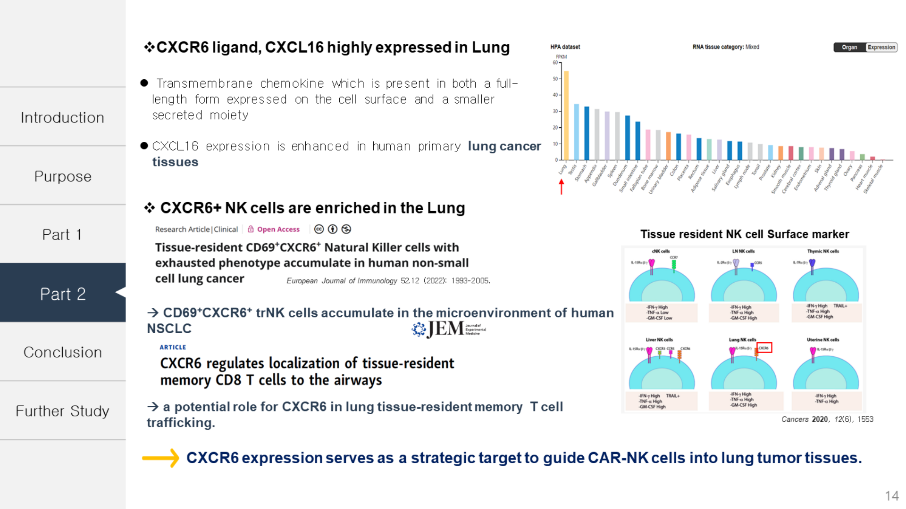

# 문제

3D bioprinting TME model을 쓰는 이유는 무엇이며, model complexity가 증가하면 무엇을 더 잘 모사하는가?

답:
2D 또는 단순 모델은 human biology와 TME를 충분히 대표하지 못한다.
3D model은 spatial structure와 immune-tumor interaction을 더 잘 반영한다.
Model complexity가 증가하면 aggressive TME의 functional mimicry가 증가한다.

[해설]
2D 세포배양은 평평한 접시에서 세포를 키우는 방식이라 실제 종양 조직의 공간 구조와 ==TME==를 충분히 반영하지 못한다.
==3D bioprinting TME model==은 세포와 구조를 입체적으로 구성해 실제 ==고형암== 환경에 더 가깝게 만드는 실험 모델이다.
Model complexity가 높아질수록 암의 침습성, 면역회피, immune-tumor interaction을 더 잘 모사한다.
따라서 이 모델은 ==CAR-NK==가 단순 배양 조건이 아니라 실제와 비슷한 ==TME== 압력에서도 작동하는지 확인하기 위해 필요하다.
출처: 바이오의약품학 기말고사 수업자료.pdf p.258, p.260, p.265
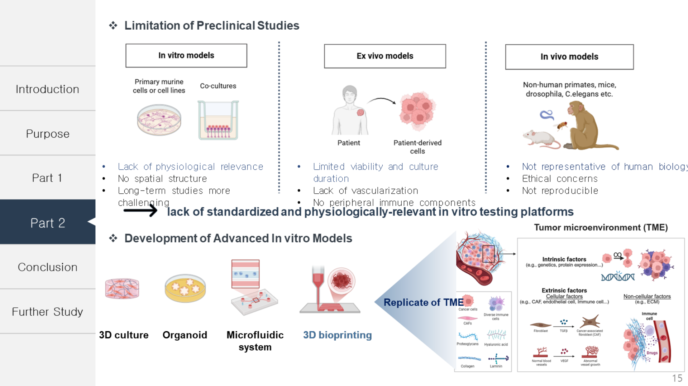
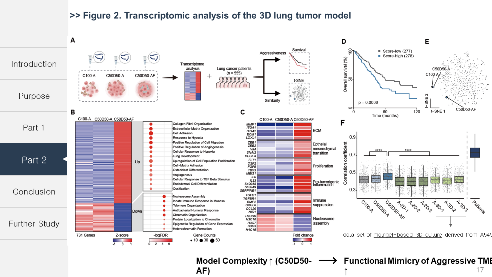
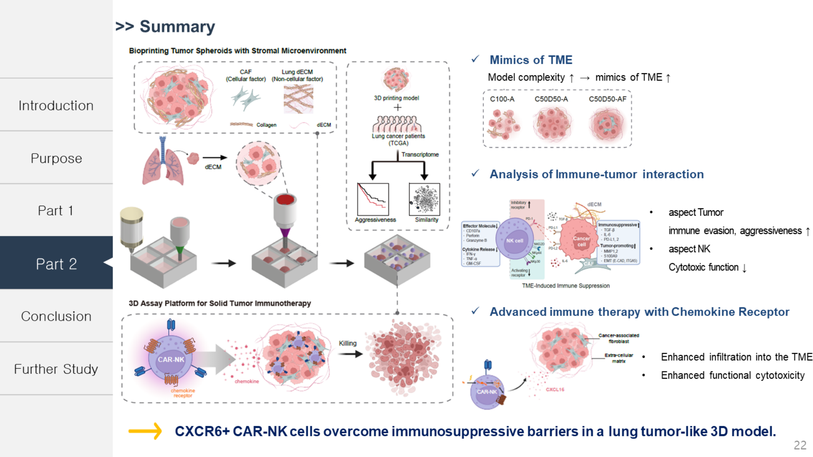

# 문제

CXCR6+ CAR-NK cells가 3D lung tumor-like model에서 보여준 핵심 효과는 무엇인가?

답:
Immunosuppressive barrier를 극복하는 것으로 제시된다.
TME로의 infiltration이 증가한다.
Functional cytotoxicity가 증가한다.

[해설]
==CXCR6==+ ==CAR-NK==는 ==CAR-NK==에 ==CXCR6== ==chemokine receptor==를 추가한 세포이다.
==Lung tumor-like 3D model==에서는 ==CXCL16== 신호가 있는 환경을 이용해 ==CXCR6==+ ==CAR-NK==의 이동성과 기능을 평가한다.
자료의 핵심 결과는 ==CXCR6==+ ==CAR-NK==가 immunosuppressive barrier를 더 잘 넘고, ==TME== 안으로 infiltration이 증가했다는 점이다.
또한 functional cytotoxicity가 증가했다는 것은 단순히 많이 들어간 것뿐 아니라 실제 암세포 살상 기능도 좋아졌다는 뜻이다.
출처: 바이오의약품학 기말고사 수업자료.pdf p.263, p.264, p.265, p.281
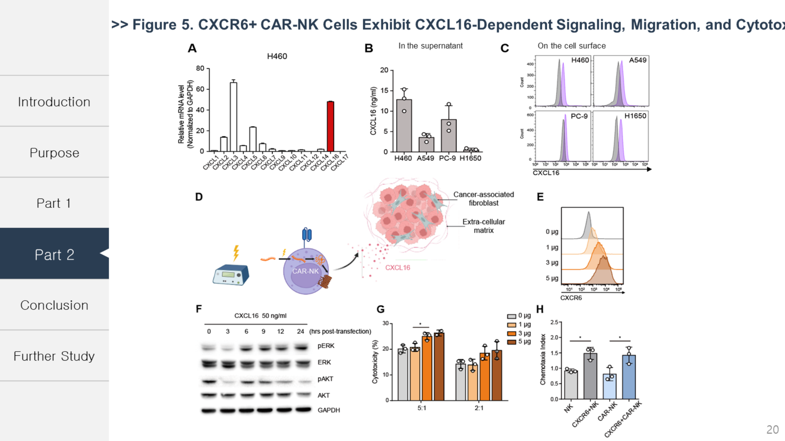
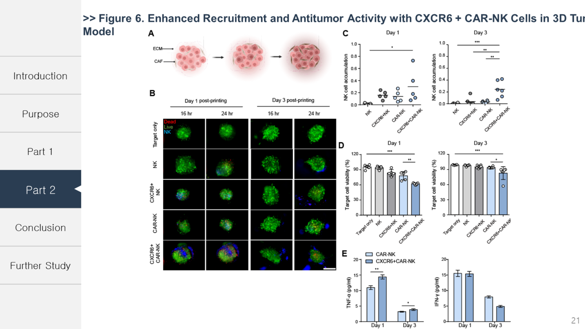

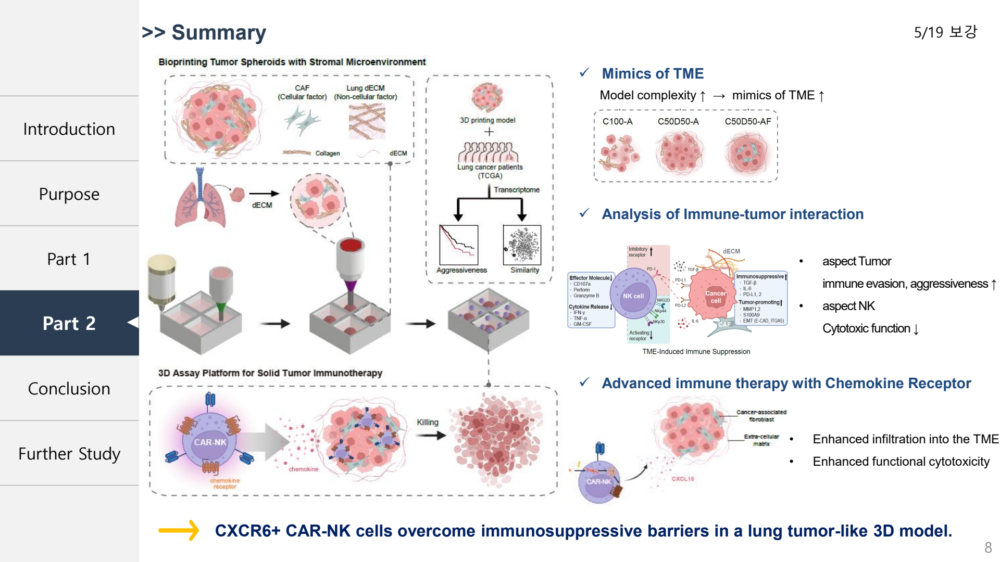

# 문제

Dual-CAR NK에서 EGFR과 PD-L1을 같이 보는 설계는 어떤 생각에서 나온 것인가?

답:
EGFR과 PD-L1 두 표적을 함께 활용해 tumor targeting을 강화한다.
Dual-CAR NK는 in vitro와 in vivo에서 enhanced anti-cancer activity를 보였다.
Synergistic signaling은 pAKT/AKT, pERK/ERK, pNF-kB/NF-kB 축으로 확인된다.

[해설]
==Dual-CAR NK==는 한 ==NK cell==에 두 표적을 인식하는 ==CAR== 설계를 적용해 tumor ==targeting==을 강화하려는 전략이다.
==EGFR==과 ==PD-L1==은 lung cancer 맥락에서 표적 또는 ==TME== 관련 신호로 활용될 수 있어, 두 신호를 함께 보면 더 강한 항암 반응을 기대할 수 있다.
자료에서는 ==Dual-CAR NK==가 in vitro와 ==in vivo==에서 enhanced anti-cancer activity를 보였다고 제시된다.
pAKT, pERK, pNF-kB는 세포 활성화와 생존, 기능 변화에 연결되는 신호축이므로, 이들이 증가하면 dual ==targeting==이 실제 intracellular signaling을 강화했다는 근거가 된다.
출처: 바이오의약품학 기말고사 수업자료.pdf p.268, p.269, p.270, p.271
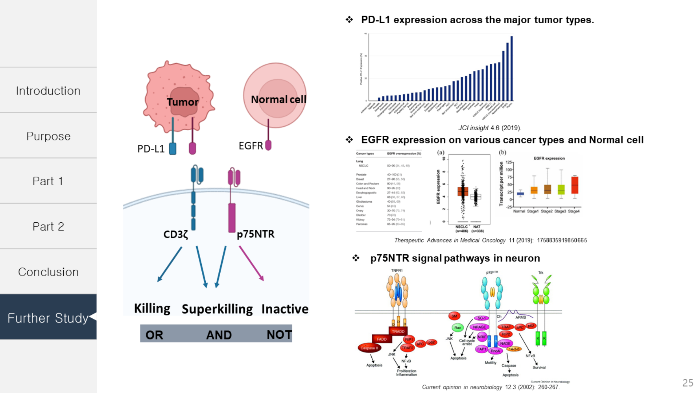
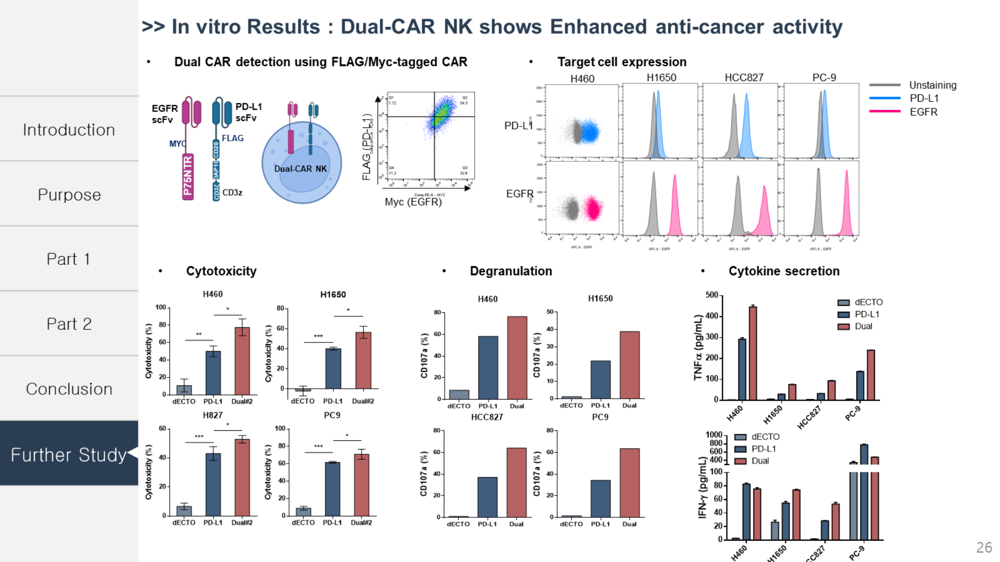
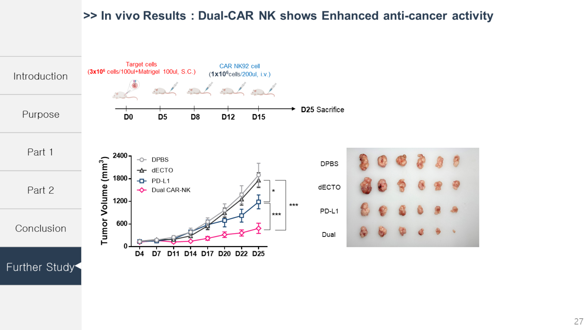
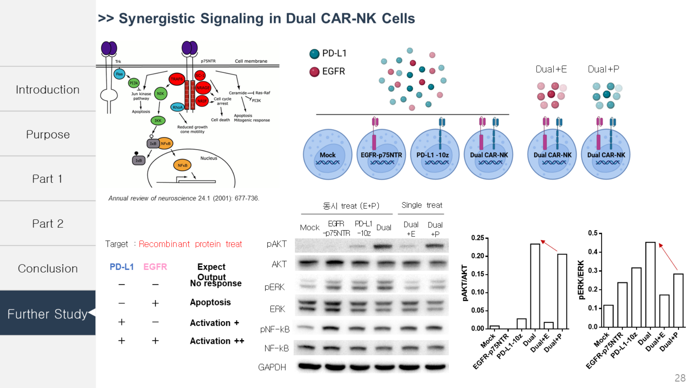

# 문제

Dual CAR-NK의 작동 원리를 더 확인하기 위해 Phospho-antibody array, ATAC-seq, RNA-seq를 쓰는 이유를 설명하시오.

답:
Phospho-antibody array: 인산화 신호 네트워크 확인
ATAC-seq: transcription factor 접근성 변화 확인
RNA-seq: 초기 유전자 프로그램과 effector 변화 확인

[해설]
==Phospho-antibody array==는 세포 안 단백질들이 인산화되어 신호전달이 켜졌는지 넓게 확인하는 분석이다.
==ATAC-seq==는 염색질이 얼마나 열려 있는지 보아 ==transcription factor==가 DNA에 접근할 수 있는 상태를 확인하는 분석이다.
==RNA-seq==는 어떤 유전자들이 실제로 발현되는지 측정해 세포의 기능 프로그램 변화를 확인하는 분석이다.
세 분석을 함께 쓰면 ==Dual CAR-NK==가 단순히 암을 더 잘 죽였다는 결과뿐 아니라, 신호전달, 전사조절, 유전자 발현이 어떻게 바뀌었는지 원리까지 설명할 수 있다.
출처: 바이오의약품학 기말고사 수업자료.pdf p.272
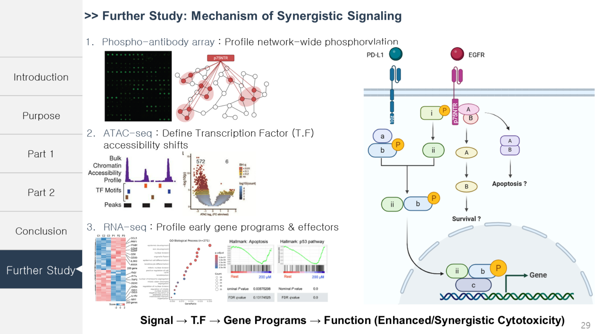

# 문제

기존 CAR-T의 생산기간·고비용 문제 때문에 in vivo CAR-T가 game changer로 제시되는 이유는 무엇인가?

답:
기존 CAR-T는 맞춤형 제조라 생산 기간이 길고 비용이 높다.
in vivo CAR-T는 체내에서 바로 CAR-T를 만들게 하여 즉각 투여와 치료비 부담 감소를 목표로 한다.
궁극적으로 off-the-shelf 차세대 drug modality로 제시된다.

[해설]
기존 ==CAR-T==는 환자 ==T cell==을 채취해 밖에서 ==CAR==를 넣고 증폭한 뒤 다시 투여하는 맞춤형 제조 방식이 중심이다.
이 방식은 환자별 생산이 필요해 시간이 오래 걸리고 비용이 높아, 환자 접근성이 낮아지는 문제가 있다.
==In vivo== ==CAR-T==는 몸 밖에서 ==CAR-T==를 완제품으로 만드는 대신, 체내에서 직접 ==CAR-T==가 만들어지도록 하는 전략이다.
그래서 즉각 투여, 치료비 부담 감소, 여러 암종에 적용 가능한 ==off-the-shelf== drug modality 가능성 때문에 game changer로 제시된다.
출처: 바이오의약품학 기말고사 수업자료.pdf p.283, p.295
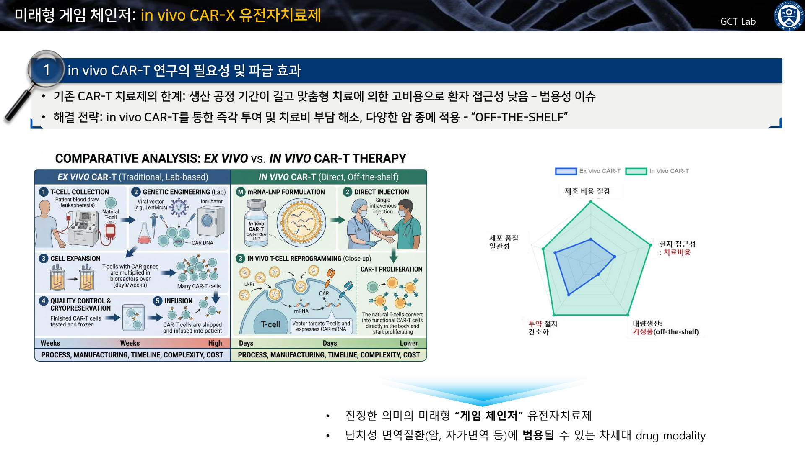

# 문제

In vivo treatment of biopharmaceuticals에서 단백질, 유전자, 세포 치료제가 공통으로 부딪히는 문제는 무엇인가?

답:
생체 내에서 특정 조직이나 기관으로 정확히 **targeting**하는 문제
이 문제는 안전성 이슈와 연결된다.
해결 방향은 **전달체**와 **targeting 기술**의 고도화이다.

[해설]
==In vivo== treatment는 치료제가 몸 안에 들어간 뒤 원하는 조직이나 기관에서 작동해야 하는 치료 방식이다.
단백질, 유전자, 세포 치료제 모두 몸 안에서 표적 부위에 정확히 도달하지 못하면 효과가 줄고 부작용이 커진다.
Targeting은 치료제가 원하는 조직, 세포, 질병 부위로 가도록 하는 기술적 문제이다.
따라서 ==in vivo== 바이오의약품의 공통 과제는 약물 자체의 효능뿐 아니라, ==전달체==와 ==targeting== 기술을 통해 원하는 장소에 정확히 보내는 것이다.
출처: 바이오의약품학 기말고사 수업자료.pdf p.285, p.297

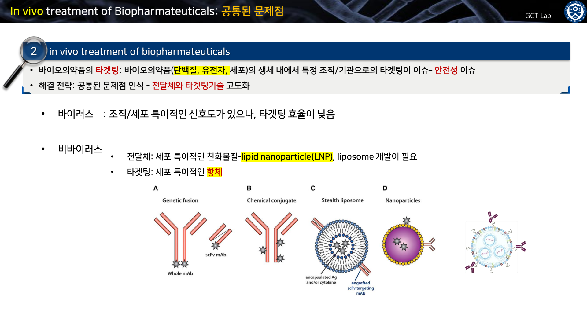

# 문제

백신을 항원+면역반응+기억+예방으로 설명할 때, mRNA vaccine은 이 흐름을 어떻게 구현하는가?

답:
mRNA를 근육주사로 전달한다.
세포 안에서 mRNA가 항원 단백질 발현을 유도한다.
그 항원 단백질이 면역반응과 기억을 유도한다.

[해설]
백신은 ==항원==을 면역계에 보여주어 ==면역반응==을 만들고, 그 반응이 기억으로 남아 이후 노출에 대비하게 하는 의약품이다.
==mRNA vaccine==은 ==항원== 단백질을 직접 넣는 방식이 아니라, ==항원== 단백질을 만들 수 있는 mRNA를 세포 안으로 전달한다.
세포가 mRNA를 번역해 ==항원== 단백질을 만들면, 면역계가 그 ==항원==을 인식해 ==면역반응==과 기억을 형성한다.
따라서 ==mRNA vaccine==의 흐름은 **mRNA 전달**, **항원 단백질 발현**, **면역반응 유도**, **기억 형성**으로 정리된다.
출처: 바이오의약품학 기말고사 수업자료.pdf p.298, p.308, p.309
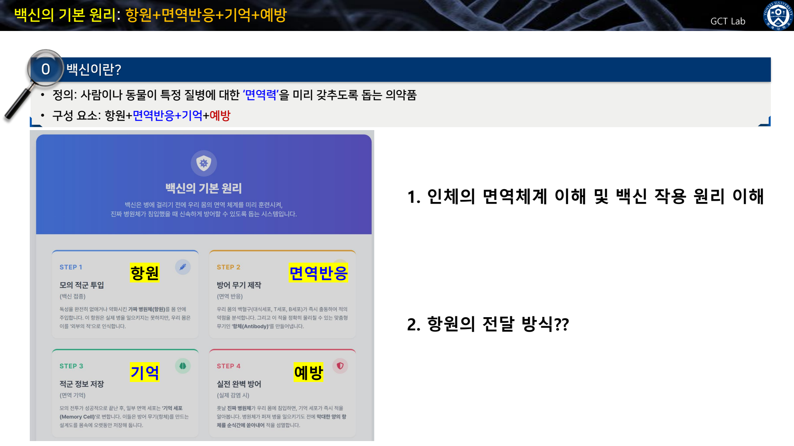
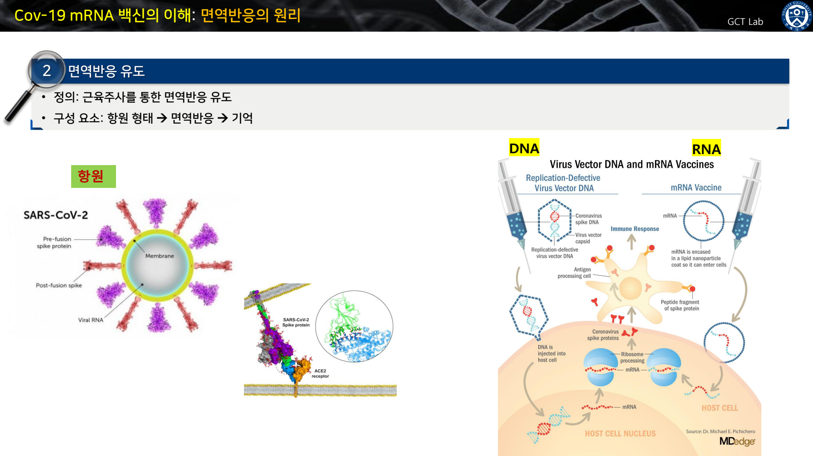
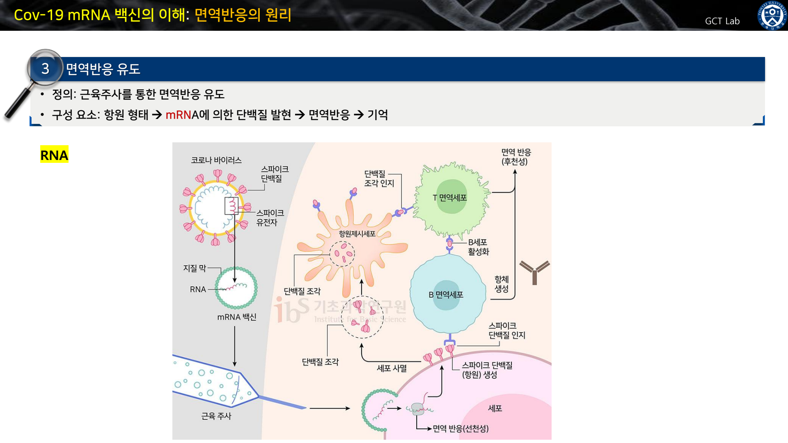

# 문제

감염 백신과 암 백신은 둘 다 항원과 면역반응을 이용하지만 목적이 다르다. 어떻게 비교해야 하는가?

답:
감염 백신: 항원, 면역반응, 기억, **예방**
암 백신: 암 특이적 항원, 면역반응, 기억, **치료**

[해설]
감염 백신은 병원체에 감염되기 전에 ==면역기억==을 만들어 질병을 ==예방==하는 것이 목적이다.
이때 ==항원==은 바이러스나 세균 같은 감염원에서 유래한 성분이고, ==면역반응==은 나중에 실제 감염이 왔을 때 빠르게 대응하기 위한 준비이다.
암 백신은 이미 생긴 암에 대해 암 특이적 ==항원==을 면역계에 인식시켜 치료 반응을 높이는 것이 목적이다.
둘 다 ==항원==, ==면역반응==, 기억을 이용하지만, 감염 백신은 **예방**, 암 백신은 **치료**가 중심이라는 차이를 써야 한다.
출처: 바이오의약품학 기말고사 수업자료.pdf p.313
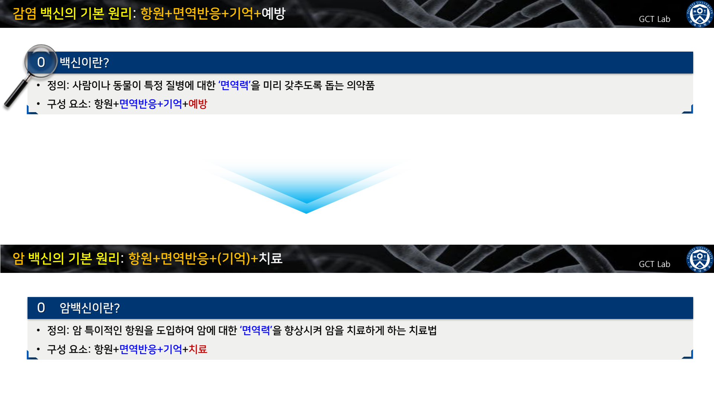

# 문제

백신에서 항원 형태와 전달 방식이 왜 함께 중요하며, 생백신·사백신·아단위 백신·DNA/RNA 백신은 어떻게 구분되는가?

답:
항원 형태와 전달체 형태가 면역체계를 활성화시키는 방식을 결정한다.
생백신: 살아있는 바이러스 껍질 사용
사백신: 열이나 화학물질로 사멸하여 사용
아단위 백신: 특정 항원 단백질 정제
DNA/RNA 백신: 항원 유전자를 전달

[해설]
==항원 형태==는 면역계에 무엇을 보여줄 것인지를 뜻하고, ==전달 방식==은 그 ==항원==을 어떤 형태로 몸 안에 넣을 것인지를 뜻한다.
==생백신==은 살아있는 약독화 병원체를 이용해 강한 ==면역반응==을 유도하는 방식이다.
==사백신==은 병원체를 죽인 뒤 사용하므로 증식 위험은 낮지만 ==면역반응==은 상대적으로 약할 수 있다.
==아단위 백신==은 병원체 전체가 아니라 특정 ==항원== 단백질만 정제해 보여주는 방식이다.
DNA/RNA 백신은 ==항원== 단백질 자체가 아니라 ==항원==을 만들 유전정보를 전달해 세포가 ==항원==을 만들게 하는 방식이다.
출처: 바이오의약품학 기말고사 수업자료.pdf p.303, p.304, p.305, p.307
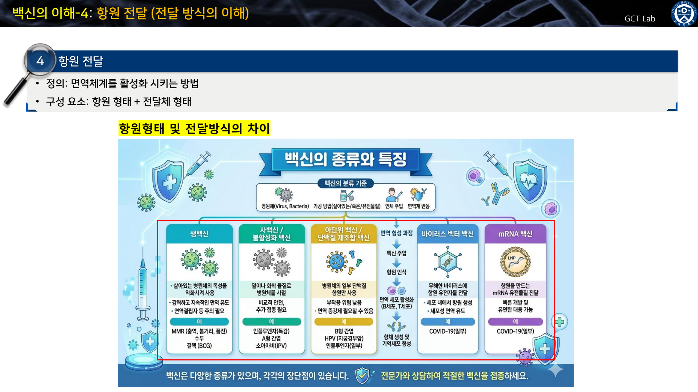
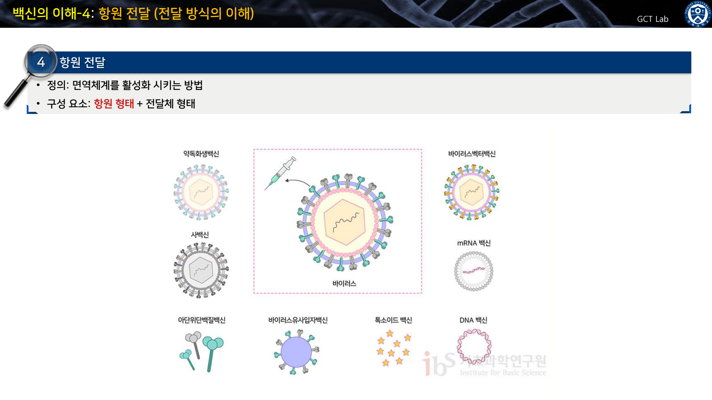
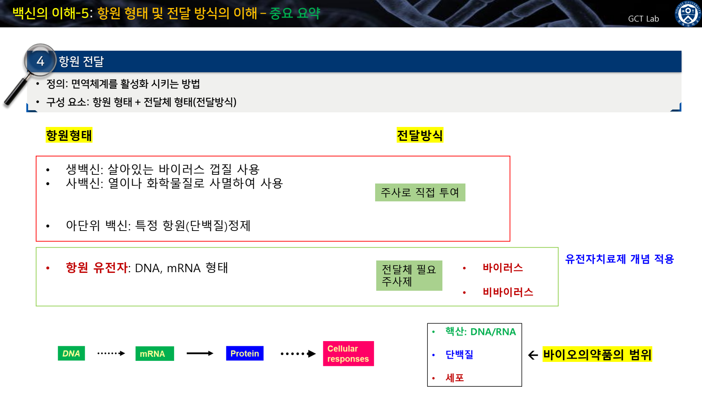
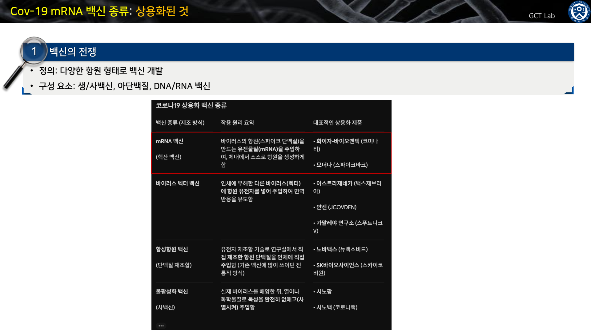

# 문제

COVID-19 mRNA vaccine이 감염백신의 새로운 기준으로 제시되는 이유는 무엇인가?

답:
mRNA vaccine은 공정과 효능에서 탁월함을 보였다.
**100/200일 project**로 next pandemic 대비 가능성을 제시했다.
대표 상용화 사례로 **Moderna**, **Pfizer**가 제시된다.

[해설]
COVID-19 ==mRNA vaccine==은 감염병 상황에서 mRNA 플랫폼이 실제 상용 백신으로 빠르게 작동할 수 있음을 보여준 사례이다.
mRNA 플랫폼은 ==항원== 설계 정보를 바꾸면 새로운 병원체에 맞춘 백신 후보를 비교적 빠르게 만들 수 있다.
자료에서 말하는 100/200일 project는 다음 팬데믹에서 백신 개발과 대응 시간을 크게 줄이려는 목표와 연결된다.
따라서 Moderna와 Pfizer 사례는 단순한 제품명 암기가 아니라, ==mRNA vaccine==이 공정과 효능 면에서 감염백신의 새로운 기준으로 제시된 근거이다.
출처: 바이오의약품학 기말고사 수업자료.pdf p.306, p.311, p.312
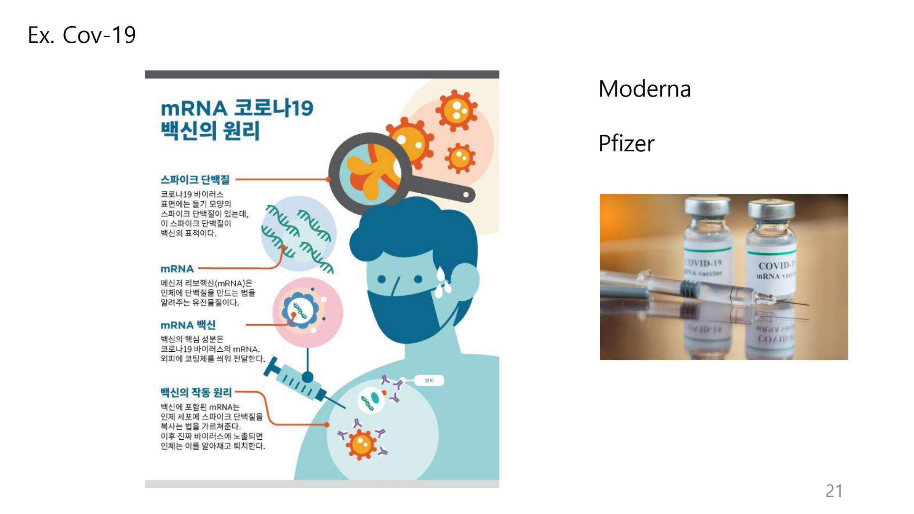
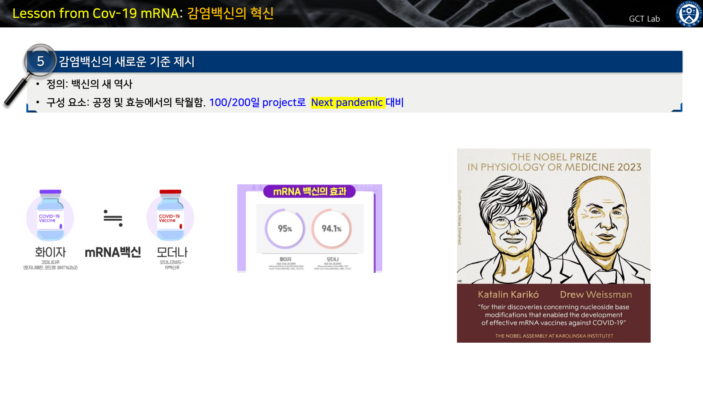
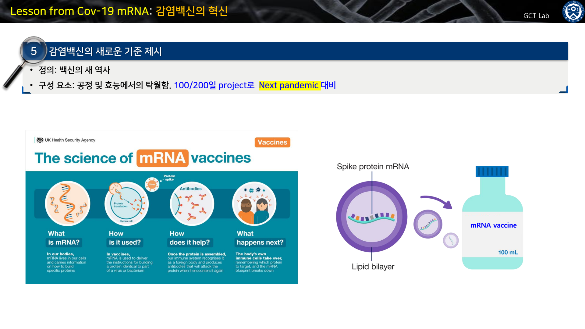
