# 문제
mRNA 분자의 5가지 구조 요소와 각각의 역할을 설명하시오 (출제 예고)

답:
· **5' cap**: **mRNA** 5' 말단 보호, 번역 시작 도움
· **3' poly(A) tail**: **mRNA** 분해 감소, 안정성 증가, 번역 효율 증가
· **protein-coding sequence**: 항원 **단백질**을 만드는 ORF
· **5' UTR**: **ribosome** 결합과 번역 효율 조절
· **3' UTR**: **mRNA** 수명, 분해 속도, 안정성 조절

[배경설명]
**mRNA** 백신은 세포가 항원 **단백질**을 만들도록 지시하는 **RNA 설계도**이다
이 설계도에서 **protein-coding sequence**는 실제 항원 정보를 담는 부분이고,
나머지 구조는 그 정보가 세포 안에서 제대로 읽히도록 돕는다
**5' cap**은 **mRNA** 앞쪽을 보호하면서 **ribosome**이 번역을 시작하기 쉽게 만든다
**poly(A) tail**은 **mRNA** 뒤쪽을 보호해 분해를 줄이고 번역 효율을 높인다
**UTR**은 **단백질**로 번역되지는 않지만
**mRNA**가 얼마나 안정하게 유지되고 얼마나 잘 번역되는지 조절한다
따라서 5가지 요소는 ==항원 정보 자체==와
==그 정보가 오래 버티고 잘 읽히게 하는 조절 장치==로 나누어 이해해야 한다

출처: G:\내 드라이브\여형준님\21 6-1\백신공정이론\기말고사 정리자료\백신공정이론 기말고사 범위 수업자료.pdf p.092, p.356
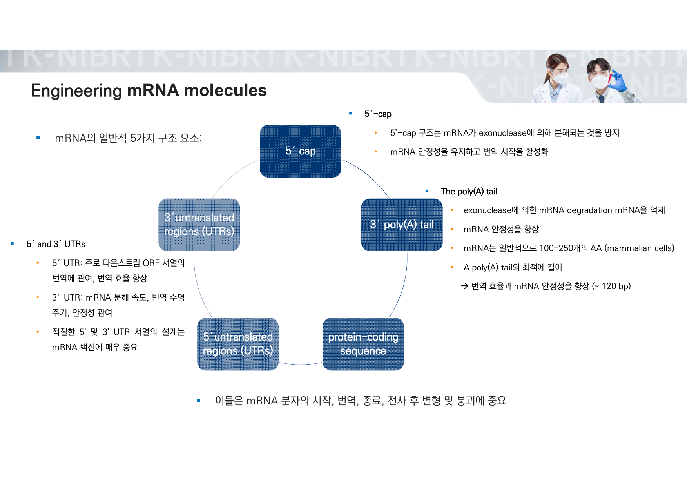
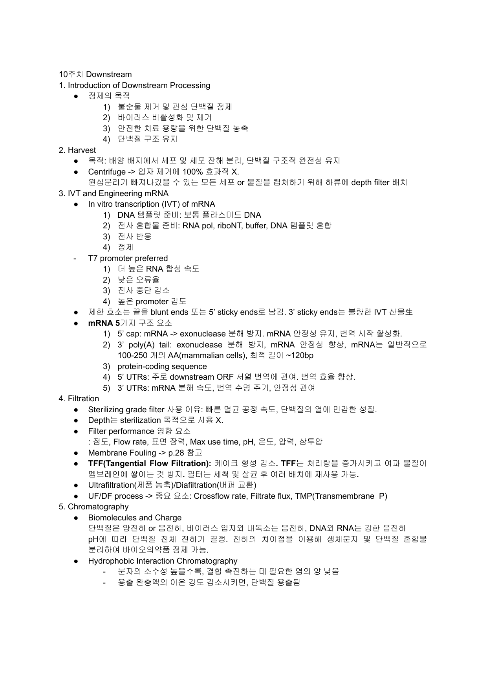
# 문제
mRNA 백신에서 poly(A) tail과 UTR을 최적화해야 하는 이유를 설명하시오 (출제 예고)

답:
· 최적화해야 하는 이유: ==mRNA 안정성과 번역 효율을 높여 항원 단백질 생산량을 충분히 확보하기 위해==
· **poly(A) tail**: **mRNA** 분해를 줄이고 안정성을 높임 (최적 길이 약 120 bp)
· **5' UTR**: 번역 시작과 번역 효율에 영향
· **3' UTR**: **mRNA** 수명, 분해 속도, 안정성에 영향

[배경설명]
이 문제의 핵심은 **poly(A) tail**과 **UTR**이 무엇인지보다 ==왜 최적화가 필요한지==이다
**mRNA**는 세포 안에서 쉽게 분해될 수 있고, 구조가 적절하지 않으면 **ribosome**이 잘 읽지 못한다
**poly(A) tail**은 **mRNA** 끝에 붙는 A 반복 서열로,
길이가 적절해야 **mRNA**가 오래 유지되고 **단백질**도 잘 만들어진다
**UTR**은 항원 **단백질**로 번역되지 않는 구간이지만 번역 시작, 번역 효율, **mRNA** 수명에 직접 영향을 준다
따라서 항원 서열이 같아도 **poly(A) tail**과 **UTR** 설계가 나쁘면 항원 **단백질** 생산량이 부족해질 수 있다
결론적으로 **poly(A) tail**과 **UTR** 최적화는 ==mRNA를 오래 유지하고 많이 번역되게 하기 위한 설계==이다

출처: G:\내 드라이브\여형준님\21 6-1\백신공정이론\기말고사 정리자료\백신공정이론 기말고사 범위 수업자료.pdf p.092, p.342

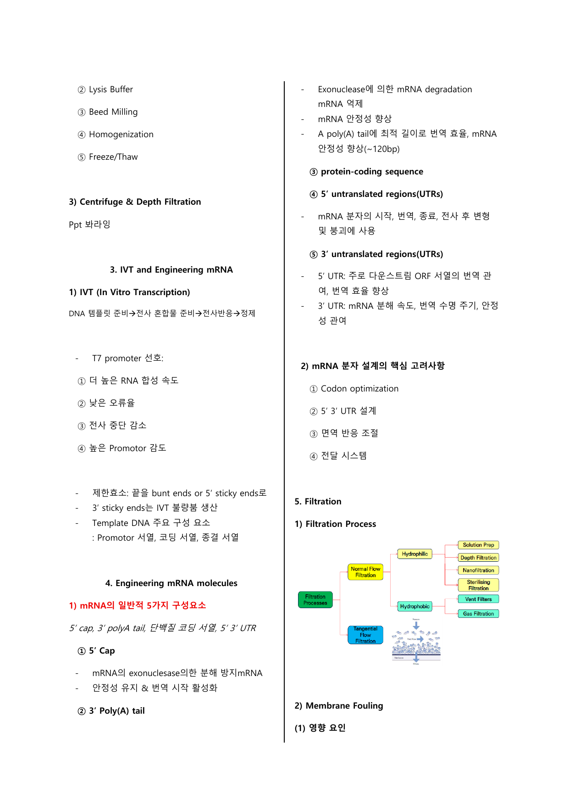
# 문제
Tangential Flow Filtration(TFF)의 원리와 장점을 설명하시오 (출제 예고)

답:
· 원리: feed가 막 표면을 **접선 방향**으로 흐르고, 작은 성분만 막을 통과함
큰 성분은 retentate로 남아 농축됨
· 장점: **cake layer**와 **fouling** 감소
**농축과 buffer exchange**를 반복하기 좋음
cartridge와 membrane 재사용 가능

[배경설명]
**TFF**는 용액을 막에 정면으로만 밀어 넣는 여과가 아니라 막 표면을 따라 흐르게 하는 여과이다
흐름이 막 표면을 계속 지나가므로 입자나 **단백질**이 막 위에 쌓이는 현상이 줄어든다
여기서 **fouling**은 막이 막혀 성능이 떨어지는 현상이고,
**cake layer**는 막 위에 물질이 층처럼 쌓인 것이다
막을 통과할 수 있는 작은 성분은 filtrate로 빠지고,
통과하지 못하는 큰 물질은 retentate에 남아 농축된다
백신 downstream 공정에서는 제품을 농축하거나 **buffer**를 바꾸는 일이 많기 때문에
**TFF**가 자주 사용된다
따라서 **TFF**의 장점은 ==막힘을 줄이면서 농축과 buffer exchange를==
==안정적으로 수행할 수 있다는 점==이다

출처: G:\내 드라이브\여형준님\21 6-1\백신공정이론\기말고사 정리자료\백신공정이론 기말고사 범위 수업자료.pdf p.104, p.356
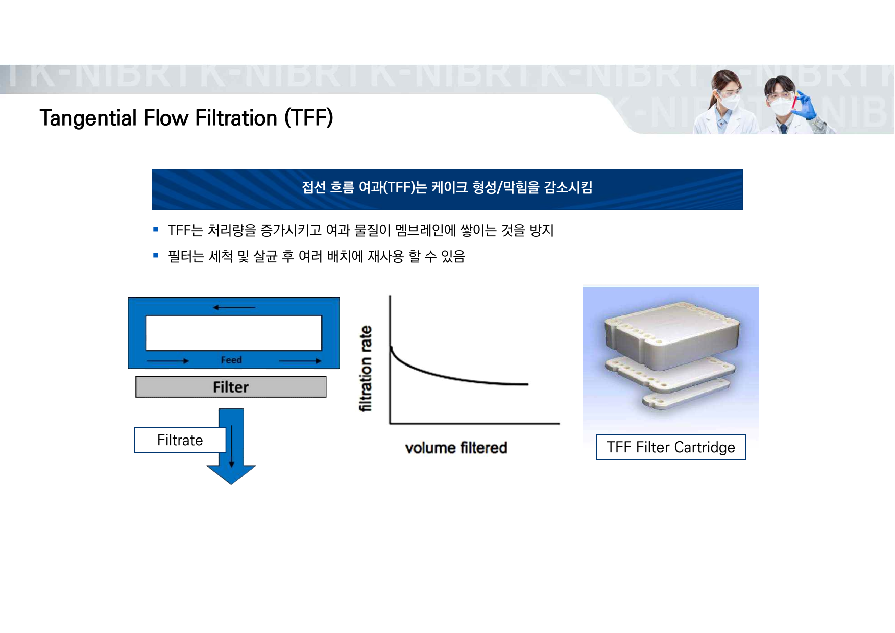

# 문제
Biomolecules and Charge에서 단백질, 바이러스 입자·내독소, DNA·RNA의 전하 특징과
정제 원리를 설명하시오 (출제 예고)

답:
· **단백질**: **pH**와 **pI**에 따라 양전하 또는 음전하
· **바이러스 입자·내독소**: 주로 음전하
· **DNA/RNA**: 인산 골격 때문에 강한 음전하
· 정제 원리: **전하 차이**를 이용해 resin에 다르게 결합시켜 분리
(대표 공정: **ion exchange chromatography**)

[배경설명]
이 문제는 각 생체분자가 어떤 전하를 가지는지와 그 차이를 어떻게 정제에 이용하는지를 묻는다
DNA와 RNA는 인산기가 반복되는 구조라서 대부분 강한 음전하를 가진다
**단백질**은 아미노산 조성에 따라 전하가 달라지고, 주변 **pH**가 바뀌면 전체 전하도 바뀐다
**pI**는 **단백질**의 전체 전하가 0에 가까워지는 **pH**를 뜻한다
Ion exchange **chromatography**에서는 양전하 또는 음전하를 띤 resin을 사용해
전하가 다른 물질을 서로 다르게 붙게 만든다
따라서 전하 특징을 아는 이유는 ==목표 물질과 불순물을 전하 차이로 분리하기 위해서==이다

출처: G:\내 드라이브\여형준님\21 6-1\백신공정이론\기말고사 정리자료\백신공정이론 기말고사 범위 수업자료.pdf p.119, p.356
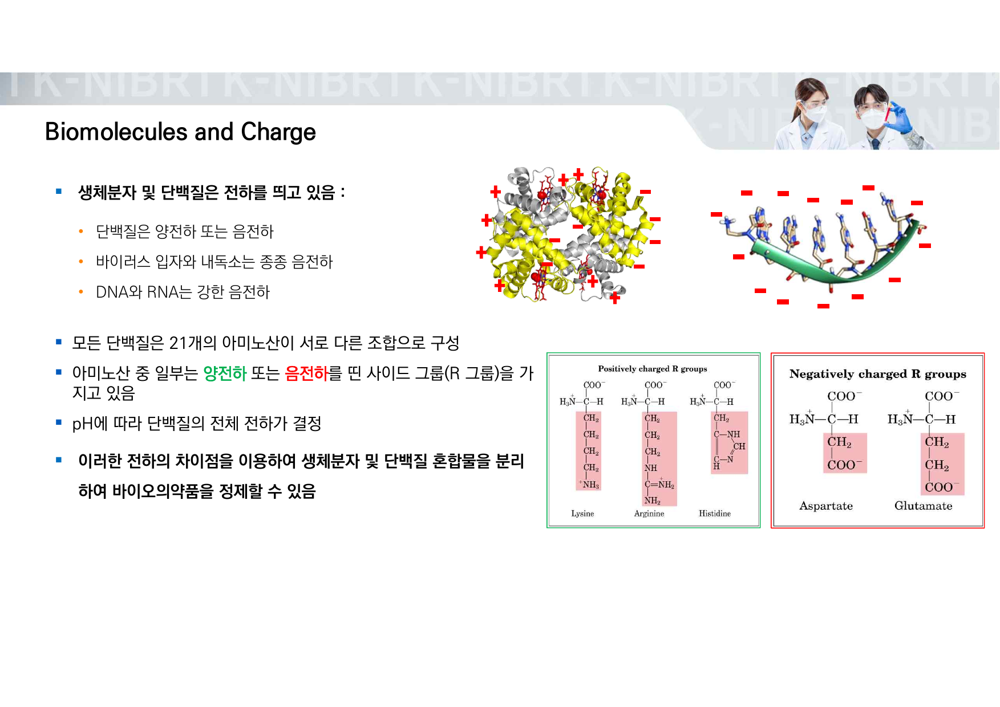

# 문제
Plasmid vector와 shuttle vector의 구조적 차이를 설명하시오 (출제 예고)

답:
· **Plasmid vector**: 주로 한 숙주에서 복제와 선별이 되도록 만든 원형 DNA vector
· **Shuttle vector**: 두 종류 이상의 숙주에서 모두 작동하도록 만든 plasmid vector
숙주별 **origin of replication**, **selection marker**가 필요하다.

[배경설명]
이 문제는 plasmid vector와 shuttle vector의 기능 차이가 아니라
그 기능을 가능하게 하는 구조 차이를 묻는다
**Plasmid vector**는 원하는 유전자를 세포 안에서 복제하거나 발현시키기 위해 쓰는 원형 DNA이다
한 숙주에서만 쓰는 vector라면 그 숙주에서 복제되는 origin과 선별 marker가 있으면 충분하다
**Shuttle vector**는 서로 다른 숙주 사이를 오가며 사용해야 하므로
각 숙주에서 작동하는 복제 원점과 선별 표지가 필요하다
예를 들어 세균과 효모에서 모두 쓰려면 세균용 요소와 효모용 요소가 함께 들어가야 한다
따라서 구조적 차이는 ==shuttle vector가 여러 숙주에서 살아남기 위한==
==복제·선별 요소를 추가로 가진다는 점==이다

출처: G:\내 드라이브\여형준님\21 6-1\백신공정이론\기말고사 정리자료\백신공정이론 기말고사 범위 수업자료.pdf p.193, p.353, p.361
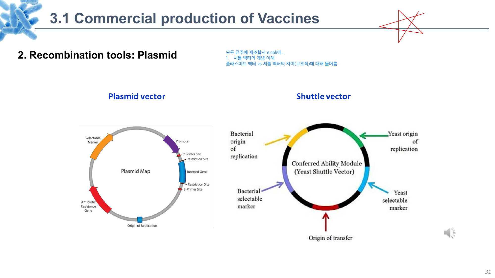
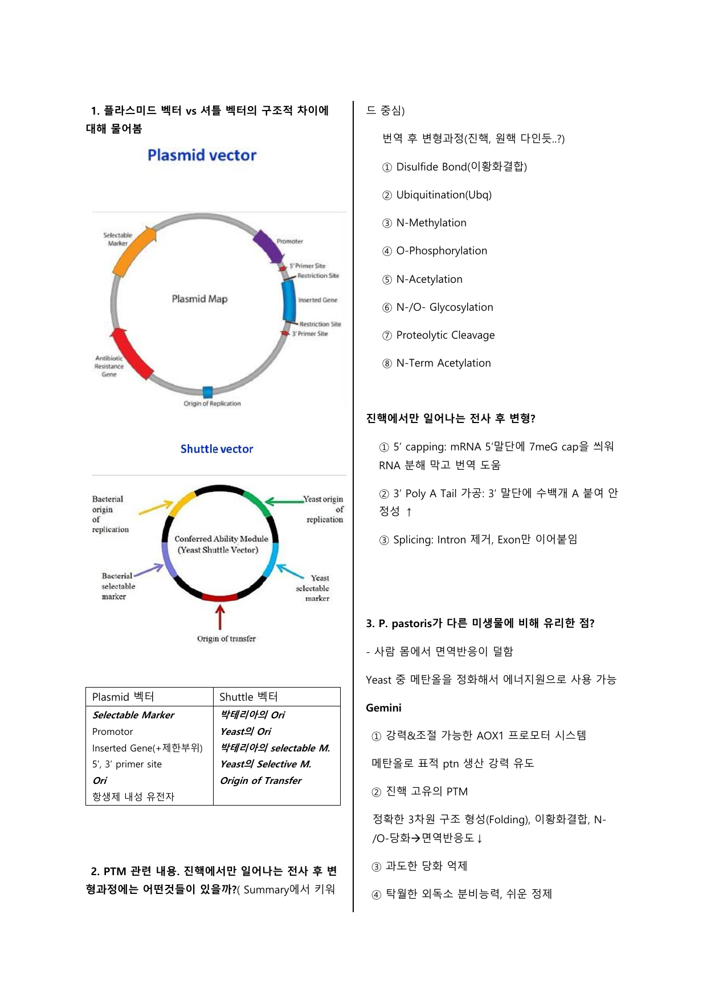
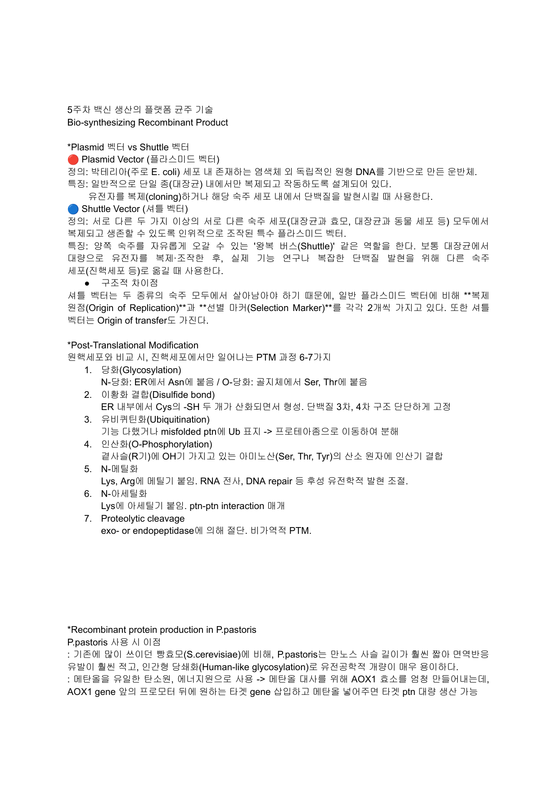
# 문제
PTM(Post-Translational Modification)이 백신 항원 생산에서 중요한 이유와
PTM의 예시들을 쓰시오 (출제 예고)

답:
· 중요한 이유: ==PTM이 항원 단백질의 최종 구조, 안정성, 기능, 항체 인식에 영향을 주기 때문==
· 숙주가 달라지면 **PTM** 양상이 달라져 항원성이 달라질 수 있음
· 예시: **glycosylation**, **disulfide bond**, **ubiquitination**,
**phosphorylation**, **methylation**, **acetylation**, **proteolytic cleavage**

[배경설명]
**PTM**은 **단백질**이 번역된 뒤에 당이 붙거나, 결합이 형성되거나, 일부가 잘리는 변형을 말한다
백신 항원은 단순히 아미노산 서열만 맞으면 되는 것이 아니라
면역계가 인식하는 표면 모양도 중요하다
예를 들어 **glycosylation**이나 **disulfide bond**가 달라지면 **단백질** 접힘과 표면 구조가 달라질 수 있다
숙주세포가 E. coli인지 효모인지 동물세포인지에 따라 가능한 **PTM**이 달라진다
그래서 같은 유전자를 넣어도 생산 숙주가 다르면
항원 **단백질**의 최종 품질과 면역반응이 달라질 수 있다
결론적으로 **PTM**이 중요한 이유는 ==항원 단백질이 면역계에 보이는 최종 형태를 결정하기 때문==이다

출처: G:\내 드라이브\여형준님\21 6-1\백신공정이론\기말고사 정리자료\백신공정이론 기말고사 범위 수업자료.pdf p.195, p.353, p.361
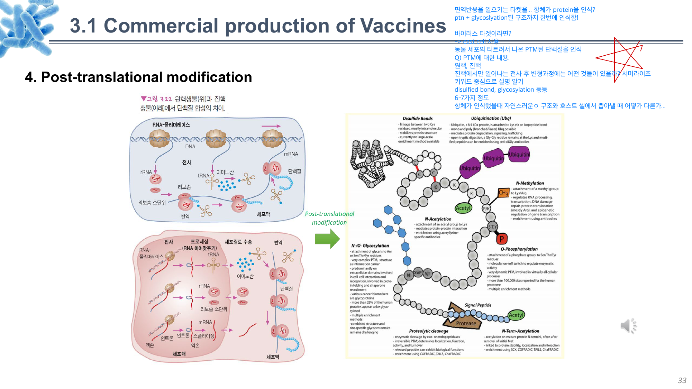

# 문제
Recombinant protein production에서 P. pastoris가 다른 미생물 대비 유리한 점과
AOX1 promoter를 이용한 생산 원리를 설명하시오 (출제 예고)

답:
· **P. pastoris**의 유리한 점: 빠른 성장과 고밀도 배양으로 생산성이 높음
효모라서 세균보다 일부 진핵생물식 **단백질** 처리에 유리함
· **AOX1 promoter** 원리: **methanol**이 있을 때 강하게 활성화됨
· 생산 흐름: 목표 유전자 삽입 → **methanol** 투입 → **AOX1 promoter** 활성화 → 목표 **단백질** 발현

[배경설명]
이 문제는 **P. pastoris**라는 숙주가 왜 유리한지와
**AOX1 promoter**가 어떻게 발현을 켜는지를 함께 묻는다
**P. pastoris**는 효모이기 때문에 세균보다 진핵생물 **단백질** 생산에 가까운 장점이 있다
동시에 배양이 비교적 쉽고 고밀도 배양이 가능해 재조합 **단백질** 생산 숙주로 쓰기 좋다
**promoter**는 유전자 앞에서 전사를 시작하게 하는 스위치 같은 DNA 구간이다
**AOX1 promoter**는 **methanol** 대사와 관련된 강한 **promoter**라서
**methanol**을 넣으면 그 아래 유전자의 발현이 증가한다
따라서 AOX1 시스템의 생산 원리는 ==methanol을 유도 신호로 사용해==
==목표 단백질 유전자를 강하게 발현시키는 것==이다

출처: G:\내 드라이브\여형준님\21 6-1\백신공정이론\기말고사 정리자료\백신공정이론 기말고사 범위 수업자료.pdf p.201, p.353, p.361
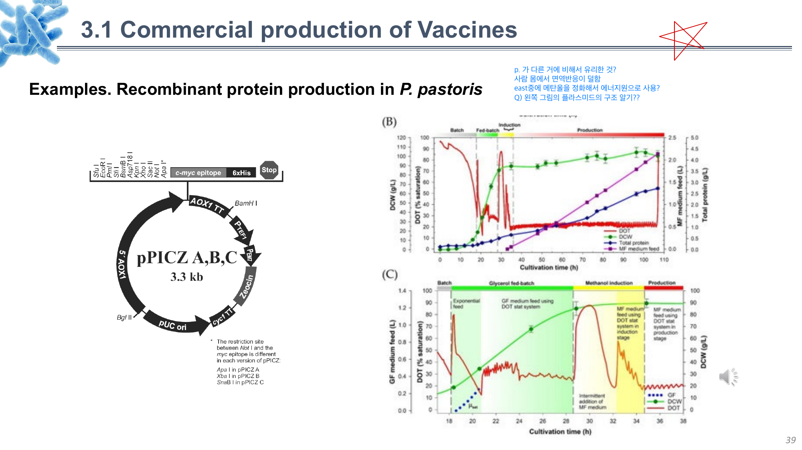

# 문제
P. pastoris용 pPICZ 계열 plasmid 구조에서
AOX1 promoter, MCS, tag, Zeocin, pUC ori, Bgl II의 역할을 설명하시오 (출제 예고)

답:
· **AOX1 promoter**: **methanol** 유도 발현 조절
· **MCS**: 목표 유전자 삽입 부위
· **c-myc epitope**와 **6xHis tag**: **단백질** 검출과 정제
· **Zeocin marker**: plasmid 보유 세포 선별
· **pUC ori**: E. coli에서 plasmid 복제
· **Bgl II site**: plasmid linearization 후 Pichia genome integration에 사용

[배경설명]
pPICZ 계열 plasmid는 **P. pastoris**에서 재조합 **단백질**을 만들기 위해
필요한 기능을 한 vector 안에 모아 둔 구조이다
먼저 **MCS**에 목표 유전자를 넣어야 그 유전자가 vector에 실린다
그 앞의 **AOX1 promoter**는 **methanol**에 반응해 목표 유전자의 전사를 유도한다
만들어진 **단백질**은 **c-myc epitope**나 **6xHis tag**를 이용해 검출하거나 정제할 수 있다
**Zeocin marker**는 vector를 가진 세포만 살아남게 해 선별을 가능하게 한다
**pUC ori**는 E. coli에서 vector를 증폭할 때 필요하고,
Bgl II는 Pichia genome에 넣기 위해 plasmid를 선형화할 때 사용된다
따라서 각 요소는 삽입, 발현, 검출·정제, 선별, 복제, genome integration의 역할로 대응된다

출처: G:\내 드라이브\여형준님\21 6-1\백신공정이론\기말고사 정리자료\백신공정이론 기말고사 범위 수업자료.pdf p.354, p.362
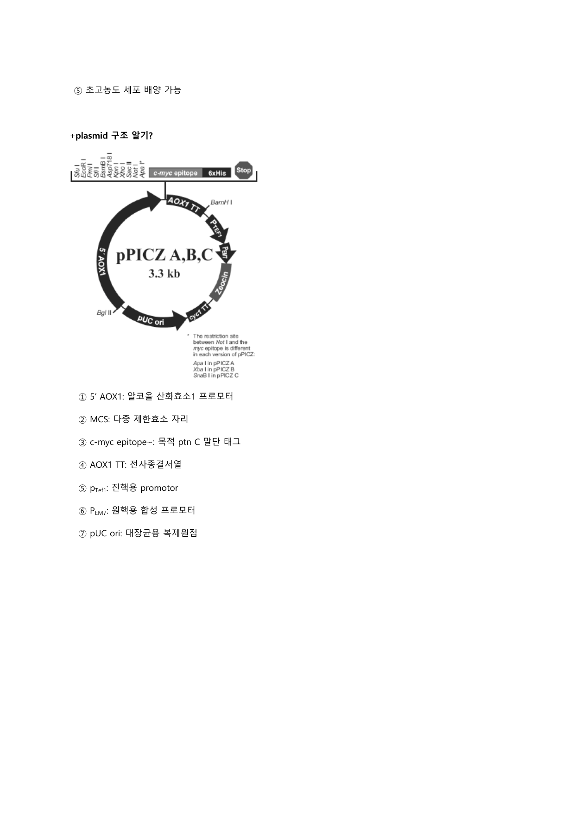
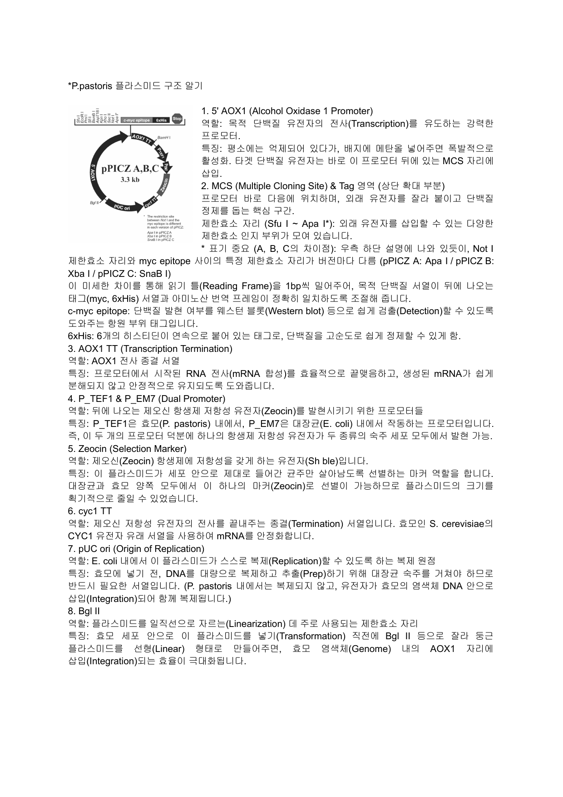
# 문제
mRNA-LNP 구성 성분과 각 성분의 역할을 설명하시오

답:
· **mRNA**: 항원 **단백질** 정보를 담은 **API**
· **Ionizable lipid**: **mRNA** 포장과 endosomal escape 보조
· **Helper phospholipid**: **LNP** 막 구조 형성 보조
· **Cholesterol**: 입자 강도와 안정성 증가
· **PEG-lipid**: 입자 크기 조절과 응집 방지

[배경설명]
이 문제는 **mRNA**-**LNP**를 이루는 성분이 각각 왜 필요한지를 묻는다
**mRNA**는 실제로 항원 **단백질** 정보를 담은 핵심 유효성분이지만,
단독으로는 분해되기 쉽고 세포 안으로 잘 들어가지 못한다
그래서 지질 성분들이 **mRNA**를 감싸 세포까지 운반한다
**Ionizable lipid**는 낮은 **pH**에서 **mRNA**와 결합하고,
세포 안 endosome에서 빠져나오는 데 도움을 준다
Phospholipid와 cholesterol은 입자의 막과 안정성을 잡아준다
**PEG-lipid**는 입자가 서로 뭉치지 않게 하고 크기 분포를 조절한다
결론적으로 **LNP** 성분들은 ==mRNA를 보호하고,==
==안정한 입자로 만들고, 세포 안 전달을 돕기 위해 필요하다==

출처: G:\내 드라이브\여형준님\21 6-1\백신공정이론\기말고사 정리자료\백신공정이론 기말고사 범위 수업자료.pdf p.345, p.357
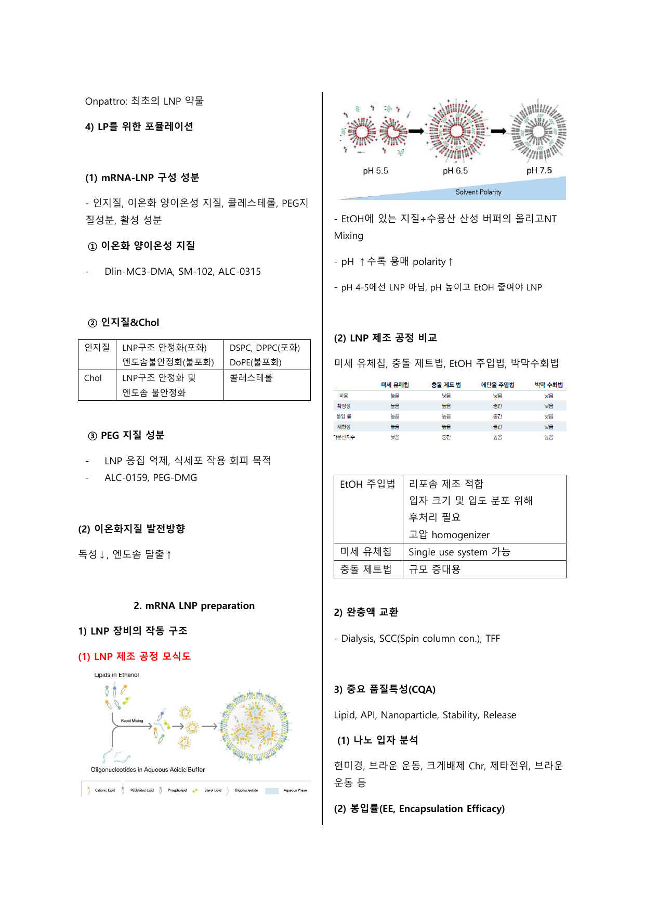
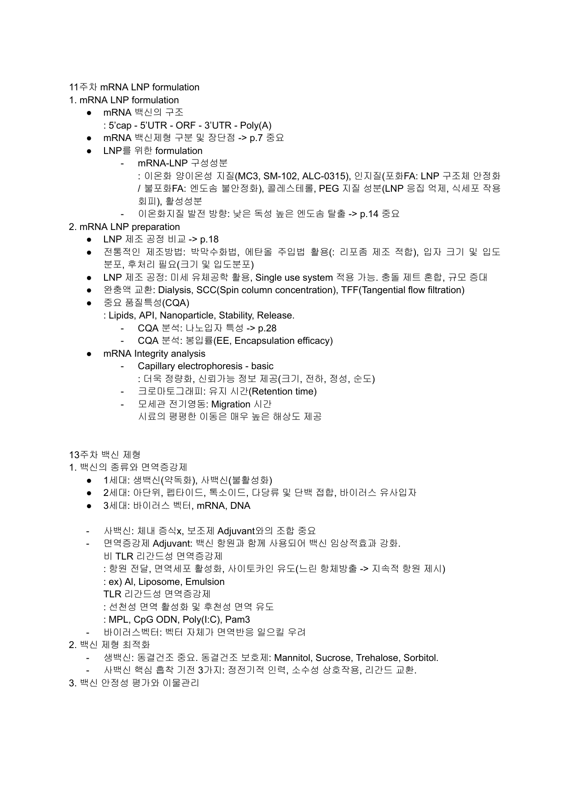
# 문제
mRNA-LNP preparation에서 완충액 교환 방법, CQA 항목,
봉입률 확인 방법, mRNA integrity 분석법을 정리하시오

답:
· 완충액 교환 방법: **dialysis**, **SCC**, **TFF**
· **CQA** 항목: lipid, **API**, nanoparticle 특성, stability, release
· 봉입률 확인 방법: **RiboGreen assay**
· **mRNA** integrity 분석법: **CE/CGE**, **chromatography**
· **CE/CGE**에서는 이동 시간과 peak 양상으로 **mRNA** 상태를 확인

[배경설명]
이 문제는 **mRNA**-**LNP**를 만든 뒤 어떤 품질 확인을 해야 하는지 항목별로 정리하는 문제이다
완충액 교환은 제조에 사용된 용매나 **buffer**를 최종 제형에 맞는 조건으로 바꾸는 과정이다
**CQA**는 critical quality attribute로, 제품의 안전성·품질·효능에 직접 영향을 주는 중요한 품질 특성이다
봉입률은 **mRNA**가 **LNP** 안에 얼마나 잘 들어갔는지를 뜻하며,
**RiboGreen assay**는 노출된 RNA와 봉입된 RNA를 구분해 이를 확인한다
**mRNA** integrity는 **mRNA**가 끊어지지 않고 온전한지를 보는 항목이다
**CE/CGE**나 **chromatography**는 **mRNA**의 크기, 이동 시간, peak 형태를 통해
분해나 손상 여부를 확인하는 데 사용된다
따라서 이 문항의 답은 **buffer** 교환, **CQA**, 봉입률, **mRNA** 온전성 분석을
각각 방법과 연결해 쓰는 것이다

출처: G:\내 드라이브\여형준님\21 6-1\백신공정이론\기말고사 정리자료\백신공정이론 기말고사 범위 수업자료.pdf p.345, p.346, p.357

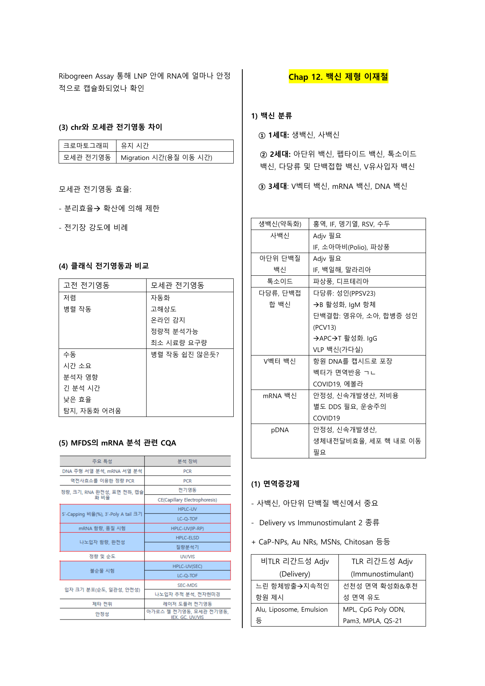

# 문제
LNP 형성 조건과 제조법별 특징을 비교하시오

답:
· **LNP** 형성 조건: **solvent polarity**, **pH**, **ionic strength**, 혼합 속도
· **Bulk mixing**: 단순하지만 입자 균일성 낮을 수 있음
· **High-pressure homogenization**: 강한 분산 가능, 공정 스트레스 큼
· **Microfluidic mixing**: 빠르고 균일한 혼합, 작은 입자와 좁은 PDI에 유리

[배경설명]
이 문제는 **LNP**가 어떤 조건에서 만들어지고
제조법에 따라 품질이 어떻게 달라지는지를 비교하는 문제이다
**LNP**는 lipid와 **mRNA**가 섞이는 순간 자기조립에 의해 입자 구조를 형성한다
이때 용매의 성질, **pH**, 염 농도, 혼합 속도가 달라지면 입자 크기와 균일성이 달라진다
**Bulk mixing**은 장비와 조작이 단순하지만 혼합이 균일하지 않아 입자 분포가 넓어질 수 있다
**High-pressure homogenization**은 강한 힘으로 분산시키기 때문에
입자를 만들 수 있지만 민감한 성분에 스트레스를 줄 수 있다
**Microfluidic mixing**은 작은 통로에서 빠르게 섞어
혼합 시간을 일정하게 만들기 때문에 균일한 **LNP** 제조에 유리하다
따라서 제조법 비교의 핵심은 혼합이 얼마나 빠르고 균일하게 일어나느냐가
**LNP** 크기와 PDI를 좌우한다는 점이다

출처: G:\내 드라이브\여형준님\21 6-1\백신공정이론\기말고사 정리자료\백신공정이론 기말고사 범위 수업자료.pdf p.345, p.357

# 문제
백신 항원 유형 기준으로 1세대, 2세대, 3세대 백신 플랫폼을 분류하고
각 세대의 핵심 특징을 설명하시오

답:
· **1세대 백신**: 생백신, 사백신처럼 병원체 전체를 이용
항원 구조가 자연 병원체와 가까우나 안전성 관리가 중요
· **2세대 백신**: subunit, conjugate, VLP처럼 병원체 일부 항원을 이용
필요한 항원만 쓰므로 안전성은 높지만 면역증강이 필요할 수 있음
· **3세대 백신**: viral vector, **mRNA**, pDNA처럼 항원 유전정보를 전달
체내 세포가 항원을 만들게 하며 전달 기술이 중요

[배경설명]
이 문제는 백신을 항원의 형태에 따라 세대로 나누는 문제이다
**1세대**는 약하게 만들거나 죽인 병원체 전체를 넣어 면역반응을 유도한다
**2세대**는 병원체 전체가 아니라 면역반응에 필요한 항원 조각만 골라 넣는다
**3세대**는 항원 **단백질** 자체가 아니라 항원을 만들 수 있는 유전정보를 전달한다
세대가 올라갈수록 병원체 전체를 직접 넣는 방식에서 벗어나
더 정의된 항원이나 유전정보 기반 설계로 이동한다
따라서 세대별 차이는 ==무엇을 항원으로 넣는가==와
==그 항원이 몸 안에서 어떻게 만들어지는가==로 설명하면 된다

출처: G:\내 드라이브\여형준님\21 6-1\백신공정이론\기말고사 정리자료\백신공정이론 기말고사 범위 수업자료.pdf p.208, p.225
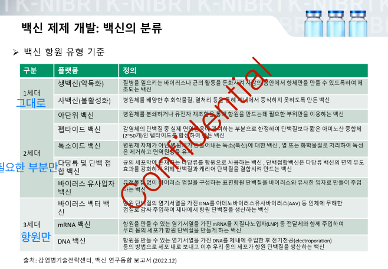
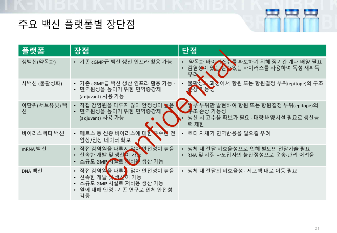
# 문제
면역증강제(adjuvant)의 정의와 역할을 쓰고,
delivery vehicle과 immunostimulant,
비TLR 리간드성과 TLR 리간드성 면역증강제를 구분하시오

답:
· **Adjuvant**: 항원과 함께 투여해 면역반응을 강화하는 물질
(역할: 항원 전달 증가, depot 효과, innate immunity 자극, adaptive immunity 강화)
· **Delivery vehicle**: 항원을 싣고 전달하거나 오래 머물게 하는 adjuvant
· **Immunostimulant**: 면역 수용체나 면역세포를 직접 자극하는 adjuvant
· **비TLR 리간드성**: aluminium, liposome, emulsion
· **TLR 리간드성**: MPLA, CpG ODN

[배경설명]
이 문제는 adjuvant의 정의와 분류 기준을 함께 묻는다
**Adjuvant**는 항원만으로 면역반응이 충분하지 않을 때 항원과 같이 넣어 면역반응을 키우는 성분이다
**Delivery vehicle**은 항원을 운반하거나 주사 부위에 오래 머물게 해
면역세포가 항원을 더 잘 만나도록 돕는다
**Immunostimulant**는 면역세포의 receptor를 자극해 선천면역 반응을 켜고,
이후 adaptive immunity가 강해지도록 만든다
**TLR**은 선천면역세포가 병원체 신호를 감지하는 receptor이다
**TLR 리간드성** adjuvant는 **TLR**을 직접 자극하고, **비TLR 리간드성** adjuvant는 **TLR** 직접 자극보다는 전달·depot·입자 효과 등으로 면역반응을 돕는다
따라서 답은 ==adjuvant의 역할==과 전달 중심인지 자극 중심인지,
**TLR** 직접 자극인지 아닌지를 구분해야 한다

출처: G:\내 드라이브\여형준님\21 6-1\백신공정이론\기말고사 정리자료\백신공정이론 기말고사 범위 수업자료.pdf p.213, p.214, p.215, p.216
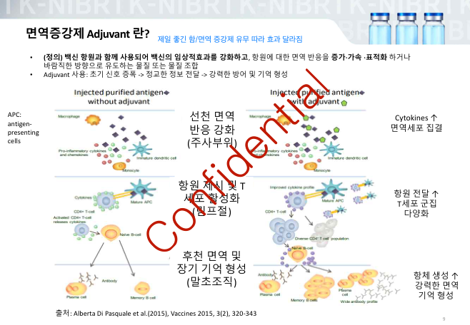
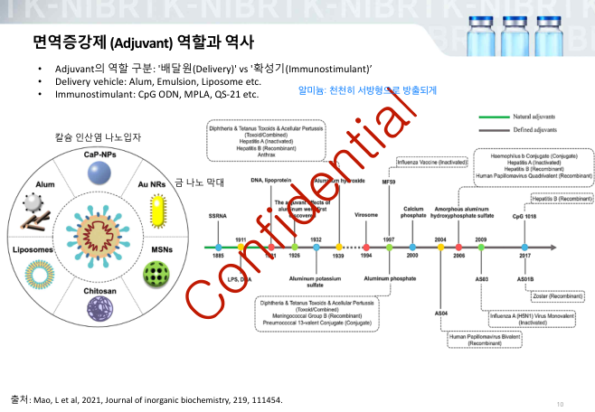
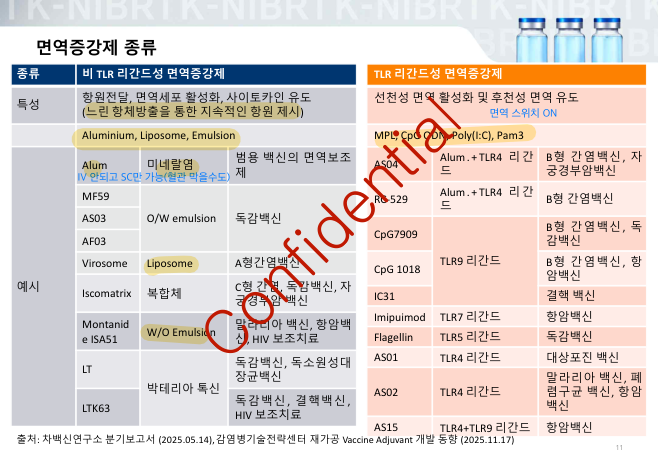
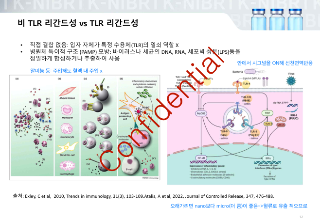
# 문제
사백신 제형 최적화에서 adjuvant 흡착의 핵심 기전 3가지를 설명하시오

답:
· **Electrostatic attraction**: 항원과 adjuvant의 반대 전하가 끌어당김
· **Hydrophobic interaction**: 소수성 부위끼리 상호작용
· **Ligand exchange**: 항원 ligand가 aluminium 표면 ligand와 교환
(흡착 결과: 항원 안정성, 방출 속도, 면역반응 강도에 영향)

[배경설명]
이 문제는 사백신 제형에서 항원이 adjuvant에 어떻게 붙는지를 묻는다
사백신은 병원체를 불활화한 백신이라 면역반응이 약할 수 있고,
이를 보완하기 위해 adjuvant를 함께 쓰는 경우가 많다
항원이 adjuvant 표면에 붙는 정도는
'항원이 몸 안에서 얼마나 오래 유지되고 어떻게 방출되는지'에 영향을 준다
**Electrostatic attraction**은 양전하와 음전하가 서로 끌어당기는 힘이다
**Hydrophobic interaction**은 물을 싫어하는 소수성 부위끼리 모이는 상호작용이다
**Ligand exchange**는 phosphate 같은 항원 쪽 ligand가
aluminium 표면의 ligand와 교환되며 더 강하게 붙는 방식이다
따라서 adsorption 기전 3가지는 전하로 붙는 경우, 소수성으로 붙는 경우,
ligand가 교환되며 붙는 경우이다

출처: G:\내 드라이브\여형준님\21 6-1\백신공정이론\기말고사 정리자료\백신공정이론 기말고사 범위 수업자료.pdf p.231, p.232, p.233
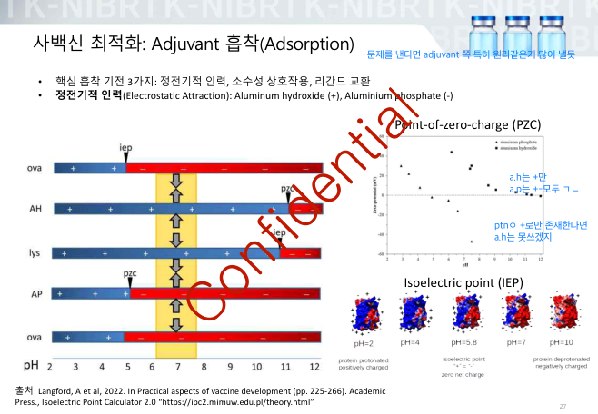
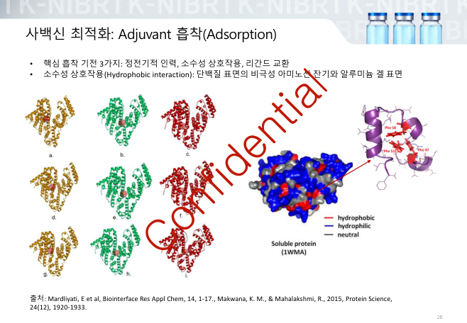
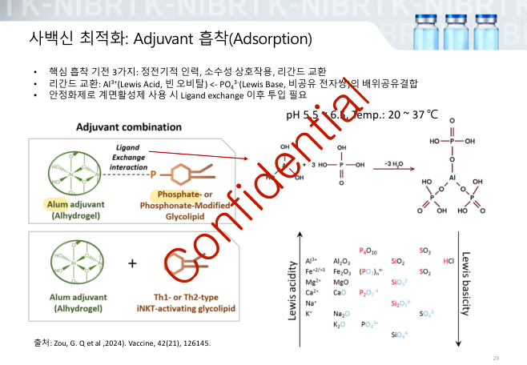
# 문제
백신 제형 최적화에서 1세대, 2세대, 3세대 백신의 핵심 목표와 제형 기술을 비교하시오

답:
· **1세대**: 병원체 전체 또는 불활화 항원의 안정성 유지, adjuvant 흡착 최적화
· **2세대**: subunit, conjugate, VLP의 구조 안정성과 항원성 유지
· **3세대**: **mRNA**, pDNA, viral vector의 분해 방지와 세포 전달 증가
· 제형 기술: **buffer**, **stabilizer**, **surfactant**, **lyophilization**, **LNP**, **polymer**

[배경설명]
이 문제는 백신 세대별로 제형이 해결해야 하는 문제가 무엇인지 비교하는 문제이다
**1세대 백신**은 병원체 전체나 불활화 항원을 쓰므로 항원 전체의 안정성과 adjuvant 흡착이 중요하다
**2세대 백신**은 **단백질** 조각, conjugate, VLP처럼 구조가 무너지면 항원성이 약해질 수 있는 물질을 쓴다
따라서 **2세대**에서는 **단백질** 접힘, 입자 구조, 응집 방지가 중요하다
**3세대 백신**은 **mRNA**나 pDNA처럼 분해되기 쉬운 유전정보를 세포 안까지 전달해야 한다
그래서 **LNP**나 **polymer** 같은 전달체, **buffer**와 **stabilizer**, 동결건조 같은 안정화 기술이 필요하다
결론적으로 제형 최적화 목표는 **1세대**는 전체 항원 안정성,
**2세대**는 구조 안정성, **3세대**는 보호와 전달로 달라진다

출처: G:\내 드라이브\여형준님\21 6-1\백신공정이론\기말고사 정리자료\백신공정이론 기말고사 범위 수업자료.pdf p.227, p.229, p.235, p.237
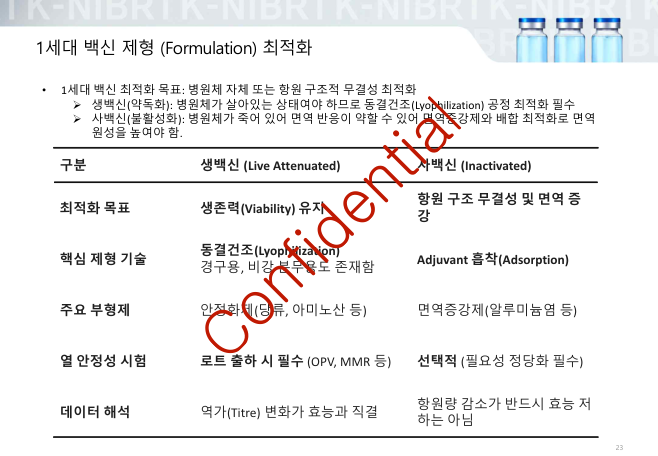
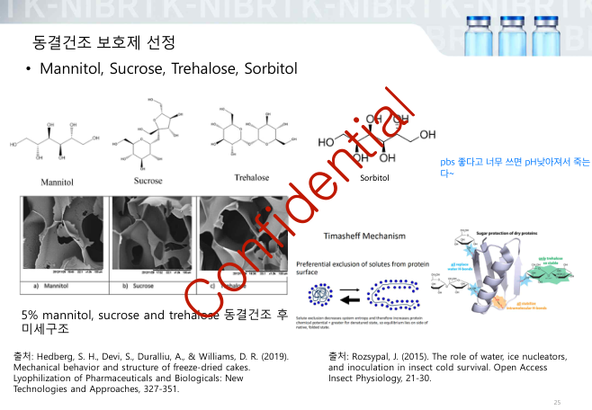
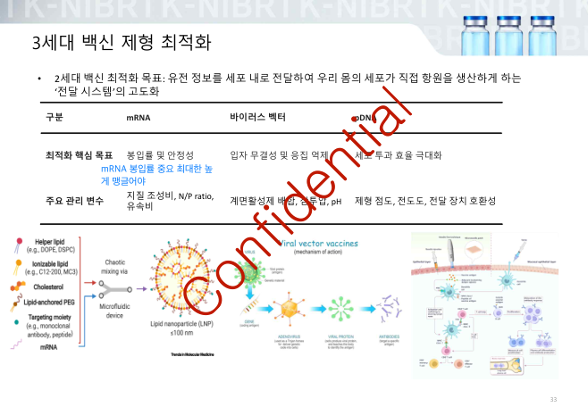
# 문제
동결건조의 정의, 기본 cycle, 목적, 장점과 단점을 설명하시오

답:
· 정의: 얼린 시료를 진공에서 승화시켜 물을 제거하는 공정
· 기본 cycle: freezing → primary drying → secondary drying
· 목적: 수분을 줄여 장기 보관 안정성 증가
· 장점: **단백질**·바이오의약품 안정성 증가, 냉장 의존도 감소
· 단점: 시간이 길고 비용이 크며 cycle 설계가 어려움

[배경설명]
이 문제는 동결건조의 정의, 과정, 왜 쓰는지, 장단점을 모두 묻는다
동결건조는 물을 끓여 없애는 방식이 아니라 시료를 얼린 뒤
진공에서 얼음을 바로 수증기로 바꾸는 방식이다
**Freezing** 단계에서는 시료 안의 물을 얼음으로 만든다
**Primary drying** 단계에서는 얼음을 승화시켜 대부분의 물을 제거한다
**Secondary drying** 단계에서는 얼음으로 남지 않은 결합수와 잔류 수분을 더 줄인다
수분이 줄면 **단백질**이나 백신 성분의 움직임과 분해가 줄어 보관 안정성이 좋아진다
다만 장비와 시간이 많이 필요하고 **온도**·압력 조건을 잘못 잡으면
cake collapse나 품질 저하가 생길 수 있다

출처: G:\내 드라이브\여형준님\21 6-1\백신공정이론\기말고사 정리자료\백신공정이론 기말고사 범위 수업자료.pdf p.348, p.358
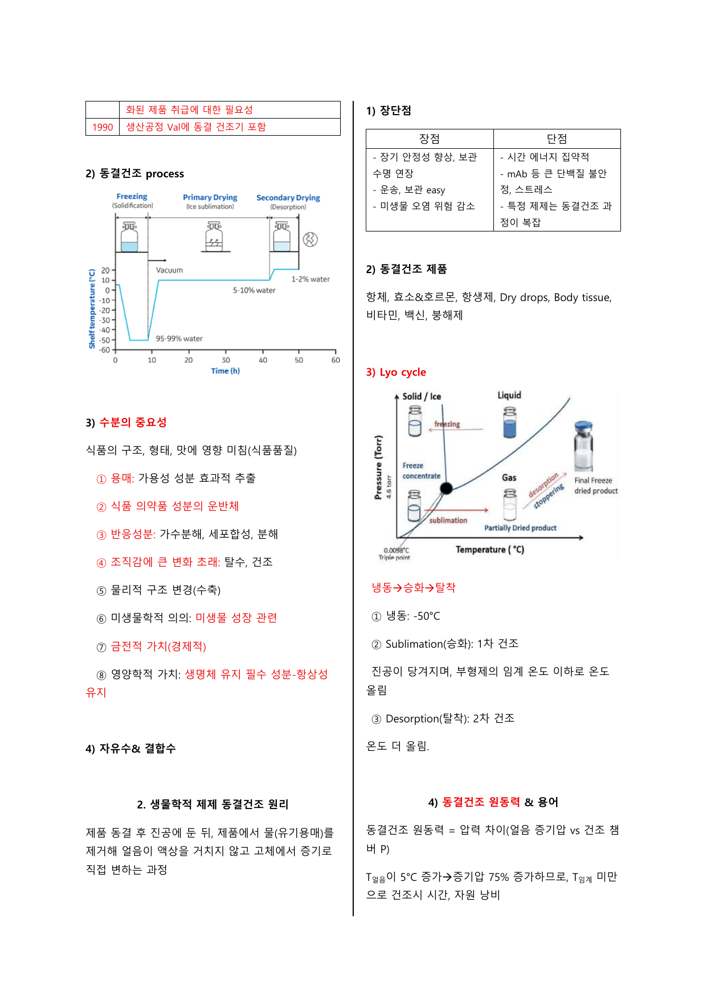
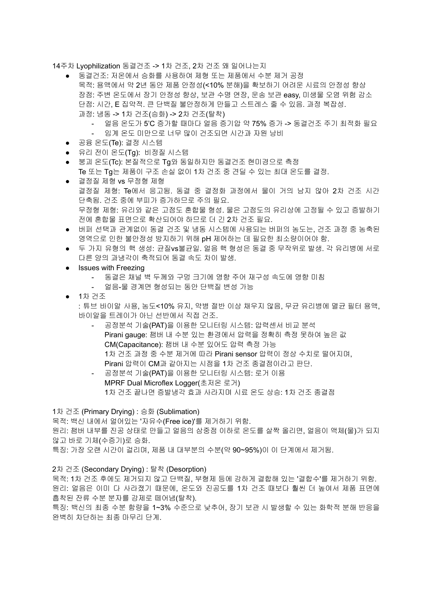
# 문제
동결건조에서 1차 건조와 2차 건조가 각각 왜 필요한지 비교하고,
1차 건조 종결점을 Pirani gauge와 capacitance manometer로 판단하는 원리를 설명하시오

답:
· 1차 건조가 필요한 이유: ==얼음을 승화시켜 대부분의 물을 제거하기 위해서==
· 2차 건조가 필요한 이유: ==결합수와 잔류 수분을 desorption으로 더 제거하기 위해서==
· **Pirani gauge**: 수증기 조성에 민감해 1차 건조 중 높게 읽힘
· **Capacitance manometer**: 기체 조성과 무관하게 실제 압력 측정
· 종결점 판단: 수증기가 줄어 ==Pirani 값이 CM 값에 가까워지면 1차 건조 종료로 판단==

[배경설명]
이 문제는 1차 건조와 2차 건조의 목적 차이와 endpoint 판단 원리를 묻는다
1차 건조에서는 얼음이 계속 수증기로 바뀌기 때문에 chamber 안에 수증기가 많다
**Pirani gauge**는 기체가 열을 전달하는 정도로 압력을 읽기 때문에
수증기가 많으면 실제 압력보다 높게 읽히기 쉽다
**Capacitance manometer**는 막의 변형으로 압력을 읽기 때문에 기체 종류에 거의 영향을 받지 않는다
1차 건조가 끝나면 더 이상 얼음이 많이 승화하지 않아 수증기 발생량이 줄어든다
그 결과 **Pirani gauge**와 capacitance manometer의 압력값 차이가 줄고 두 값이 가까워진다
따라서 두 압력계 값의 수렴은 ==승화할 얼음이 거의 없어졌다는 신호==로 해석된다

출처: G:\내 드라이브\여형준님\21 6-1\백신공정이론\기말고사 정리자료\백신공정이론 기말고사 범위 수업자료.pdf p.358, p.313, p.314

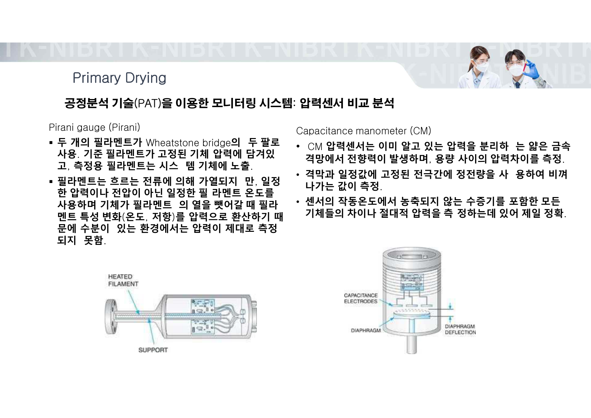
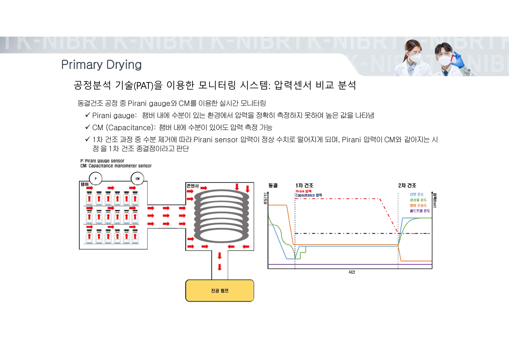
# 문제
동결건조에서 Te, Tg, Tc의 의미와 결정질 제형·무정형 제형의 차이를 설명하시오

답:
· **Te**: 결정질 제형에서 eutectic melting과 관련된 기준 **온도**
· **Tg**: 무정형 제형에서 glass transition이 일어나는 기준 **온도**
· **Tc**: 건조 중 cake 구조가 무너질 수 있는 collapse temperature
· 결정질 제형: **Te** 기준으로 cycle 설계
· 무정형 제형: **Tg**와 **Tc** 기준으로 cycle 설계

[배경설명]
이 문제는 동결건조 cycle을 설계할 때 왜 임계**온도**를 알아야 하는지 묻는다
동결건조 중 제품 **온도**가 너무 높아지면 얼어 있는 구조가 녹거나 무너져 cake 품질이 나빠질 수 있다
결정질 제형은 성분이 규칙적인 결정 형태를 만들며, 이 경우 **Te**가 중요한 **온도** 기준이 된다
무정형 제형은 유리처럼 규칙성이 낮은 고체 상태를 만들며, 이 경우 **Tg**와 **Tc**가 중요하다
**Tg**는 무정형 물질이 glass 상태에서 더 움직이기 쉬운 상태로 바뀌는 기준이고,
**Tc**는 실제 cake가 무너질 수 있는 **온도**이다
따라서 cycle 설계에서는 제품 **온도**를 각 제형의 임계**온도**보다 낮게 유지해야 한다
결정질과 무정형의 차이는 ==어떤 임계온도를 기준으로 안전한 건조 온도를 잡는가==이다

출처: G:\내 드라이브\여형준님\21 6-1\백신공정이론\기말고사 정리자료\백신공정이론 기말고사 범위 수업자료.pdf p.349, p.358
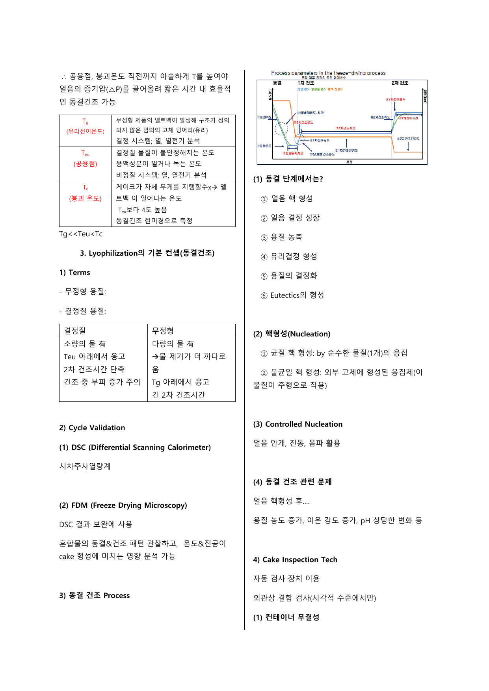

# 문제
DNA 백신의 구조와 투여 후 항원 제시까지의 흐름을 설명하시오

답:
· 구조: 항원 유전자를 담은 **plasmid DNA**
· 구성 요소: **origin of replication**, **selection marker**, **promoter**, antigen gene, polyA signal
· 흐름: 투여 → 세포 유입 → 핵 이동 → **mRNA** 전사 → 항원 **단백질** 번역
· 항원 제시: 생성된 항원이 **MHC I** 또는 **MHC II** 경로로 제시됨

[배경설명]
이 문제는 DNA 백신이 어떤 구조를 가지고, 투여 후 어떤 순서로 항원 제시까지 이어지는지를 묻는다
DNA 백신은 항원 **단백질**을 직접 넣는 것이 아니라
항원 **단백질**을 만들 수 있는 유전자를 **plasmid DNA** 형태로 넣는다
Promoter는 세포가 항원 유전자를 읽기 시작하게 하는 스위치 역할을 한다
투여된 pDNA가 세포 안으로 들어가고 핵까지 도달하면, 항원 유전자가 **mRNA**로 전사된다
그 **mRNA**는 세포질에서 항원 **단백질**로 번역된다
만들어진 항원 **단백질**은 세포 안에서 처리되어 **MHC I** 또는 **MHC II**를 통해 면역세포에게 제시된다
따라서 DNA 백신의 흐름은 ==DNA 전달, 핵 내 전사, 세포질 번역, MHC 항원 제시==로 이어진다

출처: G:\내 드라이브\여형준님\21 6-1\백신공정이론\기말고사 정리자료\백신공정이론 기말고사 범위 수업자료.pdf p.350, p.359
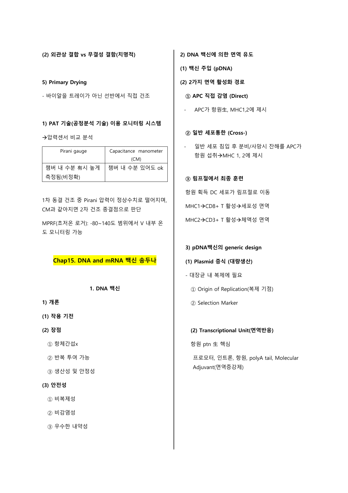
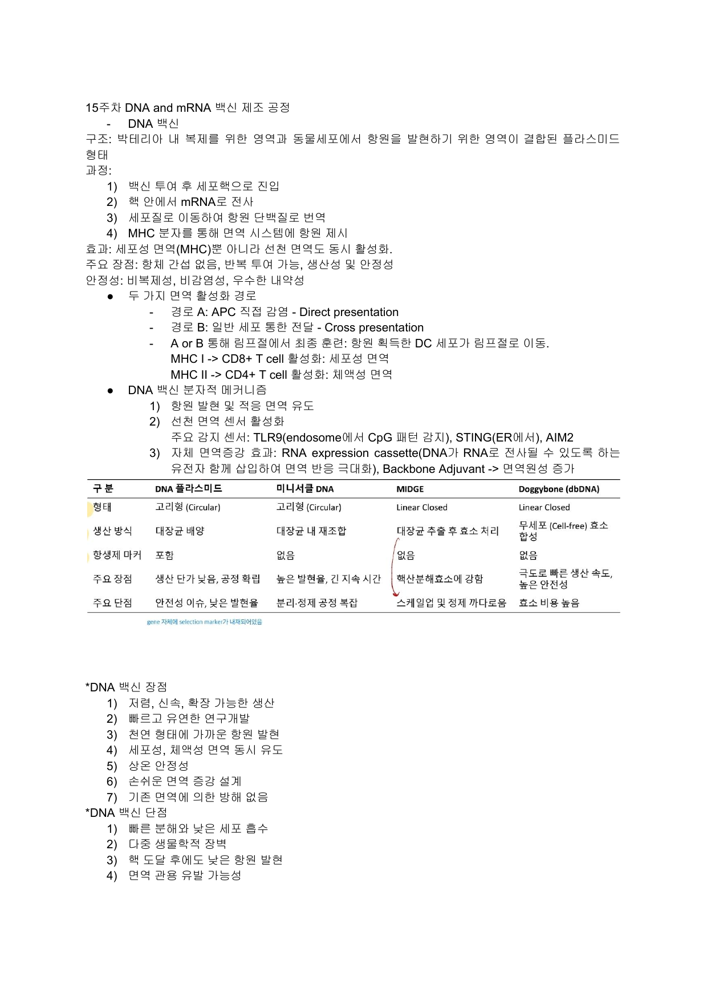
# 문제
DNA 백신의 장점과 단점을 설명하시오

답:
### 장점
· 빠르고 저렴한 설계·생산
· 대량생산과 scale-up 용이
· 체내 세포가 항원을 만들어 native-like antigen 발현 가능
· **체액성 면역**과 **세포성 면역** 모두 유도 가능
### 단점
· naked DNA는 분해되기 쉽고 세포 흡수가 낮음
· 세포막, endosome, 핵막 장벽 통과 필요
· 핵 도달 후에도 발현량 부족 또는 면역관용 가능성

[배경설명]
이 문제는 DNA 백신이 왜 유리한지와 왜 효과가 제한될 수 있는지를 함께 묻는다
DNA 백신은 항원 유전자만 바꾸면
새로운 백신 후보를 빠르게 설계할 수 있어 개발과 생산 확장이 비교적 쉽다
체내 세포가 직접 항원을 만들기 때문에
**단백질** 항원을 밖에서 넣는 방식보다 자연에 가까운 항원 형태가 만들어질 수 있다
세포 안에서 항원이 만들어지면 **MHC I** 경로가 활성화되어
CD8 T cell 중심의 **세포성 면역**도 기대할 수 있다
반대로 DNA는 세포 밖에서 분해되기 쉽고, 음전하를 띠어 세포막을 쉽게 통과하지 못한다
DNA 백신은 효과를 내려면 세포 안으로 들어간 뒤 핵막까지 통과해 전사가 일어나야 한다
따라서 장점은 ==빠른 설계와 넓은 면역반응==이고, 단점은 ==DNA를 핵까지 전달해야 하는 장벽==이다

출처: G:\내 드라이브\여형준님\21 6-1\백신공정이론\기말고사 정리자료\백신공정이론 기말고사 범위 수업자료.pdf p.351, p.359
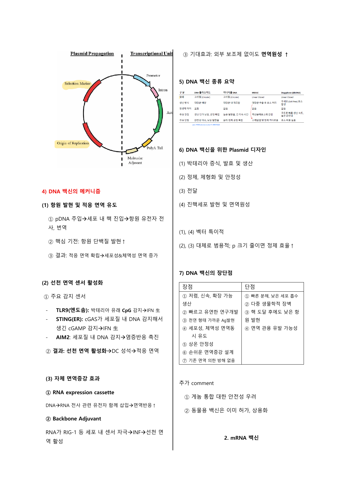

# 문제
DNA 백신의 면역 활성화 경로에서 direct presentation과 cross presentation,
MHC I·MHC II 결과를 설명하시오

답:
· **Direct presentation**: transfected APC가 직접 항원을 만들고 제시
· **Cross presentation**: 다른 transfected cell이 만든 항원을 APC가 받아 제시
· **MHC I** 결과: **CD8+ T cell** 활성화, **세포성 면역** 유도
· **MHC II** 결과: **CD4+ T cell** 활성화, 항체반응 보조
· 최종 결과: cellular immunity와 humoral immunity가 함께 유도될 수 있음

[배경설명]
이 문제는 DNA 백신 항원이 어떤 세포에서 만들어지고 어떤 MHC 경로로 제시되는지를 묻는다
APC는 antigen-presenting cell로, 항원을 처리해 T cell에게 보여주는 세포이다
**Direct presentation**에서는 APC 자체가 pDNA를 받아 항원을 만들고,
그 항원을 MHC를 통해 직접 제시한다
**Cross presentation**에서는 근육세포 같은 다른 세포가 항원을 만들고,
APC가 그 항원을 받아 다시 처리해 제시한다
**MHC I**은 주로 세포 안에서 만들어진 항원을 **CD8+ T cell**에게 보여 주어 **세포성 면역**을 유도한다
**MHC II**는 주로 세포 밖에서 들어온 항원을 **CD4+ T cell**에게 보여 주어 항체반응과 면역 조절을 돕는다
따라서 DNA 백신은 ==항원이 세포 안에서 만들어지는 특성 때문에==
==MHC I과 MHC II 경로를 모두 연결할 수 있다==

출처: G:\내 드라이브\여형준님\21 6-1\백신공정이론\기말고사 정리자료\백신공정이론 기말고사 범위 수업자료.pdf p.350, p.359

# 문제
목표 유전자 대량 추출용 competent cell과 목표 단백질 대량 생산용 competent cell을 구분하고,
recA와 BL21(DE3)의 의미를 설명하시오

답:
· 목표 유전자 대량 추출용: **DH5α**, **DH10B** 같은 cloning strain
(목적: plasmid를 안정적으로 유지하고 많이 확보)
· 목표 **단백질** 대량 생산용: **BL21(DE3)** 같은 expression strain
(목적: 목표 **단백질** 발현량 증가)
· **recA-**: homologous recombination 감소로 plasmid 안정성 증가
· **BL21(DE3)**: **T7 RNA polymerase** 기반 **단백질** 발현 균주

[배경설명]
이 문제는 competent cell을 목적에 따라 구분하는 문제이다
목표 유전자를 많이 추출하려면 plasmid가
세포 안에서 안정적으로 유지되고 재조합으로 변형되지 않는 것이 중요하다
**DH5α**나 **DH10B** 같은 cloning strain은 plasmid 확보에 적합하고,
**recA-** 특성은 homologous recombination을 줄여 plasmid 안정성을 높인다
목표 **단백질**을 많이 만들려면 plasmid 보관보다 **단백질** 발현 시스템이 중요하다
**BL21(DE3)**는 **T7 RNA polymerase** 시스템을 이용해
T7 **promoter** 아래의 목표 유전자를 강하게 발현시키는 데 쓰인다
따라서 두 competent cell의 차이는 ==plasmid를 많이 얻기 위한 세포인지,==
==단백질을 많이 만들기 위한 세포인지==이다

출처: G:\내 드라이브\여형준님\21 6-1\백신공정이론\기말고사 정리자료\백신공정이론 기말고사 범위 수업자료.pdf p.340, p.355
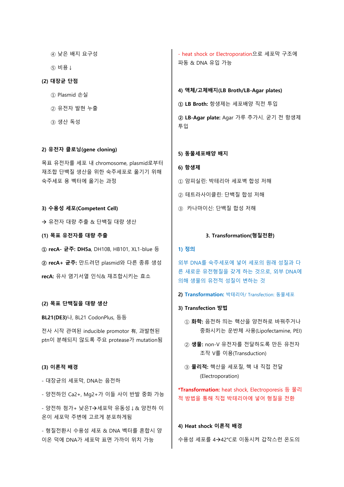
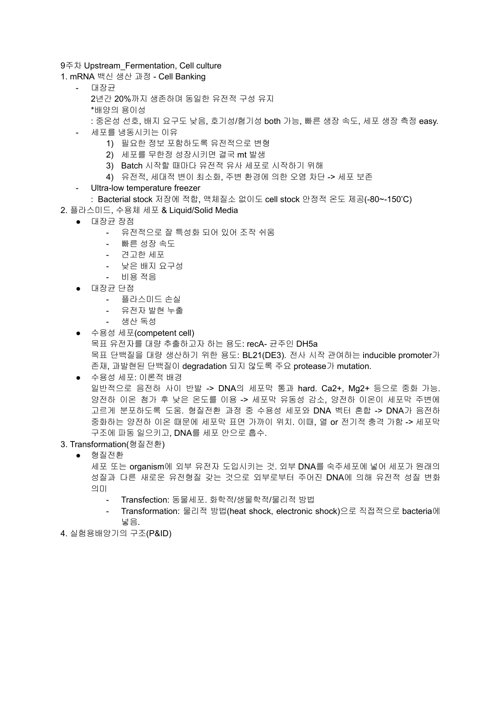
# 문제
Competent cell에서 Ca2+, Mg2+, 낮은 온도, heat shock 또는 electroporation이
DNA 유입에 어떻게 기여하는지 설명하시오

답:
DNA와 세포막은 모두 음전하라 서로 반발한다.
· **Ca2+**와 **Mg2+**: 음전하 반발을 줄여 DNA가 세포 표면에 붙게 함
· 낮은 **온도**: 세포막을 안정화하고 DNA 부착 상태 유지
· **Heat shock**: 순간적 **온도** 변화로 DNA 유입 촉진
· **Electroporation**: 전기장으로 막에 일시적 pore를 만들어 DNA 유입

[배경설명]
이 문제는 transformation에서 각 처리 조건이 DNA 유입에 어떻게 도움을 주는지를 묻는다
DNA backbone은 인산기 때문에 음전하를 띠고, 세포막 표면도 음전하 성질을 가진다
그래서 DNA와 세포막은 그냥 두면 서로 밀어내며 가까이 붙기 어렵다
**Ca2+**와 **Mg2+** 같은 양이온은 이 음전하 반발을 줄여 DNA가 세포 표면 가까이에 머물 수 있게 한다
낮은 **온도**는 세포막 상태를 안정화해 DNA가 붙은 상태를 유지하는 데 도움을 준다
**Heat shock**은 차가운 상태에서 갑자기 **온도**를 올려 DNA가 세포 안으로 들어갈 기회를 만들고, electroporation은 전기장으로 막에 일시적인 구멍을 만든다
따라서 이 처리들의 공통 목적은 ==DNA가 세포막에 붙고,==
==막을 통과해 세포 안으로 들어가게 만드는 것==이다

출처: G:\내 드라이브\여형준님\21 6-1\백신공정이론\기말고사 정리자료\백신공정이론 기말고사 범위 수업자료.pdf p.340, p.355

# 문제
실험용 배양기 조건에서 온도, pH, DO, agitation이 공정에 미치는 의미를 설명하시오

답:
· **온도**: 세포 성장 속도와 **단백질** 발현·접힘에 영향
· **pH**: 세포 대사, 효소 활성, **단백질** 안정성에 영향
· **DO**: 배양액 안에 녹아 있는 산소 공급 상태
· **Agitation**: 세포, 영양분, 산소를 균일하게 혼합하고 산소 전달 증가
(과도한 agitation는 **shear stress** 증가로 세포 손상 가능)

[배경설명]
이 문제는 배양기 조건이 왜 단순 설정값이 아니라 공정 품질에 영향을 주는지를 묻는다
**온도**는 세포가 자라는 속도와 **단백질**이 만들어지고 접히는 방식에 영향을 준다
**pH**는 세포 안팎의 효소 반응과 **단백질** 안정성에 영향을 주기 때문에 일정하게 유지해야 한다
**DO**는 dissolved oxygen으로, 배양액에 녹아 있는 산소량을 의미한다
세포 밀도가 높아지면 산소 소비가 증가하므로 **DO**가 부족하면 성장과 생산성이 떨어질 수 있다
**Agitation**은 배양액을 섞어 산소와 영양분을 균일하게 전달하지만,
너무 강하면 세포에 물리적 손상을 줄 수 있다
따라서 **온도**, **pH**, **DO**, agitation은 ==세포 성장, 생산성, 단백질 품질,==
==세포 손상 위험을 함께 좌우하는 핵심 공정 조건==이다

출처: G:\내 드라이브\여형준님\21 6-1\백신공정이론\기말고사 정리자료\백신공정이론 기말고사 범위 수업자료.pdf p.341
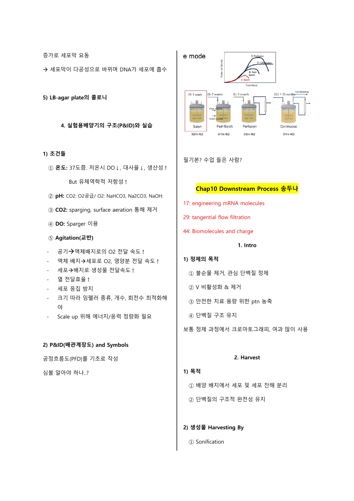
