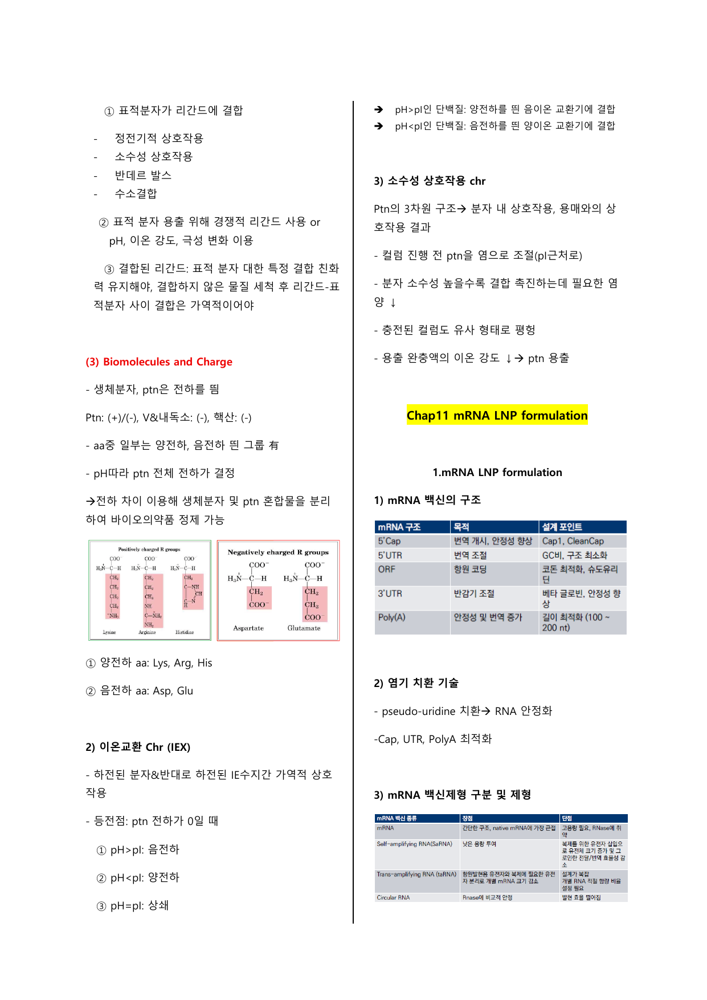
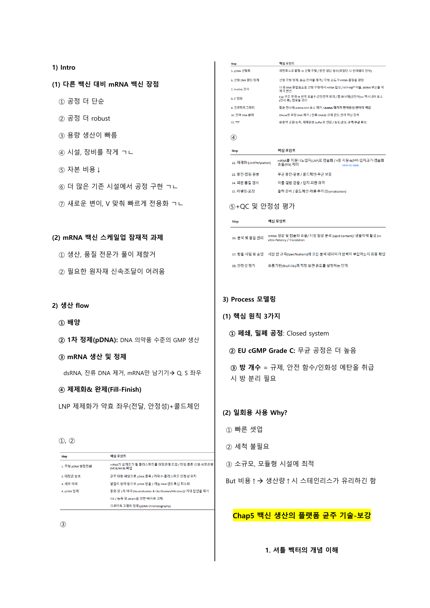
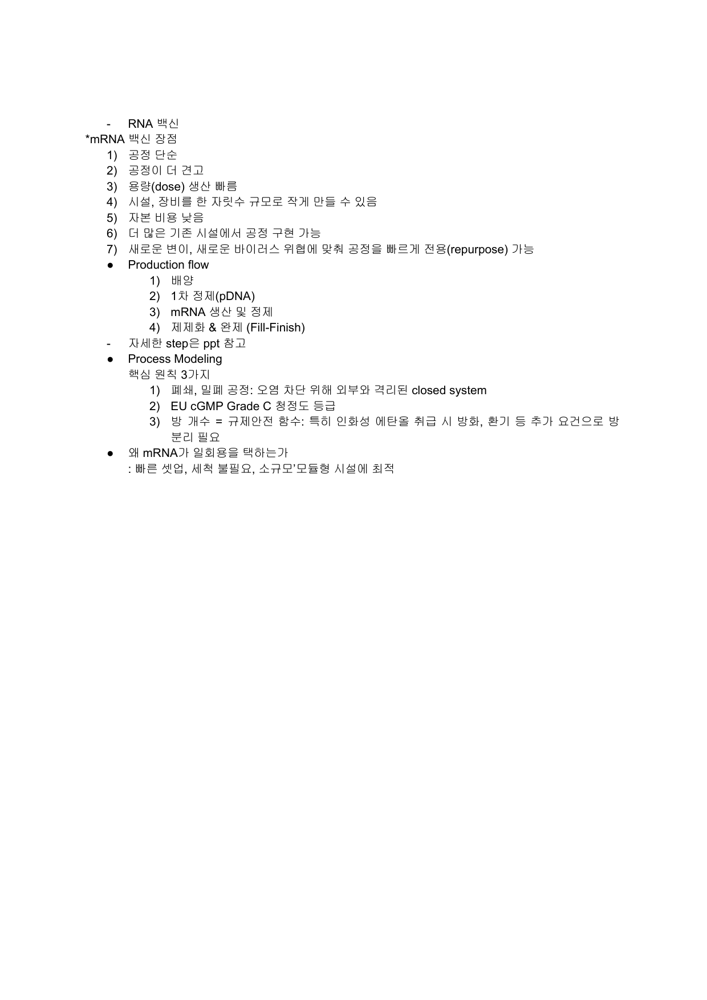
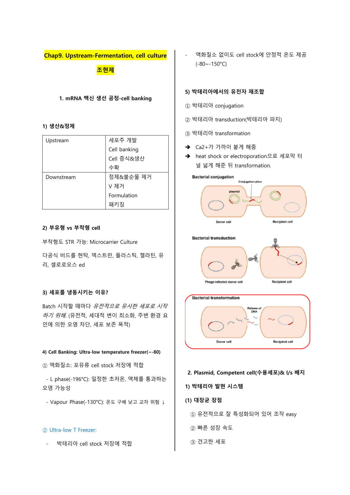
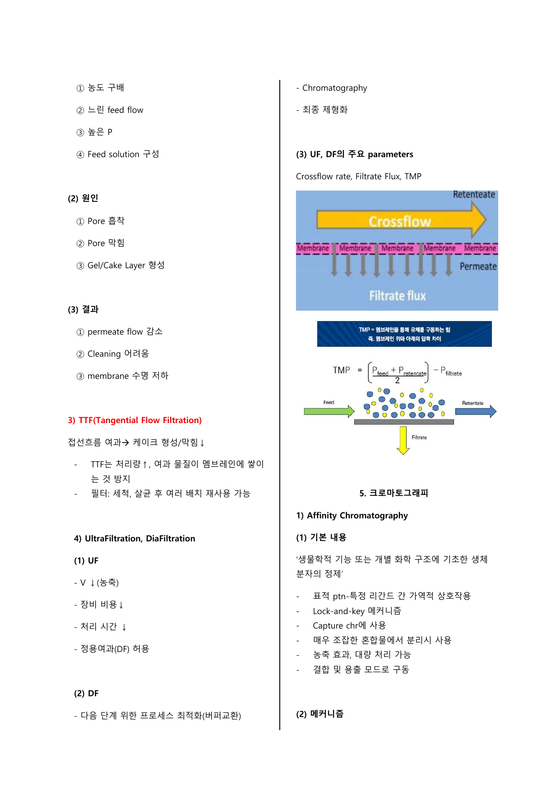
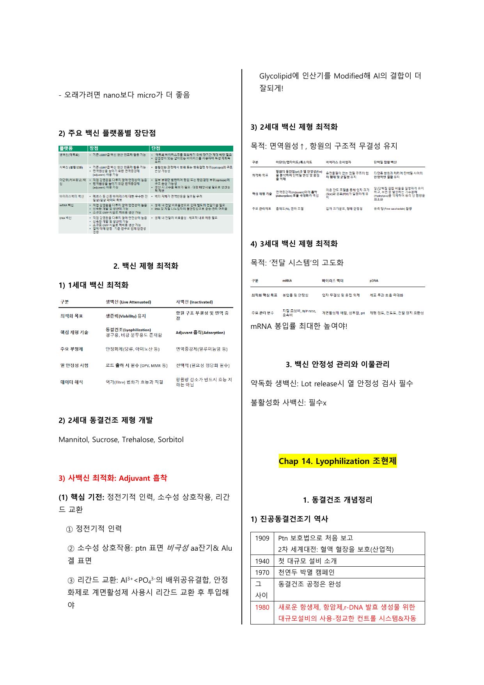

# 문제
mRNA 분자의 일반적인 5가지 구조 요소와 각각의 시험 답안용 역할을 쓰시오. (출제 예고)

답:
· **5' cap**: exonuclease에 의한 mRNA 분해를 막고, mRNA 안정성 유지와 번역 시작을 활성화한다.
· **3' poly(A) tail**: exonuclease에 의한 degradation을 억제하고, mRNA 안정성과 번역 효율을 높인다.
· **protein-coding sequence**: 실제 항원 단백질을 암호화하는 구간이다.
· **5' UTR**: downstream ORF 서열의 번역에 관여하고 번역 효율을 높인다.
· **3' UTR**: mRNA 분해 속도, 번역 수명 주기, 안정성에 관여한다.

[배경설명]
mRNA 백신 설계는 단순히 ORF만 넣는 문제가 아니다.
자료는 5' cap, poly(A), UTR 설계가 ==mRNA 안정성==과 ==번역 효율==에 직접 연결된다고 정리한다.
시험 답안에서는 구조 이름만 나열하지 말고 각 구조가 분해 억제, 번역 시작, 번역 효율, 수명 조절 중 무엇을 담당하는지 같이 써야 한다.

출처: G:\내 드라이브\여형준님\21 6-1\백신공정이론\기말고사 정리자료\백신공정이론 기말고사 범위 수업자료.pdf p.092, p.356

# 문제
mRNA 백신에서 poly(A) tail과 UTR을 최적화해야 하는 이유를 설명하시오. (출제 예고)

답:
· **poly(A) tail**은 mRNA degradation을 억제하고 안정성을 높인다.
· mammalian cell 기준 mRNA의 poly(A) tail은 보통 **100-250개 A**이며, 자료는 최적 길이를 약 **120 bp**로 적는다.
· **5' UTR**은 번역 효율을 높인다.
· **3' UTR**은 mRNA 분해 속도와 번역 수명 주기, 안정성을 조절한다.

[배경설명]
poly(A) tail과 UTR은 항원을 직접 암호화하는 부분은 아니지만, mRNA가 세포 안에서 얼마나 오래 살아남고 얼마나 잘 번역되는지를 좌우한다.
그래서 mRNA 백신 설계 문제에서는 ==항원 서열==뿐 아니라 ==비번역 영역 최적화==도 답에 들어가야 한다.

출처: G:\내 드라이브\여형준님\21 6-1\백신공정이론\기말고사 정리자료\백신공정이론 기말고사 범위 수업자료.pdf p.092, p.342

# 문제
mRNA 분자 설계에서 핵심 고려사항 4가지를 쓰시오. (출제 예고)

답:
· **Codon optimization**
· **5' UTR, 3' UTR 설계**
· **면역 반응 조절**
· **전달 시스템**

[배경설명]
자료의 mRNA 설계 포인트는 단백질 코딩 서열만 바꾸는 것이 아니다.
코돈 최적화는 번역 효율과 연결되고, UTR은 안정성과 수명에 연결된다.
면역 반응 조절과 전달 시스템은 mRNA가 세포 안에서 효과적으로 작동하면서도 불필요한 반응을 줄이기 위한 축이다.

출처: G:\내 드라이브\여형준님\21 6-1\백신공정이론\기말고사 정리자료\백신공정이론 기말고사 범위 수업자료.pdf p.342

# 문제
Tangential Flow Filtration(TFF)의 원리와 장점을 설명하시오. (출제 예고)

답:
**TFF**는 접선 방향 흐름으로 여과해 케이크 형성이나 막힘을 줄이는 여과 방식이다.
처리량을 증가시키고, 여과 물질이 멤브레인에 쌓이는 것을 방지한다.
필터는 세척과 살균 후 여러 배치에 재사용할 수 있다.

[배경설명]
일반 여과에서 여과 물질이 막 표면에 계속 쌓이면 fouling과 cake layer가 생긴다.
TFF는 흐름이 막 표면을 쓸고 지나가므로 축적을 줄이고, downstream 공정에서 농축과 버퍼 교환 같은 작업을 안정적으로 수행하는 데 중요하다.

출처: G:\내 드라이브\여형준님\21 6-1\백신공정이론\기말고사 정리자료\백신공정이론 기말고사 범위 수업자료.pdf p.104, p.356

# 문제
Biomolecules and Charge에서 단백질, 바이러스 입자·내독소, DNA·RNA의 전하 특징과 정제 원리를 설명하시오. (출제 예고)

답:
· 단백질: **양전하 또는 음전하**
· 바이러스 입자와 내독소: 주로 **음전하**
· DNA와 RNA: **강한 음전하**
· 단백질 전체 전하는 **pH**에 따라 결정된다.
· 전하 차이를 이용해 생체분자와 단백질 혼합물을 분리하여 바이오의약품을 정제할 수 있다.

[배경설명]
이 문항은 전하 표를 외우는 문제에 그치지 않는다.
전하가 다른 물질을 분리할 수 있다는 점이 downstream chromatography와 연결된다.
특히 핵산은 강한 음전하라는 점, 단백질은 pH에 따라 순전하가 바뀐다는 점이 구분 포인트다.

출처: G:\내 드라이브\여형준님\21 6-1\백신공정이론\기말고사 정리자료\백신공정이론 기말고사 범위 수업자료.pdf p.119, p.356

# 문제
이온교환 크로마토그래피에서 pH와 pI 관계에 따른 단백질 전하와 결합 대상을 설명하시오. (출제 예고)

답:
· **pH>pI**: 단백질은 음전하를 띠고, 양전하를 띤 **음이온 교환기**에 결합한다.
· **pH<pI**: 단백질은 양전하를 띠고, 음전하를 띤 **양이온 교환기**에 결합한다.
· **pH=pI**: net charge가 0에 가까워진다.

[배경설명]
자료는 등전점을 단백질 전하가 0이 되는 pH로 설명한다.
시험에서는 "음이온 교환기"라는 이름 때문에 헷갈리기 쉽다.
자료 기준으로 pH>pI인 단백질은 음전하 상태이고, 그 반대 전하를 가진 교환기에 붙는다고 정리한다.

출처: G:\내 드라이브\여형준님\21 6-1\백신공정이론\기말고사 정리자료\백신공정이론 기말고사 범위 수업자료.pdf p.344

# 문제
Plasmid vector와 shuttle vector의 구조적 차이를 설명하시오. (출제 예고)

답:
Plasmid vector는 주로 박테리아 같은 단일 숙주에서 복제되고 작동하도록 설계된 원형 DNA 기반 운반체이다.
Shuttle vector는 대장균과 효모, 대장균과 동물세포처럼 서로 다른 두 종류 이상의 숙주에서 복제되고 생존할 수 있도록 만든 특수 plasmid vector이다.
구조적으로 shuttle vector는 두 숙주 모두에서 살아남아야 하므로 일반 plasmid vector보다 **복제 원점(origin of replication)**과 **선별 마커(selection marker)**를 각각 두 종류씩 갖는다.
자료는 shuttle vector가 **origin of transfer**도 가진다고 정리한다.

[배경설명]
PDF 필기에서 직접 물어본다고 표시된 페이지다.
답안의 중심은 "왕복 가능"이라는 표현보다 ==두 숙주에서 작동하기 위한 구조 요소가 더 필요하다==는 점이다.
따라서 bacterial ori, yeast ori, bacterial selection marker, yeast selection marker, origin of transfer를 구조 차이로 연결해야 한다.

출처: G:\내 드라이브\여형준님\21 6-1\백신공정이론\기말고사 정리자료\백신공정이론 기말고사 범위 수업자료.pdf p.193, p.353, p.361

# 문제
PTM(Post-Translational Modification)이 백신 항원 생산에서 중요한 이유와 자료에 제시된 PTM 예시를 쓰시오. (출제 예고)

답:
PTM은 번역 후 단백질의 구조와 기능을 바꾸는 과정이다.
항체는 단백질 서열만이 아니라 glycosylation된 구조까지 함께 인식할 수 있으므로, host cell에서 뽑아낸 단백질의 PTM 상태가 자연스러운 항원 구조와 달라질 수 있다.
바이러스 target처럼 자연스러운 구조 인식이 중요하면 진핵 host 사용이 필요할 수 있다.

자료의 PTM 예시:
· **Glycosylation**
· **Disulfide bond**
· **Ubiquitination**
· **O-phosphorylation**
· **N-methylation**
· **N-acetylation**
· **Proteolytic cleavage**

[배경설명]
PDF 필기에서 직접 질문으로 표시된 페이지다.
답안은 PTM 이름만 외우기보다, 항체가 실제로 인식하는 항원 구조와 host cell 생산 단백질의 차이를 설명해야 한다.
자료는 disulfide bond와 glycosylation을 특히 예시로 적는다.

출처: G:\내 드라이브\여형준님\21 6-1\백신공정이론\기말고사 정리자료\백신공정이론 기말고사 범위 수업자료.pdf p.195, p.353, p.361

# 문제
Recombinant protein production에서 P. pastoris가 다른 미생물 대비 유리한 점과 AOX1 promoter를 이용한 생산 원리를 설명하시오. (출제 예고)

답:
P. pastoris는 S. cerevisiae보다 mannose chain 길이가 훨씬 짧아 면역반응 유발이 적다.
Human-like glycosylation으로 유전공학적 개량이 용이하다.
진핵 고유의 PTM을 통해 folding, disulfide bond, N-glycosylation, O-glycosylation과 연결된다.
메탄올을 유일한 탄소원·에너지원으로 사용할 수 있고, 메탄올 대사를 위해 AOX1 효소를 강하게 만든다.
**AOX1 promoter** 뒤에 target gene을 넣고 methanol을 투입하면 target protein 대량 생산을 유도할 수 있다.

[배경설명]
PDF 필기에서 직접 질문으로 표시된 페이지다.
P. pastoris 문제는 "효모라서 좋다"가 아니라 면역반응 감소, human-like glycosylation engineering, methanol-AOX1 inducible expression을 묶어 써야 한다.

출처: G:\내 드라이브\여형준님\21 6-1\백신공정이론\기말고사 정리자료\백신공정이론 기말고사 범위 수업자료.pdf p.201, p.353, p.361

# 문제
P. pastoris용 pPICZ 계열 plasmid 구조에서 AOX1 promoter, MCS, tag, Zeocin, pUC ori, Bgl II의 역할을 설명하시오. (출제 예고)

답:
· **5' AOX1 promoter**: 목적 단백질 유전자의 transcription을 유도하는 강력한 promoter이며, methanol 존재 시 활성화된다.
· **MCS**: 외래 유전자를 잘라 붙이는 제한효소 인지 부위가 모인 구간이다.
· **c-myc epitope**: 단백질 발현 여부를 western blot 등으로 검출할 수 있게 돕는 tag이다.
· **6xHis**: 단백질을 고순도로 쉽게 정제할 수 있게 하는 tag이다.
· **AOX1 TT**: AOX1 transcription termination sequence로, 전사를 효율적으로 끝맺고 mRNA 안정성에 기여한다.
· **P_TEF1, P_EM7**: Zeocin resistance gene 발현용 dual promoter이며, P_TEF1은 P. pastoris에서, P_EM7은 E. coli에서 작동한다.
· **Zeocin**: plasmid가 들어간 세포만 살아남게 하는 selection marker이다.
· **pUC ori**: E. coli 내 plasmid replication origin이며, 효모에 넣기 전 DNA를 대량 복제하고 추출하기 위해 필요하다.
· **Bgl II**: transformation 전 plasmid를 linearization하여 효모 genome의 AOX1 자리에 integration되는 효율을 높이는 데 사용한다.

[배경설명]
PDF 필기에서 왼쪽 plasmid 구조를 보라고 적힌 부분이다.
시험에서는 전체 지도처럼 위치를 묻기보다, 각 요소가 발현 유도, 삽입, 검출·정제, 선별, E. coli 증폭, 효모 integration 중 무엇을 담당하는지 묻기 쉽다.

출처: G:\내 드라이브\여형준님\21 6-1\백신공정이론\기말고사 정리자료\백신공정이론 기말고사 범위 수업자료.pdf p.354, p.362

# 문제
IVT(In Vitro Transcription)의 기본 흐름, T7 promoter가 선호되는 이유, 제한효소 말단 조건을 설명하시오.

답:
· IVT 흐름: **DNA 템플릿 준비 -> 전사 혼합물 준비 -> 전사 반응 -> 정제**
· 전사 혼합물: RNA polymerase, ribonucleotide, buffer, DNA template
· T7 promoter 선호 이유: **높은 RNA 합성 속도**, **낮은 오류율**, **전사 중단 감소**, **높은 promoter 감도**
· 제한효소 말단: blunt ends 또는 5' sticky ends가 적합하고, **3' sticky ends는 불량한 IVT 산물**을 만든다.

[배경설명]
IVT는 mRNA를 세포 밖에서 만드는 핵심 단계다.
자료는 T7 promoter의 생산성과 정확성, 제한효소 절단 말단의 품질 영향을 함께 적는다.
시험에서는 공정 순서와 품질 조건을 한 답안에 묶어 쓰는 것이 좋다.

출처: G:\내 드라이브\여형준님\21 6-1\백신공정이론\기말고사 정리자료\백신공정이론 기말고사 범위 수업자료.pdf p.342, p.356

# 문제
mRNA-LNP 구성 성분과 각 성분의 역할을 설명하시오.

답:
· **이온화 양이온성 지질**: 대표 예시는 Dlin-MC3-DMA, SM-102, ALC-0315이며 mRNA 전달의 핵심 지질이다.
· **인지질**: 포화 지방산은 LNP 구조체 안정화, 불포화 지방산은 엔도솜 불안정화에 연결된다.
· **콜레스테롤**: LNP 구조체 안정화와 엔도솜 불안정화에 기여한다.
· **PEG 지질 성분**: LNP 응집 억제와 식세포 작용 회피 목적이다.
· **활성 성분**: mRNA 같은 실제 약효 물질이다.

[배경설명]
LNP는 지질 껍질 하나가 아니라 여러 기능성 성분의 조합이다.
시험에서는 "LNP 구성성분"을 묻는 경우 이름만 나열하지 말고 안정화, 엔도솜 탈출, 응집 억제, 식세포 회피 역할까지 연결해야 한다.

출처: G:\내 드라이브\여형준님\21 6-1\백신공정이론\기말고사 정리자료\백신공정이론 기말고사 범위 수업자료.pdf p.345, p.357

# 문제
이온화 지질의 발전 방향과 LNP 형성에서 pH, ethanol 조건이 중요한 이유를 설명하시오.

답:
이온화 지질의 발전 방향은 **낮은 독성**과 **높은 엔도솜 탈출**이다.
LNP 제조에서는 ethanol에 있는 지질과 수용성 산성 buffer의 oligonucleotide가 mixing된다.
pH가 올라가고 ethanol이 줄어야 LNP가 형성된다.
pH 4-5에서는 자료 기준으로 LNP가 아니다.

[배경설명]
이온화 지질은 전달 효율과 독성 사이 균형을 맞추는 성분이다.
자료는 pH와 용매 polarity 조건을 LNP 형성과 연결한다.
따라서 "이온화 지질은 왜 중요한가"라는 질문에는 엔도솜 탈출과 독성을 함께 써야 한다.

출처: G:\내 드라이브\여형준님\21 6-1\백신공정이론\기말고사 정리자료\백신공정이론 기말고사 범위 수업자료.pdf p.345, p.357

# 문제
LNP 제조 공정에서 전통적 제조방법, 미세유체칩, 충돌 제트법의 특징을 비교하시오.

답:
· 전통적 제조방법: **박막수화법**, **ethanol 주입법**을 활용하며 리포좀 제조에 적합하다.
· 전통적 제조방법은 입자 크기와 입도 분포 조절을 위해 후처리가 필요하다.
· **미세유체칩**: single-use system 적용이 가능하다.
· **충돌 제트법**: 규모 증대용 공정으로 정리한다.

[배경설명]
LNP 제조 공정 비교는 장비 이름만 외우면 부족하다.
시험 답안에서는 전통적 방법이 리포좀 제조에 맞고 후처리가 필요하다는 점, 미세유체칩은 single-use, 충돌 제트법은 scale-up과 연결된다는 점을 구분해야 한다.

출처: G:\내 드라이브\여형준님\21 6-1\백신공정이론\기말고사 정리자료\백신공정이론 기말고사 범위 수업자료.pdf p.345, p.357

# 문제
mRNA-LNP preparation에서 완충액 교환 방법, CQA 항목, 봉입률 확인 방법, mRNA integrity 분석법을 정리하시오.

답:
· 완충액 교환: **Dialysis**, **SCC(Spin column concentration)**, **TFF**
· CQA: **Lipids**, **API**, **Nanoparticle**, **Stability**, **Release**
· 봉입률 확인: **Ribogreen assay**로 LNP 안에 RNA가 얼마나 안정적으로 캡슐화되었는지 확인한다.
· mRNA integrity 분석: capillary electrophoresis, chromatography 등을 사용한다.
· chromatography는 **retention time**, capillary electrophoresis는 **migration time**을 본다.

[배경설명]
LNP preparation은 제조법만 묻지 않고 품질특성까지 연결될 수 있다.
CQA는 제품 품질을 좌우하는 성질이고, 봉입률은 RNA가 LNP 안에 들어갔는지 보는 지표다.
분석법 비교에서는 retention time과 migration time을 구분한다.

출처: G:\내 드라이브\여형준님\21 6-1\백신공정이론\기말고사 정리자료\백신공정이론 기말고사 범위 수업자료.pdf p.345, p.346, p.357

# 문제
mRNA 백신이 다른 백신 대비 가지는 공정상 장점과 생산 flow를 설명하시오.

답:
공정상 장점:
· 공정이 더 단순하다.
· 공정이 더 robust하다.
· dose 생산이 빠르다.
· 시설과 장비를 작게 만들 수 있다.
· 자본 비용이 낮다.
· 더 많은 기존 시설에서 공정 구현이 가능하다.
· 새로운 변이와 바이러스 위협에 맞춰 빠르게 전용화할 수 있다.

생산 flow:
· 배양
· 1차 정제(pDNA)
· mRNA 생산 및 정제
· 제제화와 완제(Fill-Finish)

[배경설명]
mRNA 백신의 장점은 빠른 생산과 facility flexibility에 있다.
생산 flow에서는 pDNA가 먼저 만들어지고, 그 뒤 mRNA 생산·정제와 LNP 제제화가 이어진다.
자료는 LNP 제제화가 약효와 전달, 안정성을 좌우한다고 적는다.

출처: G:\내 드라이브\여형준님\21 6-1\백신공정이론\기말고사 정리자료\백신공정이론 기말고사 범위 수업자료.pdf p.352, p.360

# 문제
mRNA 백신 process modeling의 핵심 원칙 3가지와 single-use system을 택하는 이유를 설명하시오.

답:
Process modeling 핵심 원칙:
· **폐쇄·밀폐 공정**으로 오염을 차단한다.
· **EU cGMP Grade C** 청정도 등급을 고려한다.
· 방 개수는 규제와 안전 함수이며, 특히 인화성 ethanol 취급 시 방화와 환기 요건 때문에 방 분리가 필요하다.

Single-use system 사용 이유:
· 빠른 셋업
· 세척 불필요
· 소규모·모듈형 시설에 최적

[배경설명]
mRNA 공정은 빠르게 전용화할 수 있어야 하고 오염 차단이 중요하다.
single-use는 세척 검증 부담을 줄이고 setup을 빠르게 하지만, 생산량이 커지면 stainless system이 비용상 유리할 수 있다고 자료는 덧붙인다.

출처: G:\내 드라이브\여형준님\21 6-1\백신공정이론\기말고사 정리자료\백신공정이론 기말고사 범위 수업자료.pdf p.352, p.360

# 문제
mRNA 백신 생산 공정에서 upstream과 downstream의 큰 흐름을 구분하시오.

답:
· **Upstream**: 세포주 개발, cell banking, cell 증식과 생산, 수확
· **Downstream**: 정제와 불순물 제거, 바이러스 제거, formulation, packaging

[배경설명]
Upstream은 만들고 키우는 구간이고, downstream은 분리·정제·제형화하는 구간이다.
자료는 mRNA 백신 생산 공정에서 cell banking부터 수확까지를 upstream, 정제와 formulation 이후를 downstream으로 정리한다.

출처: G:\내 드라이브\여형준님\21 6-1\백신공정이론\기말고사 정리자료\백신공정이론 기말고사 범위 수업자료.pdf p.339

# 문제
Membrane fouling의 영향 요인, 원인, 결과를 나누어 정리하시오.

답:
· 영향 요인: **농도 구배**, **느린 feed flow**, **높은 압력**, **feed solution 구성**
· 원인: **pore 흡착**, **pore 막힘**, **gel 또는 cake layer 형성**
· 결과: **permeate flow 감소**, **cleaning 어려움**, **membrane 수명 저하**

[배경설명]
Membrane fouling은 여과 성능이 떨어지는 원인을 묻는 문제로 나오기 쉽다.
답안은 "막힘" 한 단어보다, 어떤 조건이 fouling을 키우고 어떤 물리적 현상이 생기며 결과가 어떻게 나타나는지 단계별로 써야 안정적이다.

출처: G:\내 드라이브\여형준님\21 6-1\백신공정이론\기말고사 정리자료\백신공정이론 기말고사 범위 수업자료.pdf p.343, p.356

# 문제
Ultrafiltration(UF), Diafiltration(DF)의 목적과 UF/DF process 주요 parameter를 쓰시오.

답:
· **UF**: 제품의 부피를 줄여 **농축**한다.
· **DF**: 다음 단계에 맞게 **버퍼 교환**을 수행한다.
· 주요 parameter: **Crossflow rate**, **Filtrate flux**, **TMP(Transmembrane pressure)**

[배경설명]
UF와 DF는 둘 다 막 공정이지만 목표가 다르다.
UF는 농축, DF는 버퍼 교환으로 연결해 외우면 된다.
공정 조건 문제에서는 TMP만 쓰지 말고 crossflow rate와 filtrate flux도 같이 써야 한다.

출처: G:\내 드라이브\여형준님\21 6-1\백신공정이론\기말고사 정리자료\백신공정이론 기말고사 범위 수업자료.pdf p.343, p.356

# 문제
소수성 상호작용 크로마토그래피에서 염 농도와 단백질 용출의 관계를 설명하시오.

답:
단백질의 소수성이 높을수록 결합을 촉진하는 데 필요한 **염의 양은 낮아진다**.
컬럼 진행 전 단백질을 염으로 조절하고 pI 근처로 맞춘다.
용출 완충액의 **이온 강도를 낮추면 단백질이 용출**된다.

[배경설명]
소수성 상호작용 크로마토그래피는 pH와 전하만 보는 이온교환과 다르게, 단백질 표면의 소수성과 염 조건이 중요하다.
자료는 결합 촉진에 필요한 염의 양과 용출 시 이온 강도 감소를 함께 적는다.

출처: G:\내 드라이브\여형준님\21 6-1\백신공정이론\기말고사 정리자료\백신공정이론 기말고사 범위 수업자료.pdf p.344, p.356

# 문제
Downstream processing의 목적과 harvest 단계에서 depth filter를 쓰는 이유를 설명하시오.

답:
· 정제 목적: **불순물 제거**, **관심 단백질 정제**, **바이러스 비활성화와 제거**, **안전한 치료 용량을 위한 단백질 농축**, **단백질 구조 유지**
· Harvest 목적: 배양 배지에서 세포와 세포 잔해를 분리하고 단백질 구조적 완전성을 유지한다.
· Centrifuge는 입자 제거에 100% 효과적이지 않으므로, 빠져나간 세포나 물질을 잡기 위해 downstream에 **depth filter**를 둔다.

[배경설명]
Downstream은 단백질을 얻은 뒤 "깨끗하고 안전하며 충분한 농도"로 만드는 과정이다.
Harvest는 첫 분리 단계라 구조 손상과 잔류 입자 관리가 중요하다.
자료는 원심분리 뒤 depth filter를 배치하는 이유를 명확히 적는다.

출처: G:\내 드라이브\여형준님\21 6-1\백신공정이론\기말고사 정리자료\백신공정이론 기말고사 범위 수업자료.pdf p.356

# 문제
동결건조의 정의, 기본 cycle, 목적, 장점과 단점을 설명하시오.

답:
동결건조는 저온에서 **승화**를 사용하여 제형 또는 제품에서 수분을 제거하는 공정이다.
기본 cycle은 **냉동 -> 1차 건조(승화) -> 2차 건조(탈착)**이다.
목적은 용액 상태에서 안정성을 확보하기 어려운 시료의 안정성을 높이는 것이다.
장점은 장기 안정성 향상, 보관 수명 연장, 운송과 보관 용이성, 미생물 오염 위험 감소이다.
단점은 시간과 에너지 소모가 크고, 큰 단백질을 불안정하게 만들거나 스트레스를 줄 수 있으며, 공정이 복잡하다는 점이다.

[배경설명]
동결건조는 "얼린 뒤 말리는 공정"이지만 시험 답안은 승화와 탈착을 구분해야 한다.
자료는 안정성 향상이라는 목적과 시간·에너지·단백질 스트레스라는 한계를 함께 강조한다.

출처: G:\내 드라이브\여형준님\21 6-1\백신공정이론\기말고사 정리자료\백신공정이론 기말고사 범위 수업자료.pdf p.348, p.358

# 문제
동결건조에서 1차 건조와 2차 건조가 각각 왜 필요한지 비교하시오.

답:
· **1차 건조(Primary drying)**: 승화로 얼어 있는 **자유수(free ice)**를 제거한다.
· 1차 건조는 가장 오래 걸리며, 제품 내 대부분의 수분 약 **90-95%**를 제거한다.
· **2차 건조(Secondary drying)**: 탈착으로 단백질, 부형제 등에 강하게 결합한 **결합수**를 제거한다.
· 2차 건조는 온도와 진공도를 더 높여 잔류 수분을 제거하고, 최종 수분 함량을 **1-3%** 수준으로 낮춘다.

[배경설명]
1차 건조와 2차 건조의 차이는 제거하는 물의 형태다.
1차는 얼음이 액체를 거치지 않고 수증기로 가는 승화이고, 2차는 남아 있는 흡착 수분을 떼어내는 탈착이다.
시험에서는 free ice와 bound water를 구분하면 답이 안정적이다.

출처: G:\내 드라이브\여형준님\21 6-1\백신공정이론\기말고사 정리자료\백신공정이론 기말고사 범위 수업자료.pdf p.358

# 문제
동결건조에서 Te, Tg, Tc의 의미와 결정질 제형·무정형 제형의 차이를 설명하시오.

답:
· **Te 또는 공융 온도**: 결정 시스템에서 용액 성분이 얼거나 녹는 온도이며, 제품이 구조 손실 없이 1차 건조 중 견딜 수 있는 최대 온도 결정에 연결된다.
· **Tg 또는 유리 전이 온도**: 비정질 시스템에서 유리상과 관련된 기준 온도이다.
· **Tc 또는 붕괴 온도**: cake가 자체 무게를 지탱하지 못해 collapse가 일어나는 온도이며, 동결건조 현미경으로 측정한다.
· 결정질 제형: Te에서 응고되며, 물이 거의 남지 않아 2차 건조 시간이 짧아질 수 있지만 건조 중 부피 증가에 주의한다.
· 무정형 제형: 유리 같은 고점도 혼합물을 만들고, 물이 고정될 수 있어 더 긴 2차 건조가 필요하다.

[배경설명]
동결건조 조건은 임계 온도보다 너무 낮으면 시간이 낭비되고, 너무 높으면 cake 구조가 무너질 수 있다.
자료는 Te, Tg, Tc를 제품이 견딜 수 있는 온도 경계로 연결한다.

출처: G:\내 드라이브\여형준님\21 6-1\백신공정이론\기말고사 정리자료\백신공정이론 기말고사 범위 수업자료.pdf p.349, p.358

# 문제
동결 단계에서 핵형성과 freezing issue가 제품 품질에 영향을 주는 이유를 설명하시오.

답:
동결 단계에서는 얼음 핵 형성, 얼음 결정 성장, 용질 농축, 유리결정 형성, 용질 결정화, eutectics 형성이 일어난다.
핵형성에는 **균질 핵 형성**과 **불균일 핵 형성**이 있다.
얼음 핵 형성은 무작위로 일어나 각 vial마다 과냉각 정도와 동결 속도가 달라질 수 있다.
동결은 channel wall 두께와 pore size에 영향을 주어 재구성 속도에 영향을 준다.
얼음-물 경계면이 형성되는 동안 단백질 변성이 가능하다.

[배경설명]
동결건조 품질은 건조 단계에서만 결정되지 않는다.
동결 중 핵형성 방식과 얼음 결정 구조가 이후 승화 경로와 재구성 속도, 단백질 안정성에 영향을 준다.
자료는 controlled nucleation 방법으로 얼음 안개, 진동, 음파를 제시한다.

출처: G:\내 드라이브\여형준님\21 6-1\백신공정이론\기말고사 정리자료\백신공정이론 기말고사 범위 수업자료.pdf p.349, p.358

# 문제
동결건조 1차 건조 종결점을 Pirani gauge와 capacitance manometer, logger로 판단하는 원리를 설명하시오.

답:
· **Pirani gauge**는 챔버 내 수분이 있는 환경에서 압력을 정확히 측정하지 못해 높은 값을 보인다.
· **Capacitance manometer(CM)**는 챔버 내 수분이 있어도 압력 측정이 가능하다.
· 1차 건조 중 수분 제거가 진행되면 Pirani 압력이 정상 수치로 떨어지고, **Pirani 압력이 CM과 같아지는 시점**을 1차 건조 종결점으로 판단한다.
· logger는 1차 건조가 끝나 증발냉각 효과가 사라질 때 시료 온도 상승을 확인하는 방식으로 종결점을 본다.

[배경설명]
Pirani와 CM의 차이는 수분 존재 시 압력 측정 방식의 차이다.
1차 건조가 진행되면 수증기 영향이 줄어 Pirani와 CM 값이 가까워진다.
자료는 압력센서 비교와 초저온 logger를 PAT monitoring으로 묶는다.

출처: G:\내 드라이브\여형준님\21 6-1\백신공정이론\기말고사 정리자료\백신공정이론 기말고사 범위 수업자료.pdf p.350, p.358

# 문제
DNA 백신의 구조와 투여 후 항원 제시까지의 흐름을 설명하시오.

답:
DNA 백신은 박테리아 내 복제를 위한 영역과 동물세포에서 항원을 발현하기 위한 영역이 결합된 **플라스미드 형태**이다.
투여 후 세포핵으로 진입하고, 핵 안에서 mRNA로 전사된다.
mRNA는 세포질로 이동해 항원 단백질로 번역된다.
항원은 MHC 분자를 통해 면역 시스템에 제시된다.
효과는 세포성 면역뿐 아니라 선천 면역 활성화까지 연결된다.

[배경설명]
DNA 백신은 단백질을 직접 넣는 방식이 아니라, 세포가 항원을 만들도록 플라스미드 DNA를 넣는 방식이다.
그래서 핵 진입, 전사, 번역, MHC 제시 순서를 답안에 넣어야 한다.

출처: G:\내 드라이브\여형준님\21 6-1\백신공정이론\기말고사 정리자료\백신공정이론 기말고사 범위 수업자료.pdf p.350, p.359

# 문제
DNA 백신의 면역 활성화 경로에서 direct presentation과 cross presentation, MHC I·MHC II 결과를 설명하시오.

답:
· **Direct presentation**: APC가 직접 감염되어 항원을 생성하고 MHC I, MHC II에 제시한다.
· **Cross presentation**: 일반 세포에 들어간 뒤 분비 또는 사망 시 나온 잔해를 APC가 섭취해 MHC I, MHC II에 제시한다.
· 항원을 획득한 dendritic cell은 림프절로 이동한다.
· **MHC I**은 CD8+ T cell 활성화와 세포성 면역에 연결된다.
· **MHC II**는 CD4+ T cell 활성화와 체액성 면역에 연결된다.

[배경설명]
DNA 백신은 항원 단백질을 만든 뒤 APC가 어떻게 항원을 제시하느냐가 중요하다.
자료는 APC 직접 감염 경로와 일반 세포를 통한 cross presentation을 나누어 적는다.
마지막 결과는 MHC I과 MHC II가 각각 어떤 T cell 반응으로 이어지는지로 정리한다.

출처: G:\내 드라이브\여형준님\21 6-1\백신공정이론\기말고사 정리자료\백신공정이론 기말고사 범위 수업자료.pdf p.350, p.359

# 문제
DNA 백신의 분자적 메커니즘에서 항원 발현, 선천 면역 센서, 자체 면역증강 효과를 설명하시오.

답:
· 항원 발현: pDNA가 세포 내 핵으로 들어가 항원 유전자가 전사·번역되고, 항원 단백질 발현이 증가해 적응 면역을 유도한다.
· 선천 면역 센서: **TLR9**은 endosome에서 CpG pattern을 감지하고, **STING**은 cGAS가 세포질 DNA를 감지해 만든 cGAMP와 연결되며, **AIM2**는 세포질 DNA 감지와 염증반응에 연결된다.
· 자체 면역증강 효과: RNA expression cassette와 backbone adjuvant가 면역원성 증가에 기여한다.

[배경설명]
DNA 백신은 항원만 만들고 끝나는 공정이 아니다.
DNA 자체가 선천 면역 센서를 자극하고, 그 결과 dendritic cell 성숙과 적응 면역 유도에 연결된다.
자료는 TLR9, STING, AIM2를 핵심 센서로 제시한다.

출처: G:\내 드라이브\여형준님\21 6-1\백신공정이론\기말고사 정리자료\백신공정이론 기말고사 범위 수업자료.pdf p.351, p.359

# 문제
DNA 백신의 장점과 단점을 시험 답안 형태로 정리하시오.

답:
장점:
· 저렴하고 신속하며 확장 가능한 생산
· 빠르고 유연한 연구개발
· 천연 형태에 가까운 항원 발현
· 세포성 면역과 체액성 면역 동시 유도
· 상온 안정성
· 손쉬운 면역증강 설계
· 기존 면역에 의한 방해 없음

단점:
· 빠른 분해와 낮은 세포 흡수
· 다중 생물학적 장벽
· 핵 도달 후에도 낮은 항원 발현
· 면역 관용 유발 가능성

[배경설명]
DNA 백신은 생산과 안정성 측면에서 장점이 크지만, 세포 안으로 들어가 핵까지 도달해야 하는 전달 장벽이 있다.
단점은 "DNA라 위험하다"처럼 일반화하지 말고, 자료의 표현대로 분해, 세포 흡수, 생물학적 장벽, 핵 도달 후 발현 저하로 정리한다.

출처: G:\내 드라이브\여형준님\21 6-1\백신공정이론\기말고사 정리자료\백신공정이론 기말고사 범위 수업자료.pdf p.351, p.359

# 문제
백신 세대를 1세대, 2세대, 3세대로 분류하고, 면역증강제의 두 범주를 설명하시오.

답:
· 1세대: **생백신(약독화)**, **사백신(불활성화)**
· 2세대: **아단위 백신**, **펩타이드 백신**, **톡소이드 백신**, **다당류 및 단백접합 백신**, **바이러스 유사입자**
· 3세대: **바이러스 벡터 백신**, **mRNA 백신**, **DNA 백신**
· 비TLR 리간드성 면역증강제: 항원 전달, 면역세포 활성화, 사이토카인 유도, 느린 항원 방출을 통한 지속적 항원 제시와 연결된다.
· TLR 리간드성 면역증강제: 선천성 면역 활성화와 후천성 면역 유도에 연결된다.

[배경설명]
백신 분류는 플랫폼 세대와 면역증강제 역할이 같이 나올 수 있다.
사백신과 아단위 백신은 보조제 조합이 중요하고, 3세대 백신은 유전물질 또는 벡터 전달 시스템이 핵심이다.

출처: G:\내 드라이브\여형준님\21 6-1\백신공정이론\기말고사 정리자료\백신공정이론 기말고사 범위 수업자료.pdf p.346, p.357

# 문제
백신 제형 최적화에서 생백신, 사백신, 3세대 백신의 핵심 포인트를 각각 설명하시오.

답:
· 생백신: **동결건조**가 중요하며 보호제는 mannitol, sucrose, trehalose, sorbitol이다.
· 사백신: adjuvant 흡착 기전이 중요하며 핵심 기전은 **정전기적 인력**, **소수성 상호작용**, **리간드 교환**이다.
· 3세대 백신: 전달 시스템의 고도화가 목적이며, mRNA 백신은 **봉입률을 높이는 것**이 중요하다.

[배경설명]
제형 최적화는 백신 세대마다 목표가 다르다.
생백신은 안정성 유지 때문에 동결건조가 중요하고, 사백신은 항원과 adjuvant의 흡착이 중요하다.
3세대 백신은 핵산이나 벡터가 실제 표적에 도달해야 하므로 전달 시스템이 중심이다.

출처: G:\내 드라이브\여형준님\21 6-1\백신공정이론\기말고사 정리자료\백신공정이론 기말고사 범위 수업자료.pdf p.347, p.357

# 문제
대장균 발현 시스템의 장점과 단점을 정리하시오.

답:
장점:
· 유전적으로 잘 특성화되어 있어 조작이 쉽다.
· 성장 속도가 빠르다.
· 세포가 견고하다.
· 배지 요구성이 낮다.
· 비용이 적다.

단점:
· 플라스미드 손실
· 유전자 발현 누출
· 생산 독성

[배경설명]
대장균은 빠르고 싸게 증식시키기 좋은 숙주지만, 플라스미드 안정성과 발현 제어 문제가 있다.
시험 답안에서는 "빠르고 싸다"만 쓰지 말고 plasmid loss와 expression leakage, production toxicity를 같이 써야 한다.

출처: G:\내 드라이브\여형준님\21 6-1\백신공정이론\기말고사 정리자료\백신공정이론 기말고사 범위 수업자료.pdf p.340, p.355

# 문제
목표 유전자 대량 추출용 competent cell과 목표 단백질 대량 생산용 competent cell을 구분하고, recA와 BL21(DE3)의 의미를 설명하시오.

답:
· 목표 유전자 대량 추출용: **recA- 균주**인 DH5α, DH10B, HB101, XL1-blue 등을 사용한다.
· recA는 유사 염기서열을 인식하고 재조합시키는 효소이다.
· recA+ 균주는 만들려던 plasmid와 다른 종류의 plasmid가 생길 수 있다.
· 목표 단백질 대량 생산용: **BL21(DE3)**, BL21 CodonPlus 등을 사용한다.
· BL21(DE3)는 전사 시작에 관여하는 inducible promoter가 있고, 과발현 단백질이 degradation되지 않도록 주요 protease가 mutation되어 있다.

[배경설명]
Plasmid prep 목적과 protein expression 목적은 균주 선택 기준이 다르다.
유전자 대량 추출은 재조합으로 plasmid가 바뀌지 않는 안정성이 중요하고, 단백질 생산은 발현 유도와 protease 감소가 중요하다.

출처: G:\내 드라이브\여형준님\21 6-1\백신공정이론\기말고사 정리자료\백신공정이론 기말고사 범위 수업자료.pdf p.340, p.355

# 문제
Competent cell에서 Ca2+, Mg2+, 낮은 온도, heat shock 또는 electroporation이 DNA 유입에 어떻게 기여하는지 설명하시오.

답:
대장균 세포막과 DNA는 일반적으로 음전하를 띠어 서로 반발한다.
**Ca2+**, **Mg2+** 같은 양전하 이온은 이 반발을 중화한다.
낮은 온도는 세포막 유동성을 낮추고, 양전하 이온이 세포막 주변에 고르게 분포하도록 돕는다.
DNA 벡터는 양이온 덕분에 세포막 표면 가까이 위치할 수 있다.
이후 heat shock 또는 electroporation으로 세포막 구조에 파동을 일으켜 DNA가 세포 안으로 들어간다.

[배경설명]
Competent cell은 DNA가 들어가기 쉬운 상태로 만든 세포이다.
답안은 "Ca2+ 처리 후 heat shock"만 쓰기보다, 음전하 반발 중화와 세포막 유입 과정을 함께 설명해야 한다.

출처: G:\내 드라이브\여형준님\21 6-1\백신공정이론\기말고사 정리자료\백신공정이론 기말고사 범위 수업자료.pdf p.340, p.355

# 문제
Transformation과 transfection을 구분하고, transfection 방법 3가지를 설명하시오.

답:
· **Transformation**: 외부 DNA를 박테리아 숙주세포에 넣어 새로운 유전형질을 갖게 하는 과정이다.
· 자료 기준 transformation은 heat shock, electroporation 같은 물리적 방법으로 bacteria에 직접 넣는 것으로 정리한다.
· **Transfection**: 동물세포에 유전물질을 넣는 과정이다.
· 화학적 transfection: 음전하 핵산을 양전하로 바꾸거나 중화하는 운반체를 사용한다. 예시는 Lipofectamine, PEI이다.
· 생물학적 transfection: non-viral 유전자를 전달하도록 만든 유전자 조작 virus를 이용한다.
· 물리적 transfection: 핵산을 세포질이나 핵 안으로 직접 전달한다. 예시는 electroporation이다.

[배경설명]
Transformation과 transfection은 모두 외부 유전물질 도입이지만 대상 세포와 방법 구분이 중요하다.
시험에서는 박테리아와 동물세포를 먼저 나누고, transfection 방법을 화학·생물·물리로 정리하면 된다.

출처: G:\내 드라이브\여형준님\21 6-1\백신공정이론\기말고사 정리자료\백신공정이론 기말고사 범위 수업자료.pdf p.340, p.355

# 문제
세포를 냉동 보존하는 이유와 ultra-low temperature freezer, 액화질소 보관의 차이를 설명하시오.

답:
세포를 냉동시키는 이유:
· batch 시작 때마다 유전적으로 유사한 세포로 시작하기 위해
· 유전적·세대적 변이를 최소화하기 위해
· 주변 환경에 의한 오염을 차단하기 위해
· 세포를 보존하기 위해

보관 방식:
· 액화질소는 포유류 cell stock 저장에 적합하다.
· 액화질소 liquid phase는 일정한 초저온을 제공하지만 액체를 통한 오염 가능성이 있다.
· vapor phase는 온도 구배가 낮고 교차 오염 위험을 줄인다.
· ultra-low temperature freezer는 bacterial stock 저장에 적합하며 액화질소 없이도 약 -80~-150°C 안정적 온도를 제공한다.

[배경설명]
Cell banking은 매 batch마다 출발 세포의 유전적 상태를 일정하게 유지하기 위한 공정이다.
보관 방식은 세포 종류와 오염 위험, 온도 안정성을 기준으로 구분한다.

출처: G:\내 드라이브\여형준님\21 6-1\백신공정이론\기말고사 정리자료\백신공정이론 기말고사 범위 수업자료.pdf p.339, p.355

# 문제
실험용 배양기 조건에서 온도, pH, DO, agitation이 공정에 미치는 의미를 설명하시오.

답:
· 온도: 저온에서는 DO와 대사율이 낮아지고 생산성이 올라갈 수 있지만, 유체역학적 저항성이 증가한다.
· pH: CO2, O2, NaHCO3, Na2CO3, NaOH 공급과 연결된다.
· CO2 제거: sparging과 surface aeration을 이용한다.
· DO: sparger를 이용한다.
· agitation: 공기에서 액체배지로의 O2 전달, 배지에서 세포로의 O2·영양분 전달, 세포에서 배지로의 생성물 전달, 열 전달 효율, 세포 응집 방지에 기여한다.
· scale-up을 위해 impeller 종류, 개수, 회전수, 에너지, 응력을 정량화해야 한다.

[배경설명]
배양기는 단순 용기가 아니라 pH, DO, mixing, 열전달을 제어하는 장치이다.
Agitation은 잘 섞는 기능만이 아니라 산소 전달, 영양분 전달, 생성물 이동, 응집 방지까지 연결된다.

출처: G:\내 드라이브\여형준님\21 6-1\백신공정이론\기말고사 정리자료\백신공정이론 기말고사 범위 수업자료.pdf p.341

