# 문제

리놀레산과 리놀렌산을 동일하게 100g을 부패시켰다. 변질되는 동안 다음 값들에 대한 설명으로 옳지 않은 것은?

값의 의미:
- A: Linoleic acid(18:2)의 요오드가
- B: Linolenic acid(18:3)의 요오드가
- C, D: 각각 Linoleic acid와 Linolenic acid의 산가
- F: Linolenic acid의 과산화물가
- G, I: 각각 Linoleic acid의 카보닐가와 TBA 시험가

- A가 B보다 크다
- C와 D는 시간이 지남에 따라 증가한다
- F는 시간이 지남에 따라 증가하다가 결국에는 감소한다
- 비타민 E를 넣어주면 Linoleic acid의 요오드가는 유지된다
- G와 I는 양의 상관관계를 가진다

답: 아래 표시 보기
O C와 D는 시간이 지남에 따라 증가한다 // 산가는 산패 진행 시 상승하는 지표라 두 지방산 모두 시간이 지나면 증가한다.
O F는 시간이 지남에 따라 증가하다가 결국에는 감소한다 // 과산화물가는 초기 산화에서 증가하지만 이후 carbonyl 화합물로 분해되어 감소한다.
O 비타민 E를 넣어주면 Linoleic acid의 요오드가는 유지된다 // 비타민 E는 산화를 억제해 Linoleic acid의 불포화도 감소를 늦춘다.
O G와 I는 양의 상관관계를 가진다 // carbonyl가와 TBA 시험가는 모두 산패 생성물 증가를 반영해 같이 증가하는 방향이다.
X A가 B보다 크다 -> Linolenic acid(18:3)가 Linoleic acid(18:2)보다 불포화도가 높으므로 **B > A**이다. 요오드가는 불포화도 지표라 18:3인 B가 더 크다.
출처: G:\내 드라이브\여형준님\21 6-1\예방약학\기말고사 정리자료\2023년 1학기 예방약학 기말고사_심재인.pdf p.1 + G:\내 드라이브\여형준님\21 6-1\예방약학\기말고사 정리자료\예방약학 기말고사 범위 수업자료.pdf p.497
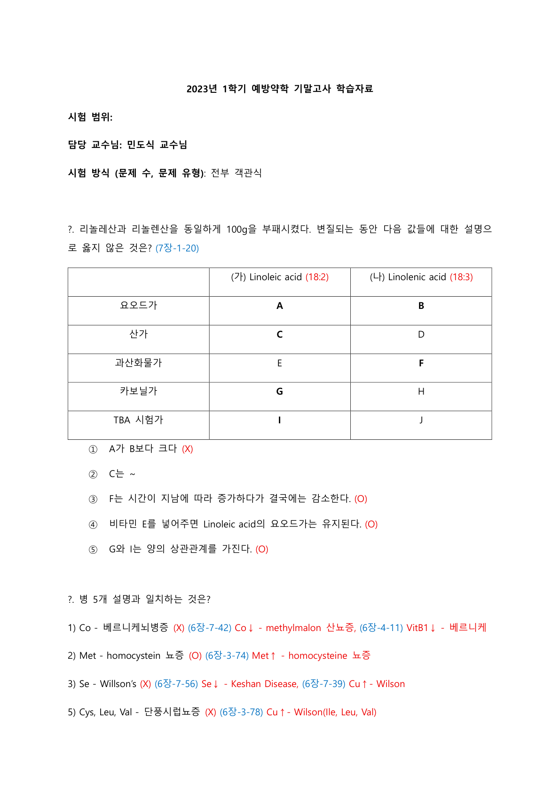
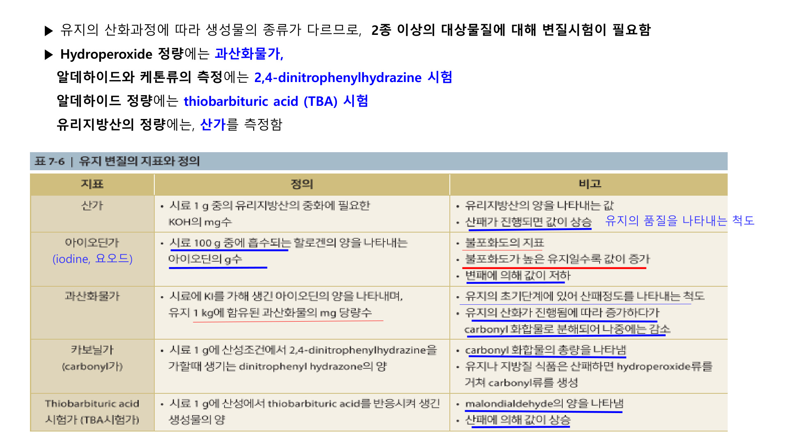

# 문제

질환 또는 결핍증의 연결로 일치하는 것은?

- Co - 베르니케뇌병증
- Met - homocysteine 뇨증
- Se - Wilson's disease
- Zn - Keshan disease
- Cys, Leu, Val - 단풍시럽뇨증

답: 아래 표시 보기
O Met - homocysteine 뇨증 // Methionine 대사가 막히면 homocysteine이 축적되어 소변으로 나온다.
X Co - 베르니케뇌병증 -> Co 결핍은 **methylmalonic aciduria**와 연결되고, 베르니케뇌병증은 **thiamine(B1) 결핍**과 연결된다. Co는 B12 쪽, 베르니케는 B1 쪽으로 나눠 외운다.
X Se - Wilson's disease -> Se 결핍은 **Keshan disease**와 연결되고, Wilson's disease는 **Cu 과잉**과 연결된다. Se와 Cu 질환명을 서로 바꿔 놓은 보기이다.
X Zn - Keshan disease -> Keshan disease는 **Se 결핍**과 연결된다. Keshan은 Zn이 아니라 Se 결핍 대표 질환이다.
X Cys, Leu, Val - 단풍시럽뇨증 -> 단풍시럽뇨증은 ==Ile, Leu, Val== 대사이상과 연결된다. 가지사슬아미노산 3개를 묶어 잡는다.
출처: G:\내 드라이브\여형준님\21 6-1\예방약학\기말고사 정리자료\2023년 1학기 예방약학 기말고사_심재인.pdf p.1 + G:\내 드라이브\여형준님\21 6-1\예방약학\기말고사 정리자료\예방약학 기말고사 범위 수업자료.pdf p.176, p.346, p.350, p.363

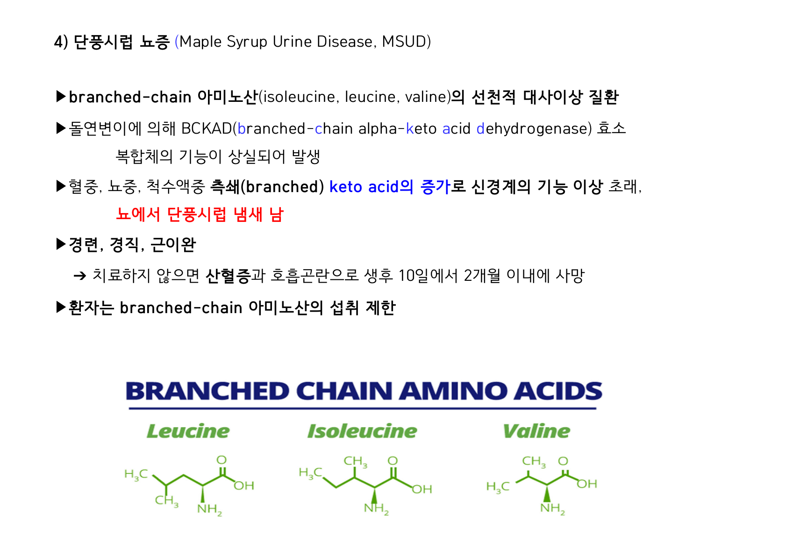
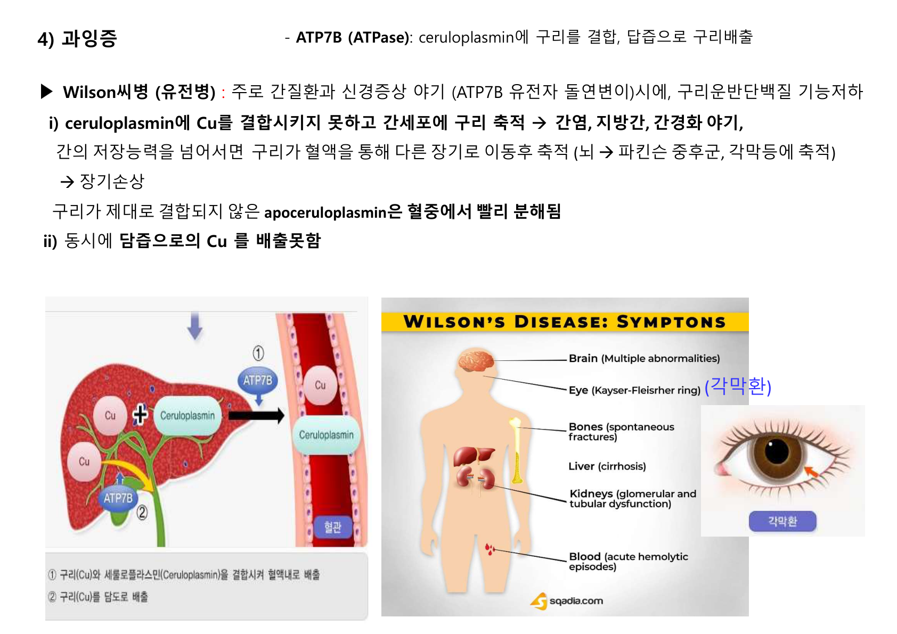
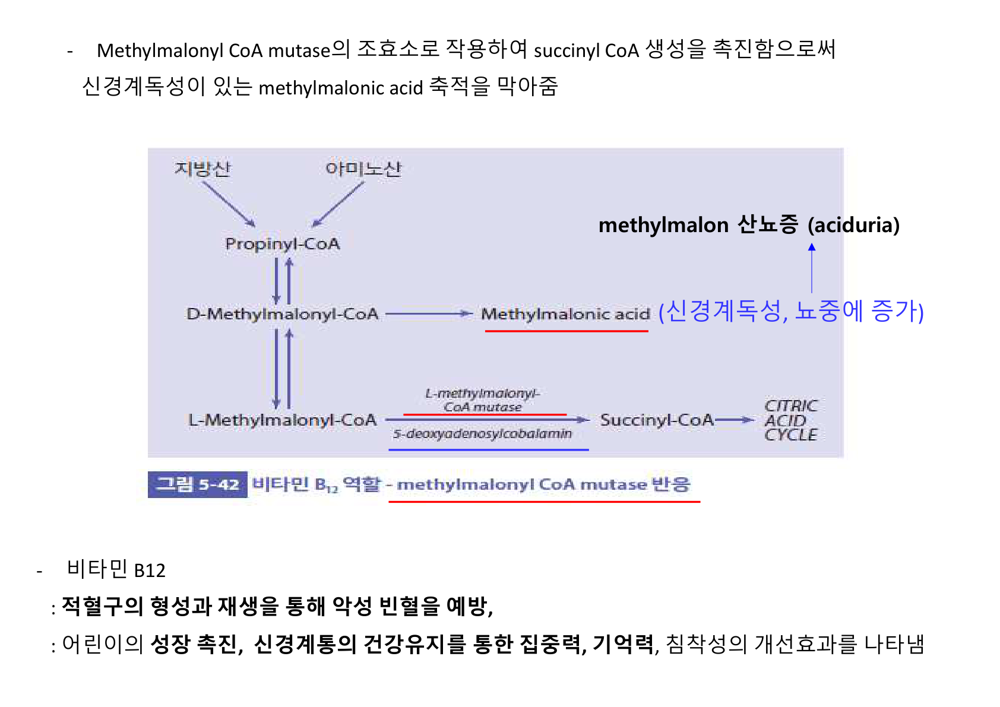
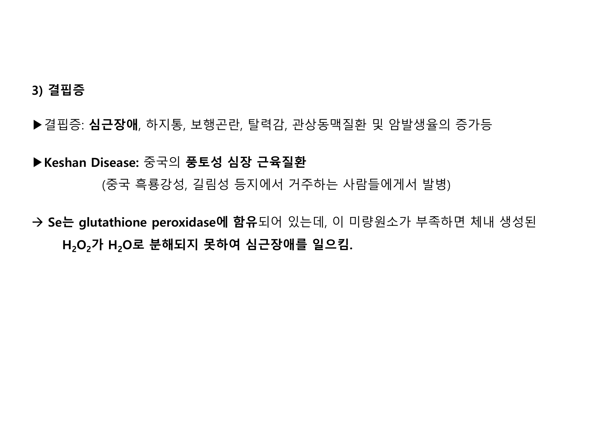

# 문제

다음은 Ca, P, Mg 등의 여러 무기질과 PTH, vitamin D의 관계에 관한 설명이다. 다음 중 옳지 않은 것은?

- 칼슘은 체내에서 가장 많이 존재하는 미네랄로, 부갑상선호르몬(PTH)은 혈중칼슘농도를 증가시키는 역할을 한다
- Vitamin D가 결핍되면 소장에서 칼슘과 인의 흡수가 줄어들고, 신장에서는 칼슘과 인산의 재흡수가 감소하여 결과적으로 골다공증을 유발할 수 있다
- 인의 섭취가 적을 경우, 혈중 칼슘농도는 증가하고 혈중 PTH의 농도는 감소하여 신장에서의 인 배설을 감소시켜 혈중 인농도를 정상으로 유지하고자 한다
- 고인산 식이로 혈중 인농도가 증가하면, 신장에서 칼시트리올의 생성이 증가하여 혈중 인 농도를 감소시킨다
- 혈청중의 Mg 이온은 어느 정도 Ca 이온과 반비례적으로 변동하여 Ca 이온이 증가하면 Mg 이온의 농도는 감소한다

답: 아래 표시 보기
O 칼슘은 체내에서 가장 많이 존재하는 미네랄로, 부갑상선호르몬(PTH)은 혈중칼슘농도를 증가시키는 역할을 한다 // PTH는 뼈ㆍ신장 쪽에서 혈중 Ca를 올리는 보상 호르몬으로 잡는다.
O Vitamin D가 결핍되면 소장에서 칼슘과 인의 흡수가 줄어들고, 신장에서는 칼슘과 인산의 재흡수가 감소하여 결과적으로 골다공증을 유발할 수 있다 // Vitamin D는 Ca/P 흡수와 재흡수를 받쳐서 뼈 무기질 유지에 필요하다.
O 인의 섭취가 적을 경우, 혈중 칼슘농도는 증가하고 혈중 PTH의 농도는 감소하여 신장에서의 인 배설을 감소시켜 혈중 인농도를 정상으로 유지하고자 한다 // 인이 부족하면 몸은 배설을 줄여 혈중 인을 보존하는 방향으로 움직인다.
O 혈청중의 Mg 이온은 어느 정도 Ca 이온과 반비례적으로 변동하여 Ca 이온이 증가하면 Mg 이온의 농도는 감소한다 // Ca와 Mg는 혈청에서 서로 반대 방향으로 변동하는 관계로 제시된다.
X 고인산 식이로 혈중 인농도가 증가하면, 신장에서 칼시트리올의 생성이 증가하여 혈중 인 농도를 감소시킨다 -> 고인산 식이에서는 **PTH 증가**, 신장 인 배설 **증가**, calcitriol 생성 ==감소==가 나타난다. 인이 많을 때는 흡수 촉진보다 배설 증가 쪽으로 조절된다.
출처: G:\내 드라이브\여형준님\21 6-1\예방약학\기말고사 정리자료\2023년 1학기 예방약학 기말고사_심재인.pdf p.2 + G:\내 드라이브\여형준님\21 6-1\예방약학\기말고사 정리자료\예방약학 기말고사 범위 수업자료.pdf p.324, p.325
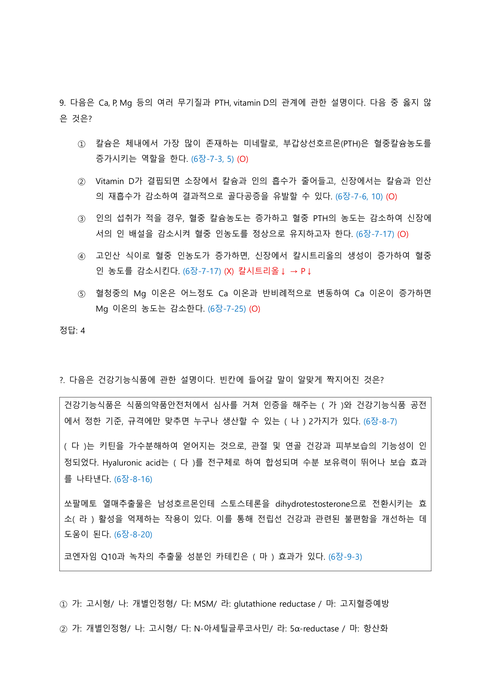
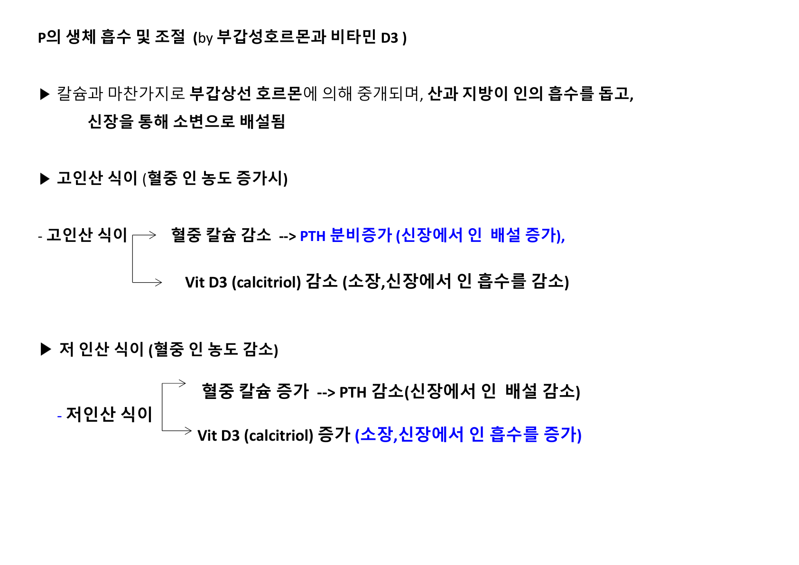
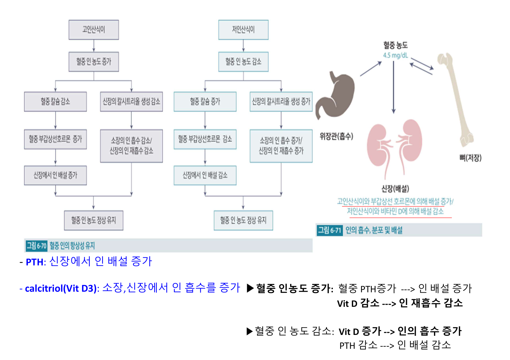

# 문제

다음은 건강기능식품에 관한 설명이다. 빈칸에 들어갈 말이 알맞게 짝지어진 것은?

건강기능식품은 식품의약품안전처에서 심사를 거쳐 인증을 해주는 (가)와 건강기능식품 공전에서 정한 기준, 규격에만 맞추면 누구나 생산할 수 있는 (나) 2가지가 있다.

(다)는 키틴을 가수분해하여 얻어지는 것으로, 관절 및 연골 건강과 피부보습의 기능성이 인정되었다. Hyaluronic acid는 (다)를 전구체로 하여 합성되며 수분 보유력이 뛰어나 보습 효과를 나타낸다.

쏘팔메토 열매추출물은 남성호르몬인 testosterone을 dihydrotestosterone으로 전환시키는 효소 (라) 활성을 억제하는 작용이 있다.

코엔자임 Q10과 녹차의 추출물 성분인 카테킨은 (마) 효과가 있다.

- 가: 고시형 / 나: 개별인정형 / 다: MSM / 라: glutathione reductase / 마: 고지혈증예방
- 가: 개별인정형 / 나: 고시형 / 다: N-아세틸글루코사민 / 라: 5α-reductase / 마: 항산화
- 가: 개별인정형 / 나: 고시형 / 다: N-아세틸글루코사민 / 라: glutathione reductase / 마: 항산화
- 가: 기능인정형 / 나: 고시형 / 다: N-아세틸글루코사민 / 라: 5α-reductase / 마: 항고혈압
- 가: 고시형 / 나: 기능인정형 / 다: MSM / 라: 5α-reductase / 마: 고지혈증예방

답: 아래 표시 보기
O 가: 개별인정형 / 나: 고시형 / 다: N-아세틸글루코사민 / 라: 5α-reductase / 마: 항산화 // 개별인정형은 심사 인증, 고시형은 공전 기준이고 NAGㆍ쏘팔메토ㆍCoQ10/카테킨 기능을 묶은 조합이다.
X 가: 고시형 / 나: 개별인정형 / 다: MSM / 라: glutathione reductase / 마: 고지혈증예방 -> 개별인정형 / 고시형 / N-아세틸글루코사민 / 5α-reductase / 항산화. 가/나 분류와 기능성 성분 대응을 한꺼번에 바꾼 조합이다.
X 가: 개별인정형 / 나: 고시형 / 다: N-아세틸글루코사민 / 라: glutathione reductase / 마: 항산화 -> 개별인정형 / 고시형 / N-아세틸글루코사민 / 5α-reductase / 항산화. 쏘팔메토 작용 효소는 glutathione reductase가 아니라 5α-reductase이다.
X 가: 기능인정형 / 나: 고시형 / 다: N-아세틸글루코사민 / 라: 5α-reductase / 마: 항고혈압 -> 개별인정형 / 고시형 / N-아세틸글루코사민 / 5α-reductase / 항산화. 기능인정형이라는 분류와 항고혈압 효과가 함정이다.
X 가: 고시형 / 나: 기능인정형 / 다: MSM / 라: 5α-reductase / 마: 고지혈증예방 -> 개별인정형 / 고시형 / N-아세틸글루코사민 / 5α-reductase / 항산화. MSM과 고지혈증예방을 넣어 NAG와 항산화 대응을 흐린 보기이다.
출처: G:\내 드라이브\여형준님\21 6-1\예방약학\기말고사 정리자료\2023년 1학기 예방약학 기말고사_심재인.pdf p.2-3 + G:\내 드라이브\여형준님\21 6-1\예방약학\기말고사 정리자료\예방약학 기말고사 범위 수업자료.pdf p.387, p.392, p.405

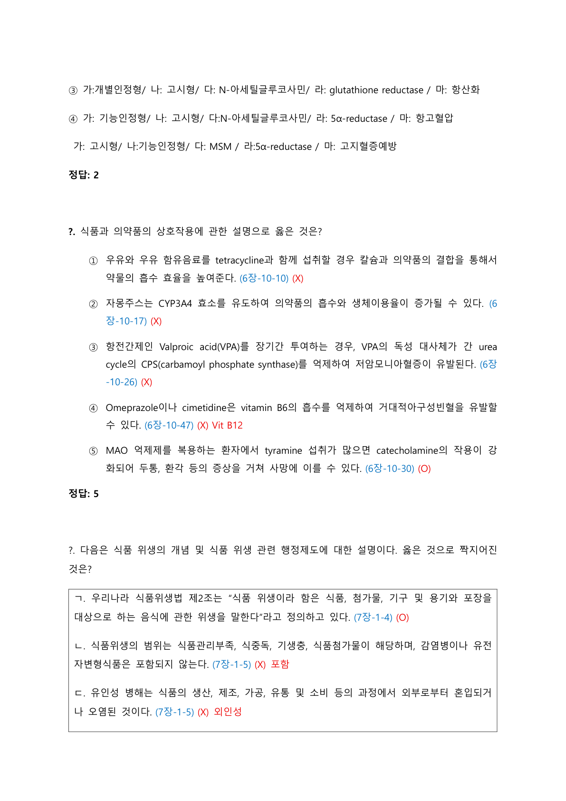
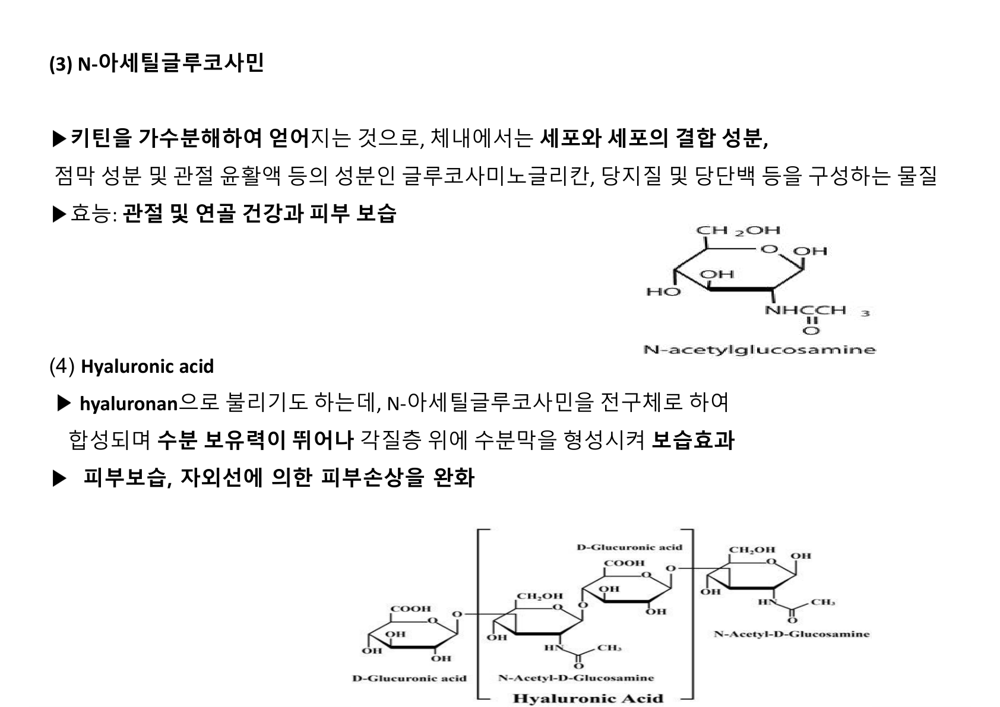
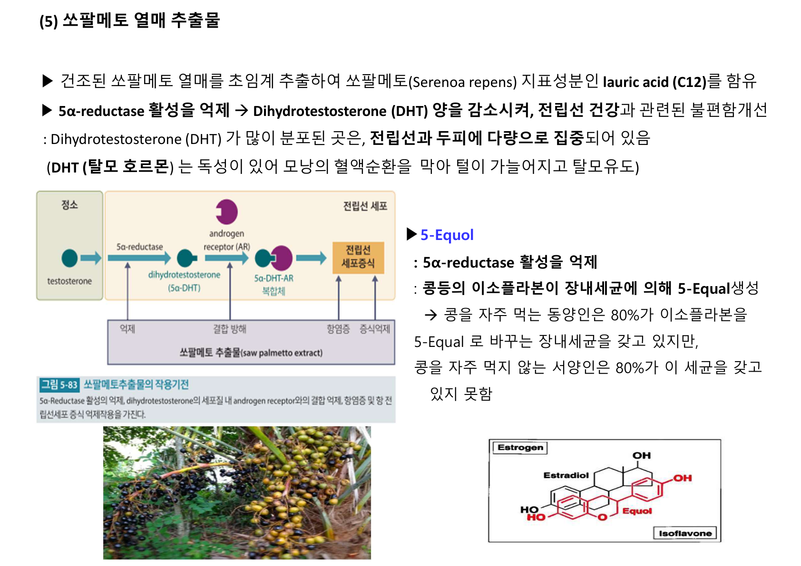
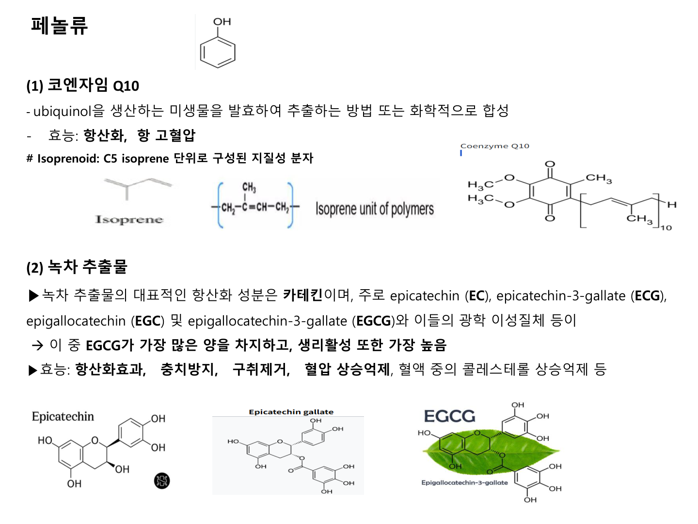

# 문제

식품과 의약품의 상호작용에 관한 설명으로 옳은 것은?

- 우유와 우유 함유음료를 tetracycline과 함께 섭취할 경우 칼슘과 의약품의 결합을 통해 약물의 흡수 효율을 높여준다
- 자몽주스는 CYP3A4 효소를 유도하여 의약품의 흡수와 생체이용률이 증가될 수 있다
- 항전간제인 Valproic acid(VPA)를 장기간 투여하는 경우, VPA의 독성 대사체가 간 urea cycle의 CPS를 억제하여 저암모니아혈증이 유발된다
- Omeprazole이나 cimetidine은 vitamin B6의 흡수를 억제하여 거대적아구성빈혈을 유발할 수 있다
- MAO 억제제를 복용하는 환자에서 tyramine 섭취가 많으면 catecholamine의 작용이 강화되어 두통, 환각 등의 증상을 거쳐 사망에 이를 수 있다

답: 아래 표시 보기
O MAO 억제제를 복용하는 환자에서 tyramine 섭취가 많으면 catecholamine의 작용이 강화되어 두통, 환각 등의 증상을 거쳐 사망에 이를 수 있다 // MAO가 막히면 tyramine 분해가 줄어 교감신경 작용이 과해진다.
X 우유와 우유 함유음료를 tetracycline과 함께 섭취할 경우 칼슘과 의약품의 결합을 통해 약물의 흡수 효율을 높여준다 -> 우유/칼슘은 tetracycline과 결합해 **흡수를 저해**할 수 있다. 금속이온과 tetracycline 결합이 흡수 감소의 핵심이다.
X 자몽주스는 CYP3A4 효소를 유도하여 의약품의 흡수와 생체이용률이 증가될 수 있다 -> 자몽주스는 CYP3A4를 **억제**한다. 유도와 억제 방향을 바꾸는 보기이다.
X 항전간제인 Valproic acid(VPA)를 장기간 투여하는 경우, VPA의 독성 대사체가 간 urea cycle의 CPS를 억제하여 저암모니아혈증이 유발된다 -> VPA 장기투여는 **carnitine 결핍** 및 **고암모니아혈증**과 연결된다. urea cycle 억제 쪽이므로 저암모니아혈증이 아니라 고암모니아혈증이다.
X Omeprazole이나 cimetidine은 vitamin B6의 흡수를 억제하여 거대적아구성빈혈을 유발할 수 있다 -> omeprazole/cimetidine은 **vitamin B12 흡수 억제**와 연결된다. 거대적아구성빈혈은 B12 흡수 저해 쪽으로 잡는다.
출처: G:\내 드라이브\여형준님\21 6-1\예방약학\기말고사 정리자료\2023년 1학기 예방약학 기말고사_심재인.pdf p.3 + G:\내 드라이브\여형준님\21 6-1\예방약학\기말고사 정리자료\예방약학 기말고사 범위 수업자료.pdf p.446, p.455, p.459, p.476

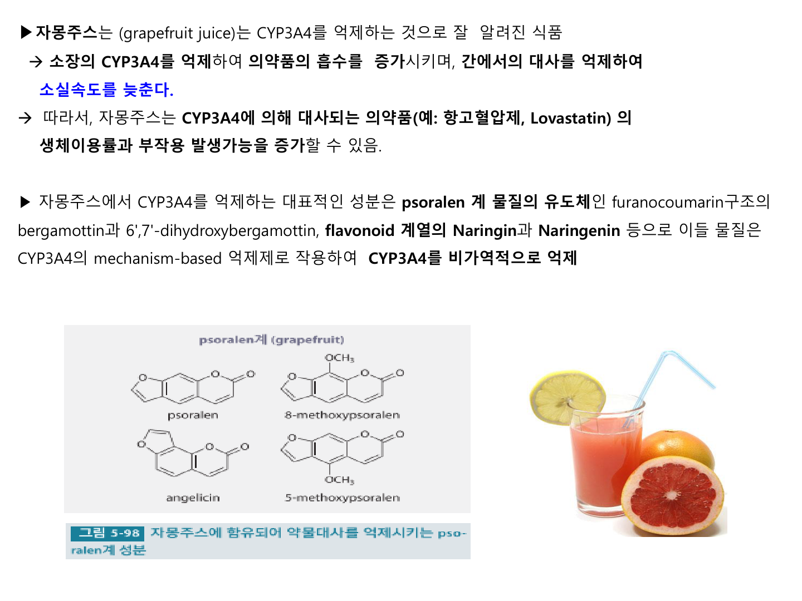
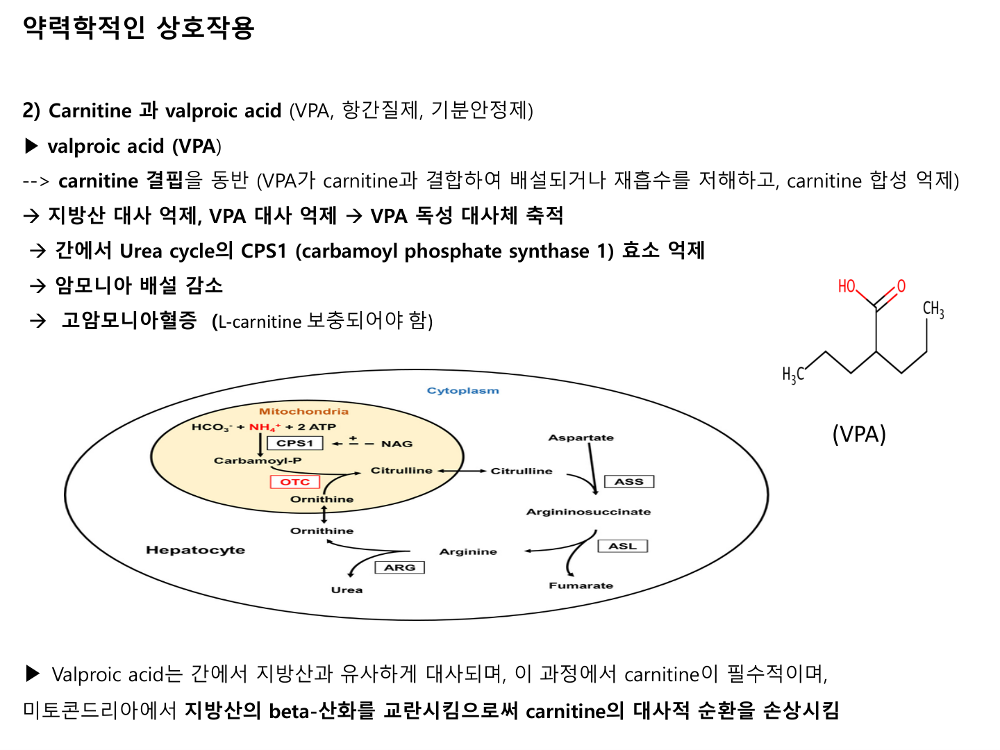
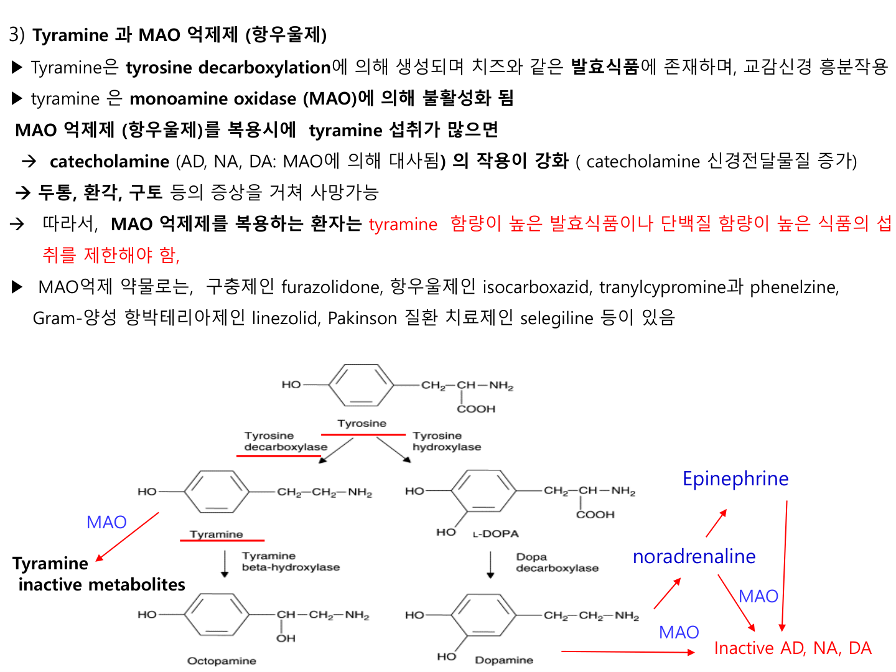
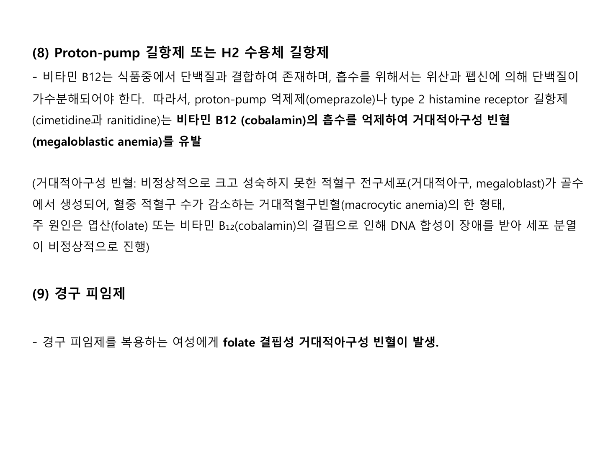

# 문제

다음은 식품 위생의 개념 및 식품 위생 관련 행정제도에 대한 설명이다. 옳은 것을 모두 고르시오.

- 우리나라 식품위생법 제2조는 “식품 위생이라 함은 식품, 첨가물, 기구 및 용기와 포장을 대상으로 하는 음식에 관한 위생을 말한다”라고 정의하고 있다.
- 식품위생의 범위에는 식품관리부족, 식중독, 기생충, 식품첨가물이 해당하지만 감염병이나 유전자변형식품은 포함되지 않는다.
- 유인성 병해는 식품의 생산, 제조, 가공, 유통 및 소비 등의 과정에서 외부로부터 혼입되거나 오염된 것이다.
- CODEX는 국제식품규격위원회로, 국제적으로 통용될 수 있는 식품규격기준을 제정 및 관리하는 국제기관이자 이 위원회에서 설정한 규정을 의미하기도 한다.
- 식품의 생산과 유통을 안전하고 위생적으로 확보하기 위한 식품의 위생 및 품질관리제도를 HACCP이라고 한다.

답: 아래 표시 보기
O 우리나라 식품위생법 제2조는 “식품 위생이라 함은 식품, 첨가물, 기구 및 용기와 포장을 대상으로 하는 음식에 관한 위생을 말한다”라고 정의하고 있다. // 식품만이 아니라 첨가물ㆍ기구ㆍ용기포장까지 위생 대상에 들어간다.
O CODEX는 국제식품규격위원회로, 국제적으로 통용될 수 있는 식품규격기준을 제정 및 관리하는 국제기관이자 이 위원회에서 설정한 규정을 의미하기도 한다. // 국제 식품 기준을 맞추기 위한 WHO/FAO 공동 기구로 잡는다.
O 식품의 생산과 유통을 안전하고 위생적으로 확보하기 위한 식품의 위생 및 품질관리제도를 HACCP이라고 한다. // HACCP는 사후검사보다 위해요소를 공정 중 관리하는 제도이다.
X 식품위생의 범위에는 식품관리부족, 식중독, 기생충, 식품첨가물이 해당하지만 감염병이나 유전자변형식품은 포함되지 않는다. -> 식품위생의 범위에는 감염병과 유전자변형식품도 포함된다. 식품위생 범위는 식품 자체 문제뿐 아니라 식품을 매개로 한 위해까지 넓게 잡는다.
X 유인성 병해는 식품의 생산, 제조, 가공, 유통 및 소비 등의 과정에서 외부로부터 혼입되거나 오염된 것이다. -> 식품의 생산ㆍ제조ㆍ가공ㆍ유통ㆍ소비 과정에서 외부로부터 혼입되거나 오염된 것은 **외인성 병해**이다. 유인성/외인성 용어를 바꿔 낸 보기이다.
출처: G:\내 드라이브\여형준님\21 6-1\예방약학\기말고사 정리자료\2023년 1학기 예방약학 기말고사_심재인.pdf p.3-4 + G:\내 드라이브\여형준님\21 6-1\예방약학\기말고사 정리자료\예방약학 기말고사 범위 수업자료.pdf p.483, p.485

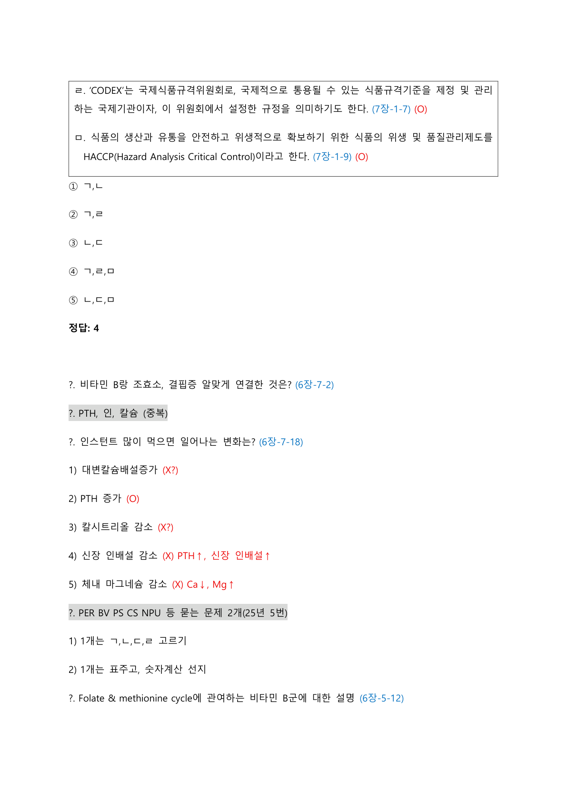
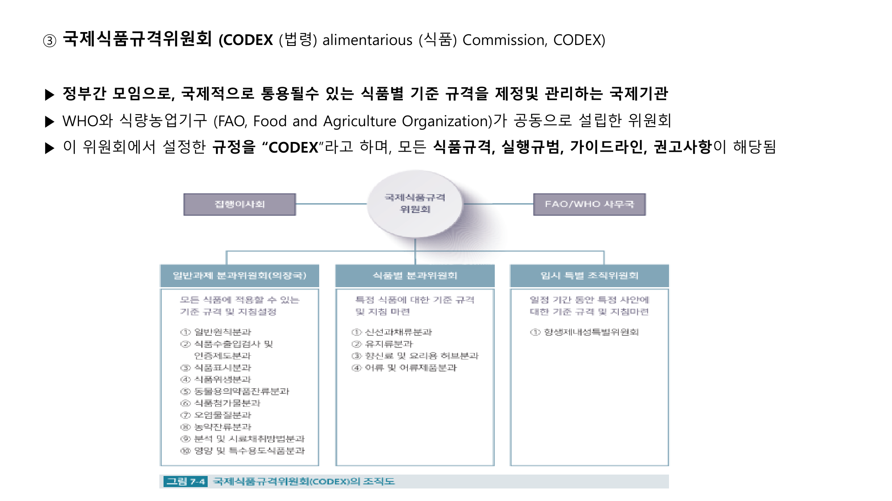
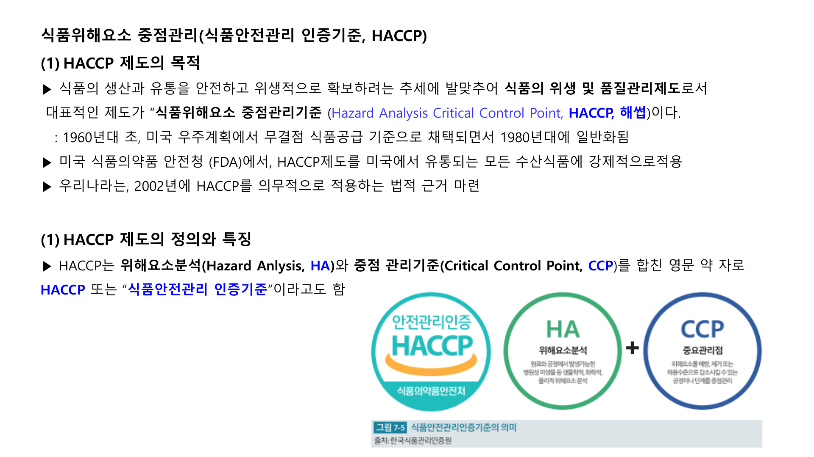

# 문제

인스턴트 식품이나 식품첨가물 등으로 고인산 식이가 지속될 때 일어나는 변화로 가장 알맞은 것은?

- 대변 칼슘 배설 감소
- PTH 증가
- calcitriol 생성 증가
- 신장 인 배설 감소
- 체내 Mg 감소

답: 아래 표시 보기
O PTH 증가 // 고인산 상태에서는 PTH가 올라가 신장 인 배설을 늘리는 방향으로 보상한다.
X 대변 칼슘 배설 감소 -> 대변 칼슘 배설은 **증가** 방향이다. 고인산은 칼슘 이용을 방해해 배설 증가 쪽으로 연결된다.
X calcitriol 생성 증가 -> calcitriol 생성은 **감소**한다. 인 흡수를 더 늘리는 calcitriol을 낮추는 방향으로 조절된다.
X 신장 인 배설 감소 -> 신장 인 배설은 **증가**한다. 혈중 인이 높으면 몸은 신장에서 인을 더 내보낸다.
X 체내 Mg 감소 -> 고인산 식이의 핵심 변화는 **PTH 증가**, 신장 인 배설 증가, calcitriol 감소이다. 이 문항의 조절축은 Mg보다 PTHㆍcalcitriolㆍ인 배설이다.
출처: G:\내 드라이브\여형준님\21 6-1\예방약학\기말고사 정리자료\2023년 1학기 예방약학 기말고사_심재인.pdf p.4 + G:\내 드라이브\여형준님\21 6-1\예방약학\기말고사 정리자료\예방약학 기말고사 범위 수업자료.pdf p.324, p.325, p.327

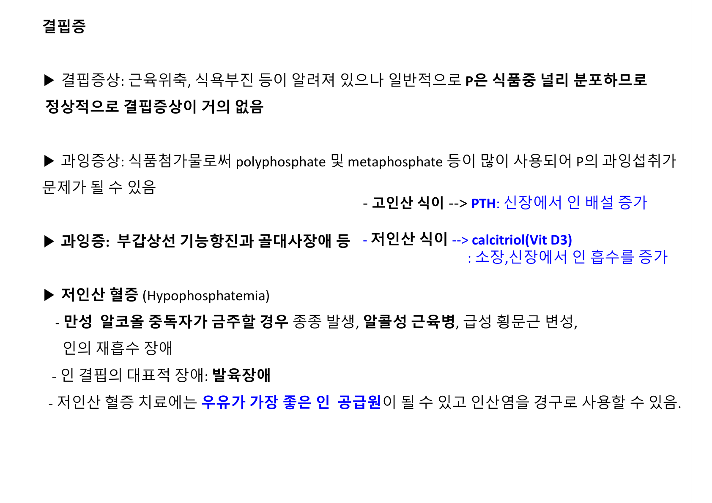

# 문제

단백질 영양가 판정 지표의 계산식으로 틀린 것을 모두 고르시오.

- 단백질효율(PER) = 체중 증가량 / 단백질 섭취량
- 생물가(BV) = 체내에 보유된 질소량 / 흡수된 질소량
- 화학가(CS) = 체내단백질 잔존량 / 단백질 섭취량
- 단백질가(PS) = 식품 중 제한아미노산의 양 / 달걀 중 해당 제한아미노산의 양
- 정단백질가(NPU) = 흡수된 질소량 / 체내에 보유된 질소량

답: 아래 표시 보기
O 단백질효율(PER) = 체중 증가량 / 단백질 섭취량 // 먹은 단백질이 체중 증가로 얼마나 이어졌는지를 보는 지표이다.
O 생물가(BV) = 체내에 보유된 질소량 / 흡수된 질소량 // 흡수된 질소 중 몸에 남은 비율을 보는 지표이다.
O 단백질가(PS) = 식품 중 제한아미노산의 양 / 달걀 중 해당 제한아미노산의 양 // 기준 단백질인 달걀과 제한아미노산 양을 비교한다.
X 화학가(CS) = 체내단백질 잔존량 / 단백질 섭취량 -> CS는 **제한아미노산 비율**로 평가한다. 체내 잔존량이 아니라 아미노산 조성만 보는 지표이다.
X 정단백질가(NPU) = 흡수된 질소량 / 체내에 보유된 질소량 -> NPU는 ==체내단백질 잔존량 / 단백질 섭취량==으로 계산한다. 섭취한 단백질이 몸에 얼마나 남았는지 보는 지표이다.
출처: G:\내 드라이브\여형준님\21 6-1\예방약학\기말고사 정리자료\2025년 1학기 예방약학 기말고사_심재인.pdf p.1 + G:\내 드라이브\여형준님\21 6-1\예방약학\기말고사 정리자료\예방약학 기말고사 범위 수업자료.pdf p.151, p.153
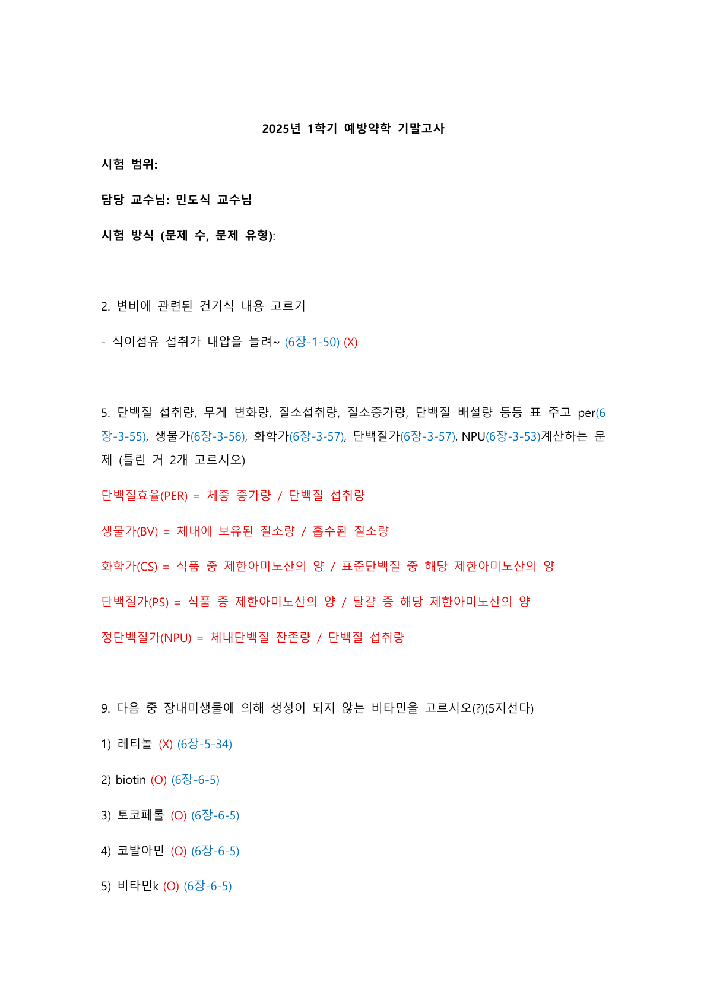
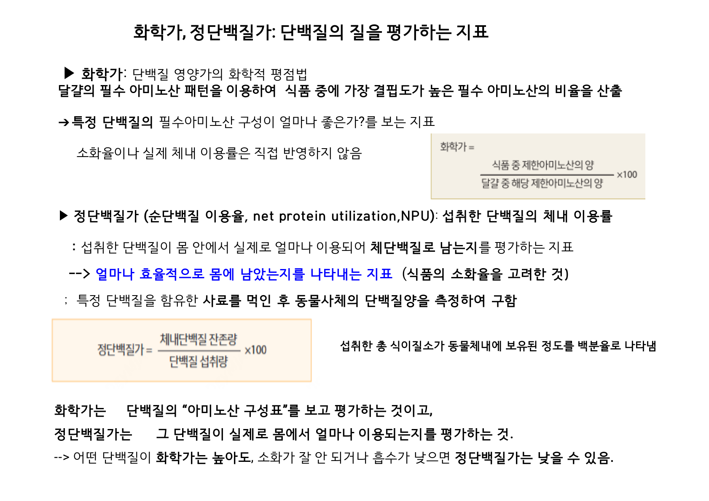
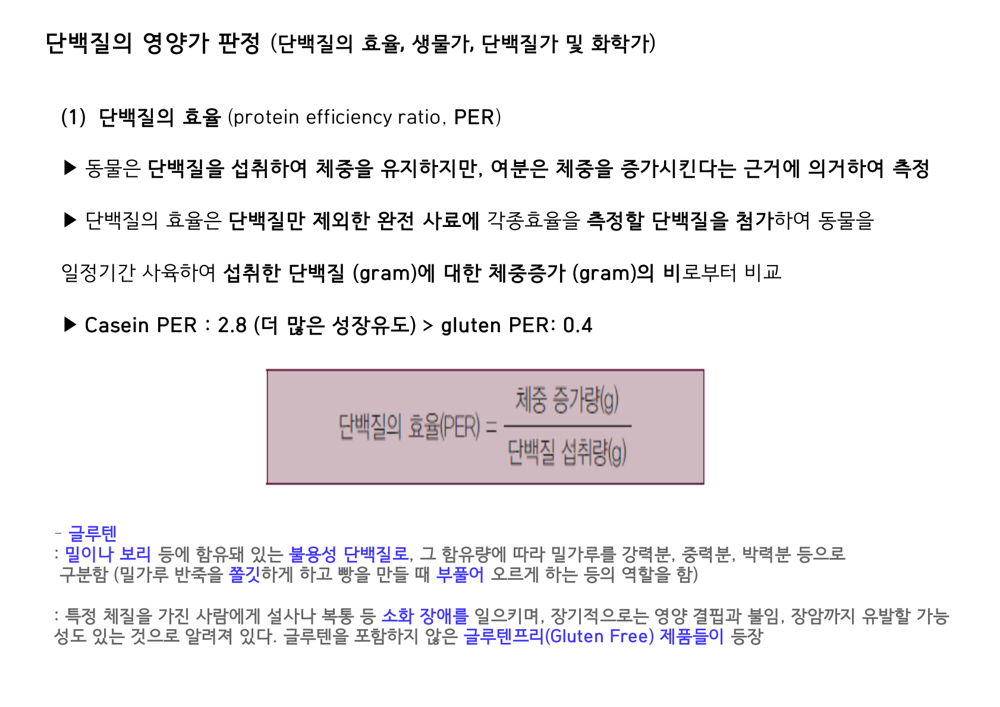

# 문제

다음 중 장내미생물에 의해 생성되지 않는 비타민을 고르시오.

- 레티놀
- biotin
- 토코페롤
- 코발라민
- 비타민 K

답: 아래 표시 보기
O 레티놀 // 레티놀은 vitamin A라 장내미생물이 생성하는 보기 묶음에 들어가지 않는다.
X biotin -> biotin은 **vitamin B7**이며 장내세균 생성과 연결된다. 장내세균 생성 비타민 쪽이라 “생성되지 않는 것”이 아니다.
X 토코페롤 -> 토코페롤은 **vitamin E**이며 장내세균 생성과 연결된다. 이 자료의 생성 연결 목록에 들어가므로 레티놀과 구분한다.
X 코발라민 -> 코발라민은 **vitamin B12**이며 미생물 생성 쪽과 연결된다. B12는 동물성 식품 자체보다 미생물 생성과 연결해 외운다.
X 비타민 K -> 비타민 K는 **vitamin K**이며 장내세균 생성과 연결된다. 장내세균 합성이 대표적으로 언급되는 비타민이다.
출처: G:\내 드라이브\여형준님\21 6-1\예방약학\기말고사 정리자료\2025년 1학기 예방약학 기말고사_심재인.pdf p.1 + G:\내 드라이브\여형준님\21 6-1\예방약학\기말고사 정리자료\예방약학 기말고사 범위 수업자료.pdf p.277

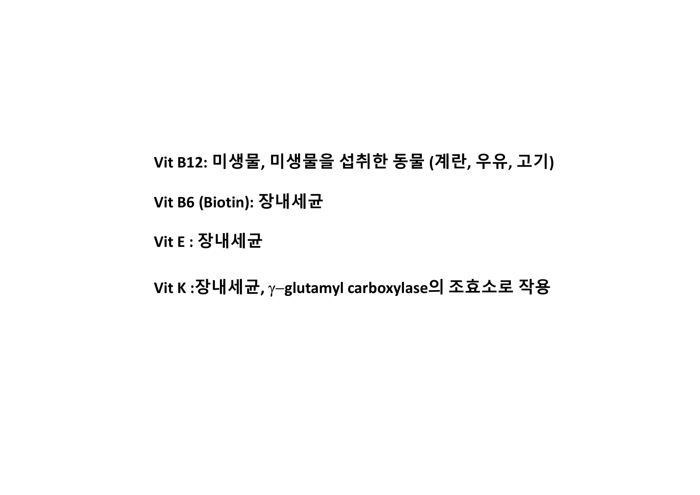

# 문제

기능성 화장품의 효능 평가방법에 대한 설명으로 옳지 않은 것을 모두 고르시오.

- 미백 효능은 tyrosinase 활성억제시험으로 평가할 수 있다
- SPF는 UVB 차단지수이다
- PFA는 UVA로 인한 홍반을 억제하는 정도를 나타낸다
- 기능성화장품의 효능 평가에서 동물실험이 필수적이다

답: 아래 표시 보기
O 미백 효능은 tyrosinase 활성억제시험으로 평가할 수 있다 // Tyrosinase가 멜라닌 생성 반응의 핵심 효소라 억제 여부를 본다.
O SPF는 UVB 차단지수이다 // SPF는 홍반을 일으키는 UVB 차단 정도를 보는 지표이다.
X PFA는 UVA로 인한 홍반을 억제하는 정도를 나타낸다 -> PFA는 UVA에 의한 ==색소침착== 기준이다. 홍반은 UVB/SPF, 색소침착은 UVA/PFA 쪽으로 구분한다.
X 기능성화장품의 효능 평가에서 동물실험이 필수적이다 -> 기능성화장품 효능 평가에서 동물실험은 필수가 아니라 **제한**된다. 효능평가는 시험법으로 확인하지만 동물실험을 당연한 필수로 보지 않는다.
출처: G:\내 드라이브\여형준님\21 6-1\예방약학\기말고사 정리자료\2025년 1학기 예방약학 기말고사_심재인.pdf p.2 + G:\내 드라이브\여형준님\21 6-1\예방약학\기말고사 정리자료\예방약학 기말고사 범위 수업자료.pdf p.418, p.426, p.427
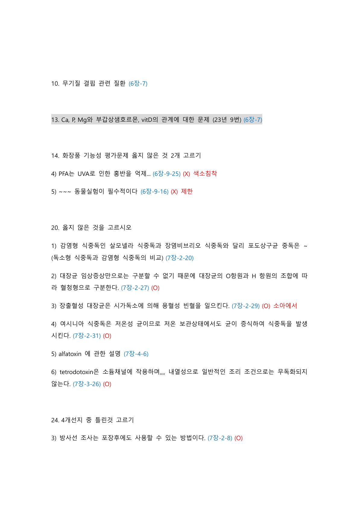
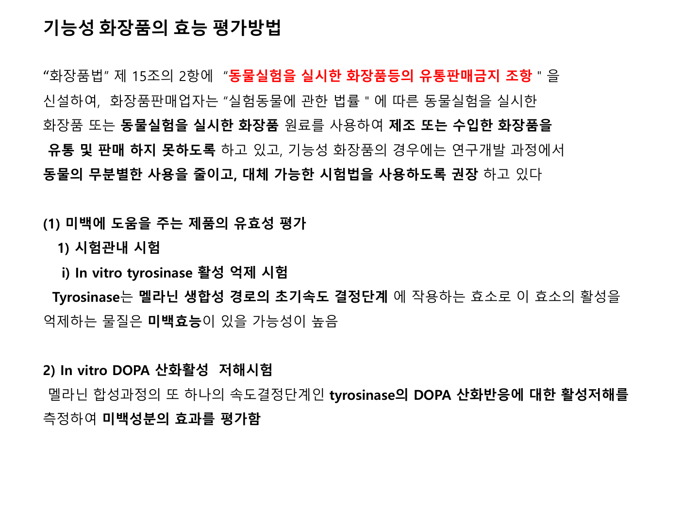
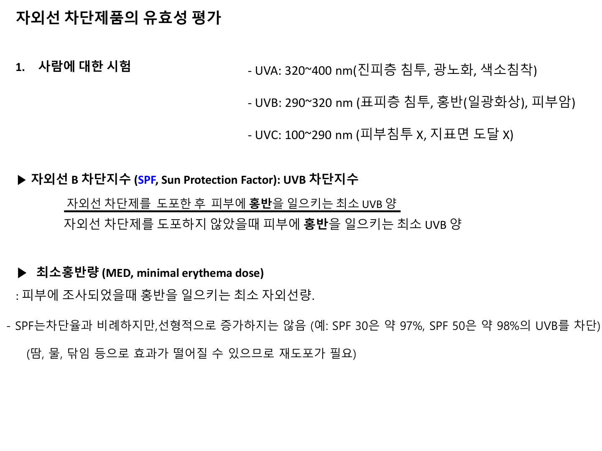
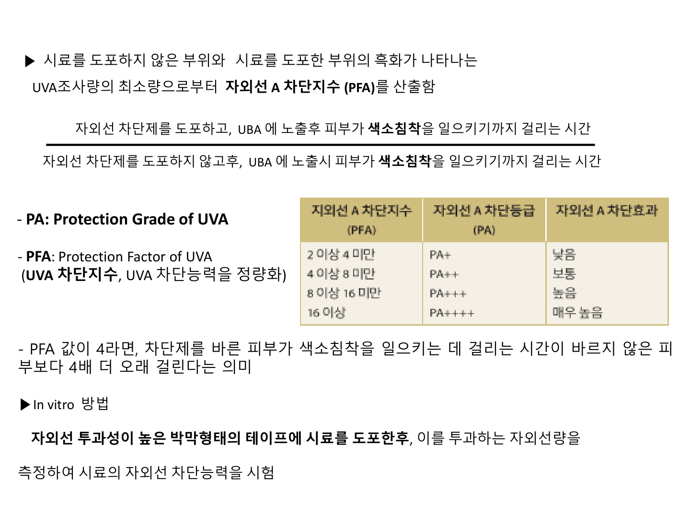

# 문제

세균성 식중독에 관한 설명으로 옳지 않은 것은?

- 살모넬라와 장염비브리오는 감염형이고 포도상구균은 독소형이다
- 대장균은 임상증상만으로는 구분하기 어렵기 때문에 O항원과 H항원의 조합에 따라 혈청형으로 구분한다
- 장출혈성 대장균은 시가독소에 의해 용혈성 빈혈을 일으킬 수 있다
- 여시니아 식중독은 저온성 균이므로 저온 보관상태에서도 균이 증식하여 식중독을 발생시킨다
- 포도상구균은 살모넬라·장염비브리오와 같은 대표적 감염형 식중독이다

답: 아래 표시 보기
O 살모넬라와 장염비브리오는 감염형이고 포도상구균은 독소형이다 // 감염형은 균 증식, 포도상구균은 이미 만들어진 enterotoxin 섭취로 구분한다.
O 대장균은 임상증상만으로는 구분하기 어렵기 때문에 O항원과 H항원의 조합에 따라 혈청형으로 구분한다 // 증상보다 표면항원 조합이 대장균 분류 기준이다.
O 장출혈성 대장균은 시가독소에 의해 용혈성 빈혈을 일으킬 수 있다 // EHEC는 시가독소와 용혈성요독증후군을 같이 연결한다.
O 여시니아 식중독은 저온성 균이므로 저온 보관상태에서도 균이 증식하여 식중독을 발생시킨다 // 냉장온도에서도 자랄 수 있어 저온 보관이 완전한 방어가 아니다.
X 포도상구균은 살모넬라·장염비브리오와 같은 대표적 감염형 식중독이다 -> 포도상구균은 ==enterotoxin 경구섭취==에 의한 독소형 식중독이다. 균이 장내에서 증식하는 감염형이 아니라 이미 생성된 독소 섭취가 핵심이다.
출처: G:\내 드라이브\여형준님\21 6-1\예방약학\기말고사 정리자료\2025년 1학기 예방약학 기말고사_심재인.pdf p.2 + G:\내 드라이브\여형준님\21 6-1\예방약학\기말고사 정리자료\예방약학 기말고사 범위 수업자료.pdf p.527, p.529, p.533, p.535, p.537, p.540

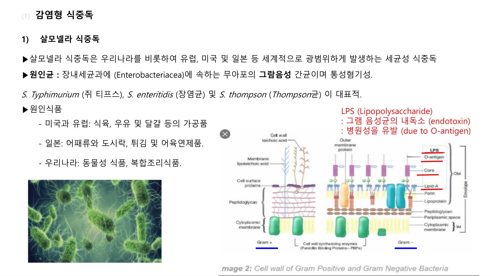
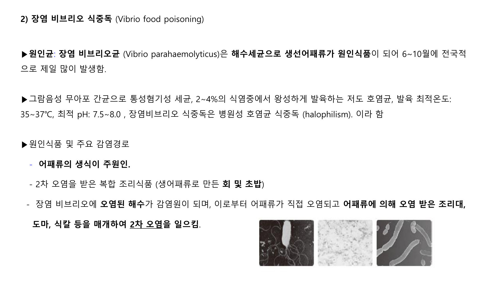
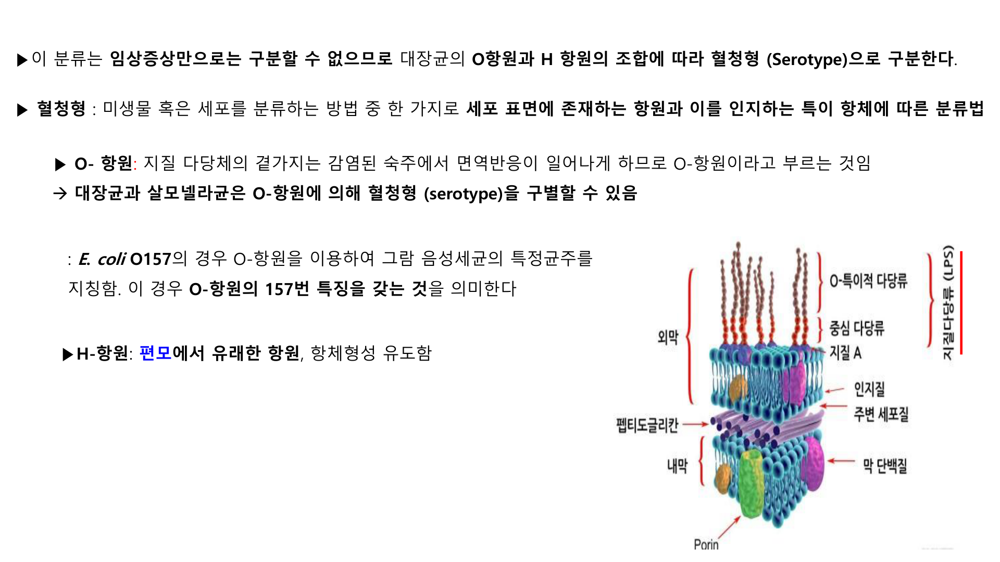
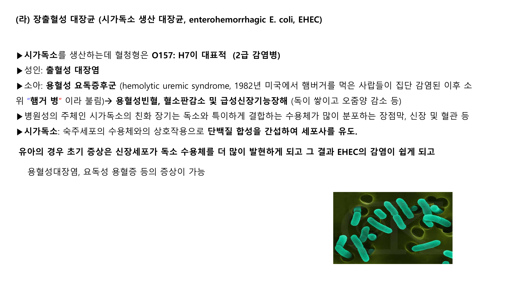
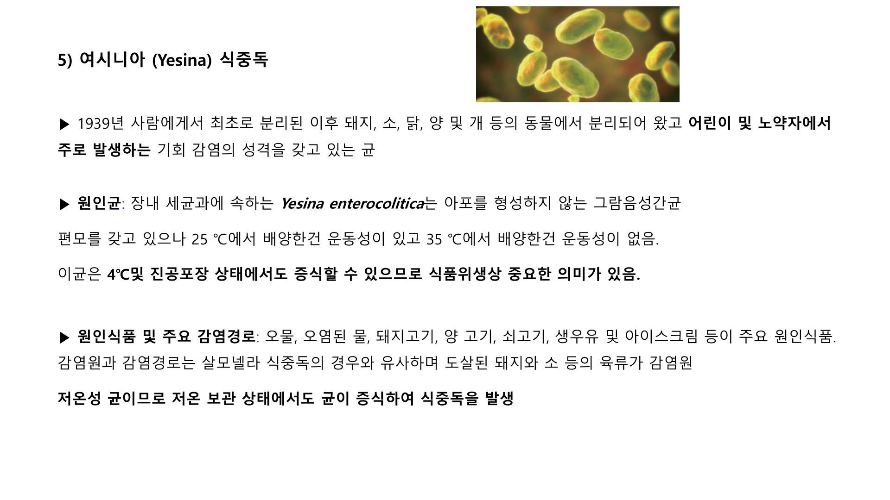
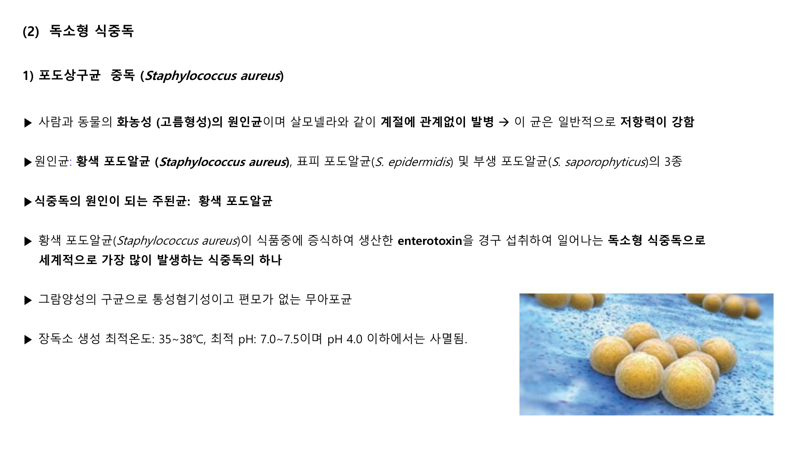

# 문제

어패류는 TMA 단독으로 부패 평가가 가능한가? O/X로 답하시오.

답: O
어패류는 **trimethylamine(TMA)**이 단독 부패지표로 이용된다.
출처: G:\내 드라이브\여형준님\21 6-1\예방약학\기말고사 정리자료\2025년 1학기 예방약학 기말고사_심재인.pdf p.3 + G:\내 드라이브\여형준님\21 6-1\예방약학\기말고사 정리자료\예방약학 기말고사 범위 수업자료.pdf p.503
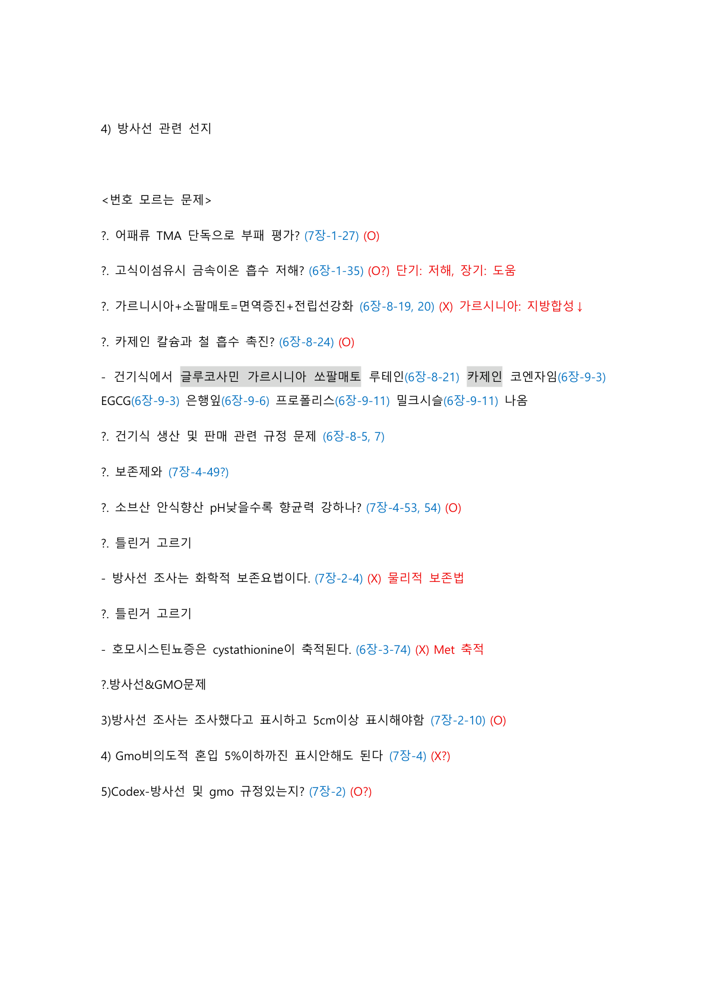
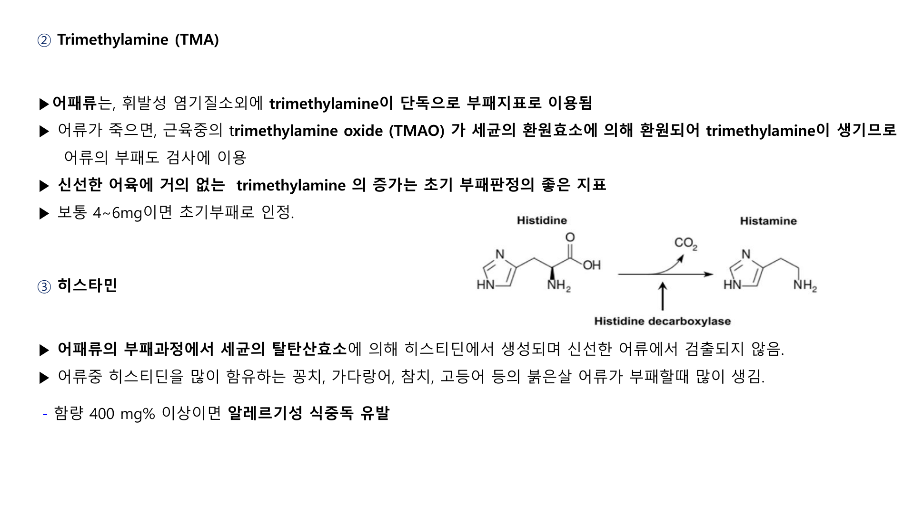

# 문제

고식이섬유 섭취는 필수 금속이온 흡수를 저해할 수 있는가? O/X로 답하시오.

답: O
식이섬유는 킬레이트 화합물 형성으로 **아연, 칼슘, 마그네슘** 흡수를 저해할 수 있다.
출처: G:\내 드라이브\여형준님\21 6-1\예방약학\기말고사 정리자료\2025년 1학기 예방약학 기말고사_심재인.pdf p.3 + G:\내 드라이브\여형준님\21 6-1\예방약학\기말고사 정리자료\예방약학 기말고사 범위 수업자료.pdf p.35

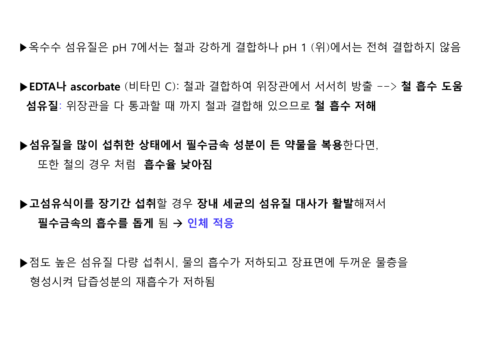

# 문제

“가르시니아 + 쏘팔메토 = 면역증진 + 전립선강화”라는 연결은 옳은가? O/X로 답하시오.

답: X
가르시니아는 ==지방합성 억제==, 쏘팔메토는 ==5α-reductase 억제 / 전립선 건강==과 연결된다.
출처: G:\내 드라이브\여형준님\21 6-1\예방약학\기말고사 정리자료\2025년 1학기 예방약학 기말고사_심재인.pdf p.3 + G:\내 드라이브\여형준님\21 6-1\예방약학\기말고사 정리자료\예방약학 기말고사 범위 수업자료.pdf p.391, p.392

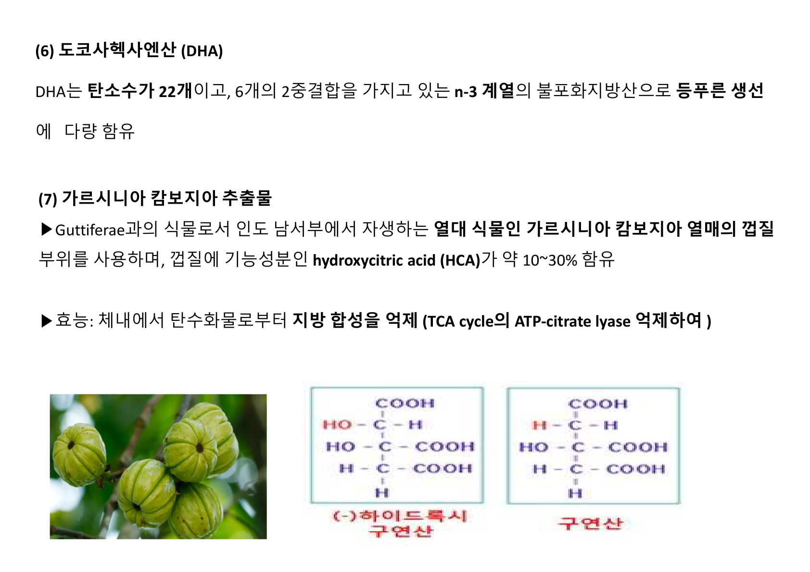

# 문제

카제인포스포펩티드(CPP)는 칼슘과 철 흡수를 촉진하는가? O/X로 답하시오.

답: O
CPP는 중성영역에서 인산 존재하에서도 ==칼슘과 철 흡수 촉진==과 연결된다.
출처: G:\내 드라이브\여형준님\21 6-1\예방약학\기말고사 정리자료\2025년 1학기 예방약학 기말고사_심재인.pdf p.3 + G:\내 드라이브\여형준님\21 6-1\예방약학\기말고사 정리자료\예방약학 기말고사 범위 수업자료.pdf p.396

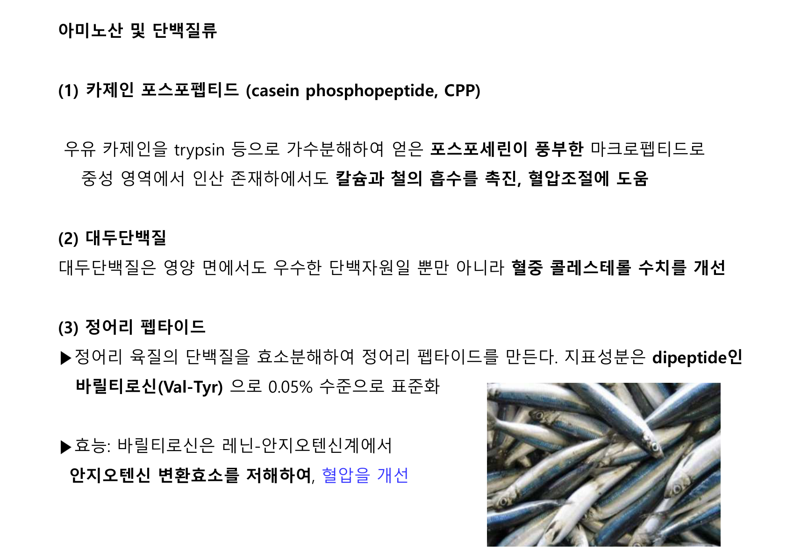

# 문제

변비가 있는 환자에게 추천할 수 있는 건강기능식품 소재로 알맞은 것은?

- 차전자피
- 가르시니아캄보지아추출물
- 쏘팔메토열매추출물
- 루테인과 지아잔틴복합추출물
- 밀크시슬추출물

답: 아래 표시 보기
O 차전자피 // 차전자피는 배변활동 원활ㆍ콜레스테롤 개선 쪽으로 묶이는 식이섬유 기능성 원료이다.
X 가르시니아캄보지아추출물 -> 가르시니아캄보지아추출물은 **체지방 감소**와 연결된다. 배변 기능이 아니라 HCA 계열 체지방 감소 원료로 잡는다.
X 쏘팔메토열매추출물 -> 쏘팔메토열매추출물은 **전립선 건강**과 연결된다. 남성호르몬 전환 효소 억제 쪽 원료이다.
X 루테인과 지아잔틴복합추출물 -> 루테인과 지아잔틴복합추출물은 **눈 건강**과 연결된다. 황반 색소 성분으로 눈 기능 쪽에 둔다.
X 밀크시슬추출물 -> 밀크시슬추출물은 **간 건강**과 연결된다. 실리마린 계열이라 간 기능 원료로 외운다.
출처: G:\내 드라이브\여형준님\21 6-1\예방약학\기말고사 정리자료\2023년 1학기 예방약학 기말고사_심재인.pdf p.5 + G:\내 드라이브\여형준님\21 6-1\예방약학\기말고사 정리자료\2025년 1학기 예방약학 기말고사_심재인.pdf p.1 + G:\내 드라이브\여형준님\21 6-1\예방약학\기말고사 정리자료\예방약학 기말고사 범위 수업자료.pdf p.383
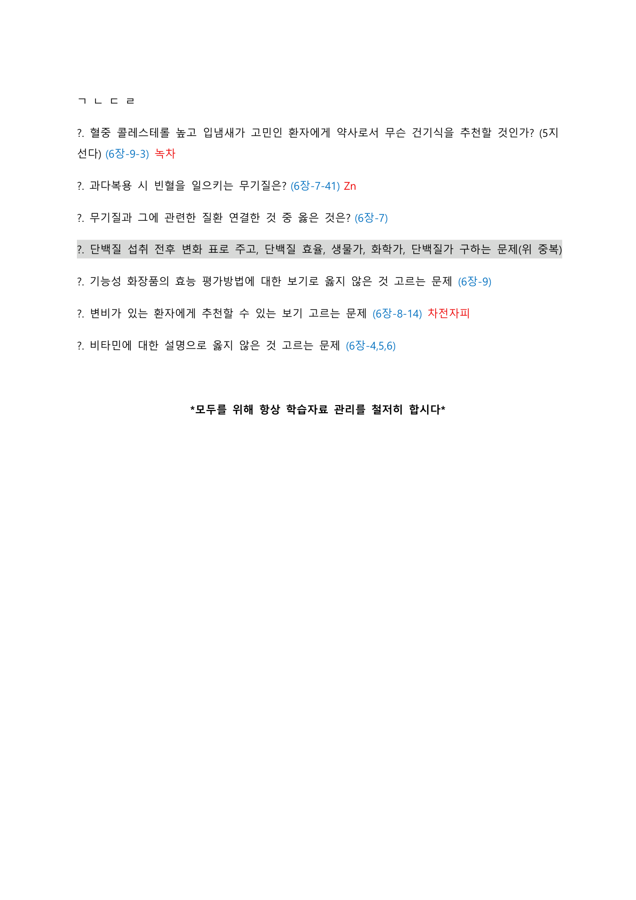

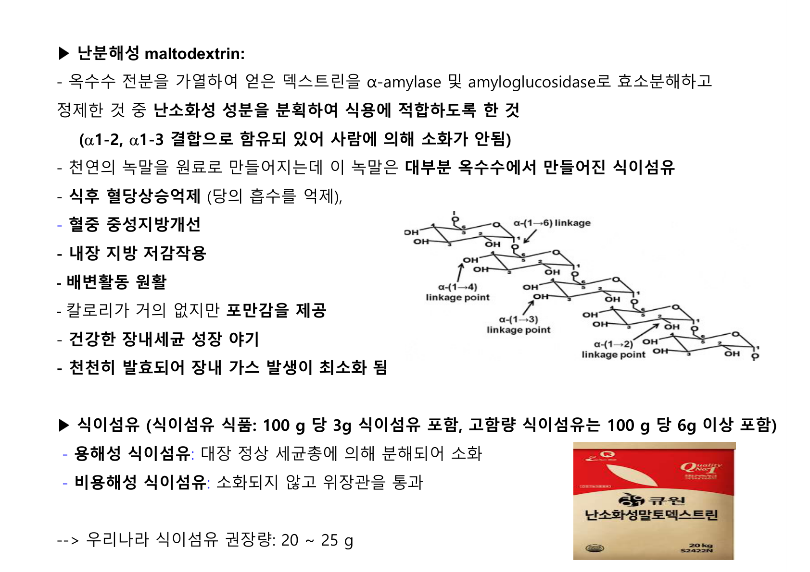

# 문제

혈중 콜레스테롤이 높고 입냄새가 고민인 환자에게 추천할 수 있는 건강기능식품 소재로 기출에서 제시된 것은?

답: 녹차
녹차추출물의 대표 항산화 성분은 **카테킨**이다.
출처: G:\내 드라이브\여형준님\21 6-1\예방약학\기말고사 정리자료\2023년 1학기 예방약학 기말고사_심재인.pdf p.5 + G:\내 드라이브\여형준님\21 6-1\예방약학\기말고사 정리자료\예방약학 기말고사 범위 수업자료.pdf p.405

# 문제

과다복용 시 빈혈을 일으키는 무기질은?

답: Zn
아연 과잉섭취는 여러 조직에서 **Cu와 Fe 감소**를 일으켜 빈혈을 야기할 수 있다.
출처: G:\내 드라이브\여형준님\21 6-1\예방약학\기말고사 정리자료\2023년 1학기 예방약학 기말고사_심재인.pdf p.5 + G:\내 드라이브\여형준님\21 6-1\예방약학\기말고사 정리자료\예방약학 기말고사 범위 수업자료.pdf p.347

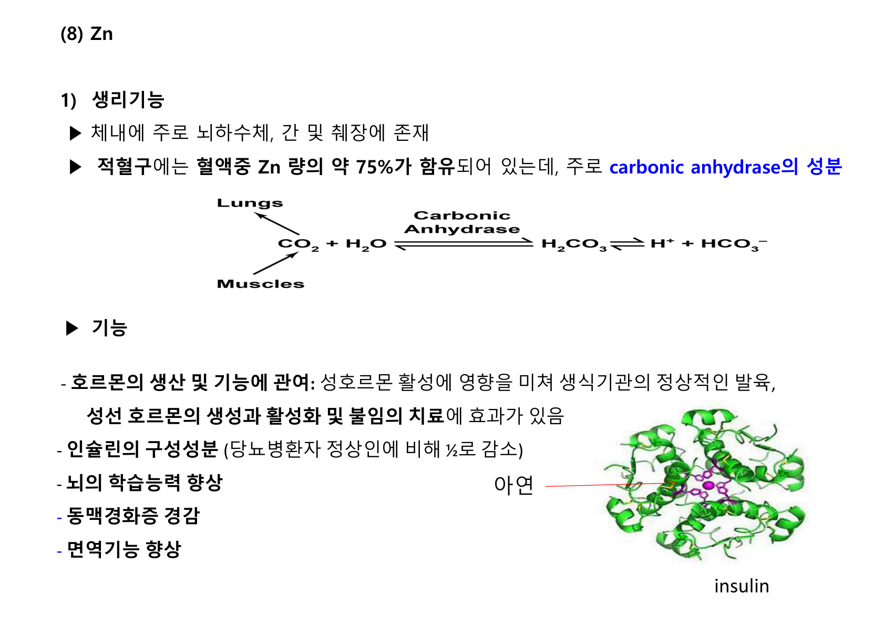

# 문제

Folate & methionine cycle에 관여하는 비타민 B군 설명으로 옳은 것은?

- 엽산은 DNA 복제와 세포분열에 필요한 dUMP -> dTMP 반응과 관련된다
- 비타민 B12 결핍은 methionine 합성과 엽산 기능에 영향을 주지 않는다
- homocysteine 증가는 혈관벽 손상 및 혈전 형성과 무관하다
- methionine 합성효소에는 비타민 C만 필요하다

답: 아래 표시 보기
O 엽산은 DNA 복제와 세포분열에 필요한 dUMP -> dTMP 반응과 관련된다 // 엽산은 1탄소 대사로 thymidine 합성을 도와 세포분열에 필요하다.
X 비타민 B12 결핍은 methionine 합성과 엽산 기능에 영향을 주지 않는다 -> B12 결핍은 **methionine 합성 저하**와 엽산 기능 영향으로 이어질 수 있다. B12가 부족하면 methyl-folate가 빠져나오지 못해 엽산 기능도 막힌다.
X homocysteine 증가는 혈관벽 손상 및 혈전 형성과 무관하다 -> homocysteine 증가는 **혈관벽 손상** 및 혈전 형성과 연결된다. Homocysteine이 올라가면 혈관 손상 위험 쪽으로 본다.
X methionine 합성효소에는 비타민 C만 필요하다 -> methionine synthase에는 ==methylcobalamin(B12)==이 필요하다. Methionine cycle의 보조인자는 vitamin C가 아니라 B12 쪽이다.
출처: G:\내 드라이브\여형준님\21 6-1\예방약학\기말고사 정리자료\2023년 1학기 예방약학 기말고사_심재인.pdf p.4 + G:\내 드라이브\여형준님\21 6-1\예방약학\기말고사 정리자료\예방약학 기말고사 범위 수업자료.pdf p.223, p.224, p.232

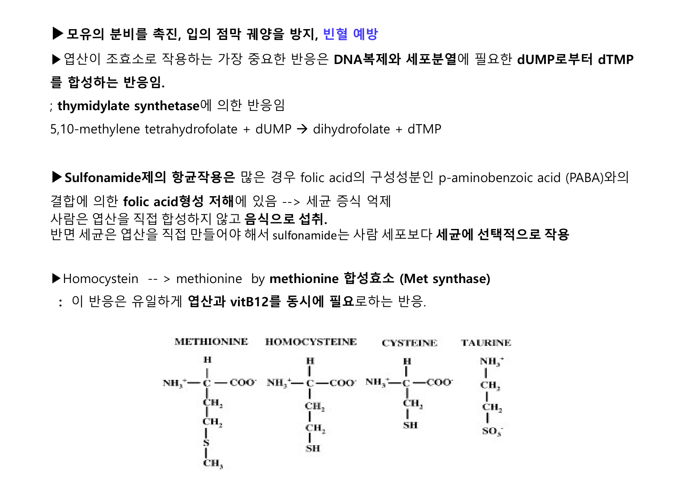
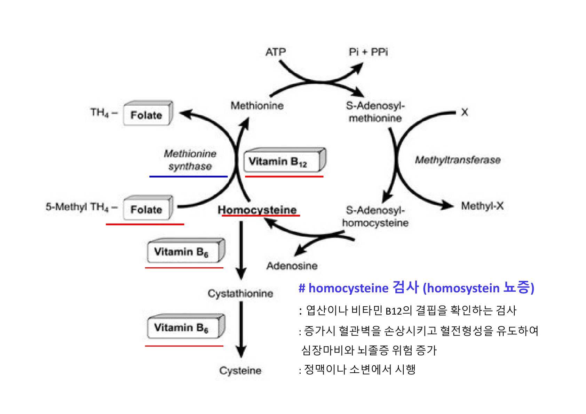
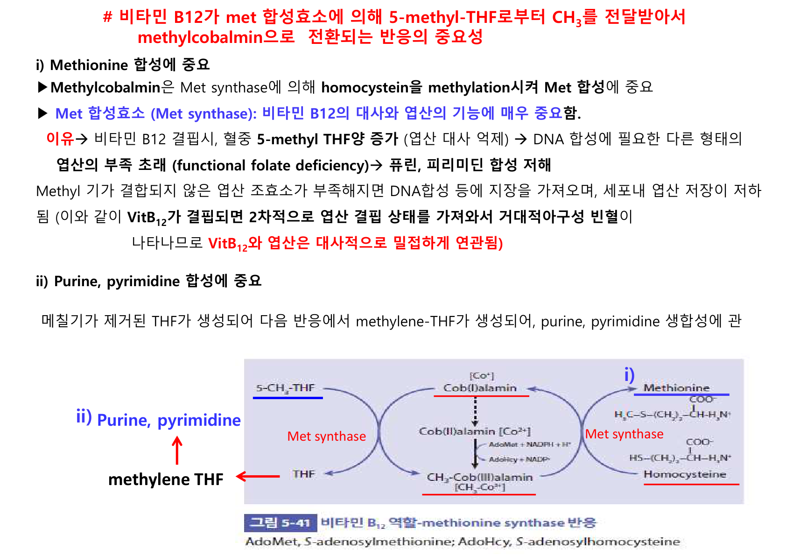

# 문제

Thiamine 결핍증에 해당하는 것은?

- Wilson 병
- 베르니케뇌병증
- Keshan disease
- 호모시스틴뇨증
- 단풍시럽뇨증

답: 아래 표시 보기
O 베르니케뇌병증 // 베르니케뇌병증은 thiamine(B1) 결핍의 대표 질환으로 묶는다.
X Wilson 병 -> Wilson 병은 **Cu 과잉**과 연결된다. 미네랄 질환이라 비타민 B1 결핍 질환이 아니다.
X Keshan disease -> Keshan disease는 **Se 결핍**과 연결된다. Keshan은 selenium 결핍 대표 질환이다.
X 호모시스틴뇨증 -> 호모시스틴뇨증은 **Met 대사 이상** 및 homocysteine 축적과 연결된다. 아미노산 대사질환이라 B1 결핍 질환이 아니다.
X 단풍시럽뇨증 -> 단풍시럽뇨증은 **Ile, Leu, Val** 대사 이상과 연결된다. 가지사슬아미노산 대사질환으로 구분한다.
출처: G:\내 드라이브\여형준님\21 6-1\예방약학\기말고사 정리자료\2023년 1학기 예방약학 기말고사_심재인.pdf p.1 + G:\내 드라이브\여형준님\21 6-1\예방약학\기말고사 정리자료\예방약학 기말고사 범위 수업자료.pdf p.188

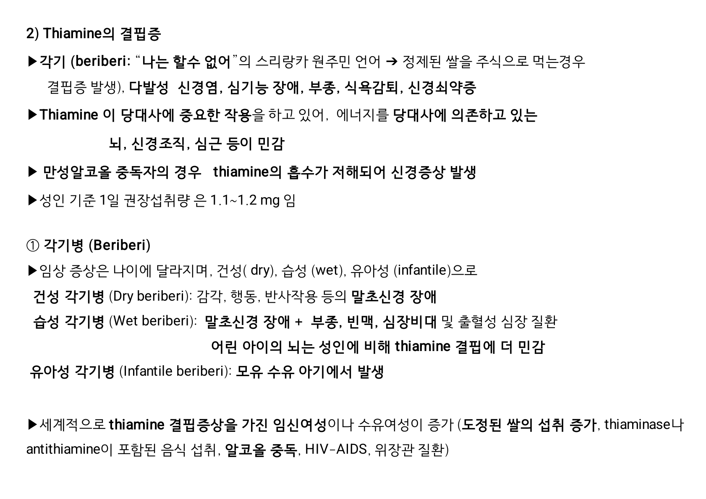

# 문제

N-아세틸글루코사민과 Hyaluronic acid의 관계로 옳은 것은?

- N-아세틸글루코사민은 히알루론산을 분해하여 얻는다
- Hyaluronic acid는 N-아세틸글루코사민을 전구체로 하여 합성된다
- N-아세틸글루코사민의 기능성은 혈압조절뿐이다
- Hyaluronic acid는 수분 보유력과 무관하다

답: 아래 표시 보기
O Hyaluronic acid는 N-아세틸글루코사민을 전구체로 하여 합성된다 // N-아세틸글루코사민은 히알루론산의 재료라 피부보습과 연결된다.
X N-아세틸글루코사민은 히알루론산을 분해하여 얻는다 -> N-아세틸글루코사민은 **히알루론산 전구체**로 설명된다. 히알루론산은 수분 보유력과 연결되어 피부보습 맥락에서 나온다.
X N-아세틸글루코사민의 기능성은 혈압조절뿐이다 -> N-아세틸글루코사민은 **관절ㆍ연골 건강** 및 **피부보습** 기능성과 연결된다. 혈압조절이 아니라 수업자료의 인정 기능성을 묻는 보기이다.
X Hyaluronic acid는 수분 보유력과 무관하다 -> Hyaluronic acid는 **수분 보유력**과 연결된다. 히알루론산은 물을 붙잡는 성질 때문에 보습 효과로 설명된다.
출처: G:\내 드라이브\여형준님\21 6-1\예방약학\기말고사 정리자료\2023년 1학기 예방약학 기말고사_심재인.pdf p.2-3 + G:\내 드라이브\여형준님\21 6-1\예방약학\기말고사 정리자료\예방약학 기말고사 범위 수업자료.pdf p.387

# 문제

쏘팔메토열매추출물의 전립선 건강 관련 작용으로 맞는 것은?

- glutathione reductase 억제
- 5α-reductase 억제
- CYP3A4 유도
- DOPA 산화활성 증가

답: 아래 표시 보기
O 5α-reductase 억제 // 쏘팔메토는 testosterone이 DHT로 바뀌는 효소를 억제하는 쪽으로 전립선 건강과 연결된다.
X glutathione reductase 억제 -> 쏘팔메토의 전립선 건강 작용은 **5α-reductase 억제**와 연결된다. 5α-reductase가 testosterone을 DHT로 전환하는 효소이다.
X CYP3A4 유도 -> 쏘팔메토의 전립선 건강 작용은 **5α-reductase 억제**와 연결된다. CYP3A4 유도는 자몽주스 함정과 섞인 오답이다.
X DOPA 산화활성 증가 -> 쏘팔메토의 전립선 건강 작용은 **5α-reductase 억제**와 연결된다. DOPA 산화활성은 미백 tyrosinase 쪽 함정이다.
출처: G:\내 드라이브\여형준님\21 6-1\예방약학\기말고사 정리자료\2023년 1학기 예방약학 기말고사_심재인.pdf p.2 + G:\내 드라이브\여형준님\21 6-1\예방약학\기말고사 정리자료\예방약학 기말고사 범위 수업자료.pdf p.392

# 문제

CODEX와 HACCP에 관한 설명으로 옳은 것은?

- CODEX는 국내 약국 유통기준만 정하는 기관이다
- HACCP는 위해요소분석(HA)과 중점관리기준(CCP)을 합친 개념이다
- HACCP는 최종제품 검사만 강화하는 사후관리 방식이다
- CODEX는 WHO/FAO와 관련이 없다

답: 아래 표시 보기
O HACCP는 위해요소분석(HA)과 중점관리기준(CCP)을 합친 개념이다 // 위해요소를 찾고 중요관리점에서 관리하는 사전 예방 시스템이다.
X CODEX는 국내 약국 유통기준만 정하는 기관이다 -> CODEX는 **WHO/FAO 공동 설립** 국제식품규격위원회이다. 국내 약국 기준이 아니라 국제 식품규격 기준을 다룬다.
X HACCP는 최종제품 검사만 강화하는 사후관리 방식이다 -> HACCP는 최종제품 검사 중심이 아니라 **사전 예방적** 식품위생 관리 방식이다. 위해요소를 공정 중 중요관리점에서 관리하는 개념이다.
X CODEX는 WHO/FAO와 관련이 없다 -> CODEX는 **WHO/FAO 공동 설립** 국제식품규격위원회이다. WHO/FAO 관련성을 지우는 보기라 틀린다.
출처: G:\내 드라이브\여형준님\21 6-1\예방약학\기말고사 정리자료\2023년 1학기 예방약학 기말고사_심재인.pdf p.4 + G:\내 드라이브\여형준님\21 6-1\예방약학\기말고사 정리자료\예방약학 기말고사 범위 수업자료.pdf p.483, p.485

# 문제

대장균 식중독에 관한 설명으로 옳은 것은?

- 대장균은 임상증상만으로 정확히 구분한다
- O항원과 H항원의 조합에 따라 혈청형으로 구분한다
- EHEC는 시가독소를 생산하지 않는다
- 장출혈성 대장균은 성인에게만 용혈성요독증후군을 일으킨다

답: 아래 표시 보기
O O항원과 H항원의 조합에 따라 혈청형으로 구분한다 // 대장균은 증상만으로 구분하기 어려워 항원 조합을 기준으로 본다.
X 대장균은 임상증상만으로 정확히 구분한다 -> 대장균은 **O항원/H항원** 조합으로 혈청형을 구분한다. 임상증상만으로는 구분이 어려워 항원 조합을 본다.
X EHEC는 시가독소를 생산하지 않는다 -> EHEC는 **시가독소**와 연결된다. 장출혈성과 용혈성요독증후군을 이어 주는 핵심 독소이다.
X 장출혈성 대장균은 성인에게만 용혈성요독증후군을 일으킨다 -> 장출혈성 대장균은 용혈성요독증후군과 연결되며 성인에게만 한정되지 않는다. 소아에서도 중요한 합병증으로 잡는다.
출처: G:\내 드라이브\여형준님\21 6-1\예방약학\기말고사 정리자료\2025년 1학기 예방약학 기말고사_심재인.pdf p.2 + G:\내 드라이브\여형준님\21 6-1\예방약학\기말고사 정리자료\예방약학 기말고사 범위 수업자료.pdf p.533, p.535

# 문제

여시니아 식중독의 특징으로 옳은 것은?

- 4℃ 및 진공포장 상태에서는 증식하지 못한다
- 저온성 균이므로 저온 보관상태에서도 식중독을 발생시킬 수 있다
- 원인식품은 생선어패류 생식으로만 제한된다
- 살모넬라 식중독과 감염원·감염경로가 전혀 다르다

답: 아래 표시 보기
O 저온성 균이므로 저온 보관상태에서도 식중독을 발생시킬 수 있다 // 여시니아는 냉장에서도 증식 가능해 저온 보관만으로 안심하기 어렵다.
X 4℃ 및 진공포장 상태에서는 증식하지 못한다 -> 여시니아는 **4℃ 및 진공포장**에서도 증식 가능하다. 저온성 균이라 냉장 보관도 방심 포인트가 아니다.
X 원인식품은 생선어패류 생식으로만 제한된다 -> 여시니아 원인식품은 오물, 오염된 물, **육류**, 생우유, 아이스크림 등으로 설명된다. 생선어패류 생식으로만 제한되는 식중독이 아니다.
X 살모넬라 식중독과 감염원·감염경로가 전혀 다르다 -> 여시니아의 감염원·감염경로는 **살모넬라 식중독과 유사**하다. 오염된 식품ㆍ물 섭취 경로로 묶어 본다.
출처: G:\내 드라이브\여형준님\21 6-1\예방약학\기말고사 정리자료\2025년 1학기 예방약학 기말고사_심재인.pdf p.2 + G:\내 드라이브\여형준님\21 6-1\예방약학\기말고사 정리자료\예방약학 기말고사 범위 수업자료.pdf p.537

# 문제

복어독 tetrodotoxin에 대한 설명으로 옳지 않은 것은?

- 동물성 자연독 식중독 중 중요하게 다룬다
- 생식선, 간, 장, 피부 등에 포함될 수 있다
- 일반적인 조리조건으로 무독화된다
- 산란기에 독력이 강하다

답: 아래 표시 보기
O 동물성 자연독 식중독 중 중요하게 다룬다 // Tetrodotoxin은 복어독으로 동물성 자연독의 대표 예이다.
O 생식선, 간, 장, 피부 등에 포함될 수 있다 // 복어독은 근육보다 난소ㆍ간ㆍ장ㆍ피부 같은 부위가 위험하다.
O 산란기에 독력이 강하다 // 산란기에는 생식선 독성이 강해지는 점을 같이 묶는다.
X 일반적인 조리조건으로 무독화된다 -> Tetrodotoxin은 ==내열성==으로 일반적인 조리조건으로는 무독화되지 않는다. 조리로 해결된다고 보는 보기가 함정이다.
출처: G:\내 드라이브\여형준님\21 6-1\예방약학\기말고사 정리자료\2025년 1학기 예방약학 기말고사_심재인.pdf p.2 + G:\내 드라이브\여형준님\21 6-1\예방약학\기말고사 정리자료\예방약학 기말고사 범위 수업자료.pdf p.573

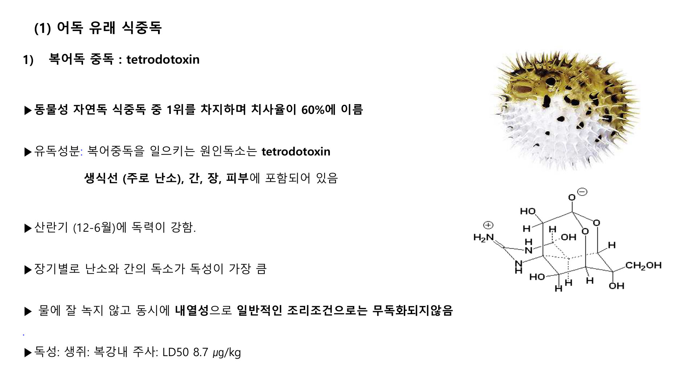

# 문제

Aflatoxin에 관한 설명으로 옳지 않은 것은?

- Aspergillus속 곰팡이의 2차 대사산물이다
- Aflatoxin B1은 강한 발암성을 지닌다
- 생성 최적조건은 수분 16% 이상, 25~30℃, 상대습도 80~85% 이상이다
- 발암 기전은 대사체 epoxide와 DNA의 비가역적 공유결합과 무관하다

답: 아래 표시 보기
O Aspergillus속 곰팡이의 2차 대사산물이다 // Aflatoxin은 곰팡이가 성장하며 만드는 mycotoxin으로 분류된다.
O Aflatoxin B1은 강한 발암성을 지닌다 // B1은 aflatoxin 중 발암성이 특히 강한 형태로 다룬다.
O 생성 최적조건은 수분 16% 이상, 25~30℃, 상대습도 80~85% 이상이다 // 따뜻하고 습한 저장조건이 곰팡이 독소 생성에 유리하다.
X 발암 기전은 대사체 epoxide와 DNA의 비가역적 공유결합과 무관하다 -> Aflatoxin B1의 발암 기전은 대사체 **epoxide와 DNA의 비가역적 공유결합**과 연결된다. 독성 대사체가 DNA에 결합하는 흐름이 핵심이다.
출처: G:\내 드라이브\여형준님\21 6-1\예방약학\기말고사 정리자료\2025년 1학기 예방약학 기말고사_심재인.pdf p.2 + G:\내 드라이브\여형준님\21 6-1\예방약학\기말고사 정리자료\예방약학 기말고사 범위 수업자료.pdf p.588, p.590

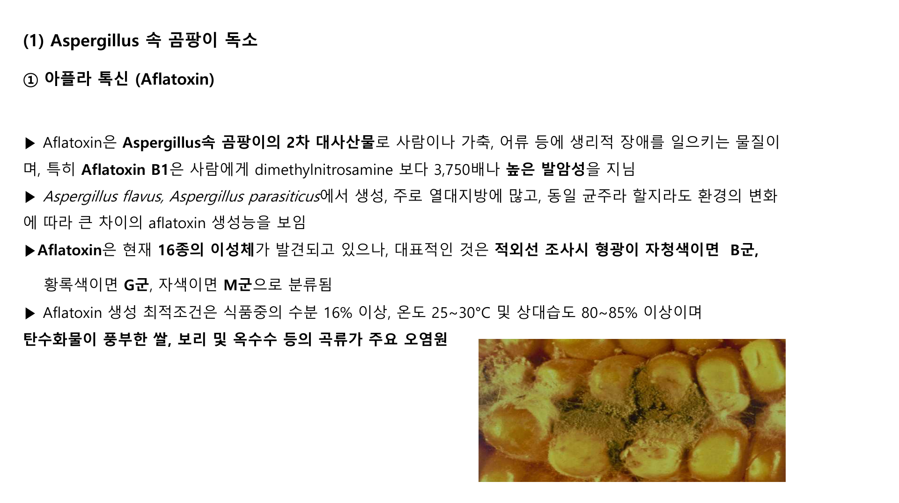
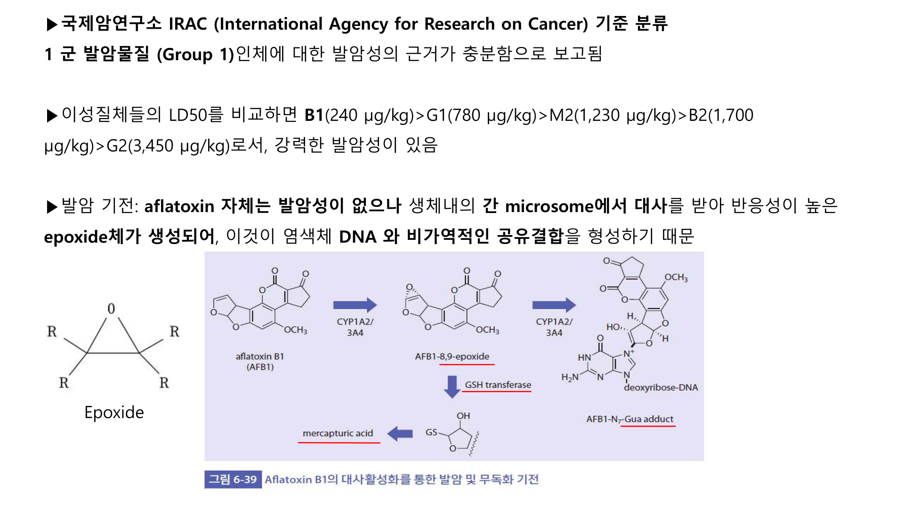

# 문제

보존료에 관한 설명으로 옳은 것은?

- 소르빈산은 pH가 높을수록 효과가 강하다
- 안식향산은 pH 6 이상에서 효과가 없다
- 소르빈산은 젖산균과 혐기성 포자형성균에 특히 강하다
- 안식향산의 보존 기전은 미생물 ATP 결핍과 무관하다

답: 아래 표시 보기
O 안식향산은 pH 6 이상에서 효과가 없다 // 산성 보존료라 pH가 높아지면 비해리형이 줄어 항균력이 떨어진다.
X 소르빈산은 pH가 높을수록 효과가 강하다 -> 소르빈산과 안식향산은 일반적으로 ==pH가 낮을수록 항균력 증가==한다. 산성 보존료는 낮은 pH에서 비해리형이 늘어 효과가 커진다.
X 소르빈산은 젖산균과 혐기성 포자형성균에 특히 강하다 -> 소르빈산은 **효모·곰팡이**에 강하다. 젖산균이나 혐기성 포자형성균에는 효과가 약한 쪽으로 설명된다.
X 안식향산의 보존 기전은 미생물 ATP 결핍과 무관하다 -> 안식향산의 보존기전은 **ATP 결핍** 및 에너지 대사 억제와 연결된다. 보존료는 미생물 증식 억제와 에너지 대사 저해를 같이 본다.
출처: G:\내 드라이브\여형준님\21 6-1\예방약학\기말고사 정리자료\2025년 1학기 예방약학 기말고사_심재인.pdf p.3 + G:\내 드라이브\여형준님\21 6-1\예방약학\기말고사 정리자료\예방약학 기말고사 범위 수업자료.pdf p.635, p.636

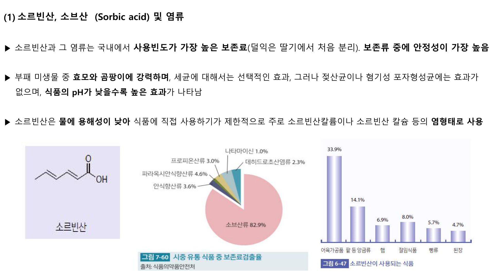
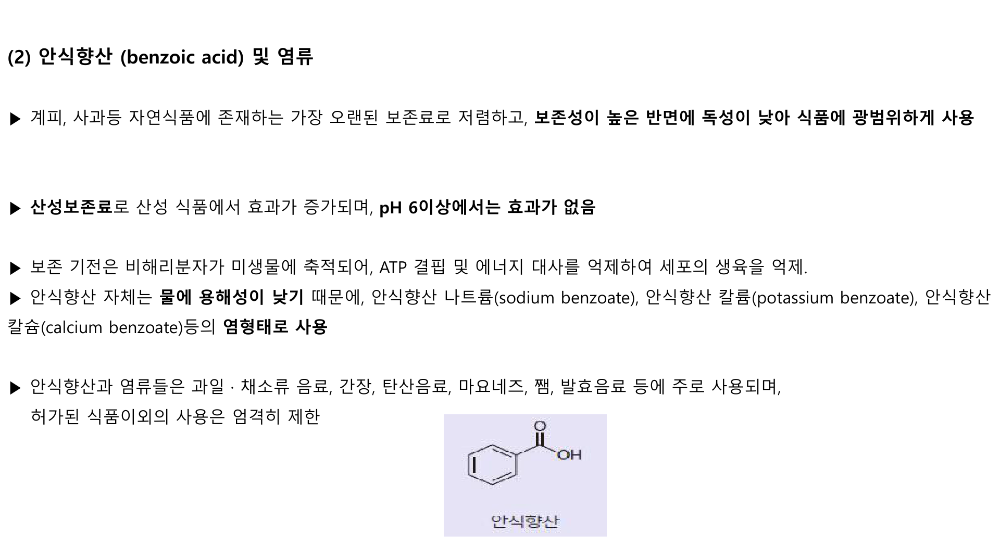

# 문제

방사선 조사식품과 유전자변형식품 용어에 관한 설명으로 옳은 것은?

- 방사선 조사는 화학적 보존요법이다
- 조사식품은 “조사처리” 문구 또는 RADURA 표시와 관련된다
- GMO는 CODEX에서만 사용하는 용어이고 OECD/EU와 무관하다
- LMO는 살아있는 유전자변형생물체와 무관하다

답: 아래 표시 보기
O 조사식품은 “조사처리” 문구 또는 RADURA 표시와 관련된다 // 방사선 조사 여부는 소비자가 알 수 있게 표시 대상이다.
X 방사선 조사는 화학적 보존요법이다 -> 방사선 조사는 **물리적 보존법**이다. 저온ㆍ가열ㆍ건조ㆍ자외선ㆍ방사선을 물리적 처리로 묶는다.
X GMO는 CODEX에서만 사용하는 용어이고 OECD/EU와 무관하다 -> GMO는 **OECD/EU**에서 공식적으로 사용하는 용어이다. GMO와 LMO 용어 출처를 구분하는 보기이다.
X LMO는 살아있는 유전자변형생물체와 무관하다 -> LMO는 **살아있는 유전자변형생물체**를 뜻한다. Living Modified Organism의 L이 살아있는 생물체를 가리킨다.
출처: G:\내 드라이브\여형준님\21 6-1\예방약학\기말고사 정리자료\2025년 1학기 예방약학 기말고사_심재인.pdf p.3 + G:\내 드라이브\여형준님\21 6-1\예방약학\기말고사 정리자료\예방약학 기말고사 범위 수업자료.pdf p.510, p.514, p.516, p.518

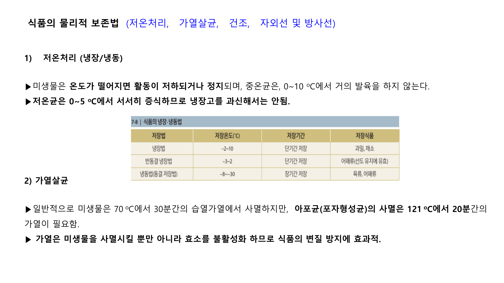
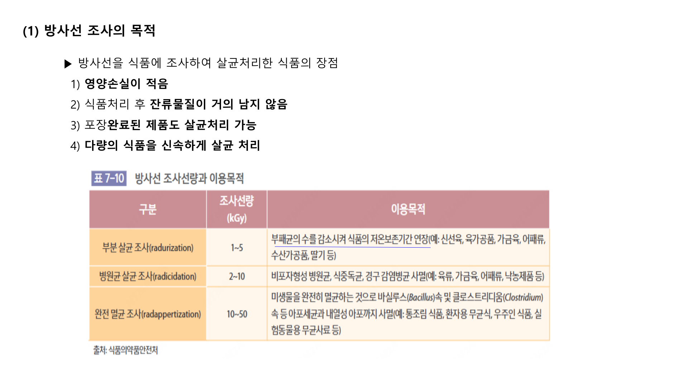
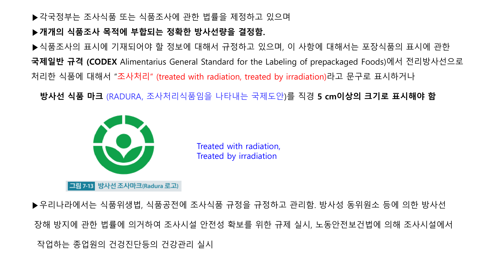
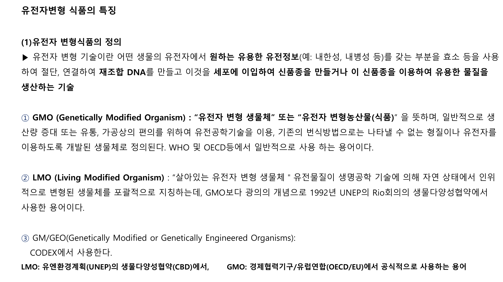
