# 문제

리놀레산과 리놀렌산을 동일하게 100g을 부패시켰다. 변질되는 동안 다음 값들에 대한 설명으로 옳지 않은 것은?
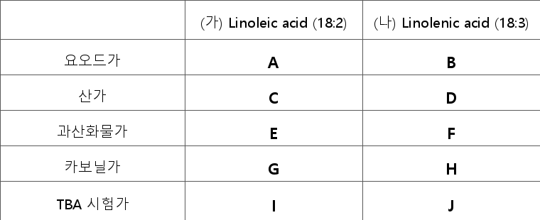

- A가 B보다 크다
- C와 D는 시간이 지남에 따라 증가한다
- F는 시간이 지남에 따라 증가하다가 결국에는 감소한다
- 비타민 E를 넣어주면 Linoleic acid의 요오드가는 유지된다
- G와 I는 양의 상관관계를 가진다

답: 아래 표시 보기
O C와 D는 시간이 지남에 따라 증가한다 // 산가는 산패 진행 시 상승하는 지표라 두 지방산 모두 시간이 지나면 증가한다.
O F는 시간이 지남에 따라 증가하다가 결국에는 감소한다 // 과산화물가는 초기 산화에서 증가하지만 이후 carbonyl 화합물로 분해되어 감소한다.
O 비타민 E를 넣어주면 Linoleic acid의 요오드가는 유지된다 // 비타민 E는 산화를 억제해 Linoleic acid의 불포화도 감소를 늦춘다.
O G와 I는 양의 상관관계를 가진다 // carbonyl가와 TBA 시험가는 모두 산패 생성물 증가를 반영해 같이 증가하는 방향이다.
X A가 B보다 크다 -> Linolenic acid(18:3)가 Linoleic acid(18:2)보다 불포화도가 높으므로 **B > A**이다. 요오드가는 불포화도 지표라 18:3인 B가 더 크다.
출처: G:\내 드라이브\여형준님\21 6-1\예방약학\기말고사 정리자료\2023년 1학기 예방약학 기말고사_심재인.pdf p.1 + G:\내 드라이브\여형준님\21 6-1\예방약학\기말고사 정리자료\예방약학 기말고사 범위 수업자료.pdf p.497

# 문제

질환 또는 결핍증의 연결로 일치하는 것은?

- Co - 베르니케뇌병증
- Met - homocysteine 뇨증
- Se - Wilson's disease
- Zn - Keshan disease
- Cys, Leu, Val - 단풍시럽뇨증

답: 아래 표시 보기
O Met - homocysteine 뇨증 // Methionine 대사가 막히면 homocysteine이 축적되어 소변으로 나온다.
X Co - 베르니케뇌병증 -> Co 결핍은 **methylmalonic aciduria**와 연결되고, 베르니케뇌병증은 **thiamine(B1) 결핍**과 연결된다. Co는 B12 쪽, 베르니케는 B1 쪽으로 나눠 외운다.
X Se - Wilson's disease -> Se 결핍은 **Keshan disease**와 연결되고, Wilson's disease는 **Cu 과잉**과 연결된다. Se와 Cu 질환명을 서로 바꿔 놓은 보기이다.
X Zn - Keshan disease -> Keshan disease는 **Se 결핍**과 연결된다. Keshan은 Zn이 아니라 Se 결핍 대표 질환이다.
X Cys, Leu, Val - 단풍시럽뇨증 -> 단풍시럽뇨증은 ==Ile, Leu, Val== 대사이상과 연결된다. 가지사슬아미노산 3개를 묶어 잡는다.
출처: G:\내 드라이브\여형준님\21 6-1\예방약학\기말고사 정리자료\2023년 1학기 예방약학 기말고사_심재인.pdf p.1 + G:\내 드라이브\여형준님\21 6-1\예방약학\기말고사 정리자료\예방약학 기말고사 범위 수업자료.pdf p.176, p.346, p.350, p.363

# 문제

다음은 Ca, P, Mg 등의 여러 무기질과 PTH, vitamin D의 관계에 관한 설명이다. 다음 중 옳지 않은 것은?

- 칼슘은 체내에서 가장 많이 존재하는 미네랄로, 부갑상선호르몬(PTH)은 혈중칼슘농도를 증가시키는 역할을 한다
- Vitamin D가 결핍되면 소장에서 칼슘과 인의 흡수가 줄어들고, 신장에서는 칼슘과 인산의 재흡수가 감소하여 결과적으로 골다공증을 유발할 수 있다
- 인의 섭취가 적을 경우, 혈중 칼슘농도는 증가하고 혈중 PTH의 농도는 감소하여 신장에서의 인 배설을 감소시켜 혈중 인농도를 정상으로 유지하고자 한다
- 고인산 식이로 혈중 인농도가 증가하면, 신장에서 칼시트리올의 생성이 증가하여 혈중 인 농도를 감소시킨다
- 혈청중의 Mg 이온은 어느 정도 Ca 이온과 반비례적으로 변동하여 Ca 이온이 증가하면 Mg 이온의 농도는 감소한다

답: 아래 표시 보기
O 칼슘은 체내에서 가장 많이 존재하는 미네랄로, 부갑상선호르몬(PTH)은 혈중칼슘농도를 증가시키는 역할을 한다 // PTH는 뼈ㆍ신장 쪽에서 혈중 Ca를 올리는 보상 호르몬으로 잡는다.
O Vitamin D가 결핍되면 소장에서 칼슘과 인의 흡수가 줄어들고, 신장에서는 칼슘과 인산의 재흡수가 감소하여 결과적으로 골다공증을 유발할 수 있다 // Vitamin D는 Ca/P 흡수와 재흡수를 받쳐서 뼈 무기질 유지에 필요하다.
O 인의 섭취가 적을 경우, 혈중 칼슘농도는 증가하고 혈중 PTH의 농도는 감소하여 신장에서의 인 배설을 감소시켜 혈중 인농도를 정상으로 유지하고자 한다 // 인이 부족하면 몸은 배설을 줄여 혈중 인을 보존하는 방향으로 움직인다.
O 혈청중의 Mg 이온은 어느 정도 Ca 이온과 반비례적으로 변동하여 Ca 이온이 증가하면 Mg 이온의 농도는 감소한다 // Ca와 Mg는 혈청에서 서로 반대 방향으로 변동하는 관계로 제시된다.
X 고인산 식이로 혈중 인농도가 증가하면, 신장에서 칼시트리올의 생성이 증가하여 혈중 인 농도를 감소시킨다 -> 고인산 식이에서는 **PTH 증가**, 신장 인 배설 **증가**, calcitriol 생성 ==감소==가 나타난다. 인이 많을 때는 흡수 촉진보다 배설 증가 쪽으로 조절된다.
출처: G:\내 드라이브\여형준님\21 6-1\예방약학\기말고사 정리자료\2023년 1학기 예방약학 기말고사_심재인.pdf p.2 + G:\내 드라이브\여형준님\21 6-1\예방약학\기말고사 정리자료\예방약학 기말고사 범위 수업자료.pdf p.324, p.325

# 문제

다음은 건강기능식품에 관한 설명이다. 빈칸에 들어갈 말이 알맞게 짝지어진 것은?

건강기능식품은 식품의약품안전처에서 심사를 거쳐 인증을 해주는 (가)와 건강기능식품 공전에서 정한 기준, 규격에만 맞추면 누구나 생산할 수 있는 (나) 2가지가 있다.

(다)는 키틴을 가수분해하여 얻어지는 것으로, 관절 및 연골 건강과 피부보습의 기능성이 인정되었다. Hyaluronic acid는 (다)를 전구체로 하여 합성되며 수분 보유력이 뛰어나 보습 효과를 나타낸다.

쏘팔메토 열매추출물은 남성호르몬인 testosterone을 dihydrotestosterone으로 전환시키는 효소 (라) 활성을 억제하는 작용이 있다.

코엔자임 Q10과 녹차의 추출물 성분인 카테킨은 (마) 효과가 있다.

- 가: 고시형 / 나: 개별인정형 / 다: MSM / 라: glutathione reductase / 마: 고지혈증예방
- 가: 개별인정형 / 나: 고시형 / 다: N-아세틸글루코사민 / 라: 5α-reductase / 마: 항산화
- 가: 개별인정형 / 나: 고시형 / 다: N-아세틸글루코사민 / 라: glutathione reductase / 마: 항산화
- 가: 기능인정형 / 나: 고시형 / 다: N-아세틸글루코사민 / 라: 5α-reductase / 마: 항고혈압
- 가: 고시형 / 나: 기능인정형 / 다: MSM / 라: 5α-reductase / 마: 고지혈증예방

답: 아래 표시 보기
O 가: 개별인정형 / 나: 고시형 / 다: N-아세틸글루코사민 / 라: 5α-reductase / 마: 항산화 // 개별인정형은 심사 인증, 고시형은 공전 기준이고 NAGㆍ쏘팔메토ㆍCoQ10/카테킨 기능을 묶은 조합이다.
X 가: 고시형 / 나: 개별인정형 / 다: MSM / 라: glutathione reductase / 마: 고지혈증예방 -> 개별인정형 / 고시형 / N-아세틸글루코사민 / 5α-reductase / 항산화. 가/나 분류와 기능성 성분 대응을 한꺼번에 바꾼 조합이다.
X 가: 개별인정형 / 나: 고시형 / 다: N-아세틸글루코사민 / 라: glutathione reductase / 마: 항산화 -> 개별인정형 / 고시형 / N-아세틸글루코사민 / 5α-reductase / 항산화. 쏘팔메토 작용 효소는 glutathione reductase가 아니라 5α-reductase이다.
X 가: 기능인정형 / 나: 고시형 / 다: N-아세틸글루코사민 / 라: 5α-reductase / 마: 항고혈압 -> 개별인정형 / 고시형 / N-아세틸글루코사민 / 5α-reductase / 항산화. 기능인정형이라는 분류와 항고혈압 효과가 함정이다.
X 가: 고시형 / 나: 기능인정형 / 다: MSM / 라: 5α-reductase / 마: 고지혈증예방 -> 개별인정형 / 고시형 / N-아세틸글루코사민 / 5α-reductase / 항산화. MSM과 고지혈증예방을 넣어 NAG와 항산화 대응을 흐린 보기이다.
출처: G:\내 드라이브\여형준님\21 6-1\예방약학\기말고사 정리자료\2023년 1학기 예방약학 기말고사_심재인.pdf p.2-3 + G:\내 드라이브\여형준님\21 6-1\예방약학\기말고사 정리자료\예방약학 기말고사 범위 수업자료.pdf p.387, p.392, p.405

# 문제

식품과 의약품의 상호작용에 관한 설명으로 옳은 것은?

- 우유와 우유 함유음료를 tetracycline과 함께 섭취할 경우 칼슘과 의약품의 결합을 통해 약물의 흡수 효율을 높여준다
- 자몽주스는 CYP3A4 효소를 유도하여 의약품의 흡수와 생체이용률이 증가될 수 있다
- 항전간제인 Valproic acid(VPA)를 장기간 투여하는 경우, VPA의 독성 대사체가 간 urea cycle의 CPS를 억제하여 저암모니아혈증이 유발된다
- Omeprazole이나 cimetidine은 vitamin B6의 흡수를 억제하여 거대적아구성빈혈을 유발할 수 있다
- MAO 억제제를 복용하는 환자에서 tyramine 섭취가 많으면 catecholamine의 작용이 강화되어 두통, 환각 등의 증상을 거쳐 사망에 이를 수 있다

답: 아래 표시 보기
O MAO 억제제를 복용하는 환자에서 tyramine 섭취가 많으면 catecholamine의 작용이 강화되어 두통, 환각 등의 증상을 거쳐 사망에 이를 수 있다 // MAO가 막히면 tyramine 분해가 줄어 교감신경 작용이 과해진다.
X 우유와 우유 함유음료를 tetracycline과 함께 섭취할 경우 칼슘과 의약품의 결합을 통해 약물의 흡수 효율을 높여준다 -> 우유/칼슘은 tetracycline과 결합해 **흡수를 저해**할 수 있다. 금속이온과 tetracycline 결합이 흡수 감소의 핵심이다.
X 자몽주스는 CYP3A4 효소를 유도하여 의약품의 흡수와 생체이용률이 증가될 수 있다 -> 자몽주스는 CYP3A4를 **억제**한다. 유도와 억제 방향을 바꾸는 보기이다.
X 항전간제인 Valproic acid(VPA)를 장기간 투여하는 경우, VPA의 독성 대사체가 간 urea cycle의 CPS를 억제하여 저암모니아혈증이 유발된다 -> VPA 장기투여는 **carnitine 결핍** 및 **고암모니아혈증**과 연결된다. urea cycle 억제 쪽이므로 저암모니아혈증이 아니라 고암모니아혈증이다.
X Omeprazole이나 cimetidine은 vitamin B6의 흡수를 억제하여 거대적아구성빈혈을 유발할 수 있다 -> omeprazole/cimetidine은 **vitamin B12 흡수 억제**와 연결된다. 거대적아구성빈혈은 B12 흡수 저해 쪽으로 잡는다.
출처: G:\내 드라이브\여형준님\21 6-1\예방약학\기말고사 정리자료\2023년 1학기 예방약학 기말고사_심재인.pdf p.3 + G:\내 드라이브\여형준님\21 6-1\예방약학\기말고사 정리자료\예방약학 기말고사 범위 수업자료.pdf p.446, p.455, p.459, p.476

# 문제

다음은 식품 위생의 개념 및 식품 위생 관련 행정제도에 대한 설명이다. 옳은 것을 모두 고르시오.

- 우리나라 식품위생법 제2조는 “식품 위생이라 함은 식품, 첨가물, 기구 및 용기와 포장을 대상으로 하는 음식에 관한 위생을 말한다”라고 정의하고 있다.
- 식품위생의 범위에는 식품관리부족, 식중독, 기생충, 식품첨가물이 해당하지만 감염병이나 유전자변형식품은 포함되지 않는다.
- 유인성 병해는 식품의 생산, 제조, 가공, 유통 및 소비 등의 과정에서 외부로부터 혼입되거나 오염된 것이다.
- CODEX는 국제식품규격위원회로, 국제적으로 통용될 수 있는 식품규격기준을 제정 및 관리하는 국제기관이자 이 위원회에서 설정한 규정을 의미하기도 한다.
- 식품의 생산과 유통을 안전하고 위생적으로 확보하기 위한 식품의 위생 및 품질관리제도를 HACCP이라고 한다.

답: 아래 표시 보기
O 우리나라 식품위생법 제2조는 “식품 위생이라 함은 식품, 첨가물, 기구 및 용기와 포장을 대상으로 하는 음식에 관한 위생을 말한다”라고 정의하고 있다. // 식품만이 아니라 첨가물ㆍ기구ㆍ용기포장까지 위생 대상에 들어간다.
O CODEX는 국제식품규격위원회로, 국제적으로 통용될 수 있는 식품규격기준을 제정 및 관리하는 국제기관이자 이 위원회에서 설정한 규정을 의미하기도 한다. // 국제 식품 기준을 맞추기 위한 WHO/FAO 공동 기구로 잡는다.
O 식품의 생산과 유통을 안전하고 위생적으로 확보하기 위한 식품의 위생 및 품질관리제도를 HACCP이라고 한다. // HACCP는 사후검사보다 위해요소를 공정 중 관리하는 제도이다.
X 식품위생의 범위에는 식품관리부족, 식중독, 기생충, 식품첨가물이 해당하지만 감염병이나 유전자변형식품은 포함되지 않는다. -> 식품위생의 범위에는 감염병과 유전자변형식품도 포함된다. 식품위생 범위는 식품 자체 문제뿐 아니라 식품을 매개로 한 위해까지 넓게 잡는다.
X 유인성 병해는 식품의 생산, 제조, 가공, 유통 및 소비 등의 과정에서 외부로부터 혼입되거나 오염된 것이다. -> 식품의 생산ㆍ제조ㆍ가공ㆍ유통ㆍ소비 과정에서 외부로부터 혼입되거나 오염된 것은 **외인성 병해**이다. 유인성/외인성 용어를 바꿔 낸 보기이다.
출처: G:\내 드라이브\여형준님\21 6-1\예방약학\기말고사 정리자료\2023년 1학기 예방약학 기말고사_심재인.pdf p.3-4 + G:\내 드라이브\여형준님\21 6-1\예방약학\기말고사 정리자료\예방약학 기말고사 범위 수업자료.pdf p.483, p.485

# 문제

인스턴트 식품이나 식품첨가물 등으로 고인산 식이가 지속될 때 일어나는 변화로 가장 알맞은 것은?

- 대변 칼슘 배설 감소
- PTH 증가
- calcitriol 생성 증가
- 신장 인 배설 감소
- 체내 Mg 감소

답: 아래 표시 보기
O PTH 증가 // 고인산 상태에서는 PTH가 올라가 신장 인 배설을 늘리는 방향으로 보상한다.
X 대변 칼슘 배설 감소 -> 대변 칼슘 배설은 **증가** 방향이다. 고인산은 칼슘 이용을 방해해 배설 증가 쪽으로 연결된다.
X calcitriol 생성 증가 -> calcitriol 생성은 **감소**한다. 인 흡수를 더 늘리는 calcitriol을 낮추는 방향으로 조절된다.
X 신장 인 배설 감소 -> 신장 인 배설은 **증가**한다. 혈중 인이 높으면 몸은 신장에서 인을 더 내보낸다.
X 체내 Mg 감소 -> 고인산 식이의 핵심 변화는 **PTH 증가**, 신장 인 배설 증가, calcitriol 감소이다. 이 문항의 조절축은 Mg보다 PTHㆍcalcitriolㆍ인 배설이다.
출처: G:\내 드라이브\여형준님\21 6-1\예방약학\기말고사 정리자료\2023년 1학기 예방약학 기말고사_심재인.pdf p.4 + G:\내 드라이브\여형준님\21 6-1\예방약학\기말고사 정리자료\예방약학 기말고사 범위 수업자료.pdf p.324, p.325, p.327

# 문제

단백질 영양가 판정 지표의 계산식으로 틀린 것을 모두 고르시오.

- 단백질효율(PER) = 체중 증가량 / 단백질 섭취량
- 생물가(BV) = 체내에 보유된 질소량 / 흡수된 질소량
- 화학가(CS) = 체내단백질 잔존량 / 단백질 섭취량
- 단백질가(PS) = 식품 중 제한아미노산의 양 / 달걀 중 해당 제한아미노산의 양
- 정단백질가(NPU) = 흡수된 질소량 / 체내에 보유된 질소량

답: 아래 표시 보기
O 단백질효율(PER) = 체중 증가량 / 단백질 섭취량 // 먹은 단백질이 체중 증가로 얼마나 이어졌는지를 보는 지표이다.
O 생물가(BV) = 체내에 보유된 질소량 / 흡수된 질소량 // 흡수된 질소 중 몸에 남은 비율을 보는 지표이다.
O 단백질가(PS) = 식품 중 제한아미노산의 양 / 달걀 중 해당 제한아미노산의 양 // 기준 단백질인 달걀과 제한아미노산 양을 비교한다.
X 화학가(CS) = 체내단백질 잔존량 / 단백질 섭취량 -> CS는 **제한아미노산 비율**로 평가한다. 체내 잔존량이 아니라 아미노산 조성만 보는 지표이다.
X 정단백질가(NPU) = 흡수된 질소량 / 체내에 보유된 질소량 -> NPU는 ==체내단백질 잔존량 / 단백질 섭취량==으로 계산한다. 섭취한 단백질이 몸에 얼마나 남았는지 보는 지표이다.
출처: G:\내 드라이브\여형준님\21 6-1\예방약학\기말고사 정리자료\2025년 1학기 예방약학 기말고사_심재인.pdf p.1 + G:\내 드라이브\여형준님\21 6-1\예방약학\기말고사 정리자료\예방약학 기말고사 범위 수업자료.pdf p.151, p.153

# 문제

다음 중 장내미생물에 의해 생성되지 않는 비타민을 고르시오.

- 레티놀
- biotin
- 토코페롤
- 코발라민
- 비타민 K

답: 아래 표시 보기
O 레티놀 // 레티놀은 vitamin A라 장내미생물이 생성하는 보기 묶음에 들어가지 않는다.
X biotin -> biotin은 **vitamin B7**이며 장내세균 생성과 연결된다. 장내세균 생성 비타민 쪽이라 “생성되지 않는 것”이 아니다.
X 토코페롤 -> 토코페롤은 **vitamin E**이며 장내세균 생성과 연결된다. 이 자료의 생성 연결 목록에 들어가므로 레티놀과 구분한다.
X 코발라민 -> 코발라민은 **vitamin B12**이며 미생물 생성 쪽과 연결된다. B12는 동물성 식품 자체보다 미생물 생성과 연결해 외운다.
X 비타민 K -> 비타민 K는 **vitamin K**이며 장내세균 생성과 연결된다. 장내세균 합성이 대표적으로 언급되는 비타민이다.
출처: G:\내 드라이브\여형준님\21 6-1\예방약학\기말고사 정리자료\2025년 1학기 예방약학 기말고사_심재인.pdf p.1 + G:\내 드라이브\여형준님\21 6-1\예방약학\기말고사 정리자료\예방약학 기말고사 범위 수업자료.pdf p.277

# 문제

기능성 화장품의 효능 평가방법에 대한 설명으로 옳지 않은 것을 모두 고르시오.

- 미백 효능은 tyrosinase 활성억제시험으로 평가할 수 있다
- SPF는 UVB 차단지수이다
- PFA는 UVA로 인한 홍반을 억제하는 정도를 나타낸다
- 기능성화장품의 효능 평가에서 동물실험이 필수적이다

답: 아래 표시 보기
O 미백 효능은 tyrosinase 활성억제시험으로 평가할 수 있다 // Tyrosinase가 멜라닌 생성 반응의 핵심 효소라 억제 여부를 본다.
O SPF는 UVB 차단지수이다 // SPF는 홍반을 일으키는 UVB 차단 정도를 보는 지표이다.
X PFA는 UVA로 인한 홍반을 억제하는 정도를 나타낸다 -> PFA는 UVA에 의한 ==색소침착== 기준이다. 홍반은 UVB/SPF, 색소침착은 UVA/PFA 쪽으로 구분한다.
X 기능성화장품의 효능 평가에서 동물실험이 필수적이다 -> 기능성화장품 효능 평가에서 동물실험은 필수가 아니라 **제한**된다. 효능평가는 시험법으로 확인하지만 동물실험을 당연한 필수로 보지 않는다.
출처: G:\내 드라이브\여형준님\21 6-1\예방약학\기말고사 정리자료\2025년 1학기 예방약학 기말고사_심재인.pdf p.2 + G:\내 드라이브\여형준님\21 6-1\예방약학\기말고사 정리자료\예방약학 기말고사 범위 수업자료.pdf p.418, p.426, p.427

# 문제

세균성 식중독에 관한 설명으로 옳지 않은 것은?

- 살모넬라와 장염비브리오는 감염형이고 포도상구균은 독소형이다
- 대장균은 임상증상만으로는 구분하기 어렵기 때문에 O항원과 H항원의 조합에 따라 혈청형으로 구분한다
- 장출혈성 대장균은 시가독소에 의해 용혈성 빈혈을 일으킬 수 있다
- 여시니아 식중독은 저온성 균이므로 저온 보관상태에서도 균이 증식하여 식중독을 발생시킨다
- 포도상구균은 살모넬라·장염비브리오와 같은 대표적 감염형 식중독이다

답: 아래 표시 보기
O 살모넬라와 장염비브리오는 감염형이고 포도상구균은 독소형이다 // 감염형은 균 증식, 포도상구균은 이미 만들어진 enterotoxin 섭취로 구분한다.
O 대장균은 임상증상만으로는 구분하기 어렵기 때문에 O항원과 H항원의 조합에 따라 혈청형으로 구분한다 // 증상보다 표면항원 조합이 대장균 분류 기준이다.
O 장출혈성 대장균은 시가독소에 의해 용혈성 빈혈을 일으킬 수 있다 // EHEC는 시가독소와 용혈성요독증후군을 같이 연결한다.
O 여시니아 식중독은 저온성 균이므로 저온 보관상태에서도 균이 증식하여 식중독을 발생시킨다 // 냉장온도에서도 자랄 수 있어 저온 보관이 완전한 방어가 아니다.
X 포도상구균은 살모넬라·장염비브리오와 같은 대표적 감염형 식중독이다 -> 포도상구균은 ==enterotoxin 경구섭취==에 의한 독소형 식중독이다. 균이 장내에서 증식하는 감염형이 아니라 이미 생성된 독소 섭취가 핵심이다.
출처: G:\내 드라이브\여형준님\21 6-1\예방약학\기말고사 정리자료\2025년 1학기 예방약학 기말고사_심재인.pdf p.2 + G:\내 드라이브\여형준님\21 6-1\예방약학\기말고사 정리자료\예방약학 기말고사 범위 수업자료.pdf p.527, p.529, p.533, p.535, p.537, p.540

# 문제

어패류는 TMA 단독으로 부패 평가가 가능한가? O/X로 답하시오.

답: O
어패류는 **trimethylamine(TMA)**이 단독 부패지표로 이용된다.
출처: G:\내 드라이브\여형준님\21 6-1\예방약학\기말고사 정리자료\2025년 1학기 예방약학 기말고사_심재인.pdf p.3 + G:\내 드라이브\여형준님\21 6-1\예방약학\기말고사 정리자료\예방약학 기말고사 범위 수업자료.pdf p.503

# 문제

고식이섬유 섭취는 필수 금속이온 흡수를 저해할 수 있는가? O/X로 답하시오.

답: O
식이섬유는 킬레이트 화합물 형성으로 **아연, 칼슘, 마그네슘** 흡수를 저해할 수 있다.
출처: G:\내 드라이브\여형준님\21 6-1\예방약학\기말고사 정리자료\2025년 1학기 예방약학 기말고사_심재인.pdf p.3 + G:\내 드라이브\여형준님\21 6-1\예방약학\기말고사 정리자료\예방약학 기말고사 범위 수업자료.pdf p.35

# 문제

“가르시니아 + 쏘팔메토 = 면역증진 + 전립선강화”라는 연결은 옳은가? O/X로 답하시오.

답: X
가르시니아는 ==지방합성 억제==, 쏘팔메토는 ==5α-reductase 억제 / 전립선 건강==과 연결된다.
출처: G:\내 드라이브\여형준님\21 6-1\예방약학\기말고사 정리자료\2025년 1학기 예방약학 기말고사_심재인.pdf p.3 + G:\내 드라이브\여형준님\21 6-1\예방약학\기말고사 정리자료\예방약학 기말고사 범위 수업자료.pdf p.391, p.392

# 문제

카제인포스포펩티드(CPP)는 칼슘과 철 흡수를 촉진하는가? O/X로 답하시오.

답: O
CPP는 중성영역에서 인산 존재하에서도 ==칼슘과 철 흡수 촉진==과 연결된다.
출처: G:\내 드라이브\여형준님\21 6-1\예방약학\기말고사 정리자료\2025년 1학기 예방약학 기말고사_심재인.pdf p.3 + G:\내 드라이브\여형준님\21 6-1\예방약학\기말고사 정리자료\예방약학 기말고사 범위 수업자료.pdf p.396

# 문제

변비가 있는 환자에게 추천할 수 있는 건강기능식품 소재로 알맞은 것은?

- 차전자피
- 가르시니아캄보지아추출물
- 쏘팔메토열매추출물
- 루테인과 지아잔틴복합추출물
- 밀크시슬추출물

답: 아래 표시 보기
O 차전자피 // 차전자피는 배변활동 원활ㆍ콜레스테롤 개선 쪽으로 묶이는 식이섬유 기능성 원료이다.
X 가르시니아캄보지아추출물 -> 가르시니아캄보지아추출물은 **체지방 감소**와 연결된다. 배변 기능이 아니라 HCA 계열 체지방 감소 원료로 잡는다.
X 쏘팔메토열매추출물 -> 쏘팔메토열매추출물은 **전립선 건강**과 연결된다. 남성호르몬 전환 효소 억제 쪽 원료이다.
X 루테인과 지아잔틴복합추출물 -> 루테인과 지아잔틴복합추출물은 **눈 건강**과 연결된다. 황반 색소 성분으로 눈 기능 쪽에 둔다.
X 밀크시슬추출물 -> 밀크시슬추출물은 **간 건강**과 연결된다. 실리마린 계열이라 간 기능 원료로 외운다.
출처: G:\내 드라이브\여형준님\21 6-1\예방약학\기말고사 정리자료\2023년 1학기 예방약학 기말고사_심재인.pdf p.5 + G:\내 드라이브\여형준님\21 6-1\예방약학\기말고사 정리자료\2025년 1학기 예방약학 기말고사_심재인.pdf p.1 + G:\내 드라이브\여형준님\21 6-1\예방약학\기말고사 정리자료\예방약학 기말고사 범위 수업자료.pdf p.383

# 문제

혈중 콜레스테롤이 높고 입냄새가 고민인 환자에게 추천할 수 있는 건강기능식품 소재로 기출에서 제시된 것은?

답: 녹차
녹차추출물의 대표 항산화 성분은 **카테킨**이다.
출처: G:\내 드라이브\여형준님\21 6-1\예방약학\기말고사 정리자료\2023년 1학기 예방약학 기말고사_심재인.pdf p.5 + G:\내 드라이브\여형준님\21 6-1\예방약학\기말고사 정리자료\예방약학 기말고사 범위 수업자료.pdf p.405

# 문제

과다복용 시 빈혈을 일으키는 무기질은?

답: Zn
아연 과잉섭취는 여러 조직에서 **Cu와 Fe 감소**를 일으켜 빈혈을 야기할 수 있다.
출처: G:\내 드라이브\여형준님\21 6-1\예방약학\기말고사 정리자료\2023년 1학기 예방약학 기말고사_심재인.pdf p.5 + G:\내 드라이브\여형준님\21 6-1\예방약학\기말고사 정리자료\예방약학 기말고사 범위 수업자료.pdf p.347

# 문제

Folate & methionine cycle에 관여하는 비타민 B군 설명으로 옳은 것은?

- 엽산은 DNA 복제와 세포분열에 필요한 dUMP -> dTMP 반응과 관련된다
- 비타민 B12 결핍은 methionine 합성과 엽산 기능에 영향을 주지 않는다
- homocysteine 증가는 혈관벽 손상 및 혈전 형성과 무관하다
- methionine 합성효소에는 비타민 C만 필요하다

답: 아래 표시 보기
O 엽산은 DNA 복제와 세포분열에 필요한 dUMP -> dTMP 반응과 관련된다 // 엽산은 1탄소 대사로 thymidine 합성을 도와 세포분열에 필요하다.
X 비타민 B12 결핍은 methionine 합성과 엽산 기능에 영향을 주지 않는다 -> B12 결핍은 **methionine 합성 저하**와 엽산 기능 영향으로 이어질 수 있다. B12가 부족하면 methyl-folate가 빠져나오지 못해 엽산 기능도 막힌다.
X homocysteine 증가는 혈관벽 손상 및 혈전 형성과 무관하다 -> homocysteine 증가는 **혈관벽 손상** 및 혈전 형성과 연결된다. Homocysteine이 올라가면 혈관 손상 위험 쪽으로 본다.
X methionine 합성효소에는 비타민 C만 필요하다 -> methionine synthase에는 ==methylcobalamin(B12)==이 필요하다. Methionine cycle의 보조인자는 vitamin C가 아니라 B12 쪽이다.
출처: G:\내 드라이브\여형준님\21 6-1\예방약학\기말고사 정리자료\2023년 1학기 예방약학 기말고사_심재인.pdf p.4 + G:\내 드라이브\여형준님\21 6-1\예방약학\기말고사 정리자료\예방약학 기말고사 범위 수업자료.pdf p.223, p.224, p.232

# 문제

Thiamine 결핍증에 해당하는 것은?

- Wilson 병
- 베르니케뇌병증
- Keshan disease
- 호모시스틴뇨증
- 단풍시럽뇨증

답: 아래 표시 보기
O 베르니케뇌병증 // 베르니케뇌병증은 thiamine(B1) 결핍의 대표 질환으로 묶는다.
X Wilson 병 -> Wilson 병은 **Cu 과잉**과 연결된다. 미네랄 질환이라 비타민 B1 결핍 질환이 아니다.
X Keshan disease -> Keshan disease는 **Se 결핍**과 연결된다. Keshan은 selenium 결핍 대표 질환이다.
X 호모시스틴뇨증 -> 호모시스틴뇨증은 **Met 대사 이상** 및 homocysteine 축적과 연결된다. 아미노산 대사질환이라 B1 결핍 질환이 아니다.
X 단풍시럽뇨증 -> 단풍시럽뇨증은 **Ile, Leu, Val** 대사 이상과 연결된다. 가지사슬아미노산 대사질환으로 구분한다.
출처: G:\내 드라이브\여형준님\21 6-1\예방약학\기말고사 정리자료\2023년 1학기 예방약학 기말고사_심재인.pdf p.1 + G:\내 드라이브\여형준님\21 6-1\예방약학\기말고사 정리자료\예방약학 기말고사 범위 수업자료.pdf p.188

# 문제

n-6 계열 필수 지방산과 n-3 계열 필수 지방산의 연결로 옳은 것은?

- n-6: 리놀렌산 / n-3: 리놀레산
- n-6: 리놀레산 / n-3: 리놀렌산
- n-6: EPA / n-3: arachidonic acid
- n-6: DHA / n-3: gamma-linolenic acid

답: 아래 표시 보기
O n-6: 리놀레산 / n-3: 리놀렌산 // 리놀레산은 18:2 n-6, 리놀렌산은 18:3 n-3로 외운다.
X n-6: 리놀렌산 / n-3: 리놀레산 -> n-6은 ==리놀레산(C18:2)==, n-3은 ==리놀렌산(C18:3)==이다. n-6/n-3는 말단 methyl 쪽에서 첫 이중결합 위치로 구분한다.
X n-6: EPA / n-3: arachidonic acid -> EPA와 DHA는 **n-3 계열**이고, arachidonic acid와 gamma-linolenic acid는 **n-6 계열**이다. n-3에는 EPA/DHA, n-6에는 arachidonic acid 계열을 묶어 외운다.
X n-6: DHA / n-3: gamma-linolenic acid -> EPA와 DHA는 **n-3 계열**이고, arachidonic acid와 gamma-linolenic acid는 **n-6 계열**이다. n-3에는 EPA/DHA, n-6에는 gamma-linolenic acid 계열을 묶어 외운다.
출처: G:\내 드라이브\여형준님\21 6-1\예방약학\기말고사 정리자료\예방약학 기말고사 범위 수업자료.pdf p.117
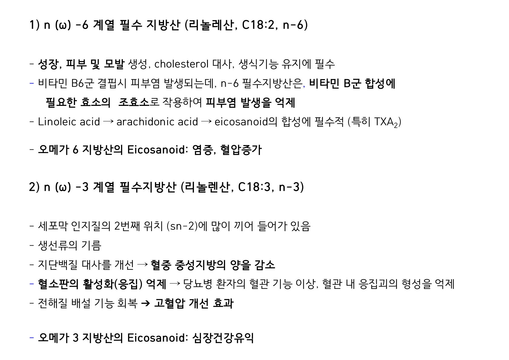

# 문제

N-아세틸글루코사민과 Hyaluronic acid의 관계로 옳은 것은?

- N-아세틸글루코사민은 히알루론산을 분해하여 얻는다
- Hyaluronic acid는 N-아세틸글루코사민을 전구체로 하여 합성된다
- N-아세틸글루코사민의 기능성은 혈압조절뿐이다
- Hyaluronic acid는 수분 보유력과 무관하다

답: 아래 표시 보기
O Hyaluronic acid는 N-아세틸글루코사민을 전구체로 하여 합성된다 // N-아세틸글루코사민은 히알루론산의 재료라 피부보습과 연결된다.
X N-아세틸글루코사민은 히알루론산을 분해하여 얻는다 -> N-아세틸글루코사민은 **히알루론산 전구체**로 설명된다. 히알루론산은 수분 보유력과 연결되어 피부보습 맥락에서 나온다.
X N-아세틸글루코사민의 기능성은 혈압조절뿐이다 -> N-아세틸글루코사민은 **관절ㆍ연골 건강** 및 **피부보습** 기능성과 연결된다. 혈압조절이 아니라 수업자료의 인정 기능성을 묻는 보기이다.
X Hyaluronic acid는 수분 보유력과 무관하다 -> Hyaluronic acid는 **수분 보유력**과 연결된다. 히알루론산은 물을 붙잡는 성질 때문에 보습 효과로 설명된다.
출처: G:\내 드라이브\여형준님\21 6-1\예방약학\기말고사 정리자료\2023년 1학기 예방약학 기말고사_심재인.pdf p.2-3 + G:\내 드라이브\여형준님\21 6-1\예방약학\기말고사 정리자료\예방약학 기말고사 범위 수업자료.pdf p.387

# 문제

쏘팔메토열매추출물의 전립선 건강 관련 작용으로 맞는 것은?

- glutathione reductase 억제
- 5α-reductase 억제
- CYP3A4 유도
- DOPA 산화활성 증가

답: 아래 표시 보기
O 5α-reductase 억제 // 쏘팔메토는 testosterone이 DHT로 바뀌는 효소를 억제하는 쪽으로 전립선 건강과 연결된다.
X glutathione reductase 억제 -> 쏘팔메토의 전립선 건강 작용은 **5α-reductase 억제**와 연결된다. 5α-reductase가 testosterone을 DHT로 전환하는 효소이다.
X CYP3A4 유도 -> 쏘팔메토의 전립선 건강 작용은 **5α-reductase 억제**와 연결된다. CYP3A4 유도는 자몽주스 함정과 섞인 오답이다.
X DOPA 산화활성 증가 -> 쏘팔메토의 전립선 건강 작용은 **5α-reductase 억제**와 연결된다. DOPA 산화활성은 미백 tyrosinase 쪽 함정이다.
출처: G:\내 드라이브\여형준님\21 6-1\예방약학\기말고사 정리자료\2023년 1학기 예방약학 기말고사_심재인.pdf p.2 + G:\내 드라이브\여형준님\21 6-1\예방약학\기말고사 정리자료\예방약학 기말고사 범위 수업자료.pdf p.392

# 문제

식품-의약품 상호작용의 연결로 옳지 않은 것은?

- 우유/칼슘 - tetracycline 흡수 저해
- 자몽주스 - CYP3A4 억제
- Valproic acid - carnitine 결핍 및 고암모니아혈증
- Tyramine + MAO 억제제 - catecholamine 작용 강화
- 자몽주스 - CYP3A4 유도

답: 아래 표시 보기
O 우유/칼슘 - tetracycline 흡수 저해 // 칼슘이 tetracycline과 결합하면 장에서 흡수가 줄어든다.
O 자몽주스 - CYP3A4 억제 // 자몽주스는 대사효소를 억제해 약물 노출을 바꿀 수 있다.
O Valproic acid - carnitine 결핍 및 고암모니아혈증 // VPA 장기투여는 carnitine 고갈과 urea cycle 저해 쪽으로 연결된다.
O Tyramine + MAO 억제제 - catecholamine 작용 강화 // MAO 억제 상태에서 tyramine이 많으면 catecholamine 작용이 과해진다.
X 자몽주스 - CYP3A4 유도 -> 자몽주스는 CYP3A4를 **억제**한다. 유도하면 대사 증가, 억제하면 대사 감소 쪽이라 방향이 반대이다.
출처: G:\내 드라이브\여형준님\21 6-1\예방약학\기말고사 정리자료\예방약학 기말고사 범위 수업자료.pdf p.439, p.446, p.455, p.459
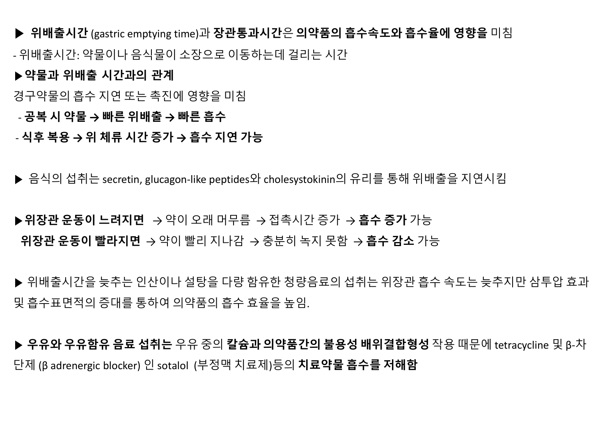

# 문제

CODEX와 HACCP에 관한 설명으로 옳은 것은?

- CODEX는 국내 약국 유통기준만 정하는 기관이다
- HACCP는 위해요소분석(HA)과 중점관리기준(CCP)을 합친 개념이다
- HACCP는 최종제품 검사만 강화하는 사후관리 방식이다
- CODEX는 WHO/FAO와 관련이 없다

답: 아래 표시 보기
O HACCP는 위해요소분석(HA)과 중점관리기준(CCP)을 합친 개념이다 // 위해요소를 찾고 중요관리점에서 관리하는 사전 예방 시스템이다.
X CODEX는 국내 약국 유통기준만 정하는 기관이다 -> CODEX는 **WHO/FAO 공동 설립** 국제식품규격위원회이다. 국내 약국 기준이 아니라 국제 식품규격 기준을 다룬다.
X HACCP는 최종제품 검사만 강화하는 사후관리 방식이다 -> HACCP는 최종제품 검사 중심이 아니라 **사전 예방적** 식품위생 관리 방식이다. 위해요소를 공정 중 중요관리점에서 관리하는 개념이다.
X CODEX는 WHO/FAO와 관련이 없다 -> CODEX는 **WHO/FAO 공동 설립** 국제식품규격위원회이다. WHO/FAO 관련성을 지우는 보기라 틀린다.
출처: G:\내 드라이브\여형준님\21 6-1\예방약학\기말고사 정리자료\2023년 1학기 예방약학 기말고사_심재인.pdf p.4 + G:\내 드라이브\여형준님\21 6-1\예방약학\기말고사 정리자료\예방약학 기말고사 범위 수업자료.pdf p.483, p.485

# 문제

단백질식품의 부패를 초기 판정하는 지표에 관한 설명으로 옳은 것은?

- 어패류의 TMA는 신선한 어육에도 많아 초기부패 지표로 부적합하다
- TMAO가 세균의 환원효소에 의해 TMA로 환원되어 비린내 원인이 된다
- 히스타민은 지방산 산화로만 생성된다
- VBN은 식육에서 전혀 쓰이지 않는다

답: 아래 표시 보기
O TMAO가 세균의 환원효소에 의해 TMA로 환원되어 비린내 원인이 된다 // 어류 부패가 진행되면 세균이 TMAO를 TMA로 바꿔 비린내가 난다.
X 어패류의 TMA는 신선한 어육에도 많아 초기부패 지표로 부적합하다 -> 어패류의 TMA는 신선한 어육에는 거의 없고, 증가하면 **초기부패 판정의 좋은 지표**가 된다. 어류 사후 근육의 TMAO가 세균 환원효소에 의해 TMA로 환원되어 어류 부패도 검사에 이용된다.
X 히스타민은 지방산 산화로만 생성된다 -> 히스타민은 어패류 부패과정에서 세균의 탈탄산효소에 의해 **histidine**에서 생성된다. 지방 산화 지표가 아니라 아미노산 탈탄산 생성물이다.
X VBN은 식육에서 전혀 쓰이지 않는다 -> VBN은 식육에서도 휘발성 염기성 질소를 측정해 **부패정도**를 판단하는 지표로 쓰인다. 수업자료는 식육에서는 암모니아가 주성분이고, 단백성 식품에서 이 질소량을 측정하면 부패정도를 알 수 있다고 설명한다.
출처: G:\내 드라이브\여형준님\21 6-1\예방약학\기말고사 정리자료\예방약학 기말고사 범위 수업자료.pdf p.494, p.503
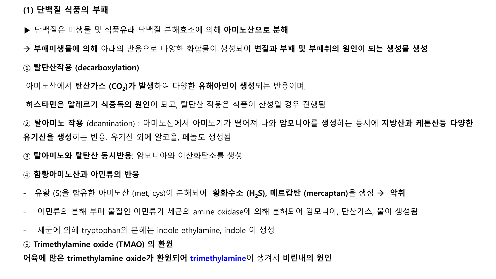

# 문제

대장균 식중독에 관한 설명으로 옳은 것은?

- 대장균은 임상증상만으로 정확히 구분한다
- O항원과 H항원의 조합에 따라 혈청형으로 구분한다
- EHEC는 시가독소를 생산하지 않는다
- 장출혈성 대장균은 성인에게만 용혈성요독증후군을 일으킨다

답: 아래 표시 보기
O O항원과 H항원의 조합에 따라 혈청형으로 구분한다 // 대장균은 증상만으로 구분하기 어려워 항원 조합을 기준으로 본다.
X 대장균은 임상증상만으로 정확히 구분한다 -> 대장균은 **O항원/H항원** 조합으로 혈청형을 구분한다. 임상증상만으로는 구분이 어려워 항원 조합을 본다.
X EHEC는 시가독소를 생산하지 않는다 -> EHEC는 **시가독소**와 연결된다. 장출혈성과 용혈성요독증후군을 이어 주는 핵심 독소이다.
X 장출혈성 대장균은 성인에게만 용혈성요독증후군을 일으킨다 -> 장출혈성 대장균은 용혈성요독증후군과 연결되며 성인에게만 한정되지 않는다. 소아에서도 중요한 합병증으로 잡는다.
출처: G:\내 드라이브\여형준님\21 6-1\예방약학\기말고사 정리자료\2025년 1학기 예방약학 기말고사_심재인.pdf p.2 + G:\내 드라이브\여형준님\21 6-1\예방약학\기말고사 정리자료\예방약학 기말고사 범위 수업자료.pdf p.533, p.535

# 문제

여시니아 식중독의 특징으로 옳은 것은?

- 4℃ 및 진공포장 상태에서는 증식하지 못한다
- 저온성 균이므로 저온 보관상태에서도 식중독을 발생시킬 수 있다
- 원인식품은 생선어패류 생식으로만 제한된다
- 살모넬라 식중독과 감염원·감염경로가 전혀 다르다

답: 아래 표시 보기
O 저온성 균이므로 저온 보관상태에서도 식중독을 발생시킬 수 있다 // 여시니아는 냉장에서도 증식 가능해 저온 보관만으로 안심하기 어렵다.
X 4℃ 및 진공포장 상태에서는 증식하지 못한다 -> 여시니아는 **4℃ 및 진공포장**에서도 증식 가능하다. 저온성 균이라 냉장 보관도 방심 포인트가 아니다.
X 원인식품은 생선어패류 생식으로만 제한된다 -> 여시니아 원인식품은 오물, 오염된 물, **육류**, 생우유, 아이스크림 등으로 설명된다. 생선어패류 생식으로만 제한되는 식중독이 아니다.
X 살모넬라 식중독과 감염원·감염경로가 전혀 다르다 -> 여시니아의 감염원·감염경로는 **살모넬라 식중독과 유사**하다. 오염된 식품ㆍ물 섭취 경로로 묶어 본다.
출처: G:\내 드라이브\여형준님\21 6-1\예방약학\기말고사 정리자료\2025년 1학기 예방약학 기말고사_심재인.pdf p.2 + G:\내 드라이브\여형준님\21 6-1\예방약학\기말고사 정리자료\예방약학 기말고사 범위 수업자료.pdf p.537

# 문제

복어독 tetrodotoxin에 대한 설명으로 옳지 않은 것은?

- 동물성 자연독 식중독 중 중요하게 다룬다
- 생식선, 간, 장, 피부 등에 포함될 수 있다
- 일반적인 조리조건으로 무독화된다
- 산란기에 독력이 강하다

답: 아래 표시 보기
O 동물성 자연독 식중독 중 중요하게 다룬다 // Tetrodotoxin은 복어독으로 동물성 자연독의 대표 예이다.
O 생식선, 간, 장, 피부 등에 포함될 수 있다 // 복어독은 근육보다 난소ㆍ간ㆍ장ㆍ피부 같은 부위가 위험하다.
O 산란기에 독력이 강하다 // 산란기에는 생식선 독성이 강해지는 점을 같이 묶는다.
X 일반적인 조리조건으로 무독화된다 -> Tetrodotoxin은 ==내열성==으로 일반적인 조리조건으로는 무독화되지 않는다. 조리로 해결된다고 보는 보기가 함정이다.
출처: G:\내 드라이브\여형준님\21 6-1\예방약학\기말고사 정리자료\2025년 1학기 예방약학 기말고사_심재인.pdf p.2 + G:\내 드라이브\여형준님\21 6-1\예방약학\기말고사 정리자료\예방약학 기말고사 범위 수업자료.pdf p.573

# 문제

Aflatoxin에 관한 설명으로 옳지 않은 것은?

- Aspergillus속 곰팡이의 2차 대사산물이다
- Aflatoxin B1은 강한 발암성을 지닌다
- 생성 최적조건은 수분 16% 이상, 25~30℃, 상대습도 80~85% 이상이다
- 발암 기전은 대사체 epoxide와 DNA의 비가역적 공유결합과 무관하다

답: 아래 표시 보기
O Aspergillus속 곰팡이의 2차 대사산물이다 // Aflatoxin은 곰팡이가 성장하며 만드는 mycotoxin으로 분류된다.
O Aflatoxin B1은 강한 발암성을 지닌다 // B1은 aflatoxin 중 발암성이 특히 강한 형태로 다룬다.
O 생성 최적조건은 수분 16% 이상, 25~30℃, 상대습도 80~85% 이상이다 // 따뜻하고 습한 저장조건이 곰팡이 독소 생성에 유리하다.
X 발암 기전은 대사체 epoxide와 DNA의 비가역적 공유결합과 무관하다 -> Aflatoxin B1의 발암 기전은 대사체 **epoxide와 DNA의 비가역적 공유결합**과 연결된다. 독성 대사체가 DNA에 결합하는 흐름이 핵심이다.
출처: G:\내 드라이브\여형준님\21 6-1\예방약학\기말고사 정리자료\2025년 1학기 예방약학 기말고사_심재인.pdf p.2 + G:\내 드라이브\여형준님\21 6-1\예방약학\기말고사 정리자료\예방약학 기말고사 범위 수업자료.pdf p.588, p.590

# 문제

보존료에 관한 설명으로 옳은 것은?

- 소르빈산은 pH가 높을수록 효과가 강하다
- 안식향산은 pH 6 이상에서 효과가 없다
- 소르빈산은 젖산균과 혐기성 포자형성균에 특히 강하다
- 안식향산의 보존 기전은 미생물 ATP 결핍과 무관하다

답: 아래 표시 보기
O 안식향산은 pH 6 이상에서 효과가 없다 // 산성 보존료라 pH가 높아지면 비해리형이 줄어 항균력이 떨어진다.
X 소르빈산은 pH가 높을수록 효과가 강하다 -> 소르빈산과 안식향산은 일반적으로 ==pH가 낮을수록 항균력 증가==한다. 산성 보존료는 낮은 pH에서 비해리형이 늘어 효과가 커진다.
X 소르빈산은 젖산균과 혐기성 포자형성균에 특히 강하다 -> 소르빈산은 **효모·곰팡이**에 강하다. 젖산균이나 혐기성 포자형성균에는 효과가 약한 쪽으로 설명된다.
X 안식향산의 보존 기전은 미생물 ATP 결핍과 무관하다 -> 안식향산의 보존기전은 **ATP 결핍** 및 에너지 대사 억제와 연결된다. 보존료는 미생물 증식 억제와 에너지 대사 저해를 같이 본다.
출처: G:\내 드라이브\여형준님\21 6-1\예방약학\기말고사 정리자료\2025년 1학기 예방약학 기말고사_심재인.pdf p.3 + G:\내 드라이브\여형준님\21 6-1\예방약학\기말고사 정리자료\예방약학 기말고사 범위 수업자료.pdf p.635, p.636

# 문제

방사선 조사식품과 유전자변형식품 용어에 관한 설명으로 옳은 것은?

- 방사선 조사는 화학적 보존요법이다
- 조사식품은 “조사처리” 문구 또는 RADURA 표시와 관련된다
- GMO는 CODEX에서만 사용하는 용어이고 OECD/EU와 무관하다
- LMO는 살아있는 유전자변형생물체와 무관하다

답: 아래 표시 보기
O 조사식품은 “조사처리” 문구 또는 RADURA 표시와 관련된다 // 방사선 조사 여부는 소비자가 알 수 있게 표시 대상이다.
X 방사선 조사는 화학적 보존요법이다 -> 방사선 조사는 **물리적 보존법**이다. 저온ㆍ가열ㆍ건조ㆍ자외선ㆍ방사선을 물리적 처리로 묶는다.
X GMO는 CODEX에서만 사용하는 용어이고 OECD/EU와 무관하다 -> GMO는 **OECD/EU**에서 공식적으로 사용하는 용어이다. GMO와 LMO 용어 출처를 구분하는 보기이다.
X LMO는 살아있는 유전자변형생물체와 무관하다 -> LMO는 **살아있는 유전자변형생물체**를 뜻한다. Living Modified Organism의 L이 살아있는 생물체를 가리킨다.
출처: G:\내 드라이브\여형준님\21 6-1\예방약학\기말고사 정리자료\2025년 1학기 예방약학 기말고사_심재인.pdf p.3 + G:\내 드라이브\여형준님\21 6-1\예방약학\기말고사 정리자료\예방약학 기말고사 범위 수업자료.pdf p.510, p.514, p.516, p.518

# 문제

식품 살균제와 보존제의 구분으로 옳은 것은?

- 살균제는 미생물 증식을 억제하는 보존제와 구별되어 사용된다
- 살균제는 최종식품 완성 전에 제거하지 않아도 된다
- 차아염소산나트륨은 참깨에 사용할 수 있다
- 차아염소산나트륨을 물에 희석하면 항균력이 사라진다

답: 아래 표시 보기
O 살균제는 미생물 증식을 억제하는 보존제와 구별되어 사용된다 // 살균제는 단시간 사멸 목적이고 보존료는 증식 억제 목적이다.
X 살균제는 최종식품 완성 전에 제거하지 않아도 된다 -> 살균제는 최종식품 완성 전에 **제거**되는 것이 원칙이다. 보존료처럼 최종제품에 남겨 작용시키는 개념이 아니다.
X 차아염소산나트륨은 참깨에 사용할 수 있다 -> 차아염소산나트륨은 **참깨 사용 금지**이다. 살균제 사용 대상 예외를 묻는 보기이다.
X 차아염소산나트륨을 물에 희석하면 항균력이 사라진다 -> 차아염소산나트륨 희석액은 **유효염소**로 항균 작용을 한다. 물에 희석되면 hypochlorous acid 쪽이 살균력과 연결된다.
출처: G:\내 드라이브\여형준님\21 6-1\예방약학\기말고사 정리자료\예방약학 기말고사 범위 수업자료.pdf p.653
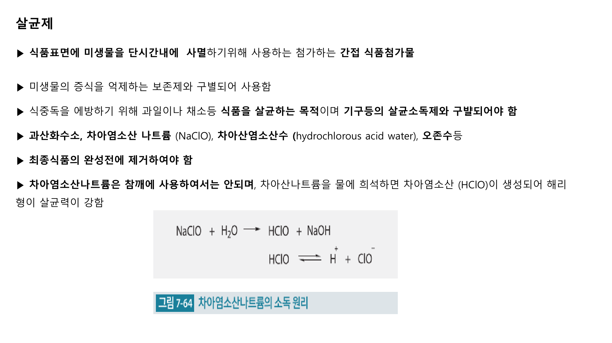

# 문제

유해 착색료에 관한 설명으로 옳은 것은?

- 아우라민은 식품첨가물로 안전하게 사용된다
- 로다민 B는 동물실험에서 발암성 보고가 없다
- 수단색소는 공업용 색소로 식품첨가물로 지정되지 않는다
- 꼭두서니색소는 신장암 유발 보고와 무관하다

답: 아래 표시 보기
O 수단색소는 공업용 색소로 식품첨가물로 지정되지 않는다 // 공업용 색소는 식품에 쓸 수 있는 착색료와 구분한다.
X 아우라민은 식품첨가물로 안전하게 사용된다 -> 아우라민은 **식품 사용 금지** 유해 착색료이다. 유해 착색료는 식품첨가물 허용 색소와 반대로 잡는다.
X 로다민 B는 동물실험에서 발암성 보고가 없다 -> 로다민 B는 발암성 보고가 있는 유해 착색료이다. 안전한 착색료가 아니라 발암성 보고가 있는 금지 색소 쪽이다.
X 꼭두서니색소는 신장암 유발 보고와 무관하다 -> 꼭두서니색소는 **신장암 유발** 보고와 연결된다. 천연 유래 이름이어도 위해성 보고 여부를 따로 봐야 한다.
출처: G:\내 드라이브\여형준님\21 6-1\예방약학\기말고사 정리자료\예방약학 기말고사 범위 수업자료.pdf p.665
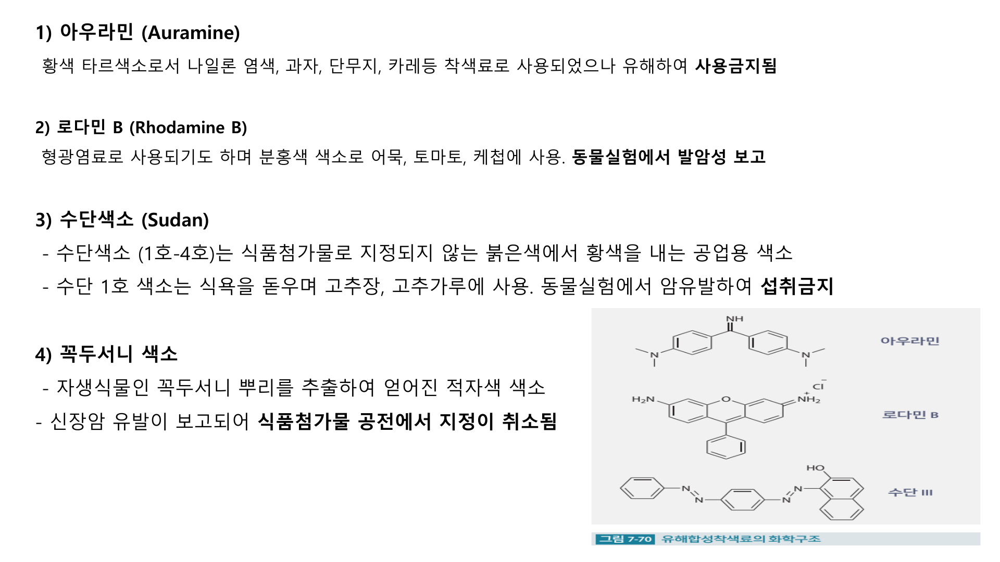

# 문제

식이섬유의 성상과 임상 적용 설명으로 옳은 것을 모두 고르시오.

- 점성이 강한 섬유질은 위 공복속도를 늦추고 영양성분 흡수속도를 낮출 수 있다.
- 함수능이 큰 섬유질은 변의 부피를 늘리고 배설속도를 증가시켜 변비 개선에 도움된다.
- 섬유질의 양이온교환능은 아연, 칼슘, 마그네슘 흡수를 항상 촉진한다.
- 점성 식물다당류는 혈중 콜레스테롤 저하와 고지혈증 치료 효과와 연결된다.
- Lignin은 담즙산 성분과 결합하여 배출을 촉진할 수 있다.

답: 아래 표시 보기
O 점성이 강한 섬유질은 위 공복속도를 늦추고 영양성분 흡수속도를 낮출 수 있다. // 젤처럼 점성이 생기면 위 배출과 장 흡수가 천천히 진행된다.
O 함수능이 큰 섬유질은 변의 부피를 늘리고 배설속도를 증가시켜 변비 개선에 도움된다. // 물을 잡아 변 부피를 키우면 장 통과가 쉬워진다.
O 점성 식물다당류는 혈중 콜레스테롤 저하와 고지혈증 치료 효과와 연결된다. // 점성 섬유질은 담즙산 배출을 도와 콜레스테롤 사용을 늘린다.
O Lignin은 담즙산 성분과 결합하여 배출을 촉진할 수 있다. // 담즙산을 붙잡아 내보내면 콜레스테롤 대사와 연결된다.
X 섬유질의 양이온교환능은 아연, 칼슘, 마그네슘 흡수를 항상 촉진한다. -> 식이섬유는 **아연, 칼슘, 마그네슘 흡수 저해**와 연결될 수 있다. 양이온과 결합하면 무기질 흡수가 줄어드는 쪽으로 본다.
출처: G:\내 드라이브\여형준님\21 6-1\예방약학\기말고사 정리자료\예방약학 기말고사 범위 수업자료.pdf p.50, p.54
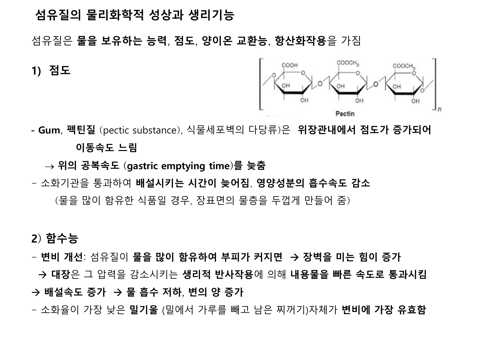
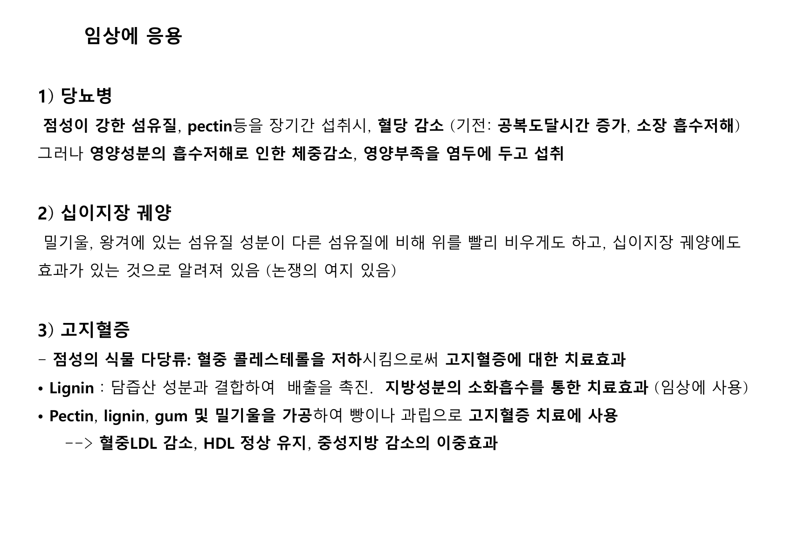

# 문제

식이섬유 예제와 분류에 관한 설명으로 옳은 것을 모두 고르시오.

- Pectic substance는 장내미생물에 의해 쉽게 대사되므로 변비개선 효과가 작을 수 있다.
- Gum은 수용성 비소화성 다당류에 해당한다.
- Lignin과 chitin은 수용성 비소화성 다당류의 대표 예이다.
- 입자형성 및 함수능이 큰 섬유질은 변의 양을 늘리는 방향으로 작용한다.

답: 아래 표시 보기
O Pectic substance는 장내미생물에 의해 쉽게 대사되므로 변비개선 효과가 작을 수 있다. // 미생물이 빨리 분해하면 변 부피를 오래 늘리는 효과가 작아진다.
O Gum은 수용성 비소화성 다당류에 해당한다. // Gum은 물에 녹는 점성 다당류 쪽으로 분류된다.
O 입자형성 및 함수능이 큰 섬유질은 변의 양을 늘리는 방향으로 작용한다. // 입자와 수분을 붙잡는 성질이 bulk 형성으로 이어진다.
X Lignin과 chitin은 수용성 비소화성 다당류의 대표 예이다. -> Lignin과 chitin은 **수용성 비소화성 다당류**의 대표 예가 아니다. Lignin과 chitin은 불용성 쪽으로 구분한다.
출처: G:\내 드라이브\여형준님\21 6-1\예방약학\기말고사 정리자료\예방약학 기말고사 범위 수업자료.pdf p.50, p.61, p.62

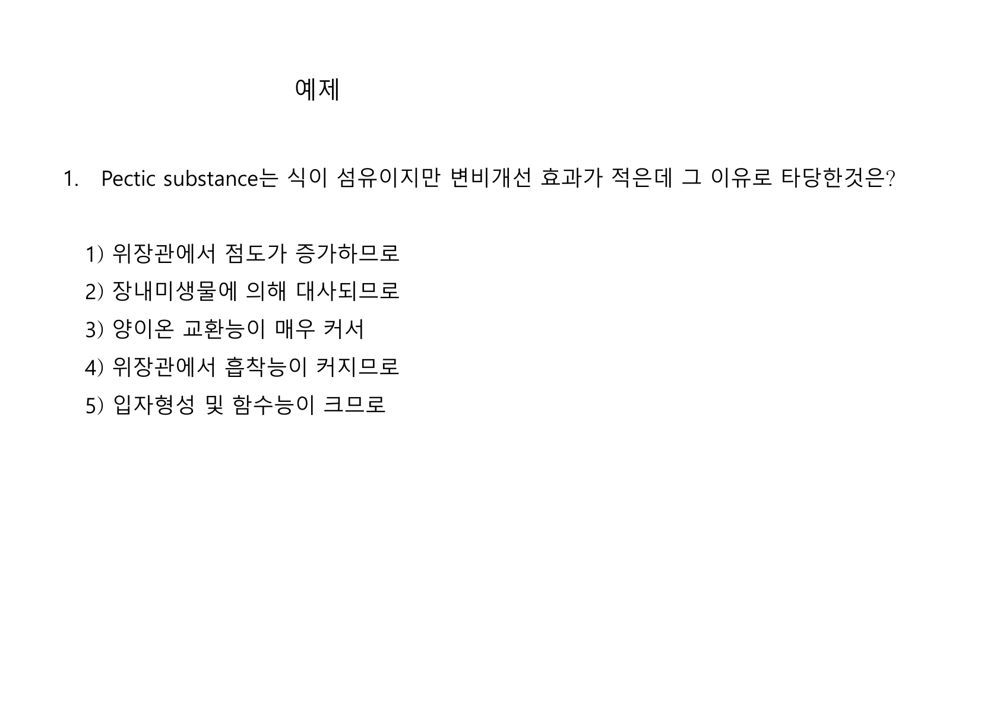
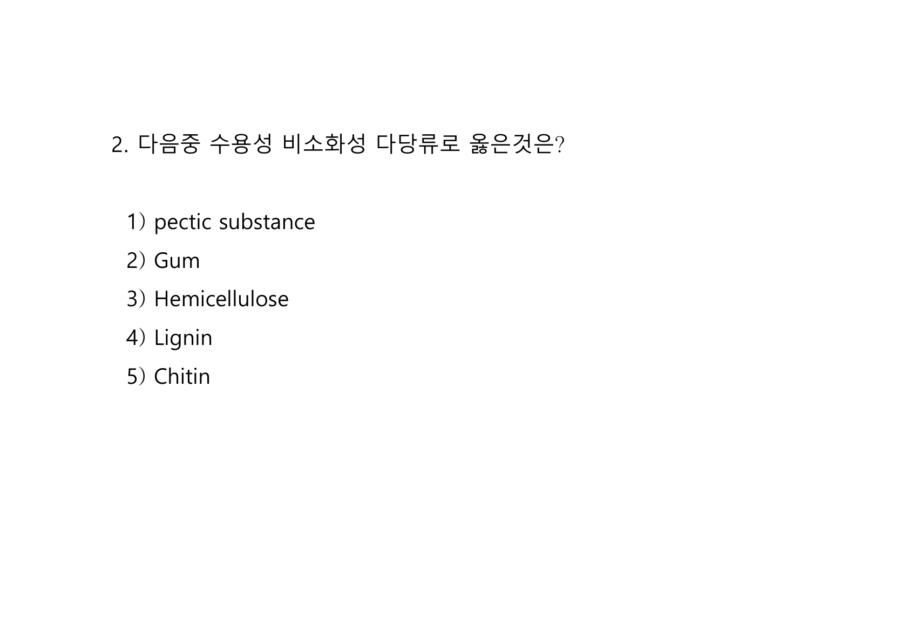

# 문제

트랜스지방산 설명으로 옳은 것을 모두 고르시오.

- 식물성 기름에 수소를 첨가하여 고형화하는 과정과 관련된다.
- 혈중 LDL 콜레스테롤을 상승시키고 HDL 콜레스테롤을 감소시킬 수 있다.
- 포화지방산보다 심혈관계 질환 위험이 낮다고 보고된다.
- 트랜스지방 함량이 많은 제과류와 튀김요리는 섭취를 피해야 한다.

답: 아래 표시 보기
O 식물성 기름에 수소를 첨가하여 고형화하는 과정과 관련된다. // 부분경화 과정에서 cis 이중결합 일부가 trans 형태로 바뀔 수 있다.
O 혈중 LDL 콜레스테롤을 상승시키고 HDL 콜레스테롤을 감소시킬 수 있다. // LDL은 올리고 HDL은 낮추는 방향이라 심혈관 위험과 연결된다.
O 트랜스지방 함량이 많은 제과류와 튀김요리는 섭취를 피해야 한다. // 가공ㆍ튀김 식품은 부분경화유 사용과 반복 가열 때문에 노출원이 될 수 있다.
X 포화지방산보다 심혈관계 질환 위험이 낮다고 보고된다. -> 트랜스지방산은 심혈관계 질환 위험을 높이는 방향으로 설명된다. LDL 상승과 HDL 감소 쪽으로 연결해 외운다.
출처: G:\내 드라이브\여형준님\21 6-1\예방약학\기말고사 정리자료\예방약학 기말고사 범위 수업자료.pdf p.69
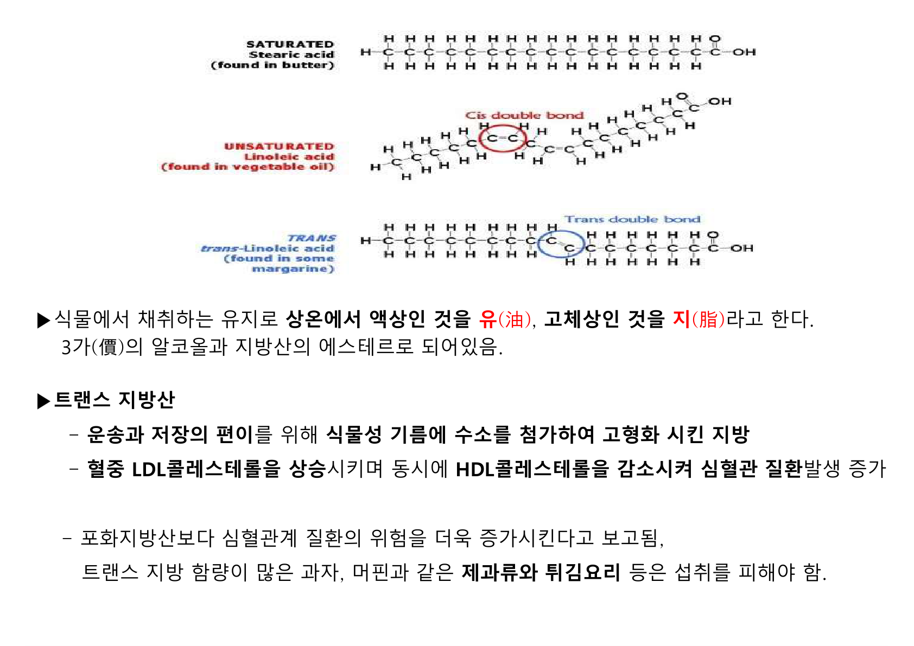

# 문제

지단백질 운반에 관한 설명으로 옳은 것을 모두 고르시오.

- VLDL은 간에서 형성되어 내인성 TG 운반과 관련된다.
- LDL은 TG를 주로 포함하며 콜레스테롤 운반과는 무관하다.
- HDL은 말초조직의 콜레스테롤을 간으로 보내는 reverse cholesterol transport와 관련된다.
- 과도한 oxidized LDL은 macrophage를 foam cell로 변형시켜 plaque 생성과 연결된다.
- FFA는 알부민 등 혈장 단백질에 부착되어 대사조직으로 운반될 수 있다.

답: 아래 표시 보기
O VLDL은 간에서 형성되어 내인성 TG 운반과 관련된다. // 간에서 만든 중성지방을 말초로 보내는 운반체가 VLDL이다.
O HDL은 말초조직의 콜레스테롤을 간으로 보내는 reverse cholesterol transport와 관련된다. // HDL은 콜레스테롤 회수 쪽이라 보호적 역할로 외운다.
O 과도한 oxidized LDL은 macrophage를 foam cell로 변형시켜 plaque 생성과 연결된다. // 산화 LDL을 먹은 macrophage가 거품세포가 되어 동맥경화 plaque를 만든다.
O FFA는 알부민 등 혈장 단백질에 부착되어 대사조직으로 운반될 수 있다. // 자유지방산은 물에 잘 안 녹아 혈장 단백질에 붙어 이동한다.
X LDL은 TG를 주로 포함하며 콜레스테롤 운반과는 무관하다. -> LDL은 **콜레스테롤 운반**과 관련된다. TG 운반은 chylomicronㆍVLDL 쪽, LDL은 콜레스테롤 운반 쪽으로 구분한다.
출처: G:\내 드라이브\여형준님\21 6-1\예방약학\기말고사 정리자료\예방약학 기말고사 범위 수업자료.pdf p.101, p.103, p.105
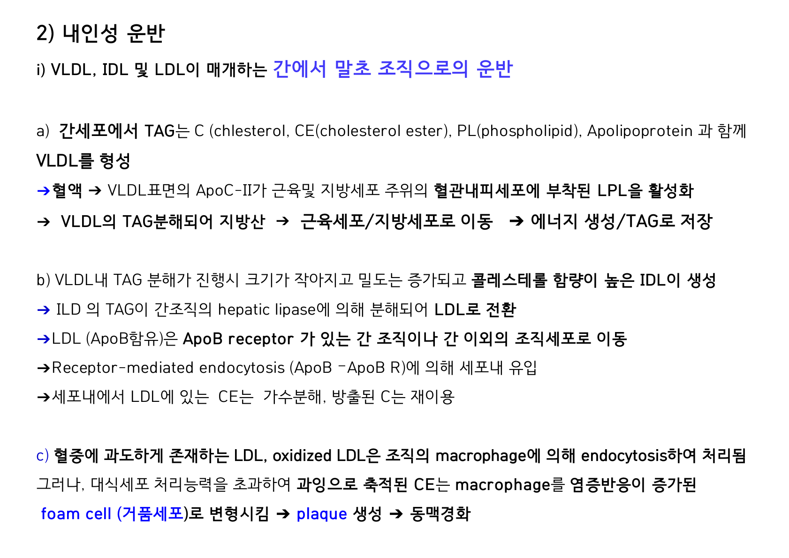
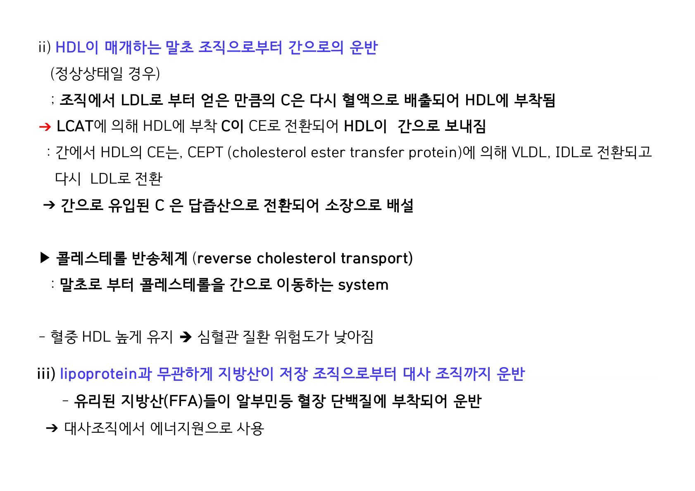
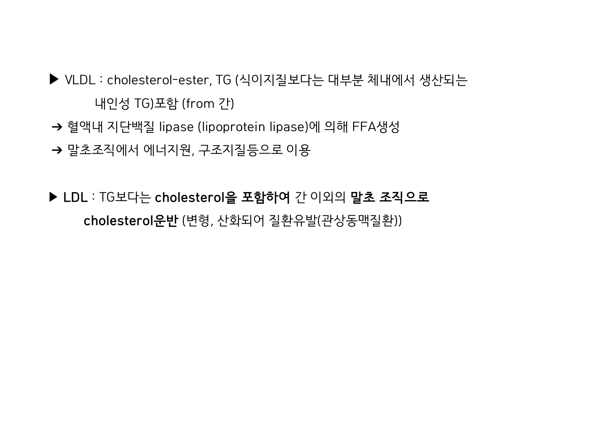

# 문제

동맥경화증 설명으로 옳은 것을 모두 고르시오.

- 초기에는 산화된 LDL이 혈관 intima에 축적될 수 있다.
- plaque에는 콜레스테롤이 주요하게 축적된다.
- HDL 농도가 높으면 심혈관계 질환 발생률이 낮아지는 방향과 연결된다.
- n-3 지방산은 VLDL과 LDL을 낮추고 HDL을 높이는 방향으로 동맥경화 예방과 연결된다.
- foam cell은 plaque 형성을 억제하는 보호세포로만 작용한다.

답: 아래 표시 보기
O 초기에는 산화된 LDL이 혈관 intima에 축적될 수 있다. // 동맥경화 시작은 혈관 안쪽에 산화 LDL이 쌓이는 흐름으로 잡는다.
O plaque에는 콜레스테롤이 주요하게 축적된다. // foam cell과 지질 축적이 plaque의 중심 내용이다.
O HDL 농도가 높으면 심혈관계 질환 발생률이 낮아지는 방향과 연결된다. // HDL은 말초 콜레스테롤을 회수하므로 높을수록 보호적으로 본다.
O n-3 지방산은 VLDL과 LDL을 낮추고 HDL을 높이는 방향으로 동맥경화 예방과 연결된다. // n-3는 혈중 지질 profile을 개선하는 쪽으로 설명된다.
X foam cell은 plaque 형성을 억제하는 보호세포로만 작용한다. -> foam cell은 plaque 형성과 연결된다. macrophage가 oxidized LDL을 먹어 foam cell이 되고 plaque 형성으로 이어진다.
출처: G:\내 드라이브\여형준님\21 6-1\예방약학\기말고사 정리자료\예방약학 기말고사 범위 수업자료.pdf p.125, p.126, p.130
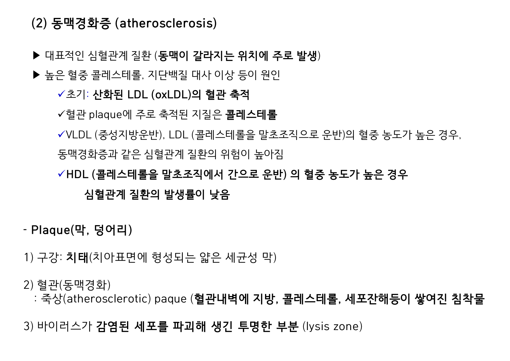
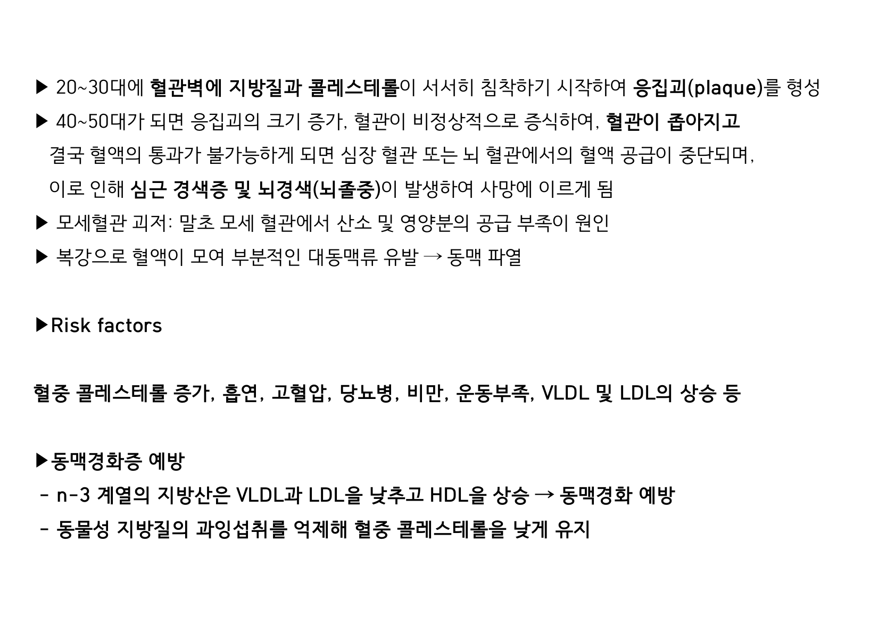
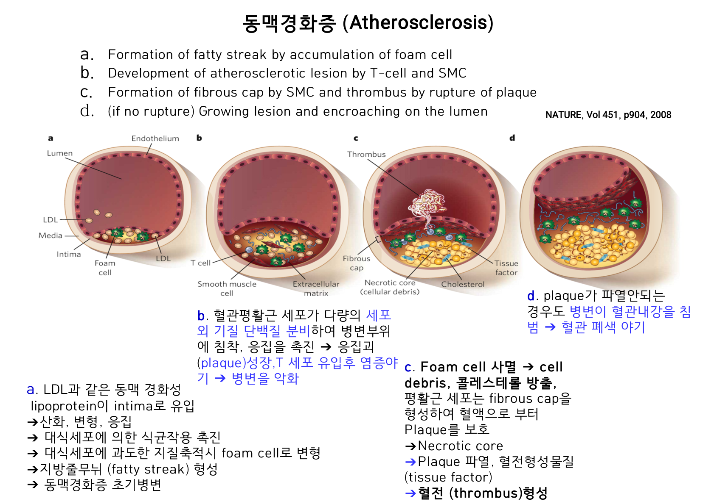

# 문제

질소균형방법 설명으로 옳은 것을 모두 고르시오.

- 질소균형은 섭취량에서 뇨, 변, 피부손실을 통한 배설을 뺀 값으로 본다.
- 양성 질소균형은 유소년기, 임신ㆍ수유기, 병후회복기와 연결된다.
- 음성 질소균형은 흡수에 비해 질소 배설이 과량인 상태와 연결된다.
- 뇨로 배설되는 질소 형태에는 요소, 암모니아, 요산, 크레아티닌 등이 포함된다.
- 질소균형이 0이면 체내 단백질 이용 조절과 무관하게 항상 병적 상태이다.

답: 아래 표시 보기
O 질소균형은 섭취량에서 뇨, 변, 피부손실을 통한 배설을 뺀 값으로 본다. // 단백질 대사는 들어온 질소와 나간 질소 차이로 상태를 본다.
O 양성 질소균형은 유소년기, 임신ㆍ수유기, 병후회복기와 연결된다. // 몸이 조직을 만들거나 회복할 때는 질소 보유가 배설보다 많다.
O 음성 질소균형은 흡수에 비해 질소 배설이 과량인 상태와 연결된다. // 단백질 분해가 커지면 나가는 질소가 많아져 음성이 된다.
O 뇨로 배설되는 질소 형태에는 요소, 암모니아, 요산, 크레아티닌 등이 포함된다. // 단백질 대사 산물은 주로 소변 질소 형태로 빠져나간다.
X 질소균형이 0이면 체내 단백질 이용 조절과 무관하게 항상 병적 상태이다. -> 질소균형 0은 **정상 성인 유지상태**로 설명된다. 섭취와 배설이 균형이면 성장도 손실도 아닌 유지 상태이다.
출처: G:\내 드라이브\여형준님\21 6-1\예방약학\기말고사 정리자료\예방약학 기말고사 범위 수업자료.pdf p.147
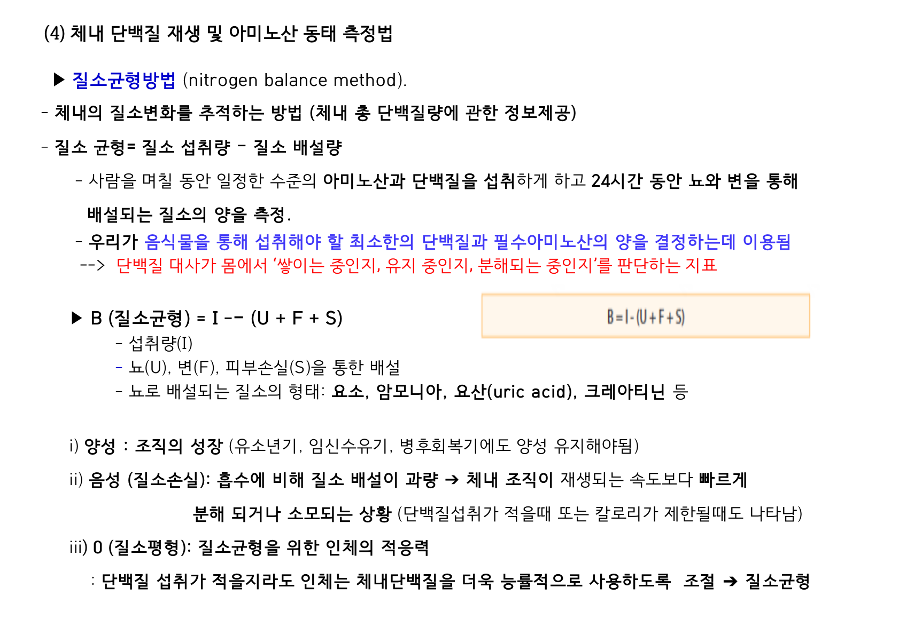

# 문제

선천성 아미노산 대사이상증 설명으로 옳은 것을 모두 고르시오.

- 페닐케톤뇨증은 phenylalanine hydroxylase 기능 저하와 연결된다.
- 호모시스틴뇨증은 methionine 대사 이상 및 homocysteine 축적과 연결된다.
- 단풍시럽뇨증은 isoleucine, leucine, valine 대사 이상과 연결된다.
- 호모시스틴뇨증 치료에서는 Met 섭취 제한과 다른 영양소 보충이 언급된다.
- 단풍시럽뇨증은 aromatic amino acid만 제한하면 된다.

답: 아래 표시 보기
O 페닐케톤뇨증은 phenylalanine hydroxylase 기능 저하와 연결된다. // Phenylalanine을 tyrosine으로 넘기는 효소가 막히는 질환이다.
O 호모시스틴뇨증은 methionine 대사 이상 및 homocysteine 축적과 연결된다. // Methionine 대사 흐름이 막히면 homocysteine이 쌓인다.
O 단풍시럽뇨증은 isoleucine, leucine, valine 대사 이상과 연결된다. // 세 가지 가지사슬아미노산 대사 이상으로 묶어 외운다.
O 호모시스틴뇨증 치료에서는 Met 섭취 제한과 다른 영양소 보충이 언급된다. // 원인 대사물질 공급을 줄이고 관련 비타민 보충을 같이 고려한다.
X 단풍시럽뇨증은 aromatic amino acid만 제한하면 된다. -> 단풍시럽뇨증은 **Ile, Leu, Val** 제한과 연결된다. aromatic amino acid 제한은 phenylketonuria 쪽 함정이다.
출처: G:\내 드라이브\여형준님\21 6-1\예방약학\기말고사 정리자료\예방약학 기말고사 범위 수업자료.pdf p.168, p.172, p.176
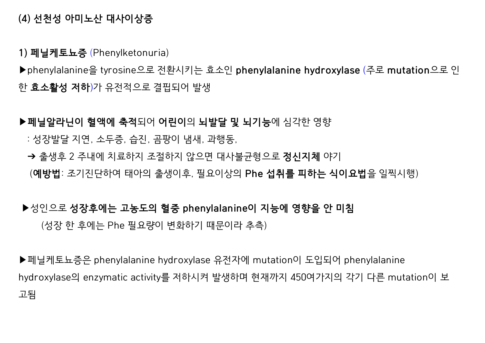
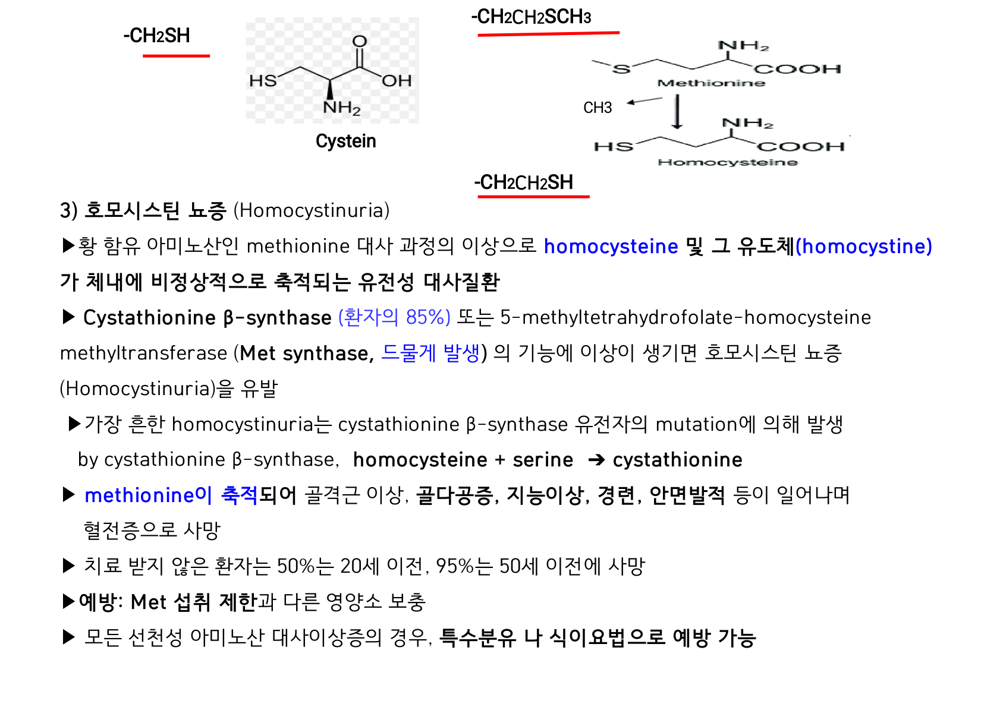

# 문제

비타민 분류 및 기능으로 옳은 것을 모두 고르시오.

- 지용성 비타민에는 A, D, E, K가 포함된다.
- vitamin A와 D는 과다 축적 시 중독증상이 특히 문제될 수 있다.
- 수용성 비타민은 필요 이상 섭취 시 주로 소변으로 배설된다.
- vitamin K는 혈액응고와 관련된다.
- vitamin A와 D는 유전자 발현조절에도 관여할 수 있다.

답: 아래 표시 보기
O 지용성 비타민에는 A, D, E, K가 포함된다. // ADEK는 지방에 녹아 저장되기 쉬운 비타민 묶음이다.
O vitamin A와 D는 과다 축적 시 중독증상이 특히 문제될 수 있다. // 지용성이라 몸에 남기 쉬워 과량 섭취 시 독성이 문제된다.
O 수용성 비타민은 필요 이상 섭취 시 주로 소변으로 배설된다. // 물에 녹는 비타민은 저장보다 배설이 쉬운 쪽이다.
O vitamin K는 혈액응고와 관련된다. // Vitamin K는 응고인자 carboxylation에 필요한 비타민으로 잡는다.
O vitamin A와 D는 유전자 발현조절에도 관여할 수 있다. // A와 D는 핵수용체를 통해 전사 조절에 관여하는 쪽으로 설명된다.
출처: G:\내 드라이브\여형준님\21 6-1\예방약학\기말고사 정리자료\예방약학 기말고사 범위 수업자료.pdf p.181
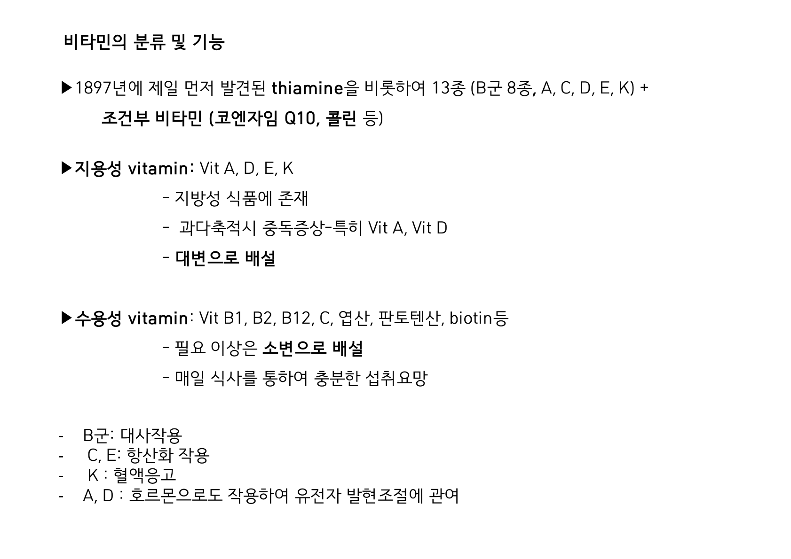

# 문제

비타민 B군과 조효소 연결로 옳은 것을 모두 고르시오.

- vitamin B1(thiamine)은 TPP 형태로 대사되어 당대사효소 보조효소로 작용한다.
- vitamin B2(riboflavin)는 FMN, FAD 형태로 산화환원반응에 관여한다.
- vitamin B3(niacin)은 NAD(H), NADP(H)의 전구체이다.
- vitamin B6는 PLP 형태로 아미노산 대사반응의 조효소로 작용한다.
- vitamin B3의 대표 조효소형은 FMN과 FAD이다.

답: 아래 표시 보기
O vitamin B1(thiamine)은 TPP 형태로 대사되어 당대사효소 보조효소로 작용한다. // TPP는 탄수화물 대사 효소의 조효소로 B1 기능을 대표한다.
O vitamin B2(riboflavin)는 FMN, FAD 형태로 산화환원반응에 관여한다. // FMN/FAD는 전자를 주고받는 B2 조효소형이다.
O vitamin B3(niacin)은 NAD(H), NADP(H)의 전구체이다. // NAD/NADP는 산화환원 반응의 대표 보조인자로 niacin에서 온다.
O vitamin B6는 PLP 형태로 아미노산 대사반응의 조효소로 작용한다. // PLP는 transamination과 decarboxylation 등 아미노산 반응에 필요하다.
X vitamin B3의 대표 조효소형은 FMN과 FAD이다. -> FMN과 FAD는 **vitamin B2**의 조효소형이다. B3는 NAD/NADP, B2는 FMN/FAD로 구분한다.
출처: G:\내 드라이브\여형준님\21 6-1\예방약학\기말고사 정리자료\예방약학 기말고사 범위 수업자료.pdf p.185, p.190, p.197, p.207
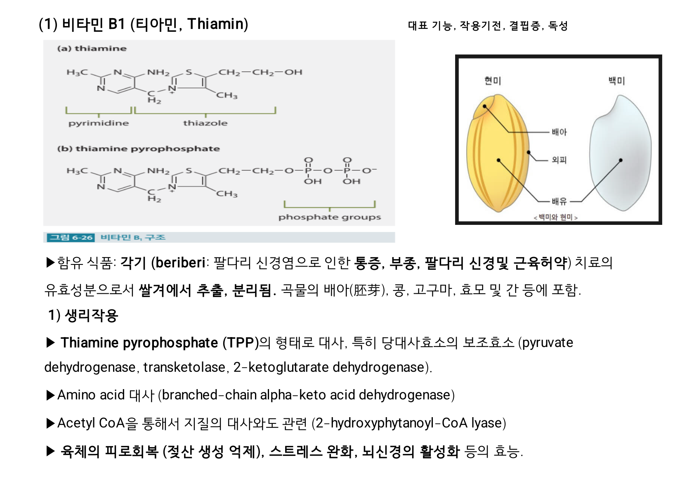
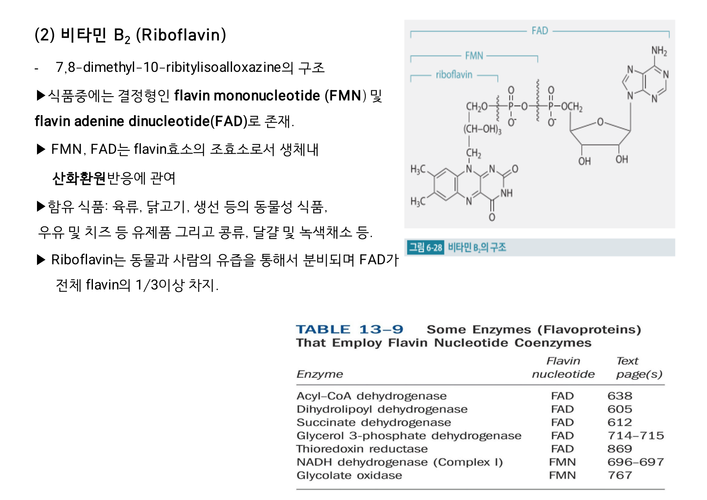
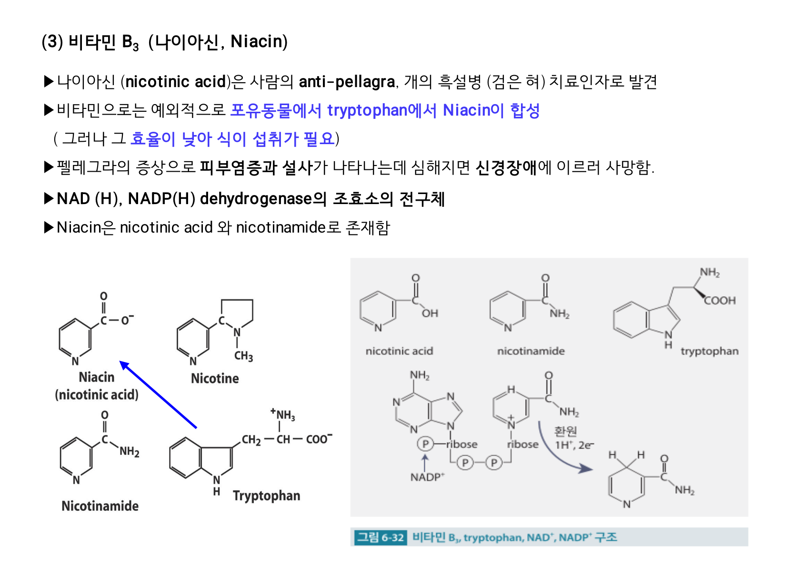
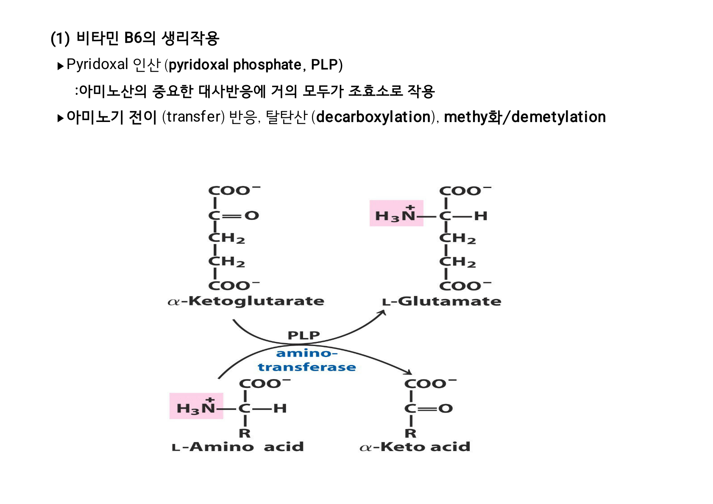

# 문제

Niacin에 관한 설명으로 옳은 것을 모두 고르시오.

- Niacin은 NAD와 NADP의 전구체로 산화ㆍ환원 반응에 참여한다.
- 포유동물에서는 tryptophan으로부터 niacin이 일부 합성될 수 있다.
- Pellagra는 피부염, 설사, 중추신경증상과 연결된다.
- Niacin은 LDL cholesterol 저하, HDL cholesterol 증가와 연결되어 설명된다.
- Niacin 결핍은 피부 증상만 있고 소화기ㆍ중추신경 증상은 없다.

답: 아래 표시 보기
O Niacin은 NAD와 NADP의 전구체로 산화ㆍ환원 반응에 참여한다. // Niacin은 에너지 대사의 전자전달 보조인자 재료이다.
O 포유동물에서는 tryptophan으로부터 niacin이 일부 합성될 수 있다. // Tryptophan이 niacin 전구체처럼 작용할 수 있다.
O Pellagra는 피부염, 설사, 중추신경증상과 연결된다. // Niacin 결핍은 피부ㆍ장ㆍ신경 증상을 함께 일으킨다.
O Niacin은 LDL cholesterol 저하, HDL cholesterol 증가와 연결되어 설명된다. // Niacin은 지질 profile을 개선하는 약리 효과로도 언급된다.
X Niacin 결핍은 피부 증상만 있고 소화기ㆍ중추신경 증상은 없다. -> Niacin 결핍은 **소화기ㆍ중추신경 증상**과도 연결된다. Pellagra는 피부염ㆍ설사ㆍ중추신경증상을 같이 묶는다.
출처: G:\내 드라이브\여형준님\21 6-1\예방약학\기말고사 정리자료\예방약학 기말고사 범위 수업자료.pdf p.197, p.199, p.201

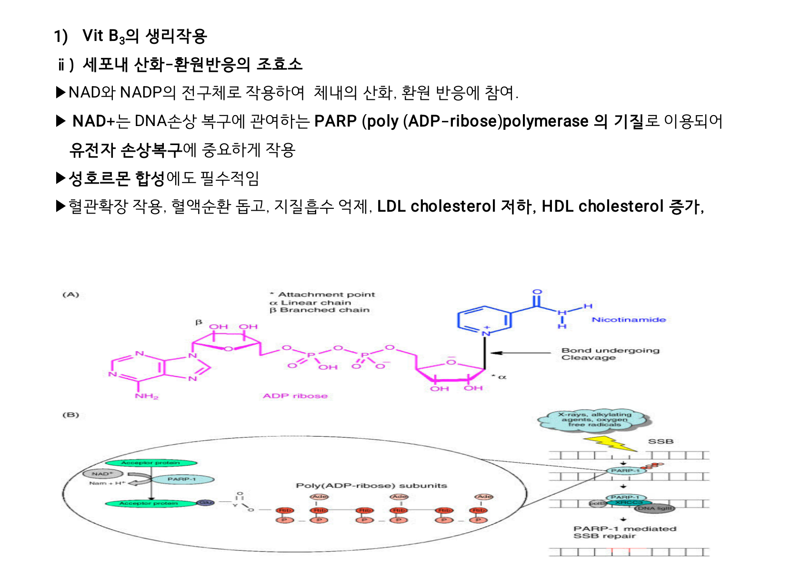
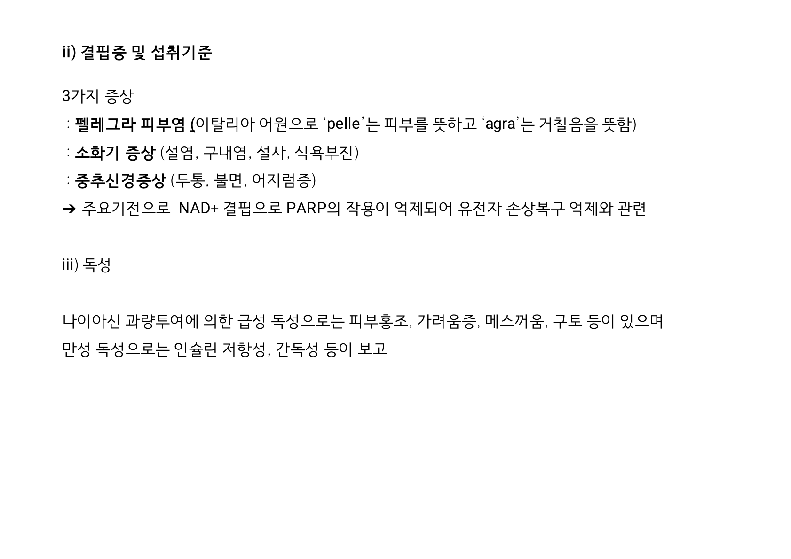

# 문제

Vitamin B6와 PLP에 관한 설명으로 옳은 것을 모두 고르시오.

- PLP는 아미노기 전이와 탈탄산 반응 등에 관여한다.
- PLP는 Hb의 포르피린 고리구조 합성에 중요하다.
- Vitamin B6 결핍은 철분 결핍과 유사한 빈혈 증상과 연결될 수 있다.
- PLP는 GABA, norepinephrine, serotonin 등 신경전달물질 합성과 관련된다.
- PLP는 homocysteine으로부터 cysteine을 합성하는 과정과 무관하다.

답: 아래 표시 보기
O PLP는 아미노기 전이와 탈탄산 반응 등에 관여한다. // PLP는 아미노산의 아미노기 이동과 탈탄산 반응을 돕는다.
O PLP는 Hb의 포르피린 고리구조 합성에 중요하다. // Heme 합성에 필요해 B6 결핍은 빈혈과 연결된다.
O Vitamin B6 결핍은 철분 결핍과 유사한 빈혈 증상과 연결될 수 있다. // 철이 있어도 heme 합성이 막히면 빈혈처럼 보일 수 있다.
O PLP는 GABA, norepinephrine, serotonin 등 신경전달물질 합성과 관련된다. // 신경전달물질 합성에도 아미노산 대사 효소가 필요하다.
X PLP는 homocysteine으로부터 cysteine을 합성하는 과정과 무관하다. -> PLP는 **homocysteine -> cysteine** 과정과 관련된다. Vitamin B6의 조효소형 PLP는 아미노산 대사와 transsulfuration 흐름에서 잡는다.
출처: G:\내 드라이브\여형준님\21 6-1\예방약학\기말고사 정리자료\예방약학 기말고사 범위 수업자료.pdf p.207, p.208, p.211

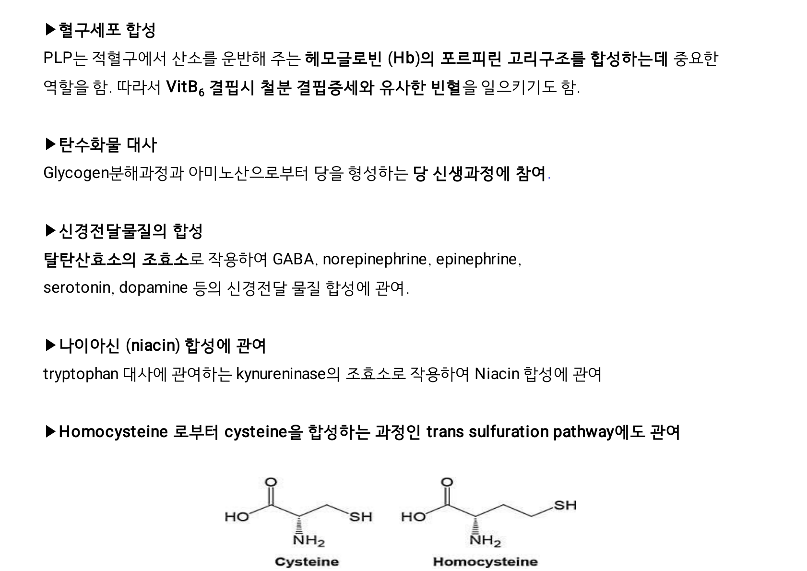
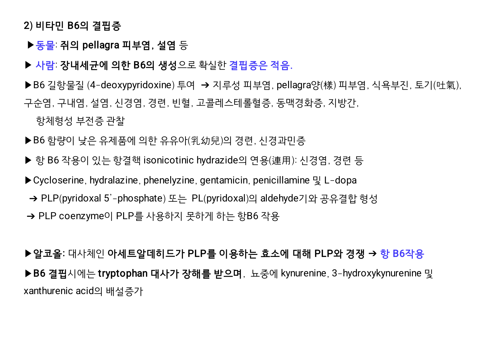

# 문제

무기질과 기능ㆍ질환 연결로 옳은 것을 모두 고르시오.

- Fe 과잉은 hemochromatosis와 연결된다.
- Cu는 lysyl oxidase와 관련되며 콜라겐 가교화에 중요하다.
- Zn은 인슐린 구성성분, 학습능력 향상, 면역기능 향상과 연결된다.
- Se는 glutathione peroxidase와 관련되며 결핍 시 Keshan disease가 언급된다.
- Wilson disease는 Cu 결핍으로 생기는 대표 질환이다.

답: 아래 표시 보기
O Fe 과잉은 hemochromatosis와 연결된다. // 철이 과하게 축적되는 질환이 hemochromatosis이다.
O Cu는 lysyl oxidase와 관련되며 콜라겐 가교화에 중요하다. // Lysyl oxidase가 collagen/elastin 가교 형성에 필요하다.
O Zn은 인슐린 구성성분, 학습능력 향상, 면역기능 향상과 연결된다. // Zn은 효소와 호르몬 구성ㆍ면역 기능에 넓게 관여한다.
O Se는 glutathione peroxidase와 관련되며 결핍 시 Keshan disease가 언급된다. // Se는 항산화 효소 구성과 Keshan disease를 같이 묶는다.
X Wilson disease는 Cu 결핍으로 생기는 대표 질환이다. -> Wilson disease는 **Cu 과잉**과 연결된다. Wilson은 구리 축적 질환이라 결핍과 반대이다.
출처: G:\내 드라이브\여형준님\21 6-1\예방약학\기말고사 정리자료\예방약학 기말고사 범위 수업자료.pdf p.342, p.343, p.347, p.363, p.388
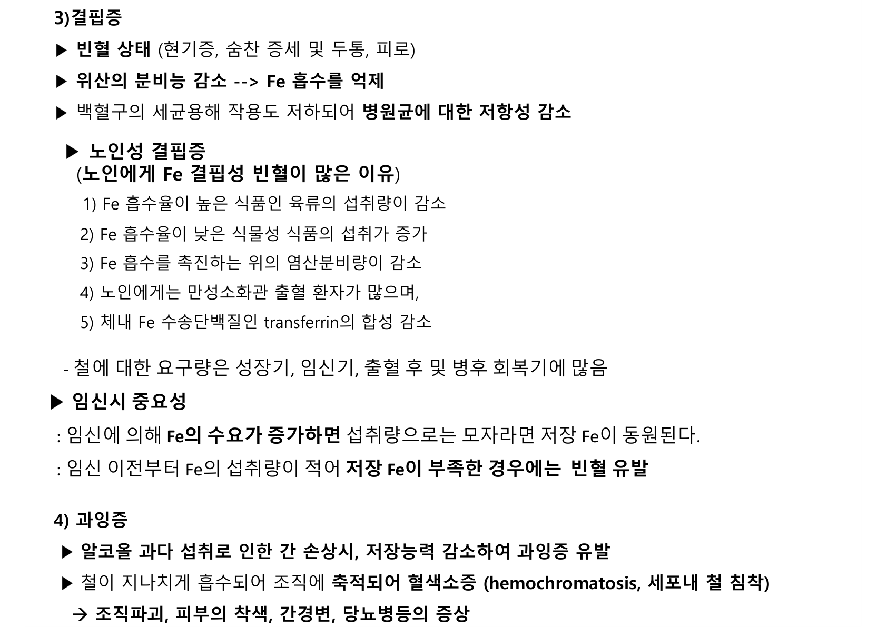
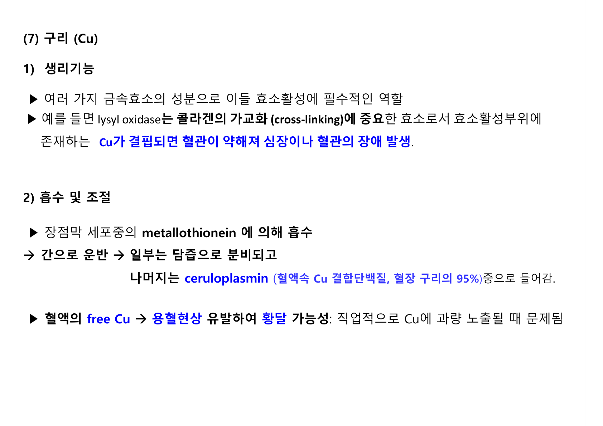

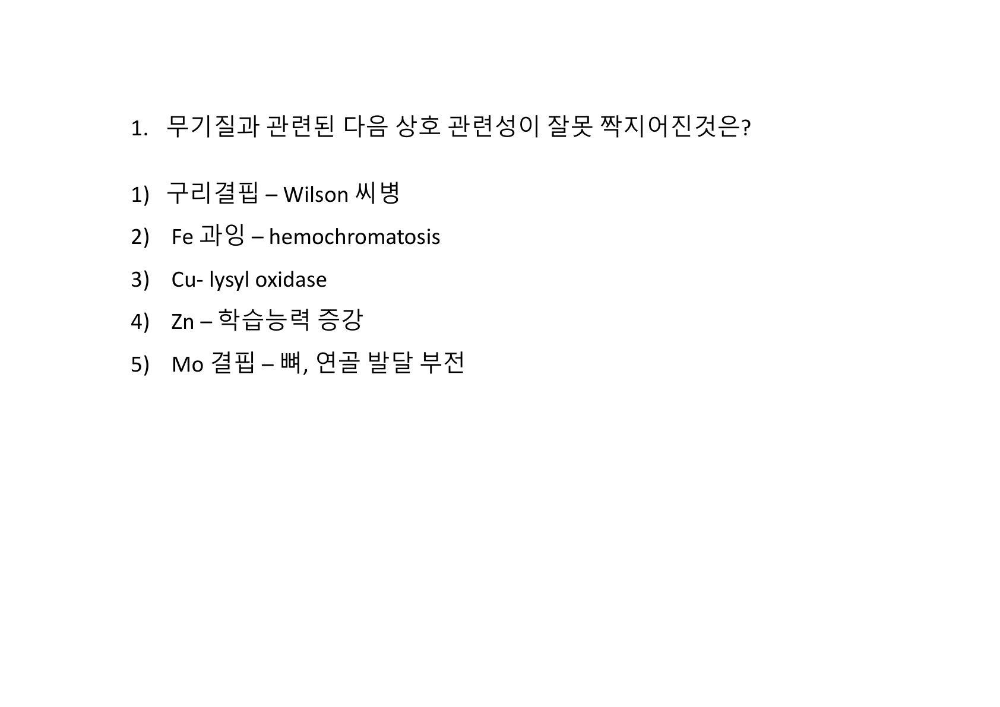

# 문제

건강기능식품 소재와 효능 연결로 옳은 것을 모두 고르시오.

- 코엔자임Q10은 항산화, 항고혈압 효능과 연결된다.
- 녹차추출물의 카테킨 중 EGCG가 많이 존재하고 생리활성이 높다고 설명된다.
- 빌베리추출물은 눈의 피로개선과 연결된다.
- MSM은 관절 및 연골 건강 개선과 연결된다.
- 프로폴리스추출물은 구강에서 항균작용에 도움과 연결된다.
- 밀크씨슬추출물은 전립선 건강 개선이 주효능이다.

답: 아래 표시 보기
O 코엔자임Q10은 항산화, 항고혈압 효능과 연결된다. // CoQ10은 전자전달계와 항산화 기능을 같이 떠올리면 된다.
O 녹차추출물의 카테킨 중 EGCG가 많이 존재하고 생리활성이 높다고 설명된다. // EGCG는 녹차 catechin 중 대표 활성 성분으로 잡는다.
O 빌베리추출물은 눈의 피로개선과 연결된다. // 빌베리는 안토시아닌 계열과 눈 기능 쪽으로 묶는다.
O MSM은 관절 및 연골 건강 개선과 연결된다. // MSM은 황 함유 성분으로 관절ㆍ연골 원료에 둔다.
O 프로폴리스추출물은 구강에서 항균작용에 도움과 연결된다. // 프로폴리스는 항균 작용을 구강 건강과 연결한다.
X 밀크씨슬추출물은 전립선 건강 개선이 주효능이다. -> 밀크씨슬추출물은 **간 건강**과 연결된다. 전립선 건강은 쏘팔메토, 간 건강은 밀크씨슬로 나눠 외운다.
출처: G:\내 드라이브\여형준님\21 6-1\예방약학\기말고사 정리자료\예방약학 기말고사 범위 수업자료.pdf p.405, p.412, p.413

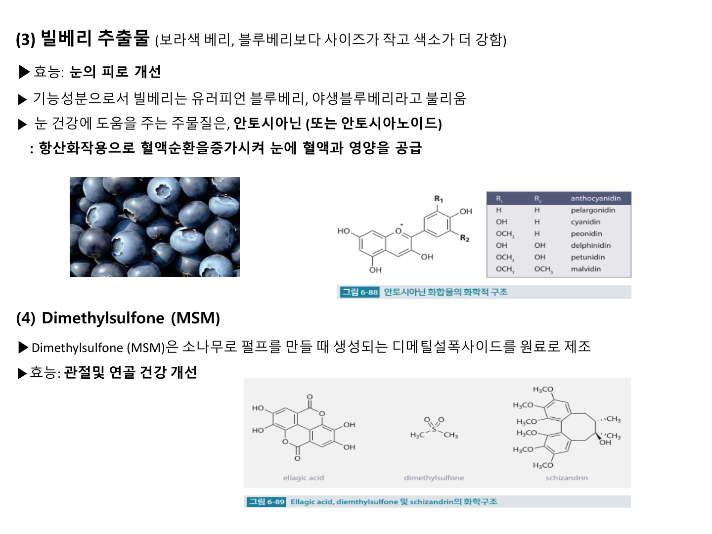
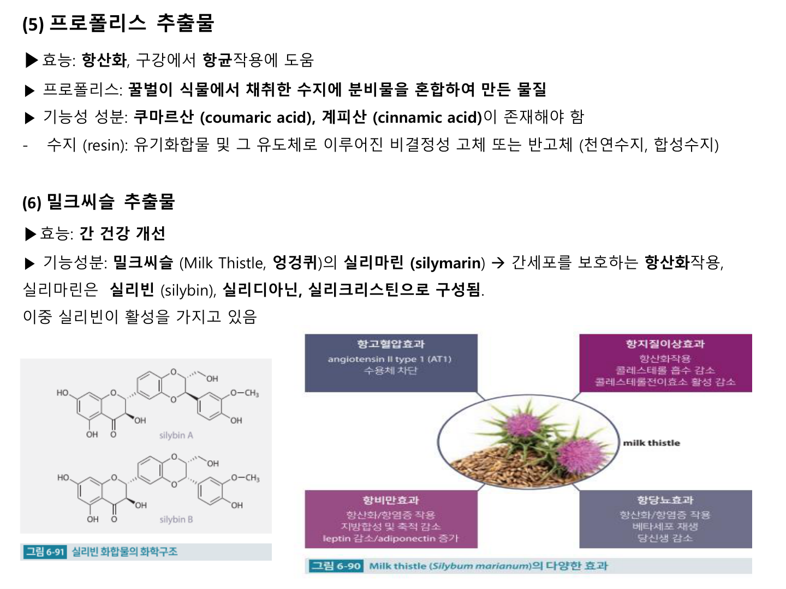

# 문제

Terpene/terpenoid 설명으로 옳은 것을 모두 고르시오.

- Isoprenoid는 C5 isoprene 단위에서 유래된 화합물군이다.
- Terpene은 식물 향기성분과 방어물질 등에 많은 천연탄화수소 또는 그 유도체이다.
- Terpene 분류는 이소프렌 단위 수와 무관하다.
- Monoterpene은 C10, diterpene은 C20으로 분류된다.
- 식물은 terpene을 신호분자 또는 방어물질로 사용할 수 있다.

답: 아래 표시 보기
O Isoprenoid는 C5 isoprene 단위에서 유래된 화합물군이다. // isoprene 한 단위가 C5라 탄소수 분류의 기본이 된다.
O Terpene은 식물 향기성분과 방어물질 등에 많은 천연탄화수소 또는 그 유도체이다. // 식물의 향ㆍ방어 기능 성분에서 terpene 계열이 자주 나온다.
O Monoterpene은 C10, diterpene은 C20으로 분류된다. // C5 단위 2개면 C10, 4개면 C20으로 센다.
O 식물은 terpene을 신호분자 또는 방어물질로 사용할 수 있다. // 향기성 휘발물질이나 방어물질 역할로 생태적 기능을 한다.
X Terpene 분류는 이소프렌 단위 수와 무관하다. -> Terpene 분류는 **이소프렌 단위 수**와 관련된다. Monoterpene은 C10, diterpene은 C20처럼 C5 isoprene 단위가 기준이다.
출처: G:\내 드라이브\여형준님\21 6-1\예방약학\기말고사 정리자료\예방약학 기말고사 범위 수업자료.pdf p.409
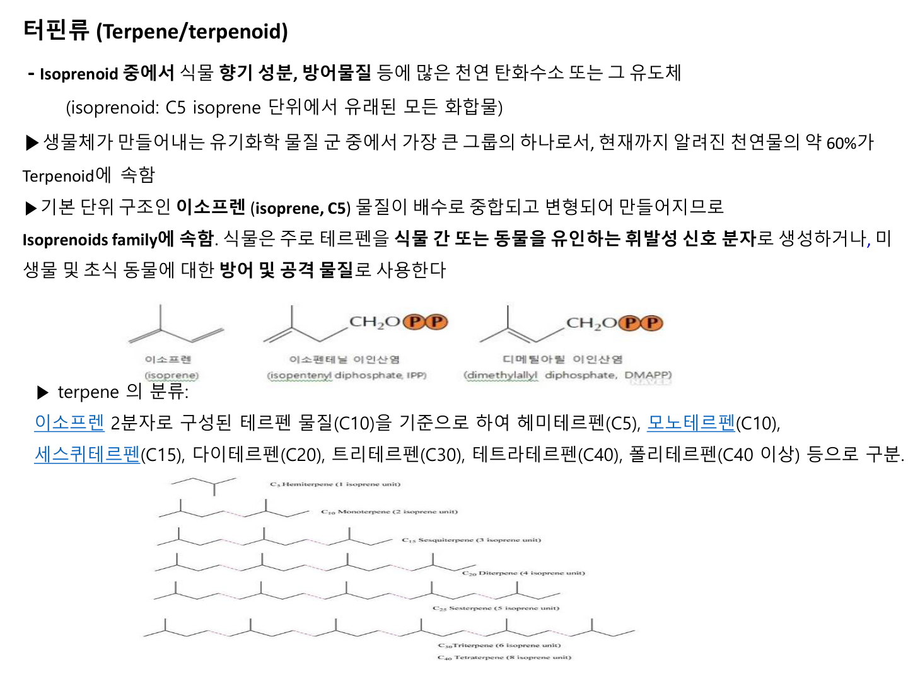

# 문제

기능성 화장품의 미백 평가 관련 설명으로 옳은 것을 모두 고르시오.

- Tyrosinase는 L-tyrosine -> L-DOPA 반응과 관련된다.
- Tyrosinase는 L-DOPA -> dopaquinone 반응과도 관련된다.
- 세포내 멜라닌생성저해시험은 멜라닌세포의 멜라닌 생성량을 비교한다.
- 사람 시험에서는 자외선으로 인공 색소침착을 만든 뒤 피부색을 측정할 수 있다.
- SPF는 미백 효능평가의 tyrosinase 활성억제 지표이다.

답: 아래 표시 보기
O Tyrosinase는 L-tyrosine -> L-DOPA 반응과 관련된다. // Tyrosinase가 멜라닌 합성의 첫 산화 단계를 촉진한다.
O Tyrosinase는 L-DOPA -> dopaquinone 반응과도 관련된다. // L-DOPA 다음 산화 단계도 tyrosinase 활성 평가에 들어간다.
O 세포내 멜라닌생성저해시험은 멜라닌세포의 멜라닌 생성량을 비교한다. // 미백 효과는 실제 멜라닌 생성이 줄었는지를 세포에서 확인한다.
O 사람 시험에서는 자외선으로 인공 색소침착을 만든 뒤 피부색을 측정할 수 있다. // 인체 적용에서는 색소침착을 만든 후 색 변화로 개선 정도를 본다.
X SPF는 미백 효능평가의 tyrosinase 활성억제 지표이다. -> SPF는 **자외선 차단** 지표이지 미백 tyrosinase 활성억제 지표가 아니다. 미백 평가는 tyrosinase 활성억제와 멜라닌 생성 억제를 본다.
출처: G:\내 드라이브\여형준님\21 6-1\예방약학\기말고사 정리자료\예방약학 기말고사 범위 수업자료.pdf p.419, p.423
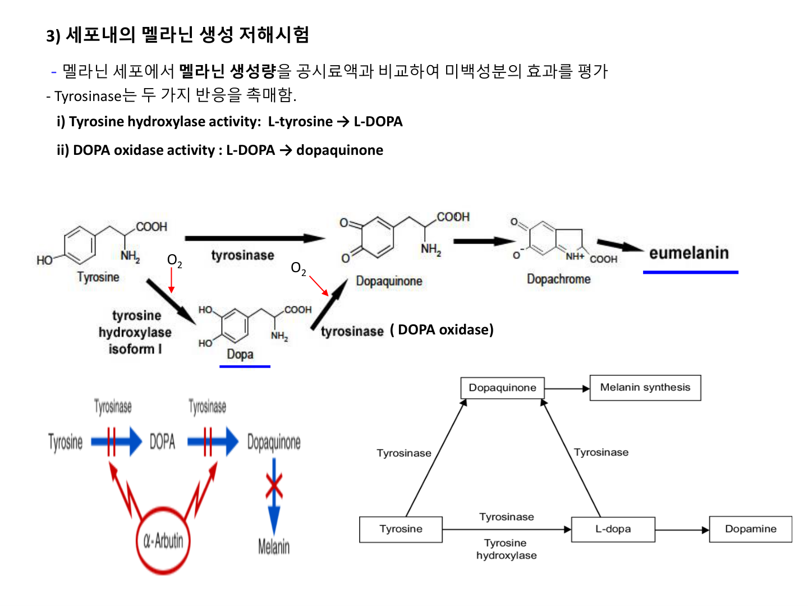
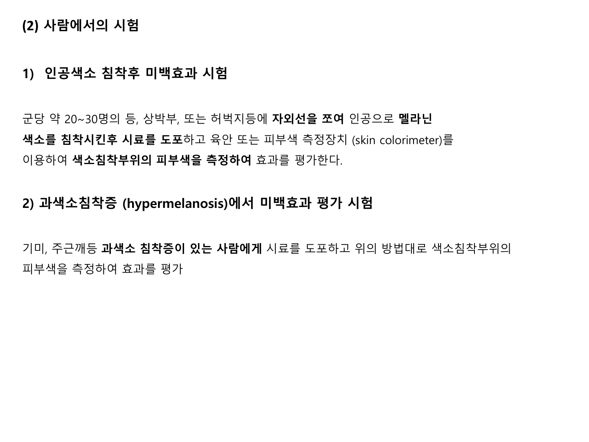

# 문제

식품알레르기 관련 설명으로 옳은 것을 모두 고르시오.

- 구강알레르기증후군은 꽃가루와 식품알레르젠 사이 교차항원성과 관련된다.
- FDEIA는 식품 단독 또는 운동 단독으로도 항상 알레르기가 발생하는 현상이다.
- FDEIA는 식품 섭취 후 운동했을 때 나타나는 알레르기로 설명된다.
- FDEIA의 원인식품에는 밀가루, 육류, 해산물, 과일/야채가 언급된다.
- 식품섭취와 운동 간격은 2시간 이내에서 주로 발병한다고 설명된다.

답: 아래 표시 보기
O 구강알레르기증후군은 꽃가루와 식품알레르젠 사이 교차항원성과 관련된다. // 꽃가루 항원과 비슷한 식품 항원이 입안 증상을 유발한다.
O FDEIA는 식품 섭취 후 운동했을 때 나타나는 알레르기로 설명된다. // 식품 단독보다 운동이 겹칠 때 알레르기 반응이 유발되는 형태이다.
O FDEIA의 원인식품에는 밀가루, 육류, 해산물, 과일/야채가 언급된다. // 특정 한 식품군만이 아니라 여러 식품군이 원인으로 제시된다.
O 식품섭취와 운동 간격은 2시간 이내에서 주로 발병한다고 설명된다. // 식품 흡수와 운동 자극이 가까운 시간에 겹칠 때 위험하다.
X FDEIA는 식품 단독 또는 운동 단독으로도 항상 알레르기가 발생하는 현상이다. -> FDEIA는 식품 섭취 후 **운동했을 때** 나타나는 알레르기이다. 식품과 운동의 조합이 핵심이라 단독으로 항상 발생한다는 보기가 틀린다.
출처: G:\내 드라이브\여형준님\21 6-1\예방약학\기말고사 정리자료\예방약학 기말고사 범위 수업자료.pdf p.523
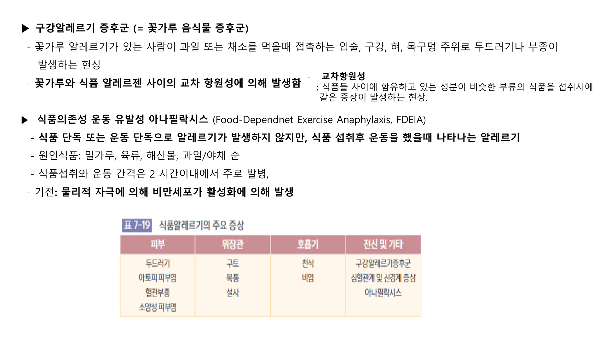

# 문제

Campylobacter와 Listeria 식중독 설명으로 옳은 것을 모두 고르시오.

- Campylobacter jejuni는 미호기성이므로 5~10% 산소 존재하에서 증식한다.
- Campylobacter jejuni는 42℃에서 활발하게 증식하고 열에 의해 쉽게 파괴된다.
- Campylobacter 감염 결과 Guillain-Barre syndrome이 나타날 수 있다.
- Listeria monocytogenes는 냉장온도에서도 생존ㆍ증식할 수 있다.
- Listeria monocytogenes는 일반적으로 -18℃에서도 활발히 증식한다.

답: 아래 표시 보기
O Campylobacter jejuni는 미호기성이므로 5~10% 산소 존재하에서 증식한다. // 산소가 너무 많아도 적어도 안 되고 낮은 산소 농도에서 잘 자란다.
O Campylobacter jejuni는 42℃에서 활발하게 증식하고 열에 의해 쉽게 파괴된다. // 닭 체온에 가까운 온도에서 잘 자라지만 가열에는 약하다.
O Campylobacter 감염 결과 Guillain-Barre syndrome이 나타날 수 있다. // 감염 뒤 면역반응이 신경계 합병증으로 이어질 수 있다.
O Listeria monocytogenes는 냉장온도에서도 생존ㆍ증식할 수 있다. // Listeria는 저온 증식 가능성이 특징이라 냉장식품에서 주의한다.
X Listeria monocytogenes는 일반적으로 -18℃에서도 활발히 증식한다. -> Listeria monocytogenes는 **-18℃에서 활발히 증식**하는 것으로 보지 않는다. 냉장은 가능하지만 냉동에서 활발히 자란다는 뜻은 아니다.
출처: G:\내 드라이브\여형준님\21 6-1\예방약학\기말고사 정리자료\예방약학 기말고사 범위 수업자료.pdf p.538, p.539
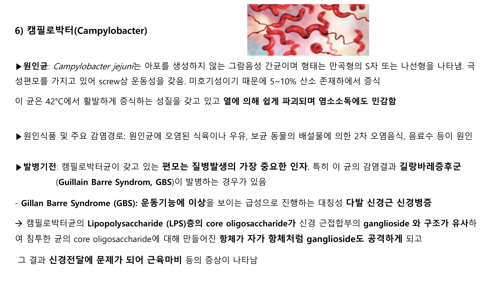
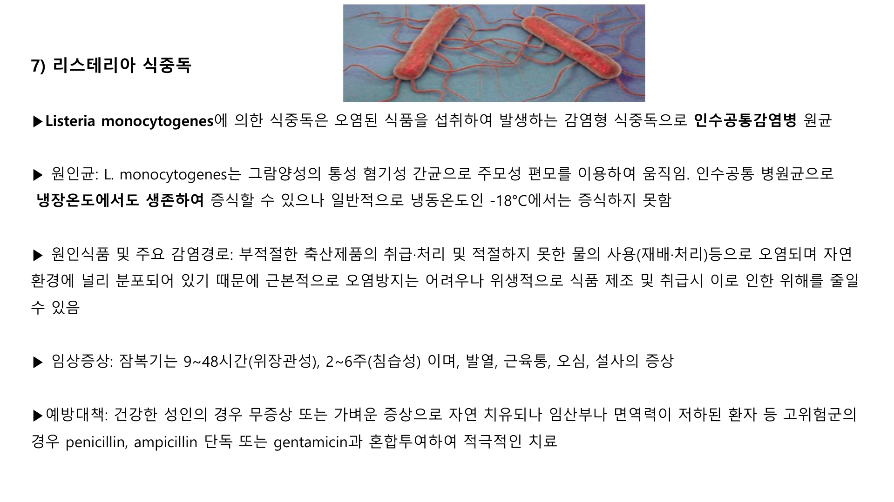

# 문제

감자 solanine 식중독 설명으로 옳은 것을 모두 고르시오.

- 감자의 발아부분과 녹색부분에는 solanine이 다량 함유될 수 있다.
- Solanine 또는 solanidine은 항 cholinesterase 작용과 연결된다.
- 감자의 새싹과 녹색부위는 제거 후 조리하는 것이 예방대책이다.
- Solanine은 일반적 가열에 의해 쉽게 분해되어 제거가 불필요하다.
- 사과와 함께 보관하면 에틸렌으로 감자 발아를 억제할 수 있다고 설명된다.

답: 아래 표시 보기
O 감자의 발아부분과 녹색부분에는 solanine이 다량 함유될 수 있다. // 싹과 녹색 부위가 solanine 축적 부위로 위험하다.
O Solanine 또는 solanidine은 항 cholinesterase 작용과 연결된다. // 신경전달 조절 효소를 억제해 독성을 나타내는 쪽이다.
O 감자의 새싹과 녹색부위는 제거 후 조리하는 것이 예방대책이다. // 독소가 많은 부위를 물리적으로 제거하는 것이 핵심 예방이다.
O 사과와 함께 보관하면 에틸렌으로 감자 발아를 억제할 수 있다고 설명된다. // 발아 억제는 solanine 생성 위험을 줄이는 방향이다.
X Solanine은 일반적 가열에 의해 쉽게 분해되어 제거가 불필요하다. -> Solanine은 일반적 가열로 쉽게 분해된다고 보지 않는다. 열로 해결하려 하지 말고 싹ㆍ녹색부위를 제거해야 한다.
출처: G:\내 드라이브\여형준님\21 6-1\예방약학\기말고사 정리자료\예방약학 기말고사 범위 수업자료.pdf p.563, p.564
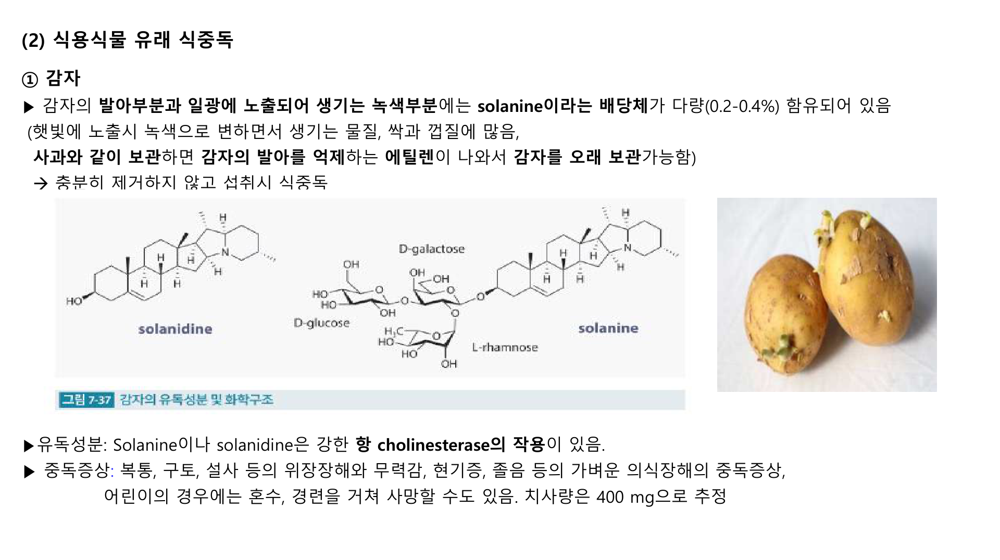
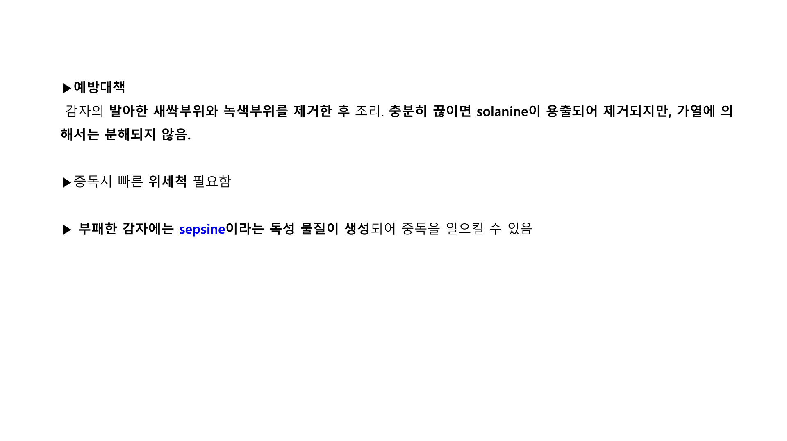

# 문제

곰팡이독과 진균중독증 설명으로 옳은 것을 모두 고르시오.

- Mycotoxin은 곰팡이가 생산하는 2차대사산물로 인간과 동물에 장해를 일으키는 물질이다.
- Mycotoxicosis는 mycotoxin의 경구 섭취로 일어나는 건강장애이다.
- Mycotoxin은 곡류, 두류 및 가공식품 등 탄수화물이 풍부한 식품에 많다고 설명된다.
- Aspergillus, Penicillium, Fusarium 속이 mycotoxin 생성 곰팡이로 언급된다.
- 항생물질은 인축에 독성이 크기 때문에 mycotoxin과 같은 의미로 사용된다.

답: 아래 표시 보기
O Mycotoxin은 곰팡이가 생산하는 2차대사산물로 인간과 동물에 장해를 일으키는 물질이다. // 곰팡이 독소는 성장 산물이지만 사람ㆍ동물에는 독성으로 작용한다.
O Mycotoxicosis는 mycotoxin의 경구 섭취로 일어나는 건강장애이다. // 식품에 오염된 곰팡이독을 먹어서 생기는 중독 상태이다.
O Mycotoxin은 곡류, 두류 및 가공식품 등 탄수화물이 풍부한 식품에 많다고 설명된다. // 곰팡이가 자라기 쉬운 저장 곡류ㆍ두류 식품이 주요 노출원이다.
O Aspergillus, Penicillium, Fusarium 속이 mycotoxin 생성 곰팡이로 언급된다. // 대표 생성 곰팡이 속 이름을 세 묶음으로 외운다.
X 항생물질은 인축에 독성이 크기 때문에 mycotoxin과 같은 의미로 사용된다. -> 항생물질은 **mycotoxin과 같은 의미**가 아니다. 항생물질은 미생물 억제 물질이고 mycotoxin은 곰팡이 독소이다.
출처: G:\내 드라이브\여형준님\21 6-1\예방약학\기말고사 정리자료\예방약학 기말고사 범위 수업자료.pdf p.584
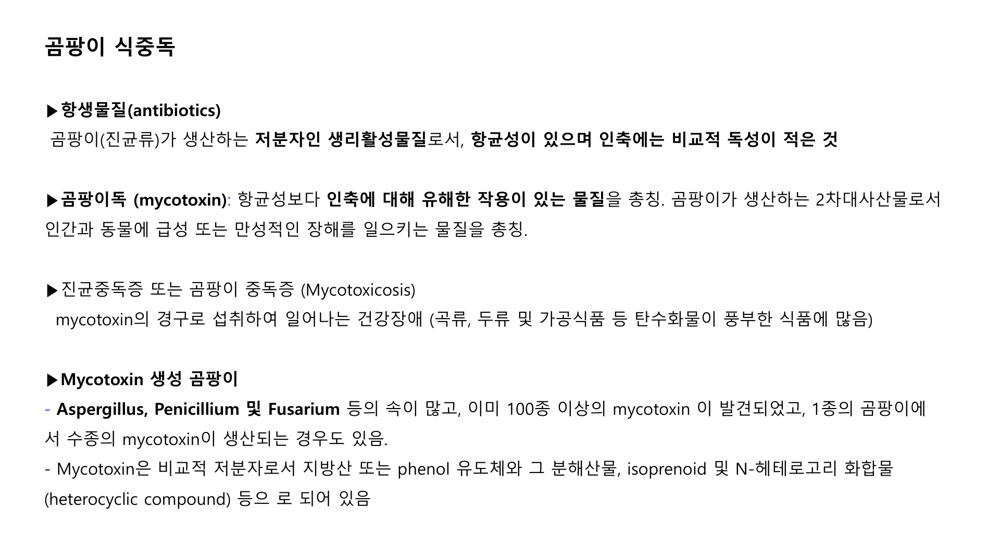

# 문제

조리ㆍ가공ㆍ발효 중 생성되는 유해물질 설명으로 옳은 것을 모두 고르시오.

- Heterocyclic amine은 육류나 어류의 고온 가열조리 시 생성되는 유전독성물질이다.
- Nitrosamine은 아질산염과 2급 아민이 산성조건에서 반응하여 생성될 수 있다.
- Acrylamide는 감자나 곡류처럼 탄수화물 함량이 높은 식품을 높은 온도에서 조리ㆍ가공할 때 생성될 수 있다.
- Ethyl carbamate는 발효과정 중 요소가 알코올과 반응하여 생성될 수 있다.
- Biogenic amine은 미생물에 의한 유리아미노산의 탈탄산 반응으로 생성될 수 있다.
- HCA는 100℃ 이하 조리에서 가장 많이 생성된다고 설명된다.

답: 아래 표시 보기
O Heterocyclic amine은 육류나 어류의 고온 가열조리 시 생성되는 유전독성물질이다. // 단백질성 식품을 높은 온도에서 굽거나 튀길 때 생기는 물질이다.
O Nitrosamine은 아질산염과 2급 아민이 산성조건에서 반응하여 생성될 수 있다. // 보존ㆍ가공 과정의 아질산염과 아민 반응을 연결해 외운다.
O Acrylamide는 감자나 곡류처럼 탄수화물 함량이 높은 식품을 높은 온도에서 조리ㆍ가공할 때 생성될 수 있다. // 탄수화물 식품의 고온 조리에서 생기는 유해물질이다.
O Ethyl carbamate는 발효과정 중 요소가 알코올과 반응하여 생성될 수 있다. // 발효식품에서는 요소와 ethanol 반응을 떠올리면 된다.
O Biogenic amine은 미생물에 의한 유리아미노산의 탈탄산 반응으로 생성될 수 있다. // histamine처럼 아미노산에서 CO2가 빠지며 생기는 아민이다.
X HCA는 100℃ 이하 조리에서 가장 많이 생성된다고 설명된다. -> HCA는 **고온 가열조리**에서 생성된다. 단백질성 식품을 높은 온도로 조리할 때 생기는 유해물질 쪽이다.
출처: G:\내 드라이브\여형준님\21 6-1\예방약학\기말고사 정리자료\예방약학 기말고사 범위 수업자료.pdf p.608, p.609, p.610, p.611, p.612
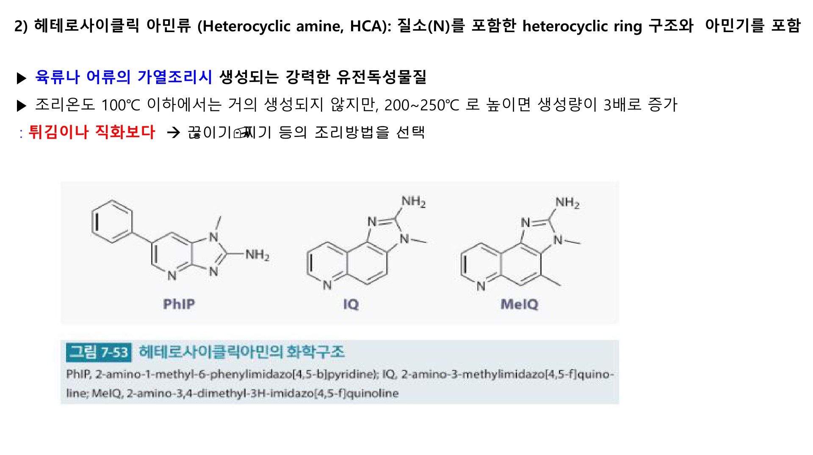
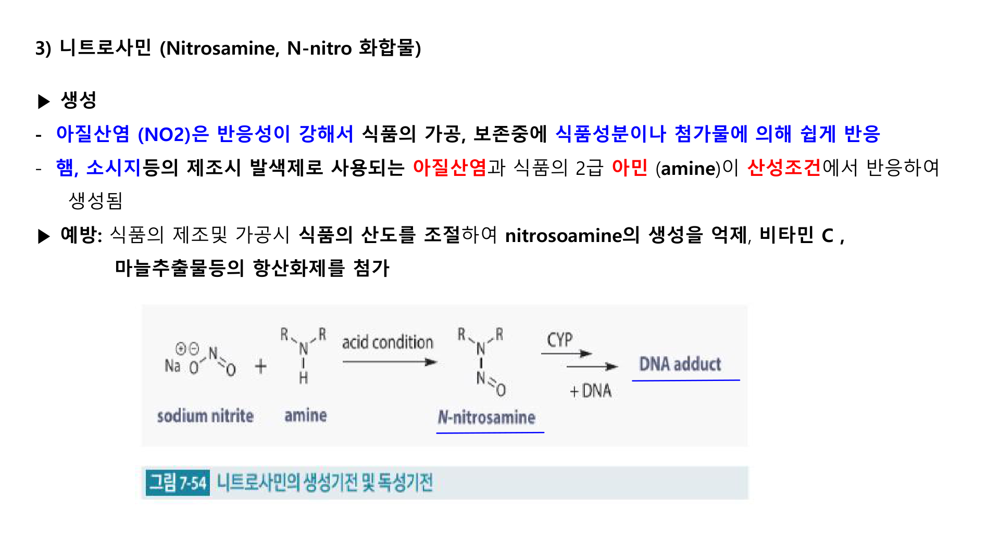
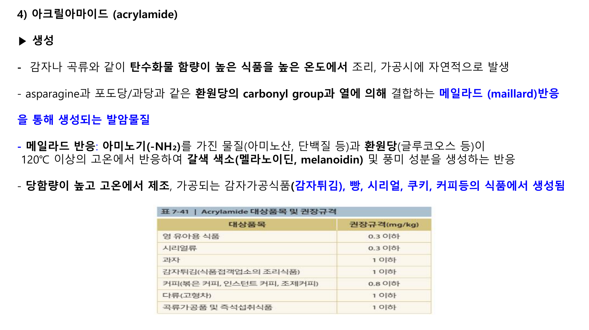
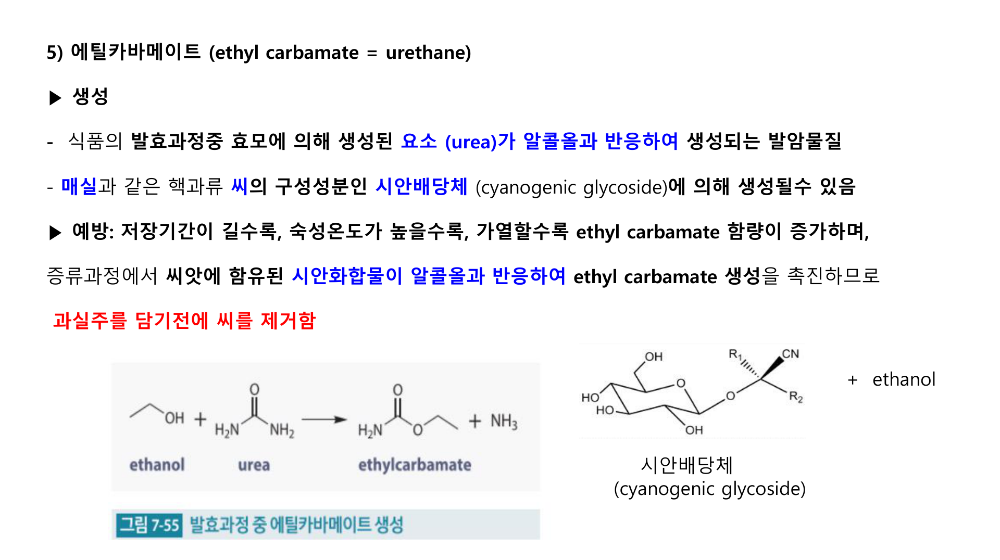
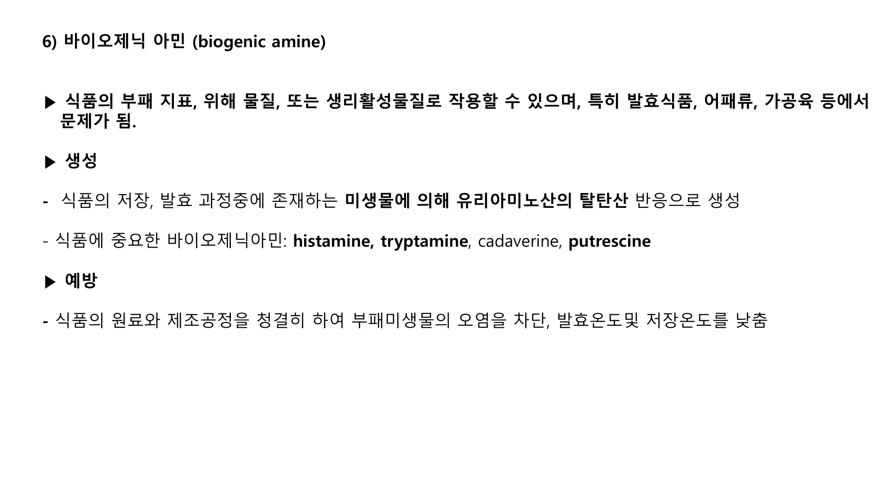

# 문제

식품의 초기부패 판정과 화학적 검사에 관한 설명으로 옳은 것을 모두 고르시오.

- 초기부패 판정에는 관능검사, 화학적 검사, 미생물검사가 언급된다.
- 화학적 검사에는 VBN, histamine, TMA, K 값이 포함된다.
- VBN은 식품추출액을 알칼리성으로 할 때 휘발하는 질소화합물을 총칭한다.
- 해산어패류의 VBN에는 ammonia 외에 trimethylamine이 포함된다.
- TMA는 육류보다 어패류에서 단독 부패지표로 활용되는 내용과 연결된다.

답: 아래 표시 보기
O 초기부패 판정에는 관능검사, 화학적 검사, 미생물검사가 언급된다. // 냄새ㆍ성분변화ㆍ균수 변화를 함께 보아 부패를 판단한다.
O 화학적 검사에는 VBN, histamine, TMA, K 값이 포함된다. // 부패 과정에서 생기는 염기성 질소ㆍ아민ㆍATP 분해 산물을 지표로 본다.
O VBN은 식품추출액을 알칼리성으로 할 때 휘발하는 질소화합물을 총칭한다. // 단백질 분해로 생긴 휘발성 염기성 질소를 합쳐 측정한다.
O 해산어패류의 VBN에는 ammonia 외에 trimethylamine이 포함된다. // 어패류는 TMAO가 TMA로 바뀌어 VBN 구성에 들어간다.
O TMA는 육류보다 어패류에서 단독 부패지표로 활용되는 내용과 연결된다. // TMAO가 많은 어류에서 TMA 증가가 부패 지표로 잘 맞는다.
출처: G:\내 드라이브\여형준님\21 6-1\예방약학\기말고사 정리자료\예방약학 기말고사 범위 수업자료.pdf p.502, p.546
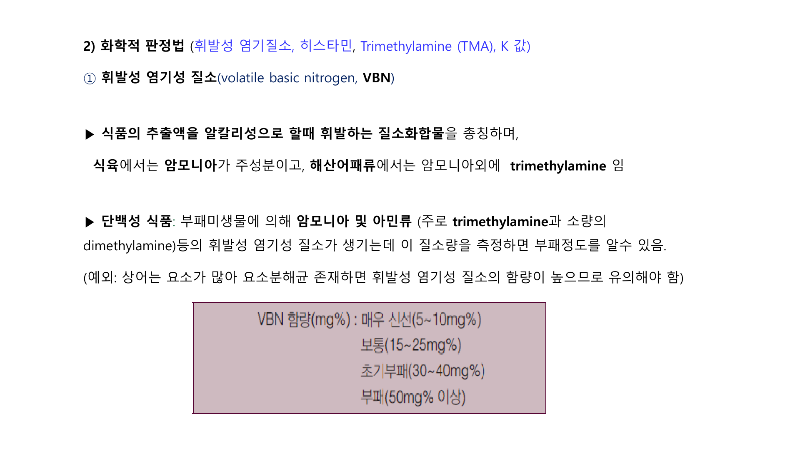
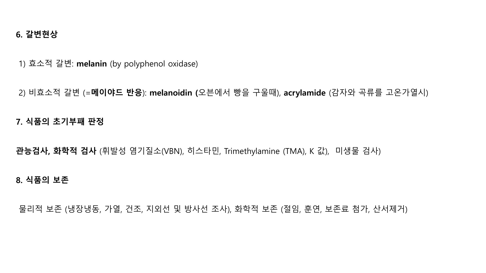

# 문제

식품 보존법 분류와 특징으로 옳은 것을 모두 고르시오.

- 저온처리, 가열살균, 건조, 자외선 및 방사선은 물리적 보존법에 포함된다.
- 절임, 훈연, 보존료 첨가, 산소제거는 화학적 보존법에 포함된다.
- 일반적으로 미생물은 70℃에서 30분간 습열가열로 사멸하지만 아포균은 더 강한 조건이 필요하다.
- 방사선조사는 살균, 살충, 발아 및 발근 억제 목적과 연결된다.
- 방사선조사 보존법은 식품 처리 후 잔류물질이 많아지는 것이 장점이다.

답: 아래 표시 보기
O 저온처리, 가열살균, 건조, 자외선 및 방사선은 물리적 보존법에 포함된다. // 온도ㆍ수분ㆍ광선ㆍ방사선처럼 물리 조건을 바꾸는 방법이다.
O 절임, 훈연, 보존료 첨가, 산소제거는 화학적 보존법에 포함된다. // 화학 성분이나 환경 조성으로 미생물 성장을 억제한다.
O 일반적으로 미생물은 70℃에서 30분간 습열가열로 사멸하지만 아포균은 더 강한 조건이 필요하다. // 영양세포보다 아포가 열에 훨씬 강하다.
O 방사선조사는 살균, 살충, 발아 및 발근 억제 목적과 연결된다. // 미생물ㆍ곤충ㆍ발아를 억제하는 물리적 처리로 쓴다.
X 방사선조사 보존법은 식품 처리 후 잔류물질이 많아지는 것이 장점이다. -> 방사선조사는 식품 처리 후 **잔류물질이 거의 없음**이 장점이다. 식품을 방사성 물질로 만드는 처리가 아니라는 점이 함정이다.
출처: G:\내 드라이브\여형준님\21 6-1\예방약학\기말고사 정리자료\예방약학 기말고사 범위 수업자료.pdf p.510, p.512, p.513, p.514

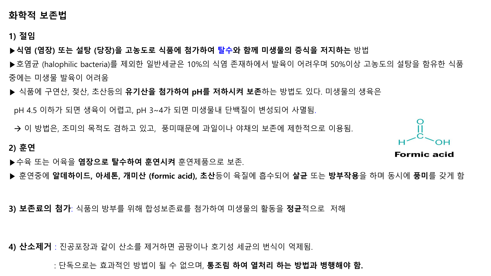
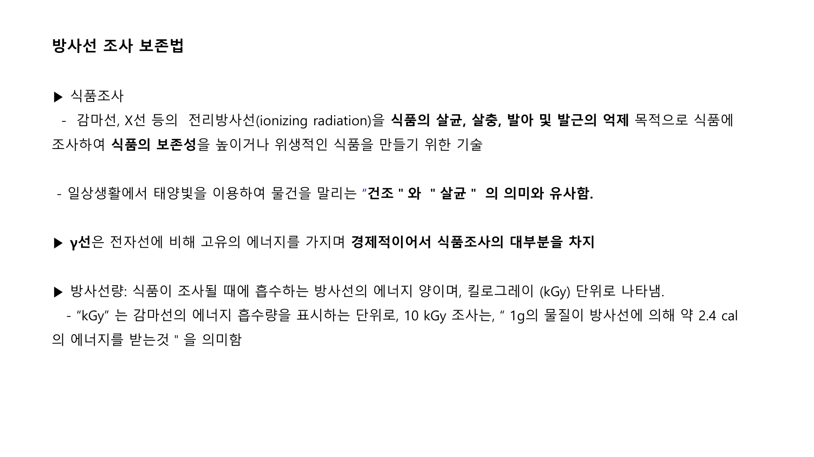

# 문제

보존료와 산성 보존료 설명으로 옳은 것을 모두 고르시오.

- 보존료는 미생물의 발육을 억제하는 정균작용과 연결된다.
- 보존료의 작용은 일반적으로 살균료보다 강하다고 설명된다.
- 소르빈산은 효모와 곰팡이에 강력하고 젖산균이나 혐기성 포자형성균에는 효과가 없다.
- 소르빈산은 식품 pH가 낮을수록 높은 효과를 나타낸다.
- 안식향산은 pH 6 이상에서 효과가 없다.
- 안식향산의 보존기전은 ATP 결핍 및 에너지 대사 억제와 연결된다.

답: 아래 표시 보기
O 보존료는 미생물의 발육을 억제하는 정균작용과 연결된다. // 보존료는 죽이는 것보다 자라지 못하게 하는 쪽이 핵심이다.
O 소르빈산은 효모와 곰팡이에 강력하고 젖산균이나 혐기성 포자형성균에는 효과가 없다. // 소르빈산은 곰팡이ㆍ효모 억제 쪽으로 강하게 외운다.
O 소르빈산은 식품 pH가 낮을수록 높은 효과를 나타낸다. // 산성 보존료는 낮은 pH에서 비해리형이 많아져 세포 안으로 잘 들어간다.
O 안식향산은 pH 6 이상에서 효과가 없다. // pH가 높으면 비해리형이 줄어 세포막 통과와 항균 효과가 떨어진다.
O 안식향산의 보존기전은 ATP 결핍 및 에너지 대사 억제와 연결된다. // 미생물 에너지 대사를 흔들어 증식을 억제한다.
X 보존료의 작용은 일반적으로 살균료보다 강하다고 설명된다. -> 보존료의 작용은 일반적으로 **살균료보다 약하다**. 보존료는 살균보다 미생물 발육 억제 중심으로 본다.
출처: G:\내 드라이브\여형준님\21 6-1\예방약학\기말고사 정리자료\예방약학 기말고사 범위 수업자료.pdf p.632, p.635, p.636
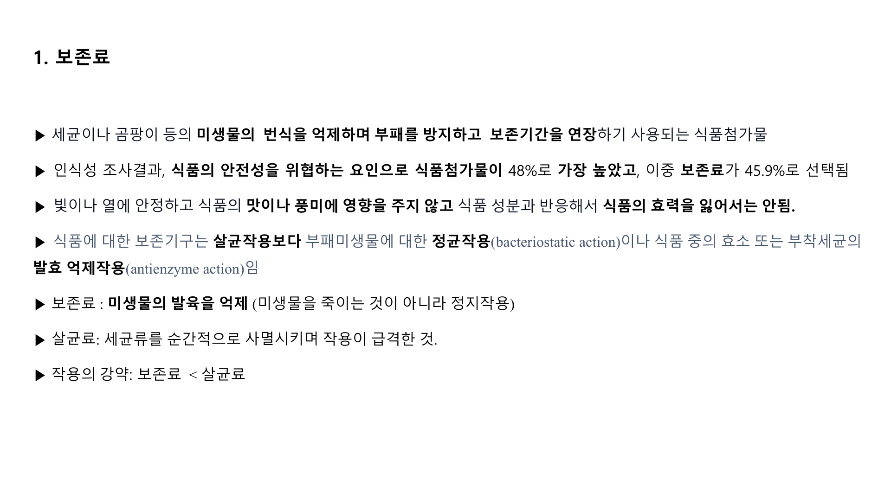

# 문제

Aspartame과 phenylketonuria 관련 설명으로 옳은 것을 모두 고르시오.

- Aspartame은 aspartic acid와 phenylalanine의 peptide 결합 화합물이다.
- Aspartame은 설탕의 약 200배 감미를 가진다고 설명된다.
- Aspartame은 phenylalanine 성분을 함유하므로 phenylketonuria 환자에게 사용이 금지된다.
- Phenylketonuria는 phenylalanine hydroxylase 기능 저하와 관련된다.
- Aspartame은 phenylalanine을 전혀 포함하지 않아 PKU와 무관하다.

답: 아래 표시 보기
O Aspartame은 aspartic acid와 phenylalanine의 peptide 결합 화합물이다. // 구조 자체에 phenylalanine이 들어가 PKU 금기와 연결된다.
O Aspartame은 설탕의 약 200배 감미를 가진다고 설명된다. // 적은 양으로 단맛을 내는 고감미 감미료이다.
O Aspartame은 phenylalanine 성분을 함유하므로 phenylketonuria 환자에게 사용이 금지된다. // PKU 환자는 phenylalanine 대사가 어려워 섭취 제한이 필요하다.
O Phenylketonuria는 phenylalanine hydroxylase 기능 저하와 관련된다. // Phenylalanine을 tyrosine으로 전환하지 못해 축적된다.
X Aspartame은 phenylalanine을 전혀 포함하지 않아 PKU와 무관하다. -> Aspartame은 **phenylalanine**을 포함한다. 그래서 phenylketonuria 환자에게 사용 금지로 연결된다.
출처: G:\내 드라이브\여형준님\21 6-1\예방약학\기말고사 정리자료\예방약학 기말고사 범위 수업자료.pdf p.168, p.643

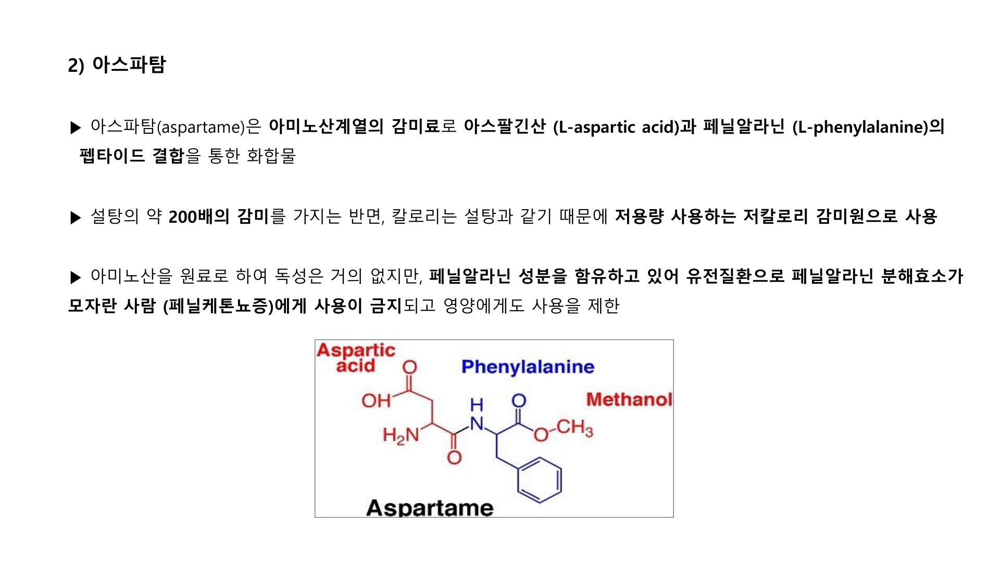

# 문제

식용타르색소 설명으로 옳은 것을 모두 고르시오.

- 식품의 시각적 효과를 높이기 위해 사용하는 합성착색료 중 대표적 식품첨가물이다.
- 석탄타르나 석유에서 얻은 방향족탄화수소를 원료로 합성한다.
- Azo계에는 적색2호, 적색40호, 황색4호, 황색5호가 포함된다.
- 유지식품 착색에는 알루미늄 레이크 형태가 사용될 수 있다.
- 식용타르색소는 모두 지용성 중성물질로만 존재한다.

답: 아래 표시 보기
O 식품의 시각적 효과를 높이기 위해 사용하는 합성착색료 중 대표적 식품첨가물이다. // 색을 보강해 상품성을 높이기 위한 첨가물이다.
O 석탄타르나 석유에서 얻은 방향족탄화수소를 원료로 합성한다. // 타르색소라는 이름은 방향족 탄화수소 원료와 연결된다.
O Azo계에는 적색2호, 적색40호, 황색4호, 황색5호가 포함된다. // Azo 결합을 가진 대표 허용 타르색소 번호를 묶어 둔다.
O 유지식품 착색에는 알루미늄 레이크 형태가 사용될 수 있다. // 물에 녹는 색소를 불용성 lake로 만들어 기름 식품에 쓰기 쉽게 한다.
X 식용타르색소는 모두 지용성 중성물질로만 존재한다. -> 식용타르색소는 모두 지용성 중성물질만 있는 것이 아니다. 유지식품 착색에는 알루미늄 레이크 형태가 쓰일 수 있다.
출처: G:\내 드라이브\여형준님\21 6-1\예방약학\기말고사 정리자료\예방약학 기말고사 범위 수업자료.pdf p.647
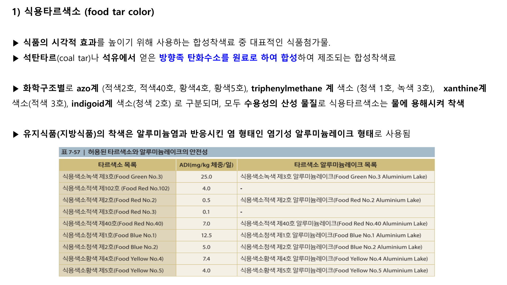

# 문제

단백질 품질 평가 설명으로 옳은 것을 모두 고르시오.

- 달걀단백질은 우수한 단백질 기준으로 언급된다.
- 화학가는 제한아미노산 비율을 이용하여 단백질 영양가를 평가한다.
- 화학가는 소화율이나 실제 체내 이용률을 직접 반영한다.
- 정단백질가는 체내단백질 잔존량 / 단백질 섭취량과 연결된다.
- 단백질효율(PER)은 체중 증가량 / 단백질 섭취량과 연결된다.

답: 아래 표시 보기
O 달걀단백질은 우수한 단백질 기준으로 언급된다. // 필수아미노산 조성이 좋아 비교 기준 단백질로 쓰인다.
O 화학가는 제한아미노산 비율을 이용하여 단백질 영양가를 평가한다. // 가장 부족한 필수아미노산이 단백질 품질을 제한한다.
O 정단백질가는 체내단백질 잔존량 / 단백질 섭취량과 연결된다. // 먹은 단백질 중 몸에 실제 남은 정도를 본다.
O 단백질효율(PER)은 체중 증가량 / 단백질 섭취량과 연결된다. // 단백질 섭취가 성장으로 얼마나 이어졌는지를 보는 지표이다.
X 화학가는 소화율이나 실제 체내 이용률을 직접 반영한다. -> 화학가는 **소화율이나 실제 체내 이용률**을 직접 반영하지 않는다. 제한아미노산 비율로 계산하는 지표라 체내 이용률은 별도 지표로 봐야 한다.
출처: G:\내 드라이브\여형준님\21 6-1\예방약학\기말고사 정리자료\예방약학 기말고사 범위 수업자료.pdf p.150, p.151, p.153
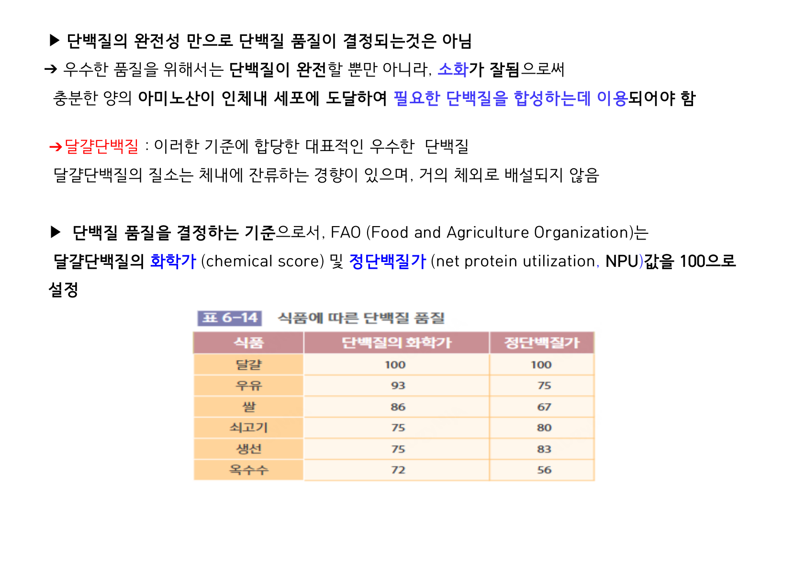

# 문제

필수지방산과 n-6 과잉 설명으로 옳은 것을 모두 고르시오.

- Linoleic acid는 n-6 계열 필수지방산으로 설명된다.
- Linolenic acid는 n-3 계열 필수지방산으로 설명된다.
- Linoleic acid는 arachidonic acid 생성과 관련된다.
- 과잉의 n-6 필수지방산은 VLDL과 LDL 혈중 농도 증가와 연결된다.
- 과잉의 n-6 필수지방산은 HDL 혈중농도 증가와 혈전증 감소로만 작용한다.

답: 아래 표시 보기
O Linoleic acid는 n-6 계열 필수지방산으로 설명된다. // 리놀레산은 n-6 기본 필수지방산으로 시작점처럼 외운다.
O Linolenic acid는 n-3 계열 필수지방산으로 설명된다. // 리놀렌산은 n-3 기본 필수지방산으로 EPA/DHA 계열과 연결된다.
O Linoleic acid는 arachidonic acid 생성과 관련된다. // n-6 리놀레산에서 arachidonic acid 계열로 이어진다.
O 과잉의 n-6 필수지방산은 VLDL과 LDL 혈중 농도 증가와 연결된다. // n-6 과잉은 혈중 지질과 염증성 eicosanoid 쪽으로 불리하게 설명된다.
X 과잉의 n-6 필수지방산은 HDL 혈중농도 증가와 혈전증 감소로만 작용한다. -> 과잉 n-6는 HDL 증가ㆍ혈전증 감소로만 작용하지 않는다. 수업자료에서는 과잉 n-6를 VLDLㆍLDL 증가와 염증ㆍ혈압증가 쪽으로도 연결한다.
출처: G:\내 드라이브\여형준님\21 6-1\예방약학\기말고사 정리자료\예방약학 기말고사 범위 수업자료.pdf p.116, p.117, p.120, p.121
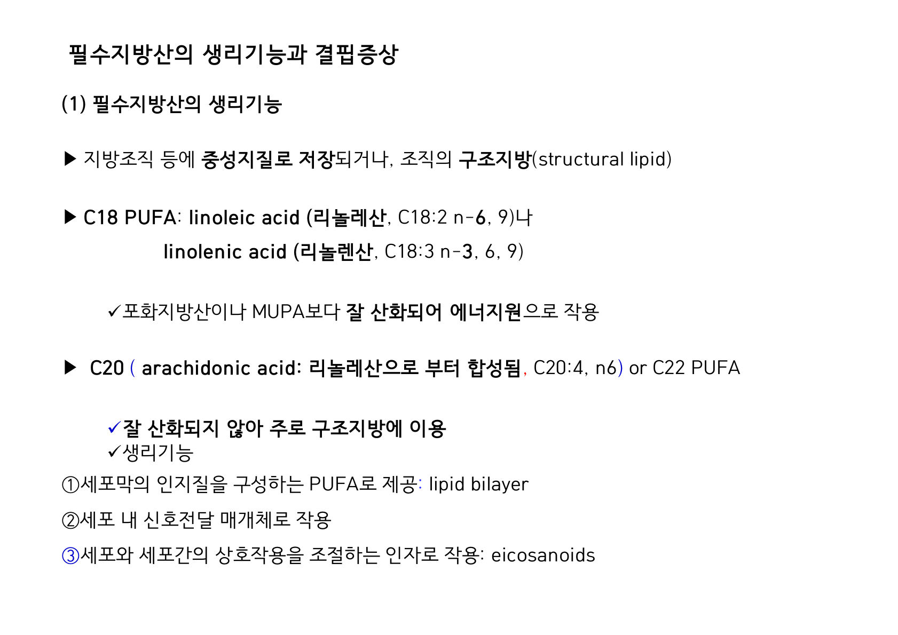

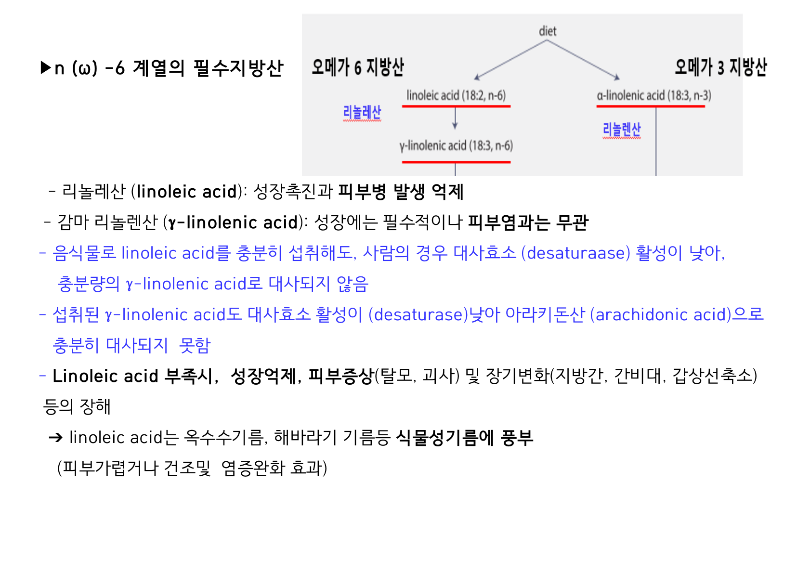
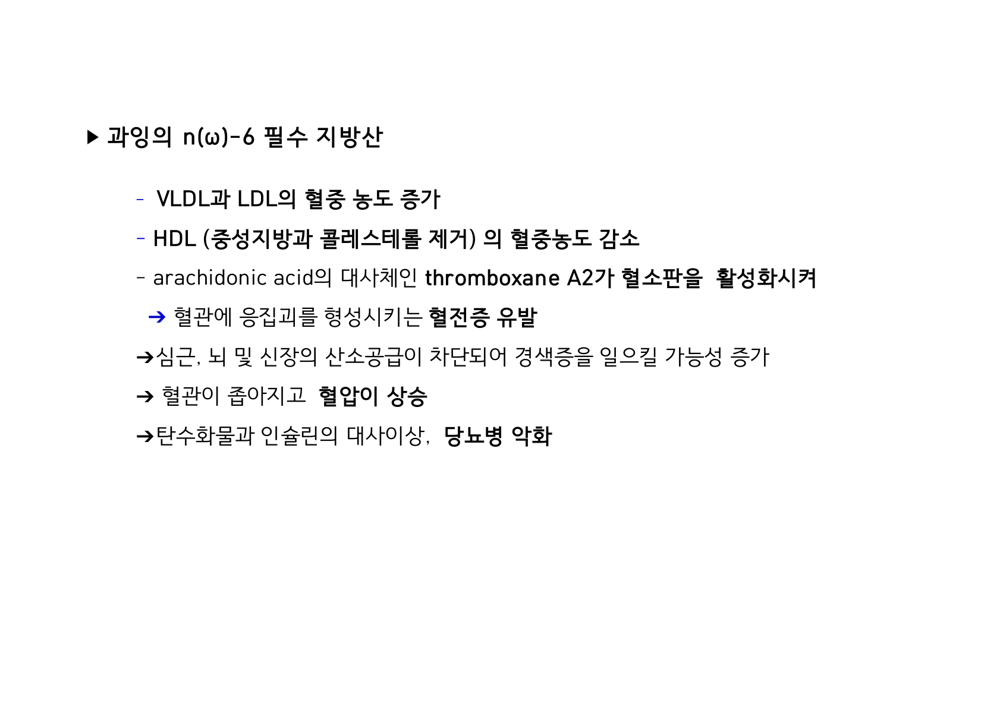

# 문제

OATP 관련 식품-의약품 상호작용 설명으로 옳은 것을 모두 고르시오.

- 위장관에서 OATP가 억제되면 의약품의 전신노출이 차단되어 혈중농도가 낮아질 수 있다.
- 간에서 OATP가 억제되면 의약품 전신노출이 증가할 수 있다.
- OATP1A2는 fexofenadine 등의 흡수를 매개한다.
- 자몽주스와 함께 복용하면 fexofenadine 흡수가 60% 이상 감소한다고 설명된다.
- 위장관 OATP 억제는 항상 모든 의약품의 흡수를 증가시킨다.

답: 아래 표시 보기
O 위장관에서 OATP가 억제되면 의약품의 전신노출이 차단되어 혈중농도가 낮아질 수 있다. // 장 흡수 운반체가 막히면 약이 몸 안으로 덜 들어온다.
O 간에서 OATP가 억제되면 의약품 전신노출이 증가할 수 있다. // 간 흡수 운반체가 막히면 간 제거가 줄어 혈중 노출이 늘 수 있다.
O OATP1A2는 fexofenadine 등의 흡수를 매개한다. // fexofenadine은 장관 OATP 예시 약물로 자주 나온다.
O 자몽주스와 함께 복용하면 fexofenadine 흡수가 60% 이상 감소한다고 설명된다. // 자몽주스가 장관 OATP를 억제해 흡수를 줄이는 예시이다.
X 위장관 OATP 억제는 항상 모든 의약품의 흡수를 증가시킨다. -> 위장관 OATP 억제는 의약품 흡수를 **감소**시킬 수 있다. OATP1A2가 fexofenadine 흡수를 매개하므로 억제 시 흡수 감소가 가능하다.
출처: G:\내 드라이브\여형준님\21 6-1\예방약학\기말고사 정리자료\예방약학 기말고사 범위 수업자료.pdf p.452, p.453
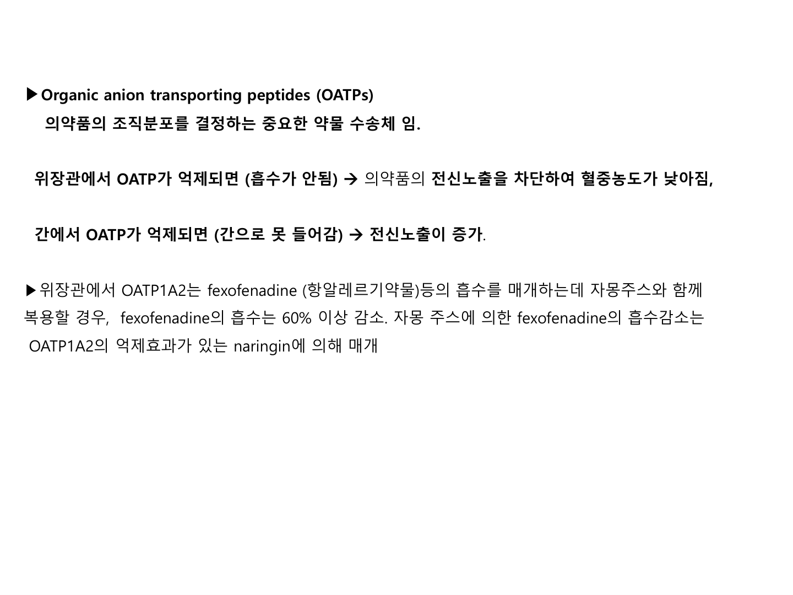
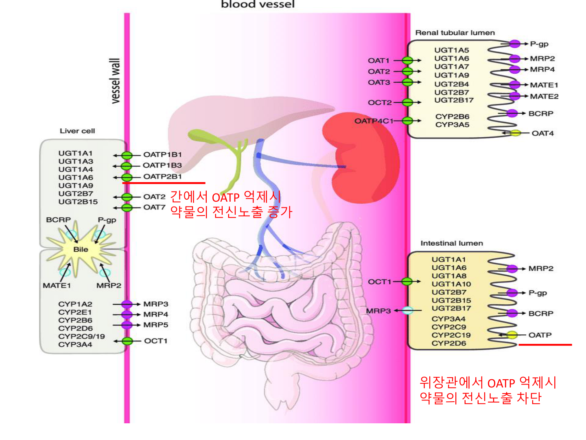

# 문제

Vitamin K 설명으로 옳은 것을 모두 고르시오.

- Vitamin K는 혈액응고에 필수적인 비타민으로 설명된다.
- Vitamin K1은 phylloquinone, vitamin K2는 menaquinone 유도체와 연결된다.
- Vitamin K는 장내세균에 의해 합성될 수 있어 사람에게 결핍증이 거의 나타나지 않는다.
- 신생아출혈은 출생 시 위장관 무균상태로 vitamin K 합성 세균이 없다는 점과 연결된다.
- Dicoumarol은 vitamin K 작용을 억제한다고 설명된다.

답: 아래 표시 보기
O Vitamin K는 혈액응고에 필수적인 비타민으로 설명된다. // 응고인자 활성화에 필요한 carboxylation을 돕는다.
O Vitamin K1은 phylloquinone, vitamin K2는 menaquinone 유도체와 연결된다. // K1은 식물성, K2는 장내세균/menaquinone 쪽 이름으로 구분한다.
O Vitamin K는 장내세균에 의해 합성될 수 있어 사람에게 결핍증이 거의 나타나지 않는다. // 장내 합성이 있어 일반 성인에서는 결핍이 드문 편이다.
O 신생아출혈은 출생 시 위장관 무균상태로 vitamin K 합성 세균이 없다는 점과 연결된다. // 신생아는 장내세균 합성이 아직 부족해 출혈 위험이 커진다.
O Dicoumarol은 vitamin K 작용을 억제한다고 설명된다. // Dicoumarol은 vitamin K 길항 작용으로 항응고 효과를 낸다.
출처: G:\내 드라이브\여형준님\21 6-1\예방약학\기말고사 정리자료\예방약학 기말고사 범위 수업자료.pdf p.274, p.276
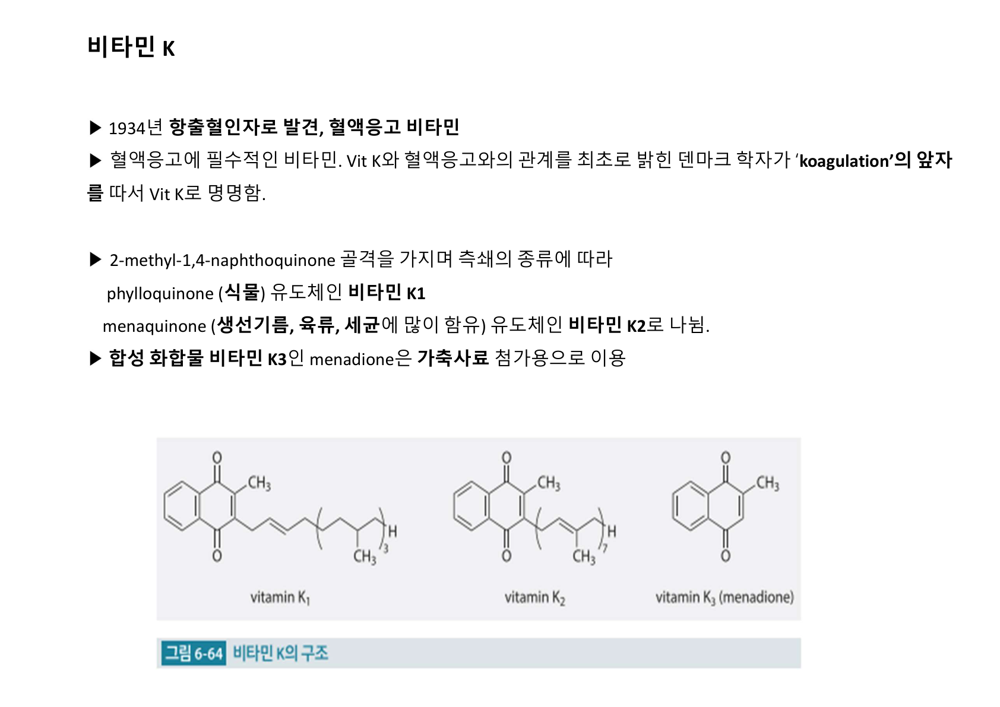
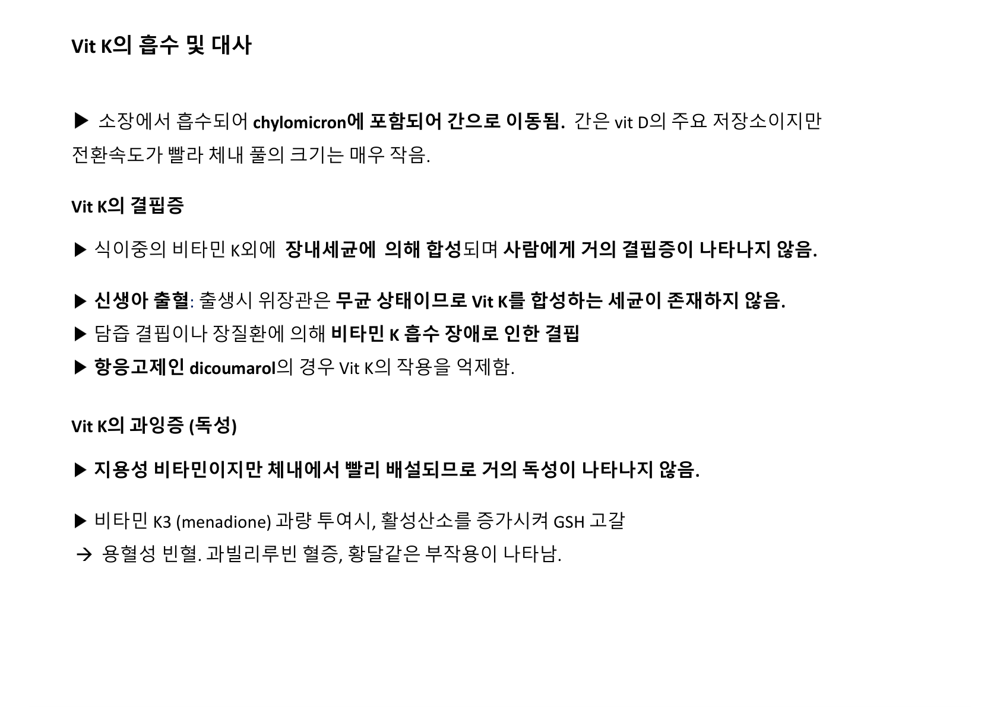

# 문제

탄수화물과 지질대사 설명으로 옳은 것을 모두 고르시오.

- 고탄수화물 식이를 장기 투여하면 초기에는 혈중 중성지방량 증가가 나타날 수 있다.
- 포도당에 의해 분비가 촉진된 인슐린은 세포 내 중성지방 저장을 증가시킬 수 있다.
- Fructose는 insulin 분비를 증가시키지 않아 혈중 중성지방을 증가시킬 수 있다.
- 과당은 VLDL 형성과 무관하며 혈중 중성지방을 낮춘다고 설명된다.
- 과당 섭취는 내장지방량 증가와 혈중지방농도 증가와 연결된다.

답: 아래 표시 보기
O 고탄수화물 식이를 장기 투여하면 초기에는 혈중 중성지방량 증가가 나타날 수 있다. // 남는 탄수화물이 지방 합성으로 넘어가 TG가 늘 수 있다.
O 포도당에 의해 분비가 촉진된 인슐린은 세포 내 중성지방 저장을 증가시킬 수 있다. // Insulin은 지방 합성과 저장을 촉진하는 방향으로 작용한다.
O Fructose는 insulin 분비를 증가시키지 않아 혈중 중성지방을 증가시킬 수 있다. // 과당은 간에서 TG 합성으로 흐르기 쉬워 혈중지방 증가와 연결된다.
O 과당 섭취는 내장지방량 증가와 혈중지방농도 증가와 연결된다. // 과당 대사는 지방 합성 쪽으로 치우쳐 내장지방과 TG 증가를 부른다.
X 과당은 VLDL 형성과 무관하며 혈중 중성지방을 낮춘다고 설명된다. -> 과당은 VLDL 형성 및 혈중 중성지방 증가와 연결된다. Fructose는 insulin 분비를 증가시키지 않아 중성지방 증가 쪽으로 설명된다.
출처: G:\내 드라이브\여형준님\21 6-1\예방약학\기말고사 정리자료\예방약학 기말고사 범위 수업자료.pdf p.33
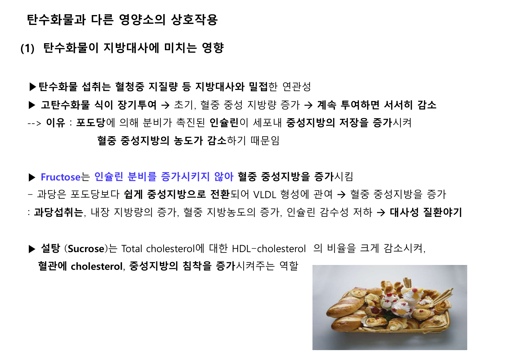
