# 문제
바이오의약품 제조공정과 품질관리에서 허가 당시 품질을 유지하기 위해 반복해서 입증해야 하는 핵심을 쓰시오.

답:
==똑같이 만들 수 있다==
==똑같이 검사할 수 있다==
==똑같이 만들었다고 확인할 수 있다==

[배경설명]
바이오의약품은 작은 화학물질처럼 구조가 단순하지 않고, 세포를 이용한 **제조공정**의 영향을 크게 받는다.
그래서 허가받을 때 만든 제품과 나중에 만든 제품이 같은 **품질**인지 계속 확인해야 한다.

**제조공정**은 같은 방식으로 만들 수 있는지를 보는 것이다.
**시험법**은 같은 기준으로 검사할 수 있는지를 보는 것이다.
마지막으로 검사 결과가 허가 당시 **품질**과 맞아야 **똑같이 만들었다고 확인**할 수 있다.

여기서 **허가 당시 품질**은 식약처가 허가할 때 인정한 제품의 기준이라고 보면 된다.
바이오의약품은 공정이 조금만 달라져도 단백질 모양, 불순물, 활성 같은 특성이 바뀔 수 있다.

그래서 같은 성분명보다 **같은 공정으로 같은 품질을 반복 생산하고 확인하는 능력**이 더 중요하다.
출처: 의약품규제및규제과학개론 기말고사 범위 수업자료.pdf p.54 + 의약품규제및규제과학개론 기말고사 범위 수업자료.pdf p.69
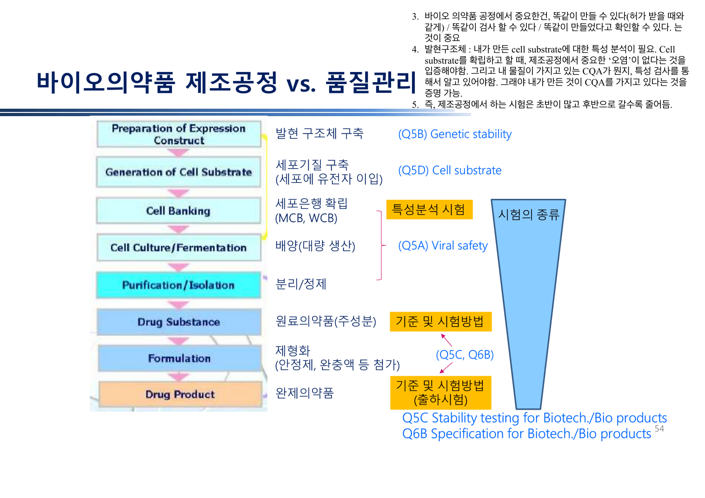
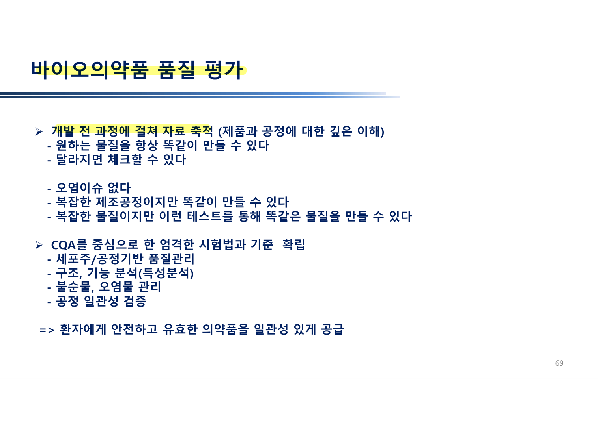

# 문제
바이오의약품 품질평가에서 CQA 중심으로 자료를 축적해야 하는 이유를 쓰시오.

답:
복잡한 제조공정 때문에 **품질 변동**이 생기기 쉽기 때문이다
품질이 달라지면 **안전성ㆍ유효성**도 달라질 수 있기 때문이다
중요한 품질특성을 중심으로 관리해야 **일관된 제품**을 만들 수 있기 때문이다

[배경설명]
CQA는 제품의 **안전성**과 **유효성**에 영향을 줄 수 있는 중요한 **품질**특성이다.
바이오의약품은 원료세포, 배양, 정제, 오염관리처럼 **품질**에 영향을 주는 지점이 많다.

따라서 중요한 **품질**특성을 정해 두고 자료를 쌓아야 제품이 매번 같은 **품질**로 만들어졌는지 판단할 수 있다.
**품질**이 달라졌을 때 바로 알아내야 환자에게 안전하고 효과 있는 의약품을 공급할 수 있다.

CQA는 **Critical Quality Attribute**의 약자이다.
제품 **품질**을 판단할 때 절대 놓치면 안 되는 핵심 속성이다.
예를 들어 단백질 구조, 순도, 불순물, 생물학적 활성처럼,
환자 **안전성**과 약효에 직접 이어질 수 있는 항목이 CQA가 될 수 있다.

모든 항목을 똑같이 보는 것이 아니라, 위험이 큰 **품질**특성을 중심으로 기준과 시험법을 세우는 것이 규제과학적 접근이다.
출처: 의약품규제및규제과학개론 기말고사 범위 수업자료.pdf p.69

# 문제
생물의약품의 정의와 바이오의약품이 케미컬의약품보다 규제상 품질평가가 어려운 이유를 쓰시오.

답:
**생물체에서 유래**하거나 **생물체를 이용하여 제조**한 의약품
어려운 이유: **구조와 제조공정이 복잡**하고, **환경 영향**과 **오염ㆍ불순물 관리** 변수가 크기 때문이다
따라서 단순 **물리화학적 시험**만으로 품질을 판단하기 어렵다

[배경설명]
생물의약품은 **살아있는 세포**나 생물체를 이용해 만들기 때문에 제품 구조가 단순하지 않다.
케미컬의약품은 비교적 작은 분자라 구조 확인과 정량이 쉽다.
바이오의약품은 단백질 구조, 당화, 세포배양 조건, 정제공정의 영향을 크게 받는다.

그래서 완성품만 검사해서 끝나는 것이 아니라 원료, 세포, 공정, 불순물, 오염 가능성을 함께 관리해야 한다.
규제상 핵심은 바이오의약품이 **복잡하고 변동 가능성이 큰 제품**이라는 점이다.

물리화학적 시험은 분자량, 구조, 함량 같은 성질을 기계나 분석법으로 확인하는 시험이다.
바이오의약품은 그런 시험만으로 약효와 **안전성**을 모두 설명하기 어렵다.

따라서 제품이 만들어지는 **생물학적 시스템**과 **제조공정**까지 **품질**평가의 일부로 보게 된다.
출처: 의약품규제및규제과학개론 기말고사 범위 정리본.pdf p.1
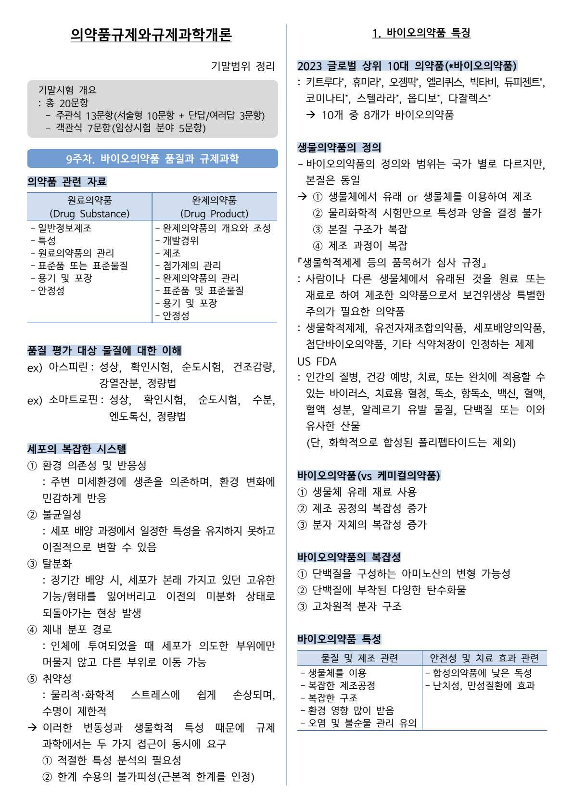

# 문제
바이오의약품 개발 단계별 품질평가 흐름을 쓰시오.

답:
**원개발 단계**: 세포주 개발, 배양ㆍ정제 공정 최적화, 초기 품질특성 분석
**비임상 단계**: 안전성, 기능적 활성, 불순물ㆍ오염물 관리
**임상ㆍ허가 단계**: 공정 적합성, 배치 일관성, CQA, 분석법 validation
**상업 생산 단계**: 공정 모니터링, 변경관리, 안정성 모니터링

[배경설명]
**바이오의약품 품질평가**는 한 번에 끝나는 검사가 아니라 개발 전 과정에 걸쳐 쌓이는 자료이다.
초기에는 어떤 **세포주와 공정**으로 만들지 정하고, **비임상 단계**에서는 안정성과 기능을 확인한다.

**임상과 허가 단계**에서는 같은 **품질**로 반복 생산되는지와 분석법이 믿을 만한지 확인한다.
허가 후 상업 생산에서도 **제조소, 원료, 규모**가 바뀌면 **품질**이 달라질 수 있다.
그래서 **모니터링과 변경관리**가 계속 필요하다.

**세포주 개발**은 어떤 세포를 사용해 약을 만들지 정하는 출발점이다.
**배양과 정제**는 세포가 만든 물질을 원하는 형태로 얻고 불필요한 물질을 제거하는 과정이다.

**Validation**은 시험법이나 공정이 실제로 믿을 만하게 작동하는지 증명하는 절차이다.
출처: 의약품규제및규제과학개론 기말고사 범위 정리본.pdf p.4
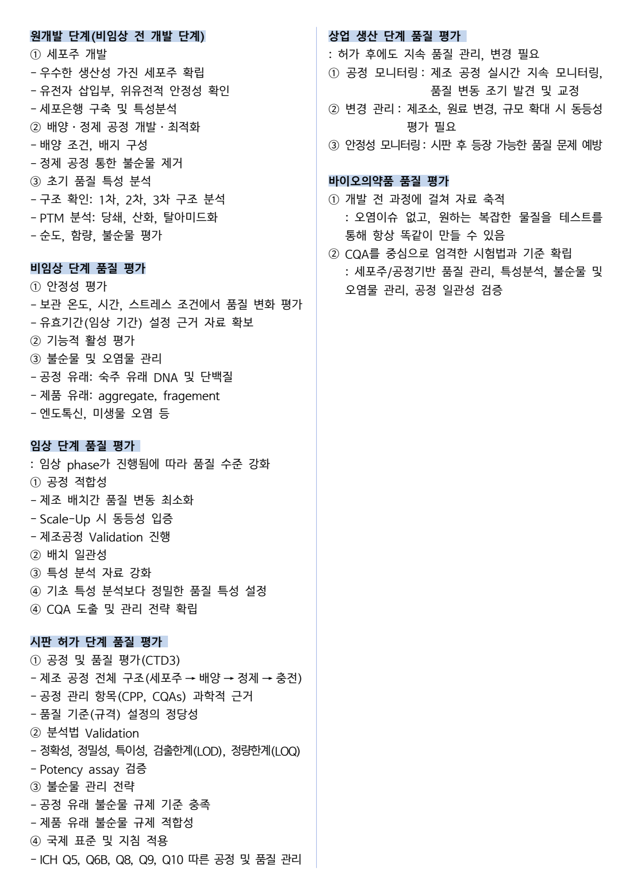

# 문제
약사법상 임상시험의 정의를 쓰시오.

답:
의약품 등의 **안전성과 유효성**을 증명하기 위해 사람을 대상으로 약동, 약력, 약리, 임상적 효과를 확인하고 이상반응을 조사하는 시험
**생물학적동등성시험**도 포함된다
**첨단재생의료 임상연구는 제외**된다

[배경설명]
임상시험은 사람에게 의약품을 사용해 보면서 그 약이 안전한지, 효과가 있는지 확인하는 절차이다.
약동은 몸속에서 약이 어떻게 흡수ㆍ분포ㆍ대사ㆍ배설되는지를 보는 것이고, 약력은 약이 몸에 어떤 작용을 내는지를 보는 것이다.

이상반응 조사는 약을 썼을 때 원하지 않는 반응이 생기는지 확인하는 과정이다.
약사법 정의에서는 **생물학적동등성시험**도 임상시험에 포함되고, **첨단재생의료 임상연구**는 제외된다.

정의에서 가장 중요한 기준은 **사람을 대상으로 한다**는 점이다.
**안전성**은 해로운 반응이 어느 정도인지 보는 것이고, 유효성은 치료 목적에 맞는 효과가 있는지 보는 것이다.

생동시험도 사람에게 약을 투여해 혈중농도를 비교하므로 약사법상 임상시험 범주에 들어간다.
출처: 의약품규제및규제과학개론 기말고사 범위 수업자료.pdf p.76
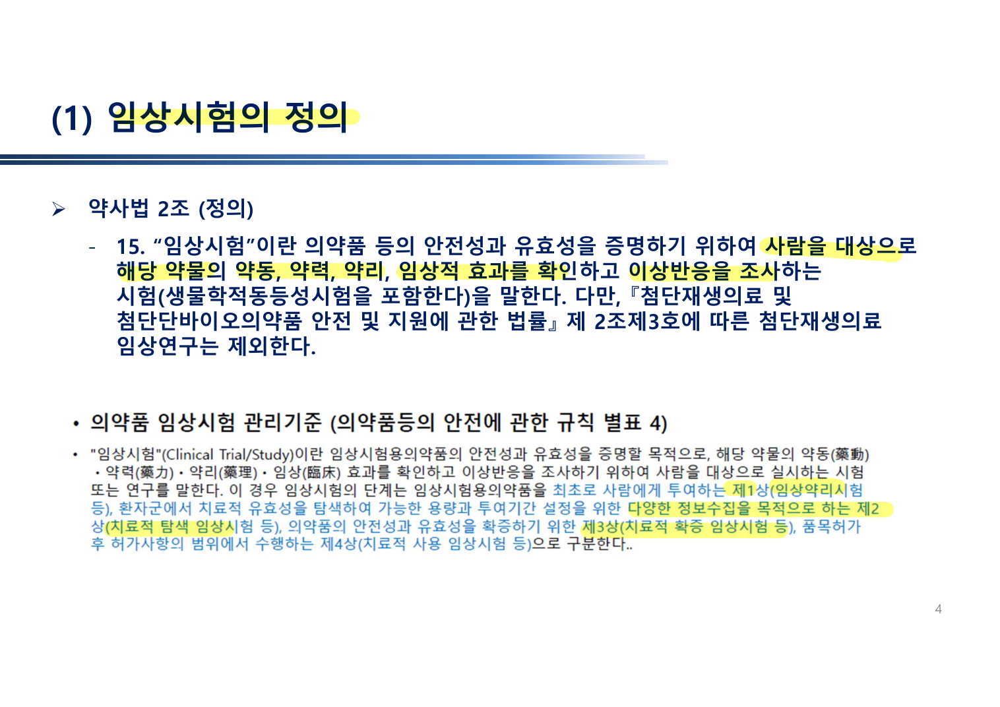

# 문제
임상 1상과 2상을 구분하고, 2상 결과 해석에서 조심해야 할 점을 쓰시오.

답:
**1상**: 약력학, 상호작용, 견딜 수 있는 용량
**2상**: 견딜 수 있는 용량 근처에서 효과 여부와 효과 크기
전체 효과가 없는데 **특정 하위군에서만 효과**가 보이면 **사후적으로 효과 입증**이라 보기 어렵다

[배경설명]
**1상**은 사람에게 처음 쓰는 단계에 가깝다.
그래서 효과 입증보다 약이 몸에서 어떻게 작용하는지와 견딜 수 있는 **용량**을 본다.
**2상**은 그 **용량** 근처에서 실제로 치료 효과가 보이는지, 효과가 어느 정도인지를 본다.

임상시험은 시작 전에 **어떤 환자군에서 어떤 평가변수로 효과를 볼지** 정해야 한다.
전체 결과가 좋지 않은 뒤 **특정 하위군만 골라 효과**가 있다고 말하면,
우연히 좋아 보이는 결과를 골랐을 가능성이 커진다.

**1상**은 보통 안전하게 투여할 수 있는 범위와 몸속 움직임을 확인하는 초기 단계이다.
**2상**은 목표 질환 환자에게서 효과 신호와 적절한 **용량**을 더 구체적으로 보는 단계이다.

**하위군 분석**은 처음부터 계획되어 있으면 의미가 있지만, 결과를 본 뒤 골라내면 신뢰도가 떨어진다.
출처: 의약품규제및규제과학개론 기말고사 범위 수업자료.pdf p.78 + 의약품규제및규제과학개론 기말고사 범위 수업자료.pdf p.81
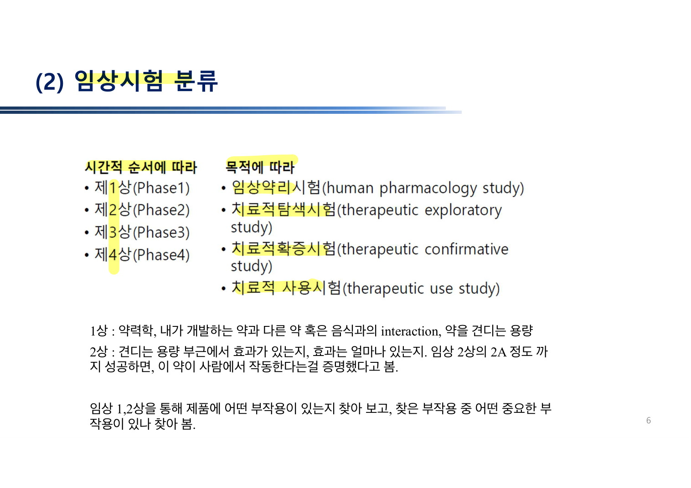
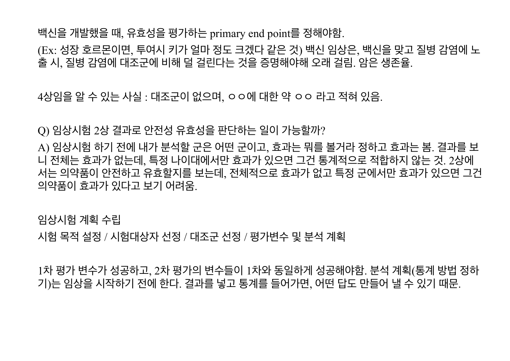

# 문제
임상시험에서 primary endpoint와 통계분석계획을 사전에 정해야 하는 이유를 쓰시오.

답:
결과를 본 뒤 평가변수나 분석방법을 바꾸면 **유리한 결과만 고르는 편향**이 생기기 때문이다
**primary endpoint**와 **통계분석계획**을 사전에 정해야 결과 해석의 객관성과 통계적 타당성을 확보할 수 있다

[배경설명]
Primary endpoint는 임상시험에서 가장 중심이 되는 효과 판정 기준이다.
예를 들어 효과를 판단할 기준을 미리 정하지 않으면, 결과를 본 뒤 좋아 보이는 지표만 골라 성공처럼 보이게 만들 수 있다.

**통계분석계획**도 마찬가지로 데이터를 보기 전에 정해야 결과 해석이 공정해진다.
**결과 확인 후 평가변수나 분석방법을 정하는 것**은 **삐뚤림**을 만들기 때문에 통계적으로 적합하지 않다.

평가변수는 무엇이 좋아지면 약이 효과 있다고 볼 것인가를 정한 기준이다.
**통계분석계획**은 수집된 데이터를 어떤 방법으로 계산하고 해석할지 미리 적은 계획이다.

둘을 사전에 정해 두어야 연구자가 원하는 결론에 맞춰 기준을 바꾸는 일을 막을 수 있다.
출처: 의약품규제및규제과학개론 기말고사 범위 수업자료.pdf p.81 + 의약품규제및규제과학개론 기말고사 범위 수업자료.pdf p.106 + 의약품규제및규제과학개론 기말고사 범위 수업자료.pdf p.158

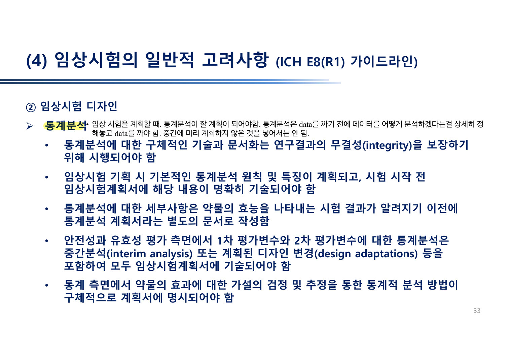
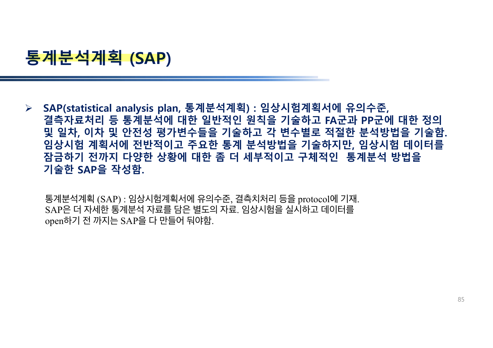

# 문제
가교시험(bridging study)의 목적을 쓰시오.

답:
외국 임상시험 결과가 **한국인 등 특정 인구집단**에도 적용되는지 확인한다
안전성과 유효성을 검증하기 위한 **소규모 보완적 임상시험**이다

[배경설명]
**가교시험**은 외국에서 얻은 임상시험 결과를 그대로 **국내 환자**에게 적용해도 되는지 확인하는 보완 시험이다.
같은 약이라도 **인종**, **생활환경**, **의료환경** 차이 때문에 효과나 **안전성**이 달라질 수 있다.

그래서 한국인 등 특정 인구집단에서 **외국 자료**가 받아들여질 수 있는지 확인한다.
**다국가 임상시험**에 한국인이 포함되면 별도 **가교시험** 부담을 줄일 수 있다.

가교라는 말은 이미 있는 외국 임상자료와 국내 적용 가능성을 **이어 준다**는 뜻으로 이해하면 쉽다.
**외국 자료**를 완전히 버리는 것이 아니라, **국내 환자**에게도 타당한지 필요한 만큼만 보완한다.

**규제기관**은 약의 효과와 **안전성**이 특정 인구집단에서 크게 달라질 가능성이 있는지를 본다.
출처: 의약품규제및규제과학개론 기말고사 범위 수업자료.pdf p.80
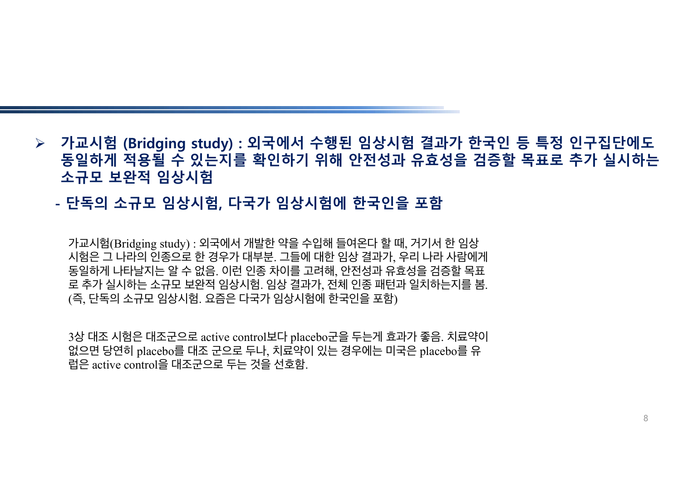

# 문제
GCP의 정의와 목적을 쓰시오.

답:
**GCP**는 임상시험의 설계, 수행, 기록, 보고를 위한 국제적이고 윤리적이며 과학적인 표준
시험대상자의 **권리, 안전, 복지**를 보호한다
**신뢰성 있는 시험자료**임을 보증한다

[배경설명]
GCP는 **Good Clinical Practice**의 약자이다.
임상시험을 어떻게 설계하고 수행하고 기록하고 보고할지 정한 기준이다.
임상시험은 사람을 대상으로 하므로 대상자의 **권리, 안전, 복지**가 먼저 보호되어야 한다.

동시에 허가 판단에 쓸 수 있도록 시험자료가 믿을 만해야 한다.
따라서 GCP의 목적은 **대상자 보호**와 **자료 신뢰성 확보**를 함께 달성하는 것이다.

임상시험 자료가 허가 판단에 쓰이려면 누가 봐도 같은 결론을 낼 수 있을 정도로 기록과 보고가 정확해야 한다.
하지만 자료가 아무리 좋아도 사람에게 불필요한 위험을 주면 정당한 임상시험이 아니다.

그래서 GCP는 윤리 기준과 과학 기준을 동시에 요구한다.
출처: 의약품규제및규제과학개론 기말고사 범위 수업자료.pdf p.90
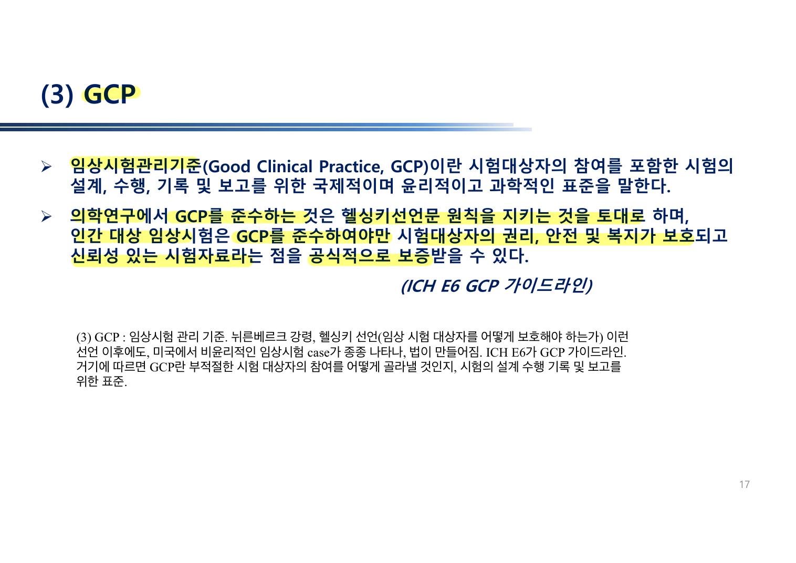

# 문제
ICH-GCP, IRB/IEC, IB에 대한 설명으로 옳은 것을 모두 고르시오.

- ICH-GCP에는 일반원칙, IRB/IEC, 연구자, 의뢰자, protocol, IB, essential documents 등이 포함된다
- IRB/IEC는 시험대상자의 권리와 안전을 보호하고 비윤리적 임상시험을 견제한다
- IRB/IEC는 동의 절차와 위험-이익 균형도 검토한다
- IB는 임상시험용의약품에 대한 임상 및 비임상 자료의 편집물이다
- IRB는 임상시험의 과학적 유효성만 보고 대상자 보호는 심사하지 않는다
- IB는 임상시험이 모두 끝난 뒤 허가신청을 위해서만 작성되는 최종 결과보고서이다
- ICH-GCP는 의뢰자의 편의를 위해 자료 신뢰성만 다루고 윤리성은 별도로 다루지 않는다

답:
ICH-GCP에는 일반원칙, **IRB/IEC**, 연구자, 의뢰자, protocol, **IB**, **essential documents** 등이 포함된다
**IRB/IEC**는 **시험대상자의 권리와 안전**을 보호하고 비윤리적 임상시험을 견제한다
**IRB/IEC**는 **동의 절차**와 **위험-이익 균형**도 검토한다
**IB**는 임상시험용의약품에 대한 **임상 및 비임상 자료의 편집물**이다

[보기해설]
O ICH-GCP에는 일반원칙, IRB/IEC, 연구자, 의뢰자, protocol, IB, essential documents 등이 포함된다
O IRB/IEC는 시험대상자의 권리와 안전을 보호하고 비윤리적 임상시험을 견제한다
O IRB/IEC는 동의 절차와 위험-이익 균형도 검토한다
O IB는 임상시험용의약품에 대한 임상 및 비임상 자료의 편집물이다
X IRB는 임상시험의 과학적 유효성만 보고 대상자 보호는 심사하지 않는다 -> **IRB**는 과학성뿐 아니라 **대상자 권리, 안전, 복지, 동의 절차**를 함께 심사한다.
X IB는 임상시험이 모두 끝난 뒤 허가신청을 위해서만 작성되는 최종 결과보고서이다 -> **IB**는 임상시험 전과 진행 중 연구자에게 제공되는 **시험약 정보집**이고, 최종 결과보고서가 아니다.
X ICH-GCP는 의뢰자의 편의를 위해 자료 신뢰성만 다루고 윤리성은 별도로 다루지 않는다 -> **ICH-GCP**는 **자료 신뢰성**과 함께 **대상자 보호**라는 윤리 원칙을 핵심으로 삼는다.
[배경설명]
**ICH-GCP**는 임상시험을 국제적으로 일관되게 관리하기 위한 기준이다.
**일반원칙부터 문서 관리까지** 넓게 포함한다.
**IRB/IEC**는 임상시험이 윤리적으로 괜찮은지,
**시험대상자의 권리와 안전**이 보호되는지 심사하는 조직이다.
동의 절차는 대상자가 위험과 이익을 이해하고 자발적으로 참여하는지 보는 절차라서 **IRB/IEC** 심사 대상이다.
**위험-이익 균형**은 예상되는 위험이 얻을 수 있는 이익에 비해 정당한지 따지는 것이다.
IB는 **Investigator's Brochure**이다.
임상시험용의약품에 대해 연구자가 알아야 할 임상ㆍ비임상 정보를 모아 놓은 자료이다.
**IB**는 최종 결과보고서가 아니다.
임상시험을 수행하는 동안 연구자가 **약의 특성과 위험**을 이해하도록 돕는 자료집이다.
**ICH-GCP**는 **자료 신뢰성**뿐 아니라 **대상자 보호와 윤리성**도 함께 다룬다.
그래서 윤리성을 제외한다는 설명은 틀리다.

출처: 의약품규제및규제과학개론 기말고사 범위 수업자료.pdf p.91 + 의약품규제및규제과학개론 기말고사 범위 수업자료.pdf p.92 + 의약품규제및규제과학개론 기말고사 범위 수업자료.pdf p.98
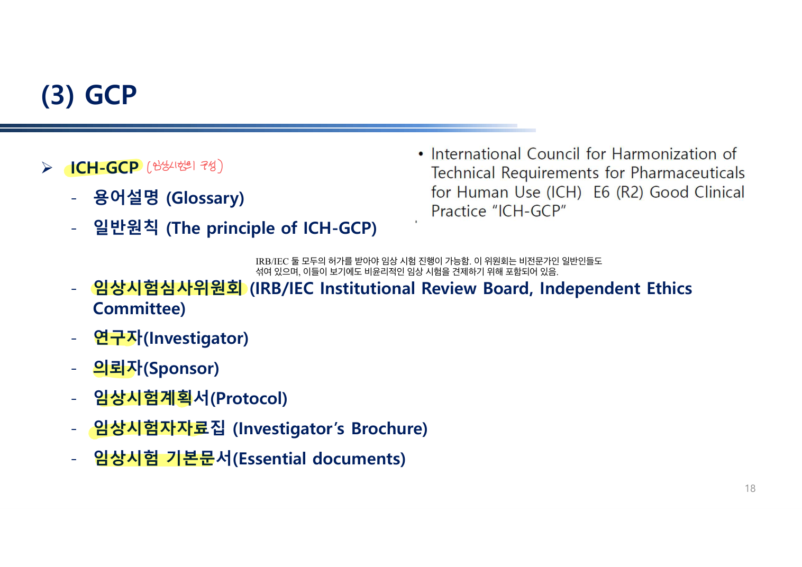
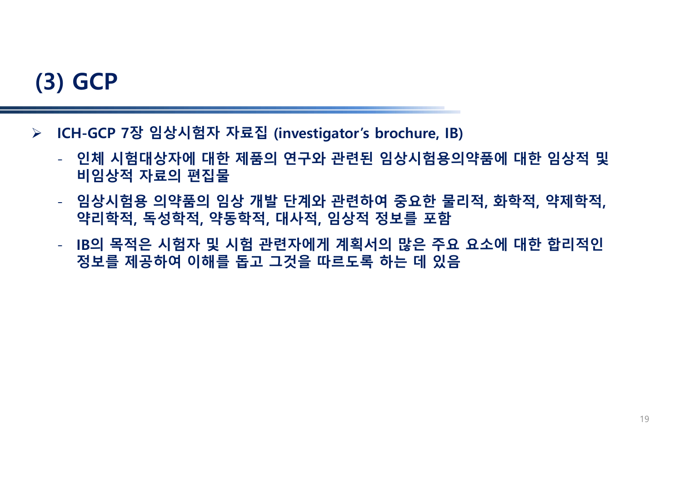
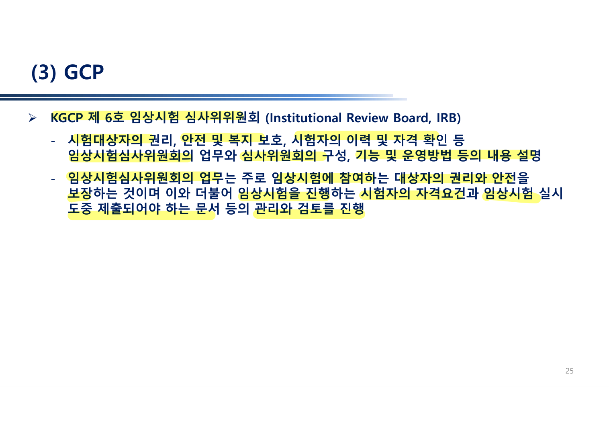

# 문제
KGCP 기본원칙에서 시험대상자와 관련해 가장 우선되는 원칙을 쓰시오.

답:
과학과 사회의 이익보다 대상자의 ==권리, 안전, 복지==를 먼저 고려한다
**위험과 불편보다 이익이 크거나 정당화될 때만** 임상시험을 실시한다
대상자에게 **자발적 동의**를 받아야 한다

[배경설명]
**KGCP**에서 가장 먼저 놓는 기준은 임상시험으로 얻는 과학적 이익보다 사람의 보호가 우선이라는 점이다.
시험대상자는 연구 자료를 얻기 위한 수단이 아니라 권리와 안전을 보호받아야 하는 사람이다.

위험이 이익보다 크면 임상시험을 해서는 안 되고, 참여도 강제로 시킬 수 없다.
그래서 **권리, 안전, 복지**, **위험-이익 판단**, **자발적 동의**가 함께 연결된다.

권리는 충분한 설명을 듣고 참여 여부를 결정할 권리를 포함한다.
안전은 신체적 피해를 줄이는 것이고, 복지는 대상자의 전반적인 이익과 존엄을 보호하는 의미이다.

**자발적 동의**는 설명을 들은 뒤 스스로 참여를 결정했다는 뜻이므로 **KGCP**의 핵심 윤리 원칙이다.
출처: 의약품규제및규제과학개론 기말고사 범위 수업자료.pdf p.96 + 의약품규제및규제과학개론 기말고사 범위 수업자료.pdf p.97
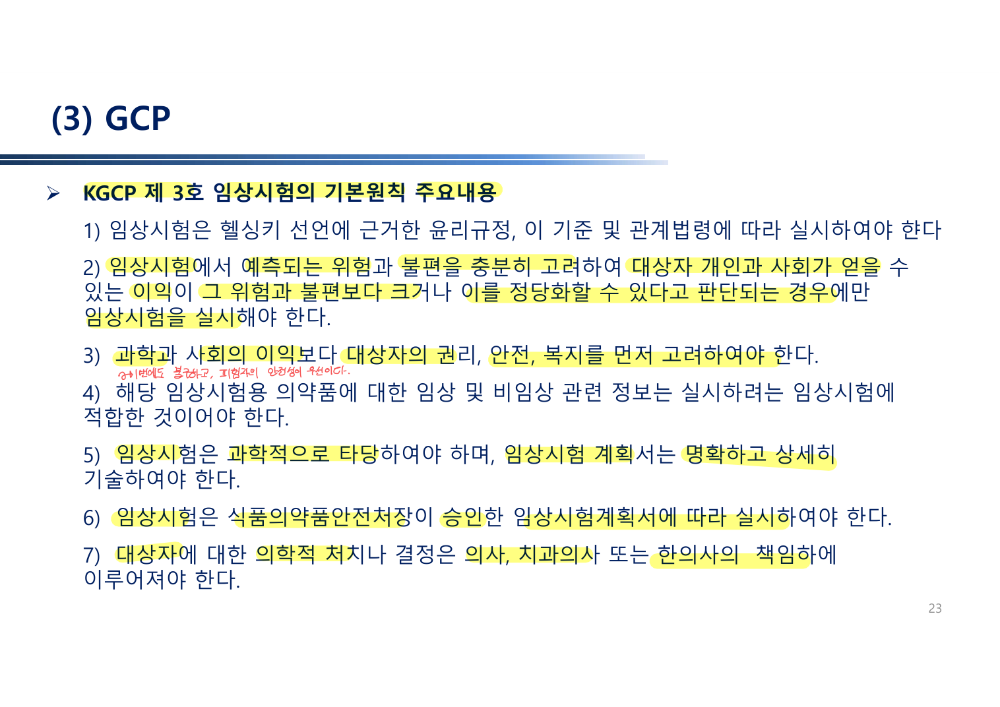
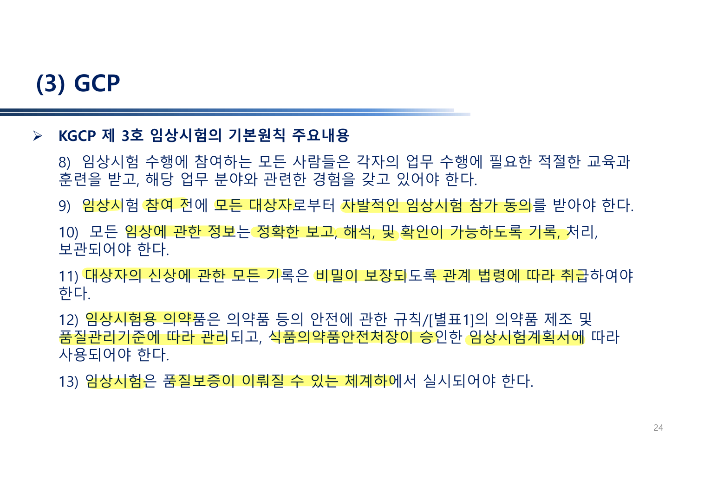

# 문제
ICH E8(R1)의 임상시험 품질고도화 원칙으로 옳은 것을 모두 고르시오.

- 사전 정의된 명확한 연구목표를 설정한다
- 적절한 대상자를 선택한다
- 무작위배정, 눈가림, 교란요인 관리로 삐뚤림을 최소화한다
- 임상적으로 의미 있고 환자와 관련된 평가변수를 설정한다
- 결과를 확인한 뒤 유리한 평가변수를 새로 정한다
- 연구목표가 불명확해도 표본 수가 충분하면 품질이 보장된다
- 시험 중간에 편한 평가변수로 바꾸기 쉽도록 평가변수를 넓게만 정한다

답:
**사전 정의된 명확한 연구목표**를 설정한다
**적절한 대상자**를 선택한다
**무작위배정**, **눈가림**, **교란요인 관리**로 **삐뚤림**을 최소화한다
**임상적으로 의미 있고 환자와 관련된 평가변수**를 설정한다

[보기해설]
O 사전 정의된 명확한 연구목표를 설정한다
O 적절한 대상자를 선택한다
O 무작위배정, 눈가림, 교란요인 관리로 삐뚤림을 최소화한다
O 임상적으로 의미 있고 환자와 관련된 평가변수를 설정한다
X 결과를 확인한 뒤 유리한 평가변수를 새로 정한다 -> **평가변수는 결과를 보기 전에** 정해야 하며, 결과를 본 뒤 바꾸면 우연히 좋은 결과를 고르는 문제가 생긴다.
X 연구목표가 불명확해도 표본 수가 충분하면 품질이 보장된다 -> 표본 수가 많아도 **무엇을 입증하려는지** 불명확하면 시험 품질은 보장되지 않는다.
X 시험 중간에 편한 평가변수로 바꾸기 쉽도록 평가변수를 넓게만 정한다 -> 평가변수는 **사전에 명확**해야 하며, 나중에 편한 기준으로 바꾸는 구조는 삐뚤림을 만든다.
[배경설명]
좋은 임상시험은 먼저 무엇을 확인할지 **명확한 연구목표**를 정하고 시작한다.
그 목표에 맞는 **대상자**를 뽑아야 결과를 해석할 수 있다.
**무작위배정**과 **눈가림**은 연구자나 대상자의 기대가 결과에 끼어드는 것을 줄인다.
**교란요인**은 약 효과가 아닌 다른 이유로 결과가 달라지게 만드는 요인이다.
**평가변수**는 환자에게 실제로 의미 있는 변화와 연결되어야 한다.
**결과를 본 뒤** 유리한 평가변수를 새로 정하면 처음부터 정한 기준으로 검증한 것이 아니므로 틀린 설명이다.
표본 수가 많아도 **연구목표**가 흐리면 무엇을 성공으로 볼지 정할 수 없으므로 좋은 임상시험이 아니다.
평가변수를 일부러 넓게 정해 두면 나중에 **유리한 결과만 고르는 문제**가 생기므로 **품질고도화 원칙**과 반대이다.

출처: 의약품규제및규제과학개론 기말고사 범위 수업자료.pdf p.99 + 의약품규제및규제과학개론 기말고사 범위 수업자료.pdf p.100
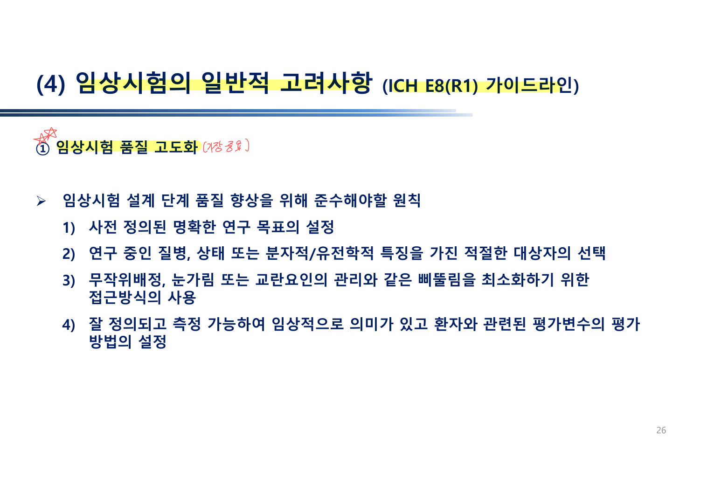
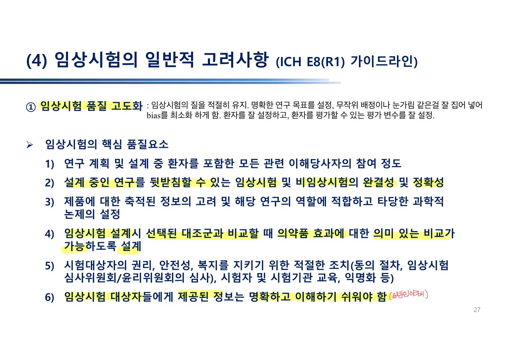

# 문제
임상시험 디자인의 핵심 요소를 쓰시오.

답:
**대상자 집단**
**시험군과 대조군**
**평가변수**
**삐뚤림의 통제**
**통계분석**

[배경설명]
**임상시험 디자인**은 약의 효과와 **안전성**을 공정하게 확인하기 위한 설계도이다.
**대상자 집단**은 누구에게 시험할지, **시험군과 대조군**은 무엇과 비교할지를 정하는 부분이다.

**평가변수**는 무엇을 결과로 볼지 정하는 기준이고, **삐뚤림의 통제**는 결과가 한쪽으로 치우치지 않게 하는 장치이다.
**통계분석**과 **수집자료**는 모은 결과를 어떤 방식으로 판단할지 정하는 요소이다.

**시험군**은 새 약이나 새 치료를 받는 군이고, **대조군**은 비교 기준이 되는 군이다.
대조군이 있어야 좋아진 결과가 **약 때문인지**, 자연 경과나 기대효과 때문인지 비교할 수 있다.

**임상시험 디자인**은 이 요소들을 미리 짜 놓아 결과를 믿을 수 있게 만드는 설계도이다.
출처: 의약품규제및규제과학개론 기말고사 범위 수업자료.pdf p.103
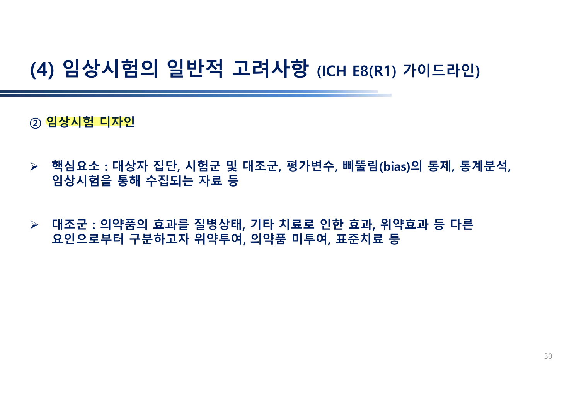

# 문제
일차평가변수와 이차평가변수를 구분하시오.

답:
**일차평가변수**: 임상시험 목적과 입증하려는 가설을 가장 잘 설명하는 평가변수
**이차평가변수**: 일차평가변수를 뒷받침하거나 이차적 목적과 관련된 평가변수

[배경설명]
평가변수는 임상시험에서 효과를 판단할 때 보는 측정값이다.
**일차평가변수**는 임상시험의 가장 중요한 질문에 직접 답하는 기준이다.

예를 들어 이 약이 효과가 있는지를 입증하려는 핵심 지표가 **일차평가변수**이다.
**이차평가변수**는 **일차평가변수**를 보조하거나, 추가적인 효과와 **안전성** 정보를 설명하는 기준이다.

**일차평가변수**는 시험의 성공과 실패를 가르는 중심 기준이라서 임상 시작 전에 명확히 정해야 한다.
**이차평가변수**는 **일차평가변수**만으로 설명되지 않는 추가 정보를 준다.

예를 들어 생존기간이 **일차평가변수**라면 증상 개선, 삶의 질, **안전성** 지표가 **이차평가변수**가 될 수 있다.
출처: 의약품규제및규제과학개론 기말고사 범위 수업자료.pdf p.104
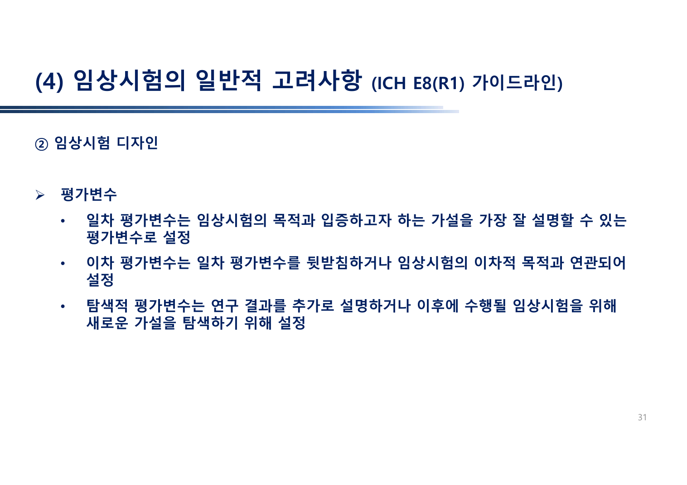

# 문제
삐뚤림(bias)을 줄이는 대표 방법을 쓰시오.

답:
**무작위배정**
**눈가림**
**교란요인 관리**
필요 시 **층화무작위배정**

[배경설명]
**삐뚤림**은 약 효과가 아닌 다른 이유 때문에 결과가 한쪽으로 치우치는 것이다.
**무작위배정**은 누가 시험군이나 대조군에 들어갈지 임의로 정해 처음부터 두 군이 비슷해지도록 한다.

**눈가림**은 대상자나 연구자가 어떤 치료를 받는지 모르게 해 기대나 판단이 결과에 영향을 주지 않게 한다.
**교란요인 관리**는 **질병 정도나 나이**처럼 결과에 영향을 줄 수 있는 요소를 통제하는 것이다.

**층화무작위배정**은 중요한 특성이 군마다 비슷하게 섞이도록 나누어 배정하는 방법이다.
**삐뚤림**은 연구자가 일부러 조작하지 않아도 설계가 부족하면 생길 수 있다.

예를 들어 중증 환자가 한 군에 더 많이 들어가면 약 효과와 상관없이 결과가 나빠 보일 수 있다.
**무작위배정**, 눈가림, 교란요인 관리는 이런 왜곡을 줄여 약 자체의 효과에 더 가깝게 보려는 장치이다.
출처: 의약품규제및규제과학개론 기말고사 범위 수업자료.pdf p.105 + 의약품규제및규제과학개론 기말고사 범위 수업자료.pdf p.144
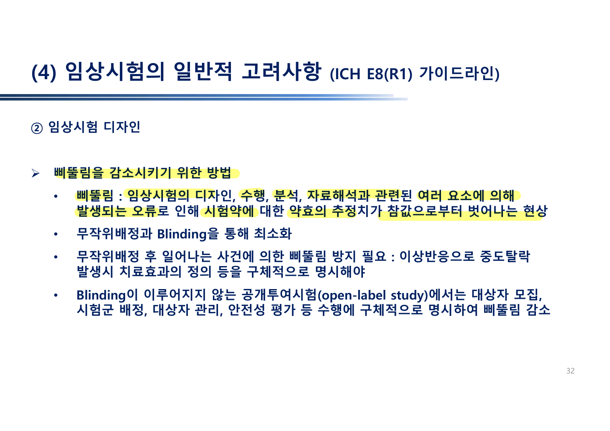
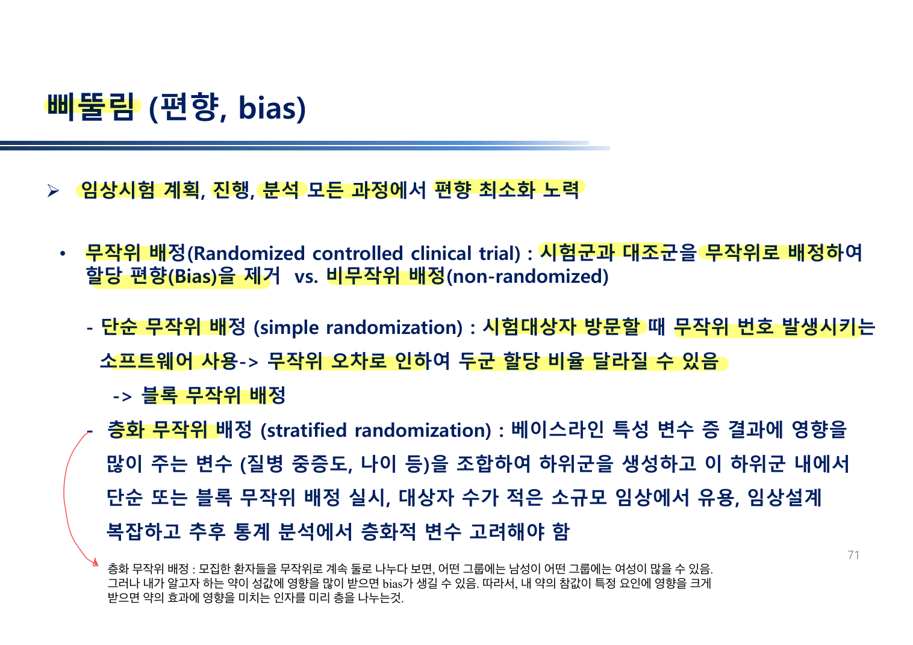

# 문제
IND 사전 승인 대상과 승인 제외 대상을 구분하시오.

답:
**승인 대상**: 개발 중 신약, 허가되지 않은 성분 최초 사용, 허가 범위 밖 조건 사용
**승인 제외**: 허가 범위 안에서 안전성ㆍ유효성 자료 수집을 위한 관찰적 조사 등

[배경설명]
**IND**는 **Investigational New Drug**의 약자이다.
개발 중인 의약품을 사람에게 투여하기 전에 임상시험계획을 승인받는 절차이다.
핵심은 아직 허가되지 않았거나 새 조건으로 쓰려는 약을 사람에게 써도 되는지 **규제기관**이 먼저 보는 것이다.

허가된 범위 안에서 진료 중 생긴 자료를 관찰만 하는 연구는 새로 약을 시험적으로 투여하는 성격이 약하다.
그래서 관찰적 조사처럼 추가 위험이 크지 않은 경우는 **IND** 승인 대상에서 제외될 수 있다.

**IND** 승인은 임상시험을 시작해도 되는지에 대한 사전 안전장치이다.
개발 중 신약이나 허가 범위 밖 사용은 사람에게 예상하지 못한 위험을 줄 수 있으므로 먼저 심사를 받는다.

반대로 이미 허가된 사용범위 안에서 치료를 하고 자료만 관찰하는 경우는 새 위험을 만드는 정도가 낮다.
출처: 의약품규제및규제과학개론 기말고사 범위 수업자료.pdf p.118
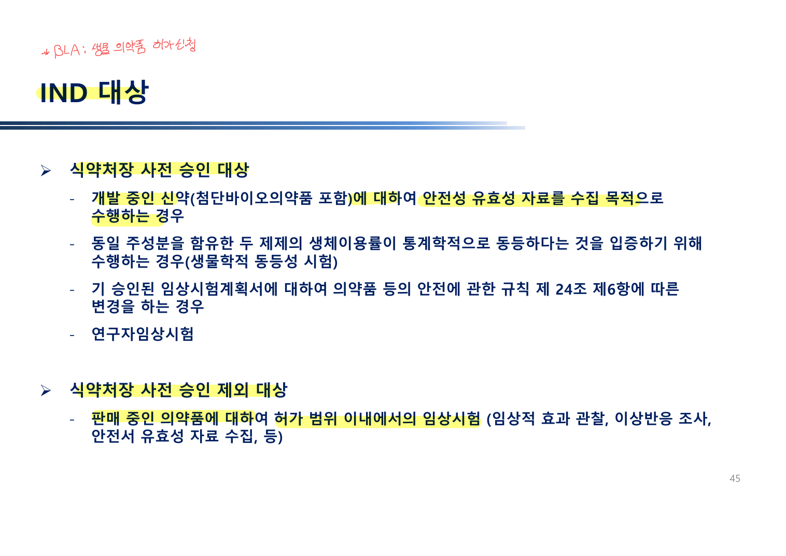

# 문제
IND 제출자료와 IND 심사에서 규제당국이 보는 핵심을 쓰시오.

답:
사람에게 투여할 의약품이 **GMP에 맞게 제조**되었는지
연구참여자에게 **부적절한 안전상 위험**이 없는지
후기임상에서는 **효과 판별이 가능한 설계**인지

[배경설명]
**IND** 제출자료는 개발 중인 약을 사람에게 투여하기 전에 최소한의 **안전성**과 **품질** 근거를 보여주는 자료이다.
**CMC**는 약이 어떤 원료와 공정으로 만들어지고 **품질**이 관리되는지를 설명한다.

**비임상자료**는 사람에게 쓰기 전 동물시험 등에서 **안전성** 신호를 확인한 자료이다.
**임상시험계획서**는 사람 대상 시험을 어떻게 할지 적은 문서이다.
규제당국은 이 자료들을 보고 **연구참여자**가 불필요한 위험에 노출되지 않는지 판단한다.

**GMP**는 의약품이 일정한 **품질**로 제조되도록 하는 제조관리 기준이다.
사람에게 투여할 약이 오염되었거나 **품질**이 들쭉날쭉하면 임상시험 자체가 위험해진다.

**후기임상**에서는 **안전성**뿐 아니라 그 설계로 실제 효과를 판별할 수 있는지도 중요하다.
출처: 의약품규제및규제과학개론 기말고사 범위 수업자료.pdf p.120 + 의약품규제및규제과학개론 기말고사 범위 수업자료.pdf p.126
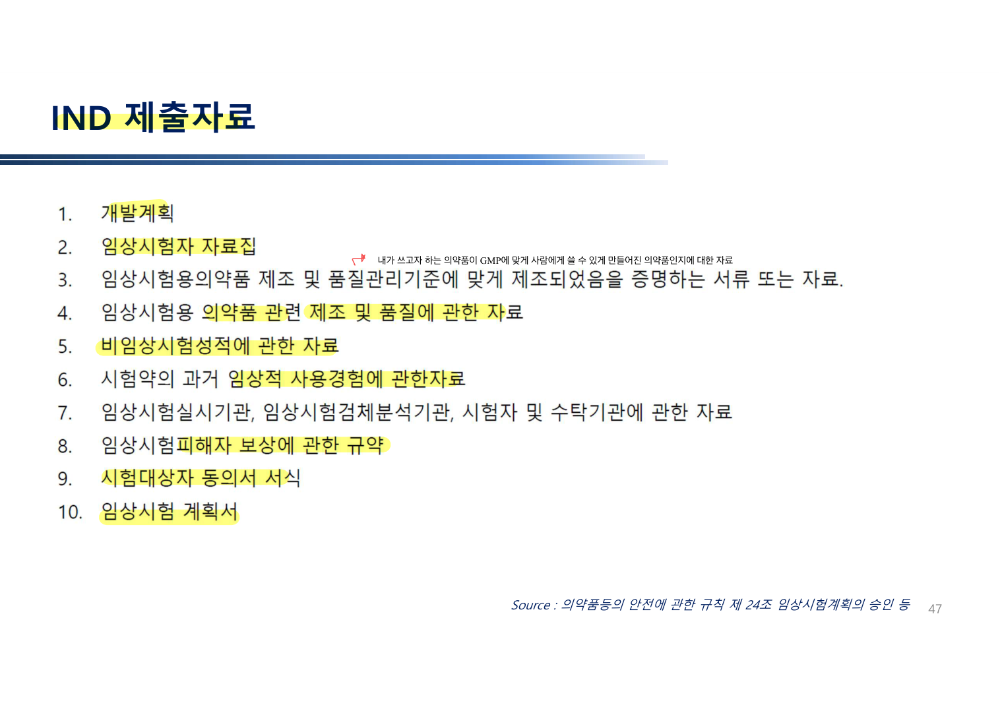
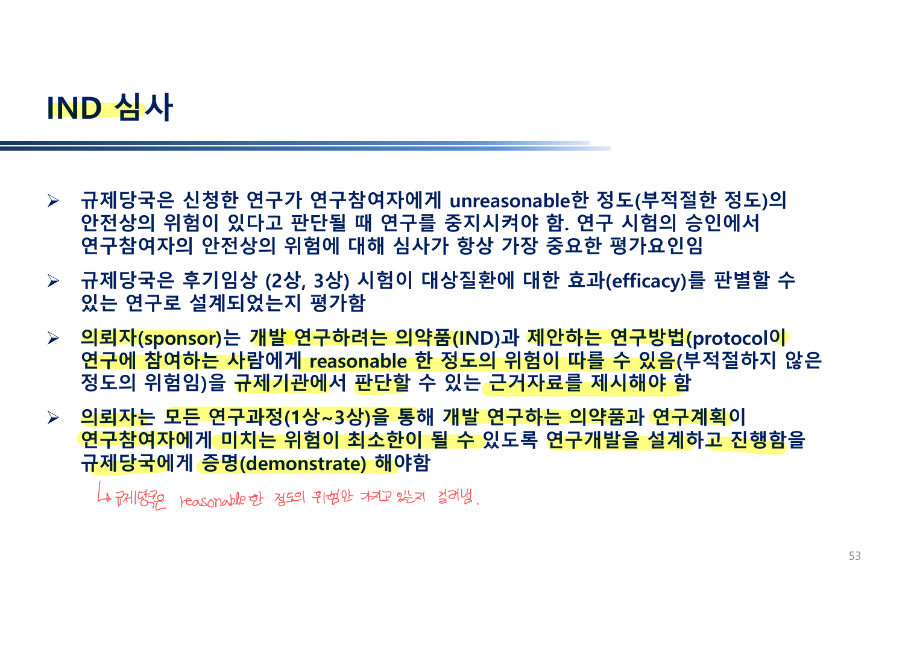

# 문제
임상시험계획서(protocol)와 승인절차에서 기억해야 할 내용을 쓰시오.

답:
**Protocol**에는 **임상시험 목적**, **연구방법**, **통계 고려사항**, **윤리 고려사항**, **안전조치**가 포함된다
**규제기관 승인**과 **IRB 승인**은 ==동시진행 가능==하다
두 승인 뒤 **병원 계약**과 **study initiation**으로 이어진다

[배경설명]
**임상시험계획서**는 대상자, 시험방법, 평가변수, **안전성** 관리, 통계분석을 미리 정리한 실행 문서이다.
**규제기관**은 임상시험계획을 심사해 사람에게 시험해도 되는지 보고, **IRB**는 대상자 보호와 윤리성을 심사한다.

두 심사는 서로 역할이 다르므로 **한쪽만 통과했다고 바로 임상시험을 시작할 수 없다**.
임상시험은 **규제기관과 IRB 심사**, **대상자 동의**, **계획서 준수**가 함께 갖춰져야 진행된다.

**Protocol**은 임상시험의 약속문서라고 보면 된다.
어떤 환자를 넣고, 어떤 약을 어떻게 주고, **무엇을 효과로 볼지**, 위험이 생기면 어떻게 대응할지를 미리 정한다.

**규제기관 승인**과 **IRB 승인**은 동시에 진행될 수 있다.
다만 실제 시작은 필요한 승인과 준비가 갖춰진 뒤 가능하다.
출처: 의약품규제및규제과학개론 기말고사 범위 수업자료.pdf p.123 + 의약품규제및규제과학개론 기말고사 범위 수업자료.pdf p.125
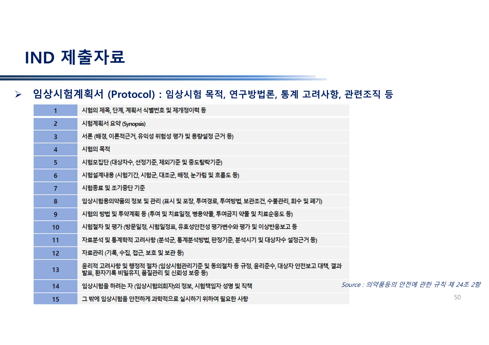
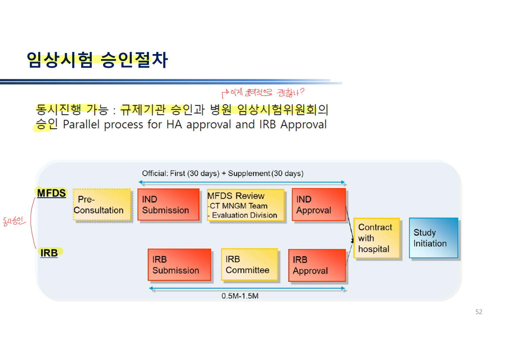

# 문제
분석군 ITT, FAS, PP를 구분하시오.

답:
**ITT**: 무작위배정된 군 그대로 분석
**FAS**: modified ITT로 일부 타당한 제외 기준 적용
**PP**: 계획서에 순응한 대상자만 분석

[배경설명]
분석군은 임상시험 자료를 분석할 때 누구의 데이터를 포함할지 정한 집단이다.
**ITT**는 **무작위배정**된 모든 대상자를 원래 배정된 군으로 분석해, **무작위배정**의 장점을 최대한 살린다.

**FAS**는 **ITT** 원칙에 가깝게 하되,
실제 자료가 전혀 없거나 최소 조건을 만족하지 못한 대상자는 제외할 수 있는 집단이다.
**PP**는 계획서를 잘 지킨 대상자만 분석해 약효를 깨끗하게 보려는 성격이 있다.
다만 제외가 많아지면 현실성이 떨어질 수 있다.

ITT는 중도탈락이나 순응도 문제까지 현실의 임상 상황으로 받아들이는 보수적인 분석에 가깝다.
FAS는 ITT를 최대한 유지하되 분석이 불가능한 일부 대상자를 합리적으로 제외한다.

PP는 약을 제대로 복용하고 계획서를 지킨 사람만 보므로 약 자체의 효과가 크게 보일 수 있다.
출처: 의약품규제및규제과학개론 기말고사 범위 수업자료.pdf p.156
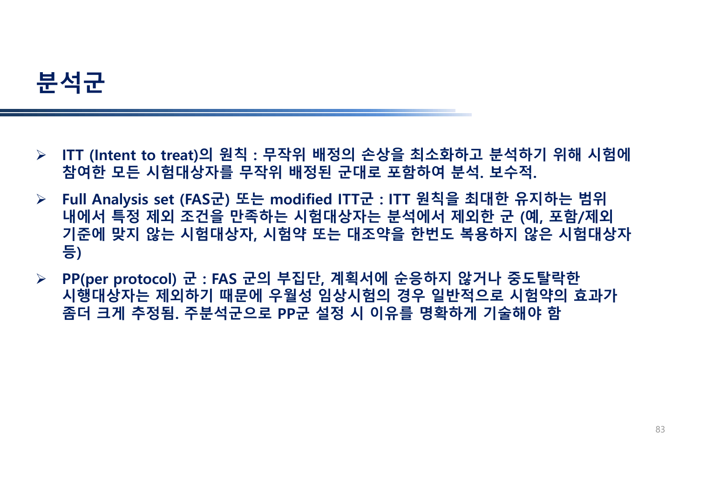

# 문제
제1종 오류, 제2종 오류, 검정력을 구분하시오.

답:
**제1종 오류**: 효과가 없는데 있다고 결론내리는 오류
**제2종 오류**: 효과가 있는데 없다고 결론내리는 오류
**검정력**: 100% - 제2종 오류

[배경설명]
**제1종 오류**는 실제로 효과가 없는데 효과가 있다고 잘못 결론내리는 것이다.
**제2종 오류**는 실제로 효과가 있는데 효과가 없다고 잘못 결론내리는 것이다.

**검정력**은 효과가 있을 때 그 효과를 실제로 찾아낼 수 있는 능력이다.
**대상자 수**가 너무 적으면 효과가 있어도 통계적으로 잡아내기 어려워 **제2종 오류**가 커질 수 있다.

**제1종 오류**는 효과 없는 약을 효과 있다고 착각하는 것이어서 허가 판단에서 특히 위험하다.
**제2종 오류**는 효과 있는 약을 놓치는 것이어서 개발 기회를 잃게 만든다.

**검정력**을 높이려면 보통 더 많은 대상자 수가 필요하지만, 대상자가 많아지면 시간과 비용도 늘어난다.
출처: 의약품규제및규제과학개론 기말고사 범위 수업자료.pdf p.159
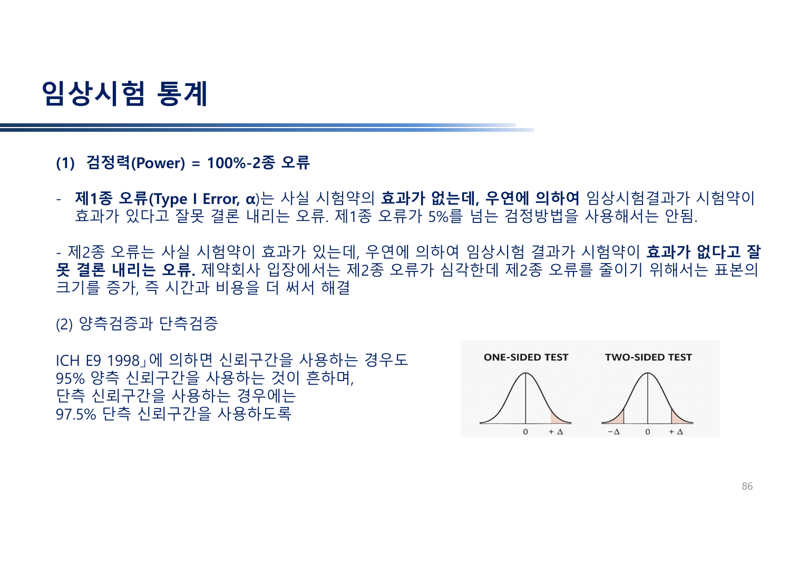

# 문제
우월성, 동등성, 비열등성 평가시험에서 입증하려는 내용을 구분하시오.

답:
**우월성**: 시험약의 효과가 대조약보다 우수함을 보인다
**동등성**: 시험약과 대조약의 효과 차이가 임상적으로 허용 가능한 범위 안에 있음을 보인다
**비열등성**: 시험약이 대조약보다 임상적으로 허용하기 어려울 만큼 나쁘지 않음을 보인다

[배경설명]
**우월성**은 시험약이 **대조약**보다 더 좋은지를 보는 비교이다.
**동등성**은 두 약이 완전히 같다는 뜻이 아니라, 효과 차이가 미리 정한 **허용범위** 안에 있는지를 보는 것이다.

**비열등성**은 새 약이 **대조약**보다 조금 낮아 보일 수는 있어도,
임상적으로 받아들이기 어려운 정도로 떨어지지는 않는지를 확인한다.
**동등성**은 양쪽 방향의 차이를 모두 보고, **비열등성**은 주로 **너무 나쁘지 않은지** 한쪽 방향을 본다.

**우월성**은 더 좋은 약인지 확인하는 시험이라 가장 직관적이다.
**동등성**은 두 약의 차이가 너무 크지 않은지를 양쪽으로 본다.

**비열등성**은 새 약이 편의성이나 **안전성** 같은 장점이 있을 때, 효과가 기존 치료보다 크게 떨어지지 않는지를 확인할 때 쓰인다.
출처: 의약품규제및규제과학개론 기말고사 범위 정리본.pdf p.10
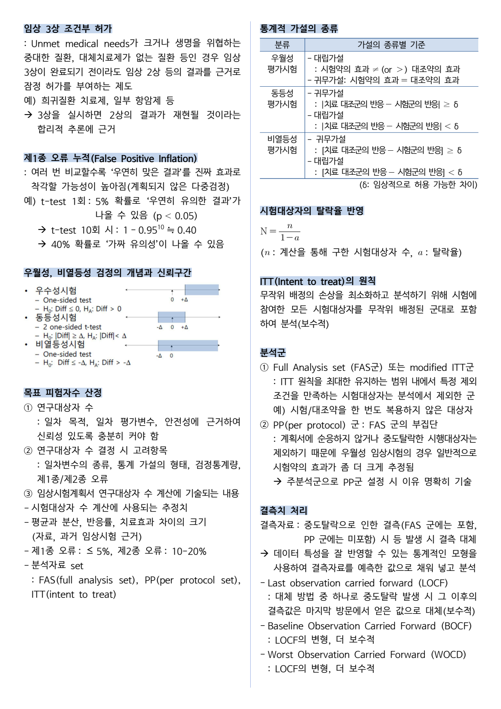

# 문제
적응적 임상시험(adaptive clinical trial)의 개념과 중간분석 원칙을 쓰시오.

답:
**사전에 정한 분석계획과 변경계획**에 따라 중간점검 결과를 바탕으로 계획된 항목 변경을 인정하는 설계
**중간분석**은 임의로 하는 것이 아니라 ==사전에 정한 기준==에 따라 수행한다
**제1종 오류 통제**가 필요하다

[배경설명]
**적응적 임상시험**은 중간에 모인 데이터를 이용해 미리 정해 둔 규칙에 따라 설계를 조정할 수 있는 시험이다.
중요한 점은 데이터를 보면서 마음대로 바꾸는 것이 아니다.
**어떤 시점에 무엇을 기준으로 바꿀지 사전에 정해야 한다**는 것이다.

**중간분석**을 임의로 반복하면 우연히 좋아 보이는 결과를 잡을 가능성이 커진다.
그래서 **중간분석 계획**과 **통계적 오류 통제**가 함께 필요하다.

적응적이라는 말은 유연하다는 뜻이지 **마음대로 한다는 뜻이 아니다**.
예를 들어 중간결과를 보고 **표본수**를 조정하거나 효과가 없는 군을 줄일 수 있다.
다만 그 규칙은 시작 전에 정해져 있어야 한다.

그렇지 않으면 연구자가 **유리한 결과가 나올 때까지 계속 들여다보는 문제**가 생긴다.
출처: 의약품규제및규제과학개론 기말고사 범위 수업자료.pdf p.162 + 의약품규제및규제과학개론 기말고사 범위 수업자료.pdf p.166
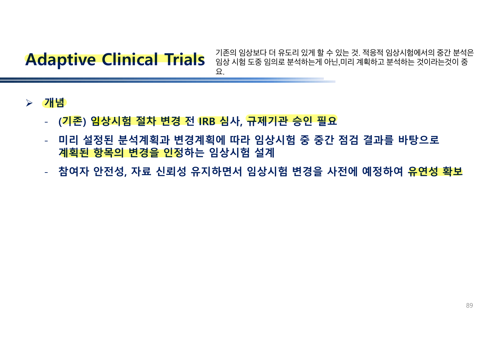
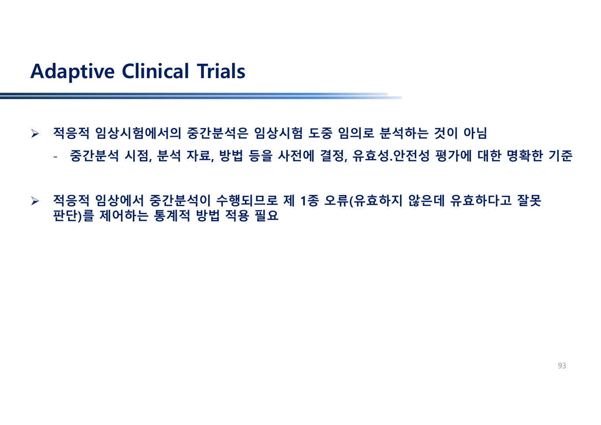

# 문제
적응적 임상시험 설계 종류로 옳은 것을 모두 고르시오.

- 집단축차설계
- 표본수 조정
- 적응적 선별설계
- 심리스 설계
- 마스터 프로토콜
- 결과가 마음에 들 때마다 임의로 분석하는 설계
- 계획서에 없는 중간분석으로 유리한 군만 사후 선택하는 설계
- 제1종 오류 통제 없이 표본수를 계속 늘리는 설계

답:
**집단축차설계**
**표본수 조정**
**적응적 선별설계**
**심리스 설계**
**마스터 프로토콜**

[보기해설]
O 집단축차설계
O 표본수 조정
O 적응적 선별설계
O 심리스 설계
O 마스터 프로토콜
X 결과가 마음에 들 때마다 임의로 분석하는 설계 -> 적응적 설계도 **분석 시점과 변경 기준**을 미리 정해야 한다.
X 계획서에 없는 중간분석으로 유리한 군만 사후 선택하는 설계 -> 사후 선택은 우연히 좋아 보이는 결과를 고를 위험이 커서 **적응적 설계 원칙**에 맞지 않는다.
X 제1종 오류 통제 없이 표본수를 계속 늘리는 설계 -> 효과 없는 약을 효과 있다고 결론내릴 위험이 커지므로 **제1종 오류 통제**가 필요하다.
[배경설명]
**집단축차설계**는 일정 시점마다 데이터를 확인해 효과가 충분하거나 가능성이 낮으면 시험을 일찍 끝낼 수 있는 설계이다.
**표본수 재산정**은 중간자료를 보고 필요한 대상자 수를 다시 계산하는 방식이다.
**적응적 무작위배정**은 중간결과에 따라 더 유망한 군에 배정될 확률을 조정하는 방식이다.
**심리스 설계**는 **용량**결정 같은 탐색 단계와 확증 단계를 하나의 계획 안에서 이어 주는 방식이다.
**마스터 프로토콜**은 하나의 큰 계획 아래 여러 치료나 질환군을 다루는 설계이다.
**엄브렐라 시험**과 **바스켓 시험**이 여기에 포함된다.
**적응적 임상시험**은 미리 정한 규칙 안에서 바꾸는 방식이다.
마음에 드는 결과가 나올 때마다 임의로 분석하는 방식은 아니다.
**중간분석**으로 유리한 군만 사후 선택하거나 표본수를 계속 늘리면 우연히 좋아 보이는 결과를 성공으로 착각할 수 있다.
그래서 적응적 설계에서는 **사전계획**과 **제1종 오류 통제**가 반드시 같이 따라온다.

출처: 의약품규제및규제과학개론 기말고사 범위 수업자료.pdf p.163 + 의약품규제및규제과학개론 기말고사 범위 수업자료.pdf p.164 + 의약품규제및규제과학개론 기말고사 범위 수업자료.pdf p.165
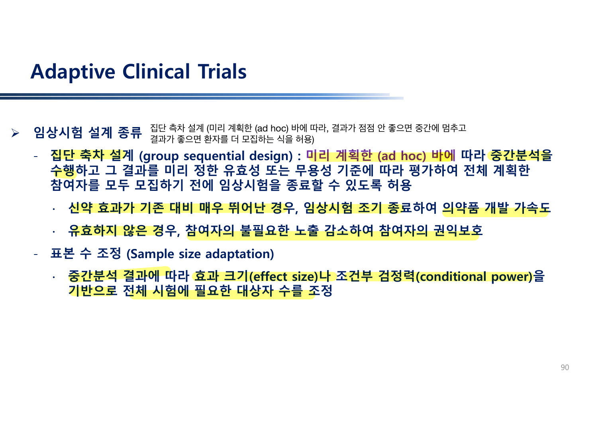
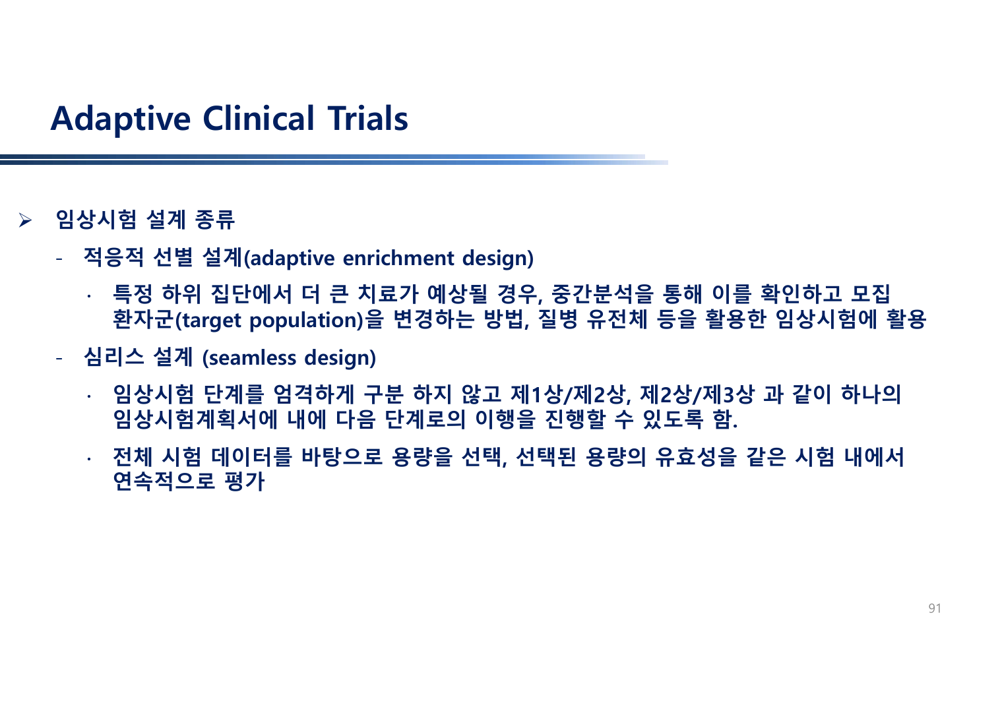
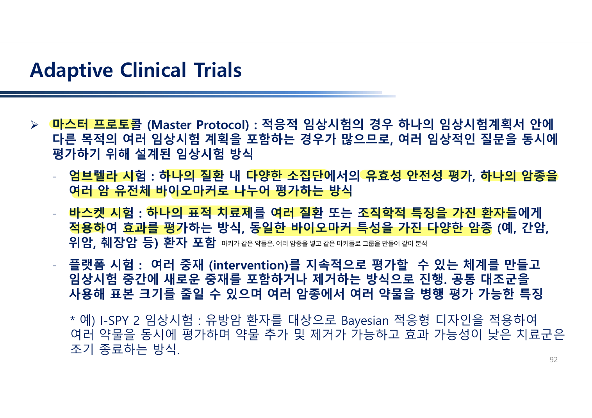

# 문제
MIDD의 개념과 주요 모델 유형을 쓰시오.

답:
**MIDD**: 약물개발 단계에서 수학적 모델과 통계모델을 사용하는 정량적 의사결정 접근
==PK/PD, Population PK, PBPK, QSP, Exposure-Response==

[배경설명]
MIDD는 **Model-Informed Drug Development**의 약자이다.
모델과 시뮬레이션을 신약개발 의사결정에 활용하는 접근이다.
임상시험을 모두 직접 해 보기 어렵기 때문에, 기존 자료를 바탕으로 **용량**, 대상자, 시험 설계를 더 합리적으로 예측한다.

PK/PD 모델은 약물농도와 약효의 관계를 본다.
**PBPK** 모델은 몸의 장기와 생리 특성을 반영해 약물 움직임을 예측한다.
**질병진행 모델**은 시간이 지나며 질병이 어떻게 변하는지 설명한다.
**노출-반응 모델**은 약물 노출량과 효과 또는 **안전성**의 관계를 본다.

PK는 몸이 약을 어떻게 처리하는지, PD는 약이 몸에 어떤 효과를 내는지를 보는 개념이다.
모델은 실제 임상시험을 대신해 모든 것을 증명하는 것이 아니라, 이미 있는 자료를 더 잘 해석해 의사결정을 돕는 도구이다.

그래서 MIDD는 **용량** 선택, 표본 수 판단, 추가 임상 필요성 판단에 활용될 수 있다.
출처: 의약품규제및규제과학개론 기말고사 범위 수업자료.pdf p.172 + 의약품규제및규제과학개론 기말고사 범위 수업자료.pdf p.173 + 의약품규제및규제과학개론 기말고사 범위 수업자료.pdf p.174 + 의약품규제및규제과학개론 기말고사 범위 수업자료.pdf p.175 + 의약품규제및규제과학개론 기말고사 범위 수업자료.pdf p.176 + 의약품규제및규제과학개론 기말고사 범위 수업자료.pdf p.177
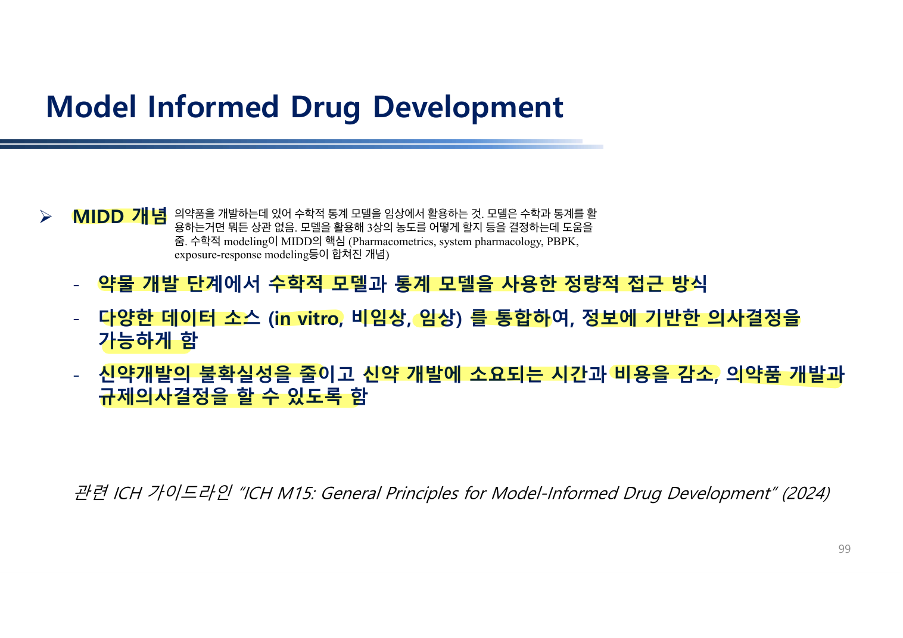
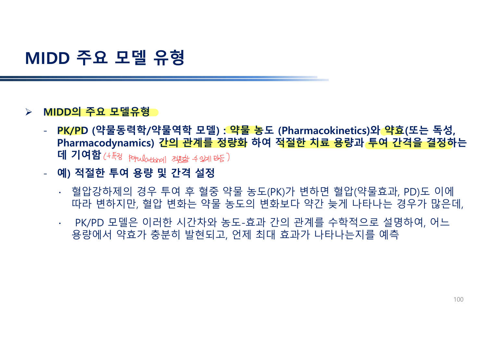
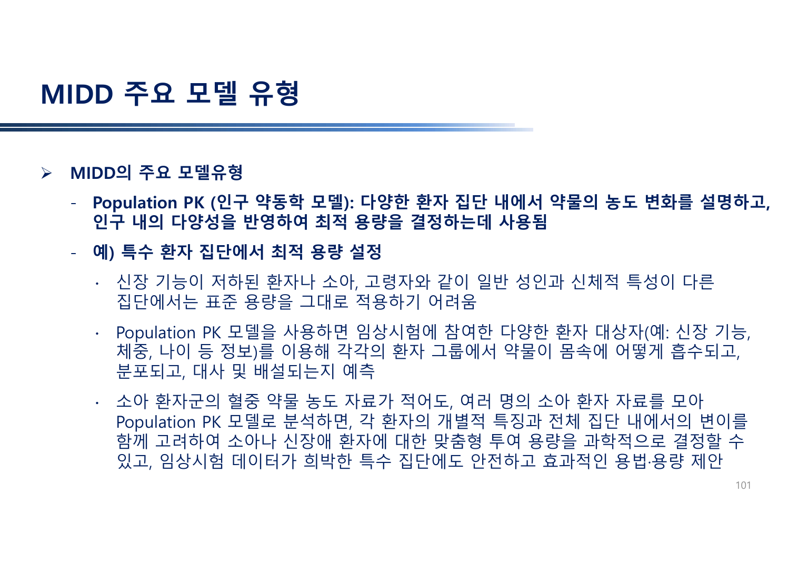
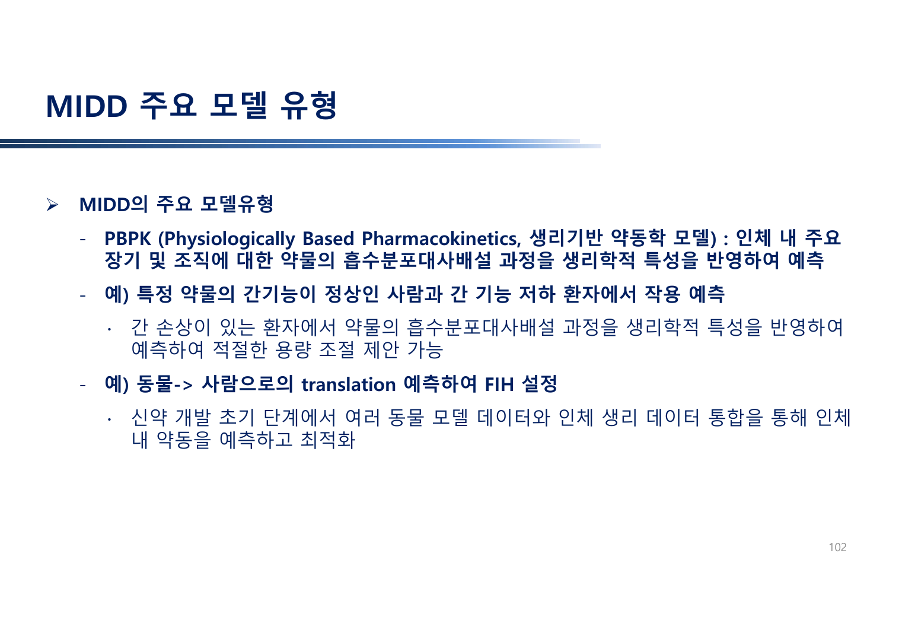
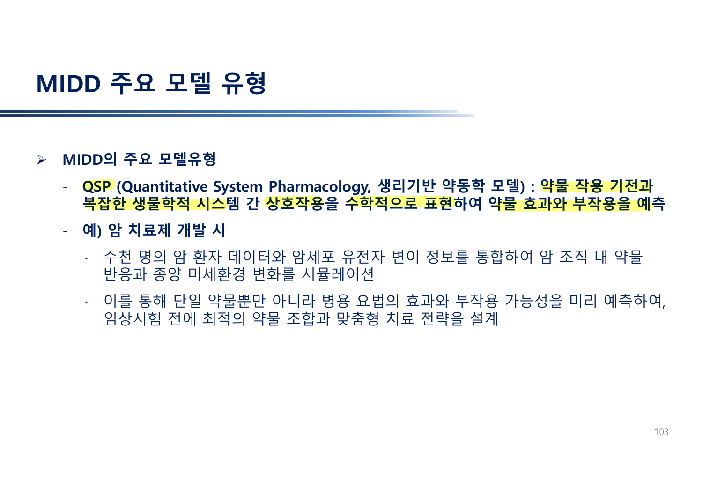
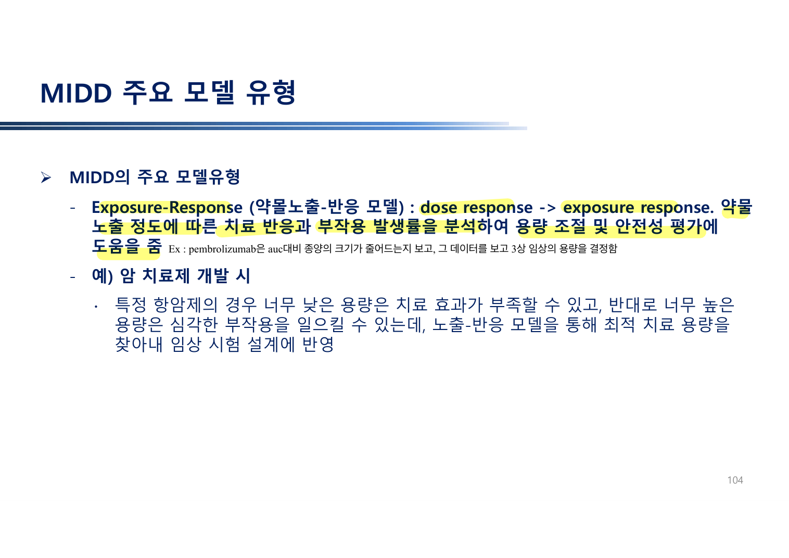

# 문제
RWD와 RWE를 구분하고, 규제 의사결정에 쓰려면 무엇이 필요한지 쓰시오.

답:
**RWD**: 일상적으로 수집된 환자 건강상태 또는 의료서비스 관련 데이터
**RWE**: **RWD** 분석에서 나온 의료제품의 사용, 이익, 위험에 대한 임상증거
규제에 쓰려면 **연구설계 타당성**, **대조군**, **노출군**, **평가방법**, **bias control**을 사전에 정해야 한다

[배경설명]
**RWD**는 병원 진료자료, 보험청구자료, 등록자료처럼 실제 의료현장에서 생기는 원자료이다.
**RWE**는 그 원자료를 적절히 분석해 의약품의 사용, 효과, **안전성**에 대한 근거로 만든 것이다.

**현장자료**는 **무작위배정**된 임상시험 자료가 아니므로 환자 특성 차이와 누락자료 때문에 **삐뚤림**이 생기기 쉽다.
규제 의사결정에 쓰려면 **연구질문**, 대상자 정의, 비교군, 평가변수, 분석방법을 미리 명확히 정해야 한다.

**RWD**는 아직 정리되지 않은 원재료에 가깝고, **RWE**는 그 원재료를 분석해서 만든 근거에 가깝다.
실제 진료자료는 환자마다 **질병 정도**, **병용약**, **병원 방문 방식**이 다르다.
단순 비교하면 잘못된 결론이 나올 수 있다.

그래서 규제에 쓰려면 임상시험처럼 연구설계와 편향 통제 논리를 먼저 세워야 한다.
출처: 의약품규제및규제과학개론 기말고사 범위 수업자료.pdf p.185 + 의약품규제및규제과학개론 기말고사 범위 수업자료.pdf p.187 + 의약품규제및규제과학개론 기말고사 범위 수업자료.pdf p.188
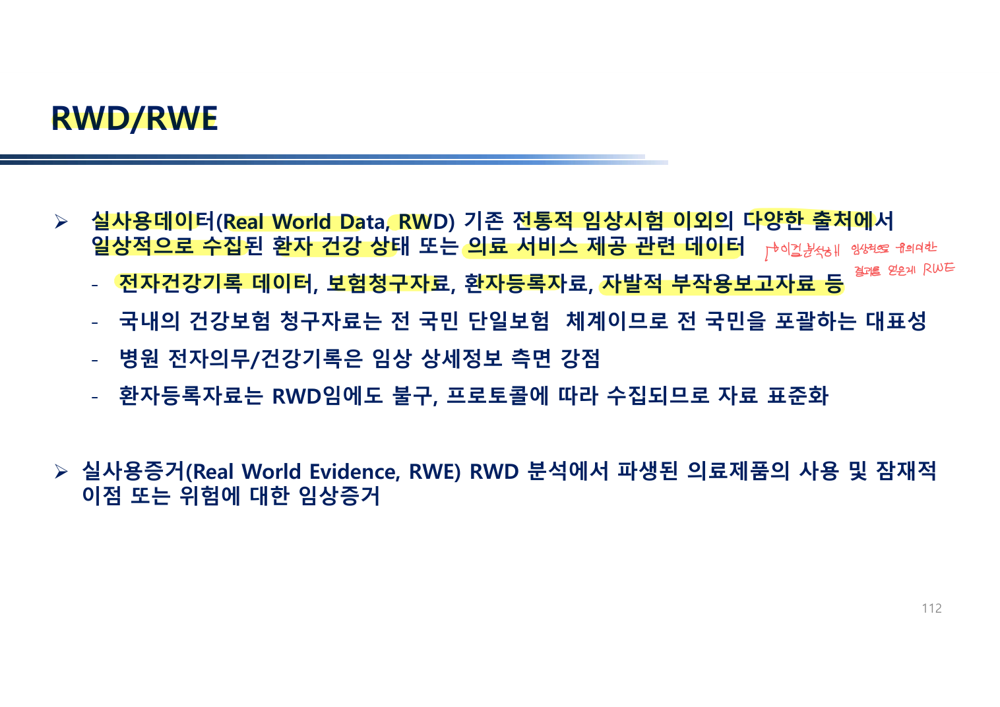
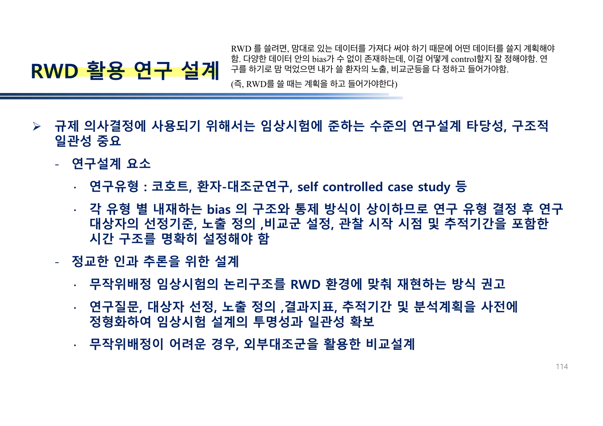
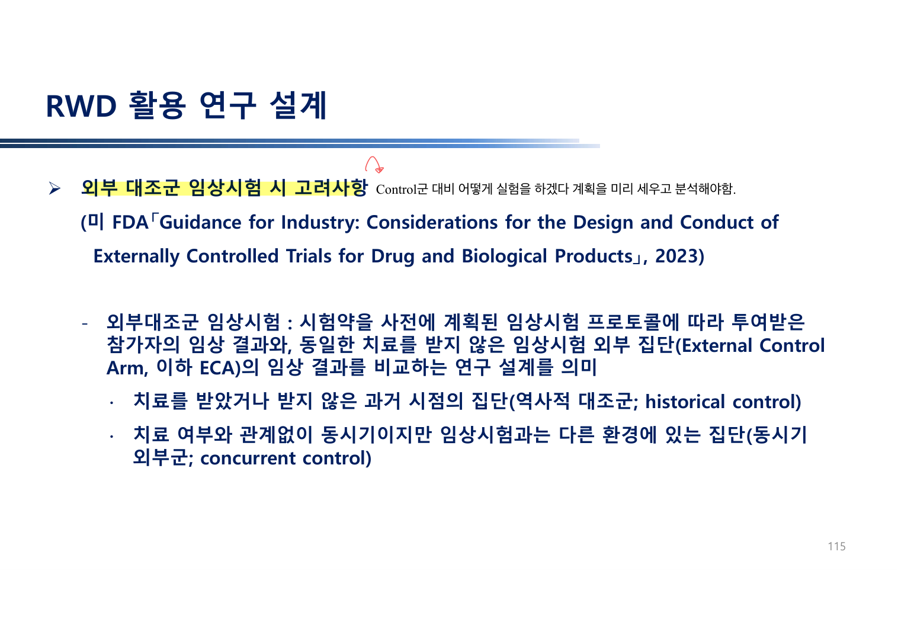

# 문제
분산형 임상시험과 RWD 외부대조군을 규제에 활용할 때 핵심 조건을 쓰시오.

답:
**분산형 임상시험**: 자료 신뢰성, 대상자 안전, 개인정보 보호 보장
**RWD 외부대조군**: 비교 가능한 **환자수준 자료** 필요
핵심 조건: **자료의 질**, **추적 가능성**, **편향 통제**, **사전 분석계획**

[배경설명]
**분산형 임상시험**은 병원 방문 중심의 임상시험을 일부 바꾼 방식이다.
집이나 지역사회에서도 자료를 모을 수 있게 한다.
이 방식은 **환자 접근성**을 높이고 실제 **생활환경**의 자료를 모을 수 있다.
하지만 **원격진료와 개인정보보호** 같은 규제 문제가 함께 생긴다.

**외부대조군**은 임상시험 안에 별도 대조군을 두기 어렵거나 비윤리적인 경우에 쓴다.
밖에 있는 과거 또는 동시기 환자 자료를 비교군으로 쓰는 개념이다.
규제 근거로 쓰려면 **환자별 추적이 가능한 자료**여야 한다.
단순 평균이나 요약표만 비교해서는 **삐뚤림**을 제대로 통제할 수 없다.

분산형 임상시험은 병원을 없애는 것이 아니라, 필요한 절차 중 일부를 **병원 밖으로 옮기는 방식**이다.
**모바일 기기나 원격 모니터링 자료**도 규제 판단에 쓰려면 측정이 정확하고 누가 언제 측정했는지 추적 가능해야 한다.

외부대조군은 편리하지만 임상시험 안에서 **무작위배정**된 대조군보다 **편향 위험**이 크다.
그래서 **자료의 질**이 특히 중요하다.
출처: 의약품규제및규제과학개론 기말고사 범위 정리본.pdf p.12
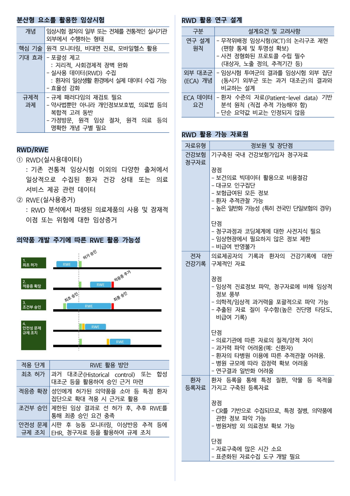

# 문제
바이오마커와 동반진단(CDx)이 무엇인지 설명하고, 바이오마커 적격성평가 항목을 쓰시오.

답:
**바이오마커**: 객관적으로 측정 가능한 생물학적 지표
**CDx**: 특정 바이오마커 기반으로 치료 반응성을 예측해 최적 치료제를 선택하게 하는 진단도구
적격성평가: **분석적 유효성, 임상적 유효성, 임상적 유용성**

[배경설명]
바이오마커는 몸속 상태나 **질병 상태**를 보여 주는 측정 지표이다.
동반진단은 특정 약을 쓸 환자를 고르거나 치료반응을 예측하기 위해 함께 쓰는 진단검사이다.

**분석적 유효성**은 검사 자체가 정확하고 재현성 있게 측정되는지를 보는 것이다.
**임상적 유효성**은 그 측정값이 실제 **질병 상태**나 치료반응과 관련되는지를 보는 것이다.

**임상적 유용성**은 그 검사를 사용했을 때 실제 치료결정이나 환자 결과에 도움이 되는지를 보는 것이다.
쉽게 말하면 분석적 유효성은 검사가 기술적으로 잘 맞는지를 본다.
임상적 유효성은 그 값이 **질병과 연결되는지**를 본다.
임상적 유용성은 환자 치료에 실제 도움이 되는지를 본다.

동반진단은 아무 환자에게나 약을 쓰지 않고, 그 약에 반응할 가능성이 높은 환자를 고르는 데 쓰인다.
따라서 바이오마커는 신약개발과 허가에서 대상자 선택, **용량** 설정, 효과 예측에 연결된다.
출처: 의약품규제및규제과학개론 기말고사 범위 수업자료.pdf p.196 + 의약품규제및규제과학개론 기말고사 범위 수업자료.pdf p.197 + 의약품규제및규제과학개론 기말고사 범위 수업자료.pdf p.200
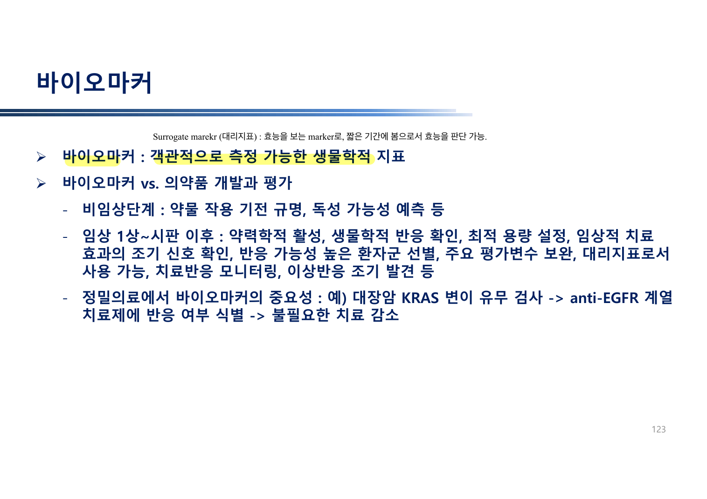
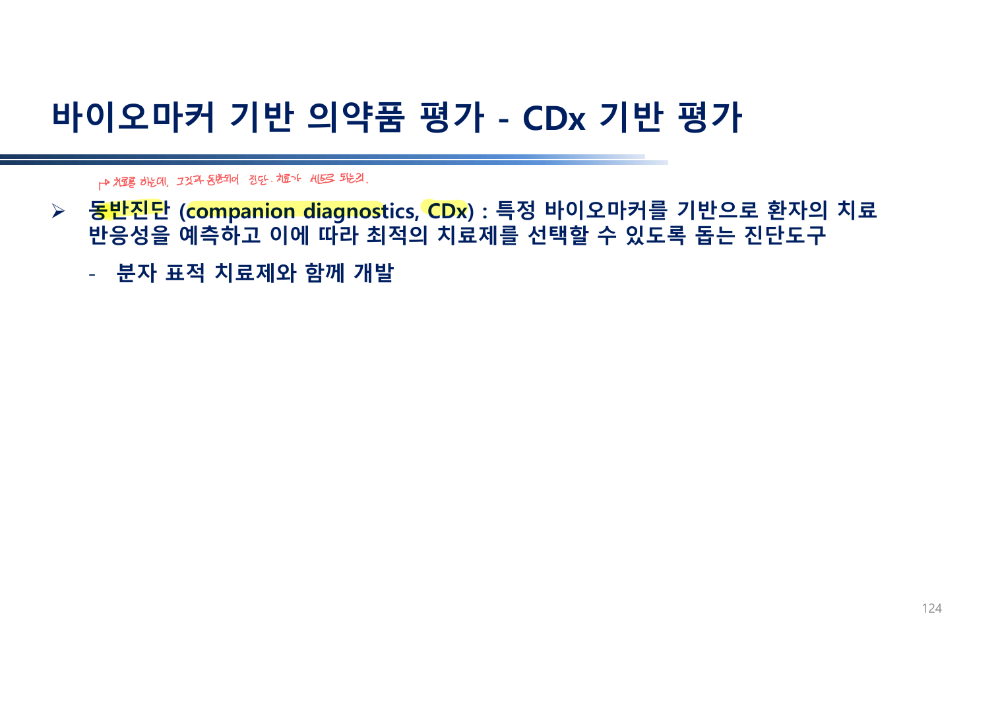
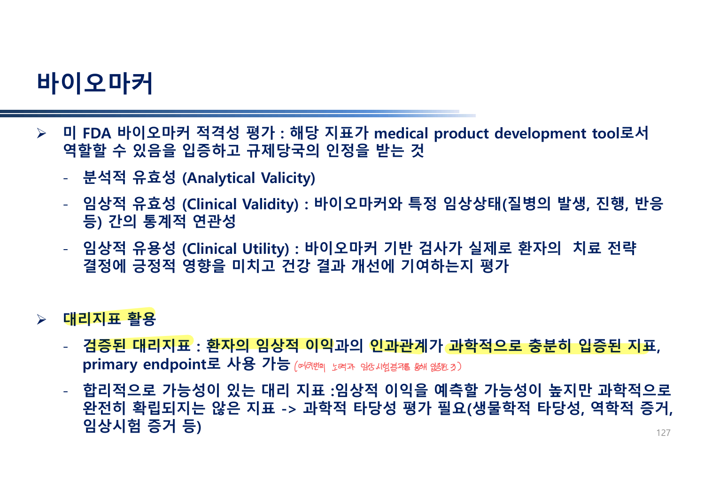

# 문제
바이오제네릭이라는 개념이 성립하기 어려운 이유와 바이오시밀러 개념을 쓰시오.

답:
이유: **바이오의약품**은 생물 유래라 구조가 복잡하고 **제조공정에 따라 품질 변동성**이 크기 때문이다
그래서 완전히 같은 복제약이라는 **바이오제네릭** 개념이 성립하기 어렵다
**바이오시밀러**: 대조약과 **비교동등성**을 입증하는 바이오의약품

[배경설명]
**화학의약품** 제네릭은 주성분 구조가 비교적 명확해서 원개발약과 같은 성분이라고 말하기 쉽다.
바이오의약품은 세포와 복잡한 **제조공정**으로 만들어져 단백질 구조, 당화, 불순물 같은 특성이 완전히 같아지기 어렵다.

그래서 바이오의약품에서는 **바이오제네릭**처럼 완전히 같은 복제약이라는 표현이 잘 맞지 않는다.
**바이오시밀러**는 **대조약**과 **품질**, **안전성**, 유효성이 매우 유사하고 임상적으로 의미 있는 차이가 없음을 보여 주는 제품이다.

제네릭은 원개발 **화학의약품**과 같은 주성분을 가진 복제약이라는 개념이다.
하지만 바이오의약품은 제조세포와 공정이 **품질**에 큰 영향을 주기 때문에 완전히 같은 복제라는 표현을 쓰기 어렵다.

그래서 규제에서는 **동일성**보다 **유사성과 임상적으로 의미 있는 차이 없음**을 입증하는 방향으로 간다.
출처: 의약품규제및규제과학개론 기말고사 범위 수업자료.pdf p.207 + 의약품규제및규제과학개론 기말고사 범위 수업자료.pdf p.215
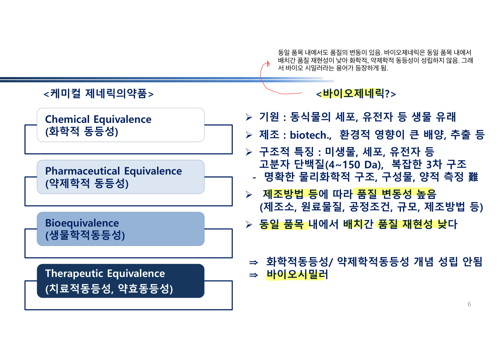
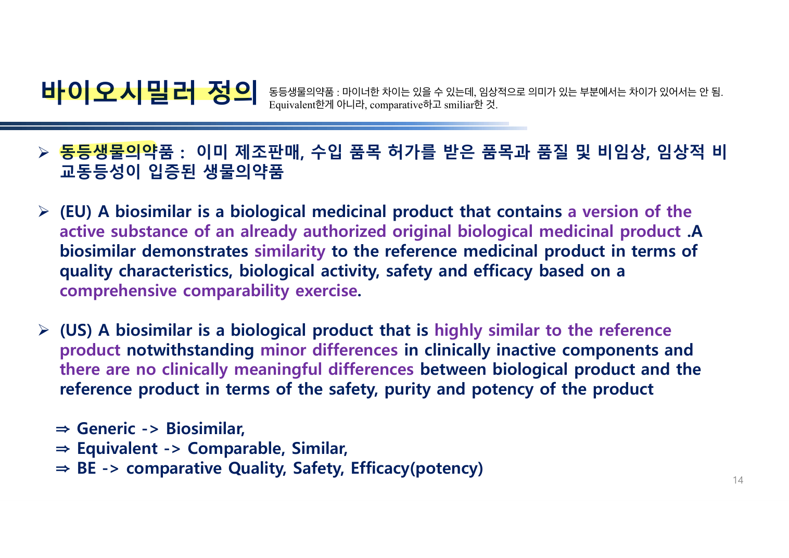

# 문제
바이오시밀러 동등성평가의 두 핵심 원칙을 쓰시오.

답:
==Stepwise approach==
==Totality of evidence==

[배경설명]
**바이오시밀러** 평가는 처음부터 새 약처럼 유효성을 다시 전부 증명하는 방식이 아니다.
먼저 **대조약**과 구조, 순도, 생물학적 활성 같은 **품질**특성이 충분히 유사한지 비교한다.

**품질** 비교에서 남는 불확실성이 있으면 비임상시험과 임상시험으로 그 불확실성을 줄인다.
이 과정을 **단계적 접근**이라고 하고, 전체 목적은 **대조약**과 임상적으로 의미 있는 차이가 없음을 보이는 것이다.

==Stepwise approach==: **품질** 비교부터 시작해 필요한 만큼만 비임상과 임상으로 넘어가는 방식
==Totality of evidence==: **품질**, 비임상, 임상 자료를 따로따로 보지 않고 전체 근거로 종합 판단

**품질** 비교가 강하게 뒷받침되면 뒤 단계의 시험 부담이 줄어들 수 있지만, 남은 의문이 있으면 추가 자료가 필요하다.
출처: 의약품규제및규제과학개론 기말고사 범위 수업자료.pdf p.214
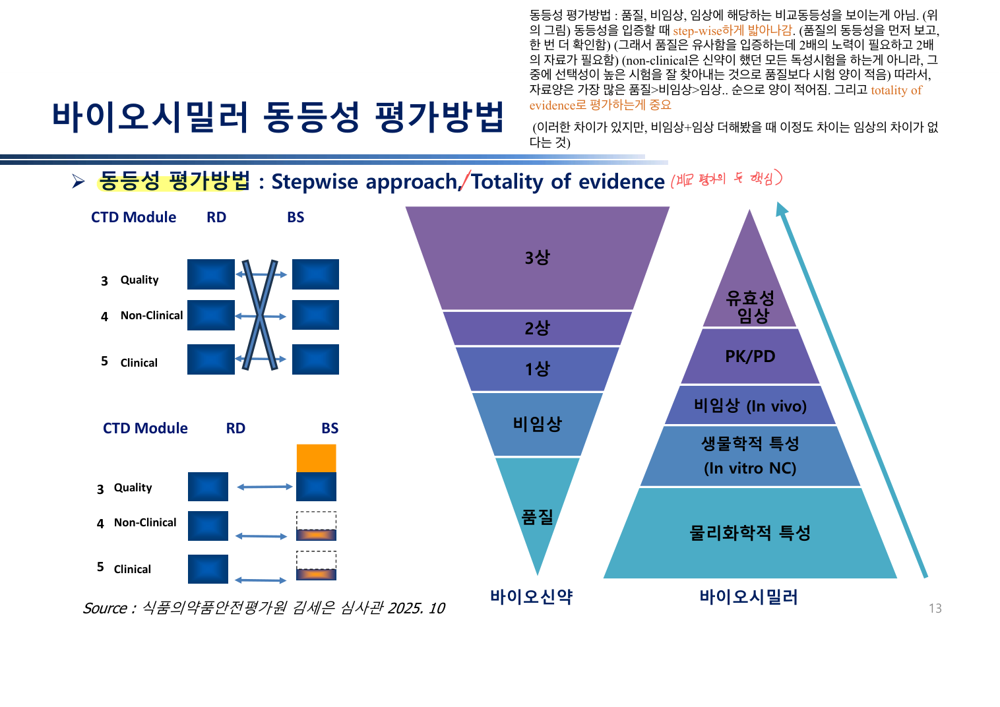

# 문제
바이오시밀러 품질개발 및 평가에서 head-to-head 비교와 orthogonal methods가 필요한 이유를 쓰시오.

답:
**head-to-head 비교**: 시험약과 대조약을 같은 조건에서 직접 비교하기 위해
**대조약 여러 batch 분석**: 대조약의 허용 가능한 품질 변동 범위를 잡기 위해
**orthogonal methods**: 한 시험법이 놓친 차이를 다른 원리의 시험법으로 확인하기 위해

[배경설명]
**Head-to-head 비교**는 **바이오시밀러**와 **대조약**을 같은 조건에서 직접 비교한다는 뜻이다.
바이오의약품은 **구조와 기능이 복잡**해서 한 가지 시험만으로 유사성을 판단하기 어렵다.

**Orthogonal methods**는 서로 원리가 다른 여러 분석법을 함께 쓰는 접근이다.
같은 결론이 나오는지 확인한다.
서로 다른 방법에서 모두 유사성이 보이면 **품질 비교의 신뢰도**가 높아진다.

**대조약의 여러 batch**를 보는 이유는 **대조약** 자체도 제조 시기마다 허용 가능한 변동 범위가 있기 때문이다.
**바이오시밀러**는 그 **허용 가능한 변동 안에서 대조약과 유사**해야 한다.

한 분석법이 놓친 차이를 **다른 원리의 시험법**이 잡아낼 수 있으므로 여러 방법을 함께 쓴다.
출처: 의약품규제및규제과학개론 기말고사 범위 수업자료.pdf p.216 + 의약품규제및규제과학개론 기말고사 범위 수업자료.pdf p.217
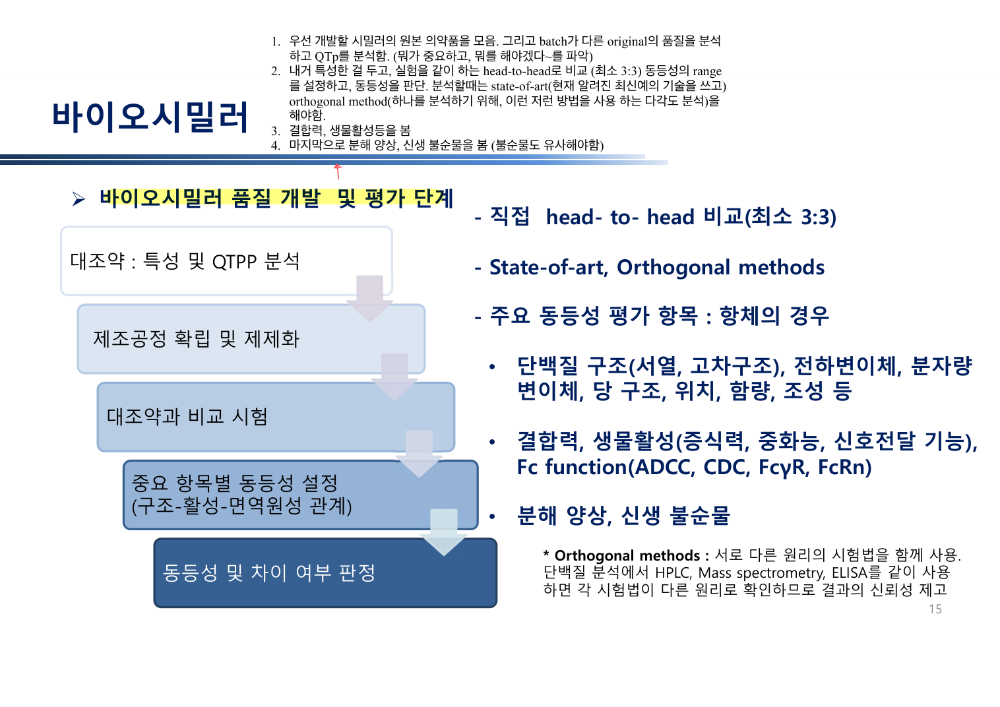
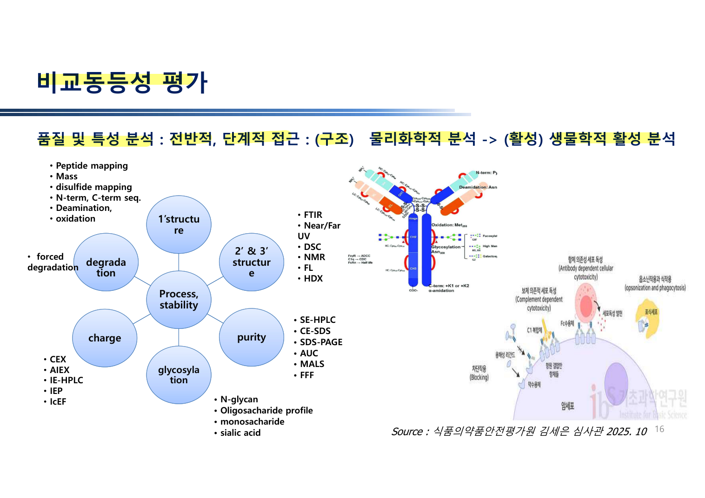

# 문제
바이오시밀러 품질 및 특성 비교동등성 원칙으로 옳은 것을 모두 고르시오.

- 물리, 화학, 생물학적 특성에서 대조약과 유사해야 한다
- minor difference는 있을 수 있다
- 품질 차이가 안전성, 유효성에서 임상적으로 의미 있는 차이를 만들면 안 된다
- 허용 변동성은 대조약 배치 간 변동성 기준 안에 있어야 한다
- 임상적으로 중요한 품질인자가 대조약 범위 밖이어도 항상 허용된다
- 구조 분석에서 차이가 보여도 기능과 안전성 평가는 생략할 수 있다
- 대조약과 비교하지 않아도 자체 기준만 만족하면 바이오시밀러로 인정된다

답:
**물리, 화학, 생물학적 특성**에서 **대조약**과 유사해야 한다
**minor difference**는 있을 수 있다
품질 차이가 **안전성, 유효성**에서 **임상적으로 의미 있는 차이**를 만들면 안 된다
허용 변동성은 **대조약 배치 간 변동성** 기준 안에 있어야 한다

[보기해설]
O 물리, 화학, 생물학적 특성에서 대조약과 유사해야 한다
O minor difference는 있을 수 있다
O 품질 차이가 안전성, 유효성에서 임상적으로 의미 있는 차이를 만들면 안 된다
O 허용 변동성은 대조약 배치 간 변동성 기준 안에 있어야 한다
X 임상적으로 중요한 품질인자가 대조약 범위 밖이어도 항상 허용된다 -> 중요한 품질인자가 범위 밖이면 **안전성, 유효성, 면역원성** 영향을 추가로 설명해야 하며 항상 허용되지 않는다.
X 구조 분석에서 차이가 보여도 기능과 안전성 평가는 생략할 수 있다 -> 구조 차이가 있으면 **기능과 안전성**에 미치는 영향을 확인해야 한다.
X 대조약과 비교하지 않아도 자체 기준만 만족하면 바이오시밀러로 인정된다 -> 바이오시밀러는 **대조약과의 직접 비교동등성**이 핵심이므로 자체 기준만으로는 부족하다.
[배경설명]
**바이오시밀러**의 **비교동등성**은 모든 항목이 숫자상 완전히 같아야 한다는 뜻이 아니다.
중요한 기준은 **품질** 차이가 환자에게 의미 있는 **안전성ㆍ유효성 차이**로 이어지지 않는지이다.
**중요 품질인자**는 약의 작용, **안전성**, 면역원성에 영향을 줄 수 있으므로 **대조약**과 충분히 유사해야 한다.
**대조약의 변동 범위**를 벗어나거나 중요한 기능 차이가 있으면 **임상적으로 의미 있는 차이**를 의심하게 된다.
구조 차이가 보이면 그 차이가 **기능, 안전성, 유효성**에 영향을 주는지 더 따져야 하므로 평가를 생략할 수 없다.
**바이오시밀러**는 이름 그대로 **대조약과의 비교**가 핵심이므로 자체 기준만 만족하는 것으로는 부족하다.
작은 차이는 허용될 수 있지만, 그 차이가 **환자에게 의미 있는 차이**로 이어지지 않는다는 설명이 필요하다.

출처: 의약품규제및규제과학개론 기말고사 범위 수업자료.pdf p.218
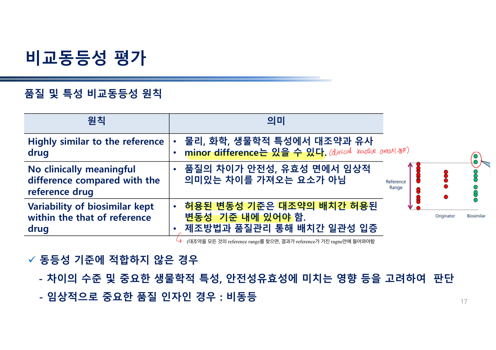

# 문제
바이오시밀러 비임상평가와 임상 비교동등성 평가의 핵심을 쓰시오.

답:
**비임상평가**는 **민감한 항목과 방법**으로 차이를 식별한다
**In vitro**는 필수이고 **in vivo**는 필요 시 수행한다
**임상 비교동등성**은 새 효과를 입증하는 것이 아니라 **임상적으로 의미 있는 차이가 없음을 확인**한다

[배경설명]
**바이오시밀러 비임상평가**는 동물시험을 많이 하는 것이 목적이 아니다.
**품질**ㆍ기능 비교 후 남은 **안전성** 의문을 확인하는 단계이다.
**임상 비교동등성 평가**는 **대조약**과 실제 사람에서 **의미 있는 차이가 없는지** 보는 단계이다.

**품질과 기능분석**이 충분히 강하면 비임상이나 임상시험의 범위가 줄어들 수 있다.
반대로 **품질** 비교만으로 설명되지 않는 **불확실성**이 남으면 추가 비임상 또는 임상 자료가 필요하다.

**In vitro**는 시험관이나 세포 수준에서 기능을 비교하는 시험이다.
**In vivo**는 동물 등 살아있는 생체에서 보는 시험이다.
**바이오시밀러**에서는 **민감한 in vitro 기능시험**이 차이를 더 잘 잡아낼 수 있어 중요하다.

임상시험도 새 약처럼 효과를 새로 발견하는 것이 아니라, **대조약과 의미 있는 차이가 없는지 확인**하는 데 초점이 있다.
출처: 의약품규제및규제과학개론 기말고사 범위 수업자료.pdf p.219 + 의약품규제및규제과학개론 기말고사 범위 수업자료.pdf p.220 + 의약품규제및규제과학개론 기말고사 범위 수업자료.pdf p.231 + 의약품규제및규제과학개론 기말고사 범위 수업자료.pdf p.234
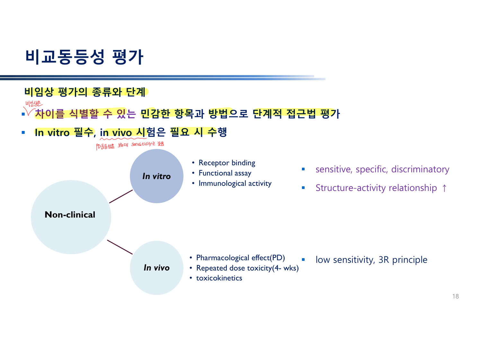
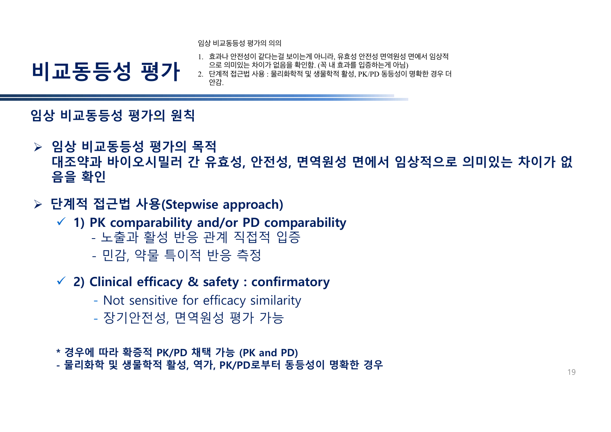
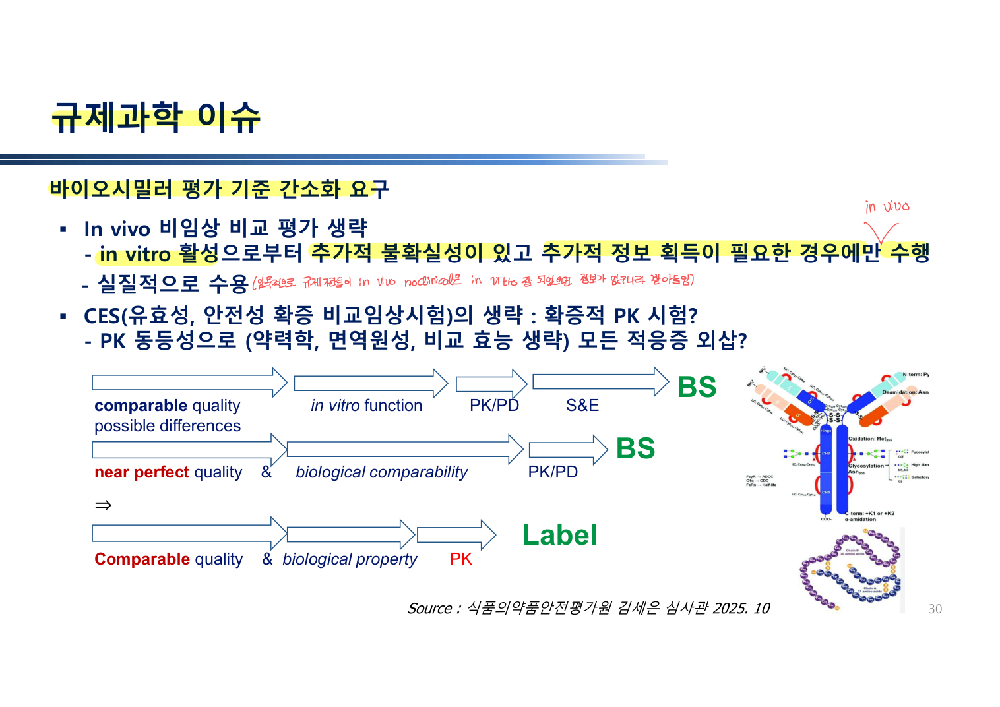
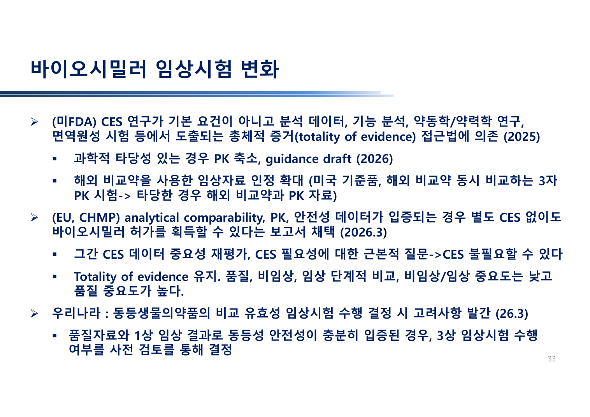

# 문제
바이오시밀러의 가교동등성과 적응증 외삽 기준을 쓰시오.

답:
글로벌 개발제품은 US 또는 EU 대조약과 국내 대조약을 포함한 **3-way 비교**를 고려한다
**적응증 외삽**은 비교동등성이 입증되면 고려되지만 **자동으로 부여되는 것은 아니다**
기준은 **totality of evidence**, **과학적 타당성**, **작용기전 동일성**, **PK, PD, 안전성, 면역원성 자료**이다

[배경설명]
**가교동등성**: 여러 지역 또는 여러 **대조약** 자료를 연결해 같은 비교 논리로 인정할 수 있는지 보는 것

**적응증 외삽**: 한 적응증에서 비교**동등성**을 보인 뒤, 
**대조약**이 가진 다른 적응증에도 그 결론을 적용하는 것

O약 = 오리지널/대조약
S약 = 시밀러/바이오시밀러
X병 = 직접 비교한 적응증
Y병 = 외삽하려는 적응증
**관계**
O약은 **X병, Y병** 둘 다 허가됨
S약은 **X병**에서 O약과 **비교동등성**을 입증함
그러면 근거가 충분할 때 S약도 Y병에 허가 가능

외삽이 가능하려면 **작용기전, 수용체, 안전성, 면역원성, 환자군 차이**를 설명할 수 있어야 한다.
작용기전이 다르거나 특정 적응증에서 **안전성** 차이가 예상되면 **모든 적응증으로 자동 확대할 수 없다**.

**3-way 비교**는 해외 **대조약**, 국내 **대조약**, **바이오시밀러**를 서로 연결해 비교하는 방식이다.
적응증 외삽은 **임상시험을 하지 않은 적응증까지 허용**할 수 있는지 보는 규제 판단이다.

**작용기전이 같고 안전성 차이가 설명**되면 외삽 가능성이 커지지만, 근거 없이 자동으로 따라오는 권리는 아니다.
출처: 의약품규제및규제과학개론 기말고사 범위 수업자료.pdf p.225 + 의약품규제및규제과학개론 기말고사 범위 수업자료.pdf p.226
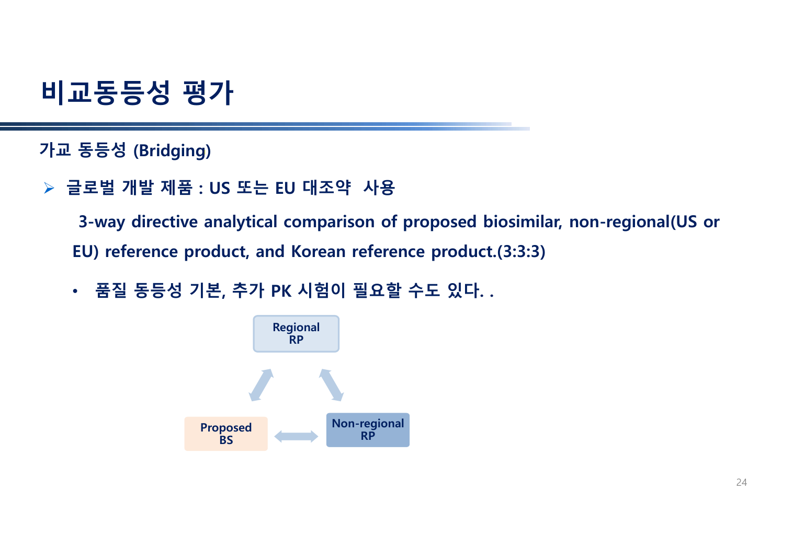
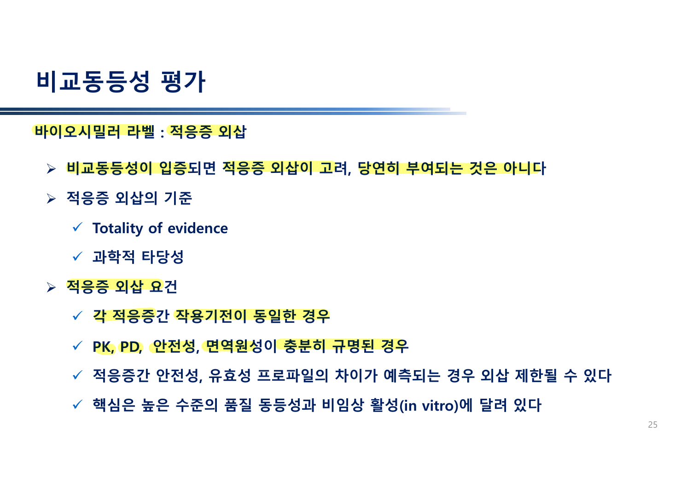

# 문제
BA, BE, TE를 구분하시오.

답:
**BA**: 주성분 또는 활성대사체가 흡수되는 **속도와 양**
**BE**: 두 제제가 흡수 속도와 양에서 유의한 차이가 없는 상태
**TE**: 약제학적동등성과 생물학적동등성을 입증해 임상적 효과와 안전성 프로파일이 같다고 보는 것

[배경설명]
**BA**는 Bioavailability, 즉 **생체이용률**이다.
약이 투여된 뒤 몸속으로 얼마나, 얼마나 빠르게 들어오는지를 보는 개념이다.
**BE**는 Bioequivalence, 즉 **생물학적동등성**이다.
두 제제의 생체이용률이 통계적으로 동등한지 비교한다.

**TE**는 Therapeutic Equivalence, 즉 **치료적동등성**이다.
생물학적**동등성**을 넘어 실제 치료효과와 **안전성**까지 같은 수준으로 기대할 수 있다는 의미이다.
따라서 **BA는 흡수 특성**, **BE는 흡수 비교**, **TE는 치료 결과**까지 연결된 개념이다.

**BA**는 비교 대상이 없어도 한 약의 흡수 특성을 설명할 수 있다.
**BE**는 시험약과 **대조약** 두 제품을 비교해 흡수의 속도와 양이 동등한지 본다.

**TE**는 환자 치료 관점에서 서로 대체해도 된다고 볼 수 있는지까지 이어지는 더 넓은 개념이다.
출처: 의약품규제및규제과학개론 기말고사 범위 수업자료.pdf p.245 + 의약품규제및규제과학개론 기말고사 범위 수업자료.pdf p.248
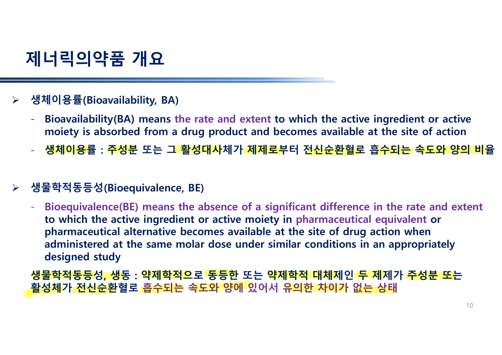
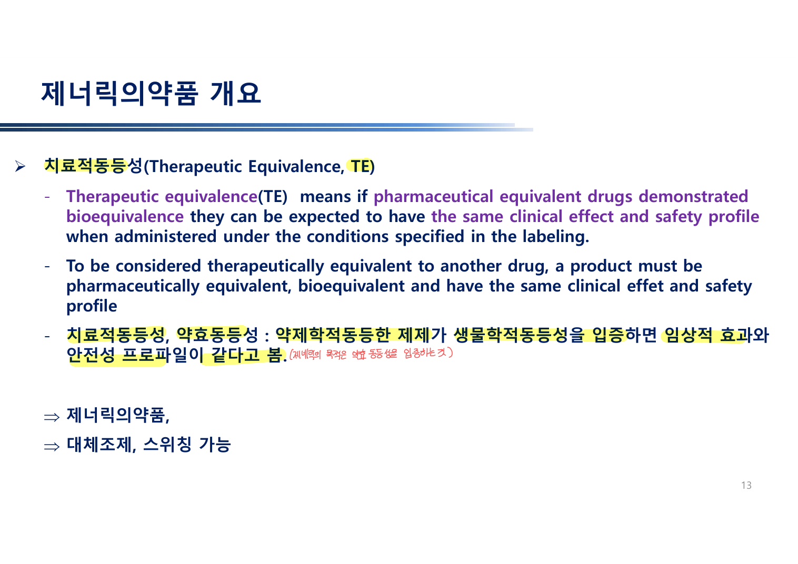

# 문제
약효동등성 입증체계에서 생동시험, in vitro 시험, 면제 또는 대체시험을 구분하시오.

답:
**생동시험 또는 비교임상시험**: 사람에게 투여해서 대조약과 시험약의 체내 동등성을 확인하는 시험
보통 생동시험은 AUC, Cmax 같은 PK를 비교하고, 생동시험이 어려우면 비교임상시험을 한다.
**In vitro 시험**: 사람 몸 밖에서 제제의 동등성을 확인하는 시험 (예: 비교용출시험, 비교붕해시험)
**면제 또는 대체시험**: 생동시험이 무의미하거나 불필요한 경우, 또는 BCS Class IㆍIII 등 조건을 만족하는 경우 
생동시험을 면제하거나 이화학적동등성시험 등으로 대체한다.

[배경설명]
**의약품동등성**: 주성분, 함량, 제형이 같은 두 제제가 품질과 성능 면에서 동등하다고 보는 큰 개념
**생물학적동등성**: 두 제제의 흡수 속도와 양이 동등함을 AUC와 Cmax로 입증하는 대표 수단
**약효동등성**: (BE 등을 통해) 최종적으로 두 제제의 치료효과와 안전성이 동등하다고 인정하는 결론

**약효동등성**은 제네릭의약품이 **대조약**과 같은 치료효과를 기대할 수 있음을 입증하는 큰 목표이다.
**생동시험**은 혈중농도 자료로 두 제제의 흡수 정도와 속도가 동등한지 보는 대표 방법이다.

**In vitro 시험**은 사람에게 투여하지 않고 용출시험 등 시험관 조건에서 제제 특성을 비교하는 방법이다.
위험이 낮거나 과학적으로 타당한 경우에는 **생동시험 면제** 또는 다른 시험으로 대체할 수 있다.

**약효동등성 입증체계**는 모든 제네릭에 같은 시험을 요구하지 않고, 제품 특성에 맞는 방법을 고르는 구조이다.
혈중농도 비교가 필요한 경우에는 **생동시험**을 한다.
용출 특성만으로 충분히 설명되는 경우에는 **in vitro 시험**이 활용될 수 있다.

면제나 대체는 시험을 안 해도 된다는 뜻이 아니라, **과학적으로 다른 근거가 충분**하다는 뜻이다.
출처: 의약품규제및규제과학개론 기말고사 범위 수업자료.pdf p.253 + 의약품규제및규제과학개론 기말고사 범위 수업자료.pdf p.254
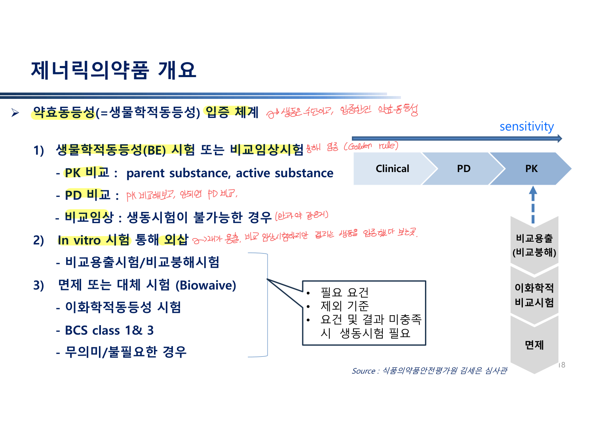
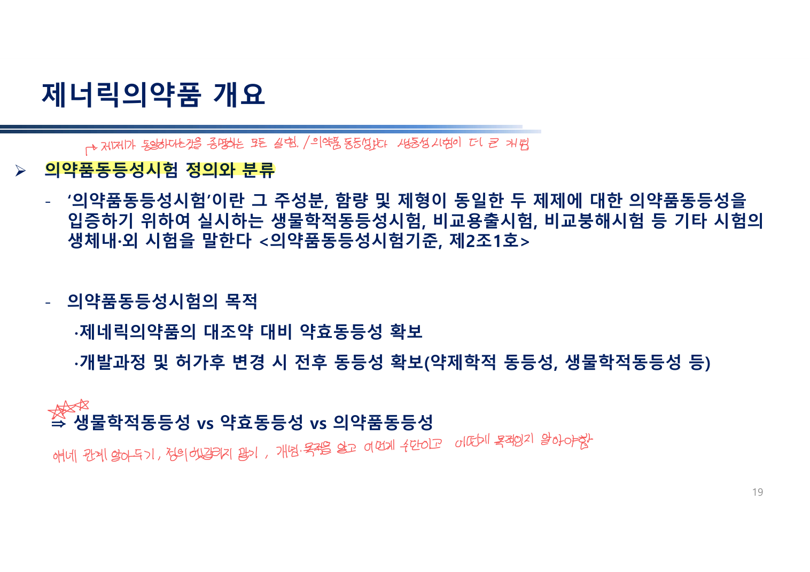

# 문제
BCS Class I과 Class III에서 생물학적동등성시험 면제가 가능한 조건을 쓰고, Class II와 Class IV는 어떻게 보는지 쓰시오.

답:
**Class I**: 고용해도, 고투과도이며 대조약과 시험약의 용출 양상이 유사해야 한다
**Class III**: 고용해도, 저투과도이며 대조약과 시험약이 15분 이내 85% 이상 용출되어야 한다
**Class II**와 **Class IV**는 면제 해당 없음

[배경설명]
**BCS**는 **용해도와 투과도**를 기준으로 약물을 나누는 분류체계이다.
**용해도**는 약이 잘 녹는지, **투과도**는 장에서 몸 안으로 잘 넘어가는지를 의미한다.

**Class I**은 잘 녹고 잘 흡수되는 약물이므로 용출 양상이 충분히 비슷하면 생동시험 면제를 검토할 수 있다.
**Class III**은 잘 녹지만 투과도가 낮으므로 더 엄격하게 빠른 용출 조건을 본다.

**Class II와 Class IV**는 용해도 문제가 있어 단순 용출자료만으로 **생동성**을 인정하기 어렵다.
**용출**은 알약이나 캡슐에서 주성분이 녹아 나오는 과정을 말한다.

**고용해도 약물**은 잘 녹기 때문에 제제 차이가 작으면 몸속 흡수 차이도 작을 가능성이 있다.
**저용해도 약물**은 녹는 과정 자체가 흡수를 좌우할 수 있으므로 생동시험 면제를 쉽게 인정하기 어렵다.
출처: 의약품규제및규제과학개론 기말고사 범위 정리본.pdf p.17
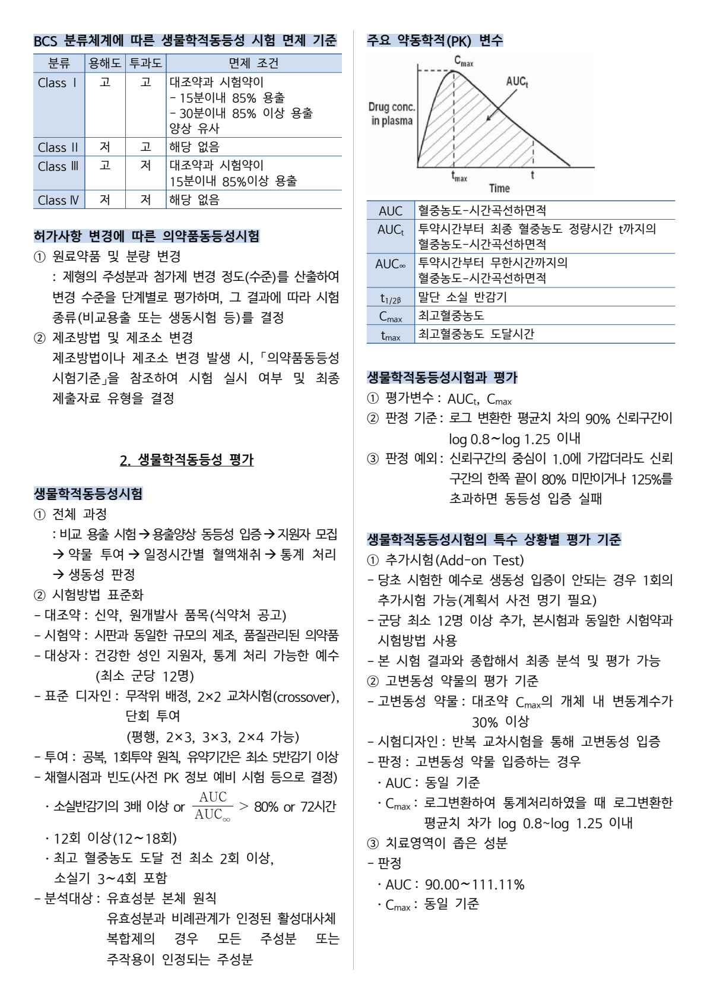

# 문제
제너릭의약품이 생물학적동등성을 입증했다는 의미를 정확히 쓰시오.

답:
**혈중농도 자체가 80~125%라는 뜻이 아니다**
AUC와 Cmax의 ==기하평균비(T/R)의 90% 신뢰구간==이 80.00~125.00% 이내라는 뜻
흡수의 **속도와 양**이 동등하다는 의미이다

[배경설명]
생물학적**동등성**은 시험약과 **대조약**의 혈중 노출이 허용 범위 안에서 같다고 판단되는 상태이다.
**AUC**는 몸이 약에 전체적으로 얼마나 노출되었는지를 나타내고, **Cmax**는 혈중농도의 최고치를 나타낸다.

두 지표의 시험약/**대조약** 비율을 계산한 뒤, 그 **90% 신뢰구간 전체**가 0.8~1.25 안에 들어와야 한다.
평균값 하나만 범위 안에 있는 것이 아니라 신뢰구간 전체가 들어와야 한다는 점이 중요하다.

시험약은 제네릭 제품이고, **대조약**은 비교 기준이 되는 원개발약 또는 지정 **대조약**이다.
**90% 신뢰구간**은 계산된 비율이 통계적으로 어느 범위 안에 있을지 보여 주는 구간이다.

구간 한쪽 끝이라도 80% 미만이거나 125% 초과이면 두 제제가 동등하다고 보기 어렵다.
출처: 의약품규제및규제과학개론 기말고사 범위 수업자료.pdf p.265 + 의약품규제및규제과학개론 기말고사 범위 수업자료.pdf p.266 + 의약품규제및규제과학개론 기말고사 범위 수업자료.pdf p.270 + 의약품규제및규제과학개론 기말고사 범위 수업자료.pdf p.272
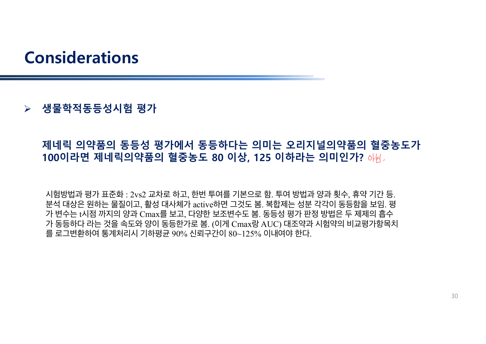
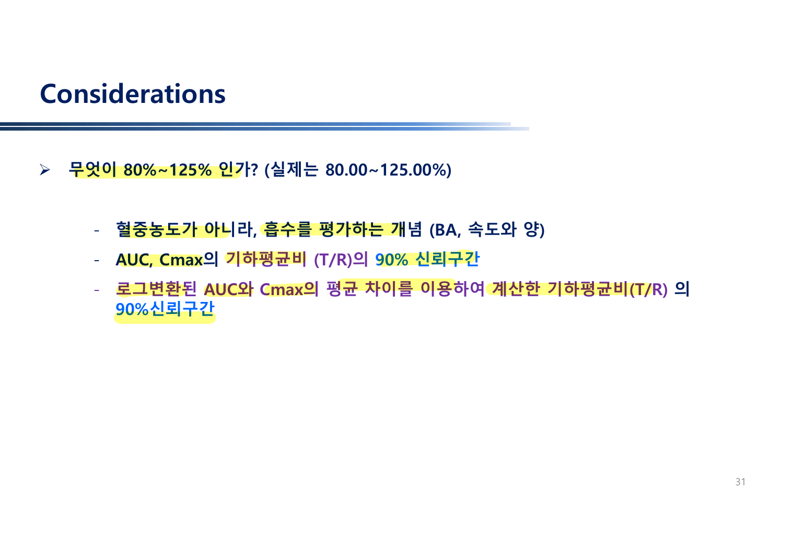
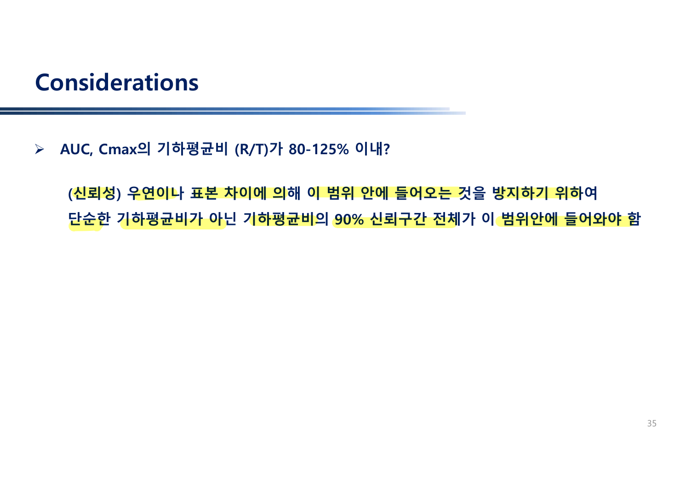
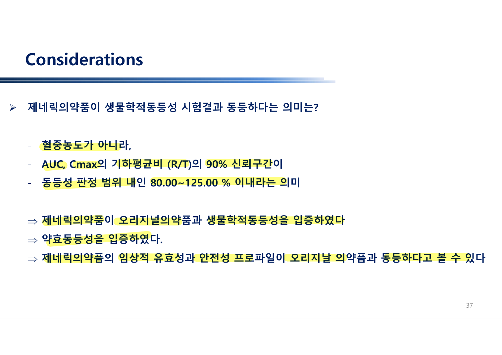

# 문제
생동성 판정범위가 80~120이 아니라 80~125인 이유를 쓰시오.

답:
**혈중농도 자료**가 **로그정규분포**를 따르기 때문이다
일반 스케일에서는 **80과 120이 대칭이 아니지만**,
로그 스케일에서는 **log(0.8)**과 **log(1.25)**가 대칭이므로 80~125%를 쓴다

[배경설명]
**생동성** 판정은 원자료 그대로가 아니라 **로그변환**한 값으로 비교한다.
비율 자료에서는 100%를 기준으로 아래쪽과 위쪽의 대칭이 일반 숫자 눈금과 다르게 보인다.

0.8의 역수는 1.25이므로, 로그 스케일에서는 80%와 125%가 100%를 중심으로 대칭이 된다.
그래서 판정범위가 80~120이 아니라 **80~125**로 제시된다.

생동시험은 비율을 비교하는 시험이라서 100%보다 낮아지는 정도와 높아지는 정도를 같은 방식으로 봐야 한다.
일반 숫자 눈금에서는 80과 120이 100에서 각각 20씩 떨어져 대칭처럼 보인다.

하지만 비율의 관점에서는 80%의 반대쪽 대칭값이 120%가 아니라 125%이므로 **로그변환** 기준을 쓴다.
출처: 의약품규제및규제과학개론 기말고사 범위 수업자료.pdf p.268 + 의약품규제및규제과학개론 기말고사 범위 수업자료.pdf p.269
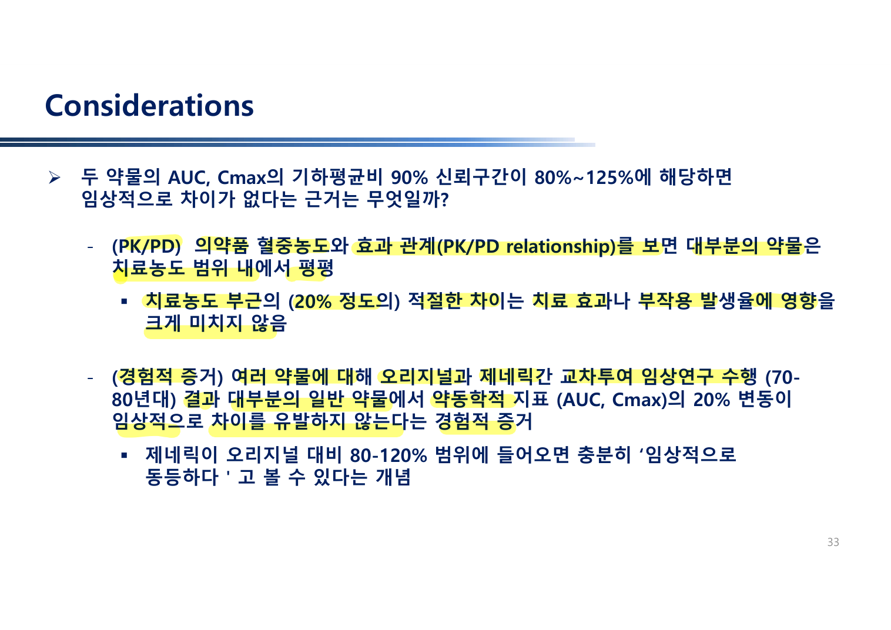
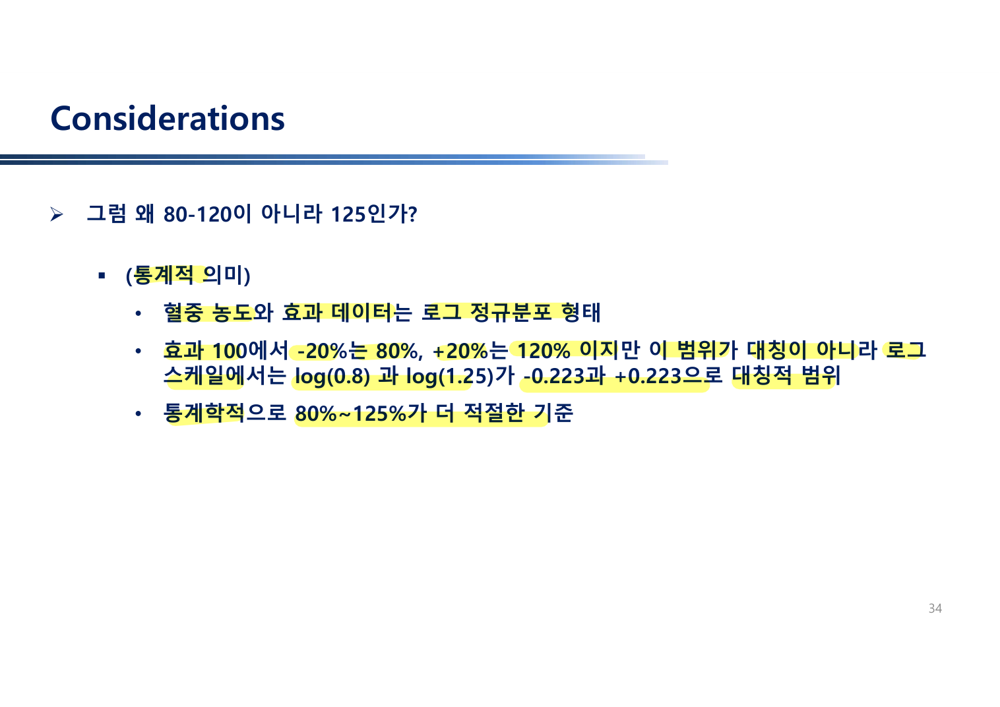

# 문제
생물학적동등성시험의 표준 디자인과 평가변수를 쓰시오.

답:
**건강한 성인지원자**
**무작위배정, 2x2 교차, 단회투여**
**공복 원칙**, **휴약기간 최소 5반감기 이상**
평가변수는 **AUCt, AUC∞, Cmax**

[배경설명]
표준 생동시험은 같은 대상자가 시험약과 **대조약**을 모두 복용해 두 제제를 비교하는 **교차설계**가 기본이다.
두 기간 사이에는 앞서 먹은 약의 영향이 남지 않도록 **휴약기**를 둔다.

평가변수는 약물이 몸에 노출된 정도를 보는 **AUC**와 최고혈중농도를 보는 **Cmax**이다.
두 지표를 **로그변환**한 뒤 시험약/**대조약** 비율의 **90% 신뢰구간**이 log 0.8~log 1.25 안에 들어오는지 판단한다.

**교차설계**는 같은 사람이 한 번은 시험약, 다른 한 번은 **대조약**을 복용해 개인차를 줄이는 방식이다.
**휴약기**간은 첫 번째로 먹은 약이 몸에서 충분히 빠져나가 다음 기간 결과에 영향을 주지 않게 하는 시간이다.

공복 조건을 맞추는 이유는 음식이 약물 흡수에 영향을 줄 수 있기 때문이다.
출처: 의약품규제및규제과학개론 기말고사 범위 수업자료.pdf p.275 + 의약품규제및규제과학개론 기말고사 범위 수업자료.pdf p.279
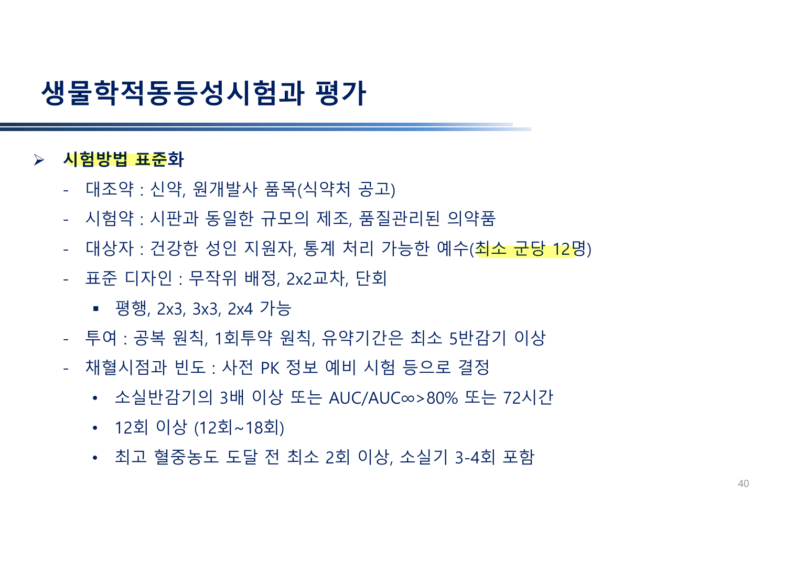
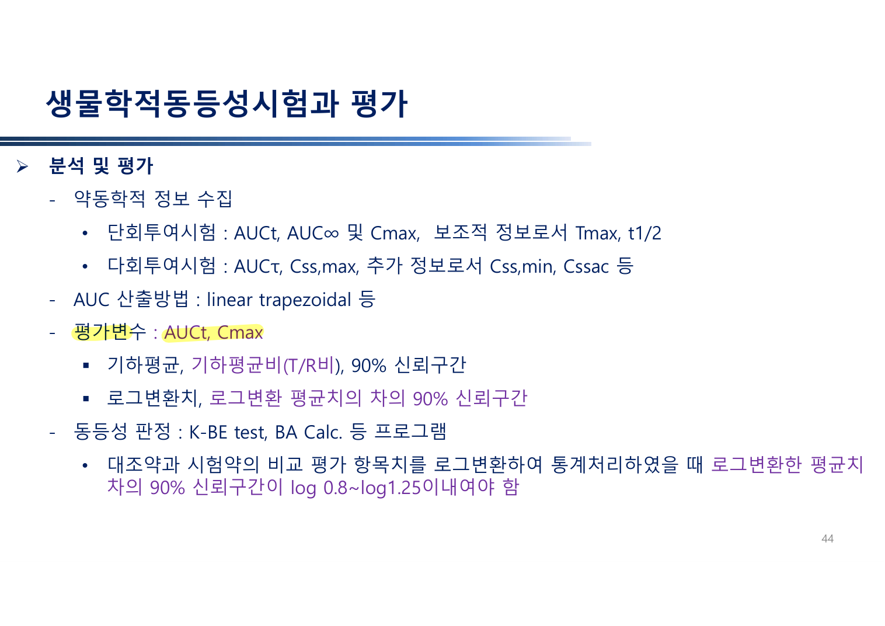

# 문제
고변동성 약물과 치료영역이 좁은 성분의 생동성 판정 예외를 구분하시오.

답:
**고변동성 약물**: 대조약 Cmax의 개체 내 변동계수 30% 이상
**치료영역이 좁은 성분**: **AUC** 판정기준 **90.00~111.11%**

[배경설명]
고변동성 약물은 같은 약을 먹어도 사람마다 또는 같은 사람 안에서도 **Cmax** 변동이 큰 약물이다.
이 경우 일반 기준을 그대로 적용하면 실제로는 문제가 없는데 동등하지 않다고 나올 수 있다.
그래서 **Cmax** 판정범위가 넓어질 수 있다.

**치료영역이 좁은 성분**은 조금만 농도가 달라도 효과 부족이나 독성 위험이 커지는 약물이다.
이 경우 안전하게 관리해야 하므로 판정기준이 더 엄격해진다.

고변동성 약물은 측정값의 흔들림이 커서 일반 기준을 그대로 쓰면 불필요하게 실패 판정이 나올 수 있다.
**Cmax**는 최고혈중농도라 개인차와 시점 차이의 영향을 크게 받을 수 있다.

치료영역이 좁은 약물은 반대로 작은 차이도 환자 안전에 영향을 줄 수 있어 **AUC** 기준을 더 좁게 본다.
출처: 의약품규제및규제과학개론 기말고사 범위 수업자료.pdf p.283 + 의약품규제및규제과학개론 기말고사 범위 수업자료.pdf p.284 + 의약품규제및규제과학개론 기말고사 범위 수업자료.pdf p.285
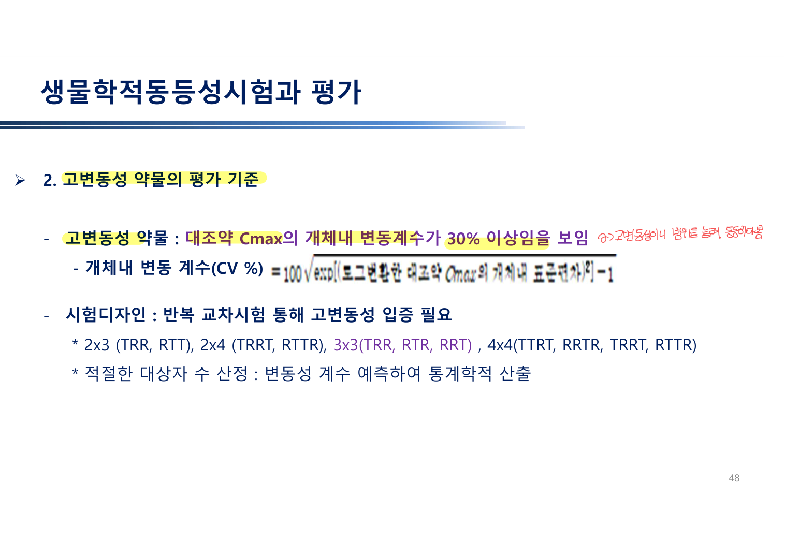
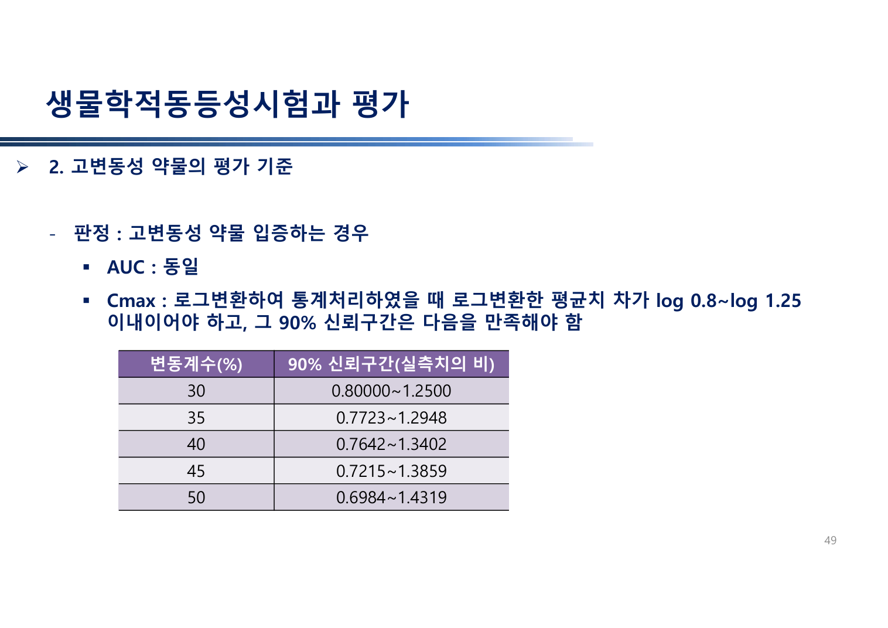
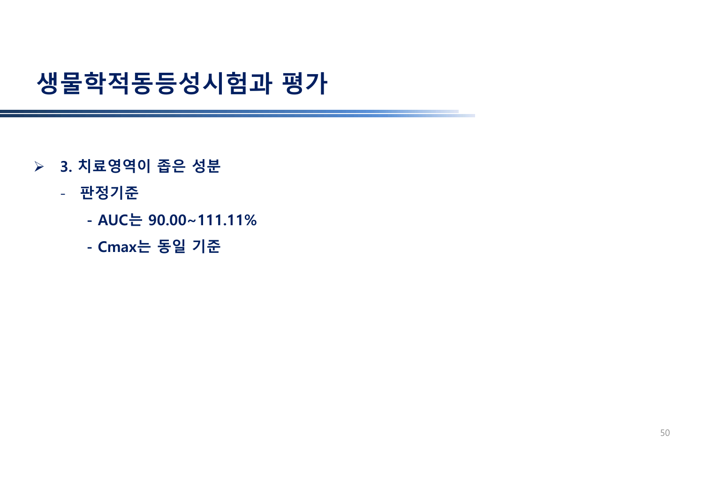

# 문제
첨단바이오의약품의 종류와 별도 규제체계가 필요한 이유를 쓰시오.

답:
종류: ==세포치료제, 유전자치료제, 조직공학제제, 첨단바이오융복합제제==
**살아있는 세포, 조직, 유전자**를 활용하므로 기존 의약품과 다른 위해성이 있다
**별도 법적 기준과 체계**로 위해성을 관리하고 허가해야 한다

[배경설명]
**첨단바이오의약품**은 **살아있는 세포**, 유전자, 조직공학 기술처럼 일반 합성의약품과 다른 기술을 이용한다.
**세포치료제**는 세포 자체나 세포의 기능을 치료에 이용하는 제품이다.

**유전자치료제**는 유전자를 넣거나 조절해 치료효과를 내는 제품이고, **조직공학제제**는 조직 재생이나 대체와 관련된다.
이 제품들은 **제조공정이 복잡**하고 **장기적인 위해성**이 남을 수 있어 별도 규제체계와 추적관리가 필요하다.

첨단바이오의약품은 기존 합성의약품처럼 투여 후 몸에서 단순히 사라지는 제품만 있는 것이 아니다.
**세포나 유전물질**이 몸 안에 오래 남거나 예상하지 못한 방식으로 작용할 수 있다.

그래서 **허가 전 평가**뿐 아니라 **허가 후 장기 추적과 위해성 관리**가 중요하다.
출처: 의약품규제및규제과학개론 기말고사 범위 수업자료.pdf p.305 + 의약품규제및규제과학개론 기말고사 범위 수업자료.pdf p.306
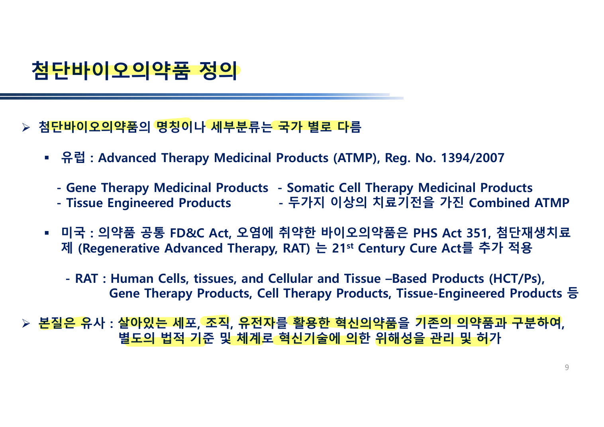
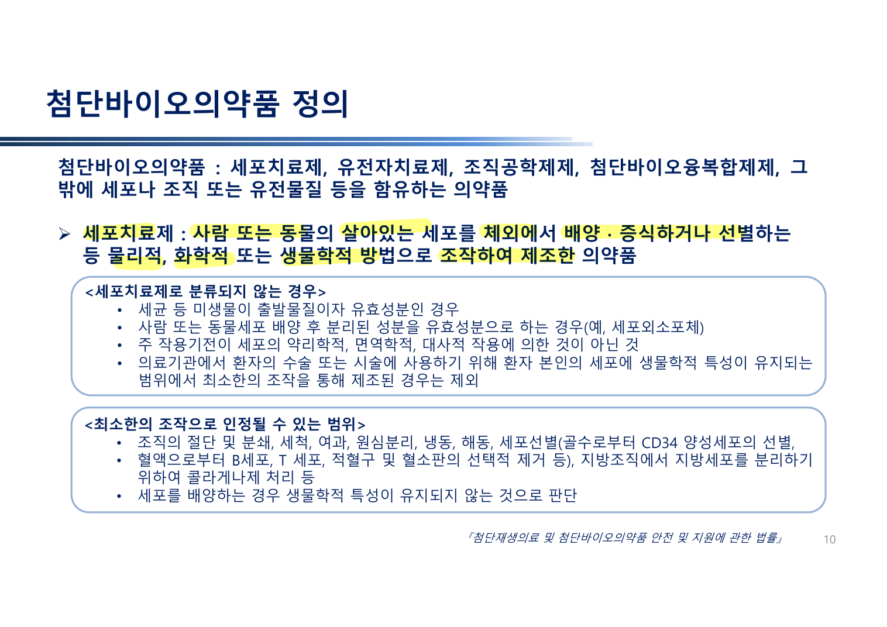

# 문제
세포치료제로 분류되지 않는 경우를 쓰시오.

답:
**미생물이 출발물질이자 유효성분**인 경우
**세포배양 후 분리된 성분**을 유효성분으로 하는 경우
주작용기전이 **세포의 약리학적, 면역학적, 대사적 작용이 아닌 경우**
**환자 본인세포를 최소한 조작**해 수술 또는 시술에 사용하는 경우

[배경설명]
**세포치료제**는 **살아있는 세포**의 작용을 치료 목적으로 이용하는 제품이다.
**살아있는 세포**가 최종 제품의 주된 작용을 하지 않으면 **세포치료제**로 보기 어렵다.

예를 들어 세포에서 얻은 성분만 쓰거나, 세포가 살아있는 치료 성분으로 작용하지 않는 경우는 분류에서 제외될 수 있다.
판단 기준은 제품의 치료효과가 **세포 자체의 생물학적 작용**에서 나오는지이다.

**세포치료제**인지 보려면 최종적으로 환자에게 들어가는 유효성분이 **살아있는 세포**인지가 중요하다.
세포를 배양한 뒤 분리한 단백질이나 성분만 쓰면 세포 자체를 투여하는 것이 아니다.

환자 본인 세포를 수술 과정에서 최소 조작해 바로 쓰는 경우도 별도 **세포치료제** 분류에서 제외될 수 있다.
출처: 의약품규제및규제과학개론 기말고사 범위 수업자료.pdf p.306

# 문제
유전자치료제의 정의와 체내요법, 체외요법을 구분하시오.

답:
**유전자치료제**: 유전물질 발현에 영향을 주기 위해 투여하는 **유전물질** 또는 **유전물질이 변형ㆍ도입된 세포**를 함유한 의약품
**체내요법**: 벡터를 체내 투여해 세포 내 유전자 발현
**체외요법**: 자가 또는 동종세포를 체외 조작한 뒤 환자에게 투입

[배경설명]
**유전자치료제**는 유전물질을 이용해 **질병을 치료하거나 예방**하려는 의약품이다.
**체내요법**은 유전자를 운반하는 물질을 환자 몸 안에 직접 넣어 몸 안에서 작용하게 하는 방식이다.

**체외요법**은 환자나 공여자의 세포를 몸 밖으로 꺼내 유전자를 조작한 뒤 다시 투여하는 방식이다.
**ASO**와 **siRNA**는 유전자를 다루는 느낌이 있다.
하지만 이 자료에서는 **화학의약품**으로 구분되어 있어 **유전자치료제**와 혼동하면 안 된다.

**벡터**는 유전자를 원하는 세포까지 운반하는 전달체이다.
**체내요법**은 전달체를 바로 몸 안에 넣기 때문에 몸 안에서 어디로 퍼지고 얼마나 오래 발현되는지가 중요하다.

**체외요법**은 세포를 밖에서 조작하므로 세포 **품질**, 오염, 형질도입 효율을 함께 봐야 한다.
출처: 의약품규제및규제과학개론 기말고사 범위 수업자료.pdf p.307 + 의약품규제및규제과학개론 기말고사 범위 수업자료.pdf p.308
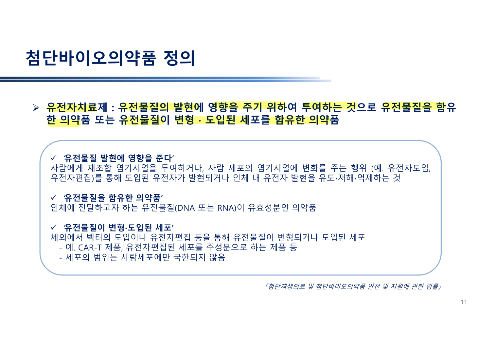
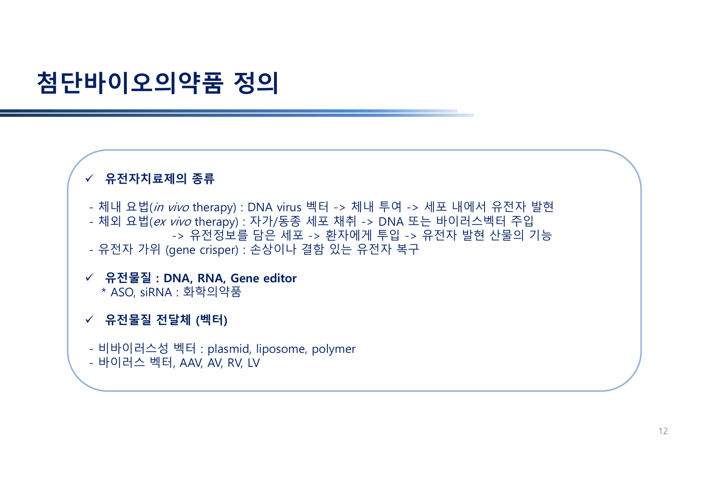

# 문제
첨단바이오의약품의 장기추적조사 대상과 신속허가 제도를 쓰시오.

답:
줄기세포 포함: **5년**
동물세포 또는 조직 포함: **30년**
유전자치료제: **15년**
신속허가: 우선심사, 조건부허가, **rolling review**

[배경설명]
**첨단바이오의약품**은 투여 후 세포나 유전물질이 몸 안에 오래 남거나 늦게 이상반응을 일으킬 수 있다.
그래서 일정 제품은 허가 후에도 **장기간 환자를 따라가며 안전성**을 확인한다.

**장기추적조사 대상**은 체내 장기 생존 가능성, 지연성 이상반응, 종양원성 같은 위험과 연결된다.
**신속허가**는 중대한 질환 등에서 치료 접근성을 높이기 위해 자료를 조건부로 보완하게 하면서 허가를 앞당기는 제도이다.

**장기추적조사**는 허가 후 환자를 오래 관찰해 늦게 나타나는 **안전성** 문제를 확인하는 제도이다.
**줄기세포와 유전자치료제**는 몸 안에서 오래 남거나 세포 기능을 바꿀 수 있어 짧은 기간 관찰만으로 충분하지 않다.

**신속허가**는 **안전성** 검토를 생략하는 제도가 아니라, 필요한 조건을 붙여 치료 접근성을 앞당기는 제도이다.
출처: 의약품규제및규제과학개론 기말고사 범위 수업자료.pdf p.313 + 의약품규제및규제과학개론 기말고사 범위 수업자료.pdf p.314
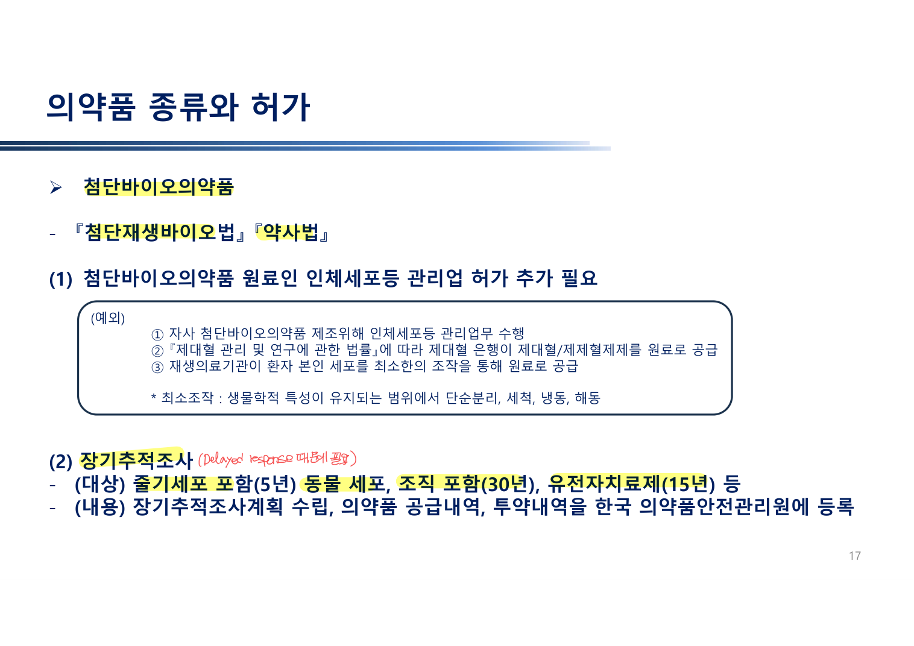
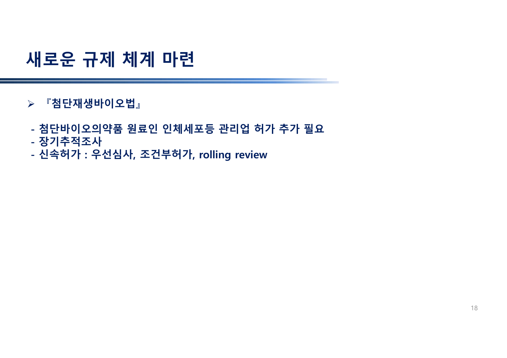

# 문제
첨단바이오의약품의 복잡성과 규제 고려사항을 쓰시오.

답:
**원료의 기원과 출처**가 다양하다
**제조 복잡성과 규모**가 개인맞춤부터 대규모생산까지 가변적이다
**살아있는 세포와 인체유전자** 때문에 **장기 생존**, **종양원성**, **장기모니터링**이 필요하다
제품 특이적인 **위험/이익 분석**이 필요하다

[배경설명]
**첨단바이오의약품**은 제품마다 세포 출처, 조작 방법, 작용 방식이 달라 표준화가 어렵다.
같은 종류처럼 보여도 **제조공정**이 조금 달라지면 **세포 특성이나 유전자 발현**이 달라질 수 있다.

**이질성**은 제품 안의 세포나 구성 성분이 균일하지 않을 수 있다는 뜻이다.
이런 불확실성 때문에 일반적인 **품질**ㆍ비임상ㆍ임상 평가에 더해 **제품별 위해성 관리**가 필요하다.

**개인맞춤형 제품**은 환자마다 원료가 달라질 수 있고, **대량생산 제품**은 배치 간 일관성이 중요해진다.
**살아있는 세포**는 **배양조건, 보관조건, 운송조건**에 따라 상태가 달라질 수 있다.

따라서 첨단바이오의약품은 **제품별 특성**을 보고 맞춤형으로 위험과 이익을 판단해야 한다.
출처: 의약품규제및규제과학개론 기말고사 범위 수업자료.pdf p.318
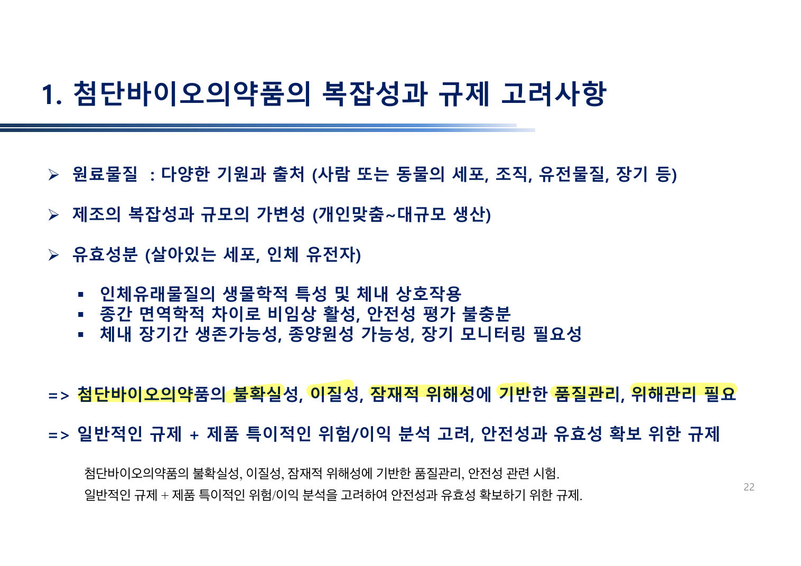

# 문제
만능줄기세포 유래 세포치료제의 종양원성 평가에서 확인해야 할 품질 요소를 쓰시오.

답:
**확인**
**순도**
**역가**
**오염**, **바이러스**, **GMP grade 적합성**
시험법의 특이성, 민감도, **validation**

[배경설명]
**만능줄기세포**는 여러 세포로 분화할 수 있는 장점이 있다.
하지만 남아 있으면 원하지 않는 증식이나 종양 형성 위험이 생길 수 있다.
**확인**은 최종 세포가 의도한 세포인지 보는 것이고, **순도**는 원하지 않는 세포가 얼마나 섞였는지 보는 것이다.

**역가**는 제품이 기대한 생물학적 기능을 실제로 내는지 확인하는 **품질** 요소이다.
**종양원성 평가**는 미분화세포 잔존, 돌연변이, 재프로그래밍 인자 잔류처럼 종양 위험을 높일 수 있는 요소와 연결된다.

**만능줄기세포 유래 제품**에서는 원하는 세포로 제대로 분화했는지 확인하는 것이 중요하다.
**순도**가 낮아 원하지 않는 세포가 남으면 예측하지 못한 작용이나 종양 위험이 생길 수 있다.

**시험법 validation**은 그 시험법이 실제로 미분화세포나 위험요소를 민감하게 잡아낼 수 있는지 확인하는 과정이다.
출처: 의약품규제및규제과학개론 기말고사 범위 수업자료.pdf p.320 + 의약품규제및규제과학개론 기말고사 범위 수업자료.pdf p.321 + 의약품규제및규제과학개론 기말고사 범위 수업자료.pdf p.322
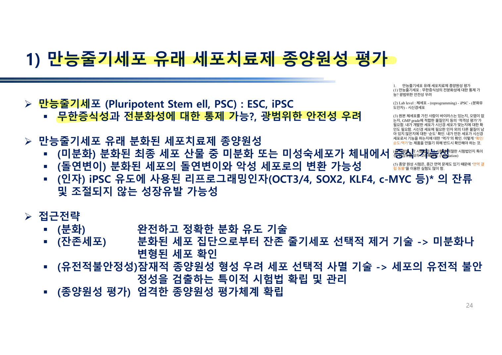
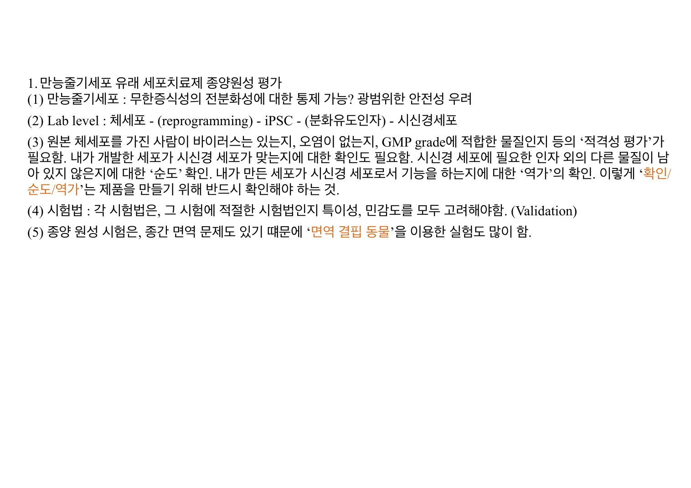
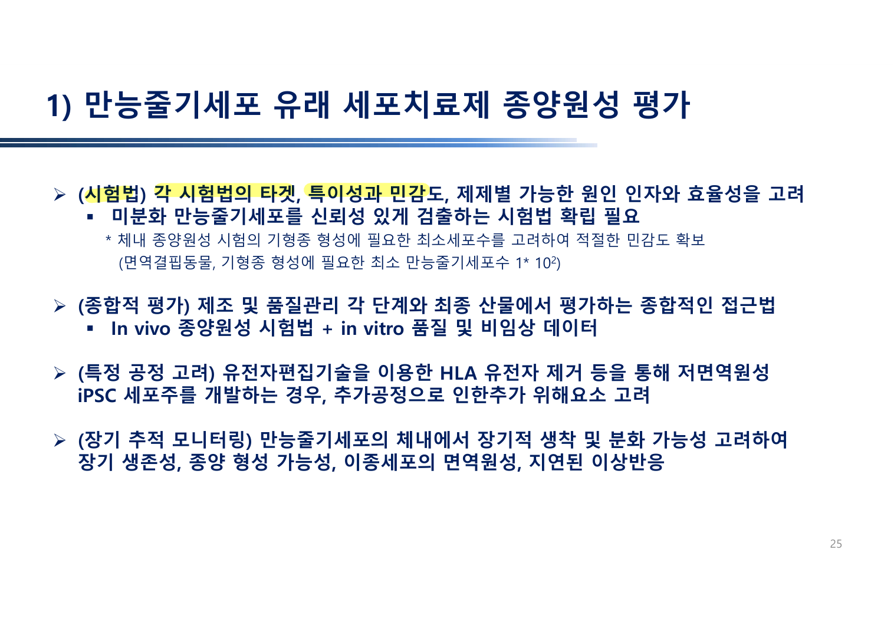

# 문제
유전자전달 플랫폼기술과 mRNA LNP 변경 시 규제 접근을 쓰시오.

답:
**플랫폼기술**: 여러 제품에 반복 활용되는 공통 기술
기존 자료 활용 조건: **품질, 제조, 안전성**에 부정적 차이가 없어야 함
**mRNA LNP 변경 시 확인**: mRNA 서열ㆍ크기ㆍ양, LNP 성분ㆍ크기, 타겟조직ㆍ적응증
변경 정도에 따라 **CMC, 비임상, 임상** 자료를 사례별 판단

[배경설명]
**플랫폼기술**은 같은 전달체나 제조기반을 여러 제품에 반복해서 활용하는 기술이다.
**유전자전달 플랫폼**에서는 전달체가 비슷하고 **목적 유전자**만 달라지는 경우가 있다.

**mRNA LNP**도 **지질나노입자**라는 전달체 틀을 유지하면서 mRNA 서열을 바꾸는 방식으로 개발될 수 있다.
그러나 **목적 유전자**, **투여경로**, **용량**, **제조공정** 변경이 크면 기존 자료를 그대로 적용하기 어렵다.
그래서 사례별로 규제 판단을 해야 한다.

플랫폼 자료를 활용할 수 있으면 새 제품 개발 속도가 빨라질 수 있다.
하지만 같은 플랫폼이라도 실제로 들어가는 유전물질이 달라지면 발현 단백질, **면역반응**, 표적조직이 달라질 수 있다.

그래서 **규제기관**은 기존 자료를 어디까지 믿을 수 있는지와 새로 필요한 자료가 무엇인지 제품별로 판단한다.
출처: 의약품규제및규제과학개론 기말고사 범위 수업자료.pdf p.326 + 의약품규제및규제과학개론 기말고사 범위 수업자료.pdf p.327
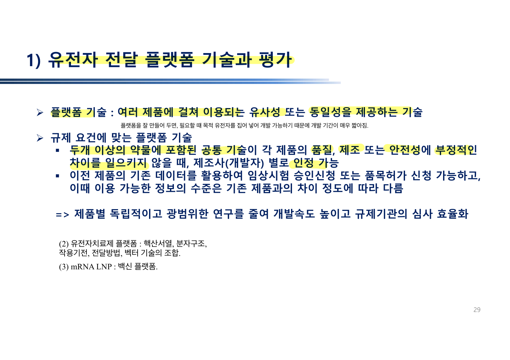
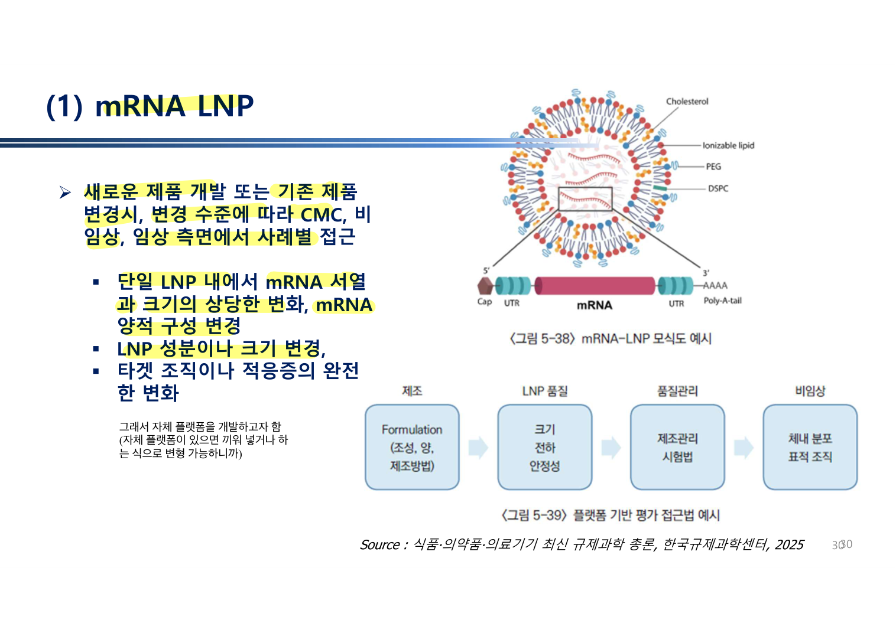

# 문제
유전자치료제 품질평가에서 벡터와 shedding 관련 핵심 고려사항을 쓰시오.

답:
**벡터 평가**: 종류, 전달 효율, 발현율, 면역반응, 삽입 가능성
**레트로바이러스 벡터**: 무작위 삽입에 따른 발암 가능성
**Shedding**: 분비물ㆍ배설물을 통한 외부 전파 가능성
**체외 유전자치료제**: 도입 유전물질, 체외 배양 세포, 형질도입 세포 품질평가

[배경설명]
**유전자치료제**는 **치료 유전자를 몸 안이나 세포 안으로 전달**해야 하므로 전달체인 **벡터**가 매우 중요하다.
**바이러스벡터**는 **전달 효율**이 높을 수 있지만, **유전체에 삽입**되거나 **면역반응**을 일으킬 가능성을 함께 봐야 한다.

**레트로바이러스** 계열은 유전자를 오래 유지시키는 장점이 있지만, **무작위 삽입**으로 **암 관련 유전자**가 영향을 받을 수 있다.
**Shedding**은 투여된 **벡터**나 바이러스가 **소변**, **타액**, 분비물 등을 통해 밖으로 나가는지 보는 평가이다.
다른 사람이나 환경에 전파될 수 있는지도 함께 본다.

**체외 유전자치료제**는 **세포치료제**와 **유전자치료제** 성격이 함께 있으므로 세포 **품질**과 유전자 도입 **품질**을 동시에 본다.
**벡터** 효율이 너무 낮으면 치료 유전자가 충분히 전달되지 않아 효과가 부족할 수 있다.

반대로 **벡터**가 원하지 않는 세포에 들어가거나 오래 남으면 **안전성** 문제가 생길 수 있다.
**Shedding** 평가는 환자 개인의 안전뿐 아니라 주변 사람과 환경으로 퍼질 가능성까지 보는 규제 평가이다.
출처: 의약품규제및규제과학개론 기말고사 범위 정리본.pdf p.21
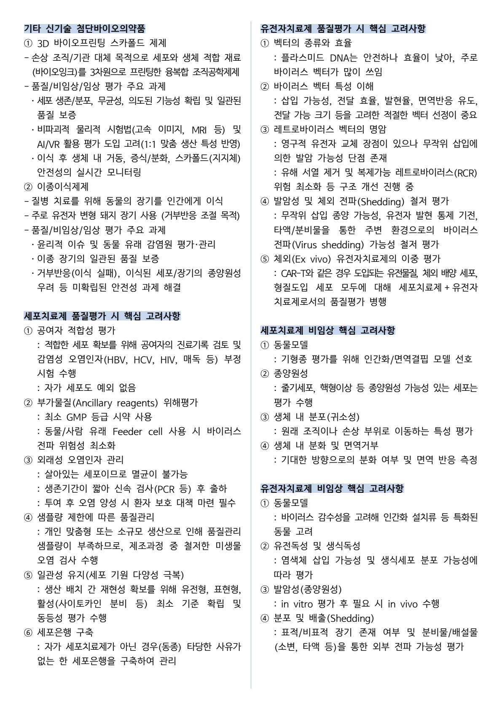

# 문제
CAR-T 등 체외 유전자치료제에서 중요한 규제상 위해요소를 쓰시오.

답:
**벡터 제조, 세포채취, 형질도입, 증식** 단계별 위해요소
**복제가능 레트로바이러스 또는 렌티바이러스 생성 가능성**
**삽입성 돌연변이**와 **악성변형세포**
면역원성, **CRS**, 신경독성, 장기추적평가

[배경설명]
**CAR-T**는 환자 또는 공여자 T세포를 조작해 암세포를 공격하도록 만든 **체외 유전자치료제**이다.
세포를 꺼내 조작하고 다시 넣는 과정이 들어가므로 **제조공정, 세포 품질, 오염관리** 문제가 중요하다.

투여 후에는 **사이토카인 방출 증후군**, **신경독성**, **장기 지속성** 같은 **안전성** 위험을 봐야 한다.
**동종 또는 off-the-shelf 제품**은 미리 만들어 공급할 수 있는 장점이 있다.
하지만 **면역거부반응과 이식편대숙주병** 위험이 추가된다.

**CAR-T의 CAR**는 T세포가 암세포를 더 잘 알아보도록 만든 인공 수용체라고 보면 된다.
**사이토카인 방출 증후군**은 면역세포가 강하게 활성화되면서 염증성 물질이 많이 나오는 위험이다.

체외에서 조작한 세포를 다시 넣는 제품이므로 **제조 단계**와 **투여 후 안전성 관찰**이 모두 중요하다.
출처: 의약품규제및규제과학개론 기말고사 범위 수업자료.pdf p.329 + 의약품규제및규제과학개론 기말고사 범위 수업자료.pdf p.330 + 의약품규제및규제과학개론 기말고사 범위 수업자료.pdf p.331
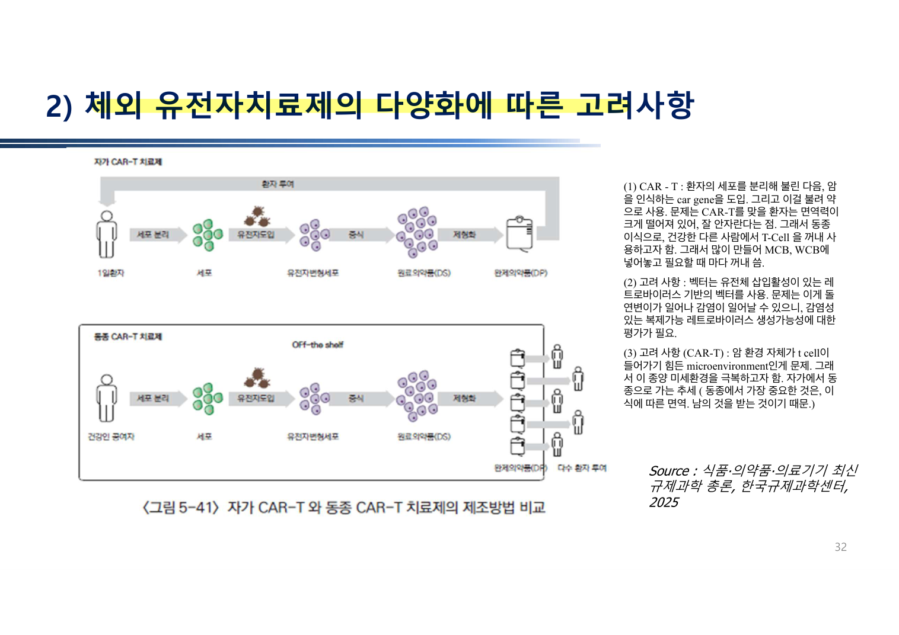
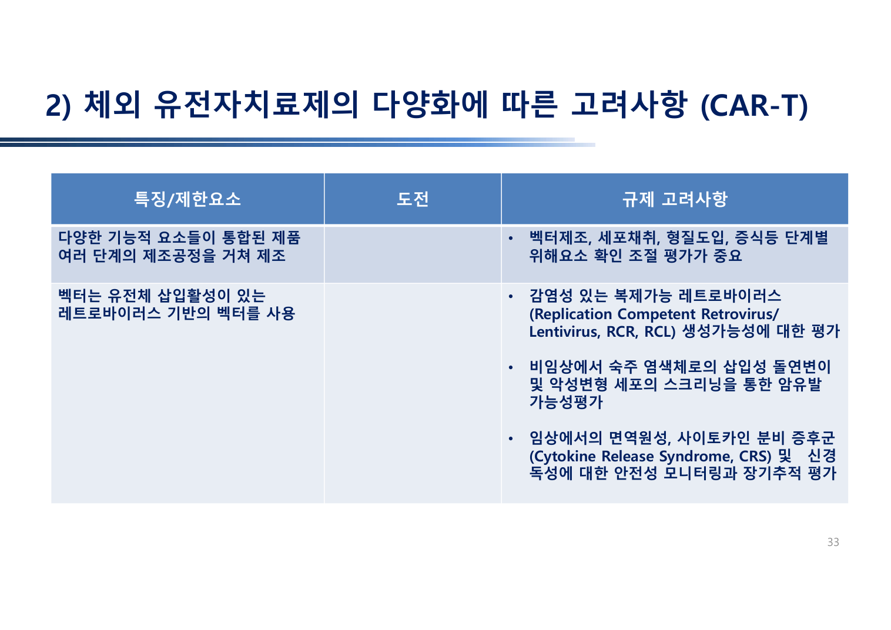
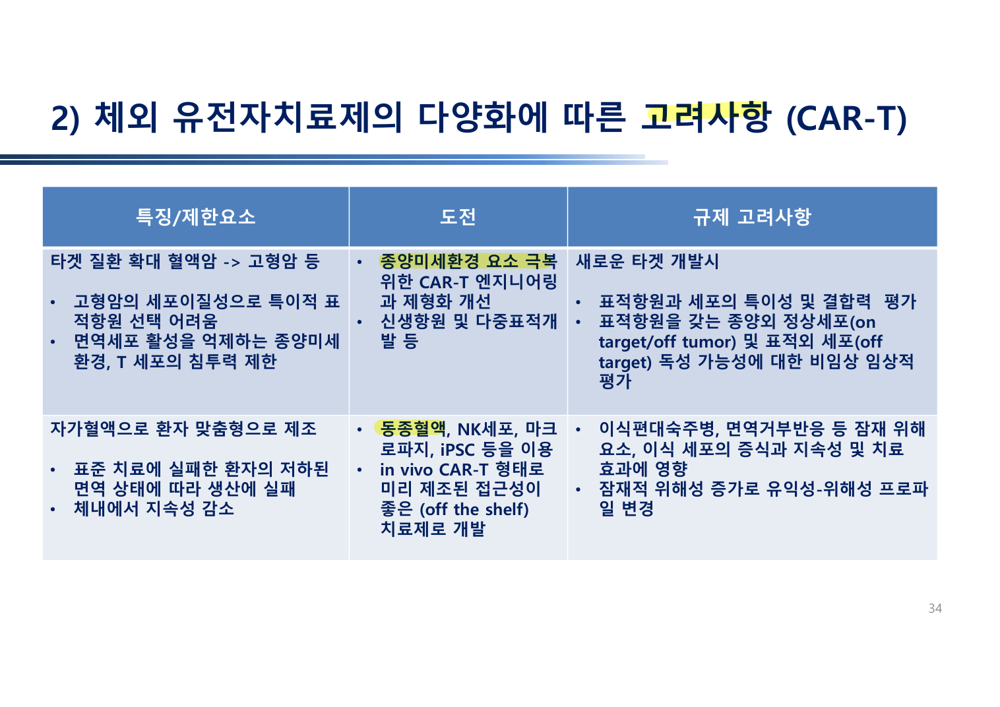

# 문제
유전자편집치료제와 유전자치료제의 차이 및 위해요소를 쓰시오.

답:
**유전자편집치료제**: 살아있는 세포 내 원인 유전자를 직접 편집
**유전자치료제**: 목적 유전자를 전달하고 발현
위해요소: **off-target effect**, 비의도적 삭제ㆍ재배열, 비의도적 돌연변이, **유전자 기능상실**

[배경설명]
일반적인 **유전자치료제**는 치료 유전자를 전달하거나 발현시키는 방식에 초점이 있다.
**유전자편집치료제**는 세포 안의 기존 유전자를 직접 자르거나 고치는 방식이다.

편집이 의도한 위치에서만 일어나면 치료효과를 기대할 수 있지만, **의도하지 않은 위치가 바뀌면 새로운 위험**이 생긴다.
그래서 **표적 외 변이**, **원하지 않는 유전체 변화**, **장기 안전성**이 중요한 위해요소가 된다.

**Off-target effect**는 목표하지 않은 유전자 위치가 잘못 편집되는 현상이다.
유전자를 직접 고치는 방식은 효과가 오래 지속될 수 있다는 장점이 있지만, **잘못 바뀐 유전체도 오래 남을 수 있다**.

그래서 유전자편집치료제는 **원하는 편집**이 되었는지와 **원하지 않는 편집**이 생기지 않았는지를 함께 평가한다.
출처: 의약품규제및규제과학개론 기말고사 범위 수업자료.pdf p.332 + 의약품규제및규제과학개론 기말고사 범위 수업자료.pdf p.333
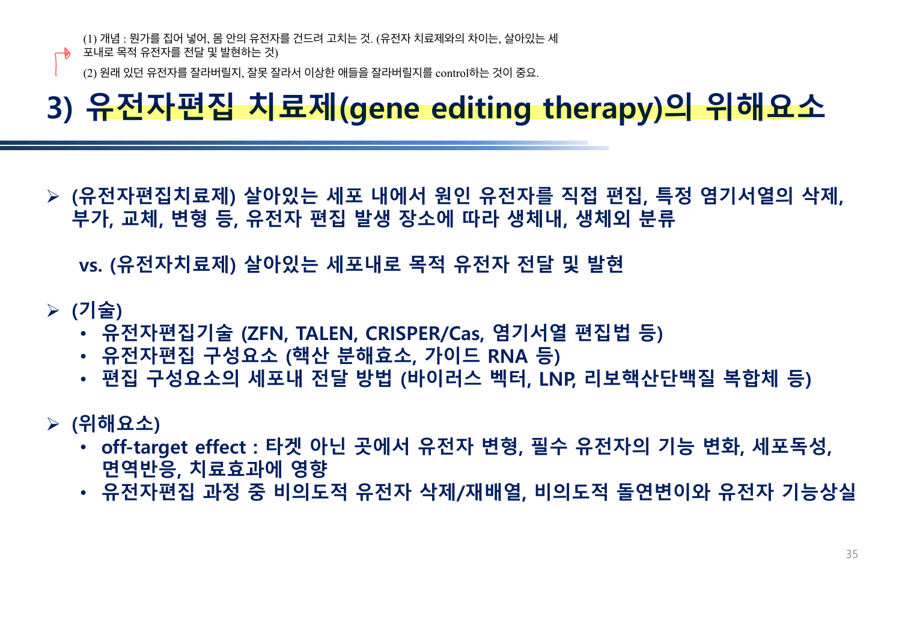
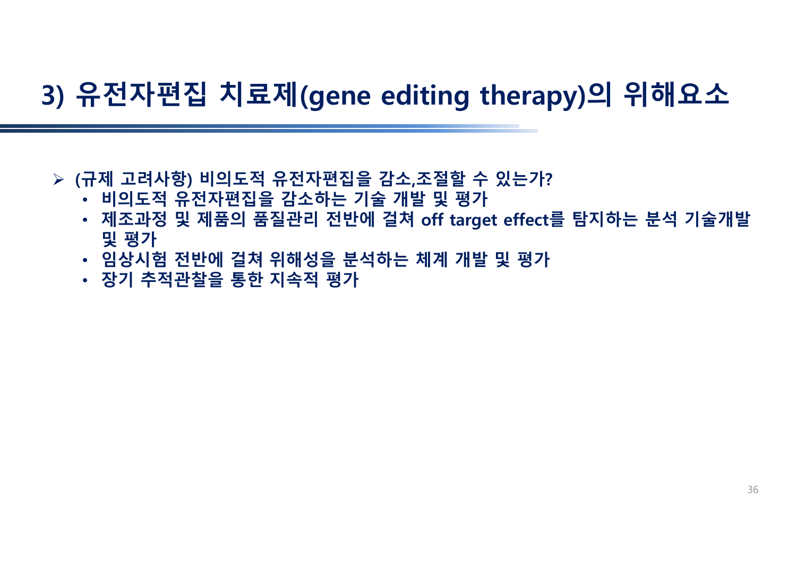

# 문제
시판 후 안전관리가 필요한 이유와 PV의 정의를 쓰시오.

답:
이유: 허가 전 임상시험만으로 **드문 부작용**, **장기 이상반응**, 다양한 환자군의 위험을 모두 알기 어렵기 때문이다
**PV**: 의약품 안전성 문제를 **탐지, 평가, 해석, 예방**하는 과학적 활동

[배경설명]
**허가 전 임상시험**은 대상자 수와 관찰기간이 제한되어 **드문 부작용**이나 **장기 이상반응**을 모두 알기 어렵다.
의약품이 실제 시장에서 넓게 쓰이면 다양한 환자, 병용약, 기저질환 상황에서 새로운 위해성이 드러날 수 있다.

**PV**는 **Pharmacovigilance**로, 의약품 이상반응과 **안전성** 문제를 발견하고 평가하고 예방하는 활동이다.
시판 후 안전관리는 허가로 끝나는 것이 아니라 사용 중 계속 **안전성** 정보를 모아 위험을 줄이는 체계이다.

**허가 전 임상시험**은 비교적 제한된 조건에서 진행되지만, 시판 후에는 고령자, 임부, 여러 약을 함께 쓰는 환자까지 포함된다.
드문 이상반응은 수천 명 이상이 사용한 뒤에야 보일 수 있다.

그래서 의약품 안전관리는 허가 전 자료만 보는 것이 아니라 전주기 동안 계속 정보를 모으는 방식으로 운영된다.
출처: 의약품규제및규제과학개론 기말고사 범위 수업자료.pdf p.349 + 의약품규제및규제과학개론 기말고사 범위 수업자료.pdf p.350
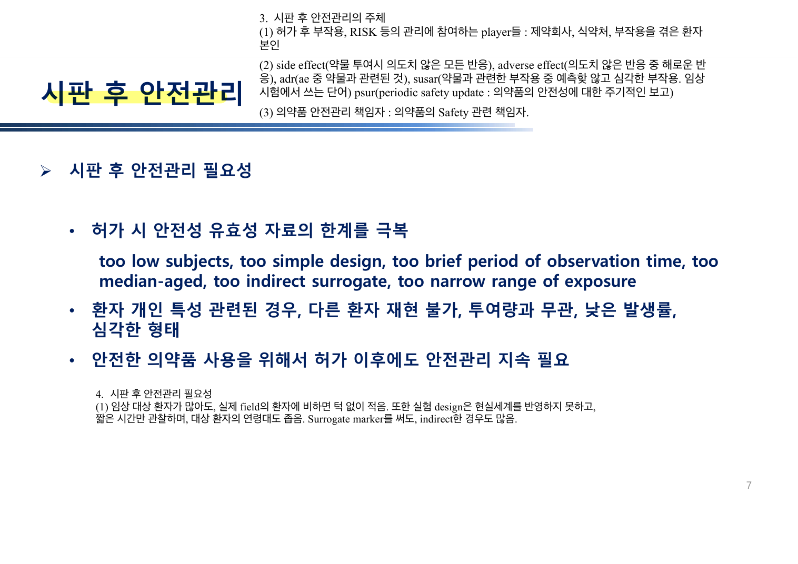
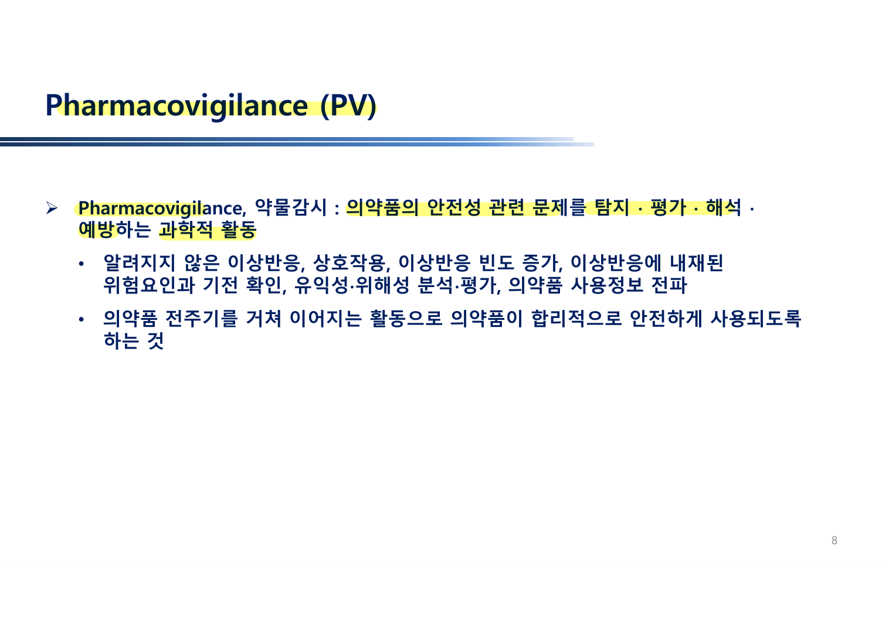

# 문제
Side effect, adverse effect, ADR, SUSAR, PSUR을 구분하시오.

답:
**Side effect**: 의도하지 않은 모든 반응
**Adverse effect**: 의도하지 않은 반응 중 해로운 반응
**ADR**: 약물과 관련된 adverse effect
**SUSAR**: 예측하지 못하고 심각한 약물이상반응
**PSUR**: 의약품 안전성에 대한 주기적 보고

[배경설명]
**Side effect**는 약의 주된 치료목적이 아닌 부수적인 작용까지 포함하는 넓은 표현이다.
**Adverse effect**는 환자에게 해롭거나 원하지 않는 부정적인 효과를 말한다.

**ADR**은 Adverse Drug Reaction이다.
의약품과 인과관계가 있다고 보는 유해하고 의도하지 않은 반응이다.
**SUSAR**는 예상하지 못했고 중대하며 의심되는 이상약물반응이고, 임상시험 **안전성** 보고에서 중요하다.

**PSUR**은 정기적으로 누적 **안전성** 정보를 정리해 제출하는 보고서이다.
**Side effect**는 해롭지 않은 부수작용까지 포함할 수 있어 가장 넓게 쓰인다.

**Adverse effect**는 그중 환자에게 해로운 쪽에 초점이 있다.
**ADR**은 약과 관련성이 있다는 판단이 붙은 개념이다.
**SUSAR**는 임상시험 중 신속히 보고해야 할 가능성이 큰 위험 신호이다.
출처: 의약품규제및규제과학개론 기말고사 범위 수업자료.pdf p.349 + 의약품규제및규제과학개론 기말고사 범위 수업자료.pdf p.352

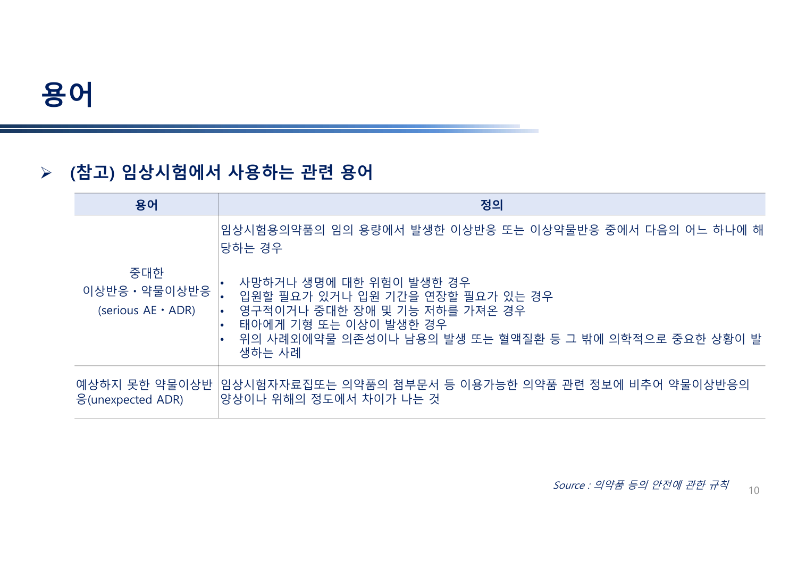

# 문제
RMP의 정의와 허가 전ㆍ허가 후 역할을 쓰시오.

답:
**RMP**는 의약품 위해성을 찾고 줄이기 위한 종합 안전관리계획
**포함**: **안전성ㆍ유효성 정보수집**, **약물감시**, **예방적 조치**, **위해성완화조치**
**허가 전**에는 **중요한 규명된 위해성**, **잠재적 위해성**, **부족정보**를 확인한다
**허가 후**에는 **계획 이행이 의무화**된다

[배경설명]
**RMP**는 Risk Management Plan이다.
의약품의 위해성을 미리 정리하고 허가 후 어떻게 관리할지 세우는 계획이다.
**허가 전**에는 이미 확인된 위해성, 의심되는 위해성, 아직 정보가 부족한 부분을 정리한다.

**허가 후**에는 실제 사용 중 **안전성** 정보를 계속 모으고 필요한 경우 위해를 줄이는 조치를 시행한다.
따라서 **RMP**는 허가자료의 일부이면서 동시에 **시판 후 안전관리 계획**이다.

**RMP**는 위험을 단순히 적어 두는 문서가 아니라, 위험을 어떻게 찾고 어떻게 줄일지까지 정한 실행계획이다.
허가 전에는 무엇을 특히 조심해야 하는지 목록화하고, 허가 후에는 그 목록에 맞춰 **감시와 조치**를 계속한다.

사용 경험이 적은 **신약이나 첨단바이오의약품**에서 특히 중요하다.
출처: 의약품규제및규제과학개론 기말고사 범위 수업자료.pdf p.359
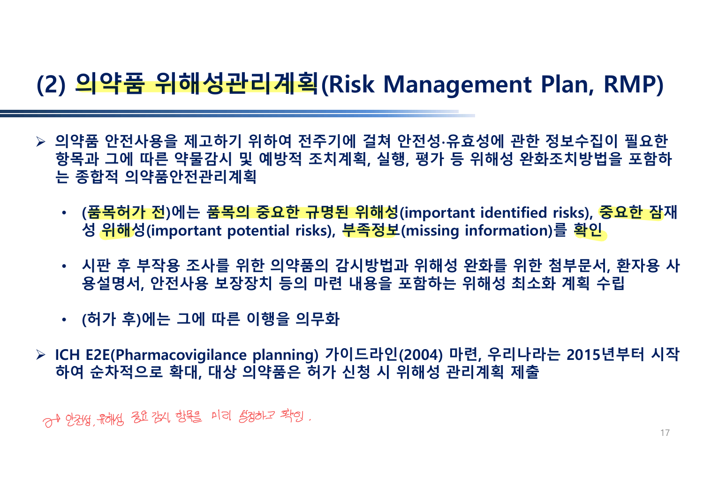

# 문제
RMP 제출 대상과 구성 항목을 쓰시오.

답:
**대상**: **신약**, **희귀의약품**, **첨단바이오의약품**, **일부 전문의약품**,
식약처장이 필요하다고 인정하는 **생물의약품**
구성: 안전성중점검토항목, **유효성중점검토항목**, 의약품감시계획,
**위해성완화조치방법**, **의약품감시방법**

[배경설명]
**RMP** 제출 대상은 허가 후 위해성 관리가 특히 중요한 의약품이다.
신약, 희귀의약품, 첨단바이오의약품처럼 사용경험이 적거나 위해성 관리 필요성이 큰 제품이 대표적이다.

**RMP** 구성에는 **안전성** 검토사항, 의약품감시계획, **위해성완화조치**가 들어간다.
**안전성** 검토사항은 무엇이 위험한지 정리하는 부분이다.
감시계획은 그 위험을 어떻게 관찰할지에 해당한다.
완화조치는 위험을 어떻게 줄일지에 해당한다.

신약이나 희귀의약품은 허가 시점에 사용 경험이 제한되어 있어 허가 후 정보 수집이 더 중요하다.
**안전성**중점검토항목은 특히 조심해서 볼 위험이고, **유효성중점검토항목**은 효과에 대해 계속 확인할 부분이다.

의약품감시방법은 정보를 모으는 방법이고, **위해성완화조치**방법은 실제 위험을 줄이는 방법이다.
출처: 의약품규제및규제과학개론 기말고사 범위 수업자료.pdf p.361 + 의약품규제및규제과학개론 기말고사 범위 수업자료.pdf p.364
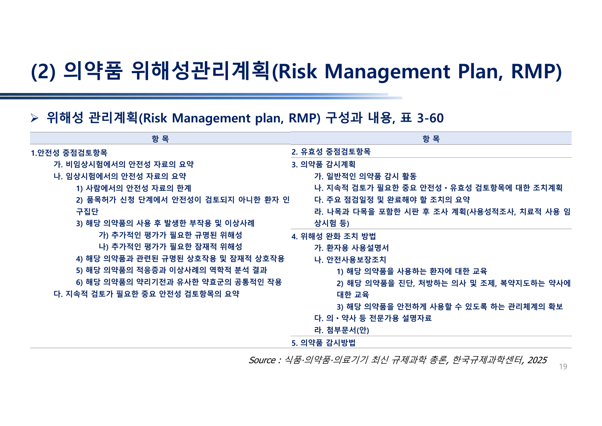
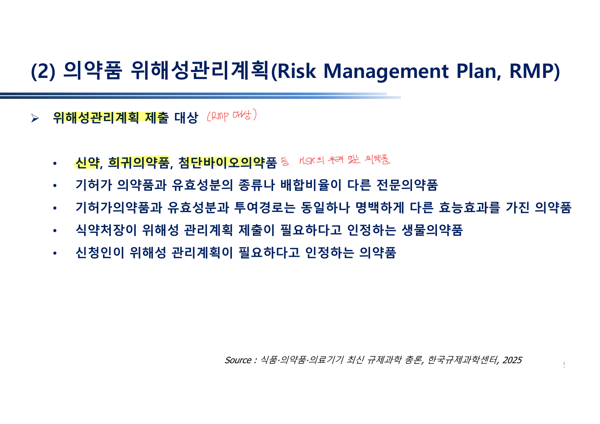

# 문제
RMP의 감시활동과 위해성완화조치를 구분하시오.

답:
**일반적 감시활동**: 이상사례 수집, 추적, 보고, 유익성-위해성 균형 모니터링
**추가적 감시활동**: 임상시험, 시판후조사연구, 환자등록
**위해성완화조치**: 첨부문서, 환자용ㆍ전문가용 설명자료, 교육, 약물사용관리프로그램, 유통관리시스템, 임신예방프로그램

[배경설명]
**RMP**의 **감시활동**은 의약품 사용 후 어떤 이상반응이나 위해성이 나타나는지 찾아내고 평가하는 활동이다.
**자발보고**, **능동적 감시**, **비교관찰연구**처럼 **안전성** 정보를 모으는 방법이 여기에 들어간다.

**위해성완화조치**는 이미 알거나 의심되는 위험을 실제로 줄이기 위한 조치이다.
예를 들어 환자용 설명자료, 의료전문가 교육, 사용 제한, 모니터링 강화처럼 위험을 낮추는 행동이 완화조치에 해당한다.

감시는 위험이 있는지 **찾고 확인하는 활동**이다.
완화조치는 이미 알려진 위험이 실제 피해로 이어지지 않게 **줄이는 활동**이다.

예를 들어 **이상사례** 보고를 모으는 것은 감시이고, 특정 환자에게 사용을 제한하거나 교육자료를 배포하는 것은 완화조치이다.
출처: 의약품규제및규제과학개론 기말고사 범위 수업자료.pdf p.362 + 의약품규제및규제과학개론 기말고사 범위 수업자료.pdf p.363
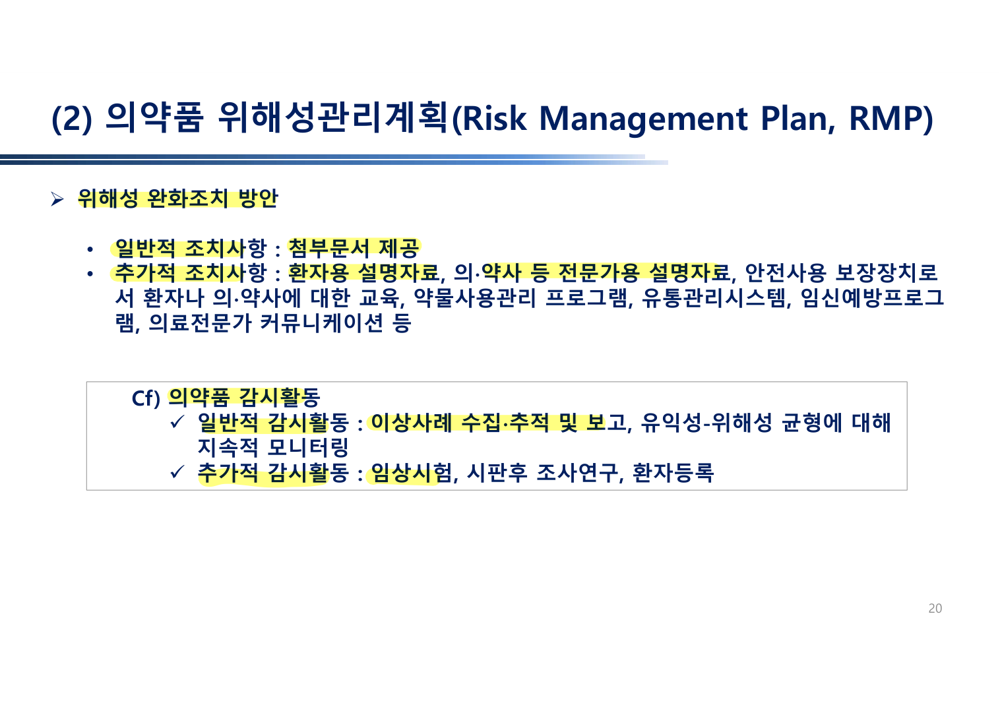
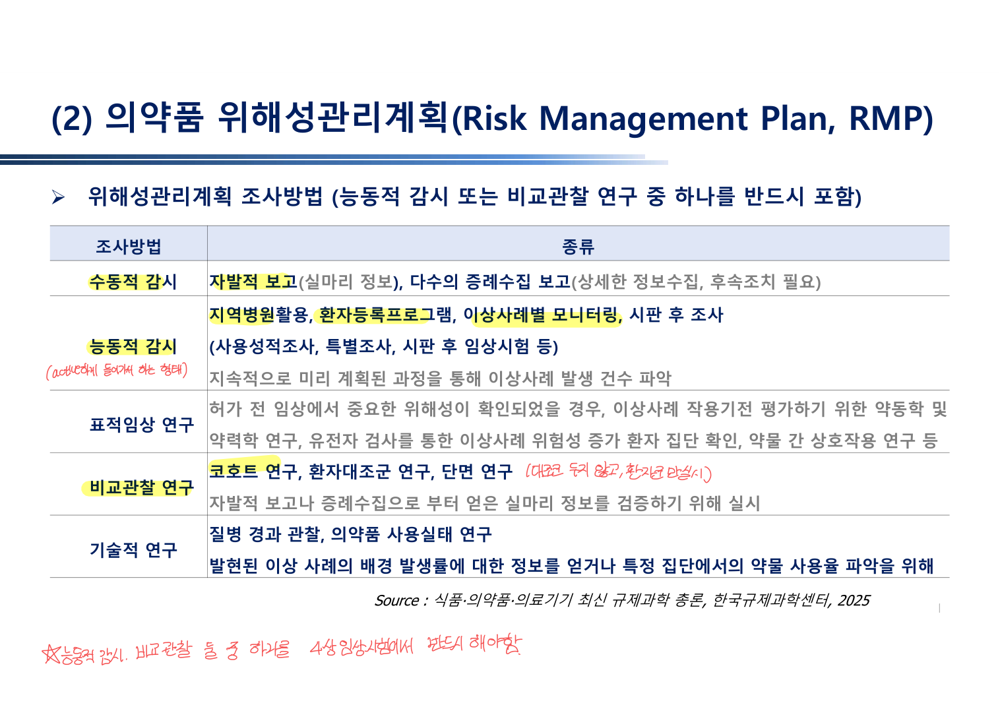

# 문제
RMP 용어 signal, identified risk, potential risk, missing information을 구분하시오.

답:
**Signal**: 약물과 이상사례 사이의 새로운 관련성 가능성
**Identified risk**: 인과관계의 과학적 근거가 충분한 위해성
**Potential risk**: 인과관계 가능성은 있지만 결론 근거가 충분하지 않은 위해성
**Missing information**: 안전성 지식이 부족한 부분

[배경설명]
**Signal**은 의약품과 **이상사례** 사이에 새로운 관련성이 있을 수 있다는 신호이다.
**Identified risk**는 자료가 충분해 실제 위해성으로 확인된 위험이다.

**Potential risk**는 의심은 되지만 아직 근거가 충분하지 않아 추가 확인이 필요한 위험이다.
**Missing information**은 특정 환자군이나 장기 사용처럼 **안전성** 정보가 아직 부족한 부분이다.

**RMP**는 이 네 가지를 구분해 무엇을 더 감시하고 어떤 조치를 할지 정한다.
**Signal**은 아직 확정된 결론이 아니라 더 살펴볼 필요가 있는 실마리이다.

**Identified risk**는 이미 근거가 충분하므로 관리와 완화조치가 바로 중요하다.
**Missing information**은 위험이 있다는 뜻이 아니라, 판단할 자료가 부족하다는 뜻이다.
출처: 의약품규제및규제과학개론 기말고사 범위 수업자료.pdf p.365
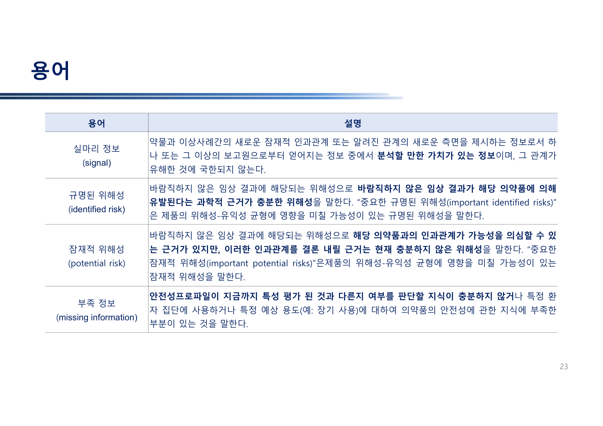

# 문제
의약품 재평가제도와 품목갱신제도를 구분하시오.

답:
**재평가**: 이미 허가된 의약품을 최신 과학수준에서 안전성ㆍ유효성 문제나 새로운 평가방법으로 다시 평가
**품목갱신**: 품목허가 또는 신고 의약품을 **5년마다** 갱신
재평가 결과는 **허가사항 유지**, **허가변경**, **회수ㆍ폐기**로 이어질 수 있다

[배경설명]
의약품 재평가는 이미 허가된 의약품을 최신 과학 수준에서 다시 검토하는 제도이다.
허가 당시에는 적절했던 약도 시간이 지나면 유효성, **안전성**, 사용 필요성에 대한 판단이 달라질 수 있다.

품목갱신제도는 허가 품목을 일정 기간마다 유지할 가치가 있는지 확인하는 제도이며, 핵심 주기는 **5년**이다.
자료를 제대로 제출하지 못하거나 관리 필요성을 충족하지 못하면 품목 유지가 어려워질 수 있다.

재평가는 특정 **안전성**ㆍ유효성 문제나 최신 과학 수준에 맞춰 다시 따져보는 성격이 강하다.
품목갱신은 허가된 품목이 계속 시장에 남아도 되는지 주기적으로 확인하는 제도이다.

둘 다 허가 이후에도 의약품을 계속 관리한다는 점에서 시판 후 안전관리와 연결된다.
출처: 의약품규제및규제과학개론 기말고사 범위 수업자료.pdf p.367 + 의약품규제및규제과학개론 기말고사 범위 수업자료.pdf p.368 + 의약품규제및규제과학개론 기말고사 범위 수업자료.pdf p.370
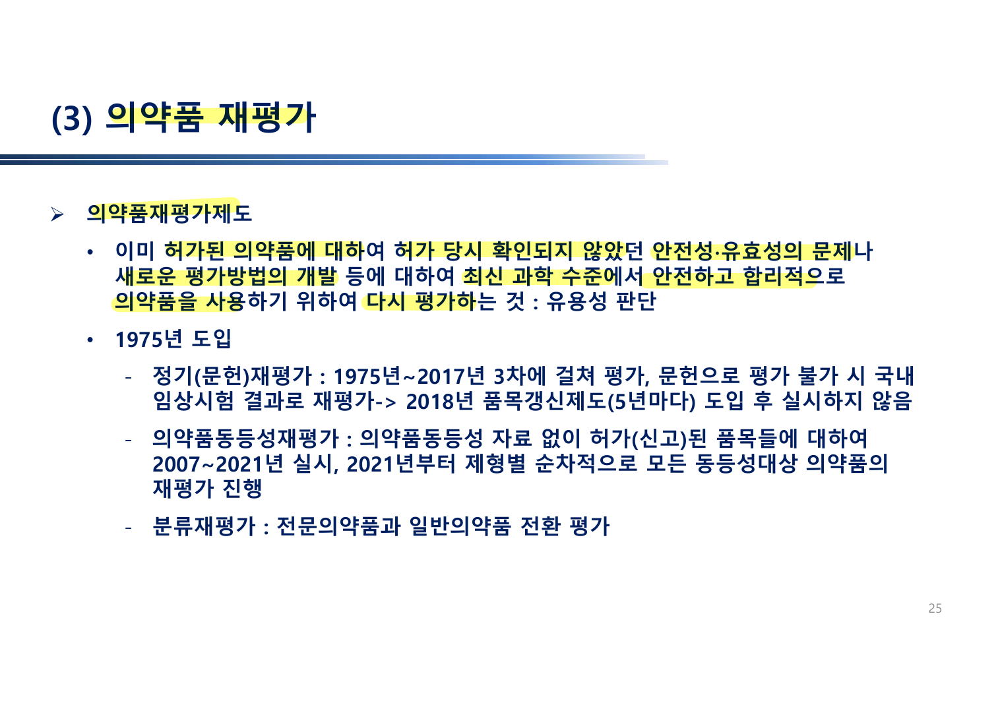
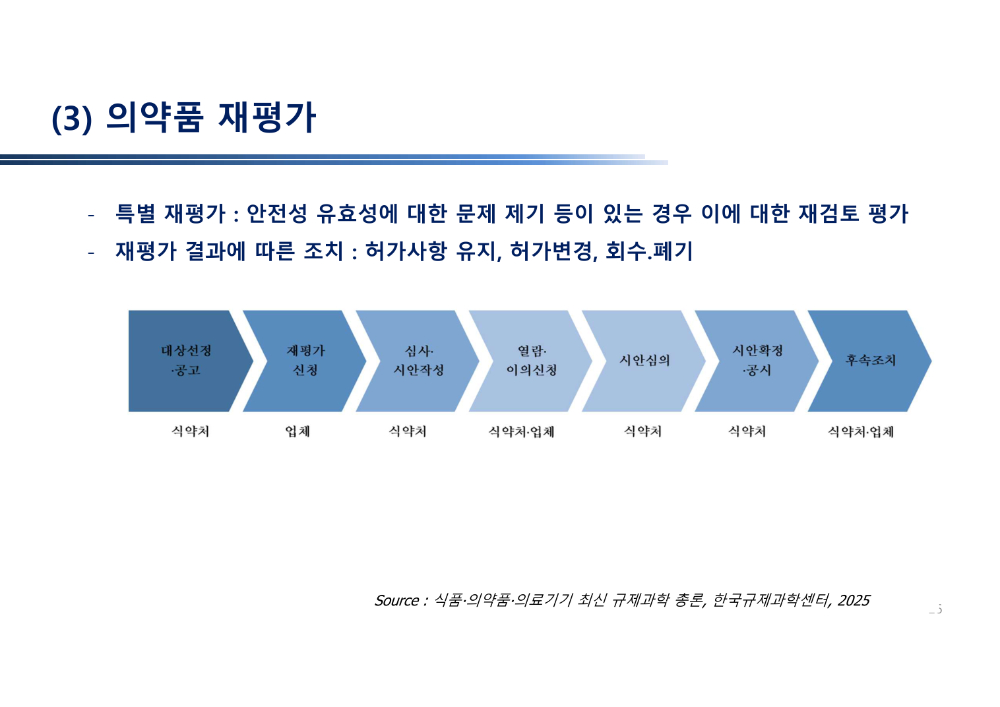
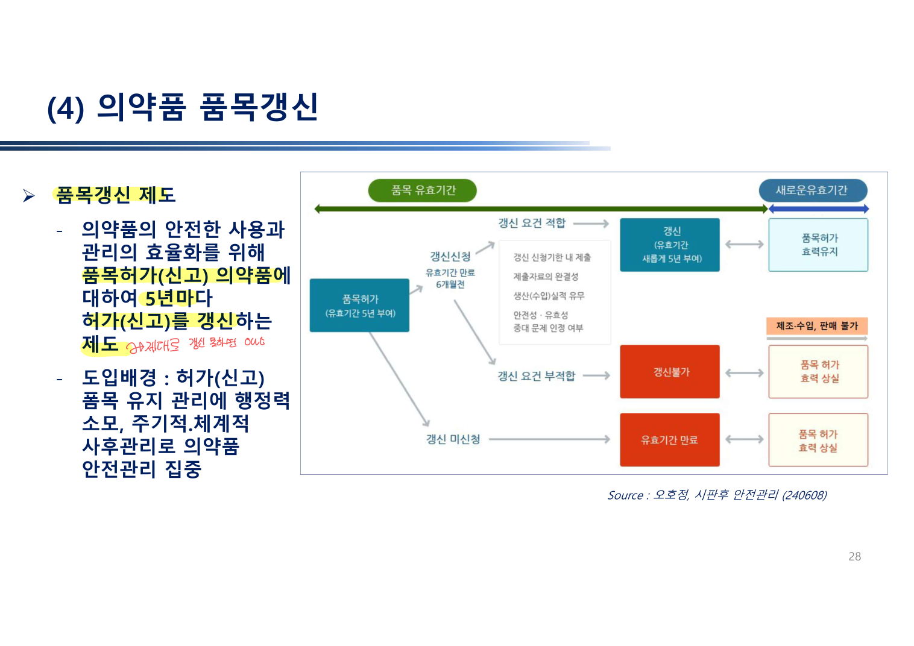

# 문제
테르페나딘-케토코나졸 병용투여 사망사건이 DUR 도입과 연결되는 과정을 쓰시오.

답:
케토코나졸은 **CYP3A4 억제제**이고 테르페나딘은 CYP3A4로 대사된다
병용 시 **심각한 심장부정맥 위험** 때문에 **병용금기**가 되었다
처방ㆍ조제 단계의 이중점검 필요성이 부각되어 **DUR** 체계로 이어졌다

[배경설명]
**테르페나딘**은 다른 약과 함께 쓰일 때 대사 억제로 혈중농도가 올라가 **심각한 부정맥 위험**이 커질 수 있었다.
**케토코나졸**은 이런 상호작용을 일으킬 수 있는 약물로 제시된 사례이다.

이 사건은 처방이나 조제 단계에서 **위험한 병용을 미리 걸러야 한다**는 필요성을 보여 준다.
**DUR**은 이런 병용금기나 주의 정보를 처방ㆍ조제 시점에 점검해 부작용을 예방하는 체계이다.

**CYP3A4**는 몸에서 여러 약을 대사하는 효소 중 하나이다.
케토코나졸이 이 효소를 억제하면 **테르페나딘이 잘 분해되지 않아 몸속 농도가 올라갈 수 있다**.

농도가 올라가면 **심장 리듬에 위험한 영향**을 줄 수 있어, 처방 단계에서 병용을 막는 시스템이 필요해졌다.
출처: 의약품규제및규제과학개론 기말고사 범위 수업자료.pdf p.372 + 의약품규제및규제과학개론 기말고사 범위 수업자료.pdf p.374
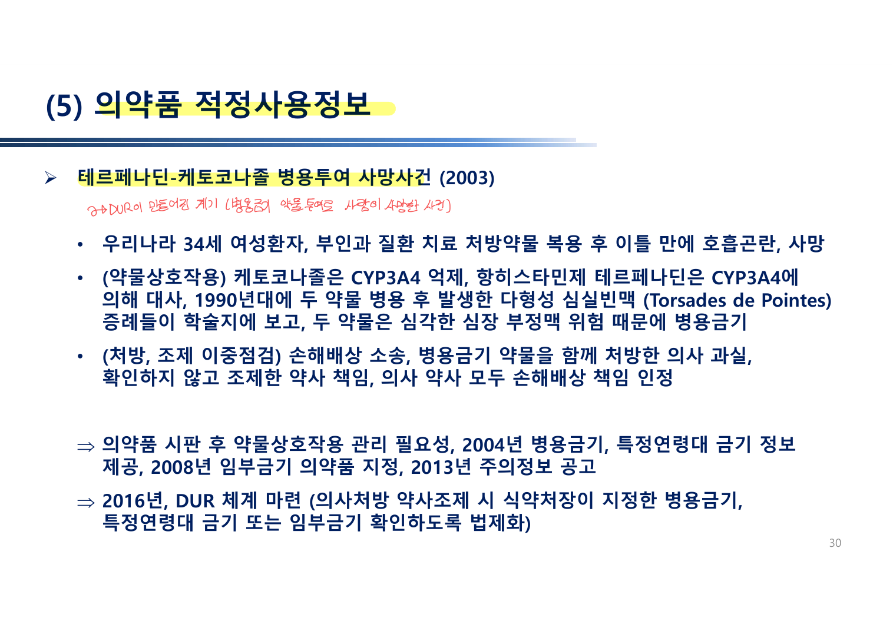
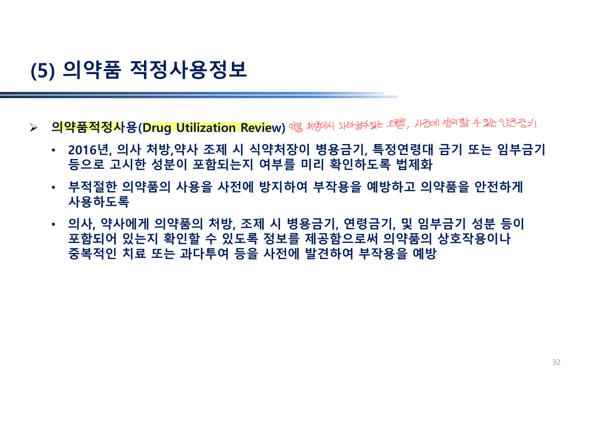

# 문제
DUR의 목적과 제공 정보 종류를 쓰시오.

답:
**DUR**은 처방ㆍ조제 시 금기 또는 주의 성분 포함 여부를 미리 확인하는 안전장치
제공 정보:
**병용금기**, **특정연령대금기**, **임부금기**
**용량주의**, **투여기간주의**, **효능군중복주의**
**노인주의**, **수유부주의**, **분할주의**

[배경설명]
**DUR**은 Drug Utilization Review로, 의약품 사용이 적절한지 처방ㆍ조제 단계에서 점검하는 제도이다.
목적은 **부적절한 약물 사용을 미리 막아 환자의 부작용 위험을 줄이는 것**이다.

**병용금기**는 함께 쓰면 안 되는 약 조합을 알려 준다.
**특정연령대금기**는 나이나 성장 단계 때문에 피해야 하는 약을 알려 준다.
**임부금기**는 임신 중 사용 위험이 큰 약을 알려 준다.
이 외에도 **용량**, 투여기간, 중복처방 관련 정보가 제공될 수 있다.

**DUR**은 의사가 처방하고 약사가 조제하는 순간에 경고를 띄워 사고를 미리 막는 안전망이다.
이미 처방된 뒤 부작용을 수습하는 것이 아니라, **부적절한 조합이나 용량을 사전에 점검**한다.

따라서 **DUR**은 시판 후 안전관리 중에서도 **실제 사용 단계의 예방 장치**에 가깝다.
출처: 의약품규제및규제과학개론 기말고사 범위 수업자료.pdf p.373 + 의약품규제및규제과학개론 기말고사 범위 수업자료.pdf p.374
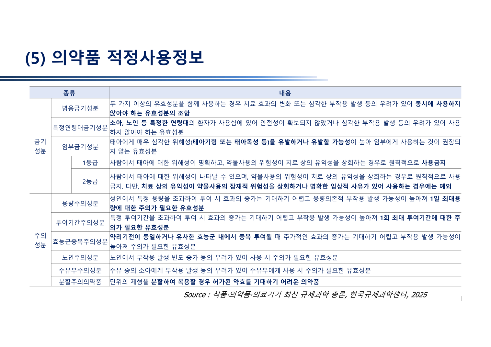

# 문제
의약품 부작용피해구제제도의 도입 계기와 보상 대상을 쓰시오.

답:
**스티븐스존슨증후군 실명사건**이 제도 도입 계기가 되었다
**정상적으로 의약품을 사용**했으나 **예상치 못한 부작용**으로 **사망, 장해, 질병 피해**를 입은 경우 보상한다
==사망일시보상금, 장례비, 장애일시보상금, 진료비==를 지급한다

[배경설명]
**의약품 부작용피해구제제도**는 의약품을 **정상적으로 사용**했는데도,
예상치 못한 심각한 피해가 생긴 경우를 사회적으로 보상하는 제도이다.
허가된 의약품도 모든 사람에게 완전히 안전할 수는 없고, 일부 피해는 **개인이 감당하기 어려울 수 있다**.

**보상 대상**은 정상 사용 후 발생한 **사망, 장애, 질병 피해** 등이다.
다만 항암제처럼 중대한 이상반응 가능성을 알고도 치료상 필요 때문에 사용하는 경우 등은,
**보상 대상에서 제외**될 수 있다.

**정상 사용**은 허가사항과 의료전문가의 지시에 맞게 사용했다는 뜻이다.
**피해구제제도**는 의약품을 만든 사람의 잘못을 따지는 손해배상제도라기보다,
예측하기 어려운 피해를 사회적으로 보상하는 안전장치이다.

모든 부작용이 보상되는 것은 아니며, **질병 자체의 진행**이나 이미 예상된 고위험 치료는 제외될 수 있다.
출처: 의약품규제및규제과학개론 기말고사 범위 수업자료.pdf p.376 + 의약품규제및규제과학개론 기말고사 범위 수업자료.pdf p.377
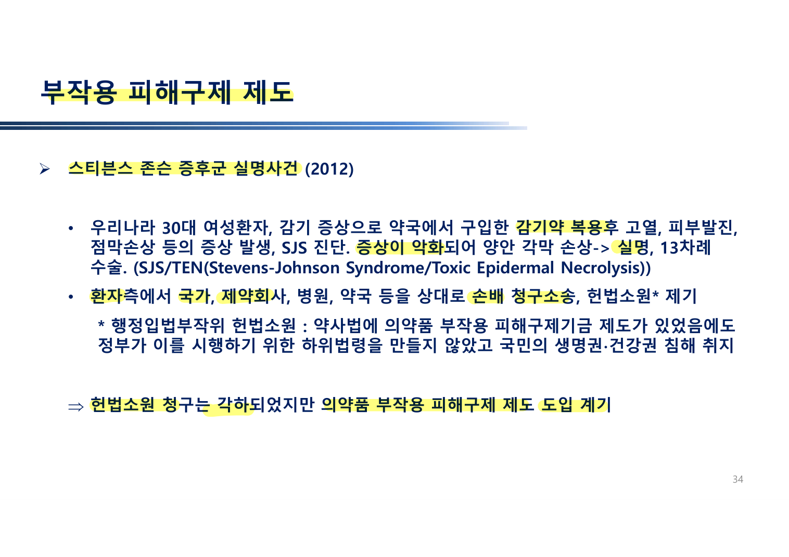
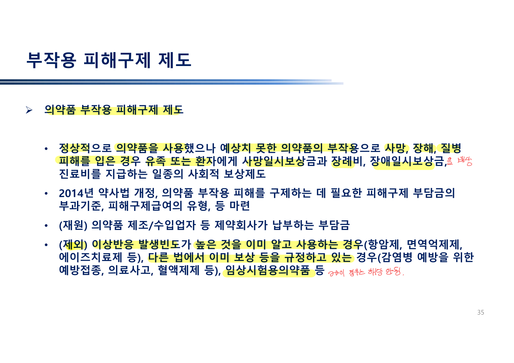
