# 문제

Morphine이 opioid receptor에서 작용할 때, Beckett-Casey hypothesis가 제시한 결합 부위와 morphine의 구조 요소를 연결하여 설명하시오.

답:
==양전하 질소== → **ionic binding region**
==방향족 고리== → **hydrophobic binding region**
==phenol OH== → **hydrogen bonding region**
==ethylene bridge== → hollow region

[해설]
Beckett-Casey hypothesis는 morphine의 결합을 **전하 결합**, **소수성 결합**, **수소결합**, 입체적 hollow region 적합성으로 나누어 설명한다.
따라서 morphine 구조를 볼 때는 질소, 방향족 고리, phenol OH, ethylene bridge를 각각 receptor 결합 부위와 1:1로 연결해 기억하면 된다.
출처: 의약화학 기말고사 범위 수업자료.pdf p.42
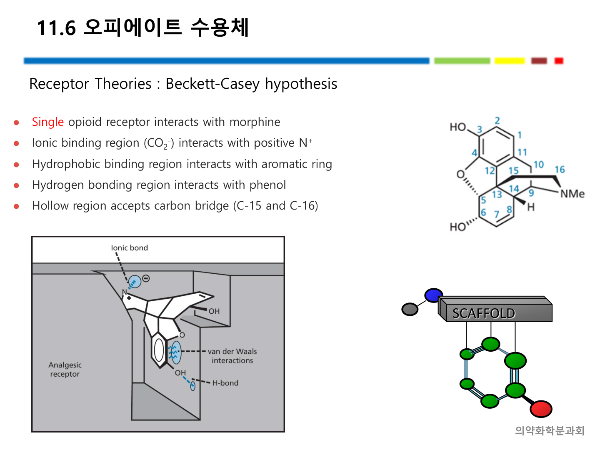

# 문제

Naloxone에 대한 설명으로 옳은 것을 모두 고르시오.

- Oxymorphone 유도체이며 N-propenyl기가 도입된 구조이다.
- 마약성 진통제로서 효능은 없고 길항제로서의 효력이 우수하다.
- Heroin 중독자의 응급처치에 사용될 수 있다.
- Morphine보다 강한 mu receptor 효능제로 진통 목적으로 주로 사용된다.
- Nalorphine보다 길항 효력이 약하고 호흡곤란을 유발한다.

답: 아래 표시 보기
O Oxymorphone 유도체이며 N-propenyl기가 도입된 구조이다. // Naloxone은 oxymorphone 유도체에 **N-propenyl기**가 도입된 구조로 제시된다.
O 마약성 진통제로서 효능은 없고 길항제로서의 효력이 우수하다. // Naloxone은 진통 효능보다 opioid receptor **길항작용**이 핵심이다.
O Heroin 중독자의 응급처치에 사용될 수 있다. // Naloxone은 heroin 중독 응급처치에 쓰이는 opioid antagonist로 잡는다.
X Morphine보다 강한 mu receptor 효능제로 진통 목적으로 주로 사용된다. -> Naloxone은 morphine보다 강한 mu receptor 효능제가 아니라 **opioid antagonist**이다. 진통제가 아니라 길항제로 구분한다.
X Nalorphine보다 길항 효력이 약하고 호흡곤란을 유발한다. -> Naloxone은 nalorphine보다 길항 효력이 우수한 쪽으로 제시된다. 호흡곤란 유발이 아니라 opioid 중독 응급처치 쪽이 핵심이다.
출처: 의약화학 기말고사 범위 수업자료.pdf p.33, p.73
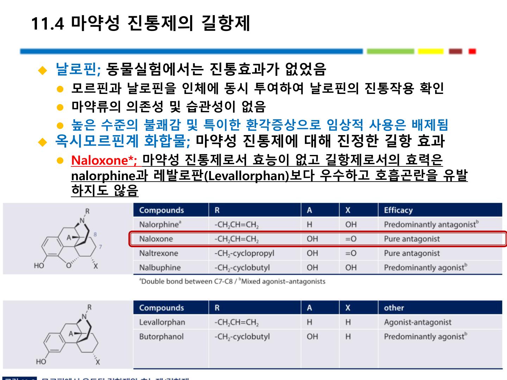
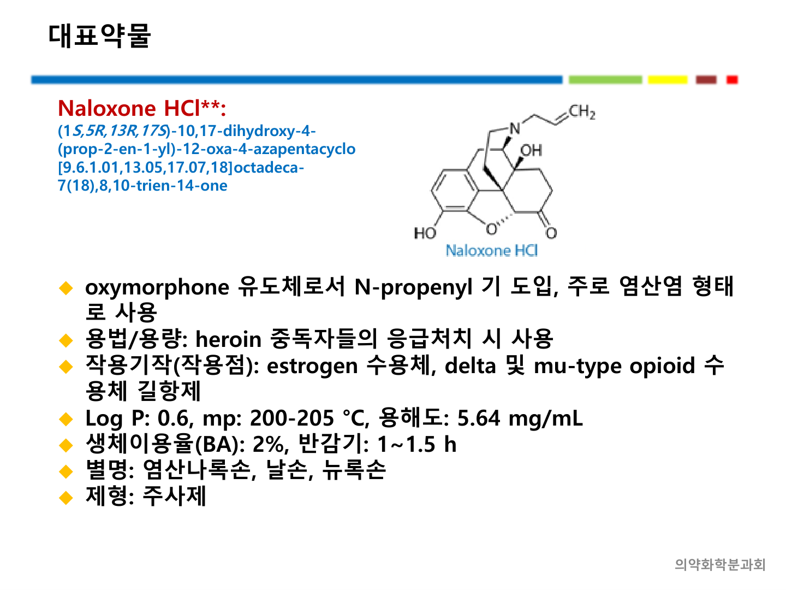

# 문제

MPTP가 Parkinsonism을 유발하는 과정과 selegiline이 이를 막을 수 있는 이유로 옳은 것을 모두 고르시오.

- MPTP는 MAO-B에 의해 MPP+로 산화되어 독성을 나타낸다.
- Selegiline을 미리 투여하면 MPTP가 MPP+로 산화되는 과정을 막을 수 있다.
- MPTP는 COMT에 의해 dopamine으로 환원되어 치료 효과를 낸다.
- MPTP는 동물모델에서 Parkinson 유사 증상을 유발할 수 있다.
- Selegiline은 dopamine 합성을 직접 차단해 Parkinson 증상을 완화한다.

답: 아래 표시 보기
O MPTP는 MAO-B에 의해 MPP+로 산화되어 독성을 나타낸다. // MPTP 독성은 **MAO-B**에 의한 MPP+ 생성이 핵심이다.
O Selegiline을 미리 투여하면 MPTP가 MPP+로 산화되는 과정을 막을 수 있다. // Selegiline은 MAO-B 억제제라 MPTP의 MPP+ 전환을 막는다.
X MPTP는 COMT에 의해 dopamine으로 환원되어 치료 효과를 낸다. -> MPTP는 **MAO-B에 의해 MPP+로 산화**되어 독성을 나타낸다. COMT 환원 치료효과가 아니라 신경독성 모델이다.
O MPTP는 동물모델에서 Parkinson 유사 증상을 유발할 수 있다. // MPTP는 원숭이 등에서 Parkinson 유사 증상 모델로 쓰인다.
X Selegiline은 dopamine 합성을 직접 차단해 Parkinson 증상을 완화한다. -> Selegiline은 **MAO-B 억제**로 dopamine의 산화성 대사를 줄인다. dopamine 합성 직접 차단제가 아니다.
출처: 의약화학 기말고사 범위 수업자료.pdf p.82
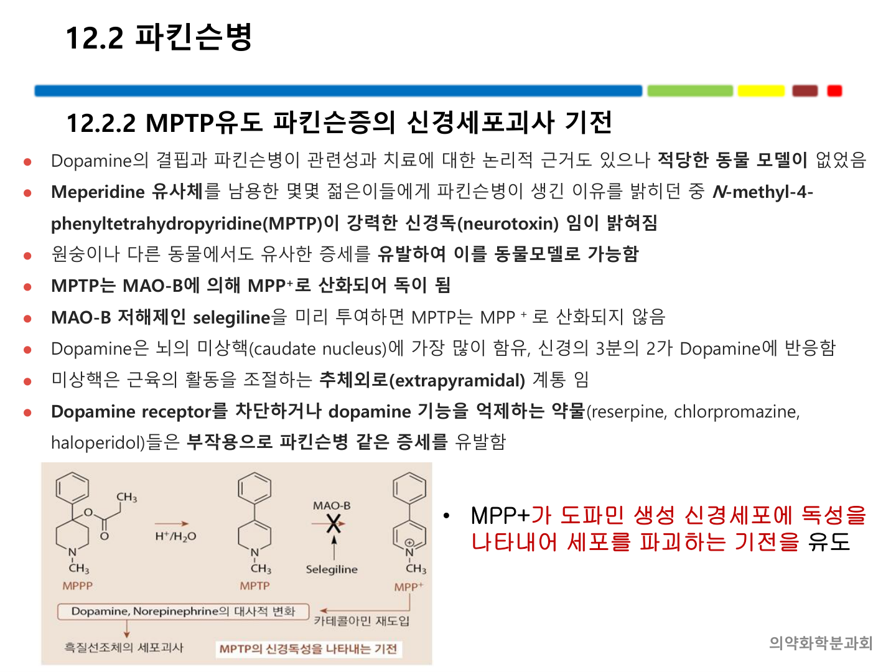

# 문제

Parkinson 치료 약물의 작용점과 특징으로 옳은 것을 모두 고르시오.

- 말초 decarboxylase 활성을 억제하여 BBB를 통과하는 levodopa 비율을 증가시킨다.
- Selegiline은 dopamine의 산화성 대사를 막는 선택적 비가역적 MAO-B 억제제이다.
- Tolcapone과 entacapone은 levodopa의 methylation과 불활성화를 억제하는 COMT 억제제이다.
- Amantadine은 dopamine 방출을 증가시키고 dopamine 재흡수를 저지하며 NMDA 수용체에 약한 길항효과를 보인다.
- Ropinirole과 pramipexole은 non-ergot 약물로 D2와 D3 수용체에 선택적인 완전효능약이다.
- Levodopa를 말초에서 dopamine으로 빠르게 전환시켜 심장 자극을 높인다.
- Levodopa의 COMT methylation을 촉진해 CNS 축적을 막는다.
- Dopamine D2 receptor를 비가역적으로 차단해 운동성 동요를 줄인다.

답: 아래 표시 보기
O 말초 decarboxylase 활성을 억제하여 BBB를 통과하는 levodopa 비율을 증가시킨다. // Carbidopa 병용의 핵심은 말초 decarboxylase 억제로 levodopa의 BBB 통과 비율을 높이는 것이다.
O Selegiline은 dopamine의 산화성 대사를 막는 선택적 비가역적 MAO-B 억제제이다. // Selegiline은 중추에서 dopamine 대사를 줄이는 **비가역적 MAO-B 억제제**로 제시된다.
O Tolcapone과 entacapone은 levodopa의 methylation과 불활성화를 억제하는 COMT 억제제이다. // 두 약물은 levodopa의 **COMT methylation**을 막아 작용을 연장한다.
O Amantadine은 dopamine 방출을 증가시키고 dopamine 재흡수를 저지하며 NMDA 수용체에 약한 길항효과를 보인다. // Amantadine은 dopamine 방출 증가, 재흡수 억제, NMDA 약한 길항이 함께 제시된다.
O Ropinirole과 pramipexole은 non-ergot 약물로 D2와 D3 수용체에 선택적인 완전효능약이다. // Non-ergot dopamine agonist와 **D2/D3 선택성**을 연결한다.
X Levodopa를 말초에서 dopamine으로 빠르게 전환시켜 심장 자극을 높인다. -> Carbidopa는 말초 dopamine 전환을 **억제**해 BBB 통과 levodopa를 늘린다. 말초 전환 촉진은 반대 설명이다.
X Levodopa의 COMT methylation을 촉진해 CNS 축적을 막는다. -> Tolcapone과 entacapone은 COMT methylation을 **억제**해 levodopa 작용을 연장한다.
X Dopamine D2 receptor를 비가역적으로 차단해 운동성 동요를 줄인다. -> Parkinson의 dopamine agonist는 D2/D3 수용체를 **자극**하는 쪽이다. D2 비가역 차단은 치료 축이 아니다.
출처: 의약화학 기말고사 범위 수업자료.pdf p.84, p.85, p.87, p.88, p.89, p.90, p.99
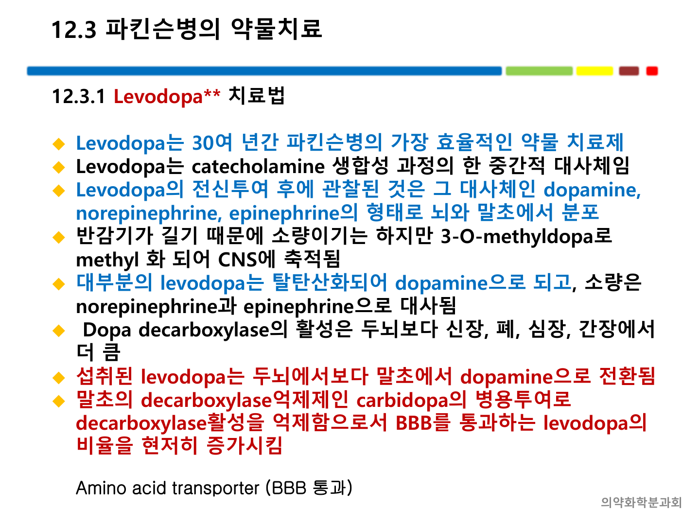
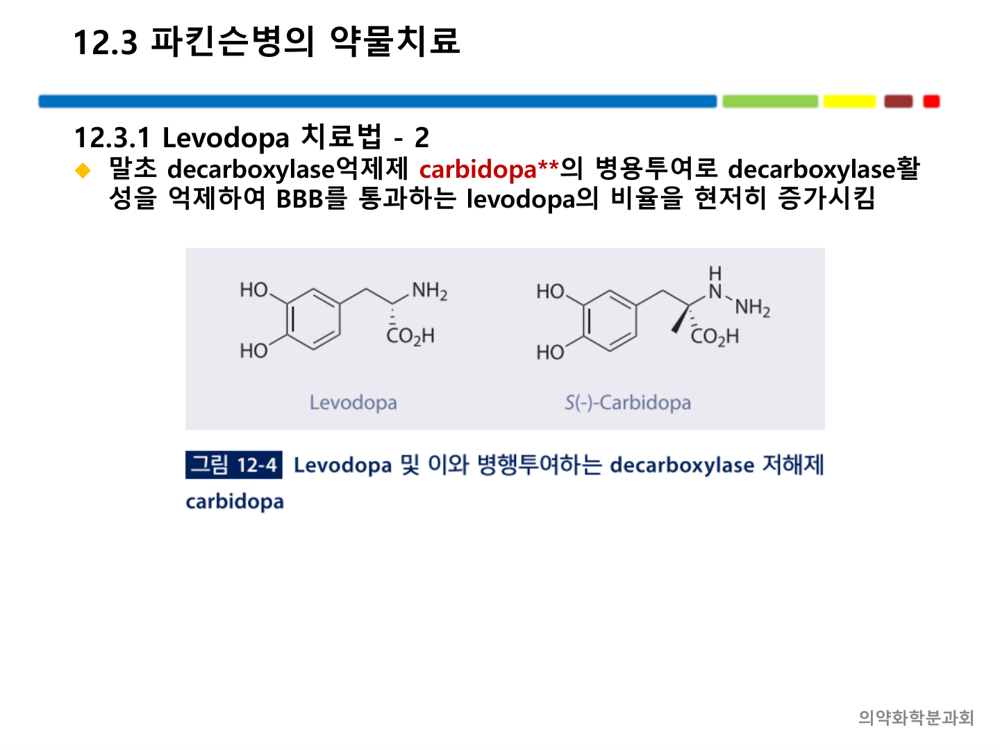
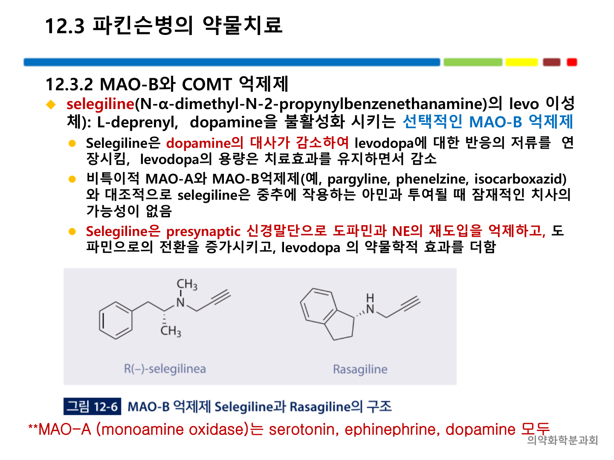
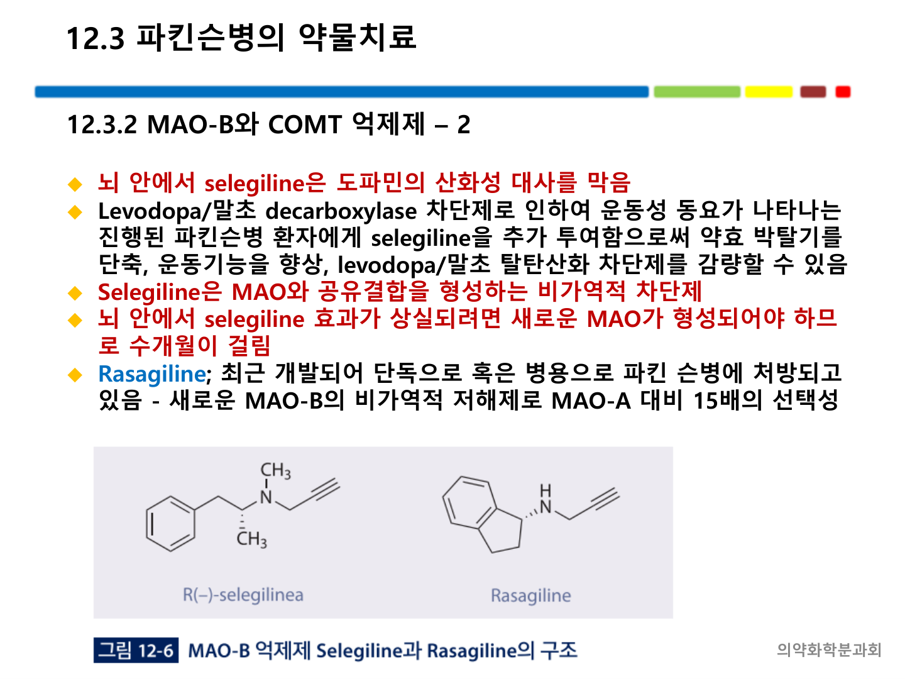
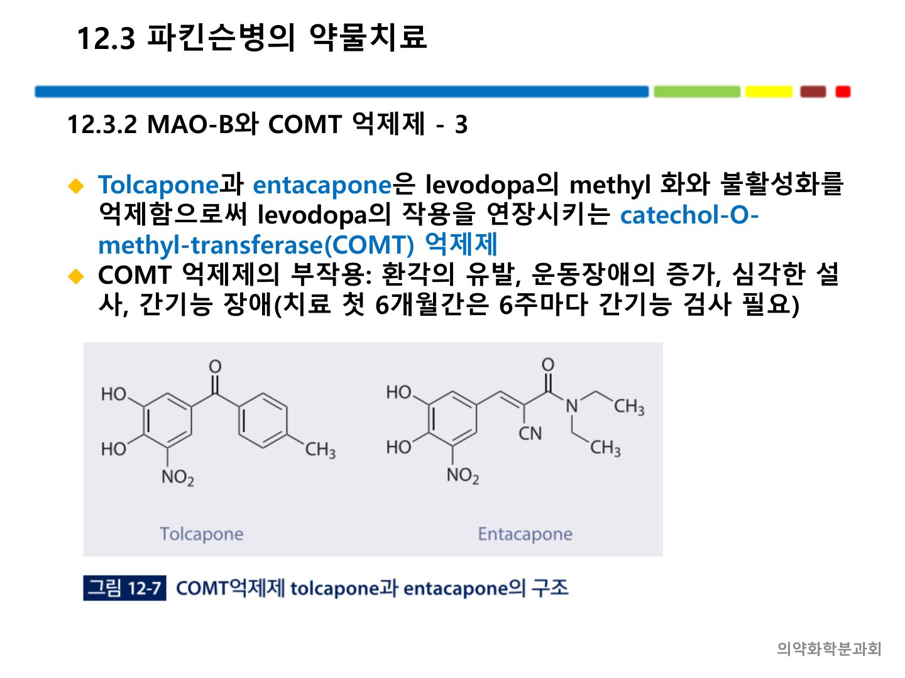
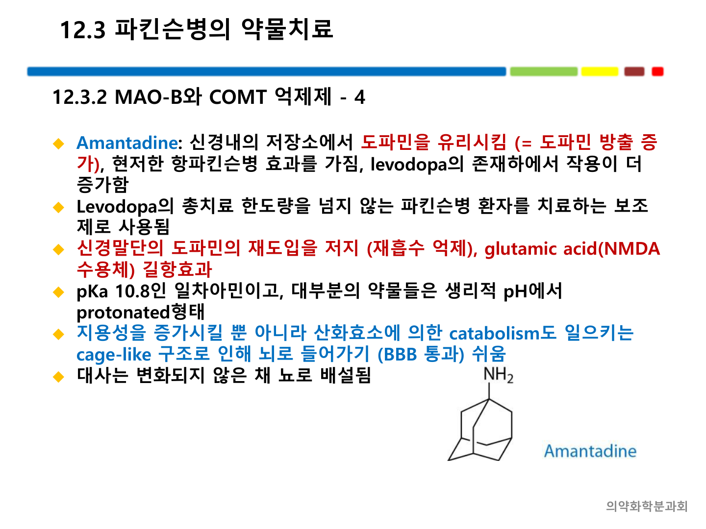
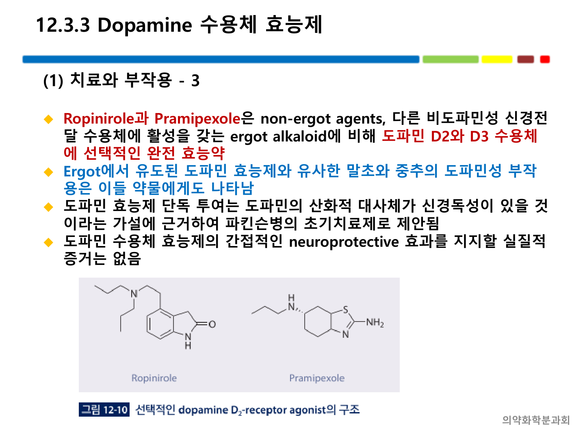

# 문제

Alzheimer 치료에서 acetylcholinesterase inhibitor를 사용하는 근거와 donepezil의 특징으로 옳은 것을 모두 고르시오.

- Alzheimer에서는 acetylcholine 감소가 기억장애와 관련된다.
- AChE 억제제는 뇌에서 acetylcholine 분해를 억제하는 치료 접근이다.
- 2세대 AChEIs는 1세대보다 작용시간이 길고 약동력학적으로 안정적이며 BBB 통과율이 높다.
- FDA 승인 AChE 억제제에는 tacrine, donepezil, rivastigmine, galanthamine이 포함된다.
- Donepezil은 뇌의 AChE에 선택적으로 작용하는 가역적 AChE inhibitor이다.
- Donepezil은 말초 BChE에는 거의 영향이 없고 반감기가 약 70시간으로 1일 1회 투약이 가능하다.
- Donepezil은 비가역적 organophosphate로 AChE를 aging시킨다.
- AChE inhibitor는 acetylcholine 합성을 완전히 중단시켜 증상을 완화한다.
- 1세대 AChEIs는 새로운 AChEIs보다 AChE 선택성이 높아 말초 부작용이 더 적다.

답: 아래 표시 보기
O Alzheimer에서는 acetylcholine 감소가 기억장애와 관련된다. // Alzheimer의 기억장애 축은 **acetylcholine 감소**와 연결된다.
O AChE 억제제는 뇌에서 acetylcholine 분해를 억제하는 치료 접근이다. // AChE 억제로 synapse 내 acetylcholine 농도를 높이는 접근이다.
O 2세대 AChEIs는 1세대보다 작용시간이 길고 약동력학적으로 안정적이며 BBB 통과율이 높다. // 2세대는 작용시간, 약동학 안정성, BBB 통과율에서 개선된 것으로 정리된다.
O FDA 승인 AChE 억제제에는 tacrine, donepezil, rivastigmine, galanthamine이 포함된다. // 승인 약물 묶음은 ==tacrine, donepezil, rivastigmine, galanthamine==으로 외운다.
O Donepezil은 뇌의 AChE에 선택적으로 작용하는 가역적 AChE inhibitor이다. // Donepezil은 뇌 AChE 선택성과 **가역적 억제**가 핵심이다.
O Donepezil은 말초 BChE에는 거의 영향이 없고 반감기가 약 70시간으로 1일 1회 투약이 가능하다. // 말초 BChE 영향이 적고 반감기가 길어 1일 1회 투약 가능하다는 특징이다.
X Donepezil은 비가역적 organophosphate로 AChE를 aging시킨다. -> Donepezil은 **가역적 AChE inhibitor**이다. Aging은 organophosphate계 비가역 억제제 쪽 설명이다.
X AChE inhibitor는 acetylcholine 합성을 완전히 중단시켜 증상을 완화한다. -> AChE inhibitor는 acetylcholine **분해를 억제**해 농도를 올린다. 합성을 중단시키는 약물이 아니다.
X 1세대 AChEIs는 새로운 AChEIs보다 AChE 선택성이 높아 말초 부작용이 더 적다. -> 1세대는 비선택성이 더 크고, 새로운 AChEIs가 AChE 선택성이 높아 **말초 부작용 감소**와 연결된다.
출처: 의약화학 기말고사 범위 수업자료.pdf p.123, p.128, p.133
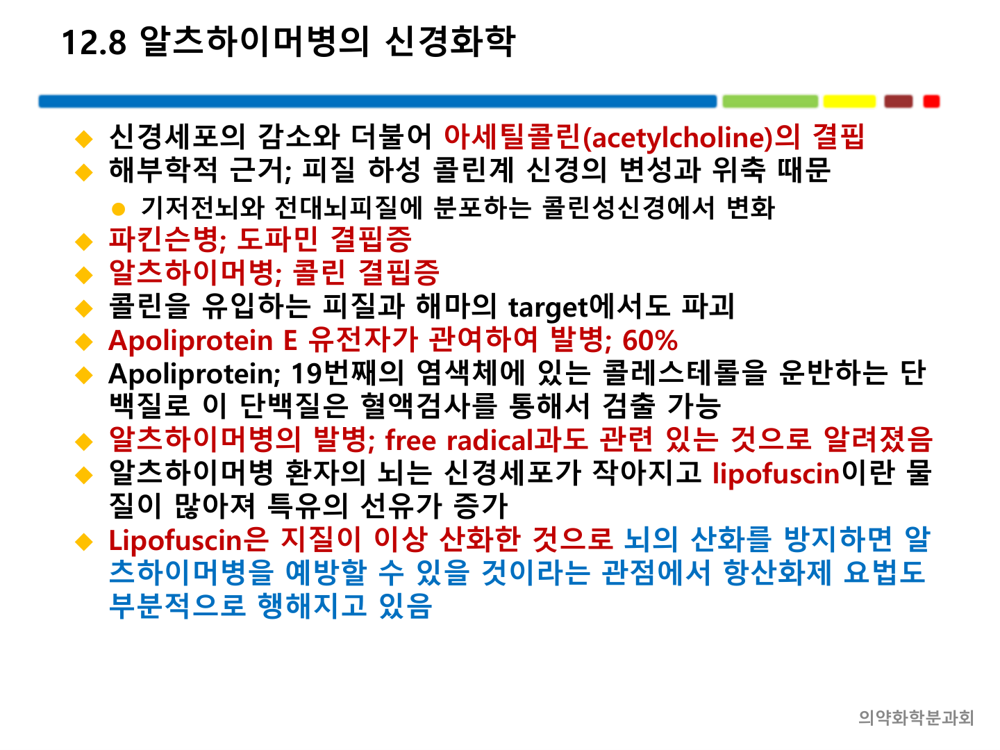
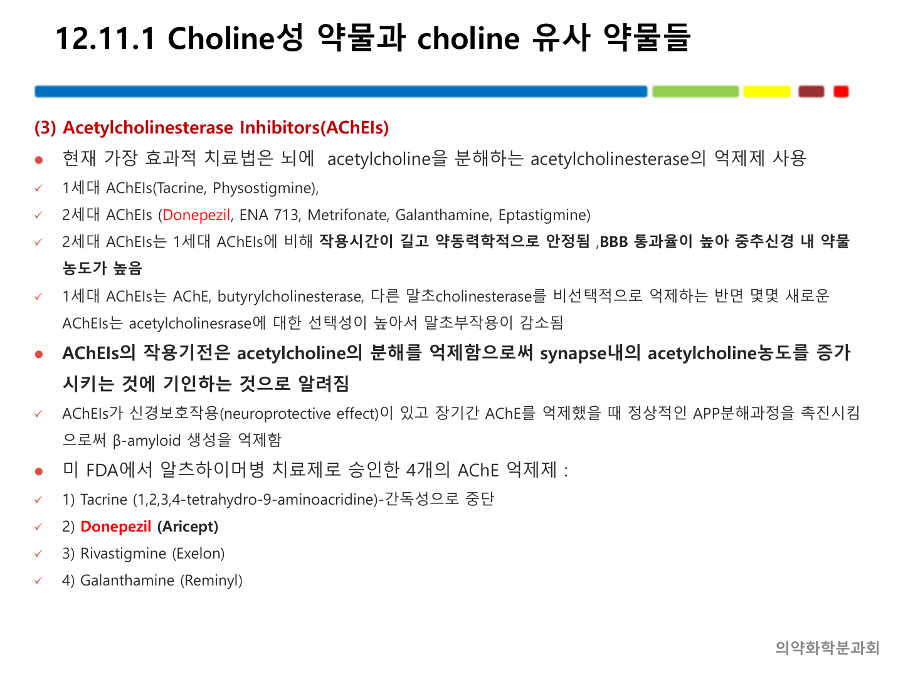
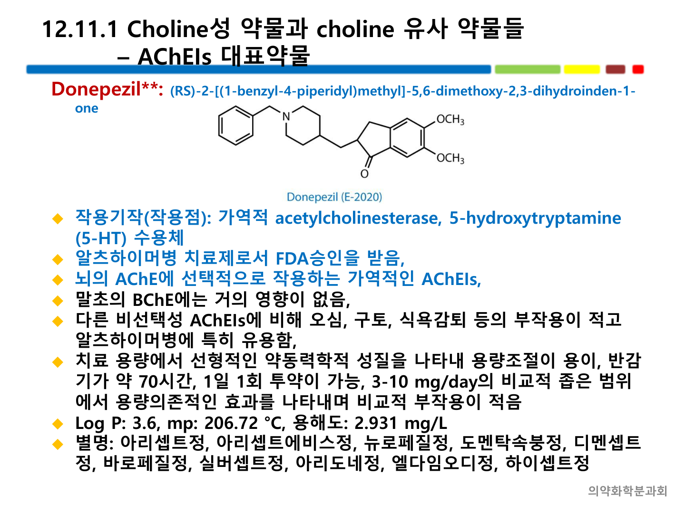

# 문제

Acetylcholine의 3차원적 구조와 receptor 결합 가능성에 대해 설명하시오.

답:
==광학이성체 없음==, ==conformational isomer 가능==, ==synclinal conformation==이 핵심이다.

[해설]
Acetylcholine은 **키랄 탄소가 없어 광학이성체가 없다**.
하지만 단일결합 회전이 가능하므로 여러 ==conformational isomer==를 가질 수 있다.
고체결정과 수용액에서는 4급 ammonium 질소와 ester 산소 사이의 **electrostatic attraction** 때문에 ==synclinal conformation==으로 존재한다.
다만 이 형태가 receptor 결합에 가장 적합하다고 단정할 수는 없다.
출처: 의약화학 기말고사 범위 수업자료.pdf p.166, p.167
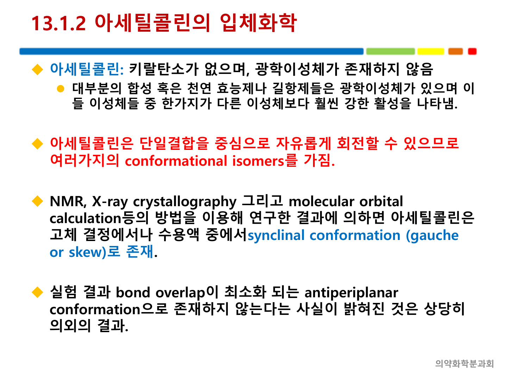
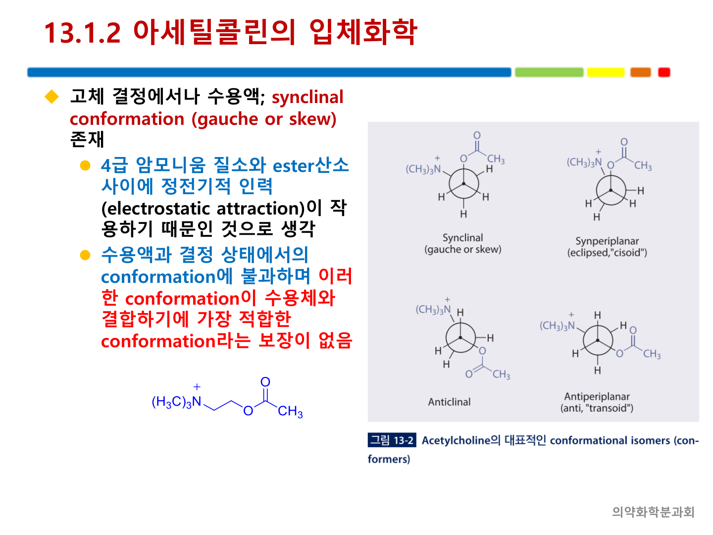

# 문제

AChE 저해제를 reversible inhibitor와 irreversible inhibitor로 구분할 때 핵심 기준을 설명하시오.

답:
==Reversible==: 가수분해 가능한 **acylated enzyme**
==Irreversible==: 안정한 **phosphorylated enzyme** 및 aging

[해설]
Reversible AChE inhibitor는 AChE와 반응해 안정한 **acylated enzyme**을 만들지만, 시간이 지나면 가수분해가 가능하다.
대표 예시는 ==aryl carbamate==와 ==physostigmine==이다.
Irreversible AChE inhibitor는 phosphate ester처럼 가수분해에 매우 안정한 ==phosphorylated enzyme==을 만든다.
특히 phosphorylated AChE에서 ==aging==이 진행되면 재활성화가 어려워진다.
출처: 의약화학 기말고사 범위 수업자료.pdf p.182, p.184
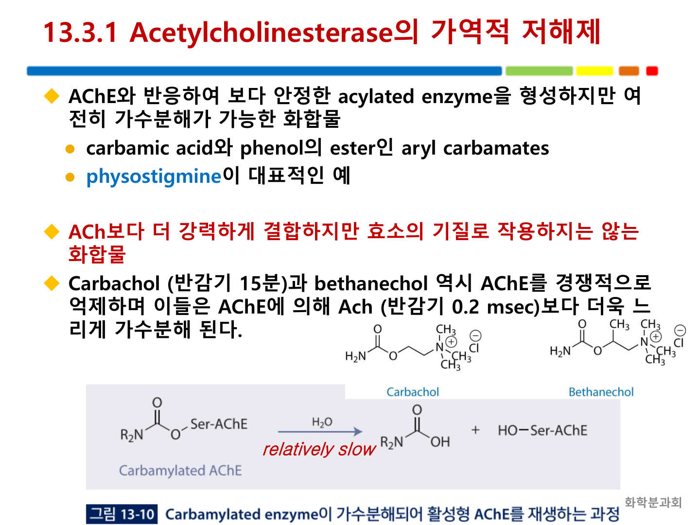
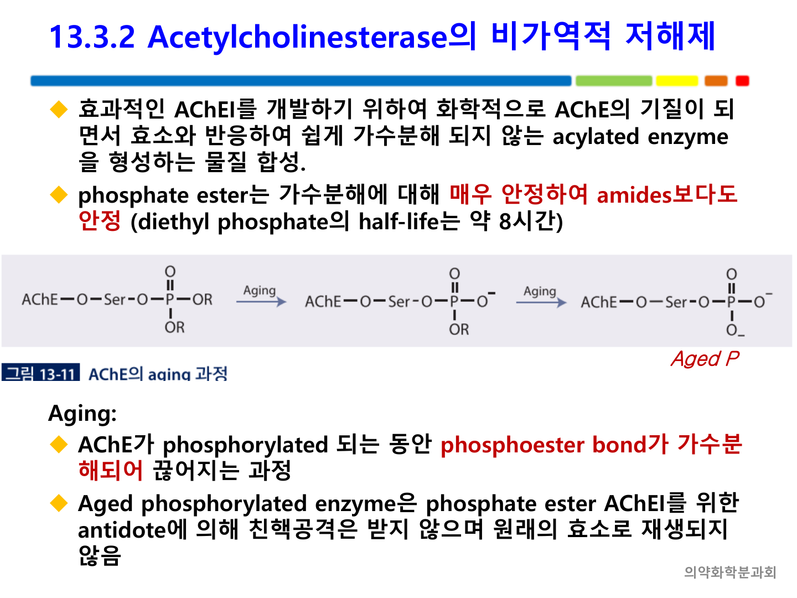

# 문제

Phenylethanolamine-type adrenergic agonist에서 alpha/beta receptor 활성 차이를 만드는 구조 요인을 설명하시오.

답:
==β-수산기 R-form==, ==N-치환기 크기 증가 → beta 활성 증가==가 핵심이다.

[해설]
β-수산기가 결합된 부제탄소는 **R-form**일 때 최대 흥분 활성을 보인다.
아민기의 N-치환기 크기가 커지면 **alpha receptor 활성은 감소**하고 **beta receptor 활성은 증가**한다.
예를 들어 N 치환기가 isopropyl인 ==isoproterenol==은 높은 beta 활성을 보이고 alpha receptor 친화성은 거의 없다.
또한 α-탄소 치환은 receptor 선택성과 대사 안정성에 영향을 준다.
출처: 의약화학 기말고사 범위 수업자료.pdf p.260, p.262
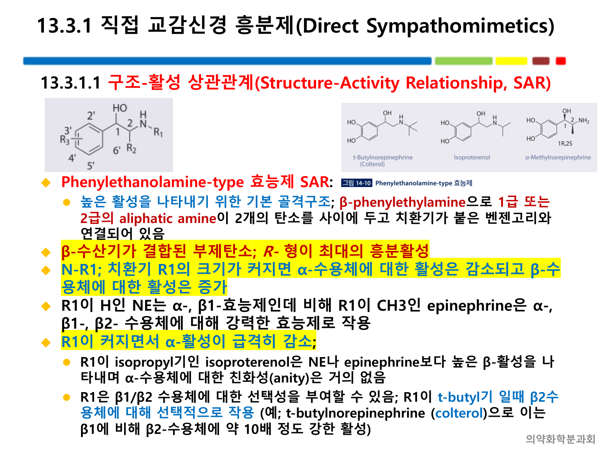
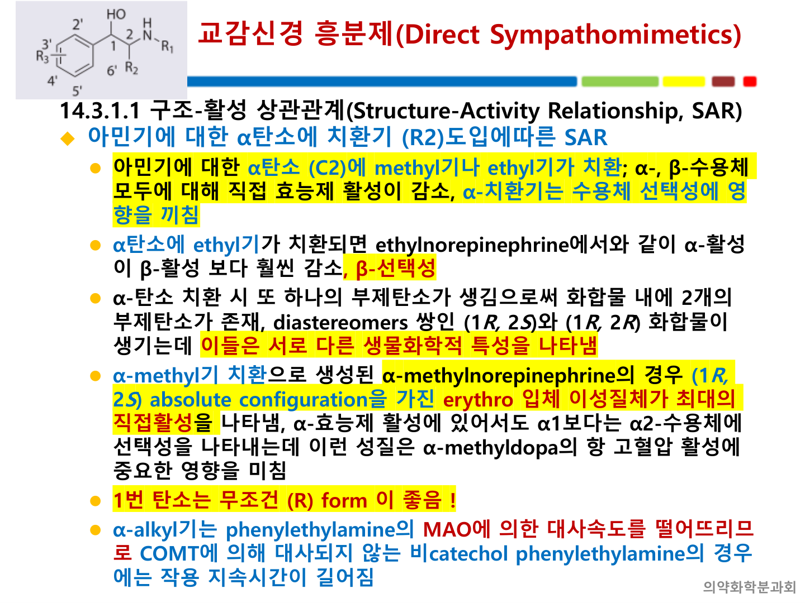

# 문제

경구투여가 가능한 교감신경흥분제의 구조적 특징을 catecholamine과 비교하여 설명하시오.

답:
==비catechol 구조==와 ==COMT/MAO 대사 회피==가 경구활성 증가의 핵심이다.

[해설]
Catechol 구조는 ==COMT==에 의해 빨리 대사되어 경구투여 활성이 낮다.
Catechol을 비catechol phenyl 구조로 바꾸면 **COMT 기질이 아니게 되어 경구 활성이 증가**한다.
==Metaproterenol==, ==albuterol==, ==mebuterol==은 경구적으로 선택적 **beta2 활성**을 보일 수 있다.
==Ephedrine==은 phenyl ring에 치환기가 없어 COMT 기질이 아니고 MAO 대사도 잘 받지 않아 **경구 효과와 지속시간**이 좋다.
출처: 의약화학 기말고사 범위 수업자료.pdf p.263, p.264, p.280
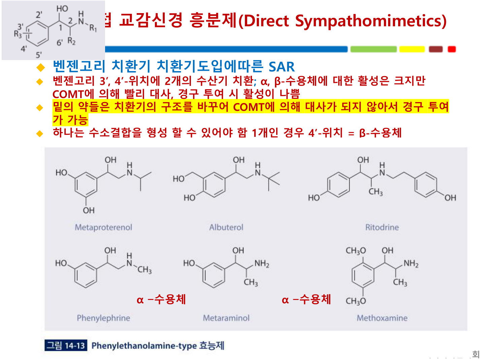
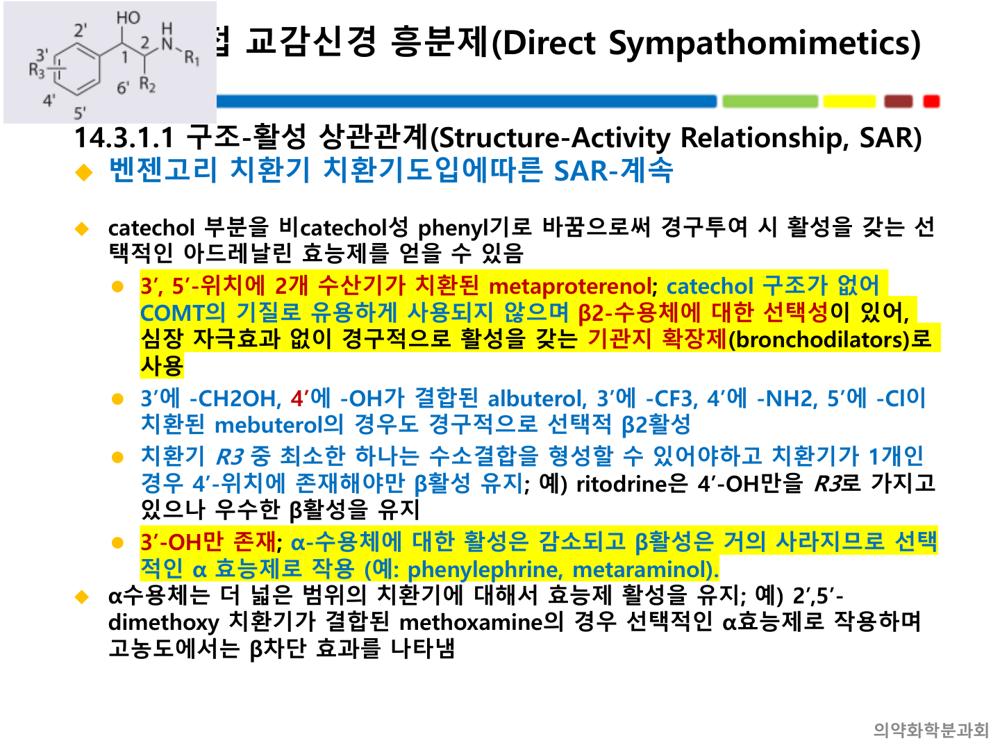
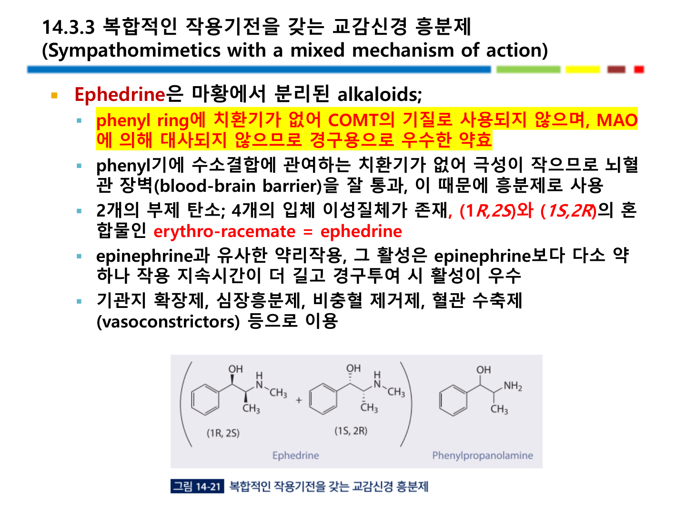

# 문제

비선택적 alpha adrenergic antagonist인 phenoxybenzamine과 phentolamine의 차이를 설명하시오.

답:
==Phenoxybenzamine==: **비가역적 alpha blocker**
==Phentolamine==: **가역적 alpha blocker**

[해설]
Phenoxybenzamine은 alkylation에 의해 **비가역적으로 alpha receptor를 차단**한다.
그래서 장시간 지속적인 항고혈압 효과를 보이며, 크롬친화성세포종에 의한 고혈압 완화 목적으로 사용된다.
Phentolamine은 **가역적 alpha receptor 차단제**이다.
두 약물 모두 비선택적 alpha antagonist이지만, phentolamine은 빈맥을 야기할 수 있다는 점도 같이 잡는다.
출처: 의약화학 기말고사 범위 수업자료.pdf p.299, p.300, p.323
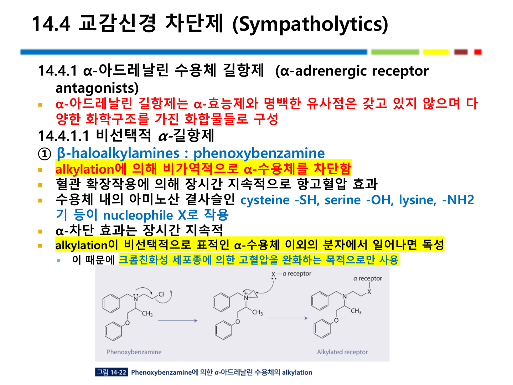
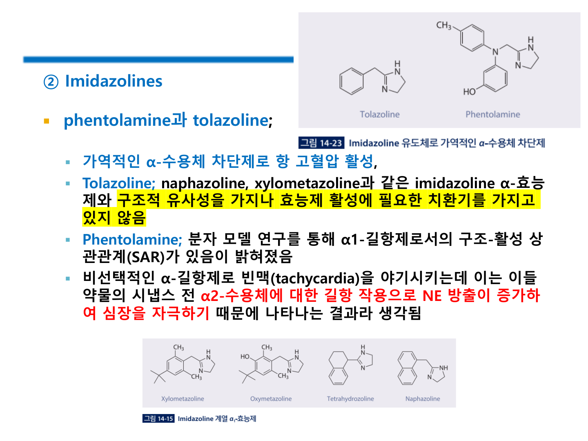
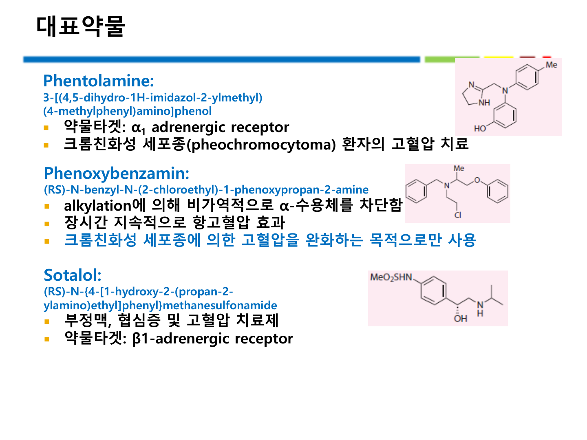

# 문제

국소마취제가 통증 전달을 차단하는 작용기전을 설명하시오.

답:
==sodium channel 차단== → ==Na+ 유입 억제== → ==action potential 차단==

[해설]
국소마취제는 **sodium channel**의 특정 부위에 결합해 신경전도를 억제한다.
Na+가 막 안으로 유입되는 것을 막아 ==action potential== 발생을 저지하고, 결과적으로 통증 신호가 뇌로 전달되지 않는다.
막 통과에는 비이온화 ==free form==이 유리하고, channel 결합에는 **ammonium ion** 형태가 중요하다.
출처: 의약화학 기말고사 범위 수업자료.pdf p.338, p.339
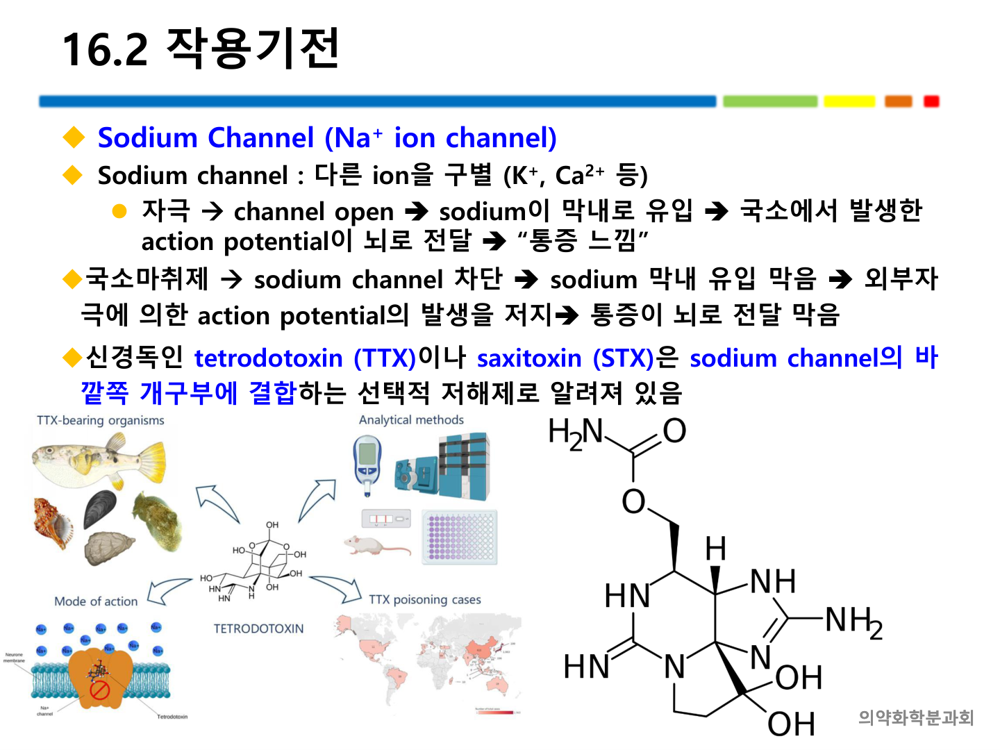
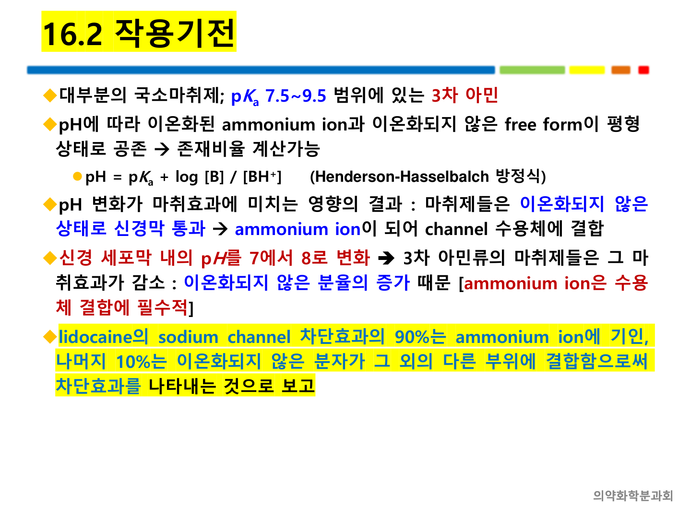

# 문제

국소마취 효과가 더 강해지거나 오래 지속되는 구조적 요인을 설명하시오.

답:
==지용성 증가==, ==amide 결합==, ==입체장애 증가==는 국소마취 효과와 지속시간을 키운다.

[해설]
Tetracaine은 procaine보다 **약 50배 강한 효과**를 보인다.
==Amide 결합==은 ester 결합보다 가수분해가 느려 약효 지속기간이 길고 수용체 결합도 강하다.
Phenyl ring 2,6-위치 치환과 가지 달린 alkyl chain은 ==입체장애==를 증가시켜 가수분해를 억제한다.
==Bupivacaine==은 lidocaine보다 지용성과 약효 및 지속성이 증가하지만, 그만큼 독성 문제도 커진다.
출처: 의약화학 기말고사 범위 수업자료.pdf p.347, p.349, p.363
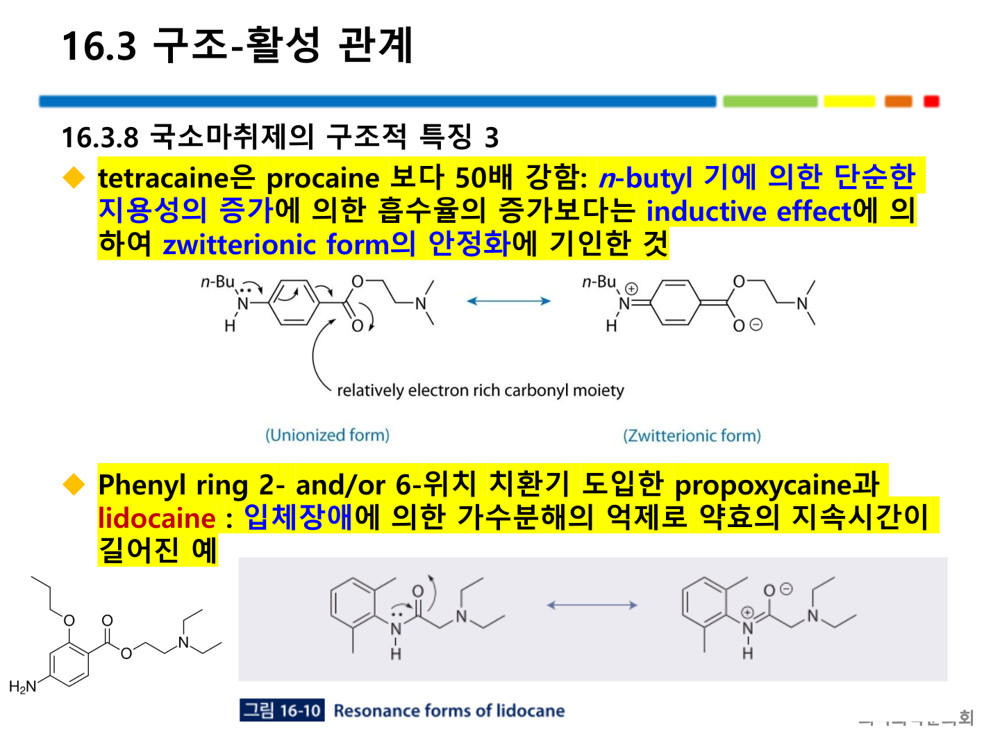
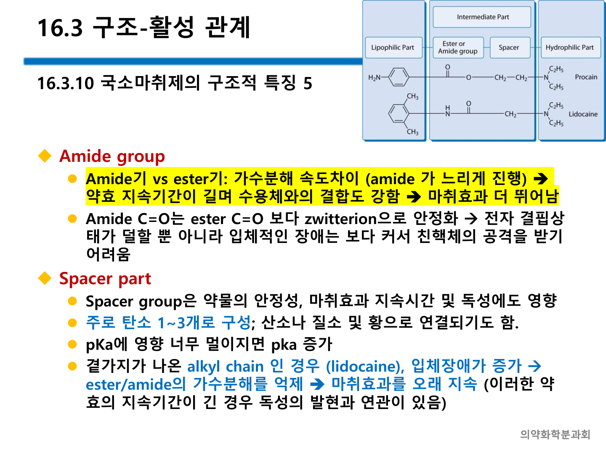
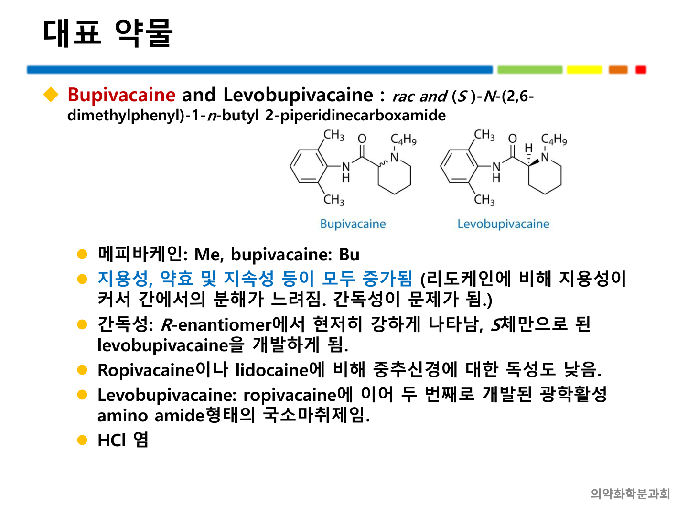

# 문제

PDE 관련 일반 설명으로 옳은 것을 모두 고르시오.

- PDE family는 아라비아숫자로, 유전자는 대문자로, splice variant는 두 번째 숫자로 표기한다.
- PDE4D2는 family 4, gene D, splicing variant 2를 뜻한다.
- PDE4, PDE7, PDE8은 cAMP를 기질로 한다.
- PDE5, PDE6, PDE9은 cGMP를 기질로 한다.
- PDE1, PDE2, PDE3, PDE10은 cAMP와 cGMP를 모두 가수분해할 수 없다.

답: 아래 표시 보기
O PDE family는 아라비아숫자로, 유전자는 대문자로, splice variant는 두 번째 숫자로 표기한다. // PDE 표기법은 family 숫자, gene 대문자, splice variant 숫자 순서로 읽는다.
O PDE4D2는 family 4, gene D, splicing variant 2를 뜻한다. // PDE4D2는 **4-D-2**를 각각 family, gene, variant로 해석한다.
O PDE4, PDE7, PDE8은 cAMP를 기질로 한다. // cAMP 선택 PDE 묶음으로 제시된 family이다.
O PDE5, PDE6, PDE9은 cGMP를 기질로 한다. // cGMP 선택 PDE 묶음으로 제시된 family이다.
X PDE1, PDE2, PDE3, PDE10은 cAMP와 cGMP를 모두 가수분해할 수 없다. -> PDE1, PDE2, PDE3, PDE10은 **cAMP와 cGMP를 모두** 가수분해할 수 있는 묶음이다.
출처: 의약화학 기말고사 범위 수업자료.pdf p.369, p.376
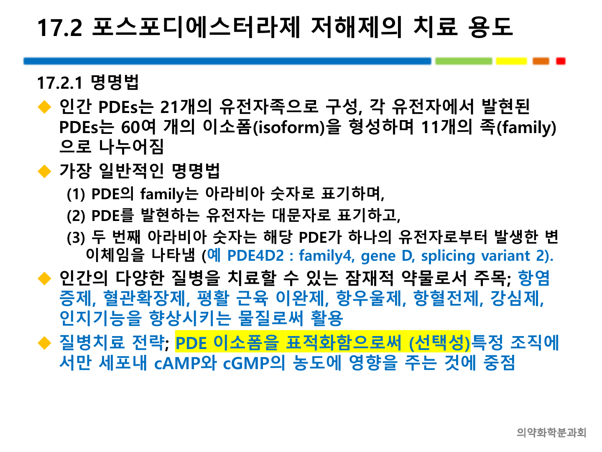
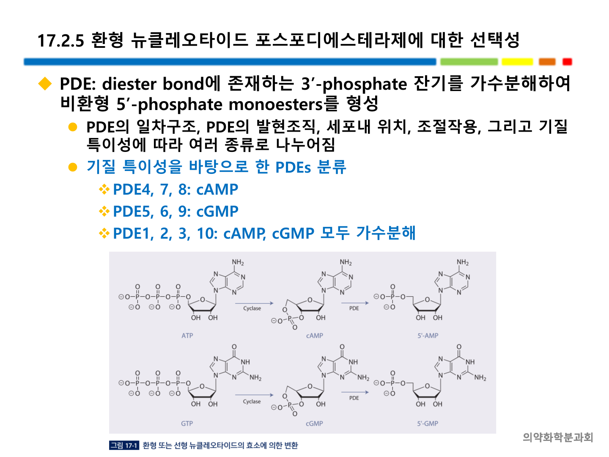

# 문제

PDE4D2의 기질 인식과 효소반응에 대한 설명으로 옳은 것을 모두 고르시오.

- 5'-AMP의 인산기는 2가 금속이온과 결합하고 His160, Asp201, Asp318과 수소결합을 형성한다.
- Phe372는 염기와 pi-pi 상호작용을 하며 hydrophobic pocket의 지붕처럼 위치한다.
- Phe372와 ribose ring 사이의 소수성 결합은 기질 인식에 중요하다.
- Gln369는 기질 특이성에서 중요한 glutamine 잔기로 설명된다.
- PDE4D2는 cyclic phosphate diester를 환원해 dopamine을 생성한다.

답: 아래 표시 보기
O 5'-AMP의 인산기는 2가 금속이온과 결합하고 His160, Asp201, Asp318과 수소결합을 형성한다. // 인산기와 금속이온, His/Asp 잔기 수소결합이 기질 인식에 관여한다.
O Phe372는 염기와 pi-pi 상호작용을 하며 hydrophobic pocket의 지붕처럼 위치한다. // Phe372는 염기와의 **pi-pi 상호작용** 및 pocket 지붕 역할로 제시된다.
O Phe372와 ribose ring 사이의 소수성 결합은 기질 인식에 중요하다. // Ribose ring과 Phe372 사이 소수성 상호작용도 기질 인식 포인트이다.
O Gln369는 기질 특이성에서 중요한 glutamine 잔기로 설명된다. // PDE 기질 특이성에서 conserved glutamine인 **Gln369**를 잡는다.
X PDE4D2는 cyclic phosphate diester를 환원해 dopamine을 생성한다. -> PDE4D2는 cyclic phosphate diester를 **가수분해**하는 효소이다. Dopamine 생성과는 관련 없다.
출처: 의약화학 기말고사 범위 수업자료.pdf p.382, p.383, p.385
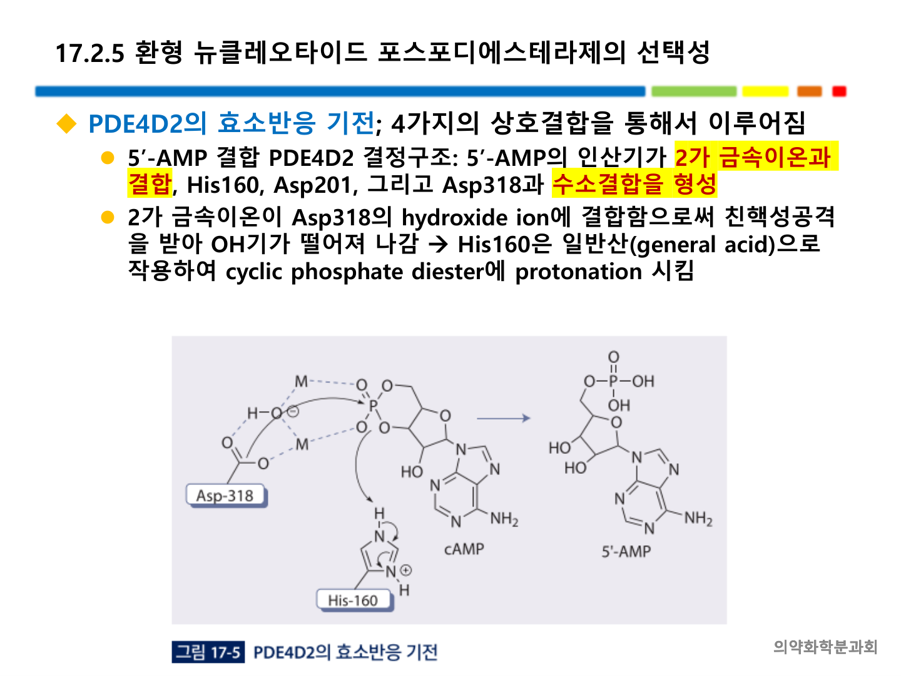
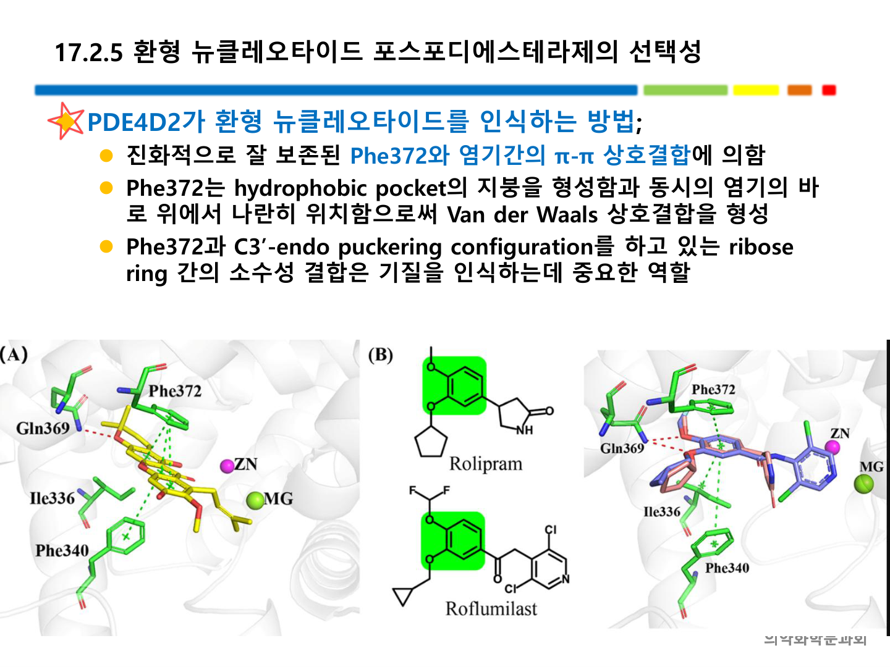
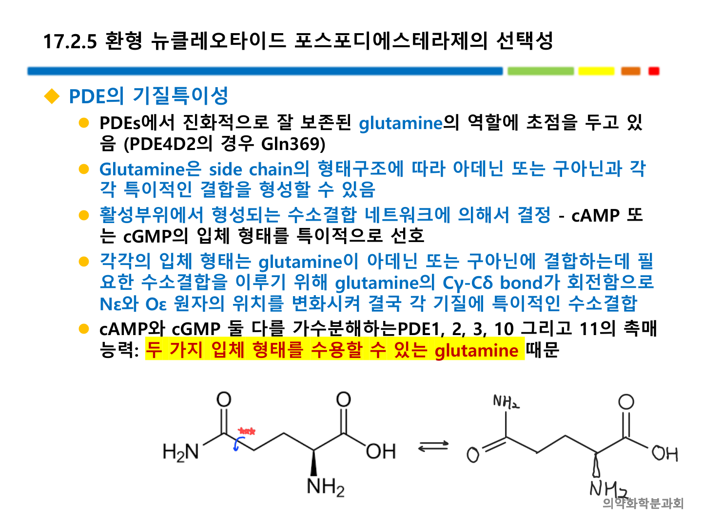

# 문제

강심배당체의 SAR로 옳은 것을 모두 고르시오.

- Steroid의 A/B ring 및 C/D ring은 cis, B/C ring은 trans 구조가 중요하다.
- 13번 위치의 methyl기와 14번 OH기는 환 위쪽에 있어야 한다.
- 17번 위치의 cardenolide를 환 위에서 아래로 바꾸면 약효가 소실된다.
- Cardenolide의 이중결합은 강심배당체 활성에 중요하다.
- C-12 위치의 OH는 극성을 높여 작용지속시간을 감소시킨다.
- C-17의 alpha,beta-불포화 lactone은 전자적·입체적으로 유사한 기능기로 활성 소실 없이 치환될 수 있다.
- C-12 위치의 OH는 극성을 낮추어 작용지속시간을 증가시킨다.

답: 아래 표시 보기
O Steroid의 A/B ring 및 C/D ring은 cis, B/C ring은 trans 구조가 중요하다. // 강심배당체 aglycone의 U자형 입체구조를 만드는 핵심 ring junction이다.
O 13번 위치의 methyl기와 14번 OH기는 환 위쪽에 있어야 한다. // 13-methyl과 14-OH의 위쪽 배향이 SAR 포인트이다.
O 17번 위치의 cardenolide를 환 위에서 아래로 바꾸면 약효가 소실된다. // C-17 cardenolide의 입체배향을 바꾸면 활성이 사라진다.
O Cardenolide의 이중결합은 강심배당체 활성에 중요하다. // Cardenolide의 **불포화 lactone** 성격이 활성에 중요하다.
O C-12 위치의 OH는 극성을 높여 작용지속시간을 감소시킨다. // C-12 OH는 극성을 높이고 대사와 약동학에 영향을 주어 작용지속시간을 줄인다.
O C-17의 alpha,beta-불포화 lactone은 전자적·입체적으로 유사한 기능기로 활성 소실 없이 치환될 수 있다. // 핵심은 lactone과 유사한 전자적·입체적 상호작용을 유지하는 것이다.
X C-12 위치의 OH는 극성을 낮추어 작용지속시간을 증가시킨다. -> C-12 위치의 OH는 극성을 **높여** 작용지속시간을 **감소**시킨다.
출처: 의약화학 기말고사 범위 수업자료.pdf p.418, p.419, p.423
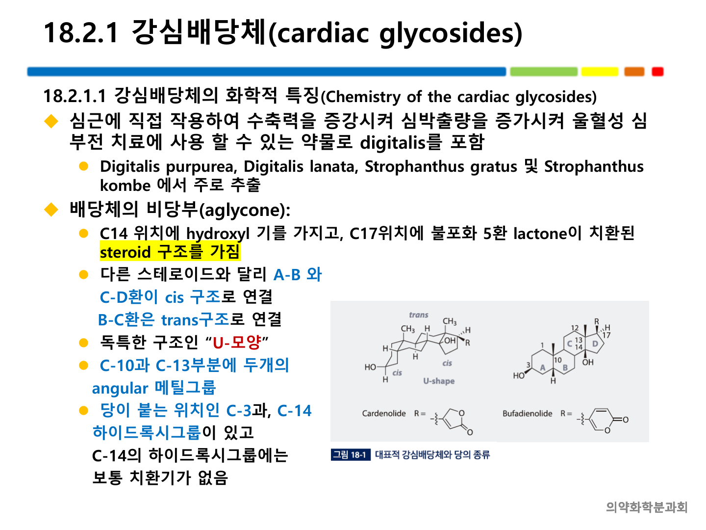
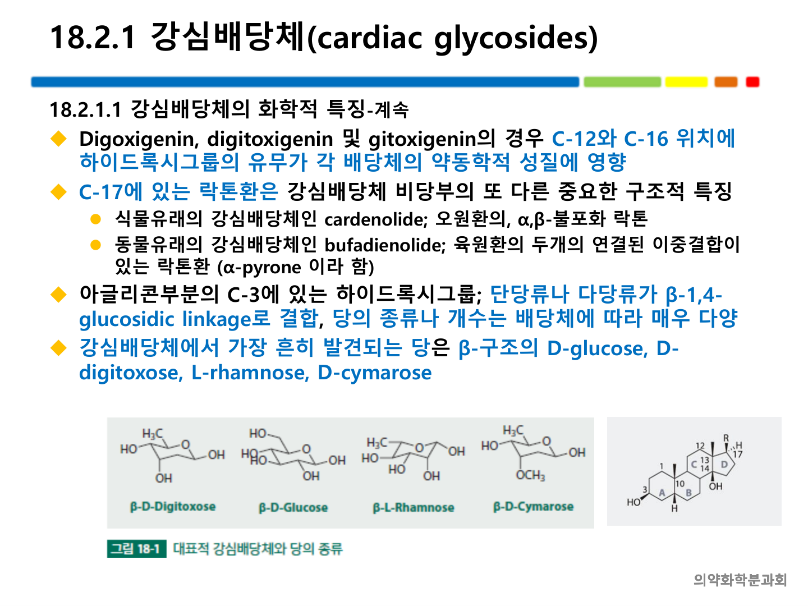
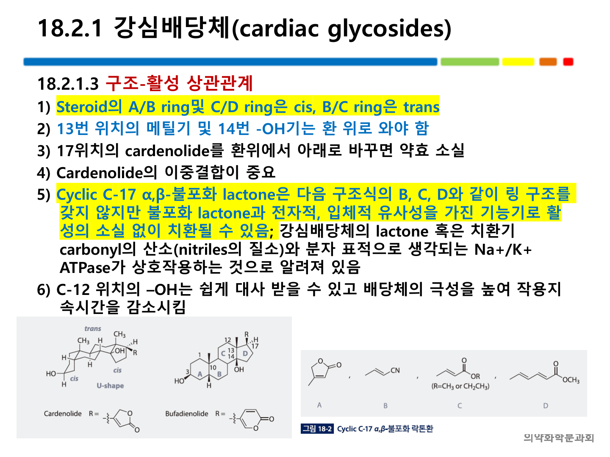

# 문제

강심배당체의 약리학적 작용과 digoxin/digitoxin 차이에 대한 설명으로 옳은 것을 모두 고르시오.

- Na+,K+-ATPase를 억제해 심근세포 내 Na+ 농도를 증가시킨다.
- 세포 내 Na+ 증가는 Na+-Ca2+ exchange를 억제해 Ca2+ 농도를 증가시킨다.
- 세포 내 Ca2+ 농도 증가는 심근 수축력을 증가시킨다.
- 지용성이 높은 강심배당체는 더 빨리 흡수되고 작용지속시간이 길어지는 경향이 있다.
- 세포 밖 K+ 농도가 낮으면 강심배당체의 작용이 상승되고, K+ 농도가 높으면 작용이 억제된다.
- Digoxin은 digitoxin보다 OH가 하나 더 있어 극성이 크고 흡수율이 낮으며 작용발현 시간이 길다.
- Digitoxin은 digoxin보다 반감기가 길고 독성이 더 오래 유지될 수 있다.
- Digoxin은 digitoxin보다 극성이 낮아 흡수율이 더 높고 반감기가 항상 더 길다.

답: 아래 표시 보기
O Na+,K+-ATPase를 억제해 심근세포 내 Na+ 농도를 증가시킨다. // 강심배당체의 1차 작용점은 **Na+,K+-ATPase 억제**이다.
O 세포 내 Na+ 증가는 Na+-Ca2+ exchange를 억제해 Ca2+ 농도를 증가시킨다. // Na+ 증가가 Na+-Ca2+ exchange를 억제하여 Ca2+ 증가로 이어진다.
O 세포 내 Ca2+ 농도 증가는 심근 수축력을 증가시킨다. // Ca2+ 증가는 심근수축기전을 활성화해 수축력을 높인다.
O 지용성이 높은 강심배당체는 더 빨리 흡수되고 작용지속시간이 길어지는 경향이 있다. // 지용성은 흡수, onset, 작용지속시간에 영향을 준다.
O 세포 밖 K+ 농도가 낮으면 강심배당체의 작용이 상승되고, K+ 농도가 높으면 작용이 억제된다. // K+ 농도와 Na+,K+-ATPase 억제 효과의 관계를 묻는 보기이다.
O Digoxin은 digitoxin보다 OH가 하나 더 있어 극성이 크고 흡수율이 낮으며 작용발현 시간이 길다. // Digoxin은 OH가 더 있어 **극성 증가**, 흡수율 감소, onset 증가로 연결된다.
O Digitoxin은 digoxin보다 반감기가 길고 독성이 더 오래 유지될 수 있다. // Digitoxin은 digoxin보다 반감기와 독성 지속이 길게 제시된다.
X Digoxin은 digitoxin보다 극성이 낮아 흡수율이 더 높고 반감기가 항상 더 길다. -> Digoxin은 digitoxin보다 OH가 하나 더 있어 **극성이 크고 흡수율이 낮다**. 긴 반감기와 오래 지속되는 독성은 digitoxin 쪽이다.
출처: 의약화학 기말고사 범위 수업자료.pdf p.421, p.422, p.424, p.426, p.427
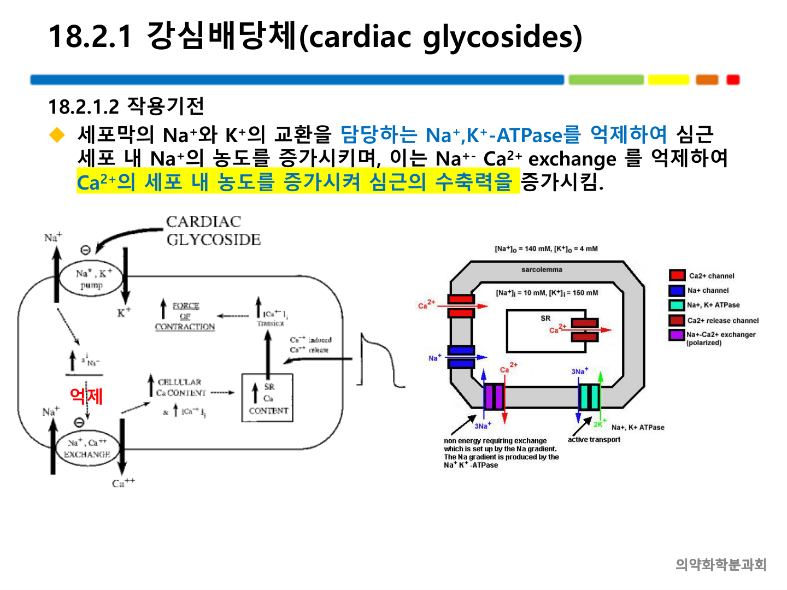
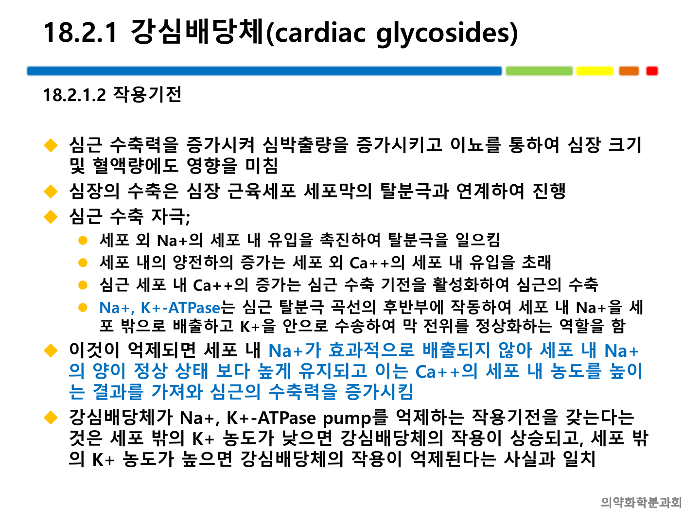
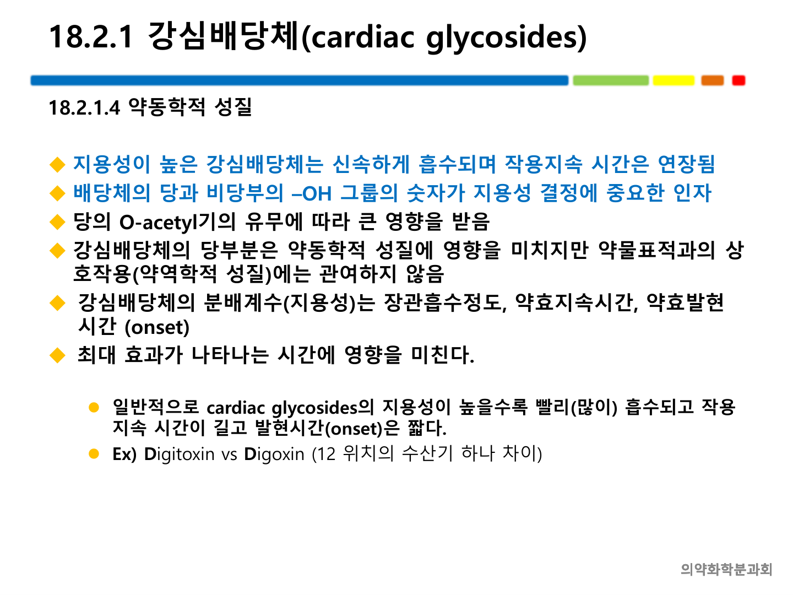
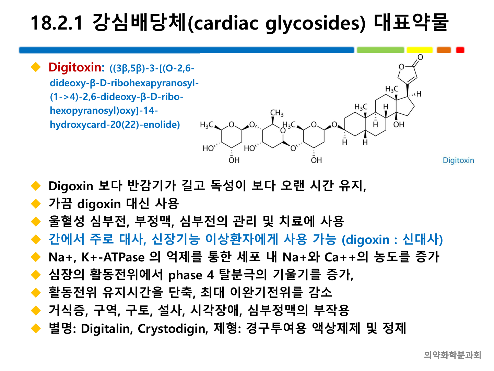
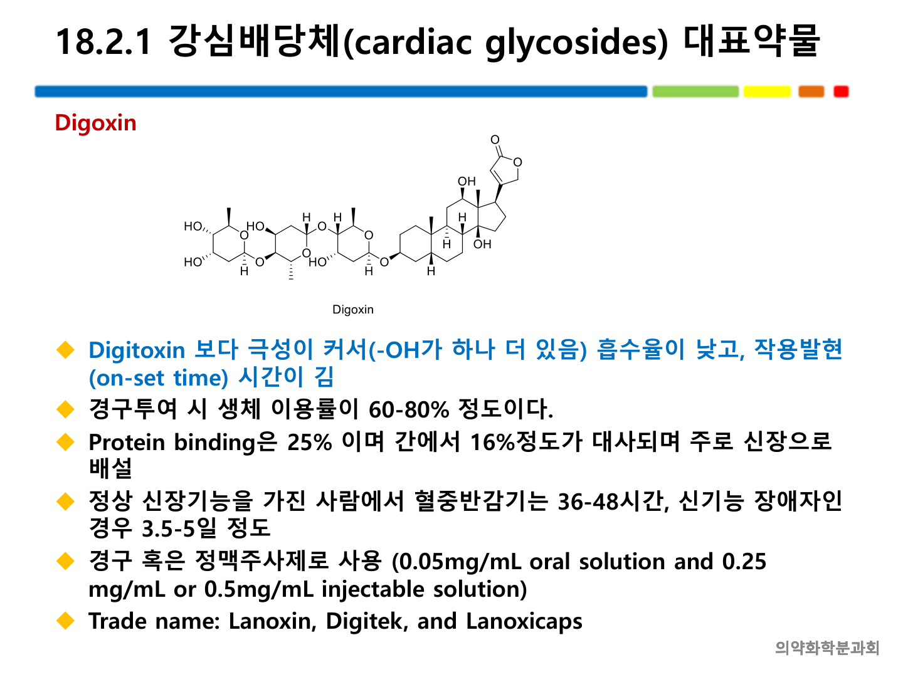

# 문제

Carbonic anhydrase inhibitor로 작용하는 simple heterocyclic sulfonamide의 SAR로 옳은 것을 모두 고르시오.

- Sulfamoyl group은 필수적이다.
- Sulfamoyl nitrogen은 치환기가 없어야 한다.
- Sulfamoyl group은 방향성을 가진 고리화합물에 결합되어 있어야 한다.
- 분배계수가 높고 pKa가 낮을수록 CA 저해활성과 이뇨효과가 높다.
- Meta-disulfamoylbenzene에서 하나의 sulfamoyl nitrogen은 치환기가 없어야 한다.
- Meta-disulfamoylbenzene에서 다른 sulfamoyl기는 carboxyl 또는 carbamoyl기로 치환되면 이뇨 potency가 증가할 수 있으나 CA 저해활성은 감소한다.
- 4번 위치에 전자를 당기는 Cl, Br, CF3, NO2 도입은 이뇨효과를 증가시킨다.
- Sulfamoyl nitrogen의 bulky 치환기는 CA 저해활성을 필수적으로 증가시킨다.

답: 아래 표시 보기
O Sulfamoyl group은 필수적이다. // Simple heterocyclic sulfonamide의 CA 저해 SAR에서 sulfamoyl group은 필수 구조이다.
O Sulfamoyl nitrogen은 치환기가 없어야 한다. // Sulfamoyl nitrogen 무치환 조건이 CA 저해활성에 중요하다.
O Sulfamoyl group은 방향성을 가진 고리화합물에 결합되어 있어야 한다. // 방향성 고리에 붙은 sulfamoyl group이 필요한 구조 조건이다.
O 분배계수가 높고 pKa가 낮을수록 CA 저해활성과 이뇨효과가 높다. // 지용성과 낮은 pKa가 CA 저해활성 및 이뇨효과 증가와 연결된다.
O Meta-disulfamoylbenzene에서 하나의 sulfamoyl nitrogen은 치환기가 없어야 한다. // Meta-disulfamoylbenzene에서도 하나의 sulfamoyl nitrogen 무치환 조건이 유지된다.
O Meta-disulfamoylbenzene에서 다른 sulfamoyl기는 carboxyl 또는 carbamoyl기로 치환되면 이뇨 potency가 증가할 수 있으나 CA 저해활성은 감소한다. // 이뇨 potency와 CA 저해활성이 같은 방향으로만 움직이지 않는 예이다.
O 4번 위치에 전자를 당기는 Cl, Br, CF3, NO2 도입은 이뇨효과를 증가시킨다. // 4번 위치 electron withdrawing group 도입은 이뇨효과 증가로 정리된다.
X Sulfamoyl nitrogen의 bulky 치환기는 CA 저해활성을 필수적으로 증가시킨다. -> Sulfamoyl nitrogen은 **치환기가 없어야** 한다. Bulky 치환기 도입은 필수 증가 조건이 아니다.
출처: 의약화학 기말고사 범위 수업자료.pdf p.481, p.482
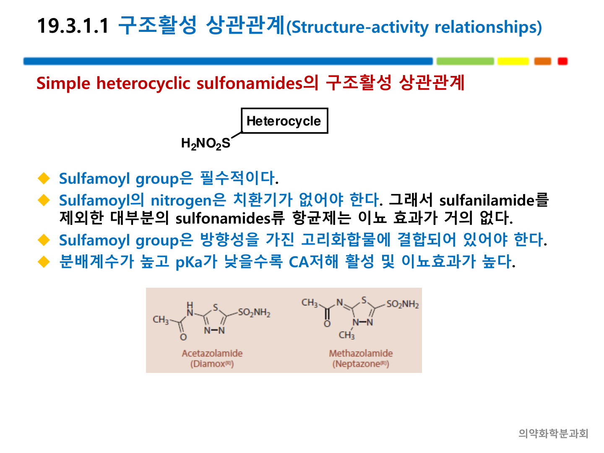
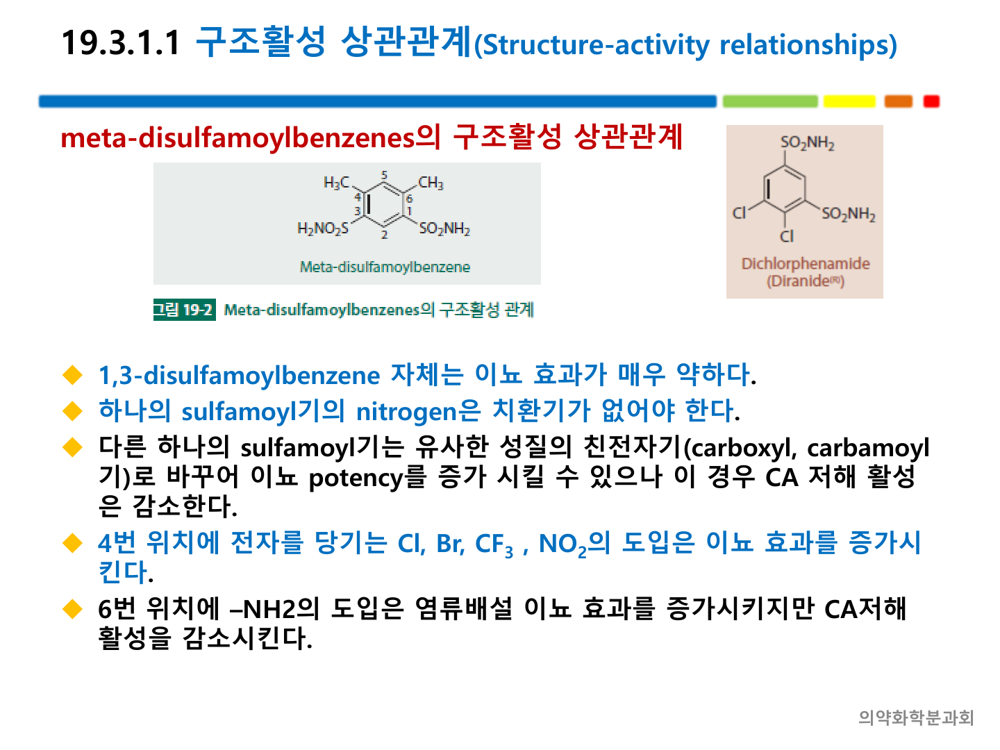

# 문제

Thiazide와 loop diuretic의 SAR 설명으로 옳은 것을 모두 고르시오.

- Thiazide에서 7번 위치의 sulfamoyl기는 필수적이며 치환되지 않아야 한다.
- Thiazide에서 6번 위치의 전자 끄는 치환기는 필수적이다.
- Loop diuretic에서 1번 치환기는 산성 성질을 가져야 하며 carboxylic acid가 최상 효과를 보인다.
- Furosemide의 carboxylic acid를 tetrazole로 바꾼 azosemide는 생동등체 치환 예이다.
- Bumetanide는 furosemide보다 40~50배 강한 이뇨작용을 보인다.
- Thiazide에서 3,4번 위치가 포화된 dihydrothiazide는 불포화 thiazide보다 potency가 3~10배 크다.
- Thiazide의 3번 위치 치환기는 지질성과 혈장단백질 결합을 높여 potency와 작용지속시간에 영향을 준다.
- Loop diuretic에서 5번 위치의 sulfamoyl기는 필수적이다.
- Loop diuretic은 site2의 1Na+/1K+/2Cl- cotransport system을 억제한다.
- Thiazide는 site3에서 Na+/Cl- cotransport system을 차단한다.
- Thiazide는 K+ 배설을 줄이는 site4 작용 약물이므로 저칼륨혈증과 관련이 없다.

답: 아래 표시 보기
O Thiazide에서 7번 위치의 sulfamoyl기는 필수적이며 치환되지 않아야 한다. // Thiazide SAR의 대표 필수 조건이다.
O Thiazide에서 6번 위치의 전자 끄는 치환기는 필수적이다. // 6번 위치의 Cl, Br, NO2, CF3 같은 electron withdrawing group을 잡는다.
O Loop diuretic에서 1번 치환기는 산성 성질을 가져야 하며 carboxylic acid가 최상 효과를 보인다. // Loop diuretic 1번 치환기는 산성기가 핵심이고 carboxylic acid가 최상으로 제시된다.
O Furosemide의 carboxylic acid를 tetrazole로 바꾼 azosemide는 생동등체 치환 예이다. // Tetrazole은 carboxylic acid의 bioisostere로 제시된다.
O Bumetanide는 furosemide보다 40~50배 강한 이뇨작용을 보인다. // Bumetanide는 furosemide보다 **40~50배** 강한 potency가 핵심 숫자이다.
O Thiazide에서 3,4번 위치가 포화된 dihydrothiazide는 불포화 thiazide보다 potency가 3~10배 크다. // 3,4번 포화 여부는 potency 차이를 만드는 SAR 포인트이다.
O Thiazide의 3번 위치 치환기는 지질성과 혈장단백질 결합을 높여 potency와 작용지속시간에 영향을 준다. // 3번 치환기는 지질성, 혈장단백질 결합, 작용지속시간과 연결된다.
O Loop diuretic에서 5번 위치의 sulfamoyl기는 필수적이다. // Loop diuretic SAR에서 5-sulfamoyl기가 필수로 제시된다.
O Loop diuretic은 site2의 1Na+/1K+/2Cl- cotransport system을 억제한다. // Loop diuretic은 Henle loop site2의 cotransport 억제가 작용기전이다.
O Thiazide는 site3에서 Na+/Cl- cotransport system을 차단한다. // Thiazide는 원위세뇨관 site3의 Na+/Cl- cotransport 차단으로 외운다.
X Thiazide는 K+ 배설을 줄이는 site4 작용 약물이므로 저칼륨혈증과 관련이 없다. -> Thiazide는 site3에서 Na+/Cl- cotransport를 차단하고, 재흡수되지 않은 Na+가 site4에서 K+와 교환되어 **저칼륨혈증**을 유발할 수 있다.
출처: 의약화학 기말고사 범위 수업자료.pdf p.486, p.491, p.498, p.499, p.501
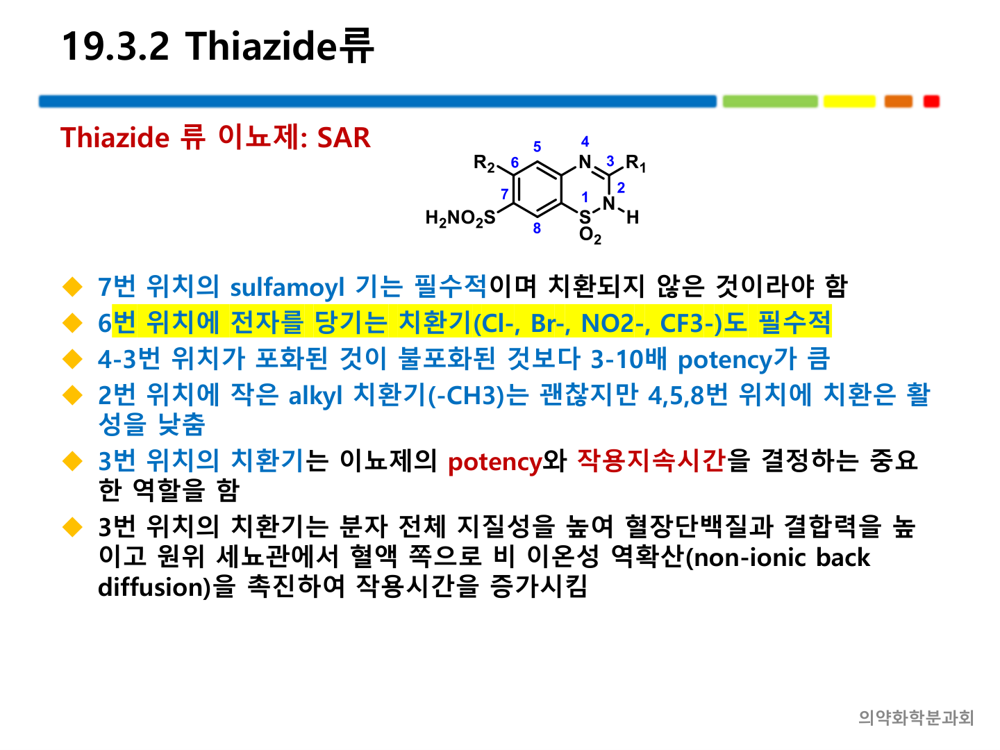
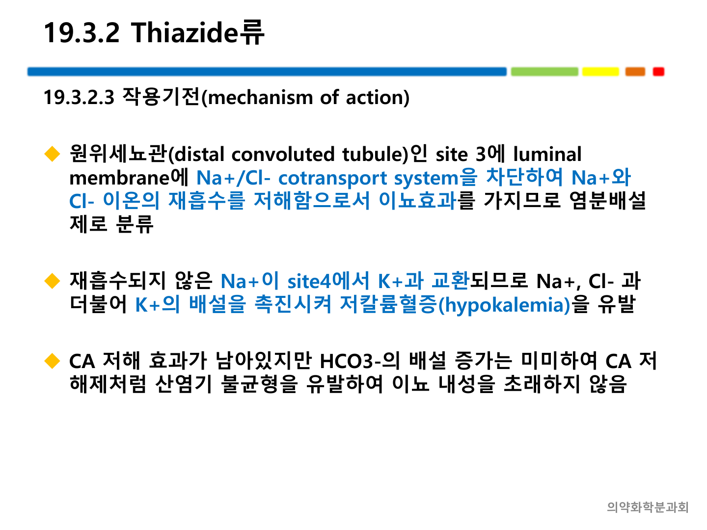
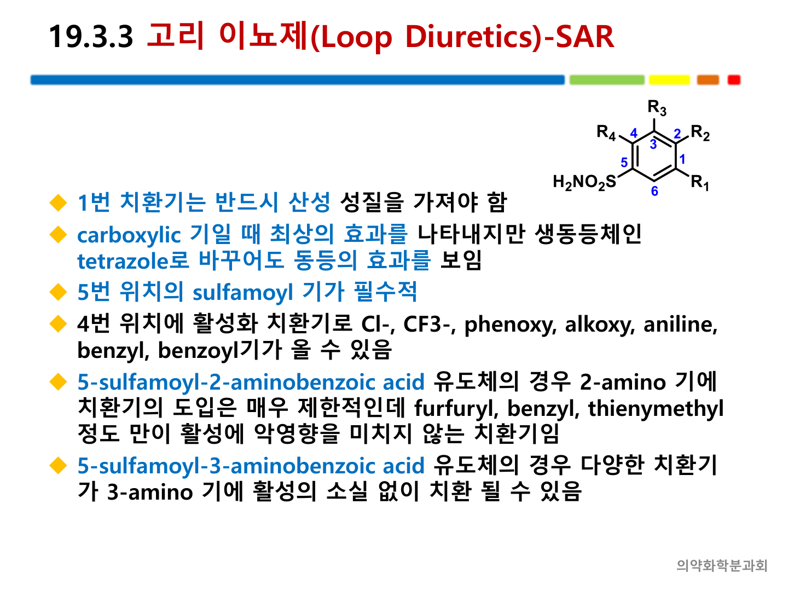
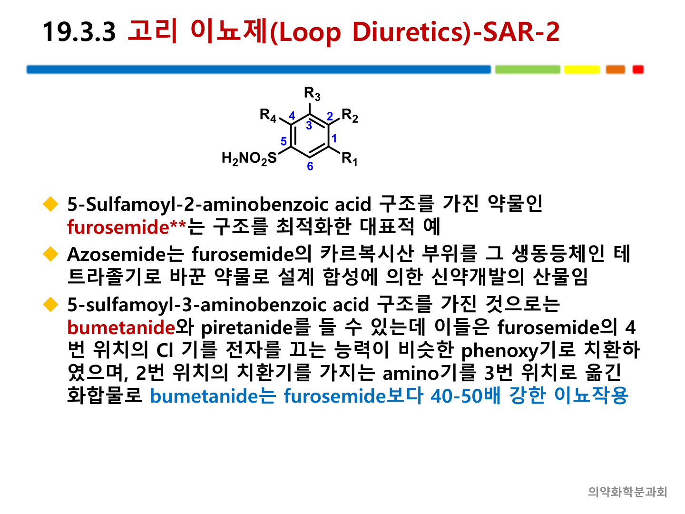


# 문제

ACE inhibitor가 혈압을 낮추는 기본 원리와 ACE 활성자리 특징으로 옳은 것을 모두 고르시오.

- ACE는 angiotensin I의 C 말단 His-Leu를 잘라 angiotensin II를 만든다.
- Angiotensin II는 aldosterone 분비 유도와 강력한 혈관수축 작용을 가진다.
- ACE는 zinc metallo-peptidase 성질을 가진다.
- ACE 활성자리에는 말단 COOH기와 이온결합하는 부분, carbonyl과 수소결합하는 부분, Zn 결합 부분이 있다.
- ACE inhibitor의 기침 부작용은 bradykinin과 prostaglandin 감소 때문에 일어난다.

답: 아래 표시 보기
O ACE는 angiotensin I의 C 말단 His-Leu를 잘라 angiotensin II를 만든다. // ACE는 angiotensin I에서 C 말단 His-Leu를 절단해 angiotensin II를 생성한다.
O Angiotensin II는 aldosterone 분비 유도와 강력한 혈관수축 작용을 가진다. // Angiotensin II의 혈압 상승 효과는 aldosterone과 혈관수축으로 연결된다.
O ACE는 zinc metallo-peptidase 성질을 가진다. // ACE 활성자리의 Zn 결합 부위와 연결되는 효소 성질이다.
O ACE 활성자리에는 말단 COOH기와 이온결합하는 부분, carbonyl과 수소결합하는 부분, Zn 결합 부분이 있다. // ACE inhibitor 설계에서 잡는 세 결합 부위이다.
X ACE inhibitor의 기침 부작용은 bradykinin과 prostaglandin 감소 때문에 일어난다. -> ACE inhibitor의 기침은 bradykinin 관련 작용과 연결되며, 보기처럼 **감소** 때문에 생긴다고 잡지 않는다. 감소라고 쓰면 방향이 틀린다.
출처: 의약화학 기말고사 범위 수업자료.pdf p.522, p.523


# 문제

Captopril, enalapril, lisinopril의 구조적 개발 포인트를 설명하시오.

답:
==Captopril==은 **SH기**, ==Enalapril==은 **prodrug**, ==Lisinopril==은 **prodrug 아님**으로 구분한다.

[해설]
Captopril은 C 말단 proline을 도입하고, ACE의 Zn++와 강하게 결합하도록 **sulfhydryl기**를 도입해 개발되었다.
Captopril의 피부발진과 식욕부진 등은 구조 내 **SH기**와 관련된 것으로 설명된다.
Enalapril은 SH기 대신 carboxyl기를 가진 ACE inhibitor 계열이며, 경구 생체이용률을 높인 **prodrug**이다.
Lisinopril은 enalaprilat의 lysine 유도체이며, carboxyl기를 가진 ACE inhibitor 중 **prodrug이 아니다**.
출처: 의약화학 기말고사 범위 수업자료.pdf p.525, p.532, p.534


# 문제

HMG-CoA reductase inhibitor의 기본 작용과 SAR 핵심을 설명하시오.

답:
==HMG-CoA → mevalonic acid 전환 억제==가 statin의 핵심 작용이다.

[해설]
HMG-CoA reductase inhibitor는 HMG-CoA가 **mevalonic acid**로 전환되는 것을 저해해 혈장 cholesterol을 낮춘다.
이 계열은 ==statin/vastatin==계 약물이다.
**3,5-dihydroxyheptanoate**는 중요한 약리단이며, 3-hydroxy와 5-hydroxy의 절대구조는 **3R,5R**일 때 중요하다.
탄소와 ring system 사이에는 탄소 2개가 이상적이다.
출처: 의약화학 기말고사 범위 수업자료.pdf p.584, p.590


# 문제

Atorvastatin이 HMG-CoA reductase와 결합할 때 주요 작용기와 효소 잔기의 상호작용을 설명하시오.

답:
==carboxylate-Lys735 salt bridge==, ==Ser565 수소결합==, ==Arg590 dipolar interaction==이 결합 포인트이다.

[해설]
Atorvastatin의 **carboxylate**는 Lys 잔기와 강한 이온결합을 형성한다.
C3, C5 위치의 **두 hydroxy기**, p-fluoro기, isopropyl기는 효소 결합에 참여한다.
Amide carbonyl oxygen은 **Ser565**와 강한 수소결합을 형성한다.
Fluoro기는 **Arg590**과 dipolar interaction을 한다.
Carboxylate 음이온은 **Lys735**와 salt bridge를 형성한다.
출처: 의약화학 기말고사 범위 수업자료.pdf p.593


# 문제

콜레스테롤 생합성과 대사 경로에서 HMG-CoA 이후 핵심 흐름과 cholesterol의 주요 대사 방향을 설명하시오.

답:
==HMG-CoA → mevalonate → isoprenoid intermediates → squalene/lanosterol → cholesterol==

[해설]
HMG-CoA는 HMG-CoA reductase 단계 이후 **mevalonate**로 이어진다.
Mevalonate는 mevalonate diphosphate, isopentenyl pyrophosphate, geranyl pyrophosphate 같은 ==isoprenoid intermediate==로 이어진다.
Farnesyl pyrophosphate는 **squalene**, **lanosterol**을 거쳐 cholesterol 생합성 경로로 연결된다.
Cholesterol은 endocrine glands에서 **steroids**로, liver에서 **bile salts**로 대사될 수 있다.
또한 cholesterol은 **ACAT**에 의해 acetyl-cholesterol로 전환될 수 있다.
출처: 의약화학 기말고사 범위 수업자료.pdf p.573, p.574, p.575, p.576


# 문제

Sulfonylurea 계열 경구 당뇨병 치료제에 대한 설명으로 옳은 것을 모두 고르시오.

- 췌장 베타세포 수용체와 결합하여 ATP-sensitive K+ channel을 닫는다.
- 전압민감성 Ca2+ channel이 열리면서 베타세포 내 Ca2+ 농도가 증가한다.
- 혈당과 관계없이 인슐린 분비를 유도할 수 있어 저혈당에 주의해야 한다.
- 방향족 sulfonyl기는 para 위치 치환 형태로 하나의 nitrogen에 연결되는 SAR가 중요하다.
- 설포닐우레아에 의한 인슐린 분비 프로파일은 당에 의한 인슐린 분비와 유사하지만 동일하지는 않다.
- 제3세대 설포닐우레아인 glimepiride는 저혈당 위험이 낮은 것으로 설명된다.
- 설포닐그룹과 결합하지 않는 우레아 질소에는 비교적 부피가 큰 그룹이 필요하다.
- 우레아 nitrogen에 methyl이나 ethyl처럼 작은 치환기가 붙으면 약효가 강해진다.

답: 아래 표시 보기
O 췌장 베타세포 수용체와 결합하여 ATP-sensitive K+ channel을 닫는다. // Sulfonylurea는 베타세포 수용체 결합 후 ATP-sensitive K+ channel을 닫는다.
O 전압민감성 Ca2+ channel이 열리면서 베타세포 내 Ca2+ 농도가 증가한다. // K+ channel 폐쇄 뒤 Ca2+ 유입 증가가 인슐린 분비로 이어진다.
O 혈당과 관계없이 인슐린 분비를 유도할 수 있어 저혈당에 주의해야 한다. // Sulfonylurea는 혈당과 무관하게 인슐린 분비를 유도할 수 있어 저혈당 위험이 있다.
O 방향족 sulfonyl기는 para 위치 치환 형태로 하나의 nitrogen에 연결되는 SAR가 중요하다. // 방향족 sulfonyl기와 para 치환, nitrogen 연결이 SAR 핵심이다.
O 설포닐우레아에 의한 인슐린 분비 프로파일은 당에 의한 인슐린 분비와 유사하지만 동일하지는 않다. // 유사하지만 동일하지 않다는 표현이 자료의 구분 포인트이다.
O 제3세대 설포닐우레아인 glimepiride는 저혈당 위험이 낮은 것으로 설명된다. // Glimepiride는 3세대 sulfonylurea로 저혈당 위험이 낮다고 제시된다.
O 설포닐그룹과 결합하지 않는 우레아 질소에는 비교적 부피가 큰 그룹이 필요하다. // 우레아 질소 쪽에는 작은 치환기보다 bulky group이 필요하다.
X 우레아 nitrogen에 methyl이나 ethyl처럼 작은 치환기가 붙으면 약효가 강해진다. -> Sulfonylurea에서 해당 nitrogen에 methyl이나 ethyl 같은 작은 치환기가 붙으면 **약효가 없다**고 제시된다.
출처: 의약화학 기말고사 범위 수업자료.pdf p.653, p.655


# 문제

Metformin과 thiazolidinedione 계열의 대표적 특성으로 옳은 것을 모두 고르시오.

- Metformin은 AMPK를 활성화시키는 것으로 설명된다.
- Metformin은 insulin sensitizer로 작용하여 간에서 혈당 생성을 억제하고 혈당 이용도를 증가시킨다.
- Thiazolidinedione 계열은 PPAR-gamma에 결합해 insulin sensitivity를 증가시킨다.
- Thiazolidinedione 계열 약물명에는 glitazone이 포함될 수 있다.
- Thiazolidinedione 계열은 구조식에 thiazolidinedione 구조를 가진다.
- Troglitazone은 시판 후 간기능정지, 간이식, 사망 사례가 드물게 나타나 판매중단되었다.
- Rosiglitazone과 pioglitazone은 glitazone 계열의 예이다.
- Metformin은 sulfonylurea 수용체에 결합해 ATP-sensitive K+ channel을 직접 닫는 것이 주작용이다.

답: 아래 표시 보기
O Metformin은 AMPK를 활성화시키는 것으로 설명된다. // Metformin의 작용 설명은 간 mitochondria의 **AMPK 활성화**와 연결된다.
O Metformin은 insulin sensitizer로 작용하여 간에서 혈당 생성을 억제하고 혈당 이용도를 증가시킨다. // Metformin은 insulin sensitizer로 혈당 생성 억제와 이용도 증가를 보인다.
O Thiazolidinedione 계열은 PPAR-gamma에 결합해 insulin sensitivity를 증가시킨다. // TZD는 **PPAR-gamma** 효능작용과 insulin sensitivity 증가를 묶어 잡는다.
O Thiazolidinedione 계열 약물명에는 glitazone이 포함될 수 있다. // Glitazone 이름은 TZD 계열명 신호이다.
O Thiazolidinedione 계열은 구조식에 thiazolidinedione 구조를 가진다. // 계열명 그대로 thiazolidinedione 모핵을 가진다.
O Troglitazone은 시판 후 간기능정지, 간이식, 사망 사례가 드물게 나타나 판매중단되었다. // Troglitazone은 간독성 관련 판매중단 사례로 구분한다.
O Rosiglitazone과 pioglitazone은 glitazone 계열의 예이다. // Rosiglitazone과 pioglitazone은 TZD/glitazone 대표 예시이다.
X Metformin은 sulfonylurea 수용체에 결합해 ATP-sensitive K+ channel을 직접 닫는 것이 주작용이다. -> Metformin은 **AMPK 활성화와 insulin sensitizer** 작용이 핵심이다. ATP-sensitive K+ channel 직접 폐쇄는 sulfonylurea 쪽이다.
출처: 의약화학 기말고사 범위 수업자료.pdf p.670, p.671, p.672


# 문제

DPP-IV inhibitor와 SGLT2 inhibitor의 대표적 기전으로 옳은 것을 모두 고르시오.

- DPP-IV를 억제하면 GLP-1 활성이 지속된다.
- GLP-1 활성 지속은 식후 인슐린 분비 촉진과 glucagon 분비 억제를 일으킨다.
- DPP-IV는 장과 간에 존재하는 serine protease로 GLP-1을 분해하여 불활성화한다.
- SGLT2 억제제는 포도당 재흡수를 억제하여 소변으로 포도당 배설을 증가시킨다.
- SGLT2는 신장 포도당 재흡수의 약 90%에 관여한다.
- SGLT1은 낮은 capacity와 높은 affinity, SGLT2는 높은 capacity와 낮은 affinity를 가진다.
- SGLT2 억제제는 인슐린과 비의존적으로 혈당을 감소시킬 수 있다.
- SGLT2 억제로 소변 포도당 배설이 증가하면 요로감염 빈도가 증가할 수 있다.
- SGLT2 억제제는 인슐린 분비를 직접 과도하게 촉진해 항상 심한 저혈당을 유발한다.

답: 아래 표시 보기
O DPP-IV를 억제하면 GLP-1 활성이 지속된다. // DPP-IV가 GLP-1을 분해하므로 억제하면 GLP-1 활성이 지속된다.
O GLP-1 활성 지속은 식후 인슐린 분비 촉진과 glucagon 분비 억제를 일으킨다. // GLP-1 지속 효과는 식후 인슐린 증가와 glucagon 억제로 연결된다.
O DPP-IV는 장과 간에 존재하는 serine protease로 GLP-1을 분해하여 불활성화한다. // DPP-IV의 정체와 기질을 묻는 보기이다.
O SGLT2 억제제는 포도당 재흡수를 억제하여 소변으로 포도당 배설을 증가시킨다. // SGLT2 억제의 직접 결과는 urinary glucose excretion 증가이다.
O SGLT2는 신장 포도당 재흡수의 약 90%에 관여한다. // 숫자는 **90%**로 잡는다.
O SGLT1은 낮은 capacity와 높은 affinity, SGLT2는 높은 capacity와 낮은 affinity를 가진다. // SGLT1/SGLT2 구분은 capacity와 affinity가 반대이다.
O SGLT2 억제제는 인슐린과 비의존적으로 혈당을 감소시킬 수 있다. // SGLT2 억제제 장점은 insulin-independent 혈당 감소이다.
O SGLT2 억제로 소변 포도당 배설이 증가하면 요로감염 빈도가 증가할 수 있다. // 소변 내 포도당 증가가 요로감염 부작용과 연결된다.
X SGLT2 억제제는 인슐린 분비를 직접 과도하게 촉진해 항상 심한 저혈당을 유발한다. -> SGLT2 억제제는 인슐린과 비의존적으로 작용하며, SGLT가 완전히 억제되지 않아 **저혈당은 거의 유발되지 않음**으로 제시된다.
출처: 의약화학 기말고사 범위 수업자료.pdf p.645, p.677, p.678


# 문제

COX-1/COX-2 선택성과 celecoxib의 선택성 설명으로 옳은 것을 모두 고르시오.

- 비선택적 COX-1/COX-2 inhibitor는 COX-1 관련 위장관 부작용을 유발할 수 있다.
- Selective COX-2 inhibitor는 위장관 부작용을 줄이는 방향으로 개발되었다.
- COX-1 active site에는 Ile-523, COX-2에는 Val-523이 있어 COX-2 pocket이 더 크다.
- Celecoxib의 sulfonamide 잔기는 COX-2의 hydrophilic side pocket region과 관련된다.
- COX-2 선택성은 COX-2 pocket이 COX-1보다 작기 때문에 생긴다.

답: 아래 표시 보기
O 비선택적 COX-1/COX-2 inhibitor는 COX-1 관련 위장관 부작용을 유발할 수 있다. // COX-1 관련 위장관 부작용 때문에 COX-2 선택성 개발 필요성이 나온다.
O Selective COX-2 inhibitor는 위장관 부작용을 줄이는 방향으로 개발되었다. // COX-2 선택 억제제는 GI side effect 감소 목적과 연결된다.
O COX-1 active site에는 Ile-523, COX-2에는 Val-523이 있어 COX-2 pocket이 더 크다. // Ile에서 Val로 바뀌어 COX-2 pocket이 더 커지는 것이 선택성 근거이다.
O Celecoxib의 sulfonamide 잔기는 COX-2의 hydrophilic side pocket region과 관련된다. // Celecoxib 선택성은 **sulfonamide**와 COX-2 hydrophilic side pocket으로 잡는다.
X COX-2 선택성은 COX-2 pocket이 COX-1보다 작기 때문에 생긴다. -> COX-2 선택성은 COX-2 pocket이 COX-1보다 **더 크기 때문에** 생긴다. COX-2의 Val-523이 핵심이다.
출처: 의약화학 기말고사 범위 수업자료.pdf p.703, p.704, p.719


# 문제

NSAID 또는 해열진통제 계열과 특징의 연결로 옳은 것을 모두 고르시오.

- p-Aminophenol 유도체는 진통과 해열작용이 있으나 항염증 효과는 미미하다.
- Pyrazolone계 항염증제는 COX를 억제하여 prostaglandin 생성을 억제한다.
- Arylpropionic analog에서 methyl group 도입은 항염증효과를 증가시킬 수 있다.
- Oxicam 계열은 acidic heterocyclic sulfonamide analog 또는 enolic acid 계열로 설명된다.
- Paracetamol은 강한 항염증 및 혈소판 기능 억제 때문에 전형적 NSAID로 분류된다.

답: 아래 표시 보기
O p-Aminophenol 유도체는 진통과 해열작용이 있으나 항염증 효과는 미미하다. // p-Aminophenol 계열은 analgesic-antipyretic 중심이고 항염증은 약하다.
O Pyrazolone계 항염증제는 COX를 억제하여 prostaglandin 생성을 억제한다. // Pyrazolone계는 COX 억제와 PG 생성 억제로 연결된다.
O Arylpropionic analog에서 methyl group 도입은 항염증효과를 증가시킬 수 있다. // Profen 계열 SAR에서 methyl 도입은 항염증효과 증가로 제시된다.
O Oxicam 계열은 acidic heterocyclic sulfonamide analog 또는 enolic acid 계열로 설명된다. // Oxicam은 cyclic sulfonamide이자 enolic acid 계열로 잡는다.
X Paracetamol은 강한 항염증 및 혈소판 기능 억제 때문에 전형적 NSAID로 분류된다. -> Paracetamol은 항염증 및 혈소판 기능 효과가 없어 **NSAID로 분류되지 않는다**.
출처: 의약화학 기말고사 범위 수업자료.pdf p.687, p.692, p.698, p.700, p.708


# 문제

대표 NSAID, 해열진통제, COX-2 inhibitor 약물명과 계열 또는 특징의 연결로 옳은 것을 모두 고르시오.

- Paracetamol/APAP은 acetanilide계 해열진통제이며 항염증 및 혈소판 기능 효과가 없어 NSAID로 분류되지 않는다.
- Aspirin/ASA는 salicylic acid계 약물이며 prostaglandin 합성과 분비 억제가 항염증 작용기전으로 설명된다.
- Diflunisal은 aspirin과 유사한 약리작용과 부작용을 가지는 salicylic acid계 항염증진통제이다.
- Indomethacin은 prostaglandin과 다른 autacoid 형성에 필요한 cyclooxygenase를 억제하는 NSAID이다.
- Diclofenac은 sodium 또는 potassium 염 형태로 쓰일 수 있는 NSAID이다.
- Sulindac은 체내에서 활성 NSAID로 전환되는 sulfinylindene 유래 prodrug이다.
- Ibuprofen은 arylpropionic acid계 NSAID이며 전형적인 NSAIDs와 비슷한 약리작용을 가진다.
- Naproxen은 phenylpropionic acid 유사체로 ibuprofen과 약물학적 성질 및 임상적 이용이 비슷하다.
- Piroxicam은 oxicam 계열 약물이며 cyclooxygenase를 강하게 저해한다.
- Celecoxib은 COX-2 선택적 저해제로 sulfonamide 잔기가 COX-2의 hydrophilic side pocket과 관련된다.
- Valdecoxib은 COX-2 선택적 저해제였으나 심장마비와 뇌졸중 위험 증가로 시장에서 철수되었다.
- Rofecoxib은 celecoxib처럼 sulfonamide chain을 가져 CYP450 대사를 많이 받는 COX-2 inhibitor이다.

답: 아래 표시 보기
O Paracetamol/APAP은 acetanilide계 해열진통제이며 항염증 및 혈소판 기능 효과가 없어 NSAID로 분류되지 않는다. // APAP은 대표 해열진통제이지만 NSAID 분류가 아니라는 점이 잘 나오는 포인트이다.
O Aspirin/ASA는 salicylic acid계 약물이며 prostaglandin 합성과 분비 억제가 항염증 작용기전으로 설명된다. // Aspirin은 salicylic acid계와 PG 합성/분비 억제를 연결한다.
O Diflunisal은 aspirin과 유사한 약리작용과 부작용을 가지는 salicylic acid계 항염증진통제이다. // Diflunisal은 aspirin 유사 salicylic acid계로 정리한다.
O Indomethacin은 prostaglandin과 다른 autacoid 형성에 필요한 cyclooxygenase를 억제하는 NSAID이다. // Indomethacin은 COX 억제 NSAID로 제시된다.
O Diclofenac은 sodium 또는 potassium 염 형태로 쓰일 수 있는 NSAID이다. // Diclofenac sodium/potassium 염 형태가 대표약물 페이지에 제시된다.
O Sulindac은 체내에서 활성 NSAID로 전환되는 sulfinylindene 유래 prodrug이다. // Sulindac은 활성 NSAID로 전환되는 prodrug 포인트가 있다.
O Ibuprofen은 arylpropionic acid계 NSAID이며 전형적인 NSAIDs와 비슷한 약리작용을 가진다. // Ibuprofen은 arylpropionic acid/profen 계열 대표이다.
O Naproxen은 phenylpropionic acid 유사체로 ibuprofen과 약물학적 성질 및 임상적 이용이 비슷하다. // Naproxen은 ibuprofen과 유사한 profen 계열로 묶어 잡는다.
O Piroxicam은 oxicam 계열 약물이며 cyclooxygenase를 강하게 저해한다. // Piroxicam은 oxicam 계열과 COX 강한 저해를 연결한다.
O Celecoxib은 COX-2 선택적 저해제로 sulfonamide 잔기가 COX-2의 hydrophilic side pocket과 관련된다. // Celecoxib은 COX-2 선택성과 sulfonamide side pocket 결합이 핵심이다.
O Valdecoxib은 COX-2 선택적 저해제였으나 심장마비와 뇌졸중 위험 증가로 시장에서 철수되었다. // Valdecoxib은 COX-2 선택적 저해제와 시장 철수 사유를 같이 기억한다.
X Rofecoxib은 celecoxib처럼 sulfonamide chain을 가져 CYP450 대사를 많이 받는 COX-2 inhibitor이다. -> Rofecoxib은 celecoxib과 달리 **sulfonamide chain이 없어 CYP450 대사를 거의 받지 않는다**. 장기간 고용량 사용 시 심장마비와 뇌졸중 위험 증가로 철수되었다.
출처: 의약화학 기말고사 범위 수업자료.pdf p.708, p.709, p.710, p.711, p.712, p.713, p.714, p.716, p.717, p.719, p.720, p.721


# 문제

Cimetidine 개발 과정에서 H2 antagonist 활성을 높이고 metiamide의 부작용을 줄인 구조 변화를 설명하시오.

답:
==곁사슬 길이 조절==, ==S 도입==, ==imidazole 4-methyl==, ==cyanoguanidine==이 cimetidine 개발 포인트이다.

[해설]
Histamine과 비교해 cimetidine은 곁사슬 길이, cyanoguanidine 구조, sulfur 도입, imidazole 4번 methyl기에서 차이를 가진다.
Thiourea 도입은 guanidine보다 pKa를 낮추어 생리 pH에서 이온화되기 어렵게 만들고 antagonist binding region 결합을 유지시켰다.
==Burimamide==는 곁사슬 탄소 수 증가로 H2 역효능제 방향을 보였지만 활성이 충분하지 않았다.
==Metiamide==는 S와 methyl 도입으로 tautomer I 비율이 높아 활성이 좋았으나 **thiourea 부작용**이 문제였다.
==Cyanoguanidine==은 guanidine의 이온화를 줄이면서 metiamide와 유사한 활성을 보여 최종 cimetidine 개발로 이어졌다.
출처: 의약화학 기말고사 범위 수업자료.pdf p.757, p.764, p.766, p.767


# 문제

Omeprazole 같은 PPI가 proton pump를 비가역적으로 억제하는 구조활성 메커니즘을 설명하시오.

답:
==산성조건 활성화== → ==pyridinium sulfamide== → ==cysteine SH기와 disulfide 공유결합==

[해설]
Omeprazole은 산성조건에서 **spiro 형태의 반응성 중간체**로 변형될 수 있다.
Spiro 중간체는 **sulfenic acid**와 **pyridinium sulfamide** 중간체로 변형된다.
Pyridinium sulfamide 중간체는 proton pump의 cysteine SH기와 비가역적으로 결합한다.
결과적으로 **disulfide 공유결합**을 형성하여 H+/K+-ATPase를 억제한다.
새로운 proton pump가 만들어질 때까지 작용할 수 있으므로 효과가 오래 간다.
출처: 의약화학 기말고사 범위 수업자료.pdf p.773, p.774, p.775


